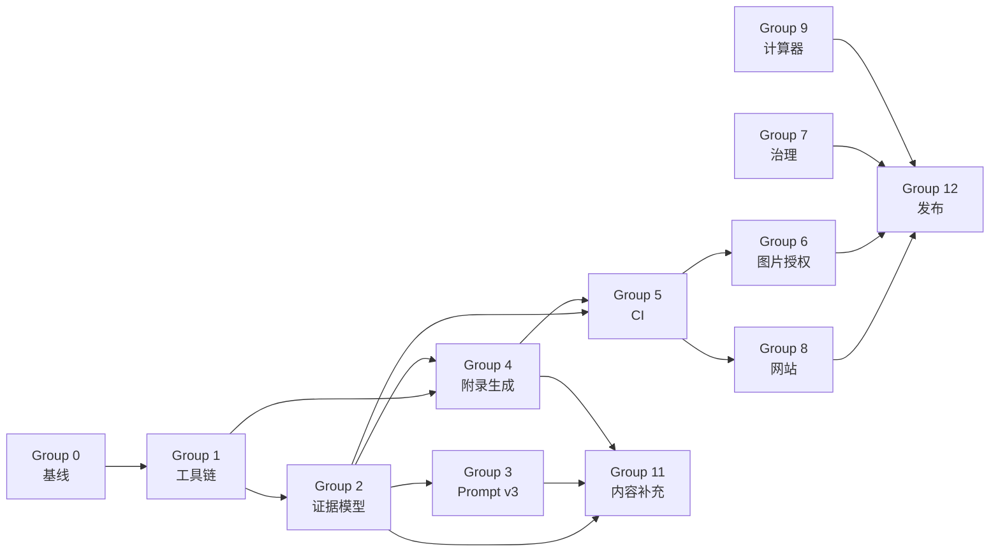

# AI-Infra 仓库优化与补充实施计划

> **目标仓库**：`https://github.com/cdavid817/AI-Infra`  
> **建议变更标识**：`establish-evidence-publication-and-practice-system`  
> **基线日期**：2026-08-24  
> **执行对象**：Claude Code  
> **文档状态**：实施计划，不代表任务已经完成  
> **建议仓库内路径**：`plans/AI-INFRA-OPTIMIZATION-PLAN.md`

---

## 1. 执行摘要

AI-Infra 已形成完整的中文 AI 基础设施知识体系：正文包含七个部分、31 章，另有 A–F 六个附录；全书使用“训练任务生命周期”和“推理请求全链路”两条主线，并建立了统一章节骨架、术语约束和 Mermaid 视觉规范。

当前主要问题不是章节数量不足，而是以下工程能力尚未闭环：

1. **事实、数字和案例缺少统一的机器可验证证据模型**。
2. **附录 A/C 的高时效数据仍以手工 Markdown 表格维护**。
3. **逐章写作 Prompt 强制要求具体数字和生产案例，却没有强制研究包、来源登记和事实审查阶段**。
4. **CI 主要检查本地 Markdown 文件链接，尚未覆盖锚点、外链、证据、结构化数据、图表、授权和生成物漂移**。
5. **缺少稳定的网站、PDF/EPUB、版本化 Release、许可证与引用元数据**。
6. **大量公式和决策树尚未转化为可执行计算器、实验、Runbook 和参考架构**。
7. **DRA、JobSet/MultiKueue、模型感知推理路由、Agent Runtime、MCP、GenAI 可观测性、模型供应链、Agentic RL 和能源强度等主题仍可系统补充**。

本计划的总体目标是把仓库从“内容完整的书稿”升级为：

> **有来源、可审查、可复算、可生成、可测试、可发布、可长期更新的 AI Infra 工程知识库。**

### 1.1 优先级

| 优先级 | 目标 | 是否阻塞正式发布 |
|---|---|---|
| P0 | 证据模型、案例分类、附录数据化、CI 门禁、图片授权、仓库治理 | 是 |
| P1 | 网站、计算器、重点内容补充、模型供应链与可信平面 | 否，但应在首个稳定版本前完成主要部分 |
| P2 | Labs、Runbooks、参考架构、PDF/EPUB、复杂基准与自动化更新 | 否 |

### 1.2 核心实施原则

- **先建立可信度与生成管线，再大规模补正文。**
- **正文保留稳定机制；型号、版本、项目状态进入结构化数据和附录。**
- **任何精确数字必须属于官方规格、公开实测、作者实测、推导估算或示意数据之一。**
- **无法核验的数字不得伪装成真实生产数据。**
- **生成文件不得手工编辑。**
- **每个 Task Group 独立实现、独立验证、独立提交。**
- **不得一次性重写全部章节。**

---

## 2. Claude Code 执行协议

本节是强制执行约束。

### 2.1 开始前必须读取

Claude Code 在修改任何文件前，必须完整读取并理解：

- `README.md`
- `CONTRIBUTING.md`
- `ERRATA.md`
- `ai-infra-book-outline.md`
- `ai-infra-book-prompts.md`
- `.github/workflows/docs.yml`
- `scripts/check-doc-links.mjs`
- `images/SOURCES.md`
- `附录/附录A-加速卡与集群形态速查表.md`
- `附录/附录B-估算公式速查与符号表.md`
- `附录/附录C-框架选型快照.md`
- 第 27–31 章正文

### 2.2 修改纪律

1. 不得把本计划中的判断直接当作事实；实施时必须以仓库当前 HEAD 和官方一手来源为准。
2. 不得编造来源、实验环境、许可证、版本支持状态、性能数据或事故案例。
3. 不得为了让 CI 通过而删除有价值内容、降低检查强度或加入大范围永久豁免。
4. 不得在未完成来源核验时把 `待确认` 改成 `可发布`。
5. 不得手工修改带有 `AUTO-GENERATED` 标记的文件。
6. 不得顺手重排全部 Markdown、全局替换标点或改写与当前 Task Group 无关的章节。
7. 不得在同一提交中混合工具链、正文扩写、数据迁移和许可证决策。
8. 新增依赖必须说明用途，锁定版本并提交 lockfile。
9. GitHub Actions 应使用最小权限；第三方 Action 应固定到不可变 commit SHA，而不是浮动 tag。
10. 不能运行的检查必须如实标注，不能用“预计通过”代替实际结果。

### 2.3 每轮停止条件

默认每轮只处理一个 Task Group。完成后必须停止并报告：

- 当前 HEAD；
- 工作树状态；
- 修改文件列表；
- 实际执行的命令；
- 每条命令的结果摘要；
- 已完成的 checkbox；
- 尚未完成的 checkbox；
- 新发现的问题；
- 是否存在需要用户决策的门禁。

### 2.4 提交纪律

每个 Task Group 至少一个独立提交。推荐提交格式：

```text
chore(docs): establish documentation tooling baseline
feat(evidence): add claim and source registry
refactor(appendices): generate volatile snapshots from data
ci(docs): enforce evidence and publication checks
docs(agent-runtime): extend runtime security and protocol coverage
```

未经明确授权，不要自动 push、创建 PR、合并或发布 Release。

---

## 3. 当前基线与缺口

以下内容必须由 Task Group 0 在当前 HEAD 上重新核验，不得只复述本计划。

### 3.1 已有能力

- 七部分、31 章、A–F 六个附录。
- 两条贯穿主线：训练任务生命周期、推理请求全链路。
- 除第 3 章外统一七段式章节骨架。
- 单点定义原则和跨章节引用纪律。
- Mermaid 主题、语义配色、节点数、图注等规范。
- `CONTRIBUTING.md` 已要求量化结论提供口径、适用边界和一手来源。
- `ERRATA.md` 已作为勘误入口，并定义附录更新要求。
- `images/SOURCES.md` 已建立图片来源与授权台账。
- `scripts/check-doc-links.mjs` 已能检查本地 Markdown 文件目标是否存在。

### 3.2 主要缺口

- 正文案例没有统一标明公开案例、作者实测、合成案例或容量估算。
- 正文数字和外部事实没有统一 claim ID、来源 ID、核验日期和适用版本。
- 附录 A/C 每行数据没有机器可读的一手来源和 freshness 状态。
- 当前链接脚本跳过页面锚点、HTTP 外链和 Mermaid 语义。
- 缺少 Markdown AST 级检查，正则表达式无法可靠处理复杂链接和转义。
- 缺少生成物漂移检查。
- 缺少静态网站、搜索、版本导航和发布构建。
- 缺少正式内容许可证、代码许可证和 `CITATION.cff`。
- 图片台账仍包含未完成授权核验的正式候选图片。
- 没有与公式对应的可执行计算器和固定测试向量。
- 没有结构化 Labs、故障 Runbook 和参考架构目录。

---

## 4. 目标架构

建议最终形成以下逻辑结构。首轮不要求立即搬迁全部现有章节；优先建立新目录和生成边界，避免一次性破坏大量相对链接。

```text
AI-Infra/
├── 第一部分-基础与心智模型/
├── 第二部分-算力底座/
├── 第三部分-数据底座/
├── 第四部分-训练系统/
├── 第五部分-推理系统/
├── 第六部分-上层平台/
├── 第七部分-工程化与治理/
├── 附录/
│   ├── 附录A-加速卡与集群形态速查表.md        # 生成文件
│   ├── 附录B-估算公式速查与符号表.md
│   ├── 附录C-框架选型快照.md                  # 生成文件
│   └── ...
├── data/
│   ├── accelerators/
│   ├── cluster-forms/
│   ├── frameworks/
│   ├── snapshots/
│   └── schemas/
├── references/
│   ├── source-policy.md
│   ├── sources.yaml
│   ├── claims/
│   ├── research-packs/
│   └── schemas/
├── templates/
│   ├── case-metadata.md
│   ├── research-pack.yaml
│   ├── runbook.md
│   ├── lab.md
│   └── reference-architecture.md
├── diagrams/
│   ├── sources/
│   ├── generated/
│   └── manifest.yaml
├── images/
│   ├── SOURCES.md                              # 可由结构化台账生成
│   └── sources.yaml
├── calculators/
│   ├── src/
│   ├── tests/
│   └── examples/
├── labs/
├── runbooks/
├── reference-architectures/
├── benchmarks/
├── site/
├── plans/
├── reports/
├── scripts/
│   ├── lib/
│   ├── tests/
│   ├── check-doc-links.mjs
│   ├── check-doc-anchors.mjs
│   ├── check-external-links.mjs
│   ├── validate-chapters.mjs
│   ├── validate-evidence.mjs
│   ├── validate-data.mjs
│   ├── validate-images.mjs
│   ├── generate-appendices.mjs
│   ├── generate-image-ledger.mjs
│   ├── render-diagrams.mjs
│   └── check-generated-drift.mjs
├── book-manifest.yaml
├── package.json
├── package-lock.json
├── pyproject.toml                              # P1 计算器启用时再增加
├── CITATION.cff
├── CHANGELOG.md
├── MAINTAINERS.md
├── SECURITY.md
├── CODE_OF_CONDUCT.md
├── LICENSE-CONTENT                             # 需用户确认许可证
└── LICENSE-CODE                                # 需用户确认许可证
```

### 4.1 单一事实来源

| 内容 | 单一事实来源 | 生成目标 |
|---|---|---|
| 加速卡规格 | `data/accelerators/*.yaml` | 附录 A |
| 集群形态 | `data/cluster-forms/*.yaml` | 附录 A |
| 框架状态与能力 | `data/frameworks/*.yaml` | 附录 C |
| 来源元数据 | `references/sources.yaml` | 章节引用、报告 |
| 可核验结论 | `references/claims/*.yaml` | CI 证据检查 |
| 图片授权 | `images/sources.yaml` | `images/SOURCES.md` |
| 全书顺序 | `book-manifest.yaml` | README 目录、网站导航、PDF/EPUB |
| 图表源文件 | `diagrams/sources/` | `diagrams/generated/` |

---

## 5. 证据即代码设计

### 5.1 来源分级

所有来源必须归入以下类别：

| 级别 | 类型 | 可用于何种结论 |
|---|---|---|
| L1 | 标准规范、厂商规格页、官方文档、官方 Release、正式论文 | 默认首选，可支持事实、参数、兼容性与机制 |
| L2 | 官方工程博客、官方事故报告、项目维护者说明 | 可支持实践判断，必须标明时间和上下文 |
| L3 | 作者实测 | 可支持实测结论，必须提供环境和复现资产 |
| L4 | 二手技术文章、社区讨论 | 只能作为线索或补充观点，不能单独支撑关键数字 |
| L5 | 合成案例、估算示例 | 只能说明方法，必须明确标记，不能作为现实统计证据 |

禁止把搜索摘要、AI 回答、未核验转载或营销二次解读登记为 L1。

### 5.2 Claim 类型

```text
quantitative        数值、比例、带宽、容量、延迟、功耗、成本
compatibility       框架、硬件、后端、协议兼容性
project_status      项目成熟度、维护状态、稳定性、弃用状态
mechanism           技术机制与因果关系
recommendation      默认选型或强立场判断
incident            公开事故事实
measurement         作者或公开测试结果
estimate            由公式和输入推导的估算
illustrative        仅用于讲解的示意数字
```

### 5.3 `references/sources.yaml` 示例

```yaml
schema_version: 1
sources:
  - id: SRC-K8S-DRA-OFFICIAL
    title: Dynamic Resource Allocation
    publisher: Kubernetes
    source_type: official_documentation
    url: https://kubernetes.io/docs/concepts/scheduling-eviction/dynamic-resource-allocation/
    accessed_at: 2026-08-24
    language: en
    status: active
    license_note: documentation license must be checked before reproducing figures
```

要求：

- `id` 永久稳定，不得因标题变化而改变。
- URL 变化时更新记录，不新建语义重复来源。
- 必须有 `accessed_at`。
- 高时效来源可增加 `expires_at` 或 `review_after_days`。
- 论文应记录 DOI、arXiv ID、版本和图表许可证。

### 5.4 Claim 文件示例

建议按章节拆分：`references/claims/chapter-27.yaml`。

```yaml
schema_version: 1
chapter: 27
claims:
  - id: CLM-027-001
    section: "27.3"
    summary: "普通无状态轮询无法利用实例侧前缀缓存亲和性"
    claim_type: mechanism
    evidence_level: L1
    sources:
      - SRC-GATEWAY-API-INFERENCE-POOL
    applies_to:
      workload: autoregressive_llm_inference
      constraints:
        - prefix_cache_enabled
    status: verified
    reviewed_at: 2026-08-24

  - id: CLM-027-002
    section: "问题场景"
    summary: "示例故障时间线与成功率数字"
    claim_type: illustrative
    evidence_level: L5
    sources: []
    status: illustrative_only
    disclosure: "合成案例，日期与数字均用于说明故障转移方法"
```

### 5.5 作者实测的强制字段

`measurement` 类型必须包含：

```yaml
measurement:
  model: ""
  model_revision: ""
  precision: ""
  input_length_distribution: ""
  output_length_distribution: ""
  concurrency: ""
  hardware: ""
  topology: ""
  software:
    runtime: ""
    version: ""
  measured_at: ""
  warmup: ""
  sample_count: 0
  metric_definition: ""
  result: ""
  reproduction_path: "labs/..."
```

缺少任一关键口径时，不能标记为 `verified`。

### 5.6 案例四分类

每个章节“问题场景”必须在标题后增加可见元数据：

```markdown
> **案例元数据**
> - **案例类型**：公开真实案例 / 作者实测案例 / 合成案例 / 容量估算示例
> - **数据性质**：官方数据 / 公开实测 / 作者实测 / 推导 / 示意
> - **来源或复现**：`CLM-xxx`、公开链接或 `labs/...`
> - **适用边界**：硬件、软件、时间、负载或组织前提
```

规则：

- 公开真实案例必须有来源。
- 作者实测案例必须有复现路径。
- 合成案例必须明确说明人物、日期和数值为抽象或示意。
- 容量估算示例必须列出输入、公式、假设和误差来源。

### 5.7 正文 Claim 标记

首阶段采用对 GitHub 阅读体验影响较小的 HTML 注释：

```markdown
<!-- claim: CLM-027-001 -->
普通无状态轮询无法表达前缀缓存亲和性，因此可能把相同前缀请求分散到不同实例。
```

对于示意数据：

```markdown
<!-- claim: CLM-027-002; classification: illustrative -->
```

后续网站构建可以把 Claim ID 转换为可见脚注或侧栏，不要求第一阶段立即实现复杂转换。

### 5.8 渐进式门禁

证据检查必须分三阶段上线：

1. **audit**：只输出报告，不阻塞。
2. **warn**：新增或修改内容违规时警告；历史债务仍允许存在。
3. **enforce**：指定章节和附录成为硬门禁。

首批强制范围：

- 第 27–31 章；
- 附录 A；
- 附录 C；
- 新增或修改的所有高时效内容。

不得第一天对全书所有数字启用无差别正则硬失败。

---

# 6. Task Group 0：基线、盘点与风险报告

> **优先级：P0**  
> **本组只做盘点，不修改正文含义。**

## 6.1 任务

- [ ] 0.1 记录 `git rev-parse HEAD`、分支、远端和 `git status --short`。
- [ ] 0.2 确认工作树是否干净；发现用户未提交修改时不得覆盖。
- [ ] 0.3 运行当前 `node scripts/check-doc-links.mjs` 并保存原始结果。
- [ ] 0.4 统计 Markdown、图片、Mermaid block、外链、内部锚点、表格数量。
- [ ] 0.5 统计第 27–31 章中含数字、百分比、货币、功率、时间、吞吐、延迟单位的段落。
- [ ] 0.6 盘点第 27–31 章所有问题场景，初步归类为公开、作者实测、合成或估算。
- [ ] 0.7 盘点附录 A 每个型号、集群形态和功率参考项是否存在逐项来源。
- [ ] 0.8 盘点附录 C 每个项目定位、兼容状态和推荐矩阵是否存在逐项来源。
- [ ] 0.9 盘点 `images/SOURCES.md` 中所有 `待确认`、缺少许可证、缺少访问日期的记录。
- [ ] 0.10 盘点仓库是否存在 LICENSE、CITATION、CHANGELOG、SECURITY、MAINTAINERS、CODEOWNERS、Issue/PR 模板。
- [ ] 0.11 盘点 GitHub Actions 权限、Action 固定方式和 Node 版本。
- [ ] 0.12 生成 `reports/optimization-baseline.md`。
- [ ] 0.13 报告不得自动修改任务结论，不得把启发式扫描结果写成确定事实。

## 6.2 基线报告至少包含

```text
仓库 HEAD
工作树状态
文件数量
章节与附录清单
现有检查命令及结果
证据缺口统计
附录来源覆盖率
图片授权状态
CI 能力矩阵
高风险文件
建议迁移顺序
```

## 6.3 验收标准

- 基线报告可复现。
- 没有正文语义变更。
- 当前检查结果被真实记录。
- 所有统计脚本或命令均写入报告。
- 工作树最终只包含计划文件和基线报告相关变更。

## 6.4 停止门禁

完成 Group 0 后必须停止，等待确认再进入 Group 1。

---

# 7. Task Group 1：文档工具链基础

> **优先级：P0**

## 7.1 设计目标

把零散脚本升级为可测试、可组合、可在本地和 CI 中统一执行的 Node 22 文档工具链。

## 7.2 任务

- [ ] 1.1 新增 `package.json` 和 `package-lock.json`。
- [ ] 1.2 统一声明 Node 22 运行要求。
- [ ] 1.3 优先使用 `node:test` 编写脚本测试，避免为测试再引入大型框架。
- [ ] 1.4 使用 Markdown AST 解析器替代核心正则扫描逻辑。
- [ ] 1.5 引入 GitHub-compatible slugger，用于准确计算标题锚点。
- [ ] 1.6 建立 `scripts/lib/`，抽取文件发现、Markdown 解析、路径规范化、诊断输出等公共能力。
- [ ] 1.7 保留 `node scripts/check-doc-links.mjs` 兼容入口，但内部改用新库。
- [ ] 1.8 新增 fixture，覆盖中文文件名、URL 编码、相对路径、图片、带标题链接、括号、锚点和重复标题。
- [ ] 1.9 Windows、macOS、Linux 路径处理必须使用 Node Path API，不手拼分隔符。
- [ ] 1.10 不得依赖系统安装的 `rg` 才能运行核心检查；可将 `rg` 作为可选加速路径。
- [ ] 1.11 增加统一命令：`npm run docs:check:local-links`。
- [ ] 1.12 增加统一命令：`npm run test:docs-tools`。
- [ ] 1.13 更新 `CONTRIBUTING.md` 的本地命令说明。

## 7.3 推荐依赖边界

可选择但不强制以下类别：

- `unified`
- `remark-parse`
- `remark-gfm`
- `github-slugger`
- `yaml`
- `ajv`

依赖版本由实施时选择稳定版本并锁定，不要把浮动最新版写进正文。

## 7.4 验收标准

- 原有有效链接继续通过。
- fixture 中的无效链接稳定失败。
- 中文路径和锚点行为有自动测试。
- 无 `rg` 环境仍可执行。
- `npm ci && npm run test:docs-tools && npm run docs:check:local-links` 全部通过。

---

# 8. Task Group 2：来源注册、Claim Schema 与案例分类

> **优先级：P0**

## 8.1 任务

- [ ] 2.1 新增 `references/source-policy.md`。
- [ ] 2.2 新增 `references/schemas/source.schema.json`。
- [ ] 2.3 新增 `references/schemas/claim.schema.json`。
- [ ] 2.4 新增 `references/sources.yaml`。
- [ ] 2.5 按章节新增 `references/claims/chapter-27.yaml` 至 `chapter-31.yaml`。
- [ ] 2.6 新增 `templates/case-metadata.md`。
- [ ] 2.7 新增 `scripts/validate-evidence.mjs`。
- [ ] 2.8 为 source ID 重复、claim ID 重复、未知 source ID、缺少访问日期编写失败测试。
- [ ] 2.9 为作者实测缺少环境字段编写失败测试。
- [ ] 2.10 为 `illustrative` 误标成 `verified` 编写失败测试。
- [ ] 2.11 为高时效 claim 缺少复核日期编写失败测试。
- [ ] 2.12 为已过期来源输出单独诊断，区分 warning 和 error。
- [ ] 2.13 第 27–31 章所有问题场景增加可见案例元数据。
- [ ] 2.14 公开案例补官方或原始来源。
- [ ] 2.15 无法证明为真实案例的内容改标“合成案例”，不得反向编造来源。
- [ ] 2.16 估算案例补输入、公式、假设和误差来源。
- [ ] 2.17 第 27–31 章关键量化结论添加 Claim 标记。
- [ ] 2.18 为每章新增“来源、口径与复现说明”小节或等效集中入口。
- [ ] 2.19 更新 `CONTRIBUTING.md`，明确案例四分类和 Claim 规则。
- [ ] 2.20 更新 `ERRATA.md`，说明 Claim 修订和来源撤销流程。
- [ ] 2.21 首次迁移以 audit 报告为准，不得用启发式脚本批量自动判真伪。

## 8.2 强制约束

- 第 27–31 章中出现的具体事故日期、成功率、延迟、内存、预算、功率和 QPS 必须被分类。
- 无来源的精确数字只能保留为明确的示意或估算。
- 内容语义调整必须尽可能小，不做文学性重写。
- 不得把“常见”“事实标准”“生产主力”“默认方案”等强判断留在无证据状态。

## 8.3 验收标准

- `references/sources.yaml` 和五个章节 Claim 文件通过 JSON Schema。
- 第 27–31 章每个问题场景均可看见案例类型。
- 关键数字可追溯到 Claim 或明确示意标记。
- 不存在指向未知 source ID 的 Claim。
- `npm run docs:check:evidence` 通过首批强制范围。

---

# 9. Task Group 3：研究包与写作 Prompt v3

> **优先级：P0**

## 9.1 问题

现有 Prompt 同时要求“真实生产困境”“必须有数字”和强观点，却没有先研究、再写作、再事实审查的硬流程。这会诱发看似具体但无法核验的内容。

## 9.2 目标流程

```text
Research Pack
  → 章节草稿
  → Claim/来源登记
  → 事实与口径审查
  → 结构与语言审查
  → CI
```

## 9.3 任务

- [ ] 3.1 将 `ai-infra-book-prompts.md` 升级为 v3，保留历史说明。
- [ ] 3.2 增加“禁止编造来源、案例和数字”总则。
- [ ] 3.3 增加“无法核验时降级为合成案例或估算示例”规则。
- [ ] 3.4 增加来源分级与一手来源优先规则。
- [ ] 3.5 增加 `Research Pack` 强制阶段。
- [ ] 3.6 新增 `templates/research-pack.yaml`。
- [ ] 3.7 Research Pack 必须列出 claims、sources、open questions、conflicting sources、volatile facts。
- [ ] 3.8 新增事实审查 Prompt，检查稠密/稀疏、单向/双向、峰值/持续、已发布/路线图等口径。
- [ ] 3.9 新增语言与结构审查 Prompt，不允许在事实审查前润色掩盖问题。
- [ ] 3.10 强观点必须绑定依据、边界和时间；删除“仅凭年份断言某方案没有理由再用”的模板倾向。
- [ ] 3.11 问题场景要求改为“四类案例之一”，不再无条件要求真实案例。
- [ ] 3.12 更新每章 Prompt 中与新增主题有关的覆盖项。
- [ ] 3.13 增加 Prompt 静态检查，确保每章仍包含既定骨架和交付物要求。
- [ ] 3.14 在 `CONTRIBUTING.md` 中写明 AI 辅助写作的证据责任仍由提交者承担。

## 9.4 Research Pack 示例

```yaml
schema_version: 1
chapter: 28
prepared_at: 2026-08-24
scope:
  included:
    - sandbox lifecycle
    - tool authorization
    - durable execution
  excluded:
    - agent reasoning algorithms
claims:
  - proposed_id: CLM-028-NEW-001
    statement: ""
    claim_type: mechanism
    candidate_sources:
      - SRC-MCP-SPEC-CURRENT
    confidence: medium
open_questions:
  - "MCP Tasks 在当前正式规范中的稳定性与取消语义是什么？"
conflicting_sources: []
volatile_facts:
  - statement: "当前 MCP 正式规范日期"
    review_required: true
```

## 9.5 验收标准

- Prompt 不再鼓励无来源数字。
- 新章或大改章节必须先有 Research Pack。
- Prompt 明确区分事实审查和语言审查。
- v3 继续保留全书边界、单点定义和 Mermaid 规范。

---

# 10. Task Group 4：附录 A/C 结构化数据与自动生成

> **优先级：P0**

## 10.1 总体要求

保持当前附录文件路径不变，避免破坏 README 和章节链接；附录 A/C 改为生成文件，并在文件顶部写入：

```markdown
<!-- AUTO-GENERATED. DO NOT EDIT DIRECTLY. -->
<!-- Source: data/... ; Generator: scripts/generate-appendices.mjs -->
```

## 10.2 加速卡 Schema

每个设备至少包含：

```yaml
schema_version: 1
id: nvidia-h100-sxm-80gb
vendor: NVIDIA
model: H100
form_factor: SXM
availability:
  state: generally_available
  verified_at: 2026-08-24
memory:
  capacity_gib: 80
  type: HBM3
  bandwidth:
    value: 3.35
    unit: TB/s
    directionality: not_applicable
    metric_type: peak
interconnect:
  name: NVLink
  generation: 4
  per_device_aggregate:
    value: 900
    unit: GB/s
    directionality: bidirectional
compute:
  - precision: FP8
    value: 1979
    unit: TFLOPS
    sparsity: dense
    metric_type: peak
power:
  tdp_w: 700
sources:
  - SRC-NVIDIA-H100-SPEC
review:
  reviewed_at: 2026-08-24
  review_after_days: 365
notes: []
```

关键规则：

- 互联代际和带宽必须拆字段，禁止继续使用 `NVLink 4,900 GB/s` 这类歧义格式。
- 每个算力值都要标精度、稠密/稀疏、峰值/持续。
- 路线图、已发布、GA、停产必须分开。
- 未公开数据用 `null`，不能用猜测补齐。
- `≈` 数据必须有 `confidence`、来源和说明。

## 10.3 框架 Schema

```yaml
schema_version: 1
id: vllm
name: vLLM
category: inference_runtime
layers:
  - runtime_engine
workloads:
  - autoregressive_text_generation
maturity:
  status: active
  verified_at: 2026-08-24
backends:
  - name: cuda
    support: official
  - name: ascend
    support: verify_current_status
capabilities:
  - continuous_batching
  - paged_kv_cache
limitations: []
official:
  repository: ""
  documentation: ""
  releases: ""
sources:
  - SRC-VLLM-OFFICIAL-DOCS
review_after_days: 180
```

关键规则：

- “事实标准”“生产主力”“官方支持”“社区适配中”都必须有来源和核验日期。
- 推荐矩阵必须区分事实字段和作者判断字段。
- 推荐项需要列出失效边界，不能由生成器凭空推导。
- 版本和状态进入附录，不扩散到正文机制描述。

## 10.4 任务

- [ ] 4.1 新增 accelerator、cluster-form、framework JSON Schema。
- [ ] 4.2 新增 Schema 正反例 fixture。
- [ ] 4.3 从附录 A 抽取设备记录，不改变原始语义。
- [ ] 4.4 从附录 A 抽取集群形态和功率密度记录。
- [ ] 4.5 对每项补来源 ID；无法补齐时标记 `unverified`，不得猜测。
- [ ] 4.6 从附录 C 抽取框架记录。
- [ ] 4.7 区分项目事实、兼容性事实和作者推荐。
- [ ] 4.8 新增 `scripts/validate-data.mjs`。
- [ ] 4.9 新增 `scripts/generate-appendices.mjs`。
- [ ] 4.10 生成结果保持现有章节、标题和主要阅读结构。
- [ ] 4.11 生成器输出稳定排序，连续两次生成不得产生差异。
- [ ] 4.12 新增 `scripts/check-generated-drift.mjs`。
- [ ] 4.13 CI 中运行生成器后执行 `git diff --exit-code`。
- [ ] 4.14 更新 `ERRATA.md`，将更新入口指向数据文件而非生成 Markdown。
- [ ] 4.15 更新 `CONTRIBUTING.md`，禁止直接改生成附录。
- [ ] 4.16 为过期记录输出 freshness 报告。
- [ ] 4.17 保留数据快照日期，但不得把“生成日期”冒充“来源核验日期”。

## 10.5 验收标准

- 附录 A/C 可以从空工作树稳定重新生成。
- 所有记录通过 Schema。
- 每个已验证数据项至少有一个 source ID。
- `unverified` 项在生成表格中有明确视觉标识。
- 手改生成文件后 drift 检查稳定失败。

---

# 11. Task Group 5：文档 CI 与发布门禁

> **优先级：P0**

## 11.1 CI 作业设计

| Job | PR | main | nightly | 失败策略 |
|---|---:|---:|---:|---|
| Markdown 工具单测 | 是 | 是 | 是 | hard fail |
| 本地文件链接 | 是 | 是 | 是 | hard fail |
| 标题锚点 | 是 | 是 | 是 | hard fail |
| Markdown 结构与风格 | 是 | 是 | 是 | hard fail，合理规则可配置 |
| Evidence Schema | 是 | 是 | 是 | 首批范围 hard fail |
| Data Schema | 是 | 是 | 是 | hard fail |
| 生成物漂移 | 是 | 是 | 是 | hard fail |
| 图片台账 | 是 | 是 | 是 | 未登记 hard fail；待确认 release fail |
| Mermaid 语法/渲染 | 是 | 是 | 是 | hard fail |
| 外链 | 可选轻量 | 是 | 是 | 404/410 hard fail；403/429/timeout warning |
| freshness | warning | warning | 是 | 达到阈值后升级 |
| 网站构建 | P1 | P1 | P1 | hard fail |
| PDF/EPUB | P2 | P2 | P2 | hard fail |

## 11.2 任务

- [ ] 5.1 拆分 `.github/workflows/docs.yml` 或重构为职责清晰的多个 job。
- [ ] 5.2 显式设置 `permissions: contents: read`。
- [ ] 5.3 第三方 Action 固定 commit SHA，并添加注释说明原 tag。
- [ ] 5.4 启用 npm 缓存但不得缓存未锁定依赖。
- [ ] 5.5 新增 Markdown AST 本地链接检查。
- [ ] 5.6 新增 GitHub 风格标题锚点检查。
- [ ] 5.7 检查重复标题导致的 slug 后缀。
- [ ] 5.8 检查 README 和章节中的跨文件锚点。
- [ ] 5.9 引入或实现适合中文书稿的 Markdown lint 配置；关闭无意义的英文行宽规则。
- [ ] 5.10 新增章节骨架验证脚本。
- [ ] 5.11 第 3 章按例外 Schema 验证。
- [ ] 5.12 验证每章结尾包含可验证交付物。
- [ ] 5.13 验证 Mermaid 图注存在。
- [ ] 5.14 验证红色样式只用于故障/瓶颈的可自动部分；语义无法自动确认的输出人工审查清单。
- [ ] 5.15 接入 evidence 和 data Schema 检查。
- [ ] 5.16 接入生成物 drift 检查。
- [ ] 5.17 新增外链检查，支持重试、超时、User-Agent 和 allowlist。
- [ ] 5.18 对 403、429、TLS 临时故障和网络超时不得直接判死链。
- [ ] 5.19 将外链完整检查放到 nightly，PR 只检查新增/修改外链或采用缓存结果。
- [ ] 5.20 新增 freshness 报告 Artifact。
- [ ] 5.21 CI 日志必须输出文件、行号、规则 ID 和修复建议。
- [ ] 5.22 添加 workflow concurrency，取消同一 PR 的旧运行。
- [ ] 5.23 添加最小 fixture PR 场景，证明每个门禁确实能失败。

## 11.3 不允许的实现

- 不允许用单个巨型脚本承担所有职责。
- 不允许外链一次 timeout 就永久失败。
- 不允许忽略全部中文锚点。
- 不允许用全局 `continue-on-error: true` 假装 CI 通过。
- 不允许让生成脚本在 CI 中直接提交文件。

## 11.4 验收标准

- 人为破坏一个锚点时 CI 失败。
- 人为添加未知 Claim ID 时 CI 失败。
- 人为修改生成附录时 CI 失败。
- 人为添加未登记图片时 CI 失败。
- 临时 429 不被误判为永久死链。
- main 与 PR 使用同一套确定性检查。

---

# 12. Task Group 6：图片、图表源文件与授权闭环

> **优先级：P0**

## 12.1 目标

正式发布版本不得包含来源不明、许可证不明或无法满足署名要求的图片。

## 12.2 任务

- [ ] 6.1 将 `images/SOURCES.md` 迁移为 `images/sources.yaml` 的生成结果，或至少建立可验证 Schema。
- [ ] 6.2 每张图片记录 SHA-256，防止文件被替换但台账不变。
- [ ] 6.3 增加来源 URL、访问日期、许可证文本、署名要求、修改许可和发布状态。
- [ ] 6.4 检测 `images/` 下未登记文件。
- [ ] 6.5 检测台账记录指向不存在文件。
- [ ] 6.6 检测正文引用但台账缺失的图片。
- [ ] 6.7 对五张或当前仍待确认的论文图逐项核验原始许可证。
- [ ] 6.8 无法确认时，基于机制重新自绘，不直接描摹受限图表。
- [ ] 6.9 自绘图必须保留设计源文件，不能只提交 PNG。
- [ ] 6.10 统一图命名、图号、alt text 和图注。
- [ ] 6.11 `diagrams/sources/` 保存 Mermaid、D2、SVG 源或其他可编辑格式。
- [ ] 6.12 `diagrams/generated/` 只保存生成产物。
- [ ] 6.13 新增图表清单 `diagrams/manifest.yaml`。
- [ ] 6.14 对 Mermaid 执行语法与渲染检查。
- [ ] 6.15 正式 Release job 遇到 `待确认` 必须失败；普通 PR 可 warning。

## 12.3 验收标准

- 每张被正文引用的非纯 Mermaid 图片都有台账。
- 每张台账图片都有实际文件。
- 发布候选版本不存在 `待确认` 图片。
- 自绘图有源文件和可重复生成路径。

---

# 13. Task Group 7：仓库治理、许可证与版本制度

> **优先级：P0**

## 13.1 用户决策门禁

许可证具有法律效果，Claude Code 不得未经用户确认直接替仓库选择最终许可证。

建议候选：

- 内容：CC BY 4.0 或 CC BY-SA 4.0；
- 代码、脚本和计算器：Apache-2.0 或 MIT。

Claude Code 应先生成 `reports/license-options.md`，说明署名、衍生作品、商业使用、专利条款和第三方内容影响，然后停止等待选择。

## 13.2 任务

- [ ] 7.1 生成许可证选项报告，不自动决定。
- [ ] 7.2 用户确认后新增 `LICENSE-CONTENT`。
- [ ] 7.3 用户确认后新增 `LICENSE-CODE`。
- [ ] 7.4 README 清楚说明哪些目录适用内容许可证、哪些适用代码许可证。
- [ ] 7.5 新增 `CITATION.cff`。
- [ ] 7.6 新增 `CHANGELOG.md`，采用面向读者的版本变更分类。
- [ ] 7.7 新增 `MAINTAINERS.md`。
- [ ] 7.8 新增 `SECURITY.md`，覆盖恶意链接、供应链依赖和脚本安全问题。
- [ ] 7.9 新增 `CODE_OF_CONDUCT.md`。
- [ ] 7.10 新增 `.github/CODEOWNERS`，高时效数据和发布工作流应有明确审查者。
- [ ] 7.11 新增事实勘误、数据更新、内容提议、图片授权 Issue 模板。
- [ ] 7.12 新增 PR 模板，要求列出来源、口径、生成命令和检查结果。
- [ ] 7.13 新增 `book-version.yaml` 或等效版本单一来源。
- [ ] 7.14 定义 `v0.x` 阶段的版本语义。
- [ ] 7.15 定义勘误版本、内容版本和数据快照版本的关系。
- [ ] 7.16 新增 GitHub About、website、topics 的人工配置清单；仓库代码无法直接修改时不得谎称已完成。

## 13.3 验收标准

- 许可证决策有用户证据。
- 内容和代码范围无歧义。
- 仓库可被学术或技术文章标准引用。
- PR 模板能阻止无来源的高时效改动静默进入。

---

# 14. Task Group 8：静态网站与出版构建

> **优先级：P1**

## 14.1 单一目录清单

新增 `book-manifest.yaml`，作为以下内容的单一顺序来源：

- README 目录；
- 网站侧边栏；
- 上一章/下一章；
- PDF/EPUB 章节顺序；
- 全书缺章和重复章检查。

示例：

```yaml
schema_version: 1
book:
  title: AI Infra
  language: zh-CN
parts:
  - id: part-1
    title: 第一部分 基础与心智模型
    chapters:
      - number: 1
        path: 第一部分-基础与心智模型/第01章-从大数据基础设施到AI基础设施.md
      - number: 2
        path: 第一部分-基础与心智模型/第02章-两条主线解剖与框架地图.md
```

## 14.2 网站要求

- 中文全文搜索。
- Mermaid 渲染。
- 数学公式。
- 上一章/下一章。
- 章节阅读路径。
- Claim 和来源跳转。
- 数据快照日期和过期提示。
- 当前版本和历史版本提示。
- 移动端可读。
- 不复制维护两份正文。

## 14.3 任务

- [ ] 8.1 选择一个静态站点生成器并记录 ADR；优先评估 VitePress、MkDocs Material 或同等方案。
- [ ] 8.2 不得为了站点构建立即搬迁所有中文章节目录。
- [ ] 8.3 新增 `book-manifest.yaml` 和 Schema。
- [ ] 8.4 从 manifest 生成网站导航。
- [ ] 8.5 从 manifest 校验 README 目录完整性。
- [ ] 8.6 支持 Mermaid 和数学公式。
- [ ] 8.7 支持本地全文搜索。
- [ ] 8.8 支持 Claim ID 和来源侧栏或脚注。
- [ ] 8.9 支持数据 freshness 标识。
- [ ] 8.10 添加 GitHub Pages 构建，但发布动作需显式授权。
- [ ] 8.11 PR 构建站点但不自动部署生产。
- [ ] 8.12 P2 再接入 PDF/EPUB，优先复用已生成 SVG 图，而不是截图 Mermaid。
- [ ] 8.13 PDF/EPUB 构建必须检查缺字字体、公式、分页、表格溢出和图片清晰度。
- [ ] 8.14 不得把容器内字体文件作为仓库产物提交。

## 14.4 验收标准

- 网站可从干净 checkout 构建。
- 网站和 README 的目录顺序来自同一 manifest。
- 中文路径和锚点有效。
- 不存在正文副本漂移。

---

# 15. Task Group 9：可执行估算器

> **优先级：P1**

## 15.1 技术边界

建议使用 Python 构建计算器，Node 继续只承担文档工具链。新增 `pyproject.toml`，使用标准库优先，测试使用 `pytest`。不得让计算器输出看似精确但未说明假设的卡数或成本。

每个计算器必须输出：

- 输入；
- 公式；
- 单位；
- 假设；
- 安全余量；
- 敏感参数；
- 不确定性；
- 建议通过何种实测替换默认值。

## 15.2 第一批计算器

### 9.2.1 模型显存

- 权重；
- 梯度；
- 优化器状态；
- 激活值；
- KV Cache；
- allocator 和运行时余量；
- DP/TP/PP/EP/ZeRO/FSDP 的切分影响。

### 9.2.2 KV Cache 容量

- batch；
- 并发；
- 输入/输出长度分布；
- 层数；
- KV heads；
- head dimension；
- KV 精度；
- Prefix Cache 命中率；
- 分页碎片和安全水位。

### 9.2.3 训练算力与时长

- 参数量；
- token 数；
- 训练 FLOPs 近似；
- 峰值算力；
- MFU；
- 卡数；
- 故障与 checkpoint 开销。

### 9.2.4 集合通信

- collective 类型；
- 数据量；
- rank 数；
- 拓扑域；
- 有效带宽；
- latency 项；
- 重叠比例。

### 9.2.5 Checkpoint 窗口

- checkpoint 大小；
- 并发 writer；
- 持续写带宽；
- 元数据开销；
- 上传和校验；
- 训练停顿预算。

### 9.2.6 推理容量

- QPS；
- 输入/输出长度分布；
- TTFT/TPOT SLO；
- 单实例实测吞吐；
- 并发上限；
- 冗余和故障域；
- 扩缩容冷启动。

### 9.2.7 功率与 TCO

- 卡、主机、网络、存储功耗；
- PUE；
- 机柜密度；
- 电价；
- 机房改造；
- 运维人力；
- 折旧；
- 云、自建和混合对比。

## 15.3 任务

- [ ] 9.1 建立 Python 包结构和类型检查策略。
- [ ] 9.2 为每个公式建立固定测试向量。
- [ ] 9.3 公式编号与附录 B、对应章节双向链接。
- [ ] 9.4 提供 CLI 和 Python API。
- [ ] 9.5 支持人类可读和 JSON 输出。
- [ ] 9.6 所有单位显式，不允许裸浮点含义依赖上下文。
- [ ] 9.7 对无效输入、负数、零带宽、冲突参数给出明确错误。
- [ ] 9.8 对敏感参数提供区间或场景分析。
- [ ] 9.9 示例不得使用无法核验的“典型性能”作为事实默认值。
- [ ] 9.10 README 增加计算器入口。
- [ ] 9.11 CI 运行单元测试和示例 smoke test。
- [ ] 9.12 与正文公式发现不一致时，先登记问题，不偷偷选择一边。

## 15.4 验收标准

- 每个计算器至少有正常、边界和错误测试。
- 输出包含假设和不确定性。
- 示例可从干净环境执行。
- 计算器与书中公式无静默漂移。

---

# 16. Task Group 10：Labs、Runbooks 与参考架构

> **优先级：P2**

## 16.1 Labs 分层

```text
Level 0：无 GPU，可在普通开发机运行
Level 1：单 GPU
Level 2：单机多 GPU
Level 3：Kubernetes/Slurm 集群
```

每个 Lab 必须标明等级、成本、安全风险、预计资源、清理步骤和成功判据。

## 16.2 建议 Labs

- [ ] 10.1 Roofline 与算术强度可视化。
- [ ] 10.2 GPU 拓扑和互联域识别。
- [ ] 10.3 AllReduce/All2All 基准与有效带宽。
- [ ] 10.4 Kueue/Gang Scheduling 小型演示。
- [ ] 10.5 Checkpoint 写入窗口基准。
- [ ] 10.6 vLLM/SGLang 批处理与 KV Cache 观测。
- [ ] 10.7 Prefix Cache 与请求亲和性。
- [ ] 10.8 InferencePool/EPP 模型感知路由。
- [ ] 10.9 Agent 沙箱、工具权限和取消。
- [ ] 10.10 OpenTelemetry GenAI Trace。
- [ ] 10.11 模型包、AI/ML-BOM、签名和验证。

## 16.3 建议 Runbooks

- [ ] 10.12 训练 hang。
- [ ] 10.13 NCCL/HCCL timeout。
- [ ] 10.14 GPU XID/ECC。
- [ ] 10.15 Straggler。
- [ ] 10.16 Checkpoint stall。
- [ ] 10.17 OOM 与碎片。
- [ ] 10.18 推理队列爆炸。
- [ ] 10.19 KV Cache thrashing。
- [ ] 10.20 网关供应商故障。
- [ ] 10.21 模型质量回归。
- [ ] 10.22 Agent 凭据泄漏。
- [ ] 10.23 沙箱逃逸或策略失效事件。

统一模板：

```text
现象
影响范围
立即止损
证据采集
诊断决策树
修复
恢复验证
复盘数据
长期防复发
```

## 16.4 参考架构

- [ ] 10.24 单机 8 卡开发/微调平台。
- [ ] 10.25 64–128 卡训练集群。
- [ ] 10.26 千卡训练集群。
- [ ] 10.27 多模型在线推理平台。
- [ ] 10.28 异构算力平台。
- [ ] 10.29 Agent 平台。
- [ ] 10.30 多集群 AI 平台。

每个参考架构必须包含：

- 目标与非目标；
- 组件图；
- 数据流和控制流；
- 容量模型；
- 故障域；
- 安全边界；
- 可观测性；
- 运维 Runbook；
- 成本驱动项；
- 失效边界。

---

# 17. Task Group 11：正文主题补充

> **优先级：P1**  
> **原则：优先嵌入现有章节，不为每个新名词单独新建一章。**

每个子组必须先创建 Research Pack，再修改正文和附录。

## 17.1 可信平面与模型供应链

### 目标文件

- 第 2 章；
- 第 8/9/13/19/27/28/30/31 章；
- 附录 C；
- 可新增安全/供应链附录，但需先证明跨章引用价值。

### 必须覆盖

- Identity、Policy、Provenance、Signature、Attestation、Admission、Audit、Revocation。
- 用户身份、Agent 身份、工作负载身份和服务身份的区别。
- 数据集、代码、配置、Tokenizer、权重、评测、运行时依赖的完整血缘。
- 模型包签名和验证。
- SLSA provenance。
- SPDX AI/Dataset Profile 或 CycloneDX AI/ML-BOM 的适用边界。
- Sigstore/Cosign 或等价机制。
- 准入策略、撤销和回滚。
- 高敏感场景下的机密计算与远程证明，只讲基础设施边界。

### 任务

- [ ] 11.1 在第 2 章全景图中增加横切可信平面。
- [ ] 11.2 第 13 章增加数据来源、许可证、敏感数据和删除传播。
- [ ] 11.3 第 19 章增加训练任务短期凭据和最小权限。
- [ ] 11.4 第 27 章增加用户身份透传、租户边界和网关凭据托管。
- [ ] 11.5 第 28 章增加工具凭据代理和审批。
- [ ] 11.6 第 30 章把模型五元组扩展为可签名模型供应链包。
- [ ] 11.7 增加 AI/ML-BOM 和 provenance 关系图。
- [ ] 11.8 增加制品撤销和紧急回滚路径。
- [ ] 11.9 第 31 章增加安全与合规成本项。
- [ ] 11.10 所有标准状态和版本只进入来源记录或附录，不固化为永恒正文事实。

## 17.2 Kubernetes Dynamic Resource Allocation

### 目标文件

- 第 8 章；
- 第 9 章；
- 附录 C。

### 必须覆盖

- Device Plugin 与 DRA 的职责边界。
- DeviceClass、ResourceClaim、ResourceClaimTemplate。
- 设备属性选择和组合分配。
- GPU、NIC、DPU、FPGA 等泛设备模型。
- GPU 与 RDMA NIC 联合需求。
- 设备共享与拓扑约束。
- 驱动和节点生命周期。
- RBAC 和 ResourceClaim status 更新的安全边界。
- 迁移和失效边界。

### 任务

- [ ] 11.11 创建 DRA Research Pack。
- [ ] 11.12 在第 8 章加入 Device Plugin vs DRA 对照表。
- [ ] 11.13 增加 ResourceClaim 生命周期图。
- [ ] 11.14 增加拓扑与联合设备分配场景。
- [ ] 11.15 增加安全和运维风险。
- [ ] 11.16 更新第 8 章决策树。
- [ ] 11.17 附录 C 登记当前生态状态和核验日期。

## 17.3 JobSet、Kueue 与 MultiKueue

### 目标文件

- 第 9 章；
- 第 19 章；
- 第 20 章；
- 附录 C。

### 必须覆盖

- 多角色训练作业作为一个生命周期单元。
- launcher、worker、parameter/reward/rollout 服务。
- 成功策略和失败策略。
- Workload 准入、配额和拓扑。
- 管理集群与执行集群分离。
- MultiKueue 状态代理、所有权、重试和一致性。
- 数据位置、地域、网络和队列的联合决策。
- 跨集群失败与清理。

### 任务

- [ ] 11.18 创建 JobSet/MultiKueue Research Pack。
- [ ] 11.19 第 9 章增加“调度准入”和“作业控制器”边界。
- [ ] 11.20 第 19 章增加多角色作业接口。
- [ ] 11.21 第 20 章增加跨集群故障语义。
- [ ] 11.22 增加 manager/worker cluster 状态流图。
- [ ] 11.23 更新附录 C 的项目清单与失效边界。

## 17.4 模型感知推理路由

### 目标文件

- 第 24 章；
- 第 25 章；
- 第 27 章；
- 附录 C。

### 必须覆盖

```text
业务网关
  → 模型级路由
  → InferencePool
  → Endpoint Picker
  → 模型实例
```

区分：

- 业务 API 网关；
- 模型/版本路由；
- 实例级请求调度；
- 推理引擎内部 batch 调度。

路由信号至少包括：

- KV Cache 利用率；
- Prefix Cache 亲和性；
- 等待队列；
- 当前 Decode 数；
- 活跃 LoRA Adapter；
- 模型版本；
- 优先级和 SLO。

### 任务

- [ ] 11.24 创建 Inference Gateway Research Pack。
- [ ] 11.25 第 24 章明确实例级和引擎内部调度边界。
- [ ] 11.26 第 27 章明确业务网关与 InferencePool 边界。
- [ ] 11.27 增加普通轮询失效场景。
- [ ] 11.28 增加 EPP 数据流和控制流图。
- [ ] 11.29 增加灰度、故障转移和缓存亲和性冲突矩阵。
- [ ] 11.30 附录 C 记录实现项目和当前状态，不把具体版本写进正文。

## 17.5 Agent Runtime 2.0 与 MCP

### 目标文件

- 第 27 章；
- 第 28 章；
- 第 29 章；
- 第 30 章；
- 附录 C。

### 基础设施范围

#### 协议与工具

- MCP Server 注册与发现；
- 协议和能力协商；
- 工具输入/输出 Schema；
- 资源、Prompt、Tool 和 Task 的边界；
- 长任务、取消、进度和异步结果；
- 健康检查、重试和幂等性。

#### 身份与权限

- 用户委托；
- Agent 身份；
- 子 Agent 权限衰减；
- 工具级、资源级、参数级授权；
- 凭据代理；
- 高风险操作审批；
- 审批与请求哈希绑定。

#### 持久执行

- Step checkpoint；
- 事件日志；
- 可恢复执行；
- 工具调用去重；
- Session fork；
- 超时、取消和补偿；
- 确定性重放；
- Token、时间、资金和工具调用预算。

#### 安全

- Prompt injection；
- Tool poisoning；
- MCP Server 信任等级；
- 工具输出污染；
- 数据外泄；
- SSRF；
- 沙箱逃逸；
- 审计与取证。

### 任务

- [ ] 11.31 创建 MCP/Agent Runtime Research Pack。
- [ ] 11.32 重画 Agent Runtime 组件边界图。
- [ ] 11.33 增加 Tool Registry、Policy Decision、Credential Broker、Sandbox、Durable State。
- [ ] 11.34 增加 sync tool call 与 long-running task 的状态机。
- [ ] 11.35 增加取消、超时、重试、补偿和幂等性表。
- [ ] 11.36 增加父子 Agent 权限衰减模型。
- [ ] 11.37 增加审批绑定和 TOCTOU 风险。
- [ ] 11.38 增加凭据绝不进入 Prompt/长期 Session 的原则。
- [ ] 11.39 增加沙箱级别与启动成本/隔离强度决策树。
- [ ] 11.40 第 29 章对齐 Agent/Tool/MCP Trace。
- [ ] 11.41 第 30 章增加 Agent 配置、工具清单和策略版本血缘。
- [ ] 11.42 不讨论 Agent 推理算法、人格设计或提示技巧，保持 Infra 边界。

## 17.6 OpenTelemetry GenAI 可观测性

### 目标文件

- 第 27–29 章；
- 附录 C；
- 相关 Lab。

### 必须覆盖

- Model、Agent、Tool、Retrieval、MCP、Sandbox span。
- 输入/输出 token。
- Cache read/write。
- Finish reason。
- TTFT、TPOT 和请求端到端延迟的测量位置。
- 评测 run 与生产 trace 关联。
- Prompt/Completion 默认不采集。
- PII 脱敏和内容采集显式授权。
- 高基数属性、采样、保留时间和成本。
- 语义规范仍可能演进，稳定性状态必须标注。

### 任务

- [ ] 11.43 创建 OTel GenAI Research Pack。
- [ ] 11.44 建立书内指标名与 OTel 属性映射表。
- [ ] 11.45 不直接复制旧版已迁移或弃用属性。
- [ ] 11.46 增加 Model→Agent→Tool→Sandbox Trace 示例。
- [ ] 11.47 增加隐私与高基数治理。
- [ ] 11.48 增加评测结果回链到模型版本和生产 trace 的设计。
- [ ] 11.49 更新第 29 章决策树和交付物。

## 17.7 Agentic RL 基础设施

### 目标文件

- 第 21 章；
- 第 20 章；
- 第 29–30 章；
- 附录 C。

### 必须覆盖

- 单轮 rollout 与多轮 Agent 环境差异。
- 同步、异步、流式 rollout。
- Policy version skew。
- 权重广播和热更新。
- 环境、工具、模拟器、Judge/Reward 服务。
- 长轨迹存储和部分轨迹回收。
- Replay Buffer。
- 训练、推理、环境三类资源联合调度。
- 轨迹可观测性。
- Reward hacking 和评测污染的 Infra 检测。

### 任务

- [ ] 11.50 创建 Agentic RL Research Pack。
- [ ] 11.51 扩展第 21 章资源潮汐模型。
- [ ] 11.52 增加 policy version 和 trajectory schema。
- [ ] 11.53 增加三类资源联合调度图。
- [ ] 11.54 增加长轨迹存储与失败恢复。
- [ ] 11.55 与第 20、29、30 章建立交叉引用。
- [ ] 11.56 不进入 RL 数学和效果调参。

## 17.8 能源、碳强度与环境指标

### 目标文件

- 第 11 章；
- 第 29 章；
- 第 31 章；
- 附录 A/B。

### 建议指标

```text
J/token
Wh/request
kWh/training-run
gCO2e / 1M token
gCO2e / 有效评测通过样本
单位质量提升的能耗
设备制造隐含碳排摊销
```

### 必须覆盖

- Power cap 与吞吐/能效关系。
- 峰谷电价和碳感知调度。
- 训练任务迁移的前提和数据成本。
- PUE、WUE 和机柜密度。
- 运行能耗与 embodied carbon。
- 功能单位和系统边界。
- 不能用碳抵消替代实际效率改进的口径说明。

### 任务

- [ ] 11.57 创建 SCI/SCI for AI Research Pack。
- [ ] 11.58 第 31 章增加功能单位和系统边界。
- [ ] 11.59 增加训练、推理和 Agent 工作负载的不同功能单位。
- [ ] 11.60 增加能耗测量和估算的区别。
- [ ] 11.61 增加 power cap 和碳感知调度失效边界。
- [ ] 11.62 更新 TCO 计算器，允许可选碳强度输入。
- [ ] 11.63 不把估算碳排写成审计级事实。

---

# 18. Task Group 12：集成、质量审查与首个稳定发布

> **优先级：P1/P2**

## 18.1 集成任务

- [ ] 12.1 从干净 checkout 执行完整检查。
- [ ] 12.2 检查所有生成文件无漂移。
- [ ] 12.3 检查第 27–31 章案例和 Claim 完整性。
- [ ] 12.4 检查附录 A/C 来源和 freshness。
- [ ] 12.5 检查图片不存在 `待确认` 发布项。
- [ ] 12.6 检查网站构建。
- [ ] 12.7 检查计算器测试。
- [ ] 12.8 检查外链 nightly 报告。
- [ ] 12.9 人工抽查至少一个训练章、一个推理章、一个平台章和一个治理章。
- [ ] 12.10 人工核验强立场判断的证据和失效边界。
- [ ] 12.11 更新 CHANGELOG。
- [ ] 12.12 更新版本号和快照日期。
- [ ] 12.13 生成 Release Notes 草稿。
- [ ] 12.14 未经授权不发布 GitHub Release。
- [ ] 12.15 发布后验证网站、下载产物和引用元数据。

## 18.2 正式发布硬门禁

以下任一存在时，不得标记稳定版本：

- 未分类问题场景；
- 首批范围关键数字无 Claim 或示意说明；
- 附录 A/C 已验证项无来源；
- 生成文件漂移；
- 正文引用未登记图片；
- 发布图片仍为 `待确认`；
- 内容/代码许可证范围不明；
- 网站或书籍构建失败；
- CI 被全局降级为 soft fail；
- Release 产物无法从 tag 复现。

---

# 19. 实施轮次与依赖

## 19.1 推荐轮次

| 轮次 | Task Group | 说明 |
|---|---|---|
| Round 1 | 0 | 只做基线和盘点，必须停止 |
| Round 2 | 1 | 工具链基础和测试 |
| Round 3 | 2 | Evidence Schema 与第 27–31 章案例迁移 |
| Round 4 | 3 | Prompt v3 与 Research Pack |
| Round 5 | 4 | 附录 A/C 数据化和生成器 |
| Round 6 | 5 | CI 门禁 |
| Round 7 | 6 | 图片与图表授权闭环 |
| Round 8 | 7 | 治理与许可证决策门禁 |
| Round 9 | 8 | 网站和 manifest |
| Round 10 | 9 | 第一批计算器 |
| Round 11+ | 11 的各子组 | 每个主题单独一轮，先 Research Pack |
| 后续 | 10、12 | Labs、Runbooks、参考架构和正式发布 |

## 19.2 依赖关系



图 1：实施依赖。证据模型和生成门禁是正文扩写的前置条件，不应反向安排。

---

# 20. 建议提交序列

```text
1.  chore(audit): record AI Infra optimization baseline
2.  chore(docs): establish tested documentation tooling
3.  feat(evidence): add source and claim schemas
4.  docs(evidence): classify chapter 27-31 scenarios and claims
5.  docs(prompts): require research packs and factual review
6.  refactor(data): model accelerator and framework snapshots
7.  refactor(appendices): generate appendices A and C
8.  ci(docs): enforce anchors evidence data and drift checks
9.  docs(images): close image provenance and licensing gaps
10. chore(repo): add governance and citation metadata
11. feat(site): build versioned searchable documentation site
12. feat(calculators): add reproducible capacity estimators
13. docs(<topic>): extend one technical topic with primary sources
14. release: prepare first evidence-backed publication
```

禁止把上述内容压成一个巨型提交。

---

# 21. 统一验证命令目标

完成相关 Task Group 后，仓库最终应支持以下命令；尚未实现的命令不能在早期报告中伪装为已存在。

```bash
npm ci
npm run test:docs-tools
npm run docs:check:local-links
npm run docs:check:anchors
npm run docs:check:structure
npm run docs:check:evidence
npm run docs:check:data
npm run docs:check:images
npm run docs:check:mermaid
npm run docs:generate
npm run docs:check:drift
npm run docs:check
npm run site:build

python -m pytest calculators/tests
python -m ai_infra_calc --help

git diff --check
git status --short
```

建议 `npm run docs:check` 只包含确定性、适合 PR 的检查；完整外链扫描单独使用：

```bash
npm run docs:check:external-links
```

---

# 22. 官方研究入口

以下只作为 Research Pack 的起始入口。实施时必须重新核验当前正式版本、页面状态和访问日期，并把实际使用的来源登记到 `references/sources.yaml`。

## Kubernetes 与调度

- Dynamic Resource Allocation：`https://kubernetes.io/docs/concepts/scheduling-eviction/dynamic-resource-allocation/`
- DRA hardening：`https://kubernetes.io/docs/concepts/security/hardening-guide/dynamic-resource-allocation/`
- JobSet：`https://jobset.sigs.k8s.io/`
- Kueue MultiKueue：`https://kueue.sigs.k8s.io/docs/concepts/multikueue/`

## 推理路由

- Gateway API Inference Extension：`https://gateway-api-inference-extension.sigs.k8s.io/`
- InferencePool：`https://gateway-api-inference-extension.sigs.k8s.io/api-types/inferencepool/`

## Agent 与可观测性

- MCP 当前正式规范入口：`https://modelcontextprotocol.io/specification/2026-07-28`
- OpenTelemetry GenAI Semantic Conventions：`https://github.com/open-telemetry/semantic-conventions-genai`
- OpenTelemetry Semantic Conventions：`https://opentelemetry.io/docs/specs/semconv/`

## 模型供应链

- SLSA：`https://slsa.dev/spec/v1.2/`
- SPDX：`https://spdx.dev/use/specifications/`
- CycloneDX AI/ML-BOM：`https://cyclonedx.org/capabilities/mlbom/`
- Sigstore/Cosign：`https://docs.sigstore.dev/cosign/`
- Confidential Containers：`https://confidentialcontainers.org/docs/use-cases/confidential-ai/`

## 能源与碳强度

- SCI：`https://sci.greensoftware.foundation/`
- SCI for AI：`https://greensoftware.foundation/standards/sci-ai/`

---

# 23. 明确不做的事情

- 不继续无边界增加厂商和框架教程。
- 不把一个项目对应成一个新章节。
- 不在正文固定具体框架 API 和短期版本号。
- 不手工维护附录 A/C 的最终表格。
- 不把 AI 生成的事故叙述默认称为真实案例。
- 不把峰值规格当作持续性能。
- 不混用稠密与稀疏、单向与双向、标称与实测口径。
- 不把路线图、已宣布、送样和 GA 混为一类。
- 不因 CI 难写而删除证据要求。
- 不为追求目录整齐一次性移动全部中文章节。
- 不在没有用户决策时替仓库选择最终许可证。
- 不把实验性标准写成稳定不变的永恒事实。

---

# 24. 完成定义

## 24.1 P0 完成

- [ ] Group 0–7 全部完成。
- [ ] 第 27–31 章所有问题场景完成四分类。
- [ ] 首批关键数字可追溯或明确标记为示意/估算。
- [ ] 附录 A/C 由结构化数据生成。
- [ ] 已验证的高时效数据具有来源和核验日期。
- [ ] CI 检查链接、锚点、结构、证据、数据、图片、Mermaid 和 drift。
- [ ] 正式发布图片许可证闭环。
- [ ] 内容和代码许可证已由用户确认并落地。

## 24.2 P1 完成

- [ ] 网站可构建并具有中文搜索。
- [ ] `book-manifest.yaml` 成为目录单一来源。
- [ ] 第一批七个计算器可执行并有测试。
- [ ] 可信平面、DRA、MultiKueue、推理路由、Agent Runtime、OTel GenAI、供应链、Agentic RL 和能源主题按 Research Pack 分批补齐。

## 24.3 P2 完成

- [ ] Labs 分层落地。
- [ ] 核心故障 Runbook 落地。
- [ ] 参考架构落地。
- [ ] PDF/EPUB 可重复构建。
- [ ] tag、网站、下载产物和引用信息一致。

---

# 25. Claude Code 首轮执行 Prompt

将本文件放入仓库后，向 Claude Code 发送以下指令：

```text
请严格按照 plans/AI-INFRA-OPTIMIZATION-PLAN.md 执行。

本轮只执行 Task Group 0，不得进入 Task Group 1，不得修改正文技术含义。

要求：
1. 先完整读取计划中列出的基线文件。
2. 记录当前 HEAD、分支、远端、工作树状态。
3. 运行现有文档检查并保留真实结果。
4. 完成章节、数字、案例、附录来源、图片授权、CI 和治理文件盘点。
5. 生成 reports/optimization-baseline.md。
6. 只勾选实际完成且有证据的 Group 0 任务。
7. 不编造来源，不自动修复正文，不进入后续任务组。
8. 完成后运行 git diff --check 和 git status --short。
9. 输出完整报告：修改文件、执行命令、结果、风险、新发现、未完成项和下一轮建议。
10. 未经授权不要 push、创建 PR 或合并。
```

---

# 26. 最终判断

本仓库下一阶段最重要的工程变更不是新增第 32 章，而是先完成：

```text
证据注册
→ 案例分类
→ 高时效数据结构化
→ 生成物门禁
→ 图片与许可证闭环
→ 可重复发布
```

只有在这一层稳定后，新增 DRA、Agent Runtime、推理路由、模型供应链、Agentic RL 等内容，才不会继续扩大不可核验、不可维护和不可发布的技术债务。
