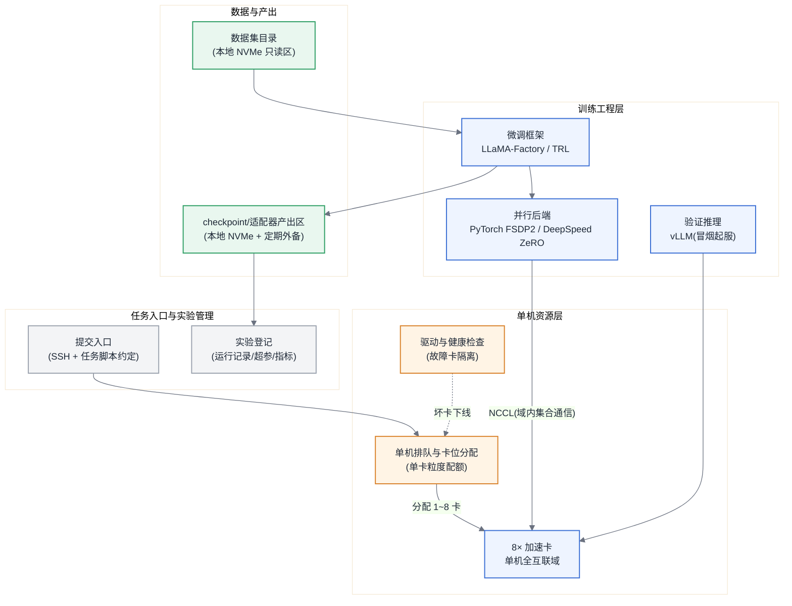

# 参考架构 01:单机 8 卡开发/微调平台

> 适用画像:算法团队 5~20 人,一台 8 卡训练服务器(单机 NVLink/HCCS 全互联域),负载以 LoRA 微调、小规模 SFT 与日常实验为主。这是全书三层地图落到最小可用形态的样子:没有跨节点网络,没有批调度器集群,但共享、配额、可复现这三件事一件都不能少。

## 目标与非目标

**目标:**

- 多人共享一台 8 卡机器做微调与实验:7B~70B 档 LoRA/QLoRA、≤13B 档全参 SFT、推理冒烟验证。
- 卡按"单卡粒度"划分给人或任务,支持临时聚齐 8 卡跑一个短任务(参考 [§9.4.1](../第二部分-算力底座/第09章-批调度器.md#941-gang-scheduling同步训练的调度公理) 的 Gang 语义,单机版退化为"凑齐即启")。
- 实验可复现:代码、数据版本、超参、产出 checkpoint 有统一目录约定与登记。

**非目标:**

- 不做预训练与继续预训练(算力工期不成立,见容量模型)。
- 不做在线推理服务(只做验证性起服,SLO 承诺归推理平台)。
- 不做跨机扩展:一旦出现多机需求,直接看[失效边界](#失效边界),不在单机上叠床架屋。

## 组件图

组件按书内三层地图([§2.4.3](../第一部分-基础与心智模型/第02章-两条主线解剖与框架地图.md#243-框架三层地图))归位:上层是任务入口与实验管理,中间是训练工程层,底下是单机资源层。



要点:单机没有"调度器选型"问题——不必上 Slurm 或 K8s,一个卡位登记 + 排队约定(哪怕是一个共享表格加环境变量纪律)就够;真正不能省的是**单卡粒度的配额与故障卡隔离**([§8.4.5](../第二部分-算力底座/第08章-K8s上的加速卡.md#845-节点生命周期驱动健康检查与自动隔离) 的单机版)。

## 数据流与控制流

**控制流:** 使用者领卡位(排队约定)→ 设定可见卡(设备可见性环境变量)→ 启动微调框架 → 任务结束释放卡位。多卡任务由并行后端在进程组内自行编排,单机内不存在跨节点控制面。

**数据流:** 数据集从只读区读入(本地 NVMe,顺序读,不构成瓶颈)→ 训练进程内 NCCL 走单机互联域做梯度/参数集合通信(全部命中 [§7.4](../第一部分-基础与心智模型/第07章-互联与集合通信.md#74-原理与量化模型) 的域内档带宽)→ checkpoint 与 LoRA 适配器写本地 NVMe 产出区,按日外备到对象存储/NAS(单机是唯一故障域,外备是生死线,见[故障域](#故障域))。

## 容量模型

假设声明(全部代入 [附录 B](../附录/附录B-估算公式速查与符号表.md#b2-公式速查) 公式,单卡参数只做示例,采购请按 [附录 A](../附录/附录A-加速卡与集群形态速查表.md) 与实测取值):

- 单卡显存标称 80 GB;按 F7,可用 ≈ 80 × 90% ≈ 72 GB,再留 12% 给碎片与通信缓冲,**可规划显存 ≈ 63 GB/卡**。
- 单卡 BF16 稠密峰值 P_峰值 = 1×10^15 FLOPS;小规模微调 MFU 取 0.30(经验值,以实测为准,LoRA 通常低于全参)。
- LoRA 可训练参数量按上界 N_lora ≈ 1% · N(r=16~64、覆盖注意力与 FFN 的常见配置多在 0.2%~1%)。

**7B LoRA(单卡即可):**

- 冻结权重(F6,p=2):2N = 14 GB;
- LoRA 优化器状态(F4 只作用于可训练参数):16 · N_lora ≈ 16 × 0.07×10^9 ≈ 1.1 GB;
- 激活(F5,选择性重计算消去注意力项):M_act ≈ 34·s·b·h·L = 34 × 4096 × 1 × 4096 × 32 ≈ 18.3 GB(s=4096,b=1,L=32,h=4096);
- 合计 ≈ 33 GB < 63 GB,**单卡放得下**,余量可加大 b 或加长 s。

**70B LoRA(8 卡):**

- 冻结权重 2N = 140 GB,按 ZeRO-3/FSDP 参数分片摊到 8 卡 ≈ 17.5 GB/卡;
- LoRA 状态 16 × 0.7×10^9 ≈ 11.2 GB,分片后 ≈ 1.4 GB/卡;
- 激活按 F5 选择性重计算仍达 ≈ 91 GB/卡(L=80,h=8192,s=4096,b=1),必须开完全重计算压到个位数 GB,代价是 F1 的系数 6 推向 7~8([§17.4.3](../第四部分-训练系统/第17章-显存与训练侧精度机制.md#1743-激活重计算用算力换显存的三档粒度));
- 合计 ≈ 25~30 GB/卡 < 63 GB,**8 卡可行**;QLoRA(权重 0.5N = 35 GB)是单卡跑 70B 的备选,代价见 [§17.5](../第四部分-训练系统/第17章-显存与训练侧精度机制.md#175-方案对比显存不够的三条路线)。

**全参 SFT 的档位边界(F4):**

- 7B 全参:16N = 112 GB,ZeRO-3 摊 8 卡 ≈ 14 GB/卡 + 激活,可行;
- 70B 全参:16N = 1120 GB,摊 8 卡 = 140 GB/卡 > 63 GB,**单机放不下**——这就是升级触发器之一。

**工期(F1/F2):** 7B LoRA、D = 2×10^9 token:C = 6 × 7×10^9 × 2×10^9 = 8.4×10^19 FLOPs;T = C ÷ (8 × 1×10^15 × 0.30) ≈ 3.5×10^4 s ≈ 10 小时。同样数据量做 70B LoRA 约 4 天(8 卡),仍在"一次实验"的耐心范围内。

估算器复核(memory 子命令输出自带公式出处与假设清单):

```bash
PYTHONPATH=calculators/src python3 -m ai_infra_calc memory \
  --n-params-b 70 --layers 80 --batch-seqs 1 --seq-len 4096 --hidden 8192 --heads 64 \
  --tp 1 --pp 1 --dp 8 --zero-stage 3 --recompute full

PYTHONPATH=calculators/src python3 -m ai_infra_calc training \
  --n-act-params-b 7 --tokens-t 0.002 --n-gpus 8 --peak-tflops 1000 --mfu 0.3
```

## 故障域

单机平台的故障域只有一层,但因此每一项都无冗余:

- **整机故障域 = 全部算力**:主板/电源/散热任一故障,平台停摆。对策不是冗余(单机没有冗余可言),而是把恢复时间钉住:checkpoint 与适配器产出必须每日外备,备件与报修 SLA 写进采购合同。
- **单卡故障域**:XID/ECC 故障按 [§8.4.5](../第二部分-算力底座/第08章-K8s上的加速卡.md#845-节点生命周期驱动健康检查与自动隔离) 的思路做健康检查与隔离——坏一张卡,平台从 8 卡降级为 7 卡继续服务,而不是全机排障。
- **任务级故障**:微调任务短(小时~天级),按 [§20.4.1](../第四部分-训练系统/第20章-稳定性与容错.md#2041-失败率模型故障为什么是常态) 的失败率模型,单机 8 卡在天级任务窗口内的硬件故障概率很低,**不需要**千卡级的自动容错体系;周期 checkpoint(小时级)+ 手工重启即够。

## 安全边界

- **人与人之间**:同机多用户是最大风险面。最低要求:各自系统账号 + 数据集只读区与个人产出区的文件权限隔离;做不到容器级隔离时,至少保证"删库"只能删到自己目录。
- **数据边界**:私有微调数据只进本机与授权外备目标,禁止训练脚本内嵌外部上传;出口流量默认关闭、按需放行(下载基座模型走统一代理与校验)。
- **模型资产**:基座模型与产出 checkpoint 按 [第 30 章](../第七部分-工程化与治理/第30章-模型生命周期管理.md) 的口径登记来源与许可;产出适配器外发前过一次许可证与数据合规检查。
- **不承诺的边界**:单机平台不提供租户级强隔离与审计合规能力,涉密/强合规负载不该放在这里。

## 可观测性

单机不必上完整监控栈,但三类信号必须有,口径与 [第 29 章](../第六部分-上层平台/第29章-可观测性与评测流水线.md) 对齐,规模化后可平移:

- **资源信号**:每卡利用率、显存占用、温度/降频(降频排查见 [§31.2.3](../第七部分-工程化与治理/第31章-容量、成本与SLO.md#3123-降频与热节流性能不稳定的头号真凶));哪怕只是定时采样落盘,也要能回答"上周卡被谁用了、用满没有"。
- **任务信号**:loss 曲线、吞吐(token/s)、按 F11 反算的 MFU——MFU 长期显著低于同档参考值,通常是数据加载或重计算配置问题,先看账再调参。
- **实验信号**:每次运行的超参、数据版本、产出物路径入实验登记,保证"两周前那个效果好的 run"能被找回并复跑。

## 运维 Runbook 索引

单机场景最常触发的条目(全套见 runbooks/ 目录):

- 训练 hang(多为 NCCL 单机进程组内某 rank 卡死):[rb-01](../runbooks/rb-01-training-hang.md)
- NCCL/HCCL 超时:[rb-02](../runbooks/rb-02-nccl-hccl-timeout.md)
- GPU XID/ECC 故障与坏卡隔离:[rb-03](../runbooks/rb-03-gpu-xid-ecc.md)
- OOM 与显存碎片(单机共享下最高频):[rb-06](../runbooks/rb-06-oom-fragmentation.md)

## 成本驱动项

- **摊薄靠利用率**:单机 TCO 里硬件折旧占绝对大头([§31.3.1](../第七部分-工程化与治理/第31章-容量、成本与SLO.md#3131-tco-建模五块构成)),而多人共享的机器最容易死于"人人占卡、卡上无活"。单卡粒度配额 + 空闲回收约定,是这个架构里回报率最高的"制度性投资"。
- **电与散热**:8 卡整机数千瓦,普通办公环境电路与散热经常是隐藏约束,进机房或改造供电的成本要在采购时一起算([§31.2](../第七部分-工程化与治理/第31章-容量、成本与SLO.md#312-机房功率与散热全书唯一定义处))。
- **人力**:没有专职平台工程师是常态,因此一切组件选型以"零运维"为先——每引入一个需要值守的服务,都在消耗本不存在的人力预算。

## 失效边界

出现以下任一情况,这套架构到头,升级到 [参考架构 02](./ra-02-training-cluster-64-128.md):

- **负载越界**:需要预训练/继续预训练(F1 代入即知:13B × 20N 配比的 D=260B token,8 卡 MFU 0.35 下 T ≈ 2.3 年,工期不成立);或 70B 级全参微调(上文显存账:单机放不下)。
- **规模越界**:单任务需要 >8 卡,或排队等待常态化——多台 8 卡机各自为政不是答案,那只是把调度问题藏进人肉里;超过约 4 台(32 卡)时必须引入真正的批调度器([第 9 章选型决策树](../第二部分-算力底座/第09章-批调度器.md#98-选型决策树))。
- **组织越界**:出现"平台要对别的团队承诺可用性"的时刻——共享单机没有故障域冗余,承诺不了 SLO;承诺之前先升级架构。
