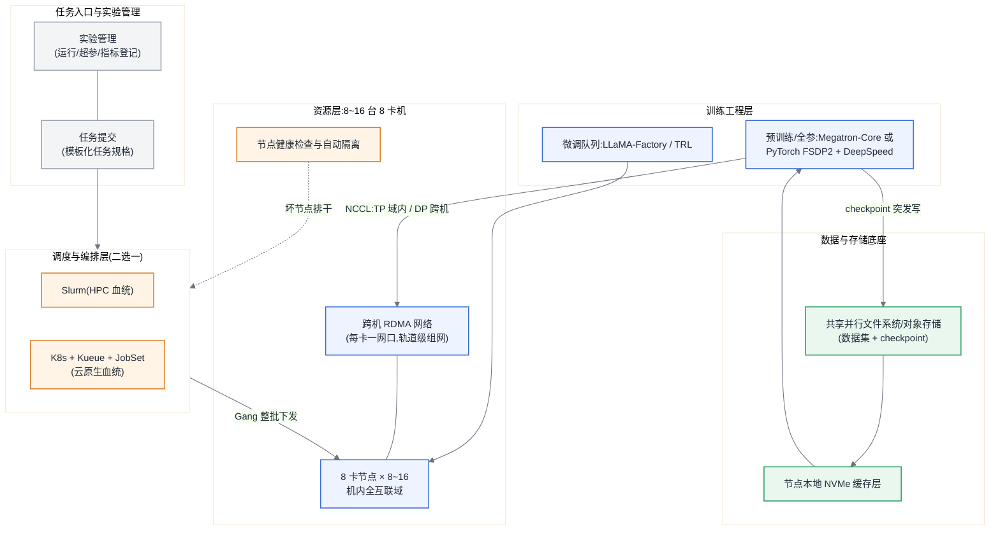

# 参考架构 02:64–128 卡训练集群

> 适用画像:8~16 台 8 卡机组成的训练集群,负载以 7B~70B 档的继续预训练、全参 SFT 与中等规模实验为主,兼跑微调队列。这是"第一次需要真正的调度器、真正的高速网络、真正的共享存储"的规模——三件事哪一件糊弄,集群就退化成十几台各自为政的单机。

## 目标与非目标

**目标:**

- 支撑 ≤13B 档从头/继续预训练(周级工期)与 ≤70B 档全参 SFT/LoRA;
- 队列化多租共享:配额、优先级、抢占、Gang 语义齐备([§9.4.2](../第二部分-算力底座/第09章-批调度器.md#942-队列配额优先级抢占四件套的模型设计));
- 单机粒度容错:一台机器坏,队列里的其他任务不受影响,受影响任务从 checkpoint 重启。

**非目标:**

- 不承诺千卡级"有效训练时间占比"体系(自动故障检测/热备/秒级恢复),恢复以 checkpoint 重启为主;
- 不做 70B 以上从头预训练(工期不成立,见容量模型);
- 不做在线推理主战场(可划出低优先级分区潮汐混部,见 [§9.6](../第二部分-算力底座/第09章-批调度器.md#96-训练与推理混部潮汐利用及其边界),但推理 SLO 归推理平台)。

## 组件图



**Slurm 还是 K8s + Kueue,取舍写明(展开见 [§9.5](../第二部分-算力底座/第09章-批调度器.md#95-方案对比volcano--kueue--slurm) 与 [第 19 章](../第四部分-训练系统/第19章-训练工程层与编排.md#192-编排层三种血统三种分工)):**

- 选 **Slurm**,当:团队有 HPC 运维经验;负载 ≥90% 是批式训练;想要最短路径拿到 Gang、拓扑感知与稳定的多机启动语义。代价:与容器生态、在线服务、CI/CD 的衔接要自己搭,训练/推理共池基本无从谈起。
- 选 **K8s + Kueue(配 JobSet)**,当:公司已有 K8s 平台与运维;希望训练与推理、数据处理共用一个资源池;需要多团队配额治理与云上弹性。代价:K8s 本身的复杂度税,以及批调度语义(队列/抢占/拓扑)要靠 Kueue 一层补齐、逐项验证。
- 判据一句话:**看组织的存量能力,不看组件的功能表**——两条路的功能终点相近,路上的人力成本差数倍。本参考架构默认 K8s + Kueue 路线(与后续升级到 [参考架构 03](./ra-03-kilocard-training-cluster.md) 的控制面连续),Slurm 路线的组件对位相同。

## 数据流与控制流

**控制流:** 任务规格(卡数、镜像/环境、数据与产出路径、优先级)→ 队列准入(配额检查)→ Gang 调度整批绑卡(凑不齐不启动,杜绝 [§9.3](../第二部分-算力底座/第09章-批调度器.md#93-问题场景利用率-100进展为零) 的死锁互等)→ 多机进程组建立 → 训练循环;节点健康检查发现坏机后排干、重调度受影响任务。

**数据流:** 三条带宽量级不同的路,分开设计:

1. **数据集读入**:共享存储 → 本地 NVMe 缓存 → 训练进程,顺序大块读,MB/s 级每卡即可,靠缓存层挡住共享存储的随机小读([§14.4.2](../第三部分-数据底座/第14章-存储与Checkpoint-IO.md#1442-缓存加速层适用场景与失效边界));
2. **梯度/参数集合通信**:TP 留在机内互联域,DP AllReduce 跨机走 RDMA(F15,可与反向重叠);跨机网络按"每卡一网口 + 轨道级组网"设计,这是本架构里最贵也最不可事后补救的部分;
3. **checkpoint 突发写**:全员同秒写共享存储,峰值带宽按突发口径而非均值口径规划([§14.4.3](../第三部分-数据底座/第14章-存储与Checkpoint-IO.md#1443-checkpoint-的突发写模式本章核心)),见容量模型。

## 容量模型

假设声明:128 卡(16 台 × 8 卡);单卡 BF16 稠密峰值 P_峰值 = 1×10^15 FLOPS(示例值,按 [附录 A](../附录/附录A-加速卡与集群形态速查表.md) 与实测替换);预训练 MFU 取 0.40(稠密模型合理区间 35%~45%,F2 提醒:MFU 是唯一必须实测的量);可用度 A 取 0.95(本规模故障稀疏,损耗以排队与重启为主)。公式全部来自 [附录 B](../附录/附录B-估算公式速查与符号表.md#b2-公式速查)。

**工期(F1/F2,并用 F3 审视数据配比):**

- 13B 继续预训练,D = 260×10^9 token(D/N = 20,Chinchilla 配比,F3 过关):
  C = 6 × 13×10^9 × 260×10^9 = 2.0×10^22 FLOPs;
  T = C ÷ (128 × 1×10^15 × 0.40 × 0.95) ≈ 4.2×10^5 s ≈ **4.8 天**——本架构的舒适区。
- 70B × D = 1.4×10^12(20N)同口径代入:T ≈ 1.2×10^7 s ≈ **140 天**——工期不成立,这就是[失效边界](#失效边界)的算式依据。

**显存与并行(F4/F5 定并行度,方法同 [§16.4.8](../第四部分-训练系统/第16章-并行策略.md#1648-完整选型算例)):**

- 13B 全参:模型状态 16N = 208 GB(F4);TP=8(机内)后每卡 26 GB,加 ZeRO-1 把 12N 项摊到 DP=16,加选择性重计算后的激活(F5),每卡稳定落在 80 GB 卡的可规划额度内;
- 通信量核对(F15/F17):TP 激活通信钉死在机内域,跨机只剩 DP 梯度 AllReduce ≈ 2×(N/TP)×2 B ≈ 6.5 GB/步/卡,与反向重叠后不压 MFU——这是"TP 不出机"这条铁律在本规模的全部理由。

**checkpoint 窗口(第 14 章口径):**

- 13B 训练态快照 ≈ 16N = 208 GB;假设聚合客户端带宽 100 Gbps(12.5 GB/s),同步直写停顿 ≈ 17 s;
- 单卡 MTBF 取 5×10^4 h(经验值)→ 128 卡集群 MTBF ≈ 390 h,按 τ_opt = √(2·δ·MTBF) ≈ 1.9 h 取整点保存,checkpoint 总开销 <1%——本规模同步写已够用,异步化(§14.5.1)留到升级时再上。

估算器复核:

```bash
PYTHONPATH=calculators/src python3 -m ai_infra_calc training \
  --n-act-params-b 13 --tokens-t 0.26 --n-gpus 128 --peak-tflops 1000 \
  --mfu 0.4 --availability 0.95

PYTHONPATH=calculators/src python3 -m ai_infra_calc memory \
  --n-params-b 13 --layers 40 --batch-seqs 1 --seq-len 4096 --hidden 5120 --heads 40 \
  --tp 8 --dp 16 --zero-stage 1 --recompute selective

PYTHONPATH=calculators/src python3 -m ai_infra_calc checkpoint \
  --n-params-b 13 --client-bw-gbps 100 --storage-bw-gbps 100 --mtbf-hours 390
```

## 故障域

**故障域 = 单机(8 卡)**,这是本架构与 ra-01/ra-03 的分水岭:

- 一台机器故障,损失 1/16 算力与其上任务;调度器把节点标记排干,其余队列照常——集群级停摆只应由共享存储或核心网络故障引起,因此这两者才需要冗余设计(存储双副本/纠删码,网络双上联)。
- 同步训练任务的故障域是**整个任务**:任一参与节点故障,任务整体从最近 checkpoint 重启,损失 = 检查点间隔的一半(期望)+ 重启时间。按上面 390 h 集群 MTBF 与 1.9 h 间隔,月均 1~2 次任务重启、每次损失 ≈ 1 h,**人工响应即可,不值得建自动容错体系**——这笔账反过来成立时就该升级了([§20.4.1](../第四部分-训练系统/第20章-稳定性与容错.md#2041-失败率模型故障为什么是常态))。
- 慢节点在本规模已经可见([§20.4.4](../第四部分-训练系统/第20章-稳定性与容错.md#2044-慢节点比故障更难的敌人)):同步训练里 1 台降频机器拖慢全体,健康检查必须包含性能基线(降频/温度),不只看"活着"。

## 安全边界

- **租户边界**:队列与配额即租户边界(namespace/分区粒度);数据集与产出按团队目录授权,跨团队共享走显式申请。训练容器默认无集群管理权限,任务规格里的挂载与出网按白名单收敛。
- **网络边界**:RDMA 训练网与管理网/存储网物理或逻辑隔离,训练容器不可直达管理面;出口统一走代理(模型/依赖下载可审计)。
- **供应链边界**:训练镜像与基座模型从内部制品库拉取,来源与签名校验按 [第 30 章](../第七部分-工程化与治理/第30章-模型生命周期管理.md) 口径(Sigstore/Cosign 系),不从公网即拉即用。
- **凭据边界**:数据访问凭据按任务注入、短时效,不落镜像;实验管理系统里只存指针不存密钥。

## 可观测性

分三层采集,口径与 [第 29 章](../第六部分-上层平台/第29章-可观测性与评测流水线.md) 对齐:

- **资源层**:每卡利用率/显存/温度/降频、RDMA 网口误码与带宽、存储读写延迟;节点性能基线偏移告警(慢节点线索)。
- **任务层**:吞吐(token/s)与 F11 反算 MFU 是训练健康度的北极星——MFU 掉档比 loss 异常更早暴露基础设施问题;checkpoint 写入时长趋势(变慢 = 存储在报警前失速,[rb-05](../runbooks/rb-05-checkpoint-stall.md) 的前置信号)。
- **平台层**:队列等待时间分布、配额占用与实际利用率的差值(占而不用)、抢占次数——这三个数决定"要不要扩容"的答案是买卡还是治理([第 11 章](../第二部分-算力底座/第11章-多租户与利用率治理.md))。

## 运维 Runbook 索引

- 训练 hang:[rb-01](../runbooks/rb-01-training-hang.md)
- NCCL/HCCL 超时(本规模开始跨机,首次成为高频项):[rb-02](../runbooks/rb-02-nccl-hccl-timeout.md)
- GPU XID/ECC 与节点隔离:[rb-03](../runbooks/rb-03-gpu-xid-ecc.md)
- 慢节点/Straggler 定位:[rb-04](../runbooks/rb-04-straggler.md)
- Checkpoint 写入失速:[rb-05](../runbooks/rb-05-checkpoint-stall.md)
- OOM 与显存碎片:[rb-06](../runbooks/rb-06-oom-fragmentation.md)

## 成本驱动项

- **网络是隐形大头**:每卡一网口的 RDMA 组网 + 交换机,常达整机采购价的两成上下;砍网络省下的钱会以 MFU 折损的形式加倍还回去(F20:B_eff 换档,结论差量级)。
- **利用率与排队的平衡**:队列长度是利用率的燃料——集群越满,MFU 摊薄折旧越划算,但等待时间伤研发迭代;用可观测性里的三个平台指标定扩容,而不是拍脑袋([§31.1](../第七部分-工程化与治理/第31章-容量、成本与SLO.md#311-容量与压测从业务指标反推卡数))。
- **电与机房**:16 台 8 卡机已进入功率密度敏感区,机柜供电与散热方案先于采购确认([§31.2](../第七部分-工程化与治理/第31章-容量、成本与SLO.md#312-机房功率与散热全书唯一定义处))。
- **人力**:本规模开始需要 1~2 名专职平台工程师;选型(Slurm vs K8s+Kueue)对这笔成本的影响大于对硬件的影响,见组件图的取舍。

## 失效边界

出现以下任一情况,升级到 [参考架构 03](./ra-03-kilocard-training-cluster.md):

- **工期算式不成立**:目标模型 × 目标数据量代入 F1/F2 后工期超季度(如上文 70B × 20N ≈ 140 天)——加卡是唯一解,而加到千卡量级后,故障率、checkpoint 带宽、互联拓扑全部换公式;
- **容错账反转**:集群 MTBF 随规模线性变差,当"故障处理 + 重启损失"侵蚀有效训练时间超过约 5%(按 [§20.4.2](../第四部分-训练系统/第20章-稳定性与容错.md#2042-有效训练时间占比稳定性的唯一北极星指标) 实测),人工响应模式到头,需要 ra-03 的全套自动容错;
- **形态越界**:采购对象从"8 卡机"变成超节点/整机柜(采购台阶变粗,[§31.1.2](../第七部分-工程化与治理/第31章-容量、成本与SLO.md#3112-采购粒度台阶变粗了)),互联域大小改变并行选型前提([§16.4.5](../第四部分-训练系统/第16章-并行策略.md#1645-超节点如何改写并行选型本章重点)),此时按 ra-03 的对齐原则重新设计,而不是在本架构上打补丁。

反向边界:若负载萎缩到只剩微调与实验、单任务 ≤32 卡且排队消失,本架构的网络与调度投资不再回本,收缩到 [参考架构 01](./ra-01-single-node-dev-finetune.md) 的多台单机形态更划算。
