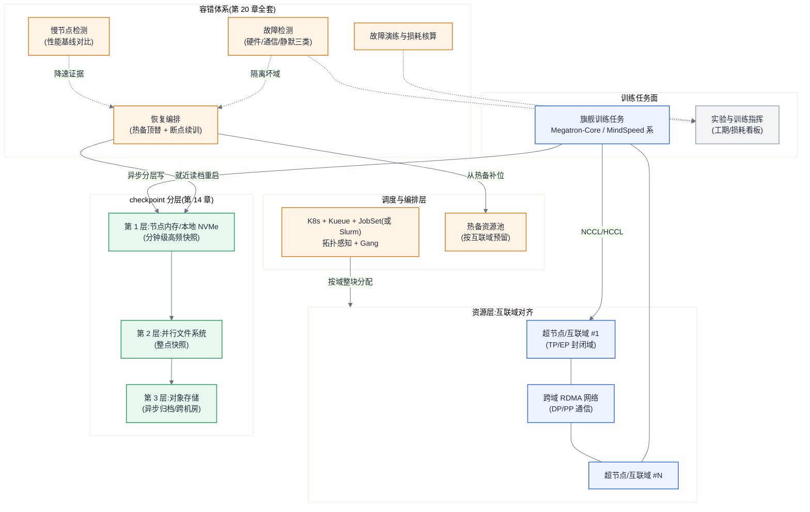

# 参考架构 03:千卡训练集群

> 适用画像:约 1024 卡(超节点/整机柜形态若干,或 128 台 8 卡机)的专用训练集群,负载是几十 B 到几百 B 档(含 MoE)的预训练与大规模后训练。这个规模的第一性变化只有一句话:**故障从事件变成分布,容错从运维动作变成系统设计**——所有组件围绕"有效训练时间占比"这一个北极星指标组织([§20.4.2](../第四部分-训练系统/第20章-稳定性与容错.md#2042-有效训练时间占比稳定性的唯一北极星指标))。

## 目标与非目标

**目标:**

- 支撑单任务占用全集群、持续数周到数月的预训练,以及大规模后训练(RL 类负载见 [第 21 章](../第四部分-训练系统/第21章-后训练基础设施.md),资源形态兼容);
- 有效训练时间占比 ≥90%(实测口径),故障检测-隔离-恢复闭环自动化;
- 并行策略与物理互联域严格对齐:TP/EP 不出互联域,checkpoint 分层落地([第 14 章](../第三部分-数据底座/第14章-存储与Checkpoint-IO.md#1452-存储架构按规模分档))。

**非目标:**

- 不做通用多租平台:千卡集群的主租户是一两个旗舰训练任务,微调与实验负载放 [ra-01](./ra-01-single-node-dev-finetune.md)/[ra-02](./ra-02-training-cluster-64-128.md),不与旗舰任务抢资源;
- 不做跨地域多集群训练(故障语义完全不同,见 [第 20 章「跨集群训练的故障语义」](../第四部分-训练系统/第20章-稳定性与容错.md));
- 不承诺在线推理——退役的训练卡转推理池是规划项,不是本架构的运行时职责。

## 组件图



## 数据流与控制流

**控制流:** 旗舰任务按互联域整块申请资源(调度器拓扑感知,保证 TP/EP 组不跨域)→ 进程组建立与并行拓扑映射 → 训练循环。容错闭环独立于任务运行:三类故障检测([§20.4.3](../第四部分-训练系统/第20章-稳定性与容错.md#2043-故障检测三类问题难度递增))持续巡检,命中后恢复编排自动执行"隔离故障域 → 热备补位 → 就近 checkpoint 重启",目标是把一次故障的损失从小时级压到十分钟级([§20.4.6](../第四部分-训练系统/第20章-稳定性与容错.md#2046-断点续训与弹性训练恢复路径的成本结构))。

**数据流:** 数据管道按 [第 13 章](../第三部分-数据底座/第13章-训练数据管道.md) 预物化与本地缓存,训练时数据读入不进关键路径。通信流按域分层:TP/EP 的高频大流量(F17/F19)封闭在互联域内,跨域只走 DP 梯度(F15,与反向重叠)与 PP 边界激活(F18)。checkpoint 走三层异步流水:先秒级落本地层,再异步汇聚到并行文件系统,最后归档对象存储——训练进程只感知第一层的停顿。

## 容量模型

假设声明:n_卡 = 1024;单卡 BF16 稠密峰值 P_峰值 = 1×10^15 FLOPS(示例值,按 [附录 A](../附录/附录A-加速卡与集群形态速查表.md) 替换);MFU = 0.40(千卡稠密训练合理区间 35%~45%,MoE 更低,F2/F14);**可用度 A 显式进入工期公式**。公式来自 [附录 B](../附录/附录B-估算公式速查与符号表.md#b2-公式速查)。

**可用度折减 A 的推导(不是拍的):**

- 单卡 MTBF 取 5×10^4 h(经验值,以自己集群实测为准)→ 1024 卡集群 MTBF ≈ 5×10^4 ÷ 1024 ≈ **49 h**,即两天一次硬件故障是设计输入而非异常([§20.4.1](../第四部分-训练系统/第20章-稳定性与容错.md#2041-失败率模型故障为什么是常态));
- checkpoint 间隔按 τ_opt ≈ √(2·δ·MTBF) 取:异步分层后训练可感知停顿 δ ≈ 60 s,τ_opt ≈ √(2×60×1.76×10^5) ≈ 4.6×10^3 s ≈ 77 min;
- 损耗三项:写入停顿 δ/τ ≈ 1.3%;故障回滚期望 τ/(2·MTBF) ≈ 1.3%;检测+恢复(自动化后按 15 min/次)≈ 0.5%;再加慢节点与通信抖动预算 3%~5%([§20.4.4](../第四部分-训练系统/第20章-稳定性与容错.md#2044-慢节点比故障更难的敌人)),合计损耗 ≈ 7%~8%,**取 A = 0.90**。没有这套容错体系时,同样的算式会给出 A ≈ 0.7 甚至更低——这就是容错体系的投资回报算法。

**工期(F1/F2 含 A):** 70B 稠密、D = 15×10^12 token(过训练档,D/N ≈ 214,F3 合理区间内):

- C = 6 × 70×10^9 × 15×10^12 = 6.3×10^24 FLOPs;
- T = C ÷ (1024 × 1×10^15 × 0.40 × 0.90) ≈ 1.7×10^7 s ≈ **198 天**。这个数字本身就是决策工具:要压进一个季度,要么上更高峰值的卡,要么 MoE 降 N_act(F1 用 N_act 不用 N),要么砍 D——在采购前用公式摊牌,而不是开训后追赶。

**checkpoint 带宽(第 14 章分层的定量依据):** 70B 训练态 16N ≈ 1.12 TB;若同步直写并行文件系统、聚合带宽 200 Gbps(25 GB/s),停顿 ≈ 45 s/次,叠加 77 min 间隔尚可,但恢复时千卡并发读同一份档案才是真瓶颈——分层的第一层(节点本地)既压写停顿又解决读风暴,这是"千卡必须分层"的算式来源([§14.4.3](../第三部分-数据底座/第14章-存储与Checkpoint-IO.md#1443-checkpoint-的突发写模式本章核心)、[§14.5.1](../第三部分-数据底座/第14章-存储与Checkpoint-IO.md#1451-三种-checkpoint-优化))。

**并行与互联域对齐(§16.4.5/§20.4.5 的联合约束):** 并行选型先用 F4/F5 定切分、F15–F20 核通信,且加一条硬约束——TP/EP 组不得跨互联域;互联域越大,TP/EP 可选空间越大,但**故障域同步放大**:一个 64 卡超节点故障 = 一次性损失 64 卡与其上全部并行组,热备池必须按"域"而不是按"卡"预留([§20.4.5](../第四部分-训练系统/第20章-稳定性与容错.md#2045-故障域的放大超节点改写全部容错算术重点))。

估算器复核:

```bash
PYTHONPATH=calculators/src python3 -m ai_infra_calc training \
  --n-act-params-b 70 --tokens-t 15 --n-gpus 1024 --peak-tflops 1000 \
  --mfu 0.4 --availability 0.9

PYTHONPATH=calculators/src python3 -m ai_infra_calc checkpoint \
  --n-params-b 70 --client-bw-gbps 200 --storage-bw-gbps 200 --mtbf-hours 49

PYTHONPATH=calculators/src python3 -m ai_infra_calc comm \
  --collective allreduce --payload-gb 17.5 --ranks 16 --bus-bw-gbps 400
```

## 故障域

按物理层级列清单,每层写明爆炸半径与对策:

- **单卡**(XID/ECC/静默数据损坏):检测后整机或整域隔离——千卡同步训练里没有"带病单卡",静默损坏(SDC)靠周期性数值校验抓([§20.4.3](../第四部分-训练系统/第20章-稳定性与容错.md#2043-故障检测三类问题难度递增)、[§20.4.7](../第四部分-训练系统/第20章-稳定性与容错.md#2047-低精度下的可复现性什么时候必须-bitwise-一致));
- **单机/超节点(互联域)**:本架构的主故障域。域内互联故障 = 整域下线;热备按域预留(1~2 个域,约 6%~12% 算力),这笔"闲置"买的是恢复时间,进 TCO 时算容错成本不算浪费;
- **跨域网络**:单交换机故障靠双上联收敛为降速而非中断;网络分区是最难检测的一类,表现为 NCCL/HCCL 超时风暴,处置见 [rb-02](../runbooks/rb-02-nccl-hccl-timeout.md);
- **存储**:并行文件系统故障不打断训练(第一层 checkpoint 兜底),但超过一层 checkpoint 保留窗口就是硬风险,按"存储降级即训练进入倒计时"设告警;
- **机房级**(供电/散热):超出本架构冗余能力,靠第 3 层跨机房归档保证"最坏丢一个归档周期",以及 [§31.2](../第七部分-工程化与治理/第31章-容量、成本与SLO.md#312-机房功率与散热全书唯一定义处) 的前置容量核查。

故障演练常态化([§20.4.8](../第四部分-训练系统/第20章-稳定性与容错.md#2048-故障演练与-slo)):每类故障域至少演练过一次真实注入,恢复路径没演练过就等于没有。

## 安全边界

- **物理与网络**:训练网(域内互联 + 跨域 RDMA)、存储网、管理网三面隔离;训练容器无管理面路由;集群默认无公网出口,数据与模型进出走摆渡区审计。
- **数据边界**:预训练语料是核心资产,进集群前完成合规审查与登记([第 13 章](../第三部分-数据底座/第13章-训练数据管道.md));checkpoint 三层存储的访问控制一致收敛——归档层往往最容易被遗漏成"谁都能读"。
- **模型资产**:旗舰模型 checkpoint 是公司级资产,访问按最小权限 + 审计;产出物签名与谱系登记按 [第 30 章](../第七部分-工程化与治理/第30章-模型生命周期管理.md)(Sigstore/Cosign、ML-BOM 口径)。
- **人员边界**:能登录训练节点的人应个位数;日常操作全部走任务面与指挥看板,登录节点是异常事件而非工作方式。

## 可观测性

北极星是**有效训练时间占比**,一切指标为它服务(口径与 [第 29 章](../第六部分-上层平台/第29章-可观测性与评测流水线.md)、[第 31 章](../第七部分-工程化与治理/第31章-容量、成本与SLO.md#310-链路定位与依赖声明) 对齐):

- **损耗核算表**:每一秒不在训练的时间都要记账归因——写 checkpoint、故障检测、恢复重启、慢节点拖累、通信抖动;没有这张表,A=0.90 只是愿望;
- **训练健康**:吞吐与 F11 反算 MFU 的实时曲线 + 逐 rank 的步时间分布(慢节点在 P99 rank 步时间里最先现形);loss 突刺与梯度范数异常联动 SDC 排查;
- **基础设施**:逐域互联带宽/误码、跨域网络拥塞、存储三层的写入延迟与积压深度、功率与温度(降频即慢节点,[§31.2.3](../第七部分-工程化与治理/第31章-容量、成本与SLO.md#3123-降频与热节流性能不稳定的头号真凶));
- **演练与事后**:每次故障自动生成时间线(检测时刻、隔离时刻、恢复时刻),复盘喂回检测规则——容错体系是靠事故喂大的。

## 运维 Runbook 索引

千卡集群六条全部高频,值班表按此备:

- 训练 hang(千卡首因,定位最耗时):[rb-01](../runbooks/rb-01-training-hang.md)
- NCCL/HCCL 超时:[rb-02](../runbooks/rb-02-nccl-hccl-timeout.md)
- GPU XID/ECC 与域隔离:[rb-03](../runbooks/rb-03-gpu-xid-ecc.md)
- Straggler/慢节点:[rb-04](../runbooks/rb-04-straggler.md)
- Checkpoint 写入失速:[rb-05](../runbooks/rb-05-checkpoint-stall.md)
- OOM 与显存碎片:[rb-06](../runbooks/rb-06-oom-fragmentation.md)

## 成本驱动项

- **有效训练时间占比就是钱**:千卡集群每天的折旧+电费是固定支出,A 从 0.85 提到 0.92 等价于白得 7% 的卡——容错体系、热备池、checkpoint 分层的全部投资都用这把尺子核算([§31.3.3](../第七部分-工程化与治理/第31章-容量、成本与SLO.md#3133-全书技术决策的成本折算));
- **电费与散热进入主成本**:千卡级功率以兆瓦计,PUE 每降 0.1 都是实钱,液冷与机房方案在采购阶段定型([§31.2.4](../第七部分-工程化与治理/第31章-容量、成本与SLO.md#3124-pue-与电费功率如何进入-tco));能耗与碳账口径见 [第 31 章「从电费到碳账」](../第七部分-工程化与治理/第31章-容量、成本与SLO.md#从电费到碳账功能单位与系统边界);
- **热备与冗余**:按域预留的热备、双上联网络、三层存储,合计约一成算力/预算的"保险费",在工期公式里以 A 的形式回本;
- **MFU 工程**:并行调优、通信重叠、数据管道优化的人力投入,回报按 F2 直接折算工期——千卡规模上 1 个百分点的 MFU ≈ 10 卡年/月的算力。

## 失效边界

**规模/负载边界:**

- 目标任务代入 F1/F2 后工期仍超半年(如几百 B 稠密 × 数十 T token),单集群加卡已到机房供电或采购台阶的墙——走向多集群/跨地域训练,那是另一套故障语义与架构(参见 [第 20 章「跨集群训练的故障语义」](../第四部分-训练系统/第20章-稳定性与容错.md)),不是 ra-03 的放大版;
- 负载重心转向异构算力混用(NVIDIA + 国产双后端),准入与抽象层问题优先于规模问题,转 [参考架构 04](./ra-04-heterogeneous-compute-platform.md)。

**组织前提(不满足则不该建):**

- 有专职平台/SRE 团队(≥5 人量级)承接 7×24 值班与容错体系建设——千卡集群没有"兼职运维"模式;
- 有旗舰级训练需求把集群喂到 >70% 长期占用:利用率喂不满时,这个规模的正确形态是云上租用或收缩回 [ra-02](./ra-02-training-cluster-64-128.md),自建千卡的 TCO 前提见 [§31.4](../第七部分-工程化与治理/第31章-容量、成本与SLO.md#314-方案对比自建云混合);
- 组织愿意为"有效训练时间占比"设 SLO 并投入故障演练——只买硬件不建容错体系的千卡集群,实际拿到的是七折算力。
