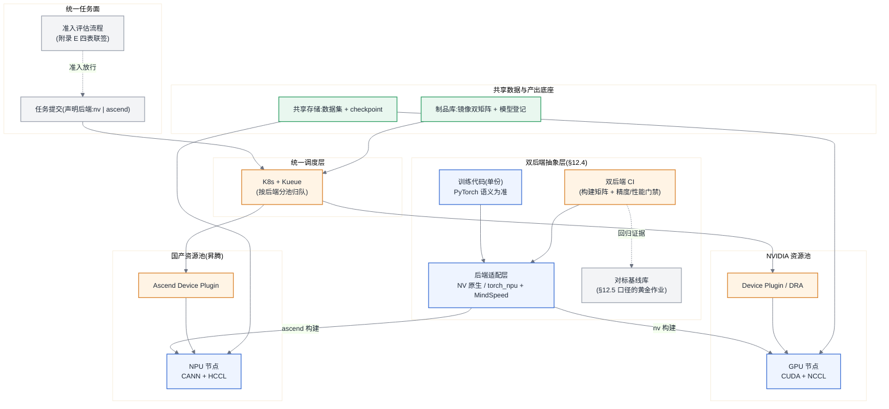

# 参考架构 04:异构算力平台(NVIDIA + 国产双后端)

> 适用画像:因供应约束、成本或政策要求,同时运营 NVIDIA 与国产加速卡(以昇腾为例)两个后端的训练平台。核心立场取自 [§12.4](../第二部分-算力底座/第12章-国产算力平台与异构迁移.md#124-混合集群管理双后端是常态而不是过渡):**双后端是常态而不是过渡**——架构要按"长期并行运营两套生态"设计,而不是按"迁移完就下线一套"设计。混池不混任务:两个后端共享控制面与存储,单个训练任务永远只落在一种卡上。

## 目标与非目标

**目标:**

- 一套控制面(队列/配额/实验管理)管理两类资源池,任务声明后端类型后由调度器归池;
- 双后端抽象层:训练代码一份,后端差异收敛到适配层与构建矩阵,双后端 CI 持续验证([§12.4](../第二部分-算力底座/第12章-国产算力平台与异构迁移.md#124-混合集群管理双后端是常态而不是过渡));
- 负载准入有流程:新模型/新负载进入国产池之前,走 [附录 E](../附录/附录E-异构迁移评估清单.md) 四表评估(算子覆盖 → 精度对齐 → 性能对标 → 人力工期),四表联签才准入;
- 对标口径统一:两后端的性能比较只按 [§12.5](../第二部分-算力底座/第12章-国产算力平台与异构迁移.md#125-性能对标的正确姿势全书唯一定义处) 的口径出数。

**非目标:**

- 不做单任务跨后端混跑(同一进程组混两种卡:通信库、精度行为、算子语义三重不可控,不进设计空间);
- 不追求"全负载双后端覆盖":只有通过准入评估、且长期运行的负载才值得付双后端维护成本,长尾实验负载钉死在单一后端;
- 不做推理侧异构路由(那是推理平台的问题,本架构只管训练侧)。

## 组件图



## 数据流与控制流

**控制流:** 新负载先走准入:按 [附录 E](../附录/附录E-异构迁移评估清单.md) 完成算子覆盖率盘点(E.1)、精度对齐(E.2)、性能对标(E.3)、人力工期打分(E.4),四表联签后该负载才获准声明 ascend 后端;未准入负载只能落 NVIDIA 池。日常提交时任务声明后端 → Kueue 按池归队 → 各池内与 [ra-02](./ra-02-training-cluster-64-128.md) 同构(Gang、健康检查、单机故障域)。抽象层的控制闭环独立运转:每次代码合入触发双后端 CI——两套镜像构建 + 小规模黄金作业跑通 + loss 曲线对齐门禁,**后端漂移在 CI 里暴露,而不是在千步训练之后**。

**数据流:** 数据集与 checkpoint 存储双池共享(格式后端无关);同一模型的 checkpoint 跨后端加载属于迁移动作,必须经 E.2 精度对齐验证而非直接续训。集合通信各走各的:NVIDIA 池 NCCL、昇腾池 HCCL,互不跨池。镜像与依赖按"一份代码、两条构建流水线"进制品库,版本号成对发布。

## 容量模型

假设声明:两池独立算账,**先换算有效算力再谈规模**;单卡纸面峰值(附录 A 口径)不可直接比较,必须按 [§12.5](../第二部分-算力底座/第12章-国产算力平台与异构迁移.md#125-性能对标的正确姿势全书唯一定义处) 用同负载实测 MFU 折算。公式来自 [附录 B](../附录/附录B-估算公式速查与符号表.md#b2-公式速查)。

**等效算力换算(F2 的双后端形式):** 同一负载在两池的有效算力比 = (n_A · P_A · MFU_A) ÷ (n_B · P_B · MFU_B)。示例代入:NVIDIA 池单卡峰值 1×10^15 FLOPS、实测 MFU 0.42;昇腾池单卡峰值 0.8×10^15 FLOPS、同负载实测 MFU 0.35(数字均为示例,**MFU 必须来自 E.3 对标实验,禁止引用任何一方的宣传值**)——单卡有效算力比 ≈ (1.0×0.42) ÷ (0.8×0.35) = 1.5,即该负载下 3 张昇腾卡 ≈ 2 张 NVIDIA 卡。采购与排产按这个比值折算,而不是按卡数。

**工期(F1/F2 分池代入):** 13B 继续预训练、D = 260×10^9 token(C = 2.0×10^22 FLOPs)落昇腾池 128 卡:T = 2.0×10^22 ÷ (128 × 0.8×10^15 × 0.35 × 0.95) ≈ 5.9×10^5 s ≈ 6.9 天(同任务 NVIDIA 池 128 卡 ≈ 4.8 天,见 [ra-02 容量模型](./ra-02-training-cluster-64-128.md#容量模型))。

**生态成本进入容量账([§12.7](../第二部分-算力底座/第12章-国产算力平台与异构迁移.md#127-生态作为选型变量全书唯一定义处)):** 每个准入负载的迁移人月由 E.4 打分表给出,按全成本单价折钱,与硬件差价同表比较:

- 示例:某负载 E.4 评估 50 人月 × 8 万元/人月 = 400 万元一次性生态成本;若两后端等效算力口径下的硬件差价(含电费,按 [§31.3.2](../第七部分-工程化与治理/第31章-容量、成本与SLO.md#3132-国产卡在-tco-模型里的正确算法) 的正确算法)为 600 万元,则迁移成立,回收期 = 400 ÷ 600 × 采购周期;
- 双后端的**持续**成本另计:CI 机时 + 适配层维护 + 每次框架升级的双份验证,经验上是一个小团队的常驻负载,进 TCO 的运维项。

估算器复核(tco 子命令原生支持生态人月项):

```bash
PYTHONPATH=calculators/src python3 -m ai_infra_calc training \
  --n-act-params-b 13 --tokens-t 0.26 --n-gpus 128 --peak-tflops 800 \
  --mfu 0.35 --availability 0.95

PYTHONPATH=calculators/src python3 -m ai_infra_calc tco \
  --n-gpus 128 --gpu-tdp-w 400 --capex-per-gpu 120000 \
  --electricity-price-per-kwh 0.6 --ecosystem-person-months 50
```

## 故障域

- **池内故障域**:与 [ra-02](./ra-02-training-cluster-64-128.md#故障域) 同构(单机粒度,checkpoint 重启),两池各自独立演练;
- **后端级故障域(本架构独有)**:某一后端的驱动/固件/通信库升级引入回归,波及整池——对策是版本升级先过双后端 CI 黄金作业,再灰度一台、一个分区、全池;两池升级永不同步进行,任何时刻至少一池处于已验证版本;
- **抽象层故障域**:适配层缺陷会同时污染"代码正确性"与"两池对比结论",黄金作业基线库(E.3 冻结口径)是唯一仲裁——基线库本身按代码资产管理,改基线走评审;
- **供应链故障域**:任一后端断供/停产是本架构的存在理由,对应预案是负载准入清单常态维护——清单上每个关键负载都标注"另一后端就绪度"(E.1~E.3 完成到哪一步),断供时的切换工期是已知数而非未知数([§12.6](../第二部分-算力底座/第12章-国产算力平台与异构迁移.md#126-供应链与生命周期视角))。

## 安全边界

- **租户与池边界**:与 ra-02 一致的队列/配额/目录隔离,叠加一条:后端声明是资源属性不是权限属性,但涉政策合规的负载(如要求全国产链路)按标签强制归池,调度器层面拒绝错配;
- **供应链边界**:两条构建流水线、两套基础镜像来源,分别做签名与来源校验([第 30 章](../第七部分-工程化与治理/第30章-模型生命周期管理.md) 口径);国产后端的驱动/固件包同样进制品库审计,不走厂商直发直装;
- **数据边界**:共享存储双池可达,意味着数据合规等级取两池的并集要求——若某数据集仅获准在特定环境处理,用存储侧访问控制落实,而不是靠任务规格自觉;
- **对外承诺边界**:平台对外只承诺"负载在其准入后端上的 SLO",不承诺任意负载任意后端可跑——准入清单就是承诺范围的白名单。

## 可观测性

在 [ra-02 三层指标](./ra-02-training-cluster-64-128.md#可观测性) 之上,双后端专属四项:

- **分后端成本与效率账**:每负载在两池的实测 MFU(F11)、单位 token 成本、单位 token 能耗持续入账——这是 [§12.7](../第二部分-算力底座/第12章-国产算力平台与异构迁移.md#127-生态作为选型变量全书唯一定义处) 的生态账在运行期的延续,采购决策的数据来源;
- **精度漂移监控**:双后端 CI 的 loss 对齐门禁指标趋势化保存,漂移出现时能定位到引入它的框架/驱动版本(E.2 的口径复用);
- **对标基线健康度**:黄金作业定期重跑,基线过期(硬件/框架已升级而基线未更新)自动标红——过期基线比没有基线更危险;
- **就绪度看板**:关键负载 × 后端的准入矩阵(E.1~E.4 各表状态),这是供应链预案的实时视图,也是管理层问"国产化到哪一步了"的唯一口径。

## 运维 Runbook 索引

两池共用同一套 Runbook,注意条目内 NCCL/HCCL、XID/NPU 告警的后端分叉:

- 训练 hang:[rb-01](../runbooks/rb-01-training-hang.md)
- NCCL/HCCL 超时(双后端各有高频形态):[rb-02](../runbooks/rb-02-nccl-hccl-timeout.md)
- GPU XID/ECC 及 NPU 对应故障:[rb-03](../runbooks/rb-03-gpu-xid-ecc.md)
- Straggler/慢节点:[rb-04](../runbooks/rb-04-straggler.md)
- Checkpoint 写入失速:[rb-05](../runbooks/rb-05-checkpoint-stall.md)
- OOM 与显存碎片:[rb-06](../runbooks/rb-06-oom-fragmentation.md)

## 成本驱动项

- **生态人月单独入账**:硬件差价看得见,适配、对标、双份 CI、双份值守的人力容易漏记——[§12.7](../第二部分-算力底座/第12章-国产算力平台与异构迁移.md#127-生态作为选型变量全书唯一定义处) 要求先统一单位再与硬件、能耗和风险进入同一张表;
- **国产卡 TCO 的正确算法**:按等效算力(实测 MFU 折算)而非卡数比价,电费按实际功耗与 PUE 入账([§31.3.2](../第七部分-工程化与治理/第31章-容量、成本与SLO.md#3132-国产卡在-tco-模型里的正确算法));
- **准入流程本身的成本**:每个负载完成 E.1~E.4 的首轮 timebox 与后续验证都消耗工程资源([§12.3](../第二部分-算力底座/第12章-国产算力平台与异构迁移.md#123-迁移评估方法论两周出结论));负载越碎,一次性评估越难摊销,应优先准入生命周期长、证据完整的负载;
- **双池利用率错配**:准入负载不足时国产池空转、NVIDIA 池排队,等效算力折算后的排产要动态再平衡,否则双后端的账面产能与实际产出长期背离。

## 失效边界

- **生态账反转(本架构的核心判据,[§12.7](../第二部分-算力底座/第12章-国产算力平台与异构迁移.md#127-生态作为选型变量全书唯一定义处)):** 当"迁移与维护的生态折算人月 × 全成本单价"**超过**等效算力口径下的硬件差价(含电费与供应链风险溢价),双后端对该负载即失效——新负载停止准入,存量负载在下一采购周期回归单后端。整个平台层面:若准入清单连续两个采购周期不再增长、且存量准入负载的持续维护成本吃掉硬件差价,双后端架构整体退回单后端 + 供应链预案(纸面评估常备、不养第二池)的形态;
- **政策/供应硬约束反向失效**:若合规要求全负载国产化,"双后端"退化为"单后端(国产)+ 迁移流水线",架构重心从对标转向 [第 12 章方案对比](../第二部分-算力底座/第12章-国产算力平台与异构迁移.md) 的整体迁移路径;
- **规模边界**:任一池增长到千卡量级,该池按 [参考架构 03](./ra-03-kilocard-training-cluster.md) 的容错与互联域原则重构,本架构继续管两池之上的统一控制面与准入流程——ra-04 与 ra-03 是正交叠加而非互斥。
