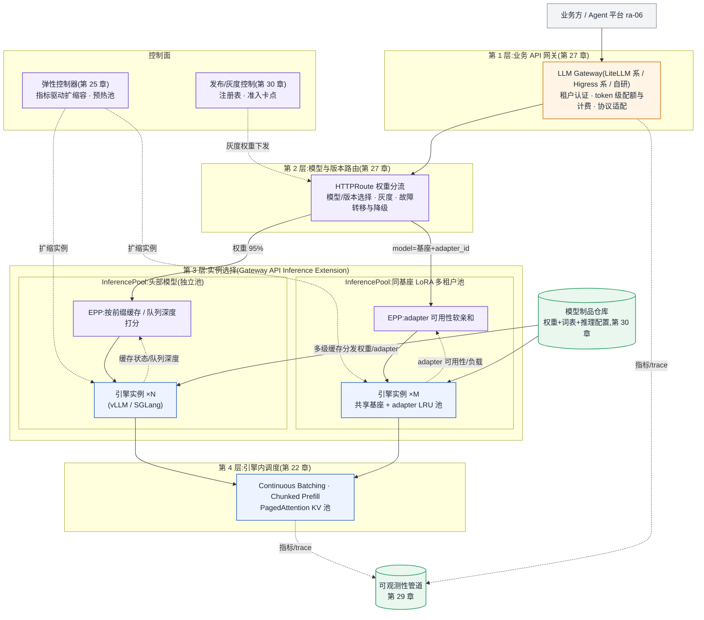

# 参考架构 05:多模型在线推理平台

服务对象:同时承载几十到上百个在线模型(含同一基座的大量 LoRA 微调版本)的推理平台。核心问题不是"把一个模型跑到极致",而是"让不同规模、不同流量、不同租户的模型共享同一套入口、路由、调度与卡池,而互不拖垮"。

## 目标与非目标

**目标**

- 多模型、多版本、多租户共享同一个 API 入口:租户认证、token 级配额与计费口径在网关统一执行([§27.4.3](../第六部分-上层平台/第27章-模型网关.md#2743-token-级限流配额与计费可实现的设计))。
- 请求的四层决策各归其位:业务网关(租户/配额)→ 模型与版本路由(灰度权重)→ 实例选择(前缀缓存与适配器感知)→ 引擎内 batch 调度([§27 网关之下](../第六部分-上层平台/第27章-模型网关.md#2745-网关之下模型感知的实例选择层))。
- LoRA 多租户:同基座的微调版本共享基座权重、adapter 池 LRU 驻留,一个 batch 混合多租户请求([§25.4.3](../第五部分-推理系统/第25章-弹性与多模型.md#2543-多模型共存与-lora-多租户))。
- 弹性:扩缩容与预热池覆盖冷启动三段([§25.4.1](../第五部分-推理系统/第25章-弹性与多模型.md#2541-冷启动的三段拆解)),模型热更新不断流([§25.4.4](../第五部分-推理系统/第25章-弹性与多模型.md#2544-模型热更新与灰度切换))。
- 容量可承诺:所有实例数与卡数来自公式代入与实测 goodput,不来自厂商标称值([§31.1.1](../第七部分-工程化与治理/第31章-容量、成本与SLO.md#3111-容量模型一条完整的推导链))。

**非目标**

- 单一超大模型的极致吞吐(PD 分离专池、超节点域内优化):那是另一类部署形态,见[失效边界](#失效边界)。
- 训练与微调:LoRA adapter 是本平台的输入制品,不在此产出。
- Agent 编排、工具调用与沙箱:见 [ra-06](ra-06-agent-platform.md),它把本架构当作模型服务依赖。
- 跨地域多集群路由与容灾:见 [ra-07](ra-07-multi-cluster-ai-platform.md)。

## 组件图

组件按书内三层地图归位:网关层(第 27 章)、编排/平台层(第 24、25 章)、引擎层(第 22 章);制品与发布来自生命周期管理(第 30 章)。项目名按[附录 C.1.2](../附录/附录C-框架选型快照.md#c12-推理侧) 口径引用。



结构要点:一个 EPP 只服务一个池,一条 HTTPRoute 可挂多个池按权重分流——"哪个模型/版本"由第 2 层回答,"哪个实例"由池内 EPP 回答([§27 网关之下](../第六部分-上层平台/第27章-模型网关.md#2745-网关之下模型感知的实例选择层));头部模型独立成池、同基座长尾聚合成 LoRA 池、极冷模型时分复用,三档并存是常态而非过渡([§25.4.3](../第五部分-推理系统/第25章-弹性与多模型.md#2543-多模型共存与-lora-多租户))。

## 数据流与控制流

**请求数据流(毫秒级)**

1. 请求携租户身份进入网关:认证、配额余量判定、token 计量开始;超限请求在这一层被拒,不消耗下游任何资源。
2. 模型与版本路由:按 `model` 参数与灰度权重选池;供应商/池级故障时按预案降级或转移([§27.4.4](../第六部分-上层平台/第27章-模型网关.md#2744-路由故障转移与降级))。
3. 池内 EPP 打分选实例:前缀缓存命中预期、LoRA adapter 是否已加载、队列深度与负载。前缀亲和是硬收益(命中率的路由因子,[§24.4.5](../第五部分-推理系统/第24章-服务化架构与显存类加速.md#2445-前缀感知路由路由策略与命中率的耦合讲透)),adapter 亲和是软约束(加载百毫秒级,可让位给均衡)。
4. 引擎内:continuous batching 进批、chunked prefill 防长 prompt 饿死 decode、PagedAttention 管理 KV 池([§22.2](../第五部分-推理系统/第22章-推理引擎原理.md#222-批处理与调度));流式返回沿原路回传,网关在出口完成输出 token 计量。

**控制流(秒级到天级)**

- 弹性:弹性控制器按队列深度与 KV 水位扩缩实例;冷启动三段(调度+镜像、权重加载、引擎预热)决定扩容生效滞后,预热池用卡换时间([§25.4.2](../第五部分-推理系统/第25章-弹性与多模型.md#2542-扩缩容指标滞后与预热池))。
- 发布:新版本实例先起后切、按流量灰度(5%→25%→100%)、旧版本排空而非杀死;质量抽检与算法侧责任写进灰度流程([§30.4.3](../第七部分-工程化与治理/第30章-模型生命周期管理.md#3043-灰度回滚与影子流量效果问题不会立即报警));adapter 级更新走快捷通道,网关把两个 adapter 版本当两个租户做流量分配。
- 制品:权重包(权重+词表+推理配置+依赖声明)从注册表经多级缓存(节点本地 + 机架/可用区级)分发,近两版常驻热缓存以保回滚就位([§30.4.4](../第七部分-工程化与治理/第30章-模型生命周期管理.md#3044-制品管理与权重分发被低估的一环))。

## 容量模型

沿[第 31 章推导链](../第七部分-工程化与治理/第31章-容量、成本与SLO.md#3111-容量模型一条完整的推导链):**QPS 与 SLO → token 吞吐需求 → 单实例 goodput → 实例数 → 卡数**,逐池独立计算(头部池与 LoRA 池的长度分布、goodput、水位都不同,合并计算没有意义)。公式引用[附录 B](../附录/附录B-估算公式速查与符号表.md#b2-公式速查)。

**假设声明(示例数字仅为公式演示,上线前全部换成实测)**

- 头部池目标模型形状:L = 32 层、a_kv = 8(GQA)、d_head = 128,KV 精度 FP16(p = 2);
- 峰值 QPS = 60,平均输入 1800 token、平均输出 350 token(取自线上长度分布,非拍脑袋);
- 单实例 goodput = 1500 token/s——**必须来自"P99 贴着 SLO 上限"那个压测工作点**,估算器刻意不提供默认值;
- 容量水位 ρ = 0.7,冗余实例 2(覆盖故障域与滚动发布),突发系数 1.3;
- 每实例 KV 池预算 48 GiB,可用系数 0.8(分页碎片与调度水位,F7 口径),平均驻留上下文 3000 token,前缀命中率 0.5(命中折减驻留)。

**并发容量(F8/F9)**

- 每 token KV(F8):M_KV/token = 2 × L × a_kv × d_head × p = 2 × 32 × 8 × 128 × 2 B = 128 KiB;
- 池内可驻留 token(F9):48 GiB × 0.8 ÷ 128 KiB ≈ 31.5 万 token;
- 可支撑并发 ≈ 31.5 万 ÷ (3000 × (1 − 0.5)) ≈ 209 路/实例。

```bash
PYTHONPATH=calculators/src python3 -m ai_infra_calc kv \
  --layers 32 --kv-heads 8 --head-dim 128 --kv-precision fp16 \
  --kv-pool-gib 48 --avg-context-tokens 3000 --prefix-hit-rate 0.5
```

**实例数与卡数**

- decode 吞吐需求:60 QPS × 350 token = 21 000 token/s;
- 实例数 = ⌈21 000 ÷ (1500 × 0.7)⌉ + 2 = 20 + 2 = 22 个;
- 卡数 = 22 × g(每实例卡数由显存三分账决定:权重 F6 + KV 预算 + 激活,放不下就升 g);
- 突发承接:1.3 倍突发在冗余与水位内可承接;若突发超出,冷启动窗口内请求将排队——预热池要不要建,由 surge_factor 与冷启动时长联合决定([§25.4.2](../第五部分-推理系统/第25章-弹性与多模型.md#2542-扩缩容指标滞后与预热池))。

```bash
PYTHONPATH=calculators/src python3 -m ai_infra_calc inference \
  --qps 60 --avg-input-tokens 1800 --avg-output-tokens 350 \
  --measured-instance-tokens-per-s 1500 --waterline 0.7 \
  --redundancy-instances 2 --surge-factor 1.3
```

**LoRA 池补充两笔账**

- adapter 显存:rank=16 的 7B 级 adapter 约 40 MB,50 个租户约 2 GB——基座之外的增量很小,容量瓶颈仍在 KV 池而不在 adapter([§25.4.3](../第五部分-推理系统/第25章-弹性与多模型.md#2543-多模型共存与-lora-多租户));
- 吞吐折扣:批内混合计算(不合并权重)通常损失 5–15%,LoRA 池的 goodput 压测必须带上真实租户混合度,单租户压测数字偏乐观。

**敏感参数**:平均上下文长度与并发成反比(长上下文业务一票决定 KV 容量);前缀命中率同时影响并发(驻留折减)与 goodput(prefill 省时),命中率跌 = 容量与延迟双杀,见 rb-08。

## 故障域

由内向外五层,每层的爆炸半径与止损动作不同:

| 故障域 | 爆炸半径 | 平台行为 |
|---|---|---|
| 单实例(卡故障、引擎崩溃) | 该实例在途请求 | EPP 摘除实例,请求经网关重试;冗余实例吸收容量缺口 |
| 单池(EPP 故障、池级容量塌陷) | 该模型/版本全部流量 | 池级健康检查触发路由层转移到备池或降级模型 |
| LoRA 池特有:adapter 池抖动 | 全池长尾租户 TTFT | 工作集被路由摊成全集所致,恢复软亲和;见 rb-08 同构现象 |
| 网关/路由层 | 全平台入口 | 网关多副本无状态,配额计数用短窗口一致性换可用性 |
| 外部供应商(混合路由场景) | 走该供应商的模型 | 预案化故障转移([§27.4.4](../第六部分-上层平台/第27章-模型网关.md#2744-路由故障转移与降级)),见 rb-09 |

两类跨域放大要显式设防:**冷启动风暴**——池级故障触发大规模重建时,权重分发成为共因瓶颈,多级缓存与 P2P 分发是防线([§30.4.4](../第七部分-工程化与治理/第30章-模型生命周期管理.md#3044-制品管理与权重分发被低估的一环));**队列爆炸**——上游重试与扩容滞后叠加形成正反馈,网关层限流是唯一能斩断反馈环的位置(rb-07)。

## 安全边界

- **租户边界在网关,不在引擎**:认证、配额、计费全部在第 1 层完成;引擎层只执行调度、不感知租户公平性。一个租户的长上下文请求会挤占全池共享 KV、拖慢所有租户——租户级并发与 token 配额必须在网关执行,这条分工要写进与租户的契约([§25.4.3](../第五部分-推理系统/第25章-弹性与多模型.md#2543-多模型共存与-lora-多租户))。
- **LoRA 共享的隔离底线**:共享基座意味着共享故障域与侧信道面;基座或量化配置不同的租户完全不共享;对隔离有强合规要求的租户拆回独立池。
- **制品边界**:进入服务的权重与 adapter 必须来自注册表、通过签名与校验和验证(传输层校验 + 加载时抽样校验),准入卡点拦住来源不明的制品([第 30 章模型供应链](../第七部分-工程化与治理/第30章-模型生命周期管理.md#3046-模型供应链从五元组到可签名制品))。
- **提示与输出不落权限面**:网关日志与 trace 中的 prompt 内容按敏感数据分级存储,采样与脱敏策略见[§29.2.2](../第六部分-上层平台/第29章-可观测性与评测流水线.md#2922-trace-的粒度一次请求该记录到哪一层)。

## 可观测性

按[第 29 章](../第六部分-上层平台/第29章-可观测性与评测流水线.md#2921-llm-专属指标体系定义采集点与误用)的 LLM 专属指标体系,分层采集、口径统一:

- **SLI 三件套按池上报**:TTFT / TPOT / goodput,采集点在网关出入口(用户视角)与引擎(归因视角)各一份,两份对不上的差值就是平台自身开销;
- **容量先行指标**:KV 池水位、队列深度、前缀缓存命中率、adapter 池换入换出率——这四个指标先于 SLI 恶化,是扩容与告警的正确触发源;
- **trace 语义统一**:跨网关—路由—EPP—引擎的链路用 OTel GenAI 语义约定命名 span 与属性,token 用量、模型与版本、adapter 标识进标准属性,与 ra-06 的 Agent trace 同语言拼接([§29 OTel GenAI](../第六部分-上层平台/第29章-可观测性与评测流水线.md#2923-把指标说同一种语言otel-genai-语义约定));
- **质量维度**:灰度期间的输出质量抽检与线上质量监控不属于"锦上添花"——模型换版本可能不报错但变笨,纯 Infra 指标全绿([§29.2.6](../第六部分-上层平台/第29章-可观测性与评测流水线.md#2926-工具链定位opencompassevalscope-与-aisbench)之后的评测流水线一节),见 rb-10。

## 运维 Runbook 索引

| 场景 | Runbook |
|---|---|
| 队列深度失控、上游重试风暴 | [rb-07 推理队列爆炸](../runbooks/rb-07-inference-queue-explosion.md) |
| KV 池反复驱逐、命中率与并发双跌 | [rb-08 KV Cache thrashing](../runbooks/rb-08-kv-cache-thrashing.md) |
| 外部模型供应商故障与转移 | [rb-09 网关供应商故障](../runbooks/rb-09-gateway-provider-outage.md) |
| 灰度或线上模型质量回归 | [rb-10 模型质量回归](../runbooks/rb-10-model-quality-regression.md) |

## 成本驱动项

按敏感度排序:

1. **容量水位 ρ**:水位从 0.7 提到 0.8,同等流量卡数省约 12%,代价是突发与故障时的缓冲变薄——水位是成本与 SLO 之间最直接的旋钮;
2. **前缀缓存命中率**:命中率决定 prefill 有效成本;路由因子塌掉时横向扩容反而推高单位成本([§24.4.3](../第五部分-推理系统/第24章-服务化架构与显存类加速.md#2443-prefix-cache命中率模型与三级缓存));
3. **长尾模型的承载形态**:独立实例 → LoRA 聚合 → 时分复用,三档的显存复用率差一个量级,长尾模型分错档是多模型平台最常见的浪费;
4. **冗余与滚动余量**:故障冗余 + 5–10% 发布备用卡是刚性开销,进容量规划而不是事后挤占;
5. **预热池**:纯用卡换冷启动时间,值不值由突发频率决定;
6. TCO 口径(折旧、电费、机房)统一按[§31.3.1](../第七部分-工程化与治理/第31章-容量、成本与SLO.md#3131-tco-建模五块构成) 折算。

## 失效边界

- **单一超大模型、极致吞吐场景,应专池化,不该套这套架构**:当平台流量高度集中在一个超大模型上时,多模型共享的三层路由不再创造价值——该场景的正确形态是 PD 分离专池(prefill/decode 独立扩缩、KV 传输走专用通道,[§24.4.1](../第五部分-推理系统/第24章-服务化架构与显存类加速.md#2441-pd-分离动机传输代价与适用判断)),配大规模推理编排(NVIDIA Dynamo 类,按[附录 C.1.2](../附录/附录C-框架选型快照.md#c12-推理侧) 口径),网关只保留计费与限流职责。判据:单模型流量占比持续超过八成,且其 SLO 值得为之做域内优化。
- **规模下限**:只有个位数模型、每个两三个实例时,InferencePool/EPP 与弹性控制器是纯增复杂度——K8s Service + 简单网关即可,先把 goodput 压测与容量公式建起来,分层架构等模型数上两位数再上。
- **规模上限 / 地域扩展**:单集群装不下(电力、机柜、故障域)或需要多地域就近接入与容灾时,升级到 [ra-07 多集群 AI 平台](ra-07-multi-cluster-ai-platform.md)——本架构整体成为其中每个执行集群内的推理平面。
- **负载形态越界**:Agent 类负载(多轮工具调用、沙箱执行、长任务)不要直接压在本平台的网关上加功能,升级到 [ra-06 Agent 平台](ra-06-agent-platform.md),本平台作为其模型服务依赖。
