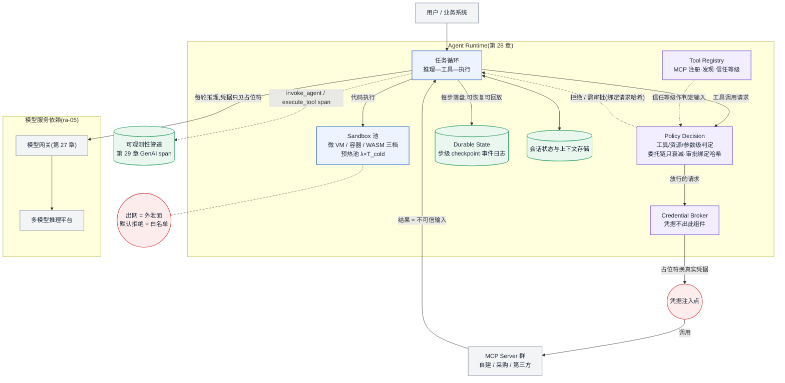

# 参考架构 06:Agent 平台

服务对象:承载多轮"推理—工具—执行"循环型负载的平台——编码助手、深度研究、业务流程自动化。它不是推理平台加几个插件:Agent 负载的资源画像(交替占用)、威胁模型(数据被当成指令)与状态语义(长任务可恢复)都与纯推理不同,值得一层独立基础设施([§28.4.1](../第六部分-上层平台/第28章-Agent运行时基础设施.md#2841-agent-负载的资源画像交替占用而非持续占用))。

## 目标与非目标

**目标**

- 承载 N 轮任务循环:每轮推理作为独立请求经网关进入模型服务(轮间释放推理并发),工具与沙箱并发由运行时单独治理。
- Runtime 2.0 组件齐备:Tool Registry(注册/发现/信任等级)、Policy Decision(工具/资源/参数级授权)、Credential Broker(凭据不出组件)、Sandbox(不可信代码执行)、Durable State(步级 checkpoint + 事件日志)([§28 Agent Runtime 2.0](../第六部分-上层平台/第28章-Agent运行时基础设施.md#2844-agent-runtime-20协议权限与持久执行))。
- 工具接入协议化:MCP 统一注册与发现;同步调用与长任务(Tasks 扩展)两套状态机分开治理。
- 长任务可恢复、可审计回放:任意一步失败后从步级 checkpoint 续起,不从头重跑。
- 端到端可观测:一次任务是一棵标准嵌套 span 树,超时预算逐层有实测依据([§29 OTel GenAI](../第七部分-工程化与治理/第29章-可观测性与评测流水线.md#2923-把指标说同一种语言otel-genai-语义约定))。

**非目标**

- 模型推理本身:本平台不自建推理栈,模型调用全部经模型网关落到 [ra-05 多模型在线推理平台](ra-05-multi-model-serving-platform.md)(或经网关路由的外部供应商)。
- Agent 应用逻辑与提示词工程:平台提供循环、工具、沙箱、状态四种原语,不裁决应用怎么用。
- 高吞吐纯文本生成:没有工具与沙箱的负载不需要这套,见[失效边界](#失效边界)。

## 组件图

组件按第 28 章 Runtime 2.0 全图落位;模型侧依赖以 ra-05 整体出现;项目名按[附录 C.1.3](../附录/附录C-框架选型快照.md#c13-配套工具层不入三层地图按用途归类) 口径。



结构要点:四个治理组件各管一件不能混的事——Registry 管"工具是谁、可信到什么程度",PDP 管"这一次能不能调",Broker 管"调用时凭据从哪来",Durable State 管"任务执行到第几步"。凭据只在 Broker 到调用边界的一小段出现;模型、会话历史与 Durable State 里自始至终只有占位符。

## 数据流与控制流

**任务数据流**

1. 任务进入运行时,建会话与 Durable State 记录;每一轮循环:模型经网关推理(带全部上下文,凭据为占位符)→ 模型产出工具调用意图 → PDP 判定 → Broker 注入凭据 → 调用 MCP Server 或投递沙箱 → 结果按**不可信输入**标记来源后进上下文 → 下一轮。
2. 每步(推理结果、工具结果、状态变更)写 Durable State:跨实例恢复与事后审计回放都靠它;会话历史("对话到哪了")与执行状态("任务到第几步")分开存([§28.4.5](../第六部分-上层平台/第28章-Agent运行时基础设施.md#2845-会话状态与上下文存储))。
3. 同步工具调用与长任务两套状态机:同步调用超时即失败、运行时对瞬态失败透明重试(带幂等键),只有语义性失败交回模型([§28.4.3](../第六部分-上层平台/第28章-Agent运行时基础设施.md#2843-工具调用超时重试与延迟放大));长任务经 Tasks 扩展换取持久句柄,取消、补偿、幂等是必选项,"不知道任务最后怎样了"不是合法终态。

**控制流**

- 工具接入:MCP Server 经 Registry 注册,信任等级(自建/采购/第三方)与工具清单签名验证结果一并入册;策略变更经 PDP 下发,不改运行时代码。
- 沙箱供给:预热池按到达率与冷启动时长维持水位;依赖进镜像或预挂载只读层,运行时零安装([§28.4.2](../第六部分-上层平台/第28章-Agent运行时基础设施.md#2842-沙箱隔离级别的三档与延迟预算))。
- 模型侧流量治理归 ra-05 的网关(配额、计费、路由);工具侧流量治理归运行时(按工具、按租户限流)——运行时之于工具流量,就是网关之于模型流量。

## 容量模型

Agent 平台的容量是三本独立的账:模型侧 token 吞吐、沙箱池、状态存储。公式引用[附录 B](../附录/附录B-估算公式速查与符号表.md#b2-公式速查) 与第 28、31 章。

**假设声明(示例数字仅为公式演示,上线前换实测)**

- 任务到达率 λ_task = 2 任务/s;平均每任务 R = 8 轮推理;
- 每轮平均输入上下文 6000 token(多轮累积,前缀高度重复)、输出 500 token;
- 每任务平均 1.5 次沙箱执行,沙箱占用时长 T_sbx = 20 s,冷启动 T_cold(微 VM,依赖零安装)= 0.3 s;
- 峰值余量 2 倍;GPU 有效占空比 20%–40%(交替占用,[§28.4.1](../第六部分-上层平台/第28章-Agent运行时基础设施.md#2841-agent-负载的资源画像交替占用而非持续占用))。

**账一:模型侧吞吐需求(交给 ra-05 的输入)**

- 折算轮级 QPS:λ_round = λ_task × R = 2 × 8 = 16 轮/s——这才是喂给 ra-05 容量模型([§31.1.1](../第七部分-工程化与治理/第31章-容量、成本与SLO.md#3111-容量模型一条完整的推导链))的 QPS,任务级 QPS 会把需求低估一个数量级;
- decode 需求 = 16 × 500 = 8000 token/s;prefill 名义需求 = 16 × 6000 = 96 000 token/s——但多轮上下文前缀高度重复,前缀缓存命中后实际 prefill 远低于名义值,Agent 负载因此对前缀感知路由的敏感度高于普通负载([§24.4.5](../第五部分-推理系统/第24章-服务化架构与显存类加速.md#2445-前缀感知路由路由策略与命中率的耦合讲透));KV 并发与命中折减用 F8/F9 代入:

```bash
PYTHONPATH=calculators/src python3 -m ai_infra_calc kv \
  --layers 32 --kv-heads 8 --head-dim 128 --kv-precision fp16 \
  --kv-pool-gib 48 --avg-context-tokens 6000 --prefix-hit-rate 0.7
PYTHONPATH=calculators/src python3 -m ai_infra_calc inference \
  --qps 16 --avg-input-tokens 6000 --avg-output-tokens 500 \
  --measured-instance-tokens-per-s 1500 --waterline 0.7 --redundancy-instances 2
```

- 并发口径:任务并发 ≠ 推理并发。轮间释放推理并发后,推理侧并发 ≈ 任务并发 × 占空比(20%–40%);按任务占并发做准入会把 GPU 并发额度浪费在空转等待上。

**账二:沙箱池(第 28 章的算术)**

- 沙箱到达率 λ_sbx = λ_task × 1.5 = 3 次/s;
- 稳态并发沙箱数 ≈ λ_sbx × T_sbx × 峰值余量 = 3 × 20 × 2 = 120 个;
- 预热池下限 ≈ λ_sbx × T_cold × 余量 = 3 × 0.3 × 2 ≈ 2 个(微 VM 冷启动短,池子可以很小;换成秒级冷启动的容器池,同口径要 12 个以上)——预热池是用内存换启动延迟,隔离技术决定汇率;
- 内存 = 并发数 × 单实例底噪(微 VM 数十~百余 MB/个,120 个约 10–20 GB 量级)。

**账三:Durable State 与会话存储**

- 事件写入速率 ≈ λ_task × R × 每轮事件数;单任务状态体量 ≈ 每步快照 × R——按事件日志追加写建模,读放大发生在恢复与回放,容量以保留期(审计要求)为主导项而非速率。

**敏感参数**:每任务轮数 R 同时放大三本账,是 Agent 平台容量的第一敏感量;单工具 P99 超时率 p 经 1−(1−p)^N 放大到任务级(p=1%、N=8 → 约 7.7% 任务劣化),超时预算必须从任务级 SLO 反推([§28.4.3](../第六部分-上层平台/第28章-Agent运行时基础设施.md#2843-工具调用超时重试与延迟放大))。

## 故障域

| 故障域 | 爆炸半径 | 平台行为 |
|---|---|---|
| 单沙箱(死循环、OOM) | 该任务一步 | 四维资源限制强制终止(CPU/内存/墙钟/网络);任务从上一步 checkpoint 续起 |
| 单工具 / MCP Server | 依赖该工具的任务 | 运行时快速失败 + 透明重试;持续故障则 Registry 标记降级,PDP 拒绝路由 |
| 运行时实例 | 该实例上的活跃任务 | Durable State 跨实例恢复;长任务句柄与连接解耦,不随实例死亡 |
| 模型服务(ra-05) | 全部任务的推理轮 | 网关故障转移与降级(rb-09);任务循环对轮级失败重试,不整任务重跑 |
| 凭据/策略面(PDP、Broker) | 全平台工具调用 | 失效关闭(fail-closed):判定不可达 = 拒绝调用,宁可任务挂起不可无授权放行 |

跨域放大:长任务的"取消只停轮询不停任务"会让故障后的孤儿任务继续烧资源、继续产生副作用——取消信号必须传导到工具执行方,补偿逆操作由工具方提供、运行时编排([§28 Agent Runtime 2.0](../第六部分-上层平台/第28章-Agent运行时基础设施.md#2844-agent-runtime-20协议权限与持久执行) 五机制表)。

## 安全边界

这套架构的安全设计从一个威胁模型出发:**模型的行为由输入文本驱动,而输入文本里可能混着攻击者的话**(prompt injection 与 tool poisoning 是同一结构的两个入口)。所以边界全部收在运行时组件上,不指望模型"自觉":

- **凭据三原则**:凭据绝不进 Prompt、不进长期会话状态、不进 Durable State——进了 Prompt 的凭据等于广播。模型全程只见占位符,Credential Broker 在调用发出的边界换真实凭据,用后即弃;授权面基于 OAuth 2.1 的显式同意与用户控制。
- **委托链只衰减**:用户→Agent→子 Agent,每一跳权限只能收窄;由 PDP 强制,粒度到工具级、资源级、参数级。
- **审批绑定请求哈希**:高危操作的人工审批绑定参数哈希,执行前校验一致,封死 TOCTOU 窗口(批的是转账 100 元,执行时不能变成 10 万)。
- **不可信输入面**:工具输出一律按不可信输入对待,与"模型生成的代码等同于不可信第三方代码"是同一威胁模型的两面;低信任工具的输出进上下文前标记来源,其后续可触发的动作由 PDP 收紧。
- **沙箱与出网**:不可信代码默认微 VM 档(百毫秒级代价买断共享内核风险面);网络默认拒绝出站 + 白名单,SSRF 与数据外泄的出网路径统一归沙箱网络策略管([§28.4.2](../第六部分-上层平台/第28章-Agent运行时基础设施.md#2842-沙箱隔离级别的三档与延迟预算))。
- **工具供应链**:MCP Server 清单(版本与权限声明)作为可签名制品,签名验证结果进 Registry 信任等级评定;机制与模型制品共用一套([第 30 章模型供应链](../第七部分-工程化与治理/第30章-模型生命周期管理.md#3046-模型供应链从五元组到可签名制品))。

## 可观测性

一次 Agent 任务在 trace 上是一棵标准嵌套 span 树,词汇直接采用 OTel GenAI 语义约定而不自造:`invoke_agent` 里套模型调用 span,模型调用之间夹 `execute_tool`,工具 span 里再套沙箱执行,MCP 交互有专门约定([§29 OTel GenAI](../第七部分-工程化与治理/第29章-可观测性与评测流水线.md#2923-把指标说同一种语言otel-genai-语义约定))。这不是打点洁癖:尾延迟放大(单工具 p=1% 在 8 轮任务里放大到约 8%)没有分层 trace 时只能日志考古,有了嵌套 span 才看得出是模型在等工具、工具在等下游、还是沙箱在等冷启动——逐层超时预算第一次有实测依据。

- **任务级 SLI**:任务成功率、端到端时长分布、每任务轮数分布、token 消耗分布(计费与容量共用口径);
- **组件级先行指标**:沙箱池水位与冷启动率、工具级 P99 与超时率、PDP 拒绝率(突升 = 策略事故或注入攻击探测)、Broker 凭据换取失败率;
- **审计事件流**:每次工具调用的(身份、工具、参数哈希、判定结果)进事件日志,与 Durable State 回放对齐——安全审计与故障复盘用同一份数据;
- **模型侧指标**(TTFT/TPOT/goodput)由 ra-05 按其[可观测性](ra-05-multi-model-serving-platform.md#可观测性)提供,经 trace 上下文关联到任务;
- **质量维度**:Agent 任务的"不报错但变笨"同样存在(模型换版本后工具调用成功率、任务完成率漂移),接[§29.2.5](../第七部分-工程化与治理/第29章-可观测性与评测流水线.md#2925-评测是一个吃卡的批任务) 的评测流水线做回归。

## 运维 Runbook 索引

| 场景 | Runbook |
|---|---|
| 凭据泄漏(进日志/trace/上下文) | [rb-11 Agent 凭据泄漏](../runbooks/rb-11-agent-credential-leak.md) |
| 沙箱逃逸或策略失效事件 | [rb-12 沙箱逃逸或策略失效](../runbooks/rb-12-sandbox-escape-response.md) |
| 模型侧队列爆炸波及任务循环 | [rb-07 推理队列爆炸](../runbooks/rb-07-inference-queue-explosion.md) |
| 模型换版本后任务质量回归 | [rb-10 模型质量回归](../runbooks/rb-10-model-quality-regression.md) |

## 成本驱动项

1. **token 消耗**是第一大项:轮数 R 与每轮上下文长度双重放大;上下文修剪与前缀缓存命中率直接折算成钱(prefill 成本),重试策略错位("所有失败都抛给模型处理")等于用最贵的组件干最便宜的活;
2. **沙箱池内存**:稳态并发 × 单实例底噪 + 预热池;隔离档位选择改变一个数量级;
3. **工具下游调用费**:外部 SaaS API 按次计费时,多轮循环的反复敲打要进按工具/按租户的配额治理,否则成本失控先于容量失控;
4. **Durable State 存储**:体量由审计保留期主导,分层(热:活跃任务;冷:合规归档)是主要优化手段;
5. 模型侧卡成本经 ra-05 的账折算,TCO 口径统一按[§31.3.1](../第七部分-工程化与治理/第31章-容量、成本与SLO.md#3131-tco-建模五块构成)。

## 失效边界

- **高吞吐纯文本生成不需要这套**:没有工具调用、没有代码执行、单轮或简单多轮的生成负载(摘要、翻译、批量改写),直接走 [ra-05](ra-05-multi-model-serving-platform.md) 即可——给它套上 Registry/PDP/Broker/沙箱,是为不存在的威胁面付真实的延迟与运维成本。判据:负载中工具调用轮占比趋近于零,则回落 ra-05。
- **单应用、少量可信自建工具**:全部工具自建、无第三方接入、无不可信代码执行时,PDP 与 Broker 可以合并简化为静态配置——Runtime 2.0 全图的价值随第三方工具与租户数增长,不随任务量增长。
- **多租户强合规场景的升级点**:当租户要求"平台运营方也不可见其数据"(金融、医疗、跨组织数据协作),本架构的隔离档位到顶也只到微 VM——升级方向是机密计算:沙箱与推理实例迁入 TEE、远程证明(attestation)进 Registry/PDP 的信任判定输入、Broker 的凭据释放以证明通过为前提。这是隔离边界从"防租户之间"到"防平台自身"的质变,按合规要求触发,不做默认配置。
- **地域与规模扩展**:任务循环与沙箱池多集群化时(就近执行、故障域隔离),控制面组件(Registry/PDP/策略)全局一份、执行面随集群分布,整体并入 [ra-07 多集群 AI 平台](ra-07-multi-cluster-ai-platform.md)的管理/执行分离框架。
