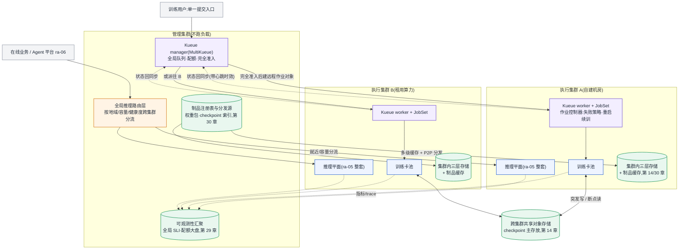

# 参考架构 07:多集群 AI 平台

服务对象:算力物理上分散——多地域自建机房、按月租用的多家算力供给方、训练与推理分区建设——但配额视图、排队纪律与制品口径必须统一的组织。架构主线是**管理/执行集群分离**:排队与记账留在一处,执行跟着卡走([§9 调度准入与作业控制器](../第二部分-算力底座/第09章-批调度器.md#调度准入与作业控制器两层职责的分界))。

## 目标与非目标

**目标**

- 单一提交入口:训练作业只面对 manager 集群,完全准入(配额 + 准入检查)后才在选定 worker 集群创建远程作业对象,状态持续回同步(MultiKueue 语义,第 9 章)。
- 推理多集群化:每个执行集群内是一套完整的 [ra-05](ra-05-multi-model-serving-platform.md) 推理平面,全局路由层按地域、容量与健康度跨集群分流(第 27 章路由层的集群维扩展)。
- 数据与制品统一分发:checkpoint、权重包、数据集按第 14 章存储分档与第 30 章分发架构跨集群就位。
- 故障语义清晰:集群内故障归执行侧自愈,集群级故障归准入侧回收重派,杜绝双跑与悬挂([§20 跨集群训练的故障语义](../第四部分-训练系统/第20章-稳定性与容错.md#跨集群训练的故障语义))。

**非目标**

- 跨集群单作业训练(一个作业的并行组横跨两个机房):跨域带宽与 F20 的 B_eff 折扣使其只在极特定拓扑下成立,本架构默认**作业整体落在单集群内**,多集群解决的是"作业往哪派",不是"作业怎么切"。
- 单集群内部的调度、推理与 Agent 架构:分别见第 9 章、[ra-05](ra-05-multi-model-serving-platform.md)、[ra-06](ra-06-agent-platform.md),本架构只描述它们之上的一层。
- 单集群能装下的场景:见[失效边界](#失效边界)。

## 组件图

项目名按[附录 C.1.1](../附录/附录C-框架选型快照.md#c11-训练侧) 口径:批调度准入用 Kueue(MultiKueue 做管理/执行分离)或 Volcano,作业生命周期单元用 JobSet;推理侧沿 ra-05 口径。

结构要点:三层职责不越界——Gang 语义保证作业内原子性(第 9 章),准入层保证集群间与队列间的配额纪律(manager),作业控制器保证进场之后的生命周期(worker 的 JobSet);推理侧对称地分两层——"进哪个集群"由全局路由层回答,"进集群后落到哪个池/实例"由该集群内 ra-05 的三层回答。

## 数据流与控制流

**训练控制流**

1. 作业提交到 manager,本地排队;完全准入(配额 + 准入检查)通过后,在选定 worker 集群创建远程作业对象——选择依据是配额归属、数据就位情况与集群健康度。
2. worker 侧 JobSet 承载多角色作业的生命周期(启动顺序、成功/失败策略、稳定网络端点),集群内故障(节点坏、进程崩、hang)由它按失败策略处置,manager 不感知。
3. 远端状态持续回同步 manager;回同步中断超过心跳时效即按集群失联处理:manager 回收准入、经围栏(fencing)确认旧远端对象清理后重新排队、可重派其他集群([§20 跨集群训练的故障语义](../第四部分-训练系统/第20章-稳定性与容错.md#跨集群训练的故障语义))。

**训练数据流**

- 数据集与代码在派发前预热到目标集群本地存储(数据就位是派发决策的输入,不是作业启动后再拉);
- checkpoint 突发写落集群内高性能层、异步汇聚到跨集群共享对象存储([§14.4.3](../第三部分-数据底座/第14章-存储与Checkpoint-IO.md#1443-checkpoint-的突发写模式本章核心)),checkpoint 路径按派发代次隔离——这是防双跑污染的围栏之一;
- 重派后的续训从共享对象存储读最近可用 checkpoint,恢复成本进重派决策(丢多少步 × 卡时)。

**推理控制流与数据流**

- 模型发布:注册表为源,权重包经多级缓存 + P2P 分发到各集群制品缓存([§30.4.4](../第七部分-工程化与治理/第30章-模型生命周期管理.md#3044-制品管理与权重分发被低估的一环)),**各集群近两版常驻热缓存**——跨集群故障转移的前提是目标集群权重已就位,分发不是发版动作而是常态同步;
- 全局路由层做地域就近与集群级故障转移(某集群推理平面整体不可用时把流量切走),灰度权重全局统一下发,避免"A 集群 95/5、B 集群 80/20"的口径漂移;
- 请求进入集群后,数据流与 [ra-05 数据流](ra-05-multi-model-serving-platform.md#数据流与控制流) 相同。

## 容量模型

多集群的容量模型 = 各集群按单集群公式独立计算,再加三笔只有多集群才有的账:冗余、跨集群带宽、失衡损耗。公式引用[附录 B](../附录/附录B-估算公式速查与符号表.md#b2-公式速查) 与[第 31 章推导链](../第七部分-工程化与治理/第31章-容量、成本与SLO.md#3111-容量模型一条完整的推导链)。

**假设声明(示例数字仅为公式演示)**

- 训练主力模型 N = 70B,BF16 + Adam;
- 跨集群专线有效带宽 B_x = 1.25 GB/s(10 Gbps 标称打满的理想值,实际按 F20 口径再打 60%–80% 折扣);
- 推理权重包按 FP8 部署(p = 1);
- 推理侧两集群服务同一业务,目标为任一集群整体失效时另一集群独立扛住峰值。

**账一:各集群独立容量(引用既有公式)**

- 训练卡数:N_GPU = 6ND ÷ (F_peak × MFU × U × T_deadline)(第 31 章训练侧公式;MFU 与可用率 U 两个折扣使真实卡数为理想值的 2.5–4 倍);
- 推理实例数:逐集群按 [ra-05 容量模型](ra-05-multi-model-serving-platform.md#容量模型) 计算(F8/F9 + inference 估算器),输入用**该集群承接流量份额**的 QPS。

**账二:跨集群带宽(多集群特有)**

- checkpoint 体量(F4 口径,BF16 + Adam 模型状态):≈ 16N Byte = 16 × 70 × 10⁹ ≈ 1.12 TB/份;
- 跨集群汇聚一份 checkpoint 的时间 ≈ 1.12 TB ÷ 1.25 GB/s ≈ 900 s ≈ 15 分钟——checkpoint 间隔若为 30 分钟,汇聚链路已占半程,间隔或带宽必须重新设计;这也是重派恢复延迟的下界(目标集群至少要读到一份完整 checkpoint);
- 权重包分发(F6 口径):M = p × N = 70 GB/版;新集群冷启动或版本全量更新时,单源拉取时间 = 70 GB ÷ B_x ≈ 56 s/集群(P2P 后源端为 O(1),集群内再分发按第 30 章带宽账另算);
- 结论形式:**跨集群链路的容量约束表达为"每天能汇聚几份 checkpoint、能同步几个模型版本",超出即要求提升带宽或降低同步频率,没有第三个选项。**

**账三:冗余与失衡**

- 推理侧 N+1 集群冗余:任一集群失效、其余集群扛住全量峰值,则每集群水位上限 ρ_x ≤ ρ × (K−1)/K(K 个等容量集群)。K = 2 时各集群日常水位不得超过单集群水位的一半——**两集群容灾的隐含成本是近一倍冗余**,K 越大摊得越薄,这是集群数量的第一决策变量;
- 训练侧失衡损耗:作业整体落单集群意味着"A 集群排队、B 集群空卡"的碎片化不可避免,全局利用率上限低于单大集群;缓解靠 manager 的队列策略(借用/回收),但不为跨集群切分作业买单(非目标)。

**敏感参数**:跨集群带宽 B_x(决定 checkpoint 汇聚与故障转移下界)、集群数 K(决定冗余摊薄)、单作业最大规模(决定最小集群规格——最大作业必须整体装进某一个集群)。

## 故障域

多集群架构新增的故障域在"集群"与"链路"两级,集群内部故障域沿用各自架构:

| 故障域 | 爆炸半径 | 平台行为 |
|---|---|---|
| worker 集群内(节点/进程/hang) | 该作业 / 该实例 | 执行侧自愈:JobSet 失败策略、EPP 摘除实例;manager 不介入 |
| worker 集群整体失联 | 该集群全部负载 | 训练:manager 回收准入、围栏后重派;推理:全局路由层切流(前提:权重已就位 + 目标集群冗余水位) |
| manager 集群 | 新作业提交与重派(存量执行不受影响) | 执行面自治是设计底线:manager 故障不打断 worker 上已运行的作业与推理;恢复后按回同步重建视图 |
| 跨集群链路 | 状态回同步 + 制品/checkpoint 同步 | 回同步断链按心跳时效升级为集群失联处理;制品同步中断触发"版本就位度"告警,冻结依赖转移的发布 |
| 全局路由层 | 全部推理入口 | 多副本多地域部署;极端降级:业务直连各集群入口(预案演练项) |

两类必须设防的多集群特有事故([§20 跨集群训练的故障语义](../第四部分-训练系统/第20章-稳定性与容错.md#跨集群训练的故障语义)):**双跑**——manager 判失联重派,原集群只是控制面分区、作业仍在写 checkpoint;防线是重派前围栏确认 + checkpoint 路径按派发代次隔离。**悬挂**——worker 上作业已死透但回同步断在半路,manager 视图里仍"运行中",配额被尸体作业占住;防线是"运行中"状态的心跳时效。两者共性是 manager 视图与 worker 事实脱节:跨集群容错投入的重心在状态同步链路的时效与围栏,不在故障本身。

## 安全边界

- **集群间不互信**:租用算力集群与自建机房的信任等级不同;worker 集群持有的凭据只覆盖本集群职责(拉制品、写 checkpoint 到指定前缀),manager 的全局凭据不下发到 worker。
- **制品单向流动**:权重与数据集从注册表向执行集群分发,执行集群产出的制品(checkpoint、微调结果)必须经注册表登记与签名验证才能进入其他集群——租用集群产出的制品尤其不得绕过卡点直接流入生产推理平面([第 30 章模型供应链](../第七部分-工程化与治理/第30章-模型生命周期管理.md#模型供应链从五元组到可签名制品))。
- **数据出域合规**:数据集能派往哪些集群是准入检查的一部分(地域合规、供应商合同边界),在 manager 的派发决策里执行,不靠作业自觉。
- **租户边界与集群边界解耦**:租户配额在 manager 全局记账,不因作业落在哪个集群而改变口径;推理侧租户认证与配额沿 [ra-05 安全边界](ra-05-multi-model-serving-platform.md#安全边界) 在各集群网关执行,策略全局统一下发。

## 可观测性

- **两级视图,一套口径**:集群内指标(训练吞吐、goodput、KV 水位)在本集群闭环采集告警;manager 侧汇聚全局视图——队列长度与等待时间、各集群配额占用、跨集群链路时延与积压。指标语义按[第 29 章](../第六部分-上层平台/第29章-可观测性与评测流水线.md#2921-llm-专属指标体系定义采集点与误用)统一,推理 trace 沿 OTel GenAI 约定跨全局路由层与集群内网关拼接;
- **状态同步链路是一等公民**:回同步延迟、心跳时效余量、围栏操作审计——防双跑/悬挂的防线本身必须可观测,"回同步断了多久"要有告警而不是事后发现;
- **就位度指标**:各集群的模型版本就位度(热缓存里有没有近两版)、数据集预热进度——它们是故障转移与派发决策的前置条件,缺口 = 容灾能力的真实缺口;
- **训练侧北极星**:各集群与全局的有效训练时间占比([§20.4.2](../第四部分-训练系统/第20章-稳定性与容错.md#2042-有效训练时间占比稳定性的唯一北极星指标)),重派造成的丢步与排队等待都计入损耗,用同一口径比较"多集群摊薄"与"单集群排队"的真实代价。

## 运维 Runbook 索引

| 场景 | Runbook |
|---|---|
| 某集群推理队列爆炸(切流前判定) | [rb-07 推理队列爆炸](../runbooks/rb-07-inference-queue-explosion.md) |
| 集群内 KV 池抖动与容量塌陷 | [rb-08 KV Cache thrashing](../runbooks/rb-08-kv-cache-thrashing.md) |
| 全局路由层供应商/集群级故障转移 | [rb-09 网关供应商故障](../runbooks/rb-09-gateway-provider-outage.md) |
| 跨集群灰度口径漂移引发质量回归 | [rb-10 模型质量回归](../runbooks/rb-10-model-quality-regression.md) |

训练侧集群内故障(hang、通信超时、慢节点、checkpoint stall)的处置沿用训练系列 runbook 与第 20 章决策树,不在本架构重复。

## 成本驱动项

1. **容灾冗余**:N+1 集群冗余在 K 小时最贵(K=2 近一倍),集群数量与冗余摊薄的权衡是多集群 TCO 的第一项;
2. **跨集群带宽**:专线按峰值(checkpoint 汇聚 + 版本同步)购买,却大部分时间空闲——同步频率与带宽档位联动设计,不独立拍板;
3. **失衡损耗**:训练作业整体落单集群带来的碎片化排队,表现为"有卡不能用"的隐性成本,进有效训练时间占比口径核算;
4. **管理集群与全局组件**:manager、全局路由、可观测汇聚本身不产出算力,是纯治理开销——它的预算合理性来自替代方案(每集群一套独立入口与配额)的口径混乱成本;
5. **多套存储与缓存**:每集群三层存储 + 制品热缓存 × K,加跨集群共享对象存储;分档策略见[§14.5.2](../第三部分-数据底座/第14章-存储与Checkpoint-IO.md#1452-存储架构按规模分档);
6. TCO 统一口径按[§31.3.1](../第七部分-工程化与治理/第31章-容量、成本与SLO.md#3131-tco-建模五块构成),租用集群的计费模式(按月整租 vs 按量)单独立项比较。

## 失效边界

- **单集群装得下时,这套架构是纯增复杂度**:一个机房、一份电力容量能承载全部训练与推理时,MultiKueue 的管理/执行分离、全局路由、跨集群同步链路没有一件创造价值,却每一件都引入新故障域(双跑、悬挂、口径漂移)。判据:最大作业 + 峰值推理 + 增长预留能进单集群的电力与机柜约束([§31.1.1](../第七部分-工程化与治理/第31章-容量、成本与SLO.md#3111-容量模型一条完整的推导链) 第四步),就留在单集群,把钱花在集群内部。
- **触发升级到本架构的三个真实信号**:算力供给方物理分散且合同独立(租用多家)、地域合规或就近接入要求(数据出域限制、跨地域延迟)、单机房电力/故障域上限(第 31 章采购粒度与机房约束)。任何一条成立即考虑;仅仅"卡不够了"不算——先扩单集群。
- **跨集群单作业训练不在本架构内**:当单作业规模超过最大单集群时,问题从"作业往哪派"变成"作业怎么切",跨域通信量(F15–F20)与 B_eff 折扣主导设计,需要专门的跨域训练方案与网络工程,不是在本架构上加配置能解决的。
- **联邦化的组织边界**:当各集群分属独立法人/预算主体、无法接受统一 manager 记账时,本架构的"单一配额视图"前提不成立——那是联邦协作问题(各自平台 + 契约化接口),不是多集群平台问题。
