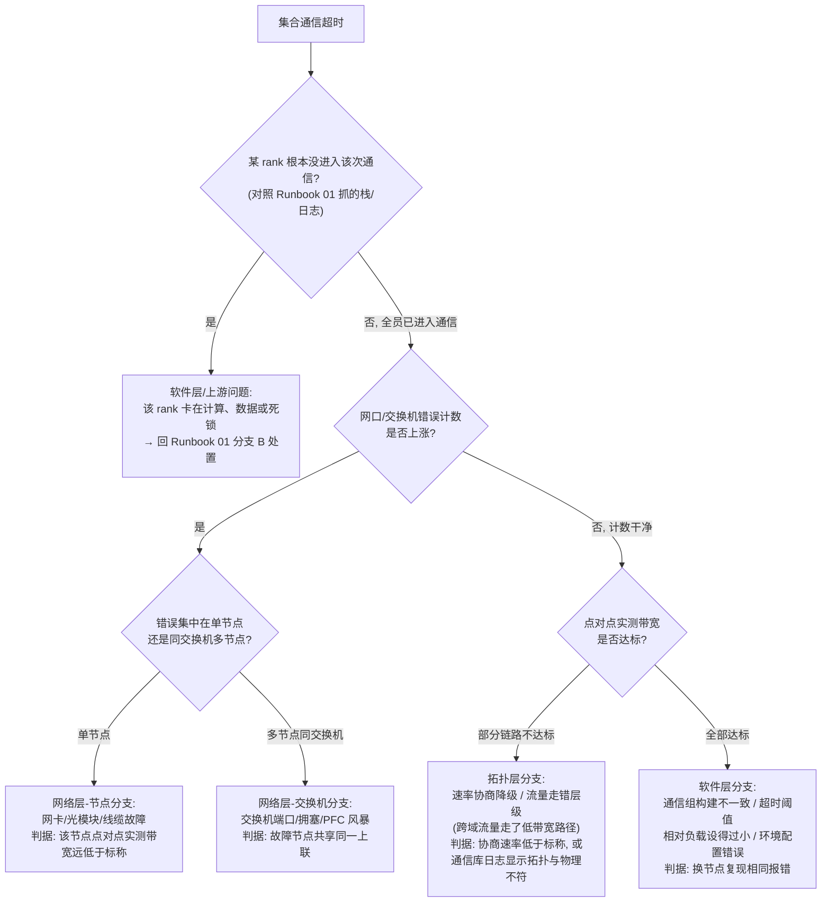

# Runbook 02:集合通信超时(NCCL/HCCL timeout)

## 现象

- 任务报集合通信超时错误退出:通信 watchdog 触发,报错信息中带有超时的通信原语(AllReduce/AllGather/Broadcast 等)、通信组与等待时长——这是 [§20.4.3](../第四部分-训练系统/第20章-稳定性与容错.md#2043-故障检测三类问题难度递增) 所说"把无限等待转化为第一类故障"的设计在起作用。
- 或未配置 watchdog 时表现为 hang(先走 [Runbook 01](rb-01-training-hang.md) 分诊,其分支 A 会转入本 Runbook)。
- 可能伴随:网络接口错误计数上涨、交换机端口告警、单节点通信带宽实测值劣化(通信故障的表现形式全景见 [§7.4.8](../第一部分-基础与心智模型/第07章-互联与集合通信.md#748-网络故障的表现形式与排查))。

## 影响范围

- **单任务级起步**:超时杀掉的是一个任务。但通信问题的根因几乎总在共享层——网卡、线缆、交换机、拓扑配置——因此必须立即回答:**故障链路是否被其他任务共享?**
- 判定:同一交换机/同一互联域(域的层级定义见 [§7.4.4](../第一部分-基础与心智模型/第07章-互联与集合通信.md#744-互联域与三级拓扑本章核心))上的其他任务若同时出现带宽劣化或超时,升级为**集群级网络事件**,转交网络值班并冻结该故障域的调度。

## 立即止损

1. **不要立刻原地重启**:通信超时的根因多为硬件/链路,原地重启大概率再次超时,白白多损失一轮启动 + 回滚时间。先花 5 分钟采证据(下节)。副作用:恢复时间推后 5 分钟。
2. **缩小嫌疑面后重启**:若证据指向某节点/某链路(该节点网卡错误计数上涨、报错集中提及某 rank),将嫌疑节点隔离出资源池,任务在其余节点 + 热备节点上从 checkpoint 重启。副作用:资源池容量减少;误判则闲置好节点;回滚损失半个 checkpoint 间隔的进度。
3. **无明确嫌疑时,换一批节点重启**:通过调度器排除本次任务原节点集合,换节点重启一次作为"排除法"——恢复则说明原节点集内有坏链路,原节点集进入离线排查。副作用:占用双份节点配额的调度窗口;若集群紧张可能需要抢占低优任务。
4. **确认为集群级事件时,冻结故障域调度**:阻止新任务调度进嫌疑交换机/互联域。副作用:集群可调度容量下降,排队任务等待时间拉长;需要与容量管理方同步。

## 证据采集

- **报错现场**:各 rank 的完整报错日志——超时发生的原语、通信组、rank 列表;开启通信库 debug 日志时保留其输出(拓扑构建、算法选择、环/树结构,口径见 [§7.4.3](../第一部分-基础与心智模型/第07章-互联与集合通信.md#743-拓扑感知ringtree-与调优入口))。
- **网络层计数器**:各节点 RDMA/以太网口的错误、丢包、重传、PFC 暂停帧计数;交换机端口的 CRC 错误与拥塞计数(需网络团队配合)。
- **链路健康**:节点间点对点带宽/延迟实测(带宽压测工具跑通信原语基准),重点是嫌疑节点与任意健康节点之间的实测值 vs 拓扑标称值。
- **拓扑事实**:实际网卡速率协商值(是否协商到低速率)、RDMA 连通性、路由/子网配置;容器内看到的设备与亲和是否与预期一致(亲和错配机制见第 8 章)。
- **设备侧旁证**:嫌疑节点的 XID/health 错误码——通信超时有时是加速卡硬件故障的下游表现(是则转 [Runbook 03](rb-03-gpu-xid-ecc.md))。
- 训练侧指标采集口径见 [§29.2.3](../第六部分-上层平台/第29章-可观测性与评测流水线.md#2923-训练侧可观测性与告警设计)。

## 诊断决策树

五个叶子分支的判定依据与下一步已在图中标注;分支 C 回流 Runbook 01,分支 F 若伴随硬件错误码则续走 [Runbook 03](rb-03-gpu-xid-ecc.md)。

## 修复

- **网络层-节点分支(F)**:节点隔离进检修池,更换网卡/光模块/线缆后跑点对点基准达标再归还;任务换节点重启。
- **网络层-交换机分支(G)**:移交网络团队处置端口/更换硬件;处置期间冻结该交换机下节点的调度;拥塞类问题核查 PFC/ECN 配置与流量规划。
- **拓扑层分支(I)**:修正速率协商(重插/换线/固件配置)、修正通信库的拓扑发现配置,使流量回到正确层级;验证方法是通信库日志中的拓扑结构与物理拓扑一致且实测带宽达标。
- **软件层分支(J)**:统一各 rank 的通信组构建逻辑与环境配置;若根因是"负载本身有超长步"(如同步 checkpoint、首步编译)误触 watchdog,调大超时阈值或对已知长同步点做显式豁免——不要为掩盖真故障而盲目调大阈值。
- 修复后一律以小规模通信基准(先 8 卡、再全任务规模)验证,再重启生产任务。

## 恢复验证

- 全任务规模的集合通信基准达到拓扑标称带宽的合理折扣区间(参照集群历史基线,偏差 ≤ 10%)。
- 任务重启后连续 ≥ 1 个 checkpoint 间隔无通信超时、无带宽劣化告警。
- 单步时长回到事发前基线 ±5%;通信等待时间占比回到基线(用 [§5.4](../第一部分-基础与心智模型/第05章-CUDA、CANN与加速器软件栈.md#54-profiling-方法论全书唯一定义处) 的时间线方法抽查一次,确认无异常尾部空泡)。
- 网口错误计数在恢复后 24 小时内不再增长。

## 复盘数据

- **检测延迟**:通信实际卡住(最后一次步数推进)→ watchdog 触发时长;watchdog 阈值本身是否合理(过长 = 白等,过短 = 误杀)。
- **定位时长**:报错 → 确定根因分支。
- **中断总时长与损失卡时**:含每次无效重启的启动 + 回滚成本,按"中断时长 × 卡数 + 回滚步数 × 单步时长 × 卡数"计。
- **无效重启次数**:恢复前原地/换节点重启了几轮——衡量分诊效率的关键项。
- 根因分支(C/F/G/I/J)、故障链路定位(节点/端口/线缆序列号)、是否共享层故障波及多任务。
- 数据进入 [§20.4.2](../第四部分-训练系统/第20章-稳定性与容错.md#2042-有效训练时间占比稳定性的唯一北极星指标) 核算。

## 长期防复发

- **通信 watchdog 全集群默认开启**,阈值按任务负载特征设定并登记豁免点([§20.4.3](../第四部分-训练系统/第20章-稳定性与容错.md#2043-故障检测三类问题难度递增))。
- **入池门禁**:节点上线/归还前必跑点对点与小规模集合通信基准,不达标不入池([§8.4.5](../第二部分-算力底座/第08章-K8s上的加速卡.md#845-节点生命周期驱动健康检查与自动隔离))。
- **网络计数器纳入常规监控**并设增速告警,把"错误计数悄悄上涨"提前到任务失败之前发现([§7.4.8](../第一部分-基础与心智模型/第07章-互联与集合通信.md#748-网络故障的表现形式与排查))。
- **拓扑一致性巡检**:定期比对通信库发现的拓扑与物理拓扑、协商速率与标称速率。
- **演练**:定期在演练窗口注入链路降速/丢包,验证 watchdog、告警与分诊链路的端到端时延([§20.4.8](../第四部分-训练系统/第20章-稳定性与容错.md#2048-故障演练与-slo))。
