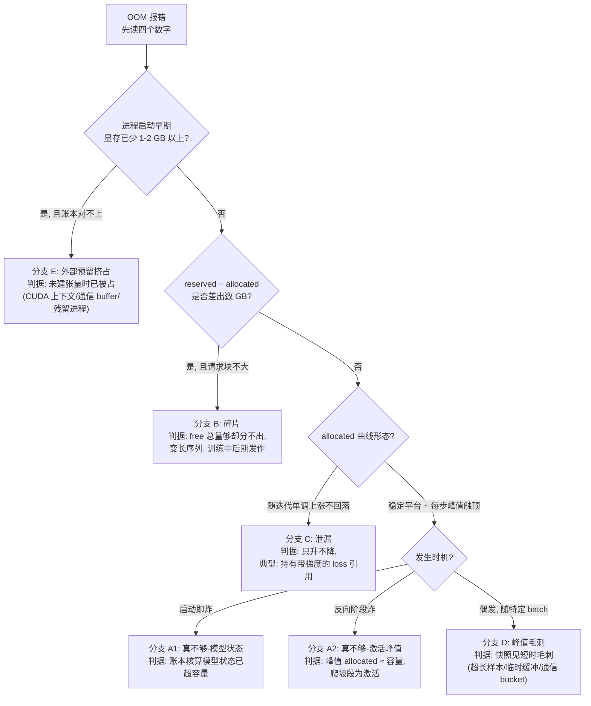

# Runbook 06:训练 OOM 与显存碎片

## 现象

- 任务报显存分配失败退出("CUDA out of memory" 及等价报错),报错信息中含关键取证数字:本次请求的块大小、已分配(allocated)、分配器持有(reserved)、报告的空闲量。
- 发生时机各异且是重要判据:启动即炸 / 跑了几步在反向时炸 / 跑了数小时甚至数天后炸——时机本身进入诊断树([§17.3.8](../第四部分-训练系统/第17章-显存与训练侧精度机制.md#1738-显存-oom-的系统性排查) 的排查顺序)。
- 背景机制:caching allocator 使 `nvidia-smi` 显示的是 reserved(框架圈地总量)而非张量实际占用,OOM 背后是四种治法互斥的病([§5.2.1](../第一部分-基础与心智模型/第05章-CUDA、CANN与加速器软件栈.md#521-caching-allocator-与-oom-的四种真实成因))。

## 影响范围

- **单任务级**:OOM 是任务自身的容量/软件问题,一个 rank OOM 即全任务中断(同步语义),但不影响其他任务、不损伤硬件。
- **例外升级**:同一物理卡上若存在其他显存消费者(共享卡、监控代理、残留僵尸进程占着显存),则是**节点级**环境问题;OOM 若在集群多任务同时出现且伴随框架/镜像变更,升级为**平台级**(基础镜像或默认配置的回归)。
- 反复 OOM-重启循环会空转配额并反复打断队列,处理不及时的成本按重启次数累积。

## 立即止损

1. **保住报错原文**(四个数字是归因的全部起点),再动任何东西。副作用:无——这一步没有理由跳过。
2. **检查是否环境挤占**:进程启动前该卡是否已被残留进程/其他消费者占走显存——是则清理残留、重启任务即可,不进诊断树。副作用:清理他人进程需先确认归属,误杀共享卡上的合法任务会制造新事故。
3. **快速复跑止血(选其一,均为临时措施)**:调小 micro batch 一档,或开启分配器可扩展段模式后重启。副作用:前者降低吞吐、可能改变梯度累积配比(需保持全局 batch 语义不变);后者仅对碎片有效、对真不够无效——两者都只是买时间,**未归因前不得当作修复结案**。
4. **反复 OOM 且无法快速复跑**:任务转入小规模复现(单机/小并行度)排查,释放大集群配额给队列。副作用:排查周期变长;大规模特有的 OOM(如通信 buffer 随并行度增长)在小规模可能不复现,需保留一次大规模取证机会。

## 证据采集

- **报错原文**:请求块大小、allocated、reserved、free 四个数字与发生时的调用栈(在哪个算子/阶段炸的)。
- **allocated / reserved 双曲线**:按迭代记录的显存曲线(框架显存统计接口),没有历史曲线时在复现运行中补采——归因树的主判据。
- **发生时机**:启动即炸 / 前几步反向炸 / 长时间运行后炸,及事发步数。
- **显存账本**:按 [§17.3.1](../第四部分-训练系统/第17章-显存与训练侧精度机制.md#1731-显存账本先算清楚再谈优化) 手算模型状态 + 激活的理论占用,与实测对照——差距大本身就是线索。
- **分配器快照**:抓一个 step 的显存时间线(快照工具,方法论归口 [§5.4](../第一部分-基础与心智模型/第05章-CUDA、CANN与加速器软件栈.md#54-profiling-方法论全书唯一定义处)),把峰值拆解为"模型状态基线 + 激活爬坡 + 峰值毛刺"。
- **数据形状分布**:序列长度分布、是否变长、事发 batch 的形状(碎片与峰值分支的判据)。
- **框架外占用**:进程刚启动、尚未建大张量时 `nvidia-smi` 已消失的量(CUDA 上下文、通信 buffer 等外部预留,[§5.2.1](../第一部分-基础与心智模型/第05章-CUDA、CANN与加速器软件栈.md#521-caching-allocator-与-oom-的四种真实成因) 第 4 类)。

## 诊断决策树

六个叶子(A1、A2、B、C、D、E)治法互斥——先归因再动手,只有 A1/A2 是"加显存/加卡/上显存优化"能解决的([§5.2.1](../第一部分-基础与心智模型/第05章-CUDA、CANN与加速器软件栈.md#521-caching-allocator-与-oom-的四种真实成因) 的结论)。

## 修复

- **分支 A1(模型状态放不下)**:按 [§17.3.1](../第四部分-训练系统/第17章-显存与训练侧精度机制.md#1731-显存账本先算清楚再谈优化) 核对账本后,按 [§17.4](../第四部分-训练系统/第17章-显存与训练侧精度机制.md#174-方案对比显存不够的三条路线) 的路线选择上 ZeRO 分片,不够再考虑 offload。
- **分支 A2(激活峰值)**:激活重计算(粒度选择见 [§17.3.3](../第四部分-训练系统/第17章-显存与训练侧精度机制.md#1733-激活重计算用算力换显存的三档粒度))或调小 micro batch(配合梯度累积保全局 batch 不变)。
- **分支 B(碎片)**:先用 snapshot 验证 inactive split 与失败请求块，再测试可扩展段、序列分桶或 packing(见 [第 16 章](../第四部分-训练系统/第16章-并行策略.md));不要用 ZeRO-3/offload 掩盖碎片，因为它们会改变布局与执行时间、让原始根因更难复现（参见 [§17.3.8](../第四部分-训练系统/第17章-显存与训练侧精度机制.md#1738-显存-oom-的系统性排查)）。
- **分支 C(泄漏)**:定位未释放引用(最经典:训练循环里累加带梯度的 loss 进日志列表,整张计算图不能释放),改为取标量值再累计;修复判据是 allocated 曲线回落为周期平稳。
- **分支 D(峰值毛刺)**:超长样本 → 数据侧截断/分桶;通信 buffer 毛刺 → 调 bucket 大小;重计算临时前向毛刺 → 调整重计算切分——毛刺靠精调参数,不靠大手段。
- **分支 E(外部预留)**:残留进程清理;合法预留(上下文、通信 buffer)计入容量规划,把"可用显存"口径修正后重核账本。
- 修复验证顺序:先小规模复现修复效果,再回大规模。

## 恢复验证

- 任务在生产规模连续运行 ≥ 24 小时(且跨越若干最长序列样本)无 OOM。
- allocated 曲线呈周期平稳形态(每步回落到同一基线,无单调上涨);reserved − allocated 稳定在合理水位(碎片分支修复的专项判据)。
- 峰值 allocated 与容量之间保留安全余量(≥ 5%,为偶发毛刺留位)。
- 若动了 micro batch/重计算/ZeRO 配置:吞吐与 loss 曲线和修复前基线对照过,全局 batch 语义未变、收敛行为一致。

## 复盘数据

- **检测延迟**:对泄漏/碎片类,allocated 或 reserved−allocated 曲线的异常拐点 → OOM 实际发生的时长(这段时间本可提前告警);对启动即炸类,记"本应在开训前算账本发现"。
- **中断与排查总时长、损失卡时** = 每次 OOM 的中断时长 × 卡数 + 无效重启(未归因就复跑又炸)次数 × 单次启动成本 × 卡数 + 回滚重算成本。
- **无效手段成本**:归因前误上的大手段(如为碎片开的 ZeRO-3)运行了多久、多付了百分之几吞吐。
- 根因分支(A1/A2/B/C/D/E)、修复动作、修复前后峰值显存与吞吐对照。
- 账本对照表:理论占用 vs 实测占用 vs 容量,留档供下次任务规格引用。

## 长期防复发

- **开训前账本门禁**:任务提交时按 [§17.3.1](../第四部分-训练系统/第17章-显存与训练侧精度机制.md#1731-显存账本先算清楚再谈优化) 交显存账本(模型状态 + 激活估算 + 外部预留),平台校验余量,消灭"启动即炸"。
- **allocated/reserved 双曲线纳入常规监控**:泄漏(单调上涨)与碎片(差值扩大)设趋势告警,把 OOM 提前到发生之前([§29.2.4](../第六部分-上层平台/第29章-可观测性与评测流水线.md#2924-训练侧可观测性与告警设计) 的训练侧指标体系)。
- **数据形状检查进训练模板**:开训前静态扫描序列长度分布,超长样本与变长抖动在数据侧先治(分桶/packing/截断)。
- **归因纪律制度化**:OOM 处置单必须填写根因分支后才能关闭,禁止"调小 batch 复跑成功"直接结案([§17.3.8](../第四部分-训练系统/第17章-显存与训练侧精度机制.md#1738-显存-oom-的系统性排查) 的排查顺序作为处置单模板)。
- **压测含显存维度**:新模型/新配置上生产集群前,跑含最长序列的显存峰值压测,验证安全余量。
