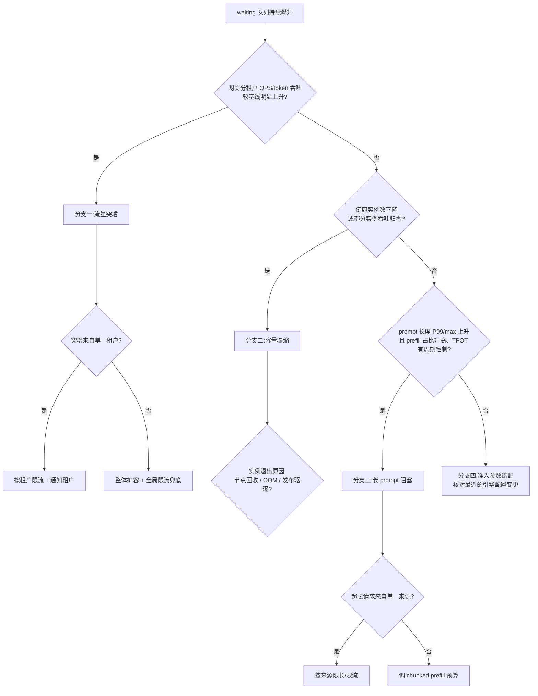

# Runbook 07:推理排队爆炸

## 现象

- 引擎 waiting 队列长度持续攀升不回落;排队时长占 TTFT 的比例从常态的个位数百分比升到 50% 以上(排队时长与 TTFT 的定义与采集点见 [§29.2.1](../第六部分-上层平台/第29章-可观测性与评测流水线.md#2921-llm-专属指标体系定义采集点与误用),调度器 waiting/running/token 预算三件套见 [§22.2](../第五部分-推理系统/第22章-推理引擎原理.md#222-批处理与调度))。
- TTFT P99 告警触发,但 TPOT 可能仍然正常——这是"问题在入场之前"的典型信号。
- 用户侧表现:首字迟迟不出、请求超时率上升;网关侧 429/503 可能尚未触发(限流阈值高于引擎实际容量时,压力全部堆在引擎队列里)。

## 影响范围

- **单实例队列爆炸**:该实例上的所有租户请求 TTFT 恶化,其他实例正常——多为路由不均或该实例容量异常。
- **同一模型全部实例队列爆炸**:该模型的所有调用方受影响,故障域是"模型服务组"。
- **多个模型同时爆炸**:大概率是共享资源(节点池被抽走、上游流量整体放大)或平台级事件,升级为平台故障处理。

判定方法:按实例聚合 waiting 长度,看爆炸是集中还是均匀。

## 立即止损

1. **在网关下调该模型的准入限流阈值**(token 级限流见 [§27.4.3](../第六部分-上层平台/第27章-模型网关.md#2743-token-级限流配额与计费可实现的设计)),把新增压力挡在网关、以 429 显式拒绝。副作用:被拒请求的调用方收到显式失败,需要其自行重试;但这是把失败前移到可控位置,替代方案是所有在场请求一起恶化。
2. **触发扩容并确认预热池余量**(扩缩容滞后与预热池见 [§25.4.2](../第五部分-推理系统/第25章-弹性与多模型.md#2542-扩缩容指标滞后与预热池))。副作用:无预热池时冷启动是分钟级到十几分钟级([§25.4.1](../第五部分-推理系统/第25章-弹性与多模型.md#2541-冷启动的三段拆解)),扩容在生效前不产生任何缓解——不要把它当成即时止损手段,必须与第 1 步同时做。
3. **若确认存在长 prompt 队头阻塞,临时下调单请求最大 prompt 长度上限**(机制见 [§22.2](../第五部分-推理系统/第22章-推理引擎原理.md#chunked-prefill长-prompt-饿死-decode))。副作用:超长请求被直接拒绝,长文档类业务功能受损,需要通知对应业务方。
4. **禁止的动作**:不要在队列爆炸期间重启引擎实例——重启清空 running 批次与 KV,所有在跑请求作废并回流成新排队压力,等于给爆炸再添一把火。

## 证据采集

止损前后各抓一次,间隔期间保持秒级采样:

- waiting 队列长度、running 批次大小、每步 token 预算利用率、抢占率、KV 池水位(引擎指标,采集点见 [§22.2](../第五部分-推理系统/第22章-推理引擎原理.md#222-批处理与调度) 与 [§29.2.1](../第六部分-上层平台/第29章-可观测性与评测流水线.md#2921-llm-专属指标体系定义采集点与误用))。
- 网关侧:分租户 QPS 与 token 吞吐的时间序列(突增定位)、429/503 计数、各实例的请求分配分布。
- 容量侧:该模型的健康实例数时间序列、节点/实例的退出事件(驱逐、OOM、抢占式实例回收)。
- 请求画像:近 30 分钟的 prompt 长度分布(P50/P99/max),与上一个正常时段对比。
- 保留爆炸时段的引擎调度日志片段(准入拒绝、抢占记录),日志会滚动覆盖,先落盘。

## 诊断决策树

判定依据说明:三个分支用三组互相独立的指标区分——流量突增看网关入口计数,容量塌缩看健康实例数,长 prompt 阻塞看请求画像加 TPOT 周期毛刺(长 Prefill 阻塞 Decode 的特征,见 [§22.2](../第五部分-推理系统/第22章-推理引擎原理.md#chunked-prefill长-prompt-饿死-decode))。先查前两个,因为它们的证据是纯计数、最不易误判。

## 修复

- **分支一(流量突增)**:单租户突增按租户收紧配额并联系其确认(灰度放量、批处理任务误配、重试风暴都常见);整体性增长走正式扩容,并按新水位重估容量与限流阈值的匹配关系(容量账见[第 31 章](../第七部分-工程化与治理/第31章-容量、成本与SLO.md))。
- **分支二(容量塌缩)**:先恢复实例数(补节点、回滚触发驱逐的发布);若塌缩由抢占式/竞价资源回收引起,把该模型的保底容量迁到稳定资源池,弹性部分才用可回收资源([§25.5](../第五部分-推理系统/第25章-弹性与多模型.md#255-方案对比三种弹性策略))。
- **分支三(长 prompt 阻塞)**:确认 chunked prefill 已启用且 chunk 预算合理;为超长请求设独立队列或独立实例组,与交互式流量隔离;必要时长期保留 prompt 长度上限并写进接口契约。
- **分支四(准入参数错配)**:回滚最近的引擎调度配置变更(token 预算、最大并发、KV 池预留比例),按 [§22.2](../第五部分-推理系统/第22章-推理引擎原理.md#把本章的账合起来算一次) 的算账方法重新核定参数。

## 恢复验证

全部满足才算恢复,观察窗口至少 30 分钟:

- waiting 队列长度回落到基线水平(而不是"不再上涨"),且无再次攀升趋势。
- 排队时长占 TTFT 比例回到常态区间;TTFT P99 连续 30 分钟低于 SLO 阈值。
- 网关 429 速率回落到零或常态水平——限流阈值已恢复到止损前的值之后再看这一条,带着临时限流看 429 归零不算数。
- 抢占率与 KV 池水位无异常(排除"队列问题转移成了显存问题",见 Runbook 08)。

## 复盘数据

- 检测延迟:队列开始攀升到告警触发的时长;告警触发到人开始处置的时长。
- 中断时长:TTFT P99 越过 SLO 到恢复的总时长;期间被 429 拒绝的请求数与涉及租户数。
- 损失量化:超时/失败请求总数、违反 SLO 的请求占比、按[第 31 章](../第七部分-工程化与治理/第31章-容量、成本与SLO.md)口径折算的 SLO 预算消耗。
- 分诊耗时:从告警到确定根因分支的时长——这是本 Runbook 决策树是否有效的直接度量。
- 若走了分支二:容量塌缩发生到被发现的时长(它不应该由队列告警来发现,见下节)。

## 长期防复发

- **监控**:排队时长、waiting 长度、健康实例数三者分别设告警,不要只报端到端 TTFT——三个分支各有直达信号([§22.2](../第五部分-推理系统/第22章-推理引擎原理.md#222-批处理与调度)、[§29.2.1](../第六部分-上层平台/第29章-可观测性与评测流水线.md#2921-llm-专属指标体系定义采集点与误用))。
- **门禁**:网关限流阈值与后端实际容量做联动校验——扩缩容后自动重算限流线,禁止两者长期脱节;超长请求的长度上限写进接口契约并在网关强制。
- **容量**:为高峰流量维持预热池,预热池水位纳入容量巡检([§25.4.2](../第五部分-推理系统/第25章-弹性与多模型.md#2542-扩缩容指标滞后与预热池))。
- **演练**:每季度做一次限流+扩容联动演练:注入 3 倍流量,验证"网关先拒、扩容随后接上"的时序符合预期,记录从注入到恢复的全程耗时作为基线。
