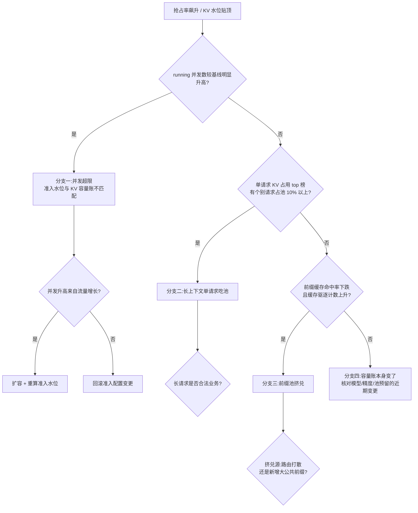

# Runbook 08:KV Cache 抖动与驱逐风暴

## 现象

- 抢占率(preemption rate)从常态的接近零飙升并持续高位;KV 池水位长期贴着上限运行(两个指标的定义见 [§22.2.3](../第五部分-推理系统/第22章-推理引擎原理.md#2223-优先级抢占与请求驱逐) 与 [§22.1](../第五部分-推理系统/第22章-推理引擎原理.md#221-kv-cache-与显存),采集点见 [§29.2.1](../第七部分-工程化与治理/第29章-可观测性与评测流水线.md#2921-llm-专属指标体系定义采集点与误用))。
- TPOT 出现锯齿状毛刺:被抢占的请求重算 Prefill 时,其会话卡顿数秒后继续——用户看到"生成到一半停顿"。
- 前缀缓存命中率明显下跌(prefix cache 命中率模型见 [§24.4.3](../第五部分-推理系统/第24章-服务化架构与显存类加速.md#2443-prefix-cache命中率模型与三级缓存)),同等流量下 Prefill 算力占用上升。
- 严重时演变为驱逐风暴:抢占→重算→KV 再膨胀→再抢占的正反馈,吞吐断崖下跌而 GPU 利用率反而升高(算力都花在重算上)。

## 影响范围

- **单实例抖动**:该实例上的会话卡顿,常由路由把长上下文请求集中打到一个实例引起。
- **同模型全实例抖动**:该模型的容量账(并发上限 vs KV 池容量)整体错了,或负载画像整体变化(上下文变长、并发变高)。
- **伴随跨实例 KV 池化/前缀池的场景**([§24.4.4](../第五部分-推理系统/第24章-服务化架构与显存类加速.md#2444-kv-cache-池化跨实例共享与一致性代价)):挤兑会跨实例传染,故障域扩大到共享池的全部成员。

判定方法:按实例对比抢占率与 KV 水位,集中还是均匀决定故障域。

## 立即止损

1. **下调引擎最大并发/准入水位**,让调度器提前拒绝接纳而不是入场后抢占([§22.2](../第五部分-推理系统/第22章-推理引擎原理.md#222-批处理与调度):拒绝准入是把失败前移)。副作用:排队时长与 TTFT 上升,压力显式回到队列与网关——这是可控的失败形态,替代的是所有在跑会话反复卡顿。
2. **临时下调单请求最大上下文长度**(max model len / max tokens)。副作用:长文档、长会话请求被拒或被截断,对应业务功能受损,必须同步通知。
3. **若启用了前缀感知路由且近期变更过路由策略,回滚路由变更**([§24.4.5](../第五部分-推理系统/第24章-服务化架构与显存类加速.md#2445-前缀感知路由路由策略与命中率的耦合讲透)):路由打散会同时打掉命中率与推高 KV 重复驻留。副作用:回滚期间命中率短暂进一步波动。
4. **禁止的动作**:不要用"重启实例"清池——重启丢掉全部在跑会话的 KV,所有会话同时重算,风暴瞬时加剧;也不要在风暴中扩大 KV 池预留比例并滚动重启,同理。

## 证据采集

止损前必抓(风暴平息后现场即消失):

- 引擎指标:KV 池水位、抢占次数与被抢占请求的处置方式(重算/换出)、running 并发数、waiting 长度、每步 token 预算利用率(采集点见 [§29.2.1](../第七部分-工程化与治理/第29章-可观测性与评测流水线.md#2921-llm-专属指标体系定义采集点与误用))。
- 前缀缓存:命中率时间序列、缓存条目数与总占用、驱逐计数([§24.4.3](../第五部分-推理系统/第24章-服务化架构与显存类加速.md#2443-prefix-cache命中率模型与三级缓存))。
- 请求画像:当前 running 中各请求的上下文长度分布,特别记录 top 10 单请求 KV 占用(按 [§22.1](../第五部分-推理系统/第22章-推理引擎原理.md#221-kv-cache-与显存) 的每 token KV 字节数折算)。
- 路由侧:各实例的请求分配与前缀亲和命中情况;近期路由/引擎配置变更记录。
- 引擎调度日志中的抢占与驱逐记录片段,先落盘防滚动覆盖。

## 诊断决策树

判定依据说明:三个主分支对应三种"池被吃掉"的方式——被更多请求吃(并发)、被单个请求吃(长上下文)、被缓存驻留吃(前缀池)。running 并发数与单请求占用榜是纯事实,先查;前缀池挤兑需要命中率与驱逐计数交叉印证,后查。KV 精度变更(如 KV 由 FP16 改 FP8 又改回)会整体改变容量账,归分支四([§22.1.2](../第五部分-推理系统/第22章-推理引擎原理.md#2212-kv-cache-精度的系统影响))。

## 修复

- **分支一(并发超限)**:按 [§22.1](../第五部分-推理系统/第22章-推理引擎原理.md#221-kv-cache-与显存) 的每 token KV 字节数公式重算"给定显存下的 token 容量与并发上限",把准入水位设在容量账之内并留缓冲;流量真实增长则扩容,并让网关限流与新容量联动(见 Runbook 07)。
- **分支二(长上下文单请求吃池)**:为长上下文负载建独立实例组或独立队列,与交互式流量物理隔离;评估对超长请求启用换出而非重算(判据是"当下更空闲的是 PCIe 还是算力",[§22.2.3](../第五部分-推理系统/第22章-推理引擎原理.md#2223-优先级抢占与请求驱逐));上下文长度上限写进接口契约。
- **分支三(前缀池挤兑)**:路由打散引起的,修复前缀感知路由的亲和策略([§24.4.5](../第五部分-推理系统/第24章-服务化架构与显存类加速.md#2445-前缀感知路由路由策略与命中率的耦合讲透));新增大公共前缀(如超长系统提示上线)引起的,为该前缀做常驻固定(pin)或评估三级缓存下沉([§24.4.3](../第五部分-推理系统/第24章-服务化架构与显存类加速.md#2443-prefix-cache命中率模型与三级缓存)),并把前缀缓存预算与在跑请求的 KV 预算分开设上限。
- **分支四(容量账变更)**:回滚引起容量账变化的配置(KV 精度、池预留比例、模型版本),按新账重核准入参数后再放开。

## 恢复验证

观察窗口至少 60 分钟(风暴有正反馈特性,短窗口易误判):

- 抢占率回到基线(常态应接近零),且 KV 池水位峰值低于上限并留有缓冲。
- TPOT P99 无锯齿毛刺;无"生成中途停顿数秒"的用户反馈。
- 前缀缓存命中率回到基线区间。
- 临时下调的并发与上下文上限恢复原值之后,以上指标仍然成立——带着临时限制看指标正常不算恢复。

## 复盘数据

- 检测延迟:抢占率越过告警线到告警触发、到人开始处置的两段时长。
- 中断时长:TPOT P99 越过 SLO 到恢复的总时长;期间被抢占的请求数与重算消耗的等效卡时。
- 损失量化:因限流/限长被拒的请求数;前缀命中率下跌造成的额外 Prefill 算力(按 [§24.4.3](../第五部分-推理系统/第24章-服务化架构与显存类加速.md#2443-prefix-cache命中率模型与三级缓存) 的命中率模型折算)。
- 容量账偏差:事发时实际并发/上下文画像与容量规划假设的差值——这是根因的量化表述。

## 长期防复发

- **监控**:抢占率、KV 池水位、前缀命中率、单请求 KV 占用 top 榜四项分别设告警;抢占率是领先指标,阈值应设在"非零即告警"级别([§22.2.3](../第五部分-推理系统/第22章-推理引擎原理.md#2223-优先级抢占与请求驱逐))。
- **门禁**:任何改变容量账的变更(KV 精度、池预留、最大并发、最大上下文)必须附带重算后的容量账才能合入;路由策略变更前用影子流量验证命中率不劣化。
- **隔离**:长上下文负载与交互式负载的实例组隔离作为默认架构,不作为事故后的补救([§26 特殊负载](../第五部分-推理系统/第26章-特殊负载.md)的负载分组思路)。
- **演练**:定期注入长上下文压测流量,验证准入拒绝先于抢占发生、风暴正反馈不出现,记录容量账预测值与实测值的偏差。
