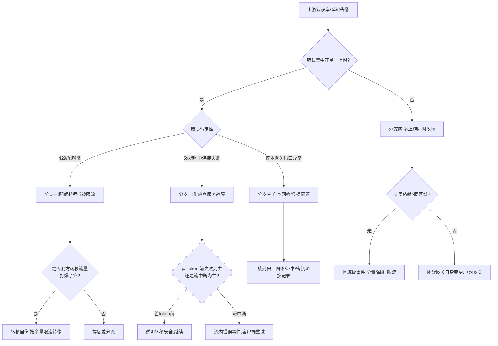

# Runbook 09:网关上游供应商故障

## 现象

- 网关对某一(或多个)上游的滑动窗口错误率越过熔断阈值,熔断器开启;或错误率未到阈值但首 token 延迟成倍恶化(健康观测机制见 [§27.4.4](../第六部分-上层平台/第27章-模型网关.md#2744-路由故障转移与降级))。
- 调用方看到三类表现之一:首 token 前直接失败(可转移)、流中途断开(不可透明转移)、响应极慢但未断。
- 网关侧转移计数、降级计数、429/5xx 计数上升;若备用上游配额不足,可能出现"转移后二次故障"(典型事故形态见 [§27.3](../第六部分-上层平台/第27章-模型网关.md#273-问题场景没有故障转移的四小时))。

## 影响范围

- **单上游故障、备用健康**:配置了故障转移的租户基本无感,未配置的租户该模型不可用——影响面按"路由到该上游的租户 × 是否有备用"二维判定。
- **多上游同时故障**(区域级事件、共同依赖):该能力档位整体不可用,只剩降级路径。
- **转移自伤**:备用上游被转移流量打爆或配额耗尽,故障面从"主上游的租户"扩大到"备上游的原有租户"——这是必须最先排除的扩散形态。

## 立即止损

1. **确认熔断已开启;未自动熔断则手动摘除故障上游**。副作用:该上游承载的全部流量涌向备用路径,做第 2 步之前先看备用容量,否则是把故障搬家。
2. **核对备用上游的配额与容量余量,按余量比例放行转移流量**,余量不足部分直接返回 503 而不是转移(配额余量必须是路由一等输入,[§27.4.4](../第六部分-上层平台/第27章-模型网关.md#2744-路由故障转移与降级))。副作用:一部分租户收到显式失败;但显式失败可被调用方重试策略处理,备上游被打爆则两边全灭。
3. **严守"首 token 前才转移"纪律**:已开始吐 token 的流,失败走流内错误事件交还客户端,不做跨供应商续写([§27.4.4](../第六部分-上层平台/第27章-模型网关.md#2744-路由故障转移与降级):吐出的 token 收不回,拼接文本前后不一致)。副作用:流中断的用户请求需客户端重发,体验受损但内容正确性有保障。
4. **对显式开启了降级的租户启用降级模型,响应中标注实际服务模型**;未开启的租户保持失败。副作用:降级租户的答案质量下降;绝不能为了"救可用性"给未开启的租户静默降级——质量下滑比明确的 503 更具破坏性,这个权衡只有业务方能做。
5. **收紧对故障上游的主动探活频率,防止半开状态反复全量放行**。副作用:恢复确认会慢一些。

## 证据采集

- 网关侧:故障上游的错误率滑动窗口、错误码分布(超时/429/5xx/连接失败)、首 token 延迟与 token 间隔两个超时维度的触发计数([§27.4.4](../第六部分-上层平台/第27章-模型网关.md#2744-路由故障转移与降级) 的双超时设计)、熔断状态变迁时间线。
- 转移路径:转移请求数、备上游的配额消耗速率与剩余额度、降级请求数与涉及租户清单。
- 计费与配额:预扣与实际 usage 回补的对账记录([§27.4.3](../第六部分-上层平台/第27章-模型网关.md#2743-token-级限流配额与计费可实现的设计)),故障期间的预扣未回补条目要单独标记,事后结算纠纷全靠它。
- 供应商侧:其状态页快照、返回的错误体样本(限流 vs 服务端错误的定性依据)、trace 中的请求粒度记录([§29.2.2](../第六部分-上层平台/第29章-可观测性与评测流水线.md#2922-trace-的粒度一次请求该记录到哪一层))。
- 留存故障时段完整的路由决策日志:每笔请求选了谁、为什么、转移了几跳。

## 诊断决策树

判定依据说明:第一刀切"单上游还是多上游"——多上游同时坏,先怀疑共同依赖或网关自身(最近发布、证书、DNS),再怀疑区域级事件。单上游故障用错误码定性:429 类要立刻回查是不是自己转移流量造成的自伤环路,这是唯一会指数扩散的分支,优先排除。

## 修复

- **分支一(配额/限流)**:自伤环路的,修正路由权重按备上游余量比例分配,并把"配额余量作为路由一等输入"落进路由配置;真实配额耗尽的,走供应商提额或把流量分摊到第三候选。
- **分支二(供应商故障)**:保持熔断与转移,等待其恢复;半开状态以小比例流量探测,连续通过再逐级放量([§27.4.4](../第六部分-上层平台/第27章-模型网关.md#2744-路由故障转移与降级));期间与供应商工单同步,拿到故障定性与恢复承诺时间。
- **分支三(自身问题)**:回滚网关侧近期变更(出口网络、证书/密钥轮换、协议适配层改动,[§27.4.2](../第六部分-上层平台/第27章-模型网关.md#2742-协议适配抹平差异的代价) 的适配层是常见静默出错点)。
- **分支四(多上游/区域级)**:按预案全量降级 + 全局限流保核心租户,恢复顺序按租户 SLO 等级;事件级别升级到平台故障。

## 恢复验证

- 故障上游半开探测的成功率连续达标后逐级放量至常态权重,全程无熔断回跳;观察窗口覆盖至少一个放量周期。
- 转移计数、降级计数回落到零或常态;所有降级响应的标注头消失。
- 备上游配额消耗速率回到常态,剩余额度可支撑到下一个配额周期。
- 预扣/回补对账闭合:故障期间的预扣条目全部完成回补或标记核销,无悬挂账。
- 抽样核对故障期间的流中断请求:客户端收到的是流内错误事件而非拼接文本。

## 复盘数据

- 检测延迟:上游开始出错到熔断开启的时长(自动)或到人工摘除的时长(手动)。
- 中断时长:各租户视角的不可用/降级时长,按 SLO 等级分租户统计。
- 损失量化:失败请求数、降级请求数及涉及租户;故障期间多花的备用上游成本;SLO 预算消耗([第 31 章](../第七部分-工程化与治理/第31章-容量、成本与SLO.md)口径)。
- 转移有效性:首 token 前失败中被成功透明转移的比例——这是故障转移设计价值的直接度量。
- 若发生转移自伤:从转移开始到二次故障的时长,与备用配额余量的比值关系,用于校正转移限流参数。

## 长期防复发

- **监控**:每个上游分别采集错误率滑动窗口、首 token 延迟、token 间隔三条曲线并设独立告警;备上游配额余量设水位告警,低于"承接主上游全量流量 N 小时"即报([§27.4.3](../第六部分-上层平台/第27章-模型网关.md#2743-token-级限流配额与计费可实现的设计))。
- **门禁**:路由配置变更必须通过"主上游全故障"的仿真校验——校验器检查备用路径容量与配额能否承接,承接不了则变更拒绝合入。
- **契约**:降级开关、降级标注头、流内错误事件格式写进对租户的接口契约;新租户接入时强制选择降级策略,不允许默认值含糊。
- **演练**:定期做上游故障注入演练(摘除主上游),验证熔断、按余量转移、显式降级、账务回补四个环节的时序与正确性,记录全程指标作为基线([§27.7](../第六部分-上层平台/第27章-模型网关.md#277-选型决策树) 的路由能力自查可作为演练清单)。
