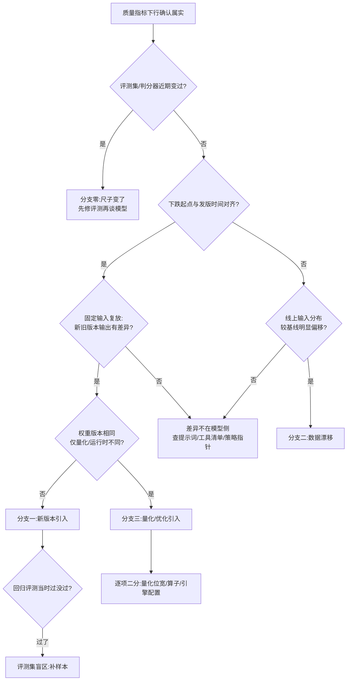

# Runbook 10:模型质量回归

## 现象

- 线上质量监控指标下行:采样评测得分下跌、用户负反馈率/重试率/人工接管率上升、拒答或格式错误占比升高(线上质量监控与回归评测的关系见 [§29.2.6](../第六部分-上层平台/第29章-可观测性与评测流水线.md#2926-评测流水线回归ab-与线上质量监控))。
- 系统盘全绿:延迟、错误率、吞吐一切正常——质量回归是慢变量,不会触发任何基础设施告警(典型事故形态见 [§29.1](../第六部分-上层平台/第29章-可观测性与评测流水线.md#291-问题场景全绿的监控盘和掉了-4-个点的模型) 与 [§30.4.3](../第七部分-工程化与治理/第30章-模型生命周期管理.md#3043-灰度回滚与影子流量效果问题不会立即报警))。
- 发现途径常是业务方投诉或抽检,而非告警——把"发现时刻"与"开始时刻"分开记,后者要靠证据回溯。

## 影响范围

- **单模型版本、灰度流量**:只影响灰度组租户,立即可用对照组数据定位。
- **单模型版本、全量**:该模型所有调用方;若下游有 Agent/工作流依赖其输出格式,影响沿调用链放大。
- **多模型同时劣化**:大概率不是模型本身——怀疑共享的运行时/量化配置变更,或评测采样与判分器自身变更(先排除"尺子变了")。
- **数据回流在开启的场景**:坏输出可能已进入回流批次,影响面延伸到下一个训练版本(见"修复"中的轨迹冻结)。

## 立即止损

1. **停止该版本的灰度放量**(若在灰度中),冻结发布流水线。副作用:新版本的其他改进同样被冻结,发布计划顺延。
2. **回滚版本指针到上一良好版本**:按 [§30.4.3](../第七部分-工程化与治理/第30章-模型生命周期管理.md#3043-灰度回滚与影子流量效果问题不会立即报警) 的要求,回滚是注册表上的一次版本指针切换并留痕,权重应已常驻就位,目标分钟级;禁止运维手工换文件。副作用:回到旧版本意味着新版本修掉的问题会回来,回滚前快速核对新版本的发布说明确认没有"不可回退"的依赖(如接口格式变更已被下游消费)。
3. **若怀疑是量化/运行时优化引入而非权重本身,优先回滚该项优化配置而不是整个版本**。副作用:性能/成本回到优化前水位,容量余量需要重新确认。
4. **暂停该版本输出进入数据回流/训练缓冲区**。副作用:飞轮数据断供一段时间,比污染下一版便宜得多。
5. **禁止的动作**:不要在未定位根因时"再发一版试试"——连续换版本会摧毁对照基线,让归因窗口彻底混乱。

## 证据采集

- 版本事实:注册表中当前在线版本的完整血缘(五元组:权重、基座、数据集、代码、超参,[§30.4.2](../第七部分-工程化与治理/第30章-模型生命周期管理.md#3042-注册版本与血缘追到数据集与代码版本才算闭合)),连同运行时依赖(推理镜像、量化配置)与 Agent 场景的四版本指针(模型/Agent 配置/工具清单/策略)。
- 时间线:质量指标下跌的起点,与模型发版、量化/引擎配置变更、上游数据源变化三条时间线对齐——这一步直接决定分诊方向。
- 对照样本:同一批固定输入在新旧两个版本上的输出对(灰度期有对照组则直接取;已全量则用影子流量或离线复放取)。
- 评测侧:评测集版本与判分器版本是否变过([§30.4.5](../第七部分-工程化与治理/第30章-模型生命周期管理.md#3045-准入卡点与飞轮接口闭环的两个衔接处):评测集要进血缘,否则分差可能只是评测集变了);线上采样评测的样本留存。
- 输入分布:近期线上输入的长度、语种、任务类型分布与训练/评测假设的偏移量。
- 回流侧:该版本服务期间生成的轨迹/回流批次清单及其 policy version 标记。

## 诊断决策树

判定依据说明:分支零最先排除,成本最低且最容易冤枉模型。核心判据是**固定输入复放**——它把"模型变了"和"世界变了"分开:同样的输入输出变了,是版本侧(分支一/三);输入本身变了而老版本也答不好,是漂移(分支二)。分支一和三的区分靠血缘:权重相同而运行时/量化不同,劣化来自优化项(同一份权重换一套算子实现,数值行为不保证逐位一致,见[模型供应链一节](../第七部分-工程化与治理/第30章-模型生命周期管理.md#模型供应链从五元组到可签名制品)对运行时依赖入包的要求)。

## 修复

- **分支零(评测变更)**:回滚或修正评测集/判分器,重跑基线,确认模型指标恢复后关闭事件;把评测集版本补进血缘。
- **分支一(新版本引入)**:维持回滚状态;把劣化样本补入回归评测集(准入卡点的硬门槛,[§30.4.5](../第七部分-工程化与治理/第30章-模型生命周期管理.md#3045-准入卡点与飞轮接口闭环的两个衔接处)),新版本修复后重新走"候选 → 已评测 → 可发布"状态机,不允许豁免直接上线。**同时执行轨迹冻结**:沿血缘反查该版本服务期间生成的全部轨迹/回流批次并冻结,防止坏行为经存量数据训回下一版([§30.4.2](../第七部分-工程化与治理/第30章-模型生命周期管理.md#3042-注册版本与血缘追到数据集与代码版本才算闭合) 的轨迹自引链);若定性为坏版本,按供应链撤销三动作(标记撤销 → 准入拒绝 → 通知在跑实例)整体下架。
- **分支二(数据漂移)**:回滚救不了漂移——确认后可回到新版本;短期用提示词/路由策略适配新分布,中期把漂移样本纳入评测集与训练数据计划,并为该输入维度建漂移监控。
- **分支三(量化/优化引入)**:保持优化回滚;逐项二分定位具体优化(量化位宽、算子实现、引擎配置),向优化流水线补充"该项优化必须通过与原精度版本的输出一致性评测"的门禁;运行时依赖版本纳入供应链包。

## 恢复验证

- 线上采样评测得分回到基线区间,连续两个评测周期(而非单点)达标([§29.2.6](../第六部分-上层平台/第29章-可观测性与评测流水线.md#2926-评测流水线回归ab-与线上质量监控))。
- 用户负反馈率、重试率、人工接管率回落到基线。
- 事发时的劣化样本集在当前线上版本复放,通过率达标——"指标回来了"必须能落到具体样本上验证。
- 注册表状态一致:在线版本指针、状态机状态与实际服务版本三者对得上,回滚留痕完整。
- 若执行了轨迹冻结:冻结批次清单与该版本服务时段完全覆盖,无遗漏批次仍在回流管道中。

## 复盘数据

- 检测延迟:质量开始下跌到被发现的时长(慢变量事故的核心指标),以及发现途径(告警/抽检/投诉)。
- 事故面积:劣化版本服务的总请求数、涉及租户数、服务时长;若灰度中发现,记灰度比例——它就是这次分层放量为你省下的损失。
- 回滚耗时:决定回滚到指针切换完成、到全量流量回到旧版本的两段时长(与 [§30.4.3](../第七部分-工程化与治理/第30章-模型生命周期管理.md#3043-灰度回滚与影子流量效果问题不会立即报警) 的分钟级目标对比)。
- 归因耗时:从发现到确定根因分支的时长。
- 污染面:被冻结的轨迹/回流批次数量与数据量;若已有批次进入训练,记受影响的下游版本清单。

## 长期防复发

- **监控**:线上采样评测作为常驻质量监控,与系统指标同级告警([§29.2.6](../第六部分-上层平台/第29章-可观测性与评测流水线.md#2926-评测流水线回归ab-与线上质量监控));输入分布漂移单独设监控维度。
- **门禁**:回归评测硬门槛绑定注册表状态机,评测未过不得"可发布"([§30.4.5](../第七部分-工程化与治理/第30章-模型生命周期管理.md#3045-准入卡点与飞轮接口闭环的两个衔接处));量化/运行时优化必须通过输出一致性评测才可上线;评测集版本进血缘。
- **发布纪律**:灰度 + 影子流量作为默认发布路径;上一良好版本权重常驻就位,回滚演练按季度执行并计时([§30.4.3](../第七部分-工程化与治理/第30章-模型生命周期管理.md#3043-灰度回滚与影子流量效果问题不会立即报警)、[§30.4.4](../第七部分-工程化与治理/第30章-模型生命周期管理.md#3044-制品管理与权重分发被低估的一环))。
- **飞轮防护**:回流批次逐段携带生成它的 policy version,冻结操作有可执行的工具链而非临时脚本——事故时的"沿血缘反查"必须是一条命令,不是一次考古。
