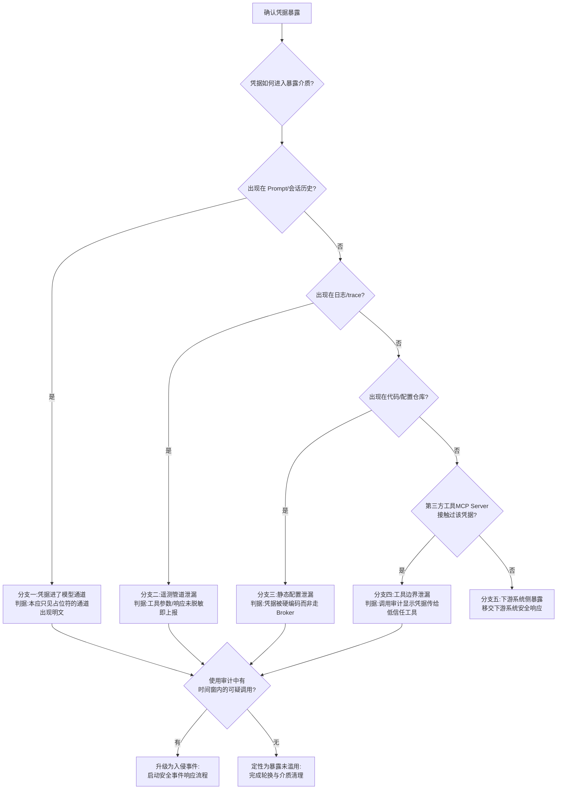

# Runbook 11:Agent 凭据泄漏事件响应

> 本 Runbook 只写防御与响应:如何发现、止损、追溯与防复发。不讨论任何获取凭据的方法。

## 现象

发现途径通常是以下之一(任一途径触发即按泄漏处置,宁可误判不可漏判):

- **扫描发现**:日志/trace/会话存储的密钥特征扫描命中——凭据出现在 Prompt、模型输出、工具调用参数、trace 属性或会话历史中(凭据进 Prompt 等于广播,见[第 28 章 Agent Runtime 2.0 一节](../第六部分-上层平台/第28章-Agent运行时基础设施.md#agent-runtime-20协议权限与持久执行))。
- **用量异常**:某凭据对应的下游服务出现非常规调用——非常规时段、非常规来源地址、非常规操作类型或调用量突增。
- **外部通报**:凭据托管方/代码仓库平台的泄漏检测通知,或第三方安全通报。
- **审计回放发现**:Durable State 事件日志或工具调用审计中出现凭据明文([§28.4.4](../第六部分-上层平台/第28章-Agent运行时基础设施.md#2844-会话状态与上下文存储) 的冷层审计归档)。

## 影响范围

按三个维度圈定,初判从最坏假设开始、用证据收窄:

- **凭据权限面**:该凭据能访问哪些系统、什么权限级别(读/写/管理)、是否可横向换取其他凭据(如能签发子凭据的管理凭据,影响面按其可签发范围放大)。
- **暴露面**:凭据出现在哪些介质——单次 Prompt、持久会话状态、日志管道、trace 系统、对象存储归档;每多一个介质,可接触人群与留存时长都不同。
- **时间窗**:从凭据首次进入暴露介质到吊销完成的时长;窗内该凭据的全部使用都要按可疑处理。

Agent 场景的特殊性:凭据一旦进入 Prompt 或会话历史,会被日志、trace、上下文回放复制到多处([第 28 章](../第六部分-上层平台/第28章-Agent运行时基础设施.md#agent-runtime-20协议权限与持久执行) 对此有明确论断),影响范围默认按"所有下游存储介质均已暴露"处理,直到逐一排除。

## 立即止损

1. **立即吊销泄漏凭据**(撤销 token / 禁用密钥),不等影响面调查完成。副作用:所有正在使用该凭据的合法任务立即失败——包括在跑的 Agent 长任务;接受这个代价,凭据有效期的每一分钟都在扩大风险窗。
2. **签发新凭据并通过 Credential Broker 下发**,恢复合法业务;新凭据按最小权限重新审定,不许照抄旧权限面。副作用:依赖方需要重连/重试;若旧凭据是宽权限的"万能钥匙",收窄后部分边缘功能会报权限不足,逐个显式加回。
3. **若泄漏介质是会话状态/轨迹存储,冻结相关会话的读取与回放**,防止暴露继续扩散。副作用:涉及会话的用户无法恢复历史任务,需另行通知。
4. **若怀疑凭据已被用于对下游系统的操作,通知下游系统 owner 并对高危对象(可写资源)临时收紧**。副作用:下游业务受限;按凭据权限面清单逐项通知,不广播恐慌。
5. **禁止的动作**:不要"先查清楚再吊销"——吊销是可逆成本(重发即可),泄漏窗是不可逆风险;也不要只轮换泄漏的这一个凭据而不检查同批次、同注入路径的其他凭据。

## 证据采集

止损(吊销)不等采集,但吊销后立即固定以下现场:

- **暴露介质快照**:凭据出现的日志条目、trace span、会话记录、Prompt 内容的原始副本(加密存证后再从线上介质中清除明文)。
- **使用审计**:该凭据在暴露时间窗内的全部调用记录——调用方身份、来源、时间、操作与参数;身份透传链路完整时,能把每次调用回溯到发起的用户与 Agent 会话(委托链与审批绑定机制见[第 28 章 Agent Runtime 2.0 一节](../第六部分-上层平台/第28章-Agent运行时基础设施.md#agent-runtime-20协议权限与持久执行))。
- **执行回放**:相关 Agent 任务的 Durable State 步级 checkpoint 与事件日志,回放"哪一步、哪个工具调用让凭据进入了不该在的通道"。
- **配置事实**:事发时的工具清单版本、授权策略版本、Agent 配置版本(四版本指针,见 [§30.4.2](../第七部分-工程化与治理/第30章-模型生命周期管理.md#3042-注册版本与血缘追到数据集与代码版本才算闭合) 的 Agent 血缘扩展)——泄漏往往由某次工具或策略变更引入。
- 所有证据带时间戳、只增不改,保留链路完整性以备后续定性。

## 诊断决策树

泄漏路径分诊(决定修复方向与影响面边界):

判定依据说明:前四个分支回答"从哪泄的",最后的 H 节点回答"泄了之后有没有被用"——两个问题独立回答,不要因为"没发现滥用"就降低泄漏路径修复的优先级。分支一是 Agent 场景最典型也最严重的路径:它说明 Credential Broker 的占位符机制缺失或被绕过。

## 修复

- **分支一(进入模型通道)**:改造为 Broker 占位符模式——模型全程只见占位符,Credential Broker 仅在工具调用发出的边界注入真实凭据,用后即弃([第 28 章](../第六部分-上层平台/第28章-Agent运行时基础设施.md#agent-runtime-20协议权限与持久执行) 的组件边界);对已污染的会话历史与归档做明文清除或整体销毁。
- **分支二(遥测管道)**:在遥测上报点前加统一脱敏层(工具参数与响应按敏感字段清单过滤),并对日志/trace 存储做存量扫描清理;trace 粒度设计参照 [§29.2.2](../第六部分-上层平台/第29章-可观测性与评测流水线.md#2922-trace-的粒度一次请求该记录到哪一层),记录调用事实而非原文密钥。
- **分支三(静态配置)**:凭据从代码/配置中移除,统一收归 Broker 托管;仓库历史中的明文按平台流程清除并确认缓存副本失效。
- **分支四(工具边界)**:下调涉事 MCP Server/工具在 Tool Registry 中的信任等级,收紧其可触发的后续动作;审查 Policy Decision 规则为何允许凭据级参数流向低信任工具([第 28 章](../第六部分-上层平台/第28章-Agent运行时基础设施.md#agent-runtime-20协议权限与持久执行) 的信任等级与授权判定)。
- **分支五 / H 判定为已滥用**:移交并升级为入侵事件响应,本 Runbook 的凭据轮换动作作为其中一个子项继续闭环;下游被操作过的资源逐项核查回滚。

## 恢复验证

- 旧凭据在所有下游系统确认失效:用审计确认吊销时刻之后无任何成功调用(有失败调用是正常的——那是吊销在起作用)。
- 新凭据经 Broker 下发,全链路(Prompt、会话状态、日志、trace)扫描无新凭据明文出现,连续观察一个完整业务周期。
- 暴露介质清理完成:原介质中明文已清除,加密存证副本完整。
- 合法业务恢复:此前依赖该凭据的 Agent 任务与服务恢复正常成功率,权限收窄导致的报错清零或均已显式处理。
- 同注入路径的其他凭据完成排查:同一批硬编码、同一条未脱敏管道涉及的所有凭据都已轮换,不只轮换被发现的那一个。

## 复盘数据

- 暴露窗时长:凭据首次进入暴露介质到吊销完成的时长(本事件最核心的量化项)。
- 检测延迟:暴露发生到被发现的时长,及发现途径(扫描/用量异常/外部通报)——外部通报占比高说明自有检测失效。
- 影响面清单:暴露介质数、可接触该介质的人员/系统数、时间窗内该凭据的调用次数与滥用调用次数(如有)。
- 处置耗时:发现到吊销、吊销到业务恢复的两段时长;因吊销中断的合法任务数。
- 根因定位:泄漏路径分支、引入该路径的变更(哪次工具/策略/代码变更)及其上线时间——暴露窗起点往往就是这次变更。

## 长期防复发

- **架构性防复发(核心)**:落实 Credential Broker 三原则——凭据绝不进 Prompt、绝不进长期会话状态、只在调用发出边界注入且用后即弃;权限委托链只衰减不放大,由 Policy Decision 强制而非依赖模型自觉([第 28 章 Agent Runtime 2.0 一节](../第六部分-上层平台/第28章-Agent运行时基础设施.md#agent-runtime-20协议权限与持久执行))。
- **监控**:密钥特征扫描覆盖 Prompt、会话存储、日志、trace 四类介质并常驻运行;每个凭据的用量基线与异常告警(时段/来源/操作类型三维)。
- **门禁**:CI 与配置合入的密钥扫描门禁;工具清单与授权策略变更走发布流程并留痕(它们的变更频率远高于模型发版却常常不走流程,见 [§30.4.2](../第七部分-工程化与治理/第30章-模型生命周期管理.md#3042-注册版本与血缘追到数据集与代码版本才算闭合) 的 Agent 四版本指针)。
- **凭据生命周期**:全面短时效化——凭据自动过期与轮换,消灭"泄漏后长期有效"的前提;高危操作审批绑定请求参数哈希,消除审批与执行间的替换窗口。
- **演练**:每半年做一次凭据吊销演练:随机选一个生产凭据走完"吊销 → 轮换 → 业务恢复"全流程并计时,验证吊销不是一个从未执行过的按钮。
