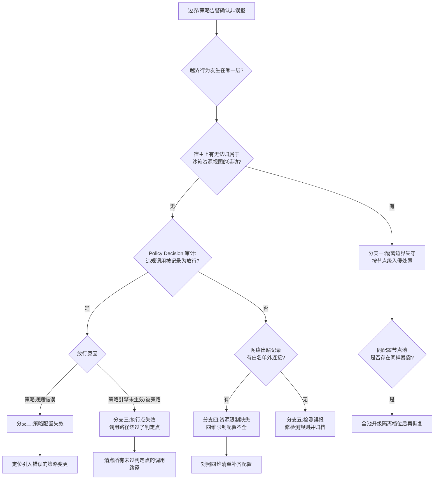

# Runbook 12:沙箱逃逸或策略失效事件响应

> 本 Runbook 只写响应:隔离、取证、降级与撤销。不描述任何逃逸或绕过手法。威胁模型的出发点见[第 28 章](../第六部分-上层平台/第28章-Agent运行时基础设施.md#2842-沙箱隔离级别的三档与延迟预算):模型生成的代码等同于不可信第三方代码。

## 现象

以下任一信号出现即启动本流程,按最坏假设处置直到证据排除:

- **隔离边界告警**:主机入侵检测/内核审计报告沙箱工作负载出现越界行为特征——访问了不属于其资源视图的文件、进程或网络端点。
- **策略失效告警**:Policy Decision 审计显示本应拒绝的工具调用被放行,或沙箱网络策略(默认拒绝出站 + 白名单)出现白名单外的出站连接记录([§28.4.2](../第六部分-上层平台/第28章-Agent运行时基础设施.md#2842-沙箱隔离级别的三档与延迟预算) 的四维资源限制)。
- **宿主异常**:沙箱宿主节点上出现无法归属到任何已知沙箱实例的进程、文件或网络活动。
- **旁证**:Runbook 11 的凭据滥用调查、或下游系统异常访问,反查指向某个沙箱实例。

"逃逸"与"策略失效"在响应初期不必区分——两者的第一响应动作相同,区分放在诊断阶段。

## 影响范围

- **单沙箱实例**:最小假设,仅该实例的任务与其可见数据。
- **宿主节点**:一旦怀疑隔离边界被越过,故障域立即按整个宿主节点计——该节点上所有沙箱实例、节点凭据与节点可达的网络平面都在影响面内;共享内核档位(容器级隔离)的场景尤其如此([§28.4.2](../第六部分-上层平台/第28章-Agent运行时基础设施.md#2842-沙箱隔离级别的三档与延迟预算) 的三档隔离:档位越低,单实例事件越应升格为节点事件)。
- **策略失效**:影响面不按节点算,按"该策略版本生效期间的全部工具调用"算——用策略版本的生效时间窗圈定,可能横跨全部运行时实例。
- **数据面**:受影响沙箱在事件窗内可见的数据(挂载卷、会话状态、可达的内部服务)全部列入暴露评估清单。

## 立即止损

1. **隔离受影响节点**:cordon 该宿主节点停止新调度,切断其东西向网络(保留带外管理通道),但**不要立即关机或销毁**——内存与运行现场是关键证据。副作用:该节点上的其他合法沙箱任务中断,用户任务失败;接受,不确定边界是否失守时,节点上没有"其他合法任务"这个概念。
2. **暂停向同型号隔离配置的节点池调度新的沙箱任务**(若怀疑是隔离配置本身的问题)。副作用:Agent 平台容量骤降,任务排队;按事件级别决定暂停范围是单节点池还是全平台。
3. **吊销该节点与受影响沙箱实例持有的全部凭据**(节点身份凭据、实例上注入过的业务凭据),按 [Runbook 11](rb-11-agent-credential-leak.md) 的吊销流程执行。副作用:同 Runbook 11——在跑任务失败、依赖方需重连。
4. **若为策略失效:立即回滚到上一已知良好的策略版本,并临时收紧为最小放行集**。副作用:部分合法工具调用被拒,Agent 任务成功率下降;显式失败优于继续放行。
5. **下调涉事工具/MCP Server 在 Tool Registry 中的信任等级,必要时直接禁用**(信任等级机制见[第 28 章 Agent Runtime 2.0 一节](../第六部分-上层平台/第28章-Agent运行时基础设施.md#2844-agent-runtime-20协议权限与持久执行))。副作用:依赖该工具的 Agent 功能不可用。
6. **禁止的动作**:不要在取证完成前销毁沙箱实例或重装节点——"恢复干净环境"的冲动会销毁定性所需的全部证据;也不要只隔离沙箱实例而保留节点在调度池里。

## 证据采集

原则:先保全、后分析;所有证据只增不改、带时间戳与采集人。

- **节点现场**:内存快照、运行进程清单、网络连接表、近期内核审计日志——在断网隔离之后、关机之前采集。
- **沙箱实例现场**:实例文件系统快照、该实例的资源使用曲线(CPU/内存/网络四维,[§28.4.2](../第六部分-上层平台/第28章-Agent运行时基础设施.md#2842-沙箱隔离级别的三档与延迟预算))、实例生命周期事件。
- **执行链路**:该 Agent 任务的完整 Durable State 事件日志与步级 checkpoint——哪一轮推理产出了什么代码、触发了哪些工具调用、Policy Decision 逐次的判定结果([第 28 章](../第六部分-上层平台/第28章-Agent运行时基础设施.md#2844-agent-runtime-20协议权限与持久执行) 的审计回放能力)。
- **策略事实**:事发时生效的策略版本、工具清单版本及其变更历史;策略失效场景下,该版本生效窗内的全部放行记录导出留存。
- **入口上下文**:该任务的输入来源(用户请求、检索内容、工具输出)——用于事后判断是否存在注入诱导(威胁面结构见[第 28 章](../第六部分-上层平台/第28章-Agent运行时基础设施.md#2844-agent-runtime-20协议权限与持久执行)"数据被当成指令"一段);采集原文即可,不做手法复现。

## 诊断决策树

判定依据说明:第一刀切在"宿主层有无越界证据"——有,则无论起因如何都按最严重的分支一处置;无,则问题在运行时控制面,继续区分是"规则错了"(分支二)、"规则对但没被执行"(分支三)还是"该配的限制没配"(分支四)。分支三比分支二更危险:它意味着存在不经过 Policy Decision 的调用路径,失效面不限于这一条规则。

## 修复

- **分支一(隔离边界失守)**:节点按入侵处置——取证完成后重装,节点凭据全部轮换;同配置节点池整体评估,将涉事负载类型的隔离档位上调(共享内核升独立内核,[§28.4.2](../第六部分-上层平台/第28章-Agent运行时基础设施.md#2842-沙箱隔离级别的三档与延迟预算) 的档位判断:不可信代码的档位不容协商);修复前该类负载不回到原档位节点。定性与厂商组件相关时同步安全通报流程。
- **分支二(策略配置失效)**:修正规则并回查引入变更;策略变更纳入发布流程与回归测试(用历史放行/拒绝记录做策略回归集),杜绝"改策略不走流程"([§30.4.2](../第七部分-工程化与治理/第30章-模型生命周期管理.md#3042-注册版本与血缘追到数据集与代码版本才算闭合) 的四版本指针要求策略版本独立留痕、独立可回滚)。
- **分支三(执行点失效)**:清点全部工具调用路径,确认每条路径都强制经过 Policy Decision 判定点,消灭旁路;把"判定点覆盖率"做成可审计指标。
- **分支四(资源限制缺失)**:按四维清单(CPU 配额、内存硬上限、墙钟超时、网络默认拒绝出站+白名单)逐项补齐并做成模板强制项,新沙箱配置不满足四维齐全不允许创建([§28.4.2](../第六部分-上层平台/第28章-Agent运行时基础设施.md#2842-沙箱隔离级别的三档与延迟预算))。
- **制品撤销联动(各分支通用)**:若定性涉及某个可疑工具、镜像或工具清单版本,按[第 30 章供应链撤销](../第七部分-工程化与治理/第30章-模型生命周期管理.md#3046-模型供应链从五元组到可签名制品)三动作执行——注册表标记撤销、准入拒绝一切新部署、通知在跑实例 owner 切走;工具清单作为可签名制品,其信任等级评定同步更新。事件窗内受影响 Agent 生成的轨迹/回流批次,按同节撤销流程的"冻结下游"沿血缘冻结。

## 恢复验证

- 受影响节点完成重装与凭据轮换后,以金丝雀方式承接少量低敏任务,边界监控连续观察无告警后逐步放量。
- 策略回归测试全量通过:历史放行/拒绝样本在修复后的策略与执行点上判定结果全部符合预期;判定点覆盖率 100%(所有调用路径均经过 Policy Decision)。
- 四维资源限制在全部沙箱模板上齐全,抽样实例实测验证(超时会被杀、白名单外出站被拒)——以实测为准,不以配置存在为准。
- 被撤销制品在平台内无在跑实例,准入检查可复现"拒绝该版本新部署"。
- 事件定性报告完成并经安全团队评审关闭——沙箱类事件不允许"指标正常即关闭",必须有定性结论。

## 复盘数据

- 检测延迟:越界/违规行为首次发生到告警触发的时长;告警到节点完成隔离的时长。
- 暴露窗:隔离配置缺陷或失效策略版本的上线时间到修复时间——整个时间窗内的调用都曾暴露,不只是被发现的那一次。
- 影响面清单:受影响节点数、沙箱实例数、中断的合法任务数、被轮换的凭据数、事件窗内可见数据资产清单。
- 处置成本:隔离导致的容量损失(卡时/实例时)、任务失败重跑成本。
- 失效层定位:根因分支、引入缺陷的变更及其评审记录——回答"这个缺陷当初是怎么通过评审的"。
- 撤销联动:被撤销的制品/工具清单版本数、被冻结的轨迹批次数。

## 长期防复发

- **隔离档位纪律**:运行模型生成代码的沙箱一律采用独立内核档位,共享内核档位仅用于可信代码;档位选择写进平台准入规则而非留给业务自选([§28.4.2](../第六部分-上层平台/第28章-Agent运行时基础设施.md#2842-沙箱隔离级别的三档与延迟预算))。
- **监控**:宿主层入侵检测与沙箱资源视图越界告警常驻;白名单外出站连接零容忍告警;Policy Decision 的判定结果全量审计并对"放行率突变"设告警。
- **门禁**:沙箱模板四维限制齐全性校验进创建路径;策略与工具清单变更走发布流程、留痕、可独立回滚;工具/镜像制品签名与准入验证(签名与准入机制见[第 30 章供应链一节](../第七部分-工程化与治理/第30章-模型生命周期管理.md#3046-模型供应链从五元组到可签名制品))。
- **演练**:每半年做一次响应演练——注入良性的越界模拟信号(仅触发检测,不涉及真实绕过),验证"隔离节点 → 取证保全 → 凭据吊销 → 信任降级 → 制品撤销"全链路的时序与工具可用性,全程计时并与本 Runbook 的目标对照。
