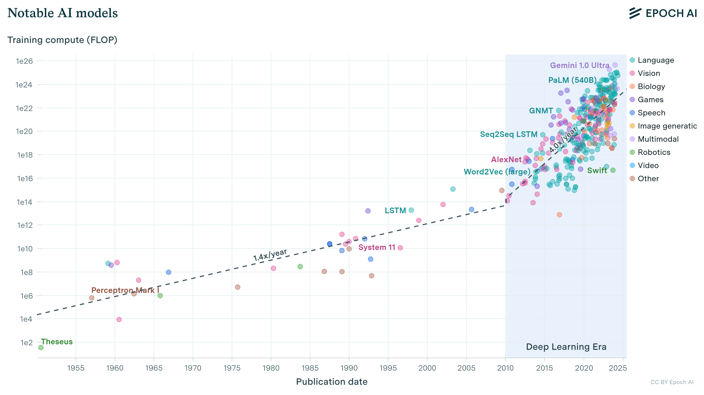
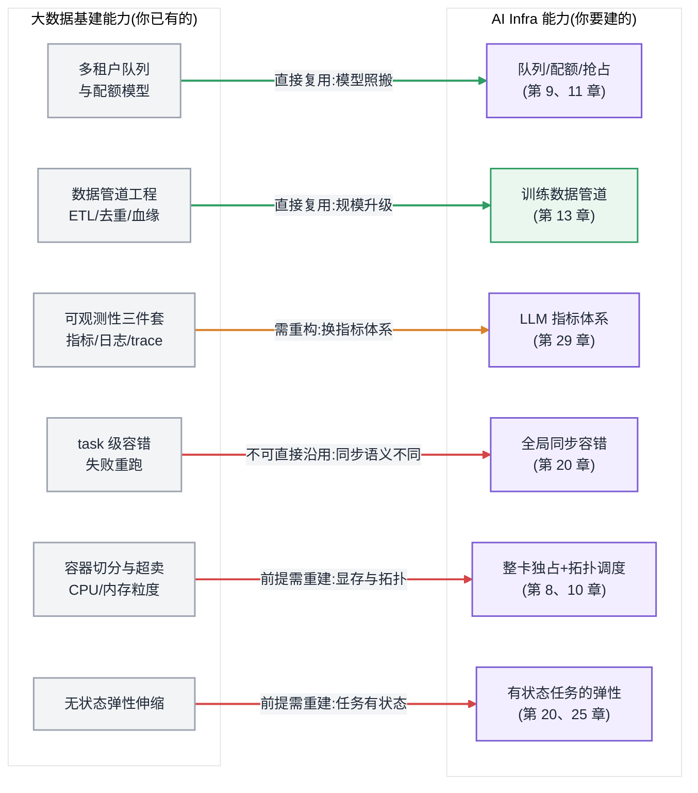
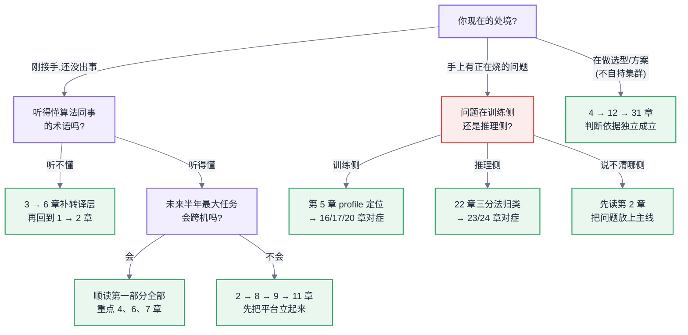

# 第 1 章 从大数据基础设施到 AI 基础设施

<ChapterContext
  track="主线 A / B 的共同地基"
  question="哪些大数据平台经验可以迁移，哪些前提会在同步训练和在线推理中失效？"
  upstream="大数据调度、存储、计算与可观测性经验"
  downstream="第 2 章两条主线；第 4–7 章资源边界"
  inputs="现有平台资产、最大单任务卡数、数据出域约束"
  outputs="能力迁移清单与阅读路径"
/>

## 1.1 先确定这次迁移在全书中的位置

本章位于两条主线之外、之上:它不属于"一次训练任务的生命周期"(主线 A)或"一次推理请求的全链路"(主线 B)的任何一段,而是为这两条主线画出地基——告诉你从大数据世界带来的哪些直觉在新地基上仍然成立,哪些会让你在第一个月就付出真金白银的代价。

## 1.2 带着哪些旧经验进入本章

本章是全书开篇,不依赖书内任何章节的结论;它依赖的是你已有的经验——我们假定你运维过或至少深度使用过 YARN/K8s 一类的资源调度系统、HDFS/对象存储一类的分布式存储、Spark/Flink 一类的计算引擎(见前言 [§0.2](../ai-infra-book-outline.md#02-前置知识声明写进前言) 前置知识声明)。本章的全部工作,就是对这份经验做一次资产盘点:标出可复用项、需重构项与坏账。

## 1.3 从一条失败链路开始，而不是从岗位故事开始

<CaseMeta
  type="synthetic-case"
  data-nature="为展示排查顺序构造的整数与时间点，不代表生产监控或单一客户事故"
  scope="64 卡同步训练任务"
  assumptions="任务跨越两个互联域；通信与计算未重叠；恢复依赖最近一次 checkpoint"
  reproducible="visuals/data/ch01-incident-timeline.csv"
/>

调度器先完成了 64 张卡的绑定，资源面板因此显示“分配成功”。两分钟后，通信库初始化出的进程组跨越两个互联域；到第一个 step 结束，trace 中 AllReduce 等待已占 step 时间的 61%。随后一条跨域链路出现长尾，所有 rank 同步等待，任务最终中止。恢复时才发现最近一次 checkpoint 已是四小时前。

这条链路暴露的不是一个孤立故障，而是三种旧前提同时失效：空闲卡数不能证明拓扑可用，单个 rank 失败不能局部重跑，无状态服务的水平扩缩也不能直接套给固定进程组。排查必须把调度快照、通信 trace、step 时间和 checkpoint 窗口放在同一条时间线上。

<BookFigure
  id="ch01-incident-evidence-timeline"
  src="../visuals/generated/ch01/incident-evidence-timeline.svg"
  alt="一次合成训练事故从卡数分配、跨域通信初始化、AllReduce 等待上升、step 长尾到任务中止依次暴露证据"
  title="图 1-1  同步训练事故的证据时间线"
  caption="数量、拓扑、同步等待和恢复窗口必须串成证据链，单看 GPU 利用率无法定位故障。"
  source="本书合成案例；visuals/data/ch01-incident-timeline.csv"
  license="CC BY 4.0"
  width="wide"
/>

## 1.4 原理与量化模型:AI Infra 的三个新约束

时间线中的三处断点,对应三个在大数据平台中通常不是一阶矛盾、到了 AI 负载里却必须优先建模的物理与结构约束。它们不是简单的工程风格差异,而是可以写成算式的硬约束。本节先给出定性结构与量级判断,精确公式在后续章节展开(显存换算见第 6 章,通信估算见第 7 章,失败率模型见第 20 章)。

这里的"新"不是说这些约束过去不存在,而是它们在更大模型、更长上下文和更严格在线 SLO 下进入了架构决策的第一层。Epoch AI 对前沿模型的统计显示,2010 年至 2024 年 5 月期间训练算力约以每年 4–5 倍增长;这是对历史样本的拟合,置信区间较宽,不能直接外推为未来每年固定增长率。它仍说明一个重要事实:当单设备容量、带宽或可交付数量跟不上工作负载时,系统必须通过切分、并行或更长执行时间补齐差额。三种补法分别把显存、通信和长任务可靠性推到前台。这个判断也适用于微调、后训练、批量推理和在线推理,只是每类负载压中的约束不同。

图 1-3:知名模型训练算力(FLOP)随发表时间的历史变化。图中趋势用于说明工作负载增长与单设备边界之间的张力,不构成未来增速预测。图片来源:Epoch AI, "Training compute of frontier AI models grows by 4–5x per year"(数据截至 2024 年 5 月,CC BY 4.0),epoch.ai。

### 1.4.1 显存墙:资源从"可扩容"变成"硬上限"

大数据世界的第一直觉是:内存不够就加节点,单机内存不够就 spill 到磁盘。Spark 的整套执行模型都建立在"内存是缓存、磁盘是兜底"之上。

对多数加速器负载,显存(HBM,物理成因见 [§4.1.3](第04章-硬件第一性原理、架构范式与数值精度.md#413-hbm显存墙的物理来源))是首要硬约束之一,它有两个需要重新建模的性质:

**本地容量固定,跨层换出有代价。** 一张卡的物理显存在部署时已经固定。激活、参数或 KV 可以通过 offload、统一内存或受控分页转移到主存乃至远端存储,但这会把容量问题改写成 PCIe、互联、主存带宽与尾延迟问题,不能像 Spark spill 那样把它当作近乎透明的兜底(见第 17、22 章)。

**静态项可预算,动态峰值必须实测。** 一个模型的训练显存大致由权重、梯度、优化器状态、激活值和运行时临时缓冲构成(精确换算见 [§6.2](第06章-模型结构的定量分析.md#62-参数量与资源换算核心))。仅前三块,某些常见混合精度 Adam 配置就可能达到每参数约 16 字节;70B 模型不做切分时因此达到 TB 量级。激活、通信缓冲、分配器碎片和算子工作区又随 batch、序列长度与实现变化。提交前的账本能排除不可能方案,最终峰值仍要用目标形状压测确认。

这里的风险来自资源语义变化:CPU 和主存超卖通常先表现为争用、换页或延迟抖动;没有受控换出或降级路径时,显存硬上限则更容易直接表现为分配失败或 OOM,而失败的可能是一个已经运行数十小时的有状态任务。

工程后果:显存必须成为配额、调度和容量规划的一等资源,并同时记录可用容量、动态峰值、碎片以及换出带来的性能代价,不能只把它当作另一种主存。

### 1.4.2 通信墙:带宽层级差出三个数量级,且不可用钱抹平

大数据平台同样关心机架、数据局部性和 shuffle 网络;差别在于,许多 AI 并行策略把高频同步通信放进每一步关键路径,拓扑选择更容易直接决定方案是否可用。

AI 集群的互联是陡峭的层级结构(完整讨论见第 7 章):

| 边界 / 接口 | 标称单向带宽量级 | 读表时要注意 |
|---|---|---|
| 卡内 HBM 访存 | TB/s 级 | 本地内存接口,不是网络 |
| 域内卡间互联(NVLink 类) | 数百 GB/s 级 | 受代际、链路数和拓扑影响 |
| 跨机 RDMA 网络 | 数十 GB/s 级 | 还受网卡、交换层级和拥塞影响 |
| 通用数据中心以太网 | GB/s 至数十 GB/s 级 | 配置跨度很大,不能用固定倍率概括 |

这张表展示的是不同接口的数量级,不能直接推出端到端耗时相差固定千倍。真正要计算的是有效带宽、消息大小、集合通信算法、跨越的拓扑边界以及计算通信重叠。以大规模 ring AllReduce 为例,每 rank 通信量在参与者很多时近似为 2 倍待归约字节数;树形算法、分层归约、分片策略和重叠程度都会改变实际代价(公式见第 7 章)。

跨域借卡首先受到互联边界约束:训练不能只看"哪里有卡",还要验证这些卡之间的有效带宽、时延、拥塞与故障域。跨机房是否可接受取决于并行策略的跨域通信量和能否隐藏通信;未经压测就给出固定百分比,既可能高估损失,也可能漏掉根本跑不通的方案。

工程后果:调度器必须理解拓扑,并用目标负载的通信 profile 验证放置策略(见第 8 章)。"有空闲资源"和"满足本任务拓扑约束的可用资源"是两回事。

### 1.4.3 全局同步:故障模型从"局部重试"变成"全体连坐"

这是三个约束里最深刻、也最反直觉的一个。

MapReduce 的天才之处在于把计算切成无依赖的 task:一个 task 失败,调度器换台机器重跑它,其他 task 毫无感知。整个 Hadoop 生态的容错哲学建立在这一点上——**故障的影响半径等于一个 task**。

同步训练改变了这个前提。数据并行训练要求参与进程共同完成梯度归约;一个进程掉队时,当前进程组通常无法完成该同步点,其他进程随之等待。默认恢复单位因此从单个 task 扩大到进程组;具备弹性成员变更或局部恢复能力的系统仍需显式重建一致状态。

这个结构差异可以用一个最简模型建立直觉。设 $p(T)$ 为一个独立失效域在长度为 $T$ 的任务窗口内不触发中断的概率;只有在各失效域相互独立、且任意一个失效都会中断整个任务时,无中断完成概率才是 $p(T)^N$。这里讨论的是窗口内的生存概率,不是通常包含修复过程的可用度。取一个纯示意值 $p(T)=99.9\%$:

- 8 个独立失效域:$99.9\%^8 \approx 99.2\%$
- 256 个独立失效域:$99.9\%^{256} \approx 77.4\%$
- 4096 个独立失效域:$99.9\%^{4096} \approx 1.66\%$

这个模型不能直接预测会中断多少次:同机、同交换机和同软件版本会产生相关失效,修复、重试与 checkpoint 又会改变实际结果。生产容量模型应按故障域统计事件率,把相关故障、检测时间、恢复时间和重放窗口纳入更新过程。简式的价值在于说明规模放大效应;工程上因此需要 checkpoint、自动故障检测、慢节点处置与断点续训,并以有效训练时间占比(goodput)衡量恢复链路(第 14、20 章)。

公开的大规模训练报告说明这种放大效应需要系统化应对,但不能反过来当作独立模型的证明。Meta 在 Llama 3 技术报告中披露:405B 模型在 16,384 张 GPU 上预训练 54 天,记录了 466 次任务中断,其中 419 次为非计划中断;报告同时给出了硬件、软件和人工因素的分类。MegaScale 则在 12,288 张 GPU 上展示了 175B 模型训练,把故障诊断、慢节点识别和恢复作为系统设计的一部分。两份材料共同支持的稳妥结论是:万卡长任务必须把检测与恢复做成自动化闭环;具体中断率和 goodput 不能脱离硬件代际、拓扑、软件栈与统计口径横向照搬。

> **延伸阅读:** Grattafiori et al., "The Llama 3 Herd of Models"(arXiv:2407.21783),§3.3.4;Jiang et al., "MegaScale: Scaling Large Language Model Training to More Than 10,000 GPUs"(NSDI 2024)。阅读时应同时核对规模、训练窗口、中断定义和 goodput / MFU 口径。

同一个结构也限制了传统弹性伸缩:无状态服务加减实例只需改负载均衡权重;同步训练加减一张卡,意味着并行切分、进程组、数据分片全部重建——"伸缩"不是流量调整,是一次任务重启。弹性训练(见第 20 章)在工程上存在,但它是需要专门建设的能力,不是免费得到的前提。

工程后果:你要重新回答"什么叫稳定"。大数据平台的稳定是"故障不影响结果",AI 平台的稳定是"故障造成的算力损失被控制在预算内"——前者是布尔值,后者是一个你必须持续测量和优化的百分比。

## 1.5 三条改造路线分别在哪些规模失效

认清三个约束之后,平台负责人面前通常摆着三条路。三条都有人走通过,也都有明确的失效边界——只夸不贬的方案介绍在本书里不会出现,这是第一次示范。

**路线一:在现有平台上扩展 AI 能力。** 给 YARN 或既有 K8s 集群接入设备管理,复用账号、队列、审计和观测底座。
*适用:* 负载以单卡/单机微调、评测和批量推理为主,拓扑与 Gang 调度需求较弱,现有平台团队能够维护新增插件。
*转向信号:* 多机同步任务开始频繁排队或跨错拓扑,AI 与大数据负载的驱动、网络、升级窗口或故障域互相牵制。是否转向不由“16 卡”这类固定门槛决定,而要看最大的常态任务是否需要原平台无法表达的联合准入、拓扑和恢复语义(第 8、9、20 章)。

**路线二:独立建设 AI 专属栈。** 新建 K8s/Slurm 集群、批调度、存储与 AI 可观测性,与原平台在身份、数据和治理面打通。
*适用:* 多机训练或高密度推理已经成为稳定需求,需要独立的驱动升级、拓扑、网络、功率和故障域治理,且团队能够承担值守与演进。
*失效边界:* 年度节省的卡时、交付时间和定制收益覆盖不了平台人力与机房固定成本,或者组织没有长期维护训练与推理运行时的能力(生态与人才量化见 [§12.7](../第二部分-算力底座/第12章-国产算力平台与异构迁移.md#127-生态作为选型变量全书唯一定义处))。

**路线三:算力外采,自建只做薄平台。** 训练用云上托管集群或算力租赁,自己只建网关、配额、数据管道与生命周期管理这层"薄壳"。
*适用:* 需求波动大、总量小于长期自建的盈亏平衡点(自建 vs 云的完整决策框架见 [§31.3](../第七部分-工程化与治理/第31章-容量、成本与SLO.md#313-成本把全书折算成钱)),或数据合规允许出域。
*失效边界:* 数据或模型不能出域,可获得容量的交付周期不满足业务,稳定负载的租赁溢价超过自建总成本,或业务需要托管栈无法提供的深度定制。还要把出口成本、权重与数据迁移、可观测性可携带性以及底层排障能力纳入合同和演练,而不是假定未来随时可以无损迁回。

三条路线不是终身选择。常见的健康路径是"一 → 二"(用补丁期验证需求真实性,再投资专属栈)或"三 → 二"(用外采期养活业务,同时建设团队)。真正危险的是在路线一上滞留过久:补丁平台每天都在正常运转,直到第一个多机训练需求出现,才发现所有欠账要在业务最急的时刻一起还。

工程后果:选路线不能只看卡数。至少要同时记录工作负载组合与波动、最大常态任务的拓扑、数据与模型边界、容量交付周期、定制深度、团队规模、功率与制冷条件、三年 TCO 和退出成本。本章末尾的决策树给出入口,第 31 章完成成本与容量核算。

## 1.6 把旧平台资产逐项过账

本段是本章的主体。前面讲了"什么变了",这里系统回答"你的十年经验还剩多少"——答案比悲观者想的多,也比乐观者想的少。

<BookFigure
  id="ch01-capability-migration"
  src="../visuals/generated/ch01/capability-migration.svg"
  alt="六类大数据平台能力中，调度、存储、数据管道和可观测性需要保留方法并改造资源语义，故障模型和弹性前提不能直接沿用"
  title="图 1-2  大数据能力迁移矩阵"
  caption="可迁移的是治理方法，不是资源与故障前提；后两者必须重新建模。"
  source="本书编辑判断框架；visuals/data/ch01-capability-migration.csv"
  license="CC BY 4.0"
  width="wide"
/>

### 1.6.1 先把旧版图钉在墙上

用一分钟唤起你的知识框架,不展开:大数据基建版图由四块构成——**调度层**(YARN/Mesos/K8s:队列、配额、抢占、多租户),**存储层**(HDFS/对象存储:分层、副本、生命周期),**计算层**(MapReduce → Spark:DAG、shuffle、task 级容错),**流批层**(Kafka/Flink:管道、背压、exactly-once)。围绕它们长出的方法论:资源隔离(cgroup/容器)、可观测性(指标/日志/trace 三件套)、数据治理(血缘、质量、版本)。

再把两代基建放到同一条时间轴上,能看清今天的处境是怎么走到的。大数据这条线:2006 年 Hadoop 从 Nutch 项目独立,把"廉价机器 + 容错软件"的哲学工业化;2014 年 Spark 1.0 发布,内存计算把批处理带进准交互时代;随后 Flink 把流批一体推向主流。到 2010 年代末,这条线已经收敛:技术栈稳定、人才充裕、最佳实践成书。AI 这条线几乎同期在另一个世界起跑:2012 年 AlexNet 用两张消费级显卡赢下 ImageNet,深度学习进入 GPU 时代;2017 年 Transformer 统一架构,让"堆算力换能力"第一次有了可无限复制的配方;2020 年 GPT-3 用千亿参数证明规模本身就是能力;2022 年底 ChatGPT 引爆需求侧,训练集群从少数实验室的专属,变成每家中型公司的采购议题。两条演进线在 2022 年之后正面交汇:一边是大数据世代培养出的成建制平台团队,一边是 AI 世代野蛮生长的算力基建需求。还要注意两条线的节奏差:大数据从诞生到方法论成熟用了约十五年,而 AI Infra 从需求爆发到今天不过几年,大量"最佳实践"还在各家的事故复盘里发酵。这正是资产盘点的价值:能从上一代直接继承的就直接继承,省下的力气全部投到真正的新问题上。

下面这张图是全章的总纲:左边是你已有的,右边是你要建的,三种颜色的边就是资产盘点的结论。

图 1-4:大数据能力向 AI Infra 的迁移图。绿色表示抽象可以复用,橙色表示指标或实现需要重构,红色表示关键前提已经改变、不能直接照搬。

### 1.6.2 直接复用的资产

**多租户与配额模型。** YARN 的队列树、容量配额、弹性借用与归还、抢占优先级仍是有用抽象,Volcano/Kueue 的队列治理也能看到相似思路(第 9 章)。需要补上的差异是 Gang 准入、拓扑、整卡粒度和抢占恢复成本。组织层面的配额争用经验可以迁移,但成本价值必须按实际卡型、电价与负载利用率核算,不预设固定倍率。

顺着"贵了两个数量级"再往下拆一层,会发现整张成本结构表反转了。大数据集群的物料清单里,计算节点是便宜的大路货,真正花钱的是存储容量与机房网络——所以那个时代的架构哲学是"移动计算比移动数据便宜",调度器拼命把任务塞到数据所在的节点上。AI 集群把这张清单倒了过来:一台八卡训练服务器里,加速卡通常占整机成本的七八成,CPU、内存、本地盘全部沦为配角;网络虽然也在升级,但相对卡的投入只是零头;而电力与散热从"机房杂费"跃升为一等成本项——一张训练卡的功耗是一颗服务器 CPU 的数倍,整机柜功率密度成倍抬升,不少机房的瓶颈已经不是机位而是供电与制冷(完整的 TCO 拆解见第 31 章)。这个反转直接改写平台团队的优化指向:大数据时代优化的是"数据不动、少占存储",AI 时代优化的是"让最贵的那个部件一直在算"——同样一个百分点的利用率,值的钱差了两个数量级,这也是为什么 MFU 而不是分配率成为新的北极星指标(见第 11 章)。

**数据管道工程。** 采集、清洗、去重、质量过滤、血缘、版本——训练数据管道(第 13 章)就是你熟悉的那条 ETL 流水线,Spark 做万亿 token 级去重至今仍是主流方案。这是全书大数据经验密度最高的一章,你在那里几乎是主场作战。变化在量级和瓶颈位置:多模态数据把体量抬高两三个数量级,瓶颈从 IO 挪到 CPU 解码,但方法论骨架不变。

**资源隔离与可观测性方法论。** cgroup、容器、命名空间、指标、日志、trace 与 SLO 仍是可复用的工程工具。加速卡直通、互联、显存、集合通信和模型质量引入了新的隔离边界与指标,因此复用的是方法,不是默认配置和告警阈值。

工程后果:你的组织能力、治理经验和工程品味是可迁移的,真正要重学的是资源的物理性质。这决定了你补课的方向:不是去学算法,而是去学显存、互联和同步语义——也就是本书第一部分的另外六章。

### 1.6.3 需要重构的资产

**可观测性的指标层。** 方法论复用,指标全换。CPU 利用率的等价物不是 `nvidia-smi` 显示的 GPU 利用率——那个数字只表示"时间窗内有 kernel 在跑",一张卡在等通信时它照样是 100%,这是 AI 集群最著名的误导性指标(第 11 章)。你需要一套新的一等指标:MFU、TTFT、TPOT、goodput、缓存命中率(第 29 章)。重构的关键不是接入新 exporter,而是重建"什么数字代表健康"的判断力。

**调度器。** 队列与配额模型复用,但调度决策的两个内核要重写:一是 Gang 语义——批处理容忍部分启动,同步训练是 0 或 1,部分启动等于死锁(第 9 章);二是拓扑感知——资源从"CPU 核 × 内存 GB"的二维可加向量,变成了带拓扑约束的不可加结构,8 张卡在同一互联域内和散在 8 台机器上是两种资源(第 8 章)。

**存储。** 分层存储、冷热分离的思想复用,但要为两种新负载画像重构:训练读(高并发顺序大吞吐)与 checkpoint 写(全集群同秒突发,写完即闲)。后者在大数据时代没有对应物——最接近的是所有 executor 同时 spill,但那是事故,而 checkpoint 是每小时一次的常规操作(第 14 章)。

### 1.6.4 不能直接沿用的四个前提

**第一,无状态假设。** 大数据的计算任务本质是纯函数:输入分片,输出结果,进程本身无价值。训练进程携带着自上次 checkpoint 以来的全部计算成果,杀掉一个进程等于没收全集群几小时的产出。一切建立在"进程可随意杀"之上的机制——抢占式混部、bin-packing 重调度、随意驱逐——都必须在"驱逐成本 = 全任务卡数 × 距上次 checkpoint 的时间"这个新代价函数下重新评估。抢占不是不能做,而是从"免费手段"变成了"需要精算的手段"(第 9 章)。

**第二,故障容忍模型。** [§1.4.3](#143-全局同步故障模型从局部重试变成全体连坐) 的 $p(T)^N$ 是独立失效域下的简式,用于提醒我们:扩大同步进程组会增加暴露面。真实系统还受相关故障、冗余、修复和恢复自动化影响。平台不能只靠堆更多节点获得可靠性,要按故障域设计隔离,并把检测、恢复与重放损失纳入 goodput。

**第三,资源分配粒度。** CPU 可以时间片切分、内存可以按页超卖,一台 128 核机器服务几百个容器是常态。显存没有页面换出的等价物,默认粒度是整卡(切分技术存在但有严格适用边界,见第 10 章),训练场景整卡都不够、要整机甚至整互联域独占。资源池从"细沙"变成"巨石":装箱率天然难看,碎片以"卡"为单位,你在大数据时代赖以自豪的 90%+ 分配率,在训练集群里换成了另一个目标——让分出去的每张卡真的在算(MFU,第 11 章)。

**第四,弹性伸缩的前提。** 传统水平伸缩通常假设实例状态易重建、启动足够快、成员变化不破坏存量工作、负载可拆分。同步训练往往需要重建进程组和分片状态;推理实例也要加载权重、编译或预热,并处理 KV Cache 位置。具体耗时从秒到分钟都有可能,取决于模型、缓存与部署方式(第 24、25 章)。弹性因此需要显式设计状态迁移、预热与恢复路径。

### 1.6.5 shuffle 与 AllReduce:一个收束全段的对照

如果只允许用一个对照记住本章,用这个。Spark 的 shuffle 和训练的 AllReduce 在拓扑上是同一件事:全局数据交换。差异只有一处——shuffle 的中间结果可以落盘,于是交换可以异步、可以重试、可以只重跑丢失的分区;AllReduce 在显存里同步完成,于是交换是阻塞的、参与者是连坐的、失败是全局的。**一个"落盘"的自由度,分叉出两个世界的全部容错哲学。** 大数据用它换来了 task 级容错和弹性;AI 训练付不起这个落盘(每步数百 GB、每几秒一次),于是只能走 checkpoint + 全局重启的路。理解了这一个分叉,[§1.4](#14-原理与量化模型ai-infra-的三个新约束) 的三个约束和本节的四条失效资产,都是它的推论。

## 1.7 从当前问题跳到对应章节

### 1.7.1 七层版图:每一层归哪部分管

图 1-5:AI Infra 七层版图与本书七个部分的对应。两条贯穿主线(第 2 章)会纵向穿透这七层:任何一个性能问题,都是某条主线在某一层的某个等待。
<!-- source: diagrams/sources/ch01-seven-layer-map.d2 -->

七个部分的组织逻辑是"从物理向上":第一部分建立心智模型(硬件、软件栈、模型的资源事实、互联),第二部分管卡(调度与多租户),第三部分管数据,第四、五部分分别沿主线 A、主线 B 展开,第六部分是模型之上的平台件,第七部分把一切折算成钱和 SLO 收口。两条主线的作用在第 2 章精确定义:主线 A 是一次训练任务的生命周期,主线 B 是一次推理请求的全链路,全书每一章都标注自己在哪条主线的哪一段——因为所有优化本质上都是在消除某条主线上的某个等待。

### 1.7.2 你的问题在哪一章

不要按目录顺序读这本书,按你手头的问题读:

- **"集群利用率被质疑了"** → 第 11 章(归因)→ 第 29 章(指标)→ 第 9 章(调度)
- **"训练跑不起来 / OOM"** → 第 6 章(先算)→ 第 17 章(再省)→ [§5.2](第05章-CUDA、CANN与加速器软件栈.md#52-运行时的共性问题)(还不行就查分配器)
- **"训练能跑但慢"** → [§5.4](第05章-CUDA、CANN与加速器软件栈.md#54-profiling-方法论全书唯一定义处)(profile)→ 第 16 章(并行对不对)→ 第 7 章(通信)→ 第 13 章(是不是在等数据)
- **"千卡训练老中断"** → 第 20 章 → 第 14 章(checkpoint)
- **"推理延迟 / 成本压不下来"** → 第 22 章(三分法定位)→ 第 23 章(计算类)→ 第 24 章(显存类与架构)
- **"要不要迁国产卡 / 怎么评估"** → [§5.3](第05章-CUDA、CANN与加速器软件栈.md#53-cann-与昇腾软件栈两套完整并行的世界) → 第 12 章 → 附录 E
- **"领导要我规划新集群 / 出预算"** → 第 4 章 → 第 7 章 → 第 31 章
- **"我是售前 / 方案架构师,要判断方案成立不成立"** → [§4.2.2](第04章-硬件第一性原理、架构范式与数值精度.md#422-训练型与推理型负载的硬件诉求差异) → 第 12 章 → 第 31 章
- **"完全没有算法背景,听不懂算法同事说话"** → 第 3 章 → 第 6 章

### 1.7.3 用三个输入确定起始阅读路径

图 1-6:"我该从哪一章开始读"的分流决策树。它想让你记住的一件事:带着在烧的问题来的读者,第一步永远是先定位问题在哪条主线的哪一段,而不是从第 4 章硬件开始补课。

---

<ChapterDeliverables :items="[
  '盘点团队的大数据存量能力，并为每项能力标注直接复用、重构后复用或前提失效',
  '用 aⁿ 估算同步任务的无中断概率，并解释任务成功率与有效训练时间占比的差异',
  '根据最大单任务卡数、集群总卡数和数据出域约束，产出平台改造路线记录'
]" />
