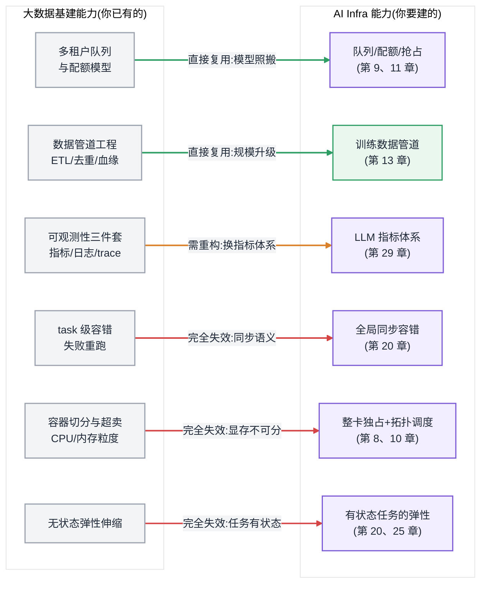
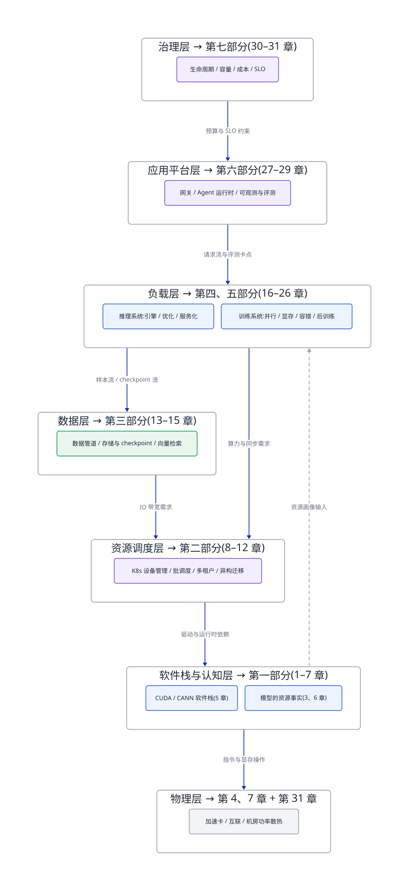
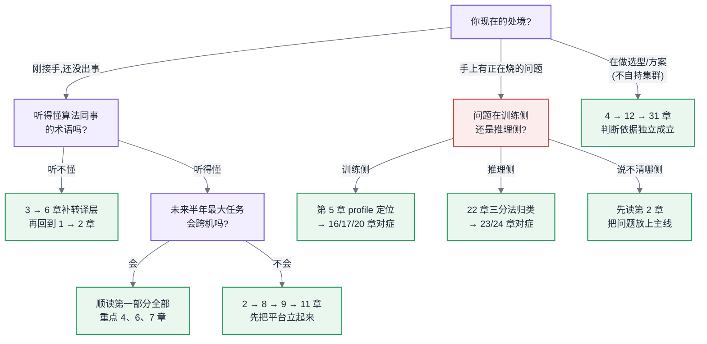

# 第 1 章 从大数据基础设施到 AI 基础设施

## 1.1 链路定位

本章位于两条主线之外、之上:它不属于"一次训练任务的生命周期"(主线 A)或"一次推理请求的全链路"(主线 B)的任何一段,而是为这两条主线画出地基——告诉你从大数据世界带来的哪些直觉在新地基上仍然成立,哪些会让你在第一个月就付出真金白银的代价。

## 1.2 依赖声明

本章是全书开篇,不依赖书内任何章节的结论;它依赖的是你已有的经验——我们假定你运维过或至少深度使用过 YARN/K8s 一类的资源调度系统、HDFS/对象存储一类的分布式存储、Spark/Flink 一类的计算引擎(见前言 [§0.2](../ai-infra-book-outline.md#02-前置知识声明写进前言) 前置知识声明)。本章的全部工作,就是对这份经验做一次资产盘点:标出可复用项、需重构项与坏账。

## 1.3 问题场景:接手 GPU 集群的前两周

老周做了九年大数据平台。他管过 4000 节点的 Hadoop 集群,把 YARN 队列调到过 92% 的资源利用率,主导过从 MapReduce 到 Spark 的整体迁移。2025 年初,公司采购了 256 张训练卡,分布在 32 台八卡服务器上,老周被任命为 AI 平台负责人。领导的原话是:"你是管过最大集群的人,这 32 台机器交给你,应该是降维打击。"

前两周,老周基于旧经验做出了三个判断,后来被证明全部错误。

**第一个判断:"利用率低就超卖。"** 上线第三天,监控显示集群总体分配率只有 60%,大量任务在排队。老周的本能反应和 YARN 时代一样:开超卖,把资源切细,让排队任务先跑起来。他推动运维给推理业务的卡配置了显存共享。当晚,一个训练任务和一个推理服务被调度到同一张卡上,训练任务申请显存失败,直接 OOM 退出——它已经跑了 31 个小时,而上一次 checkpoint 在 4 小时前。4 小时 × 64 卡的算力,一夜清零。

**第二个判断:"失败了重跑那个 task 就行。"** 第一次事故复盘时,老周问了一个在 Spark 世界完全合理的问题:"挂的只是一个进程,为什么不能只重跑那一个,其他进程接着干?"算法同事解释了十分钟同步训练的梯度语义,老周将信将疑。一周后,一根光模块故障导致一台机器掉线,他亲眼看到 256 个进程在同一秒集体停摆——不是调度器杀的,是它们在等一次永远不会完成的 AllReduce。

**第三个判断:"任务多了就加机器,弹性扩容。"** 排队问题持续恶化,老周申请借调了公司云上的 GPU 资源,准备像当年给 Spark 集群做潮汐扩容一样,让训练任务"弹"出去。方案评审时被驳回,理由有三条他当时都没听懂:云上的卡和本地的卡之间没有 RDMA 互联;训练任务改变卡数需要重新划分并行策略、重启整个任务;跨机房跑梯度同步,吞吐会掉到不足原来的十分之一。

两周结束,老周在周报里写了一句话:"这不是大数据换了个引擎,这是另一门生意。"这句话就是本章要论证的东西——以及更重要的,论证它的边界:哪些东西真的变了,哪些东西其实没变。

## 1.4 原理与量化模型:AI Infra 的三个新约束

老周的三个误判,对应三个大数据时代不存在的物理与结构约束。它们不是工程风格差异,而是可以写成算式的硬约束。本节先给出定性结构与量级判断,精确公式在后续章节展开(显存换算见第 6 章,通信估算见第 7 章,失败率模型见第 20 章)。

在逐条展开之前,先把"新"字钉死——这三个约束不是暂时现象,而是一个不等式的必然投影。Epoch AI 对数百个知名模型的统计显示:自 2010 年深度学习时代开启,头部模型的训练算力需求以每年约 4 倍的速度增长——2012 年 AlexNet 的训练总量约在 10^17 FLOP 量级,2020 年 GPT-3 约为 3×10^23 FLOP,八年跨了近六个数量级;此后的前沿模型又在此之上继续抬升。同期硬件供给侧的增长完全不在一个坐标系上:单卡峰值算力十年提升约两个数量级——其中相当一部分还是靠降低数值精度换来的(见第 4 章),显存容量与访存带宽的提升不足一个数量级,跨机网络带宽提升约一到两个数量级。需求每年 4 倍,单设备供给每两年不到 2 倍,这个剪刀差只有一种填法:堆卡数。于是任务规模从单机八卡走到千卡、万卡;而卡数一上去,显存必须切分、通信必须跨层级、同步必须全局——本节的三个约束,正是这同一个剪刀差在三种资源上的投影。这也是为什么它们只会更紧不会消失:只要"需求增速大于单设备供给增速"这个不等式还成立,分布式的深度就只会加深。

图 1-1:知名模型训练算力(FLOP)随发表时间的增长。2010 年之前的年均增速约 1.4 倍,与硬件演进大致同步;深度学习时代跃升到约 4 倍/年,远超任何单设备指标的增速。图片来源:Epoch AI, "Notable AI Models"(CC BY 4.0),epoch.ai。

### 1.4.1 显存墙:资源从"可扩容"变成"硬上限"

大数据世界的第一直觉是:内存不够就加节点,单机内存不够就 spill 到磁盘。Spark 的整套执行模型都建立在"内存是缓存、磁盘是兜底"之上。

AI 负载的第一资源是显存(HBM,物理成因见 [§4.1.2](第04章-硬件第一性原理、架构范式与数值精度.md#412-hbm显存墙的物理来源)),它有两个大数据世界没有的性质:

**不可扩容。** 一张卡出厂时显存容量就焊死了,没有插槽,没有 spill——训练中把激活值换出到主存不是不行(见第 17 章 Offload),但主存带宽比 HBM 低一个数量级以上,换出即意味着算力闲置。

**需求可精确预算,且经常一步越界。** 一个模型的训练显存大致由四块构成:权重、梯度、优化器状态、激活值(构成来源见第 3 章,精确换算见 [§6.2](第06章-模型结构的定量分析.md#62-参数量与资源换算核心))。仅前三块,常见混合精度配置下就约为每参数 16 字节量级——一个 70B 参数的模型,不做任何切分需要 1TB 级显存,而单卡容量是几十 GB 量级。这个除法给出一个大数据时代不存在的结论:**模型能不能跑起来,在提交之前就能算出来,而且算错的代价是任务根本起不来或中途 OOM,不是"慢一点"。**

这就是老周第一个误判的根源:在 CPU/内存世界,超卖赌的是"大家不会同时用满",赌输了顶多性能抖动;在显存世界,超卖赌输的结果是确定性的进程死亡,而死掉的可能是一个跑了 31 小时的有状态任务。

**所以这对做平台的人意味着什么:** 显存是你平台上唯一一种"既不可超卖、又不可扩容、需求还能被精确计算"的资源。你的配额系统、调度器和容量规划,都必须把它当第一公民,而不是当作内存的一个变种。

### 1.4.2 通信墙:带宽层级差出三个数量级,且不可用钱抹平

大数据集群的网络是"扁平"的:万兆或 25G 以太网,节点之间大致等价,shuffle 慢了可以加带宽、可以落盘错峰。网络是性能问题,不是架构问题。

AI 集群的互联是陡峭的层级结构(完整讨论见第 7 章):

| 层级 | 典型带宽量级 | 相对比例(粗略) |
|---|---|---|
| 卡内 HBM 访存 | TB/s 级 | ~1000 |
| 域内卡间互联(NVLink 类) | 数百 GB/s 级 | ~100 |
| 跨机 RDMA 网络 | 数十 GB/s 级 | ~10 |
| 普通数据中心以太网 | GB/s 级 | ~1 |

三到四个数量级的落差意味着:**同一份数据交换,发生在哪一层,耗时差一千倍。** 而训练中的数据交换不是偶发的——数据并行下,每一步迭代都要对全部梯度做一次 AllReduce,通信量约为每卡 2 倍参数字节数(公式见第 7 章),千亿参数模型每步就是数百 GB 级的全局交换,每几秒钟一次,贯穿数周。

这解释了老周第三个误判里"云上借卡"被否的第一条理由:训练不是把任务放到"有卡的地方"就行,而是必须放到"卡之间足够近的地方"。跨机房的带宽落差不是让训练慢 20%,是慢 90% 以上——此时借来的卡本身也在陪着空转,弹出去的每一分钱都在双倍浪费。

**所以这对做平台的人意味着什么:** 你的调度器必须理解拓扑。在大数据集群里,把任务放错机架损失 10% 的性能;在 AI 集群里,把任务放错互联域损失的是数倍性能(见第 8 章)。"有空闲资源"和"有可用资源"从此是两回事。

### 1.4.3 全局同步:故障模型从"局部重试"变成"全体连坐"

这是三个约束里最深刻、也最反直觉的一个。

MapReduce 的天才之处在于把计算切成无依赖的 task:一个 task 失败,调度器换台机器重跑它,其他 task 毫无感知。整个 Hadoop 生态的容错哲学建立在这一点上——**故障的影响半径等于一个 task**。

同步训练把这个前提彻底摧毁了。数据并行训练要求所有参与进程在每一步用同一份权重计算、并共同完成梯度归约,任何一个进程掉队,AllReduce 就无法完成,所有进程集体阻塞。**故障的影响半径等于整个任务。** 这就是老周看到的"256 个进程同一秒集体停摆"。

这个结构差异可以量化。设单卡在任务期间不发生故障的可用度为 a(含卡、主机、网络、软件),N 卡同步任务无中断跑完的概率是 aⁿ。取一个对单卡来说相当体面的数字 a = 99.9%(一次两周的任务):

- 8 卡:99.2%——基本无感
- 256 卡:77%——大约四次里挂一次
- 4096 卡:1.7%——**几乎必然中断,而且会中断很多次**

大数据集群也是这个数学,但 task 级重试让 aⁿ 无关紧要;同步训练让它成为主宰。由此推出 AI Infra 特有的一整套工程(第 14、20 章):checkpoint 不是备份习惯而是核心生命线,其写入间隔由"故障间隔期望 × 单次损失"的期望损失最小化决定;有效训练时间占比(goodput)取代"任务成功率"成为集群的核心 SLO;千卡以上必须配备自动故障检测、慢节点踢除与断点续训,否则集群一半时间在"等人来重启"。

aⁿ 不是纸面推演,头部玩家的公开报告恰好给它做了实测。Meta 在 Llama 3 技术报告(arXiv:2407.21783)中披露:405B 模型在 1.6 万卡集群上预训练 54 天,共发生 466 次任务中断,其中 419 次为非计划中断;非计划中断里约 78% 由已确认或疑似的硬件问题引发,GPU 及其显存的故障又占其中大头——平均不到三小时就有一次中断。要注意,这是把自动化容错做到业界顶配之后的结果:靠自动故障检测与快速断点恢复,Meta 把有效训练时间占比维持在 90% 以上——反过来读,即便是这样的团队,仍有接近一成的万卡卡时消耗在故障与恢复上。字节跳动的 MegaScale 论文(arXiv:2402.15627)给出另一侧证词:在 1.2 万卡生产集群上训练 175B 模型,论文里容错与诊断系统占的篇幅和并行优化平分秋色——机器上线前的深度检测、自动化故障定位、慢节点识别与踢除、训练过程可回放的诊断数据,全是为"aⁿ 在万卡尺度约等于零"这个事实配套的系统建设。两份报告合起来说明:"一次全局同步失败"不是小概率事故,而是万卡训练的日常节拍;工程的分野只在于,你的系统把每次中断的代价压到分钟级,还是任由它以小时计。

> **延伸阅读:** Grattafiori et al., "The Llama 3 Herd of Models"(arXiv:2407.21783),§3.3.4 给出 54 天预训练的完整中断原因分布表;Jiang et al., "MegaScale: Scaling Large Language Model Training to More Than 10,000 GPUs"(arXiv:2402.15627),记录了万卡集群容错与诊断系统的完整设计。两文的 arXiv 许可不允许直接转载图表,建议对照原文阅读。

同一个结构还判死了传统弹性伸缩(老周的第三个误判的另一半):无状态服务加减实例只需改负载均衡权重;同步训练加减一张卡,意味着并行切分、进程组、数据分片全部重建——"伸缩"不是流量调整,是一次任务重启。弹性训练(见第 20 章)在工程上存在,但它是需要专门建设的能力,不是免费得到的前提。

**所以这对做平台的人意味着什么:** 你要重新回答"什么叫稳定"。大数据平台的稳定是"故障不影响结果",AI 平台的稳定是"故障造成的算力损失被控制在预算内"——前者是布尔值,后者是一个你必须持续测量和优化的百分比。

## 1.5 方案对比:老平台的三条改造路线

认清三个约束之后,平台负责人面前通常摆着三条路。三条都有人走通过,也都有明确的失效边界——只夸不贬的方案介绍在本书里不会出现,这是第一次示范。

**路线一:在现有大数据平台上"打补丁"。** 给 YARN/既有 K8s 集群装上设备插件,把 GPU 当作一种新资源类型纳入现有队列和配额体系,复用全部账号、审计、监控设施。
*适用:* 负载以单卡/单机的小规模微调与批量推理为主,组织想在三个月内快速支持 AI 业务。
*失效边界:* 一旦出现 16 卡以上的多机训练,这条路线塌方——通用调度器没有 Gang 语义会产生资源死锁(见第 9 章),没有拓扑感知会把任务撒到互联域之外(见第 8 章),旧监控体系对 MFU、通信空泡完全失明(见第 11 章)。判断标准很简单:**当你最大的单个任务跨机器时,补丁路线到头了。**

**路线二:独立建设 AI 专属栈。** 新建 K8s 集群 + 批调度器(Volcano/Kueue 类)+ 并行文件系统 + AI 专属可观测性,与大数据平台只在数据层和账号层打通。
*适用:* 有百卡以上规模、有多机训练需求、且组织愿意接受 6–12 个月建设期。这是本书大部分章节默认的形态。
*失效边界:* 卡数少于几十张时,这套栈的建设与运维成本压不回来——你会用三个工程师的人力伺候一个两人算法团队;另一个失效条件是组织根本招不到既懂调度又懂训练的人,栈建起来没人会修(生态与人才作为选型变量的量化方法见 [§12.7](../第二部分-算力底座/第12章-国产算力平台与异构迁移.md#127-生态作为选型变量全书唯一定义处))。

**路线三:算力外采,自建只做薄平台。** 训练用云上托管集群或算力租赁,自己只建网关、配额、数据管道与生命周期管理这层"薄壳"。
*适用:* 需求波动大、总量小于长期自建的盈亏平衡点(自建 vs 云的完整决策框架见 [§31.3](../第七部分-工程化与治理/第31章-容量、成本与SLO.md#313-成本把全书折算成钱)),或数据合规允许出域。
*失效边界:* 三种情况下这条路走不通——数据不能出域;负载长期稳定跑满(此时租赁溢价持续放血);以及业务对训练与推理的联动改造有深度定制需求,而托管方的栈是黑盒。此外它有一个隐性代价:团队永远无法积累底层排障能力,一旦将来被迫自建,等于从零开始。

三条路线不是终身选择。常见的健康路径是"一 → 二"(用补丁期验证需求真实性,再投资专属栈)或"三 → 二"(用外采期养活业务,同时建设团队)。真正危险的是在路线一上滞留过久:补丁平台每天都在正常运转,直到第一个多机训练需求出现,才发现所有欠账要在业务最急的时刻一起还。

**所以这对做平台的人意味着什么:** 选路线的自变量不是技术偏好,而是三个数:最大单任务卡数、集群总卡数、数据出域约束。本章末尾的决策树会把它们串起来。

## 1.6 大数据对照:一次完整的资产盘点

本段是本章的主体。前面讲了"什么变了",这里系统回答"你的十年经验还剩多少"——答案比悲观者想的多,也比乐观者想的少。

### 1.6.1 先把旧版图钉在墙上

用一分钟唤起你的知识框架,不展开:大数据基建版图由四块构成——**调度层**(YARN/Mesos/K8s:队列、配额、抢占、多租户),**存储层**(HDFS/对象存储:分层、副本、生命周期),**计算层**(MapReduce → Spark:DAG、shuffle、task 级容错),**流批层**(Kafka/Flink:管道、背压、exactly-once)。围绕它们长出的方法论:资源隔离(cgroup/容器)、可观测性(指标/日志/trace 三件套)、数据治理(血缘、质量、版本)。

再把两代基建放到同一条时间轴上,能看清今天的处境是怎么走到的。大数据这条线:2006 年 Hadoop 从 Nutch 项目独立,把"廉价机器 + 容错软件"的哲学工业化;2014 年 Spark 1.0 发布,内存计算把批处理带进准交互时代;随后 Flink 把流批一体推向主流。到 2010 年代末,这条线已经收敛:技术栈稳定、人才充裕、最佳实践成书。AI 这条线几乎同期在另一个世界起跑:2012 年 AlexNet 用两张消费级显卡赢下 ImageNet,深度学习进入 GPU 时代;2017 年 Transformer 统一架构,让"堆算力换能力"第一次有了可无限复制的配方;2020 年 GPT-3 用千亿参数证明规模本身就是能力;2022 年底 ChatGPT 引爆需求侧,训练集群从少数实验室的专属,变成每家中型公司的采购议题。两条演进线在 2022 年之后正面交汇:一边是大数据世代培养出的成建制平台团队,一边是 AI 世代野蛮生长的算力基建需求——老周的故事就是这场交汇的缩影。还要注意两条线的节奏差:大数据从诞生到方法论成熟用了约十五年,而 AI Infra 从需求爆发到今天不过几年,大量"最佳实践"还在各家的事故复盘里发酵。这正是资产盘点的价值:能从上一代直接继承的就直接继承,省下的力气全部投到真正的新问题上。

下面这张图是全章的总纲:左边是你已有的,右边是你要建的,三种颜色的边就是资产盘点的结论。

图 1-2:大数据能力向 AI Infra 的迁移图。绿色的资产可以直接入账,橙色的要重构后入账,红色的是坏账——而坏账恰好集中在容错、资源粒度、弹性这三件你过去最引以为傲的事情上。

### 1.6.2 直接复用的资产

**多租户与配额模型。** YARN 的队列树、容量配额、弹性借用与归还、抢占优先级——这套模型的抽象在 AI 集群里原封不动地成立,Volcano/Kueue 的队列语义与 YARN Capacity Scheduler 的亲缘关系一眼可见(第 9 章)。你踩过的所有组织博弈的坑同样直接复用:配额永远不够分、借出去的资源要不回来、"公共池"最终被最激进的团队占满。这些经验在 AI 集群里加倍值钱,因为单位资源贵了两个数量级——大数据时代一个失控队列浪费的是电费,现在浪费的是每小时数千元的卡时。

顺着"贵了两个数量级"再往下拆一层,会发现整张成本结构表反转了。大数据集群的物料清单里,计算节点是便宜的大路货,真正花钱的是存储容量与机房网络——所以那个时代的架构哲学是"移动计算比移动数据便宜",调度器拼命把任务塞到数据所在的节点上。AI 集群把这张清单倒了过来:一台八卡训练服务器里,加速卡通常占整机成本的七八成,CPU、内存、本地盘全部沦为配角;网络虽然也在升级,但相对卡的投入只是零头;而电力与散热从"机房杂费"跃升为一等成本项——一张训练卡的功耗是一颗服务器 CPU 的数倍,整机柜功率密度成倍抬升,不少机房的瓶颈已经不是机位而是供电与制冷(完整的 TCO 拆解见第 31 章)。这个反转直接改写平台团队的优化指向:大数据时代优化的是"数据不动、少占存储",AI 时代优化的是"让最贵的那个部件一直在算"——同样一个百分点的利用率,值的钱差了两个数量级,这也是为什么 MFU 而不是分配率成为新的北极星指标(见第 11 章)。

**数据管道工程。** 采集、清洗、去重、质量过滤、血缘、版本——训练数据管道(第 13 章)就是你熟悉的那条 ETL 流水线,Spark 做万亿 token 级去重至今仍是主流方案。这是全书大数据经验密度最高的一章,你在那里几乎是主场作战。变化在量级和瓶颈位置:多模态数据把体量抬高两三个数量级,瓶颈从 IO 挪到 CPU 解码,但方法论骨架不变。

**资源隔离与可观测性方法论。** cgroup/容器/命名空间的隔离思想、"指标—日志—trace"的观测三件套、SLO 驱动的告警设计、根因定位的分层排查法——方法论全部成立。失效的是具体指标(下一节讲)。

**所以这对做平台的人意味着什么:** 你的组织能力、治理经验和工程品味是可迁移的,真正要重学的是资源的物理性质。这决定了你补课的方向:不是去学算法,而是去学显存、互联和同步语义——也就是本书第一部分的另外六章。

### 1.6.3 需要重构的资产

**可观测性的指标层。** 方法论复用,指标全换。CPU 利用率的等价物不是 `nvidia-smi` 显示的 GPU 利用率——那个数字只表示"时间窗内有 kernel 在跑",一张卡在等通信时它照样是 100%,这是 AI 集群最著名的误导性指标(第 11 章)。你需要一套新的一等指标:MFU、TTFT、TPOT、goodput、缓存命中率(第 29 章)。重构的关键不是接入新 exporter,而是重建"什么数字代表健康"的判断力。

**调度器。** 队列与配额模型复用,但调度决策的两个内核要重写:一是 Gang 语义——批处理容忍部分启动,同步训练是 0 或 1,部分启动等于死锁(第 9 章);二是拓扑感知——资源从"CPU 核 × 内存 GB"的二维可加向量,变成了带拓扑约束的不可加结构,8 张卡在同一互联域内和散在 8 台机器上是两种资源(第 8 章)。

**存储。** 分层存储、冷热分离的思想复用,但要为两种新负载画像重构:训练读(高并发顺序大吞吐)与 checkpoint 写(全集群同秒突发,写完即闲)。后者在大数据时代没有对应物——最接近的是所有 executor 同时 spill,但那是事故,而 checkpoint 是每小时一次的常规操作(第 14 章)。

### 1.6.4 彻底失效的资产:四条,每条都要说清为什么

**第一,无状态假设。** 大数据的计算任务本质是纯函数:输入分片,输出结果,进程本身无价值。训练进程携带着自上次 checkpoint 以来的全部计算成果,杀掉一个进程等于没收全集群几小时的产出。一切建立在"进程可随意杀"之上的机制——抢占式混部、bin-packing 重调度、随意驱逐——都必须在"驱逐成本 = 全任务卡数 × 距上次 checkpoint 的时间"这个新代价函数下重新评估。抢占不是不能做,而是从"免费手段"变成了"需要精算的手段"(第 9 章)。

**第二,故障容忍模型。** [§1.4.3](#143-全局同步故障模型从局部重试变成全体连坐) 已给出数学:影响半径从 1 个 task 变成整个任务,aⁿ 从无关紧要变成主宰。补充一条推论:大数据世界"用更多廉价机器换可靠性"的经济学在这里反转——加卡不但不提高可靠性,反而按幂次降低任务的无中断概率。规模越大,越要买可靠性而不是买冗余。

**第三,资源分配粒度。** CPU 可以时间片切分、内存可以按页超卖,一台 128 核机器服务几百个容器是常态。显存没有页面换出的等价物,默认粒度是整卡(切分技术存在但有严格适用边界,见第 10 章),训练场景整卡都不够、要整机甚至整互联域独占。资源池从"细沙"变成"巨石":装箱率天然难看,碎片以"卡"为单位,你在大数据时代赖以自豪的 90%+ 分配率,在训练集群里换成了另一个目标——让分出去的每张卡真的在算(MFU,第 11 章)。

**第四,弹性伸缩的前提。** 弹性伸缩隐含四个前提:实例无状态、启动秒级、加减实例不影响存量、负载可被均匀拆分。四条在训练场景全部不成立([§1.4.3](#143-全局同步故障模型从局部重试变成全体连坐) 已述),在推理场景也只成立一半——推理实例虽无训练那样的全局状态,但冷启动要经历权重加载、图编译、预热三段,量级是分钟而非秒(第 25 章),KV Cache 又让"实例等价"变得可疑(第 24 章)。弹性在 AI 场景不是配置项,是要专门建设的系统能力。

### 1.6.5 shuffle 与 AllReduce:一个收束全段的对照

如果只允许用一个对照记住本章,用这个。Spark 的 shuffle 和训练的 AllReduce 在拓扑上是同一件事:全局数据交换。差异只有一处——shuffle 的中间结果可以落盘,于是交换可以异步、可以重试、可以只重跑丢失的分区;AllReduce 在显存里同步完成,于是交换是阻塞的、参与者是连坐的、失败是全局的。**一个"落盘"的自由度,分叉出两个世界的全部容错哲学。** 大数据用它换来了 task 级容错和弹性;AI 训练付不起这个落盘(每步数百 GB、每几秒一次),于是只能走 checkpoint + 全局重启的路。理解了这一个分叉,[§1.4](#14-原理与量化模型ai-infra-的三个新约束) 的三个约束和本节的四条失效资产,都是它的推论。

## 1.7 全书地图与选型决策树

### 1.7.1 七层版图:每一层归哪部分管

图 1-3:AI Infra 七层版图与本书七个部分的对应。两条贯穿主线(第 2 章)会纵向穿透这七层:任何一个性能问题,都是某条主线在某一层的某个等待。
<!-- source: diagrams/ch01-seven-layer-map.d2 -->

七个部分的组织逻辑是"从物理向上":第一部分建立心智模型(硬件、软件栈、模型的资源事实、互联),第二部分管卡(调度与多租户),第三部分管数据,第四、五部分分别沿主线 A、主线 B 展开,第六部分是模型之上的平台件,第七部分把一切折算成钱和 SLO 收口。两条主线的作用在第 2 章精确定义:主线 A 是一次训练任务的生命周期,主线 B 是一次推理请求的全链路,全书每一章都标注自己在哪条主线的哪一段——因为所有优化本质上都是在消除某条主线上的某个等待。

### 1.7.2 你的问题在哪一章

不要按目录顺序读这本书,按你手头的问题读:

- **"集群利用率被质疑了"** → 第 11 章(归因)→ 第 29 章(指标)→ 第 9 章(调度)
- **"训练跑不起来 / OOM"** → 第 6 章(先算)→ 第 17 章(再省)→ [§5.2](第05章-CUDA、CANN与加速器软件栈.md#52-运行时的共性问题)(还不行就查分配器)
- **"训练能跑但慢"** → [§5.4](第05章-CUDA、CANN与加速器软件栈.md#54-profiling-方法论全书唯一定义处)(profile)→ 第 16 章(并行对不对)→ 第 7 章(通信)→ 第 13 章(是不是在等数据)
- **"千卡训练老中断"** → 第 20 章 → 第 14 章(checkpoint)
- **"推理延迟 / 成本压不下来"** → 第 22 章(三分法定位)→ 第 23 章(计算类)→ 第 24 章(显存类与架构)
- **"要不要迁国产卡 / 怎么评估"** → [§5.3](第05章-CUDA、CANN与加速器软件栈.md#53-cann-与昇腾软件栈两套完整并行的世界) → 第 12 章 → 附录 E
- **"领导要我规划新集群 / 出预算"** → 第 4 章 → 第 7 章 → 第 31 章
- **"我是售前 / 方案架构师,要判断方案成立不成立"** → [§4.2.2](第04章-硬件第一性原理、架构范式与数值精度.md#422-训练型与推理型负载的硬件诉求差异) → 第 12 章 → 第 31 章
- **"完全没有算法背景,听不懂算法同事说话"** → 第 3 章 → 第 6 章

### 1.7.3 选型决策树:我该从哪一章开始读

图 1-4:"我该从哪一章开始读"的分流决策树。它想让你记住的一件事:带着在烧的问题来的读者,第一步永远是先定位问题在哪条主线的哪一段,而不是从第 4 章硬件开始补课。

---

**读完本章,你应当能:** 对自己团队的大数据存量能力做一次资产盘点——逐项判断它属于"直接复用、重构后复用、彻底失效"三类中的哪一类并说出理由;用 aⁿ 估算给定规模同步任务的无中断概率,向管理层解释为什么 256 卡集群的运维目标必须从"任务成功率"改为"有效训练时间占比";并根据"最大单任务卡数、集群总卡数、数据出域约束"三个数,判断自己该走三条平台改造路线中的哪一条。
