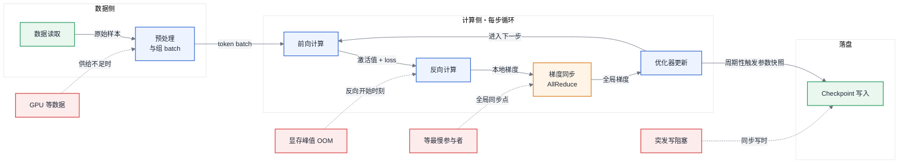
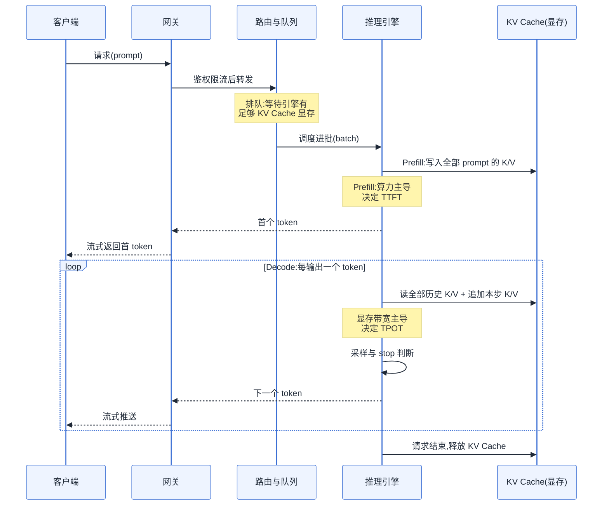
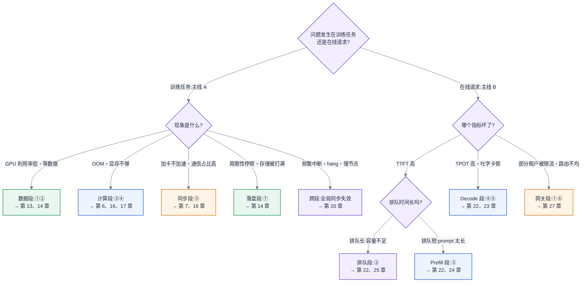

# 第 2 章 两条主线解剖与框架地图

## 2.1 两条主线先共享一张地图

这一章不属于两条主线中的任何一段——它定义这两条主线本身:**主线 A(一次训练任务的生命周期)与主线 B(一次推理请求的全链路)**。后续章节讨论的位置、资源和等待关系,都使用这里建立的坐标系。

## 2.2 旧平台经验为什么要重新校准

本章建立在第 1 章的一条结论之上:**AI Infra 不是大数据换个引擎**——显存墙、通信墙与长时任务的全局同步特性,使旧经验的复用必须逐条验证边界。既然旧地图失效,就需要一张新地图,本章负责把它画出来。

## 2.3 问题场景:一场谁也说服不了谁的选型会

某公司要上线内部大模型推理服务,平台组开了一次选型会,会议纪要里留下了这样三条争论:

第一条,一位工程师做了"vLLM vs KServe"的对比表,列了十二项功能,结论是"KServe 功能更全,建议选 KServe"。另一位反驳:vLLM 是推理引擎,KServe 是编排平台,两者根本不在一层,"这就像拿 Spark 和 YARN 做对比,然后结论是 YARN 的算子少"。会议在这里停了四十分钟,谁也没能把"层"说清楚。

第二条,业务方抱怨线上原型"响应慢",要求"换个更快的框架"。追问之下发现三种"慢"混在一起:有的请求首字要等 8 秒(长文档场景),有的请求首字很快但吐字肉眼可见地卡顿,还有的请求在高峰期整体超时。三种现象的瓶颈分别在链路的三个不同位置,但在会上被归并成了同一个问题,解法自然也吵不出来。

第三条,训练侧同事插了一句:"我们训练任务 GPU 利用率只有 45%,是不是也该换框架?"没有人能回答,因为没有人说得清那 55% 的时间 GPU 到底在等什么——等数据?等通信?还是等一台慢节点?

这场会最终没有产出任何决议。问题不在于与会者水平不够,而在于大家没有共享同一张地图:**不知道链路上每一步在等什么,就无法定位瓶颈;不知道框架在哪一层,就无法做对比。** 本章就是那张缺失的地图。

## 2.4 原理与量化模型:两条主线与一张分层地图

优化的本质是消除等待。一条链路上的每一步,要么在做有效计算,要么在等某种资源就绪——等数据从存储到达、等激活值算完、等梯度从别的卡传过来、等一段显存被腾出来。因此,描述链路的正确精度不是"有哪些步骤",而是**每一步的主导资源是什么、它在等什么**。下面按这个精度解剖两条主线。

### 2.4.1 主线 A:一次训练任务的生命周期

一次训练任务由数万到数百万个"训练步"(step)组成,每一步都完整地走一遍以下循环:

**① 数据读取。** 从对象存储或并行文件系统读入原始样本。主导资源是**存储 IO 与网络带宽**,这一步 GPU 在等磁盘和网卡。它的特点是可以提前做:预取(prefetch)得当,这一步应当完全隐藏在计算背后;GPU 空等数据,说明数据管道的供给速率低于消费速率(第 13 章)。

**② 预处理与组 batch。** 分词、拼接、padding 或 packing、搬运到显存。主导资源是**CPU 与 PCIe 带宽**。文本负载下它很少成为瓶颈;多模态负载下图像视频解码会把瓶颈从 IO 挪到 CPU(见第 13 章非文本数据管道)。这一步 GPU 在等 CPU。

**③ 前向计算。** 逐层计算激活值,得到 loss。主导资源是**算力与显存带宽**——不同算子归属不同(Attention 偏访存、FFN 偏算力,定量见第 6 章)。同时,激活值被保留下来供反向使用,**显存占用在这一段持续爬升**(原因见 [§3.1](第03章-人工智能与大模型基础.md#31-神经网络与训练三阶段))。这一步没有外部等待,是链路上少数"纯计算"的段落。

**④ 反向计算。** 从 loss 反推每个参数的梯度。算力开销约为前向的两倍,且**显存在反向开始时刻达到峰值**——激活值尚未释放、梯度已开始产生。训练 OOM 几乎都发生在这个时刻(排查见第 17 章)。

**⑤ 梯度同步。** 数据并行的各副本通过 AllReduce 交换梯度(原语见第 7 章)。主导资源是**互联带宽**,这一步所有 GPU 在等最慢的那个参与者。两个关键事实:其一,通信量与参数量成正比、与 batch 大小无关;其二,这是一个**全局同步点**——任何一张卡掉队,全体等待。第 1 章讲的"通信墙"与"全局同步特性",物理位置就在这里。

**⑥ 优化器更新。** 用全局梯度更新参数与优化器状态。主导资源是**显存带宽**(要完整读写参数、梯度、优化器状态三大块,见 [§3.2](第03章-人工智能与大模型基础.md#32-优化器与超参的-infra-含义)),计算本身很轻。

**⑦ Checkpoint 写入。** 每隔一定步数,把参数与优化器状态落盘。主导资源是**存储写带宽**,且是**瞬时突发全集群写入**:平时存储近乎空闲,写 checkpoint 的几十秒内写入量拉满。同步写会让所有 GPU 停下来等存储(优化见第 14 章)。

图 2-1:主线 A——一次训练步的完整循环。训练的四类典型瓶颈(等数据、显存峰值、等通信、等存储)各有固定的发生位置,定位瓶颈就是定位"这一步在等什么"。

主线 A 有三个结构性性质,后续章节反复依赖:

1. **它是循环,不是流水线。** 同一个循环重复数十万次,任何一步的常数级浪费都会被步数放大成天级的卡时损失。每步省 200ms,在三十万步的任务里就是省 16 个卡日乘以集群规模。
2. **它是同步的。** 第⑤步把全集群铆在一起,单点故障即全局停顿——这是第 20 章容错设计的出发点。
3. **它的资源画像逐步切换。** IO → CPU → 算力 → 显存 → 网络 → 存储,轮流坐庄。所以"训练慢"这三个字没有任何诊断价值,必须落到具体的段。

把七段合起来,可以写出一步耗时的结构化账目:

> T_step ≈ max(T_数据供给, T_前向 + T_反向) + T_同步未重叠部分 + T_更新 + T_ckpt / 保存间隔步数

这个式子本身就是优化路线图。两处 max 与"未重叠"措辞点明了训练优化的第一原则:**能重叠的等待都应当被重叠掉**——数据预取让 T_数据供给 藏进计算,梯度分桶让同步与反向计算并行,异步 checkpoint 让落盘不阻塞下一步。理想状态下,T_step 收敛到纯计算时间;实际 T_step 与纯计算时间的差值,就是这台集群每一步在"白等"的部分。第 11 章的利用率归因,本质上就是把这个差值拆回到四类等待上;各项 T 的具体算法在第 6 章(计算)、第 7 章(通信)、第 14 章(存储)分别给出。这里只需要记住结构:**训练优化不是把某段算得更快,而是把链路上的串行等待逐段消除或藏起来。**

### 2.4.2 主线 B:一次推理请求的全链路

一次推理请求从用户发出到最后一个 token 返回,经过以下环节:

**① 网关。** 鉴权、限流、配额、按模型或供应商路由。主导资源是普通的 CPU 与网络,与传统 API 网关同构,但多了以 token(口径见 [§3.3](第03章-人工智能与大模型基础.md#33-从-nlp-到-llm))为单位的计量与限流(第 27 章)。

**② 路由与排队。** 请求被分发到某个引擎实例,若实例满载则排队。这一步请求在等**一段够大的 KV Cache 显存**(KV Cache 的由来见 [§3.4](第03章-人工智能与大模型基础.md#34-transformer-与注意力))。排队时长是高峰期延迟的主要构成,而队列的深浅由显存决定——这是推理与传统在线服务最不同的一点:**并发上限不是 CPU 决定的,是显存决定的**。

**③ Prefill(预填充)。** 引擎把 prompt 的全部 token 一次性并行计算,生成首个输出 token,并把所有中间 K/V 写入 KV Cache。主导资源是**算力**(compute-bound),耗时与 prompt 长度近似线性。用户体感指标 **TTFT(Time To First Token,首 token 延迟)** 主要由这一步加排队构成。

**④ Decode 循环。** 逐 token 自回归生成:每生成一个 token,都要把整份模型权重和这条请求的 KV Cache 从显存读一遍,而计算量极小。主导资源是**显存带宽**(memory-bound)。用户体感指标 **TPOT(Time Per Output Token,每 token 生成间隔)** 由这一步决定。生成 500 个 token 就要循环 500 次——推理引擎的绝大部分优化(批处理、量化、投机推理)都作用在这个循环上(第 22、23 章)。

**⑤ 采样与后处理。** 从 logits 中按采样策略选出下一个 token,检查 stop 条件,做约束解码。大词表下 logits 张量本身就很大,这一步的耗时占比常被严重低估([§22.3](../第五部分-推理系统/第22章-推理引擎原理.md#223-采样与后处理阶段))。

**⑥ 流式返回。** token 经网关以 SSE 等流式协议逐个推回客户端。主导资源回到普通网络。

Decode 为什么注定是显存带宽主导,可以用一笔粗账建立直觉:生成一个 token,至少要把全部模型权重从显存完整读一遍。一个权重占 14 GB 的模型放在显存带宽 2 TB/s 的卡上,单条请求的 TPOT 物理下限就是 14 / 2000 ≈ 7 ms——**无论算力多富余,这个下限都在那里**。而同一遍权重读取可以服务一批请求:把 32 条请求组成一个 batch,读一遍权重产出 32 个 token,单位 token 的带宽成本立刻摊薄到 1/32。这就是为什么批处理是推理引擎的第一优化,也是为什么并发上限(能塞进多少条请求的 KV Cache)如此值钱——它直接决定摊薄倍数。精确的公式与适用条件见第 6、22 章,这里只需要记住结构:**Decode 的吞吐是"带宽 × 批次摊薄"的生意,而批次规模被显存卡着脖子。**

Prefill 与 Decode 的资源画像截然相反——一个吃算力、一个吃显存带宽——却共享同一份硬件。同一张卡在 Prefill 时算力拉满、带宽富余,在 Decode 时带宽拉满、算力闲置,混在一起跑必然互相干扰:一条长 prompt 的 Prefill 能把同批次所有 Decode 请求的吐字卡住几百毫秒。这对矛盾是第五部分半数优化手段(Continuous Batching、Chunked Prefill、PD 分离)的共同出发点。

图 2-2:主线 B——一次推理请求的时序。TTFT 由排队加 Prefill 决定、TPOT 由 Decode 循环决定,两者瓶颈资源不同,必须分开度量、分开优化。

回到 2.3 节的三种"慢",现在可以精确归位:首字等 8 秒是**排队 + Prefill 问题**(长 prompt、算力段);吐字卡顿是 **Decode 问题**(显存带宽段或批次干扰);高峰期整体超时是**队列与容量问题**(显存决定的并发上限)。三种慢对应三段链路、三套解法,任何"换个框架"式的笼统结论都不成立。

### 2.4.3 框架三层地图

有了两条主线,还需要回答"某个开源项目管链路的哪一段"。答案是分层:AI Infra 的开源生态虽然项目繁多,但稳定地落在三层加一个网关层里,**每一层解决的问题、暴露的接口、失效的方式都不同**:

| 层 | 训练侧例子 | 推理侧例子 | 这一层关心什么 |
|---|---|---|---|
| 运行时 / 引擎层 | Megatron-Core、DeepSpeed、FSDP | vLLM、SGLang、TensorRT-LLM、LMDeploy | 显存、并行、批处理策略——单个进程组/实例内部把硬件用满 |
| 框架 / 工程层 | TorchTitan、LLaMA-Factory、verl / OpenRLHF | Triton Inference Server、Dynamo | 训练循环、多实例协同——把引擎组织成一次完整的任务或服务 |
| 编排 / 平台层 | Ray Train、Slurm、Kubeflow | KServe、Ray Serve、KubeAI | 弹性、多模型、流量、资源分配——把任务/服务放进集群 |
| 网关层 | — | 见第 27 章 | 配额、路由、多供应商接入 |

(以上项目仅作定位示例,机制剖析见第 18、19、22、24 章,版本信息一律见附录 C。)

为什么必须分层?因为**层间是包含与被调度的关系,不是竞争关系**。KServe 编排的对象里就可以跑着 vLLM;Ray Train 拉起的进程组里跑的就是 Megatron-Core 或 FSDP。拿 vLLM 和 KServe 对比,等于拿 Spark 和 YARN 对比——不是谁更好,而是问题问错了。正确的比较只发生在同层之间:vLLM vs SGLang(引擎层)、KServe vs Ray Serve(编排层)。

网关层单独列出而不并入编排层,是因为它的服务对象不同:编排层面向"实例"(拉起、扩缩、分配流量),网关层面向"租户"(配额、计费口径、多模型与多供应商路由)。一个平台可以没有网关层(内部单租户直连),但一旦对多个业务方提供服务,配额与路由逻辑塞进编排层或业务代码里,都会在扩展时返工——这是第 27 章的主题,此处只需在地图上占好格子。

分层还给出了排障的分工:请求排队排得不合理,查编排层与工程层;单实例吞吐上不去,查引擎层;跨实例流量倾斜,查编排层与网关层。**层定位错了,后面所有分析都是无效功。**

这张地图还有一个协作含义:层间接口就是职责边界。编排层负责拉起进程组与故障重启,工程层负责组织训练循环与数据分发,引擎层负责在进程组内部把卡用满——任何一项职责没有明确落在某一层,就会出现"故障发生后编排层以为工程层会重试、工程层以为编排层会重启"的职责真空,任务 hang 在原地烧卡时。三层接口契约的完整讨论在 [§19.3](../第四部分-训练系统/第19章-训练工程层与编排.md#193-三层接口契约本章核心);本章的地图是那场讨论的坐标底图。也要承认分层的例外:确有项目为了消除跨层开销故意越层(把编排逻辑下沉进引擎、或引擎自带路由),对这类项目,正确做法不是硬塞进某一格,而是标注"它同时占据哪两格、因此与哪些同层组件互斥"——地图的价值不在于消灭例外,而在于让例外变得可描述。

图 2-3:框架三层地图(全书框架坐标系)。层间是"编排—组织—执行"的调用关系而非竞争关系,任何框架对比只有发生在同一层内才有意义。
<!-- source: diagrams/sources/ch02-framework-three-layers.d2 -->

### 第四个横切面:可信平面

主线 A、主线 B 与三层地图回答"链路在哪一段、组件在哪一层",但还有一组问题不属于任何一段链路,却横切训练与推理的全程:每个动作由谁发起、被什么规则允许、留下什么证据、出了问题能不能撤回。本书把这组关切统称为**可信平面**——它不是一层组件,而是叠在整张地图上的第四个横切面,由八个要素构成,每个要素在后文有明确落点:

| 要素 | 一短语定义 | 落点 |
|---|---|---|
| Identity(身份) | 动作的发起者是谁:用户、Agent、工作负载还是服务 | 第 19、27、28 章 |
| Policy(策略) | 这个身份被允许做什么,粒度到资源与参数 | 第 28 章 |
| Provenance(来历) | 数据与模型从哪来、怎么构建的可验证记录 | 第 30 章(数据侧见第 13 章) |
| Signature(签名) | 制品由谁签发、没被换过 | 第 30 章 |
| Attestation(证明) | 运行环境确实是它声称的那个环境 | 第 30 章 |
| Admission(准入) | 证据不齐的制品与任务不得上线 | 第 30 章 |
| Audit(审计) | 谁在何时做了什么,事后可查、可到人 | 第 27、31 章 |
| Revocation(撤销) | 出问题的凭据与制品能被下架,且下架能传导 | 第 30 章 |

现在只需要在地图上占好这个格子并记住一件事:可信平面不是安全团队的附属需求,而是与利用率、延迟同级的平台设计维度——身份与凭据的形态在第 19、27、28 章随各自链路展开,八要素合流的集中展开处是第 30 章的「模型供应链」,其成本项在第 31 章入账。

### 2.4.4 全书术语与符号约定

后续章节的估算公式统一使用以下记号与口径。**每个概念只在指定处定义一次**(单点定义原则),此表只做索引:

| 记号 / 术语 | 含义 | 定义处 |
|---|---|---|
| N / N_act | 模型总参数量 / 每 token 激活参数量(MoE 下两者不同) | [§3.5](第03章-人工智能与大模型基础.md#35-模型谱系)、[§6.2](第06章-模型结构的定量分析.md#62-参数量与资源换算核心) |
| B、S、L、H | batch size、序列长度、层数、隐藏维度 | [§3.1](第03章-人工智能与大模型基础.md#31-神经网络与训练三阶段)、[§6.1](第06章-模型结构的定量分析.md#61-算子与瓶颈归属先知道钱花在哪) |
| token | 吞吐、计费、限流、上下文长度的统一计量单位 | [§3.3](第03章-人工智能与大模型基础.md#33-从-nlp-到-llm) |
| KV Cache | 自回归解码的键值缓存 | [§3.4](第03章-人工智能与大模型基础.md#34-transformer-与注意力) |
| TTFT / TPOT | 首 token 延迟 / 每 token 生成间隔,主线 B 的两大 SLO 指标 | 本章、[§22.1](../第五部分-推理系统/第22章-推理引擎原理.md#221-kv-cache-与显存) |
| MFU | 模型算力利用率(区别于占用率) | 第 11 章 |
| 互联域 | 统一高带宽互联覆盖的卡集合,规模层级的关键抽象 | [§4.1.3](第04章-硬件第一性原理、架构范式与数值精度.md#413-规模层级互联域是关键抽象)、第 7 章 |
| W8A8 等精度记法 | 权重 / 激活 / KV 各自的位宽标注 | [§4.3](第04章-硬件第一性原理、架构范式与数值精度.md#43-数值格式与精度全书唯一定义处) |
| Prefill / Decode | 推理的两阶段,资源画像相反 | 本章、[§6.1](第06章-模型结构的定量分析.md#61-算子与瓶颈归属先知道钱花在哪) |
| 主线 A / 主线 B | 训练任务生命周期 / 推理请求全链路 | 本章 |

**所以这对做平台的人意味着什么:** 从此以后,你接到的每一个问题都应当先做两次定位——它在哪条主线的哪一段(决定瓶颈资源),它涉及哪一层的组件(决定排查与选型对象)。两次定位完成,问题就从"玄学"降级成了工程。

## 2.5 方案对比:三种建立技术地图的方式

建立对 AI Infra 生态的认知,业界常见三种组织方式。它们不是并列的风格差异,失效边界差别很大:

**方式一:按项目追热点。** 跟着社区热度学:今天 vLLM、明天 SGLang、后天某个新引擎。优点是永远贴近一线,信息新鲜。**失效边界:项目半衰期远短于职业生涯。** 这种地图在生态收敛期(单一项目垄断某层)还能凑合,一旦某层出现多个竞争项目、或跨层项目出现(如既做引擎又做编排的项目),按项目组织的认知立刻混乱——你无法回答"这两个项目是竞争还是互补",因为地图里没有"层"这个维度。2.3 节的 vLLM vs KServe 之争就是这张地图的直接产物。

**方式二:按厂商生态组织。** 以某一家的技术栈为纲(如 NVIDIA 全家桶、或某云厂商的托管产品线)学习。优点是栈内自洽、文档成体系、上手最快。**失效边界:异构与迁移。** 一旦引入第二种硬件(第 12 章)或需要跨云,按厂商组织的知识几乎无法平移——你记住的是产品名与产品间的粘合方式,而不是每层要解决的问题。厂商地图适合"确定只用一家且长期不变"的团队,而这个前提在供应链现实([§4.1.2](第04章-硬件第一性原理、架构范式与数值精度.md#412-hbm显存墙的物理来源)、[§12.6](../第二部分-算力底座/第12章-国产算力平台与异构迁移.md#126-供应链与生命周期视角))下越来越难成立。

**方式三:按分层 + 主线组织(本书方案)。** 先建立层与链路的坐标系,再把具体项目当作坐标系里的可替换实现。优点是抗变化:项目换代、硬件更换,坐标系不动。**失效边界也要说清楚:** 其一,前期投入大——建坐标系比背一个项目的文档慢,如果你只需要在两周内跑通一个 demo,这套方法是杀鸡用牛刀;其二,分层是简化,现实中存在故意跨层的项目(为了性能把编排逻辑下沉进引擎),坐标系只能告诉你"它跨层了、跨层的代价是什么",不能假装它不存在;其三,坐标系不替代动手,层定位正确不等于配置正确。

**所以这对做平台的人意味着什么:** 如果你的角色是长期建设平台或做方案评估(本书两类读者都是),方式三是唯一经得起项目换代的选择;方式一、二应降级为方式三坐标系上的信息输入源,而不是认知框架本身。

## 2.6 大数据对照:Spark job 与训练任务的结构性差异

主线 A 看起来很像一个 Spark job 的生命周期:读数据 → 计算 → shuffle(交换数据)→ 写结果。这个相似性是真实的——两者都是"数据驱动的分布式批计算"。但四个结构性差异,决定了 Spark 时代的直觉在主线 A 上大面积失效:

**差异一:DAG 单次执行 vs 循环数十万次。** Spark job 是一张 DAG,每个 stage 执行一次就过去了;训练任务是同一个循环重复数十万步。后果:Spark 里可以容忍的一次性开销(task 调度延迟、JVM 预热),在训练里会被步数放大到不可容忍;反过来,Spark 里不值得做的极致优化(省几十毫秒),在训练里值得投入数周。

**差异二:task 级容错 vs 全局同步容错。** Spark 的 shuffle 数据落盘,单个 task 失败只需重跑该 task,血缘(lineage)保证可恢复;训练的梯度同步是内存中的同步阻塞操作,不落盘、无血缘,任何参与者失败,全局状态即损坏,只能回滚到上一个 checkpoint。这是第 1 章"故障容忍模型失效"的具体机制,也是第 14 章 checkpoint 与第 20 章容错整章存在的理由。shuffle 与集合通信同为全局数据交换,容错哲学却完全相反(详见第 7 章)。

**差异三:算子内状态 vs 跨步骤巨型状态。** Spark 的状态在 stage 之间通过落盘传递,executor 本身近似无状态,所以可以弹性伸缩;训练任务的参数与优化器状态常驻显存、贯穿全程,且按并行策略切分在特定的卡上——实例不可随意增减,弹性伸缩的前提(无状态)不成立。

**差异四:主线 B 没有大数据对应物。** Spark Streaming / Flink 处理的是"流过的数据",算子状态相对小;主线 B 的每个请求都要携带一份随生成长度增长的 KV Cache,并发上限由显存而非 CPU 决定,且 Decode 是逐 token 的串行循环。在线服务经验(网关、限流、灰度)在①②⑥段仍然适用,但③④⑤段——链路的核心——是大数据与传统在线服务经验的双重空白区。

**可以直接复用的**同样要说清:数据管道建设(第 13 章几乎整章)、多租户配额思想(第 11 章)、可观测性方法论(第 29 章)、"先定位瓶颈再优化"的 profiling 纪律([§5.4](第05章-CUDA、CANN与加速器软件栈.md#54-profiling-方法论全书唯一定义处))。**所以这对做平台的人意味着什么:** 你的 Spark 经验在主线 A 的①②段和外围治理上是资产,在④⑤⑥⑦段是需要主动清空的负债;而主线 B 的核心三段,对所有背景的人都是新大陆,没有捷径。

## 2.7 选型决策树:我的问题在哪条主线的哪一段

拿到任何一个性能或稳定性问题,先走一遍下面的路径,得到"主线 + 段落 + 对应章节"三元组,再进入对应章节:

图 2-4:问题定位决策树。任何"慢"都必须先落到主线与段落,才能进入对应章节——跳过定位直接换框架,是本书自始至终反对的做法。

两条使用纪律:第一,走树之前先拿到数据——训练侧至少要有一份时间线 profile(方法见 [§5.4](第05章-CUDA、CANN与加速器软件栈.md#54-profiling-方法论全书唯一定义处)),推理侧至少要把 TTFT 与 TPOT 分开统计;凭体感走树,树也救不了你。第二,一个现象可能命中多个分支(例如显存不够会加剧排队),按树的顺序先处理靠前的分支,因为链路上游的问题会向下游传导,反之不会。

---

**读完本章,你应当能:** 徒手画出主线 A 的七段与主线 B 的六段链路图,并标出每段的主导资源与"它在等什么";拿到任意一个开源项目,把它放进三层地图的正确格子,并据此判断一次框架对比是否同层有效;拿到任意一个"慢"或"挂"的现象描述,用图 2-4 的决策树把它定位到"主线 + 段落 + 章节"三元组。
