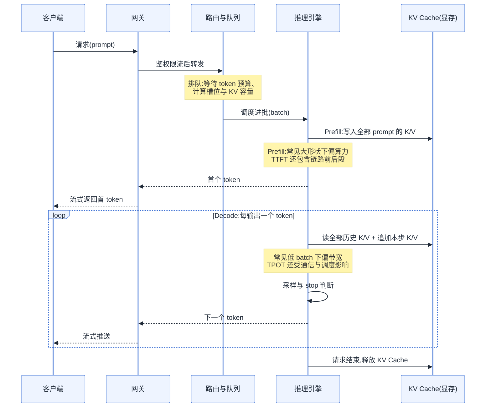
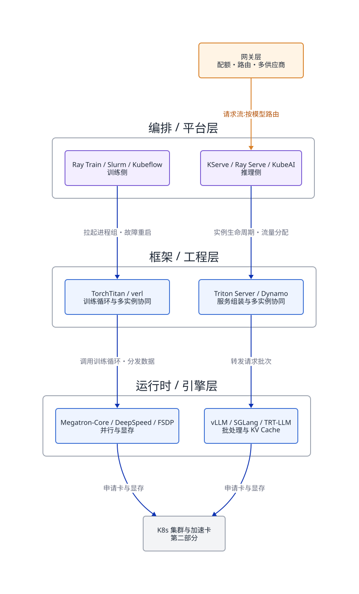
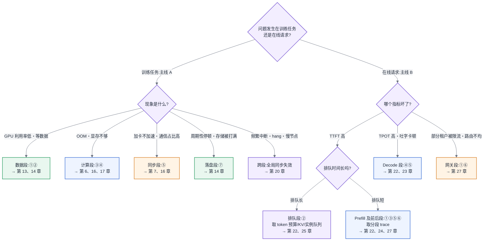

# 第 2 章 两条主线解剖与框架地图

<ChapterContext
  track="主线 A / B 的坐标系"
  question="一个问题发生在训练或推理链路的哪一段，由哪类组件负责？"
  upstream="第 1 章的显存、通信与同步约束"
  downstream="第 8–31 章的调度、训练、推理、平台与治理机制"
  inputs="作业事件、step profile、请求 trace、组件职责"
  outputs="链路定位、能力地图与下一步取证方向"
/>

## 2.1 两条主线先共享一张地图

这一章不属于两条主线中的任何一段——它定义这两条主线本身:**主线 A(一次训练任务的生命周期)与主线 B(一次推理请求的全链路)**。后续章节讨论的位置、资源和等待关系,都使用这里建立的坐标系。

## 2.2 旧平台经验为什么要重新校准

本章建立在第 1 章的一条结论之上:**AI Infra 不是大数据换个引擎**——显存墙、通信墙与长时任务的全局同步特性,使旧经验的复用必须逐条验证边界。既然旧地图失效,就需要一张新地图,本章负责把它画出来。

## 2.3 问题场景:一场谁也说服不了谁的选型会

<CaseMeta
  type="synthetic-case"
  data-nature="为展示概念混淆构造的会议记录与指标，不代表生产监控或特定组织"
  scope="内部大模型推理服务选型，同时带入一条训练侧观测"
  assumptions="8 秒、45% 与 40 分钟均为示意值；尚未取得分段 trace"
  reproducible="not-applicable"
/>

某公司要上线内部大模型推理服务,平台组开了一次选型会,会议纪要里留下了这样三条争论:

第一条,一位工程师做了"vLLM vs KServe"的对比表,列了十二项功能,结论是"KServe 功能更全,建议选 KServe"。另一位反驳:vLLM 是推理引擎,KServe 是编排平台,两者根本不在一层,"这就像拿 Spark 和 YARN 做对比,然后结论是 YARN 的算子少"。会议在这里停了四十分钟,谁也没能把"层"说清楚。

第二条,业务方抱怨线上原型"响应慢",要求"换个更快的框架"。追问之下发现三种"慢"混在一起:有的请求首字要等 8 秒(长文档场景),有的请求首字很快但吐字肉眼可见地卡顿,还有的请求在高峰期整体超时。三种现象的瓶颈分别在链路的三个不同位置,但在会上被归并成了同一个问题,解法自然也吵不出来。

第三条,训练侧同事插了一句:"我们训练任务 GPU 利用率只有 45%,是不是也该换框架?"没有人能回答,因为没有人说得清那 55% 的时间 GPU 到底在等什么——等数据?等通信?还是等一台慢节点?

这场会最终没有产出任何决议。问题不在于与会者水平不够,而在于大家没有共享同一张地图:**不知道链路上每一步在等什么,就无法定位瓶颈;不知道框架在哪一层,就无法做对比。** 本章就是那张缺失的地图。

## 2.4 原理与量化模型:两条主线与一张分层地图

优化的本质是消除等待。一条链路上的每一步,要么在做有效计算,要么在等某种资源就绪——等数据从存储到达、等激活值算完、等梯度从别的卡传过来、等一段显存被腾出来。因此,描述链路的正确精度不是"有哪些步骤",而是**每一步的主导资源是什么、它在等什么**。下面按这个精度解剖两条主线。

### 2.4.1 主线 A:一次训练任务的生命周期

先区分两层时间尺度。**外层作业生命周期**通常是:提交与准入 → 排队 → 联合放置 → 环境与进程组初始化 → 编译/权重加载 → 训练与评测 → 周期性 checkpoint → 故障检测与恢复 → 退出和制品登记。第 8、9、14、19、20、30 章分别接管这些阶段。**内层稳态 step** 才是下面的数据供给、前向、反向与更新循环;二者混成一条链,会误以为排队、初始化和 checkpoint 每步都发生。

一次训练任务由数万到数百万个 step 组成。在稳态区间,每一步大致经历以下过程:

**① 数据读取。** 从对象存储或并行文件系统读入原始样本。主导资源是**存储 IO 与网络带宽**。预取可以隐藏部分甚至大部分供给耗时;若 trace 显示计算流在等待 batch,再检查数据管道供给速率、缓存命中和 CPU 预处理(第 13 章)。

**② 预处理与组 batch。** 分词、拼接、padding 或 packing、搬运到显存。主导资源是**CPU 与 PCIe 带宽**。文本负载下它很少成为瓶颈;多模态负载下图像视频解码会把瓶颈从 IO 挪到 CPU(见第 13 章非文本数据管道)。这一步 GPU 在等 CPU。

**③ 前向计算。** 逐层计算激活值,得到 loss。主导资源是**算力与显存带宽**——不同算子归属不同(Attention 偏访存、FFN 偏算力,定量见第 6 章)。同时,激活值被保留下来供反向使用,**显存占用通常在这一段持续爬升**(原因见 [§3.1](第03章-人工智能与大模型基础.md#31-神经网络与训练三阶段))。这一步以计算为主,但仍可能受访存、kernel launch、同步和数据供给影响,不能简单视为没有等待的“纯计算”段。

**④ 反向计算。** 从 loss 反推每个参数的梯度。常用粗估中,反向算力开销约为前向的两倍。显存峰值没有统一时刻:它可能出现在前向末尾、反向早期、参数 all-gather、优化器更新或 checkpoint 暂存阶段,取决于并行策略、重计算和运行时缓冲。OOM 必须结合分配时间线归因(第 17 章),不能只盯住“反向开始”。

**⑤ 梯度同步。** 数据并行副本通过 AllReduce 等集合通信交换梯度(原语见第 7 章)。实现通常把梯度分桶,在反向计算尚未结束时就启动已就绪桶的归约,因此图中的独立阶段表示逻辑依赖,不表示它必然与反向串行。通信量通常与需要归约的梯度字节数相关;批大小、分片策略、压缩和重叠程度会改变可见耗时。最终更新前仍需满足一致性依赖,慢 rank 会把等待传给整个进程组。

**⑥ 优化器更新。** 用全局梯度更新参数与优化器状态。主导资源是**显存带宽**(要完整读写参数、梯度、优化器状态三大块,见 [§3.2](第03章-人工智能与大模型基础.md#32-优化器与超参的-infra-含义)),计算本身很轻。

**⑦ Checkpoint 写入。** 它是按策略周期性触发的外层事件,不是每个 step 的固定尾声。保存时需要把参数、优化器状态及恢复元数据持久化;同步保存可能阻塞训练,异步保存则把部分开销转移为内存暂存、后台 IO 与一致性管理(第 14 章)。

图 2-1:主线 A 的内层稳态 step。箭头表达主要依赖,实际运行中数据预取、反向与梯度同步、训练与异步 checkpoint 可以重叠;排队、初始化、恢复和退出属于外层作业生命周期。

主线 A 有三个结构性性质,后续章节反复依赖:

1. **它是循环,但内部可以形成流水。** 同一个循环重复数十万次,任何未被重叠的常数级浪费都会被步数放大。每步省 200 ms,三十万步合计节省 60,000 秒,即约 16.7 小时墙钟时间;若规模为 $N$ 张卡,相当于约 $0.694N$ 卡日。
2. **它通常包含强同步边界。** 数据并行的集合通信会把参与者绑定在同一进度上,慢 rank 或非弹性故障可能把等待传给整个进程组——这是第 20 章容错设计的出发点。弹性训练、局部重启和容错算法可以缩小影响范围,但会引入额外的状态与一致性成本。
3. **它的资源画像逐步切换。** IO → CPU → 算力 → 显存 → 网络 → 存储,轮流坐庄。所以"训练慢"这三个字没有任何诊断价值,必须落到具体的段。

把七段合起来,可以写出一步耗时的结构化账目:

> $T_{step} \approx \max(T_{数据供给}, T_{前向}+T_{反向}) + T_{同步未重叠} + T_{更新} + T_{checkpoint摊销}$

这个式子只适用于稳态区间的近似分析,且 $T_{checkpoint摊销}$ 取决于同步/异步实现、保存间隔和后台 IO 是否反压训练。数据预取可以把部分供给耗时藏进计算,梯度分桶可以让部分同步与反向重叠,异步 checkpoint 可以缩短前台停顿,但这些优化都可能引入新的内存或带宽争用。实际 step 时间与基线计算时间的差值需要用 trace 分解,不能仅凭 GPU 利用率归因。

### 2.4.2 主线 B:一次推理请求的全链路

一次推理请求从用户发出到最后一个 token 返回,经过以下环节:

**① 接入与网关。** 请求解析、tokenization、鉴权、限流、内容策略以及按模型或供应商路由。这里以 CPU 与网络为主,但 token 估算、输入长度校验和安全检查都会进入首 token 延迟(第 27 章)。

**② 路由、准入与排队。** 请求可能在等调度 token 预算、计算槽位、KV Cache 容量、优先级或租户准入,并不只是在等一块显存。高峰期排队常是 TTFT 的主要构成;并发上限由显存、算力、调度策略和 SLO 共同决定(KV Cache 见 [§3.4](第03章-人工智能与大模型基础.md#34-transformer-与注意力))。

**③ Prefill(预填充)。** 引擎处理 prompt token,生成首个输出 token 所需状态,并把 K/V 写入 KV Cache。对足够大的模型与形状,Prefill 通常更偏算力受限;短输入、小模型或低 batch 下也可能受访存与 kernel launch 支配。**TTFT** 是接入、路由、排队、调度、Prefill、首次采样和返回链路的总和,不能只归给 Prefill。

**④ Decode 循环。** 自回归模型逐 token 生成,每步读取相关权重与历史 KV 并追加本步状态。常见低 batch 场景更偏显存带宽受限,但张量并行通信、KV 访问、采样、调度和 kernel launch 也可能进入关键路径。**TPOT** 主要观察这一循环的输出间隔,需要和批次形状、并行度一起解释(第 22、23 章)。

**⑤ 采样与后处理。** 从 logits 中选出下一个 token,检查 stop 条件,做约束解码、detokenization 与输出安全处理。大词表、复杂约束或逐 token 检查都可能让这一步进入关键路径([§22.3](../第五部分-推理系统/第22章-推理引擎原理.md#223-采样与后处理阶段))。

**⑥ 流式返回。** token 经网关以 SSE 等协议推回客户端。网络拥塞、代理缓冲、客户端读取速度和背压都会改变用户观察到的间隔。

用一笔理想化带宽账可以建立 Decode 直觉:若某步确实需要从 HBM 搬运 14 GB 权重,卡的可用 HBM 带宽按 2 TB/s 计,仅权重流量的时间下界约为 $14/2000=7$ ms。它不是完整 TPOT 的物理下限:缓存命中、量化、张量并行、KV 流量、采样、调度和有效带宽都会改变结果。批处理能让一次权重读取服务多条序列,但单位 token 成本不会机械地按 batch size 等比例下降,因为 batch 也会增加激活、KV、计算与调度开销。真正的收益要在固定 SLO 和目标请求分布下压测。

Prefill 与 Decode 通常呈现不同的资源画像,却共享同一份硬件与调度器。长 prompt 的 Prefill 可能挤占 Decode 的计算时隙或批次预算,但干扰幅度取决于调度与分块策略。Continuous Batching、Chunked Prefill 和 PD 分离都在处理这种资源与时序冲突。

图 2-2:主线 B——一次推理请求的时序。TTFT 是从接入到首 token 返回的端到端指标,TPOT 主要反映 Decode 阶段的输出间隔;二者必须分开度量,再用分段 trace 归因。

指标口径需要提前写进 SLO:TTFT 是请求进入服务到首个输出 token 可见的时间,ITL(inter-token latency)是相邻输出 token 的间隔,TPOT(time per output token)通常表示生成阶段的平均每 token 时间,但不同系统可能是否排除首 token、是否包含排队和流式传输并不一致。容量评估还应同时记录端到端延迟、输入/输出 token 数、请求级吞吐和 P50/P95/P99,不能只报一个“平均 TPOT”。

回到 2.3 节的三种"慢",现在可以形成候选归因:首字等 8 秒优先检查**排队、Prefill 以及接入前后段**(长 prompt 使 Prefill 成为重要假设,但仍需 trace 证明);吐字卡顿优先检查 **Decode**(显存带宽、批次干扰、通信和调度);高峰期整体超时优先检查**队列、准入、重试与容量**(KV Cache 可能限制并发,但不是唯一原因)。三种慢对应不同取证范围和解法,任何"换个框架"式的笼统结论都不成立。

### 2.4.3 框架三层地图

有了两条主线,还需要回答"某个项目覆盖链路的哪些能力"。分层仍然有用,但项目不一定永久只占一个格子。下面把它改成**能力占位表**:先看组件承担什么职责,再判断同一部署里哪些职责互补、重叠或互斥。

| 能力 | 训练侧例子 | 推理侧例子 | 判断问题 |
|---|---|---|---|
| 单进程组 / 实例执行 | Megatron-Core、DeepSpeed、FSDP | vLLM、SGLang、TensorRT-LLM、LMDeploy | 谁管理算子、显存、并行与批处理? |
| 训练循环 / 多实例协同 | TorchTitan、LLaMA-Factory、verl、OpenRLHF | Triton Inference Server、NVIDIA Dynamo | 谁组织完整任务或分布式服务? |
| 请求路由与 KV 状态 | — | vLLM / SGLang 的内部调度、NVIDIA Dynamo 的 router / planner / cache | 谁决定请求去哪、状态放哪? |
| 任务编排与集群放置 | Ray Train、Slurm、Kubeflow | KServe、Ray Serve、KubeAI | 谁做准入、放置、拉起、恢复和弹性? |
| 租户接入与治理 | 训练门户 / API | 模型网关(第 27 章) | 谁做身份、配额、计费和供应商路由? |

(以上项目仅作能力定位示例,机制剖析见第 18、19、22、24 章,版本信息见附录 C。NVIDIA Dynamo 是跨能力项目:它包含前端、路由、规划、缓存与 worker 组件,可接入 vLLM、SGLang 或 TensorRT-LLM,并能运行在 Kubernetes 或 Slurm 等环境中,不能被固定成“工程层的一个格子”。)

为什么仍要分层?因为 KServe 可以编排运行 vLLM 的工作负载,Ray Train 拉起的进程组可以运行 Megatron-Core 或 FSDP。拿 vLLM 和 KServe直接做功能多少的比较,混淆了实例执行与集群编排;但当项目跨层时,也不能只凭名称断定互补。正确做法是先展开能力,再比较重叠职责的所有权、接口和故障语义。

网关层单独列出而不并入编排层,是因为它的服务对象不同:编排层面向"实例"(拉起、扩缩、分配流量),网关层面向"租户"(配额、计费口径、多模型与多供应商路由)。一个平台可以没有网关层(内部单租户直连),但一旦对多个业务方提供服务,配额与路由逻辑塞进编排层或业务代码里,都会在扩展时返工——这是第 27 章的主题,此处只需在地图上占好格子。

分层还给出了排障入口:请求排队要同时检查入口队列、路由、引擎调度与 KV 容量;单实例吞吐优先查执行引擎;跨实例流量倾斜再查路由与编排。它给出的是取证范围,不是未经测量就能成立的根因。

这张地图还有一个协作含义:层间接口就是职责边界。编排层负责拉起进程组与故障重启,工程层负责组织训练循环与数据分发,引擎层负责在进程组内部把卡用满——任何一项职责没有明确落在某一层,就会出现"故障发生后编排层以为工程层会重试、工程层以为编排层会重启"的职责真空,任务 hang 在原地烧卡时。三层接口契约的完整讨论在 [§19.3](../第四部分-训练系统/第19章-训练工程层与编排.md#193-三层接口契约本章核心);本章的地图是那场讨论的坐标底图。也要承认分层的例外:确有项目为了消除跨层开销故意越层(把编排逻辑下沉进引擎、或引擎自带路由),对这类项目,正确做法不是硬塞进某一格,而是标注"它同时占据哪两格、因此与哪些同层组件互斥"——地图的价值不在于消灭例外,而在于让例外变得可描述。

图 2-3:基础分层视图。它用于先拆开编排、组织与执行职责;遇到 NVIDIA Dynamo 一类跨层项目时,应以上面的能力占位表为准,逐项检查重叠与接口。
<!-- source: diagrams/sources/ch02-framework-three-layers.d2 -->

### 2.4.4 第四个横切面:可信平面

主线 A、主线 B 与能力地图回答"链路在哪一段、组件承担什么职责",但还有一组横切训练与推理全程的问题:每个动作由谁发起、被什么规则允许、处理了哪些敏感数据、留下什么证据、出了问题能否撤回。本书为便于讨论,把这组治理与安全关切统称为**可信平面**。这是本书的分析框架,不是业界统一分层标准,也不对应某个单一组件。

| 要素 | 一短语定义 | 落点 |
|---|---|---|
| Identity(身份) | 动作的发起者是谁:用户、Agent、工作负载还是服务 | 第 19、27、28 章 |
| Policy(策略) | 这个身份被允许做什么,粒度到资源与参数 | 第 28 章 |
| Confidentiality(保密) | 数据、提示词、权重与输出如何隔离和加密 | 第 13、27、28 章 |
| Secrets(凭据) | 密钥如何签发、注入、轮换与吊销 | 第 27、28 章 |
| Provenance(来历) | 数据与模型从哪来、怎么构建的可验证记录 | 第 30 章(数据侧见第 13 章) |
| Signature(签名) | 制品由谁签发、没被换过 | 第 30 章 |
| Attestation(证明) | 运行环境确实是它声称的那个环境 | 第 30 章 |
| Admission(准入) | 证据不齐的制品与任务不得上线 | 第 30 章 |
| Audit(审计) | 谁在何时做了什么,事后可查、可到人 | 第 27、31 章 |
| Revocation(撤销) | 出问题的凭据与制品能被下架,且下架能传导 | 第 30 章 |
| Safety / Privacy(安全与隐私) | 输入、输出、日志和评测如何执行内容安全与隐私边界 | 第 27、29、30 章 |

现在只需要记住:可信平面是与利用率、延迟并列的设计维度。身份、凭据、隔离与隐私要在具体链路中落地,制品来历、签名、准入和撤销在第 30 章汇合,成本项在第 31 章入账。

### 2.4.5 全书术语与符号约定

后续章节的估算公式统一使用以下记号与口径。**每个概念只在指定处定义一次**(单点定义原则),此表只做索引:

| 记号 / 术语 | 含义 | 定义处 |
|---|---|---|
| N / N_act | 模型总参数量 / 每 token 激活参数量(MoE 下两者不同) | [§3.5](第03章-人工智能与大模型基础.md#35-模型谱系)、[§6.2](第06章-模型结构的定量分析.md#62-参数量与资源换算核心) |
| B、S、L、H | batch size、序列长度、层数、隐藏维度 | [§3.1](第03章-人工智能与大模型基础.md#31-神经网络与训练三阶段)、[§6.1](第06章-模型结构的定量分析.md#61-算子与瓶颈归属先知道钱花在哪) |
| token | 吞吐、计费、限流、上下文长度的统一计量单位 | [§3.3](第03章-人工智能与大模型基础.md#33-从-nlp-到-llm) |
| KV Cache | 自回归解码的键值缓存 | [§3.4](第03章-人工智能与大模型基础.md#34-transformer-与注意力) |
| TTFT / TPOT | 首 token 延迟 / 每 token 生成间隔,主线 B 的两大 SLO 指标 | 本章、[§22.1](../第五部分-推理系统/第22章-推理引擎原理.md#221-kv-cache-与显存) |
| MFU | 模型算力利用率(区别于占用率) | 第 11 章 |
| 互联域 | 统一高带宽互联覆盖的卡集合,规模层级的关键抽象 | [§4.1.4](第04章-硬件第一性原理、架构范式与数值精度.md#414-规模层级互联域是关键抽象)、第 7 章 |
| W8A8 等精度记法 | 权重 / 激活 / KV 各自的位宽标注 | [§4.3](第04章-硬件第一性原理、架构范式与数值精度.md#43-数值格式与精度全书唯一定义处) |
| Prefill / Decode | 推理的两阶段,资源画像相反 | 本章、[§6.1](第06章-模型结构的定量分析.md#61-算子与瓶颈归属先知道钱花在哪) |
| 主线 A / 主线 B | 训练任务生命周期 / 推理请求全链路 | 本章 |

**所以这对做平台的人意味着什么:** 从此以后,你接到的每一个问题都应当先做两次定位——它在哪条主线的哪一段(决定瓶颈资源),它涉及哪一层的组件(决定排查与选型对象)。两次定位完成,问题就从"玄学"降级成了工程。

## 2.5 方案对比:三种建立技术地图的方式

建立对 AI Infra 生态的认知,业界常见三种组织方式。它们不是并列的风格差异,失效边界差别很大:

**方式一:按项目组织。** 优点是贴近实现和社区动态,适合短期交付。风险是项目边界与热度变化较快;出现多个竞品或跨层项目时,仅靠项目清单难以判断竞争、互补与迁移成本。2.3 节的 vLLM vs KServe 争论就是缺少职责维度的例子。

**方式二:按厂商生态组织。** 以某一家的技术栈为纲(如 NVIDIA 全家桶、或某云厂商的托管产品线)学习。优点是栈内自洽、文档成体系、上手最快。**失效边界:异构与迁移。** 一旦引入第二种硬件(第 12 章)或需要跨云,按厂商组织的知识几乎无法平移——你记住的是产品名与产品间的粘合方式,而不是每层要解决的问题。厂商地图适合"确定只用一家且长期不变"的团队,而这个前提在供应链现实([§4.1.3](第04章-硬件第一性原理、架构范式与数值精度.md#413-hbm显存墙的物理来源)、[§12.6](../第二部分-算力底座/第12章-国产算力平台与异构迁移.md#126-供应链与生命周期视角))下越来越难成立。

**方式三:按分层 + 主线组织(本书方案)。** 先建立层与链路的坐标系,再把具体项目当作坐标系里的可替换实现。优点是抗变化:项目换代、硬件更换,坐标系不动。**失效边界也要说清楚:** 其一,前期投入大——建坐标系比背一个项目的文档慢,如果你只需要在两周内跑通一个 demo,这套方法是杀鸡用牛刀;其二,分层是简化,现实中存在故意跨层的项目(为了性能把编排逻辑下沉进引擎),坐标系只能告诉你"它跨层了、跨层的代价是什么",不能假装它不存在;其三,坐标系不替代动手,层定位正确不等于配置正确。

**所以这对做平台的人意味着什么:** 长期平台建设可以用方式三维持稳定坐标,再用方式一跟踪实现、方式二验证栈内集成与支持边界。三者是不同时间尺度的视角,不必互相替代。

## 2.6 大数据对照:Spark job 与训练任务的结构性差异

主线 A 看起来很像一个 Spark job 的生命周期:读数据 → 计算 → shuffle(交换数据)→ 写结果。这个相似性是真实的——两者都是"数据驱动的分布式批计算"。但四个结构性差异,决定了 Spark 时代的直觉在主线 A 上大面积失效:

**差异一:DAG 调度 vs 高频稳态循环。** Spark job 由 DAG 切成 stage 和 task;同一 stage 可能因重算、迭代算法或多个 action 被再次执行,不能概括成“只执行一次”。训练更突出的特征是同一个 step 结构连续重复数十万次,因此未被重叠的毫秒级开销会稳定累积。两者都要区分一次性启动成本与稳态成本,只是训练对后者更敏感。

**差异二:分区重算 vs 进程组一致性。** Spark 可利用 lineage 重算丢失分区,shuffle 文件和 checkpoint 又能缩短恢复路径;具体影响范围取决于丢失了哪些中间数据。同步训练的集合通信要求进程组在同一步满足一致性,参与者失败通常会终止或重建进程组,再从训练 checkpoint 恢复。差异不是“一个有状态、一个无状态”,而是状态的重建单位、同步边界和恢复成本不同(第 7、14、20 章)。

**差异三:可重建状态 vs 拓扑绑定的巨型状态。** Spark executor 并非无状态:它可能持有缓存 RDD、shuffle 文件,流处理还可能维护状态存储。Spark 弹性的关键是许多状态能通过 lineage、checkpoint 或外部存储重建。训练参数与优化器状态规模更大,常按并行策略绑定到特定 rank 和拓扑;改变实例数往往要重分片、重建进程组并恢复数据位置。

**差异四:主线 B 有类比物,但状态尺度和访问模式不同。** Stateful streaming 同样处理长驻状态、背压、检查点与一致性,这些方法可以迁移;推理请求的 KV Cache 则随上下文增长、驻留在昂贵显存中,并在逐 token Decode 中高频访问。要复用的是状态预算、背压和恢复方法,不能照搬流状态的容量、时延与存储假设。

**可以复用的**包括数据管道、多租户配额、可观测性、背压、状态恢复和“先定位瓶颈再优化”的 profiling 纪律([§5.4](第05章-CUDA、CANN与加速器软件栈.md#54-profiling-方法论全书唯一定义处))。需要重新校准的是状态大小、同步粒度、硬件拓扑和恢复成本,不是把已有经验整体清零。

## 2.7 选型决策树:我的问题在哪条主线的哪一段

拿到性能或稳定性问题,先用下面的路径缩小取证范围。决策树输出的是“主线 + 候选段落 + 下一份证据”,不是未经验证的根因:

图 2-4:问题定位决策树。任何"慢"都必须先落到主线与段落,才能进入对应章节——跳过定位直接换框架,是本书自始至终反对的做法。

两条使用纪律:第一,训练侧至少取得作业事件与 step 时间线,推理侧至少拆开 TTFT、排队和 TPOT;没有证据时只能形成假设。第二,一个现象可能命中多个分支。上游会向下游传导,下游背压、共享资源争用和重试风暴也会反向抬高上游排队,因此应按时间相关性和资源证据排序,不能假定影响永远单向。

---

**读完本章,你应当能:** 区分训练作业的外层生命周期与内层 step;画出推理请求的端到端链路并拆开 TTFT 与 TPOT;把项目展开为执行、状态、路由、编排和治理能力;面对“慢”或“挂”,用图 2-4 提出候选段落和下一份要采集的证据。
