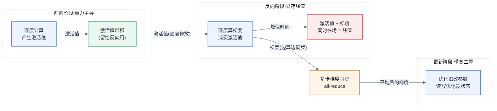
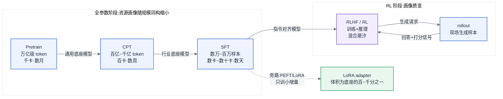
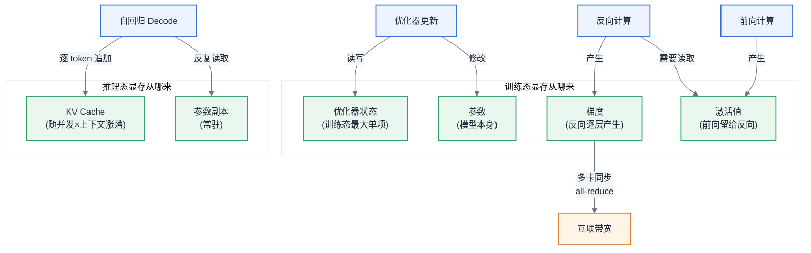
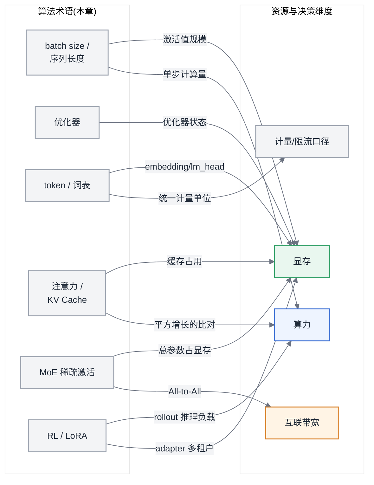

# 第 3 章 人工智能与大模型基础

> 本章不使用全书的七段骨架。每一节按固定的三段式组织:**概念的直觉 → 它消耗什么资源 → 它改变什么决策**。本章是算法概念到资源事实的转译层:读完之后,算法同事说的每一个词,你都应当能立刻对应到一笔资源开销或一个架构决策。本章只讲定性(是什么、为什么吃资源),定量计算(算多少)在第 6 章;两章同一概念视角不同,不算重复。全章不出现任何公式推导,只出现形状、量级、比例关系。

你不需要会训模型,但你需要听懂训模型的人在说什么。当算法同事说"把 batch size 提到 4096"时,他在谈收敛;而你听到的应该是:显存峰值要变、梯度累积步数要变、一步的通信节奏要变。这个"同一句话、两种听法"的能力,就是本章要交付的东西。

## 3.1 神经网络与训练三阶段

### 概念的直觉

一个神经网络由**层(layer)** 堆叠而成。每一层做的事情可以粗暴地概括为:输入一批数字,乘上一堆可调节的数字,输出另一批数字。那些"可调节的数字"叫**参数(parameter)**——它们是模型本身,训练结束后保存下来的就是它们。每层计算过程中产生的中间输出叫**激活值(activation)**——它们不是模型的一部分,是数据流经模型时留下的"脚印"。

这三个词分别对应显存里的三块地盘:**参数**是常驻的,模型加载进来就在那里;**激活值**是随批数据潮汐涨落的,一批数据进来它涨,这批处理完它落;还有一块此刻尚未出场的**梯度与优化器状态**,下文和 [§3.2](#32-优化器与超参的-infra-含义) 会讲它们从哪来。记住这个对应关系,后面所有关于"显存为什么不够"的讨论都建立在它之上。

训练的一步(step)分三个阶段:

1. **前向(forward)**:数据从第一层流到最后一层,算出模型的预测,再与正确答案比较得到"错了多少"(损失,loss)。
2. **反向(backward)**:从最后一层往回走,逐层计算"每个参数该往哪个方向调、调多少"——这个量叫**梯度(gradient)**。梯度的形状与参数完全相同:参数有多少个数,梯度就有多少个数。
3. **更新(update)**:优化器拿着梯度,真正修改参数。

反向传播有一个决定性的工程事实:**回头逐层算梯度时,需要用到前向时该层的输入**。这意味着前向阶段的激活值不能算完就丢,必须留着等反向用——一层的激活值要从前向经过它那一刻起,一直保留到反向回到它那一刻。层数越深、批越大、序列越长,这堆"等着被回头用"的激活值就越多。**这就是激活值显存的来源,也是激活重计算(recomputation)能省显存的原因**:既然激活值是算出来的,那就可以先丢掉、反向需要时重算一遍——用算力换显存。这笔交换的定量账在第 17 章算。

梯度的产生与同步时刻也要说死:梯度在**反向阶段逐层产生**——最后一层的梯度最先出来,第一层的最后出来。在多卡数据并行下,每张卡拿不同的数据算出不同的梯度,必须**在更新之前对齐求平均**,这就是梯度同步(all-reduce,机制见第 7 章)。工程上它不会傻等反向全部结束才开始,而是哪层的梯度先出来就先传哪层,通信与反向计算重叠——这是训练通信优化的第一原理,后面第 16、17 章反复用到。

最后一条直觉留给数值稳定性:梯度经过几十层连乘式的传播,数值很容易越走越小或越走越大。低精度格式的表示范围窄,小到一定程度直接归零、大到一定程度直接溢出,训练就"炸"了。这就是为什么低精度训练不是简单把格式一换,而要有一整套保护机制——展开在 [§4.3](第04章-硬件第一性原理、架构范式与数值精度.md#43-数值格式与精度全书唯一定义处)。

图 3-1:训练三阶段资源画像。这张图要你记住一件事:显存峰值出现在反向阶段——激活值尚未放完、梯度已经堆起来,两者同时在场。

### 它消耗什么资源 / 它改变什么决策

**资源**:参数、梯度、激活值各占一块显存;激活值随 batch、序列长度、层数线性堆积,且峰值在反向阶段;梯度同步在反向阶段边算边发,吃互联带宽。**决策**:OOM(显存溢出)排查的第一问是"炸在前向还是反向"——炸在反向,先怀疑激活值,解法是重计算或减小 batch,而不是急着换更大的卡;通信优化的方向是"藏在反向计算后面",而不是"让通信本身更快"——这决定了第 7、17 章一整套技术的取舍顺序。

## 3.2 优化器与超参的 Infra 含义

### 概念的直觉

更新阶段那个"拿梯度改参数"的模块叫**优化器(optimizer)**。最朴素的优化器拿到梯度直接改参数,不需要记任何东西。但现代大模型训练的主流优化器(Adam 系)要"记仇":它为**每个参数**额外维护两份历史统计量,用来平滑更新方向。这两份统计量叫**优化器状态(optimizer state)**,形状与参数相同,而且通常以高精度保存。

于是出现了一个反直觉的量级事实:**训练时,优化器状态占的显存比模型本身还大**。粗略的比例感是:若参数以半精度存放算一份,梯度是一份,优化器状态(两份统计量加一份高精度参数副本)合计约四份——训练态显存是"参数本身"的数倍,大头不是模型,是伺候模型的状态。这就是为什么"这张卡装得下模型"和"这张卡训得动模型"是两个相差好几倍的问题。它也回答了一个后面章节的悬念:**ZeRO 分片(第 17 章)切的到底是什么**——切的主要就是这份最肥的优化器状态,其次才是梯度和参数。

第二件事是划清超参(hyperparameter)的协作边界。超参分三类,分界标准只有一个:**它动的是资源还是收敛**。

- **影响资源的:batch size、序列长度、梯度累积步数。** batch 和序列长度直接决定激活值显存与单步计算量;梯度累积是"分几小口吃完一大批、攒够了再同步更新"的技巧,它用时间换显存、并把梯度同步的频率摊薄。这三个旋钮每动一下,显存峰值、单步时长、通信节奏都会变——**你必须有发言权**,算法同事单方面改了这三个数而平台不知情,是训练任务半夜挂掉的经典原因。
- **影响收敛的:学习率、warmup、调度策略。** 它们决定训练"走多快、先慢后快还是先快后慢",不改变任何资源占用——**不归你管**,平台方对这三个数发表意见是越界。
- **两者都影响的:并行配置。** 张量并行度、流水线并行度、数据并行度(第 16 章)既改变每卡显存与通信模式,也通过等效 batch 影响收敛——**必须共同决策**,任何一方单独定都会踩坑。

这个三分法不是知识点,是协作契约:出现分歧时,先问"这个旋钮动的是资源还是收敛",归属立刻清楚。越界的代价是具体的——平台替算法定学习率,训练不收敛的锅说不清;算法绕过平台改 batch,集群容量规划全部作废。

### 它消耗什么资源 / 它改变什么决策

**资源**:优化器状态是训练态显存的最大单项,量级上可以数倍于参数本身;梯度累积以更长的单步时间换更低的显存峰值和更疏的同步频率。**决策**:容量规划必须按"训练态总显存"而非"模型大小"估算,两者差几倍(精算见 [§6.2](第06章-模型结构的定量分析.md#62-参数量与资源换算核心));与算法团队的超参分工按三分法立契约——影响资源的必须过平台,影响收敛的平台不碰,并行配置双方会签。这条边界删掉,读者会在真实项目里踩到"谁改的配置、谁背的锅"的职责真空。

## 3.3 从 NLP 到 LLM

### 概念的直觉

大语言模型(LLM)的训练任务本质一句话讲完:**给定前文,预测下一个 token**。做对这件事做到极致,就是你看到的一切能力。本书不展开这为什么有效,也不讲从词袋到 Transformer 的历史——那是推荐读物([§3.8](#38-推荐读物))的事。

**token** 是文本被切分后的基本单元,由分词器(tokenizer)决定,通常介于字符和单词之间。一个粗糙但够用的量级感:英文一个 token 约对应四分之三个单词,中文一个 token 约对应一到两个汉字。对 Infra 而言,token 的重要性与算法无关,而在于**它是全链路的统一计量单位**:吞吐按每秒 token 数衡量,计费按百万 token 报价,限流按每分钟 token 数配额,上下文长度按 token 数标称,训练数据规模按万亿(T)token 计。**全书凡是涉及"量",默认口径都是 token,在此处定义,不再重复。** 平台方最容易踩的口径坑:同一段文本,不同分词器切出的 token 数可以差百分之几十——跨模型对比吞吐、核对账单、设定限流时,先问一句"哪个分词器口径",能避免大量无意义争论。

**词向量与嵌入(embedding)** 只需要一个直觉:它是一张大表。词表(vocabulary)里每个 token 占一行,每行是一串数字。词表大小乘以模型隐层宽度,就是这张表的规模。模型的入口(embedding)和出口(lm_head,预测下一个 token 的打分层)各有这么一张表,有的模型两张共享。词表越大,这两张表越肥:对几十 B 以上的模型它们占比不大,但对小模型,词表相关参数可以占到总参数的两三成——同样标称 2B 的两个模型,词表一个 5 万一个 25 万,"身体"(真正干活的层)的大小差别可观。词表还有一个训练侧影响:出口打分层要对全词表逐一打分,是单层计算和显存的大户,大词表模型训练时常要对它做专门的并行切分(词表并行,第 16 章)。

### 它消耗什么资源 / 它改变什么决策

**资源**:embedding 与 lm_head 两张大表占显存,词表大小与隐层宽度的乘积决定其规模;lm_head 是训练时的单点显存与计算大户。**决策**:平台的计量、计费、限流、容量四套体系统一以 token 为单位建设,且必须标注分词器口径;评估小模型时把词表参数从总参数里剥出来再比较;接入一个新模型前,词表大小是值得先看一眼的数字——它预告了 embedding 显存和限流口径的换算差异。

## 3.4 Transformer 与注意力

### 概念的直觉

Transformer 是当前几乎所有大模型的骨架。它的每一层由两部分组成:**注意力(attention)** 负责让 token 之间互相看见,**前馈网络(FFN)** 负责对每个 token 独立做变换。FFN 是规整的大矩阵乘法,计算密集、行为可预测,是硬件厂商最喜欢的负载;注意力则是一切麻烦的来源,值得多花笔墨。

注意力只讲形状,不讲推导。每个 token 会生成三个向量:**Q(query,我在找什么)、K(key,我是什么)、V(value,我携带什么内容)**。计算过程是:每个 token 拿自己的 Q 与序列里所有 token 的 K 比对,得到一组权重,再按权重把所有 token 的 V 加权汇总。这个"每个 token 都要看所有 token"的全连接结构,直接给出本节最重要的比例关系:**序列长度翻倍,注意力的比对次数变为四倍**——它随序列长度平方增长,而模型其余部分只随序列长度线性增长。这就是长上下文问题的根源:序列短时注意力在总开销里毫不起眼,序列拉到几万、几十万 token 时它逐渐成为主导,长上下文的一切专门技术(第 17、22 章)都是在对抗这条平方曲线。**多头(multi-head)** 只是把这套比对在多个子空间里并行做几十份,每份叫一个 head——对 Infra 而言,head 数就是这堆张量形状里的一个维度,后面讲 KV Cache 大小和张量并行切分时会反复见到它。

> 延伸阅图:Vaswani et al., 《Attention Is All You Need》(arXiv:1706.03762,https://arxiv.org/abs/1706.03762)图 1、图 2 —— 图 1 是 Transformer 整体架构图(注意力层与 FFN 层如何堆叠成 encoder/decoder),图 2 展示 Scaled Dot-Product Attention 与多头注意力的张量流,对照本段的 Q/K/V 直觉与"多头只是并行几十份"最直观。

接下来是**全书出现频率最高的概念:KV Cache**,它的来历必须在这里讲清。LLM 生成文本是**自回归(autoregressive)** 的:生成第 N 个 token 时,要以前面全部 N-1 个 token 为条件;生成下一个时,条件又多了一个。注意生成第 N 个 token 需要的是前文所有 token 的 K 和 V——而前文没有变,这些 K、V 和上一步算的一模一样。**不缓存会怎样**:每生成一个 token 都要把前文所有 token 的 K、V 从头重算一遍,生成一段回复的总计算量随长度平方爆炸,长回复完全不可用。**缓存之后**:把已算出的 K、V 存在显存里,每步只为最新的一个 token 算增量。这份缓存就是 KV Cache。

代价是把计算问题换成了显存问题:KV Cache 随"并发请求数 × 每请求上下文长度"线性增长,与每层的 head 数和 head 宽度成比例,而且**它活在显存里、随请求潮汐涨落**——推理服务显存里除了固定的模型权重,剩下的活动地盘几乎全被它占据。第 22 章的 PagedAttention、第 24 章的 PD 分离,本质都是围绕这份缓存的管理问题。这也顺带解释了推理为什么天然分两个阶段:**Prefill**(把用户输入一次性算完、灌满 KV Cache,计算密集)与 **Decode**(逐 token 生成、反复读取 KV Cache,带宽密集)——两阶段资源画像截然不同,是主线 B(第 2 章)上所有推理优化的出发点。

结构谱系交代现状即可:Encoder-only(双向理解,如检索嵌入模型)、Encoder-Decoder(翻译时代的主流)、**Decoder-only(自回归生成,当前 LLM 几乎唯一的选择)**。资源差异一句话:只有自回归的 Decoder 需要 KV Cache;Encoder 类模型一次前向出结果,没有逐 token 循环,推理画像更接近传统批处理。你的推理平台大概率同时养着这两类负载(生成模型与嵌入模型),它们该用不同的调度与容量策略。

### 它消耗什么资源 / 它改变什么决策

**资源**:注意力计算随序列长度平方增长,是长上下文的算力与激活值大户;KV Cache 随并发与上下文长度线性吃显存,是推理服务显存中除权重外的最大活动项。**决策**:推理容量规划的核心变量不是"模型多大",而是"KV Cache 给多大"——它决定最大并发与最长上下文的乘积上限;Prefill 与 Decode 的资源画像差异决定了它们值得分开调度乃至分开部署(第 24 章);业务方要求"支持 128K 上下文"时,你应当立刻想到平方增长的注意力开销和线性膨胀的 KV Cache 两笔账,而不是只改一个配置项。

## 3.5 模型谱系

### 概念的直觉

**Dense 与 MoE** 是当前模型谱系的第一道分岔。Dense(稠密)模型每处理一个 token,全部参数都参与计算。MoE(Mixture of Experts,专家混合)把每层的 FFN 复制成几十上百个"专家",另设一个小路由器,每个 token 只被送往其中少数几个专家——这就是**稀疏激活**的直觉:模型很大,但每个 token 只唤醒其中一小块。

由此得出一条必须刻进脑子的纪律:**MoE 的总参数与激活参数必须分开看,混用这两个数是资源估算里最常见的重大事故**。总参数决定**显存与加载**:所有专家不管用不用都得在显存里待命——权重显存、模型加载时间、checkpoint 体积都按总参数算。激活参数决定**单 token 算力**:每个 token 的计算量只按被唤醒的那部分算。一个总参数 数百B、激活 数十B 的 MoE,显存开销像大模型,单 token 算力开销像小模型——它用"占地方"换"跑得快"。MoE 还带来一种新通信:token 要被物理发送到专家所在的卡上再取回(All-to-All,第 7 章),这类通信对跨机带宽极其敏感,是 [§4.1.3](第04章-硬件第一性原理、架构范式与数值精度.md#413-规模层级互联域是关键抽象) 超节点层级重要的受益者。定量画像见 [§6.2](第06章-模型结构的定量分析.md#62-参数量与资源换算核心)。

**多模态模型**的主流构成是三段式:**encoder(把图像/音频压成一串 token)→ projector(把这串 token 翻译到语言模型的表示空间,通常很小)→ LLM decoder(照常干活)**。对 Infra 的关键含义是:多模态的大头开销不在"多了个视觉模块",而在**token 膨胀**——一张高分辨率图片编码后可能相当于几百上千个文本 token,直接放大 Prefill 计算和 KV Cache;encoder 与 LLM 两段的算力画像不同,值得分开部署(第 24 章)。定量的膨胀系数在 [§6.4](第06章-模型结构的定量分析.md#64-多模态的定量画像)。

最后建立**规模量级感**。以参数量计:1B 以下是端侧与嵌入模型的地盘;几 B 到十几 B 单卡可推理,是应用侧的主力工作马;几十 B 起步就要多卡协同;几百 B 到万亿级(几乎全是 MoE)则是"集群级模型",从加载、推理到升级,每个动作都是集群工程。这把尺子不精确,但足够你听到一个参数量时立刻反应出"这是单卡的事、单机的事,还是集群的事"。

### 它消耗什么资源 / 它改变什么决策

**资源**:MoE 按总参数吃显存与存储、按激活参数吃单 token 算力,并新增对跨机带宽敏感的 All-to-All 通信;多模态按 token 膨胀系数放大 Prefill 与 KV Cache。**决策**:凡涉及 MoE 的容量评估,先问清"总参数还是激活参数",两个数字用错方案全错;MoE 的部署方案要优先考虑互联域([§4.1.3](第04章-硬件第一性原理、架构范式与数值精度.md#413-规模层级互联域是关键抽象));多模态服务的容量按"膨胀后的等效 token"而非请求数估算,encoder 是否独立部署是一个真实的架构分岔。

## 3.6 训练范式全景

### 概念的直觉

一个模型从无到可用,典型经历四个阶段,各阶段解决的问题和数据量级差异巨大:

- **Pretrain(预训练)**:从随机参数开始学会语言与世界知识。数据量级:**万亿(T)级 token**。千卡 × 数周到数月的连续作战,是"AI Infra"一词在训练侧的原始含义:算力、通信、checkpoint、故障恢复全部拉满。
- **CPT(继续预训练)**:在通用模型上灌行业语料(法律、医疗、代码)。数据量级:**百亿到千亿 token**,比 Pretrain 低一到两个数量级,资源画像与 Pretrain 同构,只是规模缩小。
- **SFT(监督微调)**:用"指令—回答"对教会模型按人的意图办事。数据量级:**几万到几百万条样本**——再降数个数量级。几张到几十张卡、几小时到几天,资源画像温和规整。
- **RLHF / RL(强化学习对齐)**:让模型的输出更符合人类偏好或在可验证任务上自我提升。数据量级与 SFT 同级,但**资源画像发生质变**:训练循环里嵌入了"让模型现场生成回答再打分"的环节(rollout),也就是说,**RL 训练集群必须同时跑得动推理引擎**,训练与推理两种负载在同一个任务里交替潮汐。这是近年训练基础设施最大的结构性变化,展开在第 21 章;它也是 [§4.2.2](第04章-硬件第一性原理、架构范式与数值精度.md#422-训练型与推理型负载的硬件诉求差异) 拒绝"训练卡/推理卡"二分法的核心论据之一。

数据量级逐段下降,单位数据的系统复杂度却逐段上升——Pretrain 难在规模,RL 难在异构编排。

图 3-2:训练范式全景。这张图要你记住一件事:数据量级逐段下降数个数量级,而 RL 阶段的资源画像发生质变——训练集群从此必须跑得动推理。

**PEFT 与 LoRA** 是叠加在 SFT 之上的省钱路线。PEFT(参数高效微调)的直觉:改变模型行为不需要动全部参数。LoRA 是其中最主流的一种:冻结底座模型,只在若干层旁边挂一对很小的低秩矩阵(adapter),训练时只更新它们。资源上的收益是立竿见影的:可训练参数降到原来的百分之一以下,[§3.2](#32-优化器与超参的-infra-含义) 那份最肥的优化器状态也只需要为这一小撮参数维护,训练显存大幅下降,几十 B 的模型单机就能微调。

> 延伸阅图:Hu et al., 《LoRA: Low-Rank Adaptation of Large Language Models》(arXiv:2106.09685,https://arxiv.org/abs/2106.09685)图 1 —— 冻结的预训练权重 W 旁并联一对低秩矩阵 A、B,只训练这对小矩阵,正是本段"旁边挂一对低秩 adapter"的原图。

但 LoRA 真正改变格局的是**部署侧**:adapter 只有几十到几百 MB,而且数学上可以在推理时按需"贴"到底座上。于是**一个底座模型 + N 个 adapter 热切换**成为可能——一百个租户的定制模型,不再是一百份全量权重副本,而是一份底座加一百个小文件。这是推理平台多租户架构(第 25 章)的地基,也是"要不要给每个业务方单独部署一个模型"这个昂贵问题的第一个否定答案。

### 它消耗什么资源 / 它改变什么决策

**资源**:四阶段数据量级从万亿 token 逐段跌到百万样本;Pretrain/CPT 吃满算力与互联,SFT 温和,RL 额外吃推理算力且负载潮汐化;LoRA 把微调的优化器状态与梯度显存压缩到百分之一以下,把定制模型的交付物从全量权重变成百 MB 级 adapter。**决策**:集群规划必须先问"训练需求停在哪个阶段"——只做 SFT/LoRA 的团队按 Pretrain 规格建集群是最常见的过度建设;要支撑 RL 就必须按"训推混合"设计集群与调度(第 21 章);多租户定制需求出现时,先评估 LoRA 多租户,再考虑多副本部署。

## 3.7 评测与 Benchmark 的基本概念

### 概念的直觉

"评测"一个词在 AI 语境里指两套完全不同的东西,**这个区分是全书唯一定义处,后面第 12、23、29、30 章反复引用**:

- **精度评测(accuracy evaluation)**:衡量模型答得**对不对**。对象是模型能力,单位是分数与通过率,工具是评测集,负责人是算法团队。
- **性能评测(performance benchmark)**:衡量系统跑得**快不快、省不省**。对象是软硬件栈,单位是吞吐、延迟、利用率、成本,工具是压测框架,负责人是平台团队。

两套体系的指标、工具、基础设施、责任人全部不同,混用必出事故——"这个模型 benchmark 很好"这句话在两个团队耳朵里是两个意思。精度评测集只需要类型感,不需要记榜单:知识与推理类、代码与数学类(答案可自动验证,因此也是 RL 的重要数据来源)、指令遵循与安全类、以及面向具体业务的自建评测集——最后一类对平台最重要,因为前三类分数再高,都替代不了业务验收。

Infra 侧为什么必须关心精度评测?因为**平台做的三类核心动作——量化压缩(第 23 章)、跨硬件迁移(第 12 章)、性能优化(第 22 章)——都可能改变模型输出**。降精度会改变数值结果,换硬件会改变算子实现,某些优化会改变计算顺序。判断"变了多少、能不能接受"的唯一标准就是精度评测。所以精度评测同时是三件事:模型上线的**卡点**(不过评测不上线)、平台动作的**验收标准**(量化前后分数对比)、以及故障排查的**基线**(迁移后分数掉了,是谁的责任)。协作边界照 [§3.2](#32-优化器与超参的-infra-含义) 的方式说死:**评测集与卡点标准归算法,评测流水线与执行环境归平台**(工具链在第 29 章);边界越过去的后果是——平台自定卡点没人认账,算法自建流水线则评测环境与生产环境不一致,评测通过的模型上线就翻车。

### 它消耗什么资源 / 它改变什么决策

**资源**:精度评测本身是一类真实的推理负载——回归评测一次要跑成千上万条样本,量化、迁移、升级都要触发,评测算力必须计入平台容量而不是"顺便蹭一下"。**决策**:平台的每一个可能改变模型输出的动作,都必须以"精度评测分数不变或劣化在约定范围内"为验收条件,这条纪律是第 12、23、30 章所有方案的前提;评测流水线要与 CI 打通、环境与生产对齐(第 29 章),否则评测结论没有效力。

## 3.8 推荐读物

本书对算法内容的态度是有意为之的克制:不推导、不讲史、不调参。想越过本章边界的读者,按需求分流:

- **想看数学推导**:任何一本现代深度学习教科书都覆盖反向传播与 Transformer 的完整推导;配合原始论文(Attention Is All You Need 及其后续)食用。
- **想了解模型演进史与前沿动态**:各大模型的技术报告(technical report)是一手材料,比二手解读可靠;它们通常也附带训练基础设施章节,与本书互为印证。
- **想学调参与训练实践**:开源社区的训练手册与复现报告(如各开源模型的训练日志)比教程更贴近真实决策。
- **想深入 RL 对齐**:RLHF 与后续 RL 方法的综述论文,配合第 21 章的基础设施视角阅读。

本书后续章节假定你已消化本章:第 6 章把本章每个"为什么吃资源"变成"吃多少"的公式;第 16、17 章展开并行与显存优化;第 22–24 章围绕 KV Cache 展开推理系统;第 21 章展开 RL 基础设施。

## 全章总结:术语到资源的映射

把本章所有术语放到一张图上收口。读者应能遮住右侧,仅凭左侧任何一个词,复述出它连向哪几种资源。

图 3-3:显存构成来源图。这张图要你记住一件事:训练态显存四分(参数、梯度、优化器状态、激活值),推理态显存两分(参数、KV Cache)——两张清单,就是第 6 章全部定量计算的科目表。

图 3-4:术语到资源的映射图。这张图要你记住一件事:本章每一个算法术语都至少连向一种资源——听到术语却说不出它连向哪里,就回到对应小节重读。

---

**读完本章,你应当能**:在与算法同事的对话中准确理解 batch size、优化器状态、token、KV Cache、MoE、LoRA、RL 这些词各自对应哪一笔资源开销;能按超参三分法当场判断一个配置变更该谁拍板;能在听到"支持 128K 上下文""换成 MoE""上 RL"这类算法侧决策时,立刻说出它会改变基础设施方案的哪一部分——以及,能判断哪些算法侧决策根本不需要平台改方案。
