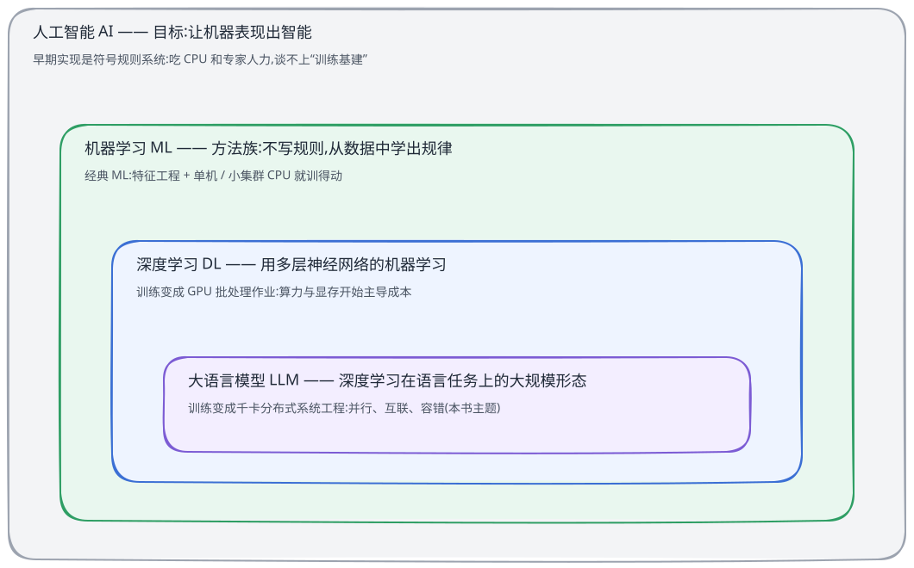
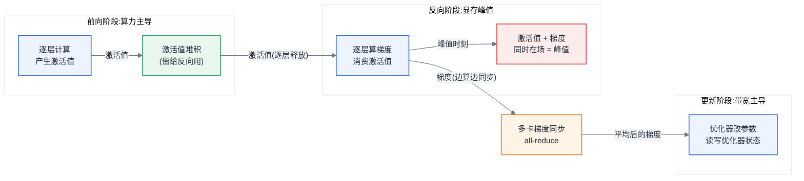
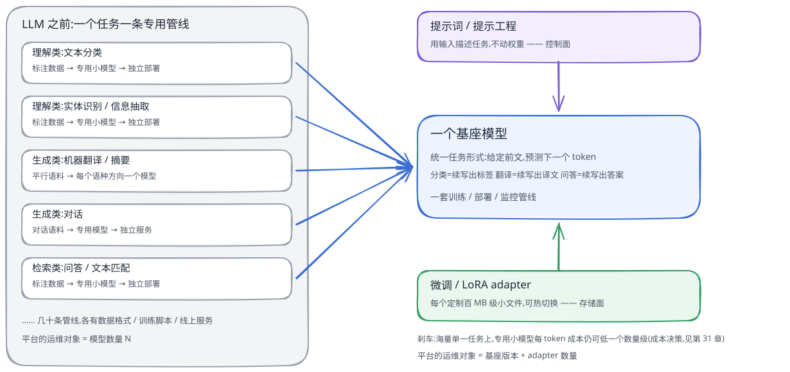
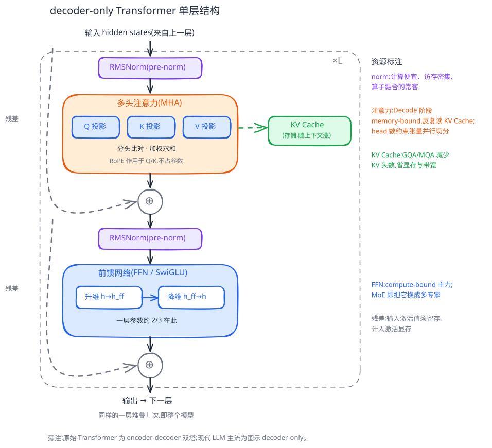
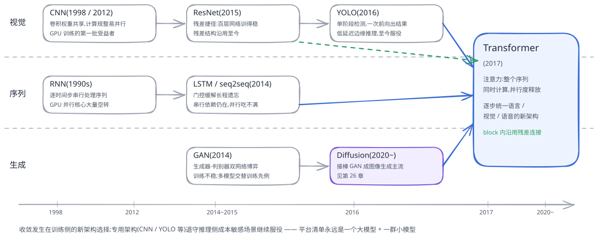
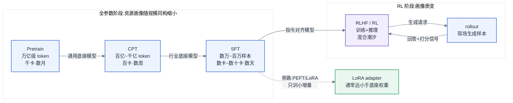
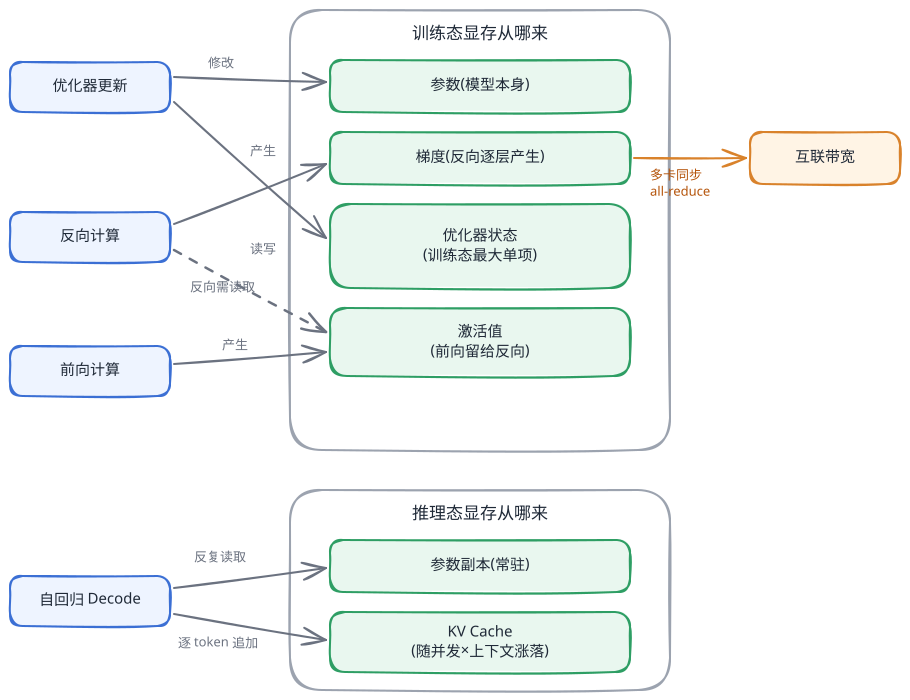
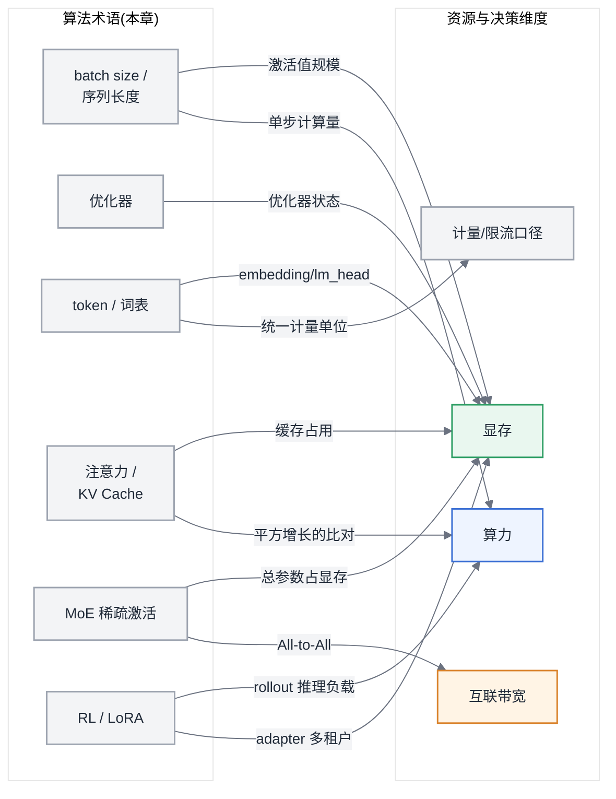

# 第 3 章 人工智能与大模型基础

> 本章不使用全书的七段骨架。每一节按固定的三段式组织:**概念的直觉 → 它消耗什么资源 → 它改变什么决策**。本章是算法概念到资源事实的转译层:读完之后,算法同事说的每一个词,你都应当能立刻对应到一笔资源开销或一个架构决策。本章只讲定性(是什么、为什么吃资源),定量计算(算多少)在第 6 章;两章同一概念视角不同,不算重复。全章不出现任何公式推导,只出现形状、量级、比例关系。

你不需要会训模型,但你需要听懂训模型的人在说什么。当算法同事说"把 batch size 提到 4096"时,他在谈收敛;而你听到的应该是:显存峰值要变、梯度累积步数要变、一步的通信节奏要变。这个"同一句话、两种听法"的能力,就是本章要交付的东西。

## 3.0 概念定位与发展脉络

在钻进神经网络的细节之前,先花五分钟把几个天天被混用的大词钉在各自的位置上,并回答一个更根本的问题:AI 的历史那么长,本书为什么只为深度学习和 LLM 修基建。

### 3.0.1 概念的直觉

**人工智能(AI)、机器学习(ML)、深度学习(DL)、大语言模型(LLM)是四个嵌套的概念,不是四个并列的东西。** 关系一句话:AI 是目标,ML 是实现这个目标的一个方法族,DL 是 ML 中的一个分支,LLM 是 DL 在语言任务上的大规模形态。每一层给一句直觉、配一句资源含义:

- **人工智能**:让机器表现出智能,这是一个目标,不规定用什么办法。早期的主流办法是人手写规则的符号系统——它消耗的是 CPU 和专家人力,谈不上"训练基建"。
- **机器学习**:不再手写规则,让程序从数据中自己学出规律。经典 ML(决策树、SVM、梯度提升这一族)的资源画像温和:特征工程加单机或小集群 CPU 就训得动,一个像样的大数据平台完全兜得住。
- **深度学习**:用多层神经网络做机器学习,特征也交给网络自己学。代价是把训练变成了 GPU 上的大规模批处理作业——算力、显存、数据吞吐从此开始主导成本。
- **LLM**:深度学习在"预测下一个 token"这个任务上堆到极致的产物。它把训练进一步变成千卡级分布式系统工程:单卡装不下模型,并行、互联、容错升格为一等问题。

注意最后一环的连接是"→"而不是"⊃":LLM 不是深度学习的又一个子领域,而是它在一条任务线上的规模化延伸——同样的神经网络、同样的训练三阶段,只是被放大到系统工程的尺度。这也是本章可以从 [§3.1](#31-神经网络与训练三阶段) 的神经网络一路讲到 LLM 而不需要中途更换概念体系的原因。

图 3-0:AI ⊃ ML ⊃ DL → LLM 的概念嵌套。这张图要你记住一件事:每往里走一层,概念范围收窄一圈,资源需求的形态却升一个量级——本书只为最内两层修基建,原因就写在每层的第二行字里。
<!-- source: diagrams/sources/ch03-ai-ml-dl-llm.excalidraw -->

把这个嵌套沿时间轴展开,就是 AI 的发展历程。本书不讲算法思想史(那是[附录 F](../附录/附录F-算法深入读物推荐.md) 推荐读物的事),这里只从基建视角回答一个问题:**每个拐点改变了什么资源需求形态。** 四段讲完:

1. **符号主义时代(1950s–1980s)**:智能被实现为逻辑推理和专家规则库,"计算"就是普通程序运行,没有训练这回事,自然也没有训练基建。期间两次"AI 寒冬"(1970s、1980s 末)冻结的是经费与预期,不是基础设施——因为当时根本没有专属基础设施可冻。
2. **统计学习时代(1990s–2010s 初)**:机器学习成为主流,资源需求形态是"特征工程 + CPU 训练"。这正是大数据平台的黄金年代:Hadoop/Spark 那套面向 CPU 与磁盘吞吐的体系,恰好就是这一代 AI 的基建(两者的资产与坏账清单见第 1 章)。
3. **深度学习时代(2012 年 AlexNet 起)**:GPU 从图形卡变成训练标配,第一个专属于 AI 的基建问题出现了——喂饱加速器。部分研究口径显示,头部模型的训练算力需求在一段时期内约按每年数倍增长,远超硬件供给的增速;具体统计口径和时间窗口应以第 1 章引用的 Epoch AI 数据为准。
4. **大模型时代(约 2018–2020 年后加速)**:GPT-3 代表了规模化拐点,但大模型基础设施并非从 GPT-3 才开始。模型逐步大到单卡装不下,训练从"多买几张卡"变成"设计大规模协同的分布式系统",并行策略、互联拓扑、故障容错成为一等问题。这也是 foundation model 与 AI Infra 作为独立工程议题快速成形的阶段。

**经典机器学习算法一览**

第二段"统计学习时代"值得多停一步,因为那一代算法今天并没有退休。平台方不需要懂它们的数学,但要认得名字、知道各自跑在什么资源上:

- **线性模型(线性回归、逻辑回归)**:用一组权重加权求和打分。可解释性强、训练秒级完成,CPU 单机即可;至今仍是金融风控评分、点击率基线这类"要能向监管和业务解释"场景的主力。
- **决策树与集成方法(随机森林、GBDT/XGBoost 一族)**:一棵树做一串 if-else 判断,一群树投票。它们是**表格数据之王**——在结构化数据上至今常胜过深度学习;训练在单机或小集群 CPU 上完成,与 Spark MLlib 这类大数据组件天然衔接。
- **SVM**:核方法的代表,小数据时代的明星;在超大规模训练中通常不如线性模型或树模型经济,但在中小规模、高维或数据量有限的任务中仍有使用价值。
- **朴素贝叶斯与 KNN**:一个按概率打分、一个按邻居投票,实现简单,是快速拉基线的轻量工具。
- **无监督类(K-means 聚类、PCA 降维)**:不需要标注,用于探索数据分布、压缩特征维度;它们还活在一个容易被忽略的地方——向量检索的量化与降维环节(见第 15 章)。

这一族算法的常见资源画像是:**通常不需要 GPU 集群**。参数规模、数据规模和算法实现差异很大,也存在 GPU 加速的树模型与大规模线性模型;常见瓶颈仍更多落在特征工程、数据读取和 CPU 资源上。推荐、排序、风控这些业务今天仍大量跑在这套栈上,短期也不会迁走。由此得出一条平台纪律:真实 AI 平台的负载画像永远是"经典 ML + 深度学习 + LLM"的三层混合,为 LLM 修的 GPU 集群不该逼着 GBDT 任务也去排 GPU 配额——CPU 与 GPU 负载分池分队列(见第 9 章),否则利用率的账根本算不清(见第 11 章)。

### 3.0.2 它消耗什么资源 / 它改变什么决策

**资源**:四层嵌套对应四种资源形态——人力与 CPU、单机 CPU、GPU 批处理、千卡分布式系统;每过一个时代拐点,变的不是"需要更多资源",而是"需要另一种形态的资源"。**决策**:第一,划清本书边界——你的平台若只服务经典 ML 负载,大数据体系够用,不需要本书这套方案,盲目按 LLM 规格建 GPU 集群是最贵的误读;第二,听懂立场——算法同事说"上深度学习""上大模型"时,你听到的应该是资源形态的切换而非用量的放大,前者要求重建方案,后者只要求扩容,把两者混为一谈是基建规划的第一号错误。

## 3.1 神经网络与训练三阶段

### 3.1.1 概念的直觉

一个神经网络由**层(layer)** 堆叠而成。每一层做的事情可以粗暴地概括为:输入一批数字,乘上一堆可调节的数字,输出另一批数字。那些"可调节的数字"叫**参数(parameter)**——它们是模型本身,训练结束后保存下来的就是它们。每层计算过程中产生的中间输出叫**激活值(activation)**——它们不是模型的一部分,是数据流经模型时留下的"脚印"。

这三个词分别对应显存里的三块地盘:**参数**是常驻的,模型加载进来就在那里;**激活值**是随批数据潮汐涨落的,一批数据进来它涨,这批处理完它落;还有一块此刻尚未出场的**梯度与优化器状态**,下文和 [§3.2](#32-优化器与超参的-infra-含义) 会讲它们从哪来。记住这个对应关系,后面所有关于"显存为什么不够"的讨论都建立在它之上。

训练的一步(step)分三个阶段:

1. **前向(forward)**:数据从第一层流到最后一层,算出模型的预测,再与正确答案比较得到"错了多少"(损失,loss)。
2. **反向(backward)**:从最后一层往回走,逐层计算"每个参数该往哪个方向调、调多少"——这个量叫**梯度(gradient)**。梯度的形状与参数完全相同:参数有多少个数,梯度就有多少个数。
3. **更新(update)**:优化器拿着梯度,真正修改参数。

反向传播有一个决定性的工程事实:**回头逐层算梯度时,通常需要用到前向时该层的输入或中间结果**。这意味着部分激活值不能算完就丢,必须留着等反向用——一层的激活值要从前向经过它那一刻起,一直保留到反向回到它那一刻。层数越深、批越大、序列越长,这堆"等着被回头用"的激活值通常就越多。**这就是激活值显存的来源,也是激活重计算(recomputation)能省显存的原因**:既然激活值是算出来的,那就可以先丢掉、反向需要时重算一遍——用算力换显存。这笔交换的定量账在第 17 章算。

梯度的产生与同步时刻也要说清:在常见反向实现中,梯度按依赖关系逐步产生——靠近输出的一侧通常更早,靠近输入的一侧通常更晚。在多卡数据并行下,每张卡拿不同的数据算出局部梯度,通常必须**在更新之前按约定聚合**,这就是梯度同步(all-reduce,机制见第 7 章)。工程上它不会傻等反向全部结束才开始,而是哪层的梯度先出来就先传哪层,通信与反向计算重叠——这是训练通信优化的第一原理,后面第 16、17 章反复用到。

最后一条直觉留给数值稳定性:梯度经过几十层连乘式的传播,数值很容易越走越小或越走越大。低精度格式的表示范围窄,小到一定程度直接归零、大到一定程度直接溢出,训练就"炸"了。这就是为什么低精度训练不是简单把格式一换,而要有一整套保护机制——展开在 [§4.3](第04章-硬件第一性原理、架构范式与数值精度.md#43-数值格式与精度全书唯一定义处)。

图 3-1:训练三阶段资源画像。这张图要你记住一件事:显存峰值出现在反向阶段——激活值尚未放完、梯度已经堆起来,两者同时在场。

### 3.1.2 它消耗什么资源 / 它改变什么决策

**资源**:参数、梯度、激活值各占一块显存;激活值随 batch、序列长度、层数线性堆积,且峰值在反向阶段;梯度同步在反向阶段边算边发,吃互联带宽。**决策**:OOM(显存溢出)排查的第一问是"炸在前向还是反向"——炸在反向,先怀疑激活值,解法是重计算或减小 batch,而不是急着换更大的卡;通信优化的方向是"藏在反向计算后面",而不是"让通信本身更快"——这决定了第 7、17 章一整套技术的取舍顺序。

## 3.2 优化器与超参的 Infra 含义

### 3.2.1 概念的直觉

更新阶段那个"拿梯度改参数"的模块叫**优化器(optimizer)**。最朴素的优化器拿到梯度直接改参数,不需要记任何东西。但现代大模型训练常用的优化器(Adam 系)要"记仇":它为**每个参数**额外维护两份历史统计量,用来平滑更新方向。这两份统计量叫**优化器状态(optimizer state)**,通常与参数形状相同,而且常以 FP32 等较高精度保存;8-bit optimizer、分片和其他优化器会改变这笔账。

于是出现了一个反直觉的量级事实:**训练时,优化器状态占的显存比模型本身还大**。粗略的比例感是:若参数以半精度存放算一份,梯度是一份,优化器状态(两份统计量加一份高精度参数副本)合计约四份——训练态显存是"参数本身"的数倍,大头不是模型,是伺候模型的状态。这就是为什么"这张卡装得下模型"和"这张卡训得动模型"是两个相差好几倍的问题。它也回答了一个后面章节的悬念:**ZeRO 分片(第 17 章)切的到底是什么**——切的主要就是这份最肥的优化器状态,其次才是梯度和参数。

第二件事是划清超参(hyperparameter)的协作边界。超参分三类,分界标准只有一个:**它动的是资源还是收敛**。

- **影响资源的:batch size、序列长度、梯度累积步数。** batch 和序列长度直接决定激活值显存与单步计算量;梯度累积是"分几小口吃完一大批、攒够了再同步更新"的技巧,它用时间换显存、并把梯度同步的频率摊薄。这三个旋钮每动一下,显存峰值、单步时长、通信节奏都会变——**你必须有发言权**,算法同事单方面改了这三个数而平台不知情,是训练任务半夜挂掉的经典原因。
- **主要影响收敛的:学习率、warmup、调度策略。** 它们直接改变优化轨迹,通常不改变固定 batch、序列长度和并行配置下的单步资源画像——**不应由平台单方面决定**。但它们可能改变达到目标质量所需的步数、checkpoint 次数和总成本,因此容量与预算评估仍需知情。
- **两者都影响的:并行配置。** 张量并行度、流水线并行度、数据并行度(第 16 章)既改变每卡显存与通信模式,也通过等效 batch 影响收敛——**必须共同决策**,任何一方单独定都会踩坑。

这个三分法不是知识点,是协作契约:出现分歧时,先问"这个旋钮动的是资源还是收敛",归属立刻清楚。越界的代价是具体的——平台替算法定学习率,训练不收敛的锅说不清;算法绕过平台改 batch,集群容量规划全部作废。

### 3.2.2 它消耗什么资源 / 它改变什么决策

**资源**:优化器状态是训练态显存的最大单项,量级上可以数倍于参数本身;梯度累积以更长的单步时间换更低的显存峰值和更疏的同步频率。**决策**:容量规划必须按"训练态总显存"而非"模型大小"估算,两者差几倍(精算见 [§6.2](第06章-模型结构的定量分析.md#62-参数量与资源换算核心));与算法团队的超参分工按三分法立契约——影响资源的必须过平台,影响收敛的平台不碰,并行配置双方会签。这条边界删掉,读者会在真实项目里踩到"谁改的配置、谁背的锅"的职责真空。

## 3.3 从 NLP 到 LLM

### 3.3.1 概念的直觉

**NLP 是什么:一个目标,一张任务图谱**

自然语言处理(NLP)的目标一句话:让机器理解并生成人类语言。在 LLM 之前,这个目标被拆成一张任务图谱:**理解类**(文本分类、命名实体识别、信息抽取)、**生成类**(机器翻译、摘要、对话)、**检索类**(问答、文本匹配)。图谱本身属于算法教科书,平台方要记住的是它背后的资源事实:**当年每个任务对应一个专用模型**——情感分析一个、实体识别一个、翻译按语种方向再各一个。一个中等规模的 NLP 平台动辄同时维护几十条"标注→训练→评估→部署"的小模型管线,每条各有自己的数据格式、训练脚本与线上服务。这份运维账单是理解本节标题的前提:从 NLP 到 LLM,变的不只是模型,更是平台形态。

**NLP 内部的三跳**

[§3.0](#30-概念定位与发展脉络) 讲的是 AI 整体的四段脉络,这里只看 NLP 一条线,它内部有三跳,每一跳都改写资源画像:

1. **规则与统计**:n-gram 语言模型加人工特征,CPU 就跑得动,资源画像与普通数据处理无异。
2. **词向量与循环网络**:word2vec 把词变成向量,RNN/seq2seq 让网络吃进序列,单卡可训。但 RNN 有一个结构性缺陷:序列必须逐 token 串行处理,前一个算完才能算下一个,GPU 上成千上万个并行核心大部分时间在等——**"串行依赖浪费并行硬件"这个矛盾,正是 Transformer 出现的基建动因之一**:注意力让整个序列同时计算,训练并行度一下被释放([§3.4](#34-transformer-与注意力))。
3. **预训练范式**:先在海量无标注语料上预训练,再面向具体任务微调。两条路线并行过若干年:BERT 类双向理解(擅长分类与抽取)与 GPT 类自回归生成;最终后者胜出,不是因为它在单个理解任务上更准,而是因为生成天然能把一切任务统一成一种形式——下一小节展开。

第三跳的资源含义值得单独说死:预训练把 NLP 的算力消耗从**任务级**抬到了**语料级**——过去算力花在每个任务的标注数据上,量级由任务决定;现在算力一次性花在互联网尺度的语料上,训练成本前移,换来"一次预训练、多任务复用"。**这正是"基座模型 + 微调"这套资源经济学的起点**,[§3.6](#36-训练范式全景) 的四阶段训练范式是它的完整展开。

**任务大一统:许多生成式 NLP 任务可以转成续写**

大语言模型(LLM)的预训练主线通常可以概括为:**给定前文,预测下一个 token**。做对这件事做到极致,就是你看到的许多生成能力——本书不展开这为什么有效,那是推荐读物([§3.8](#38-推荐读物))的事。对许多生成式 NLP 任务,分类可以"续写出标签",翻译可以"续写出译文",问答可以"续写出答案";但 embedding、排序、编码器分类、结构化抽取和检索仍可能使用不同模型与目标。更准确的说法是:LLM 把大量任务收敛为"基座模型 + 提示词/轻量微调"的服务形态,而不是消灭所有专用模型。

图 3-2:NLP 任务大一统。这张图要你记住一件事:LLM 把许多生成式任务收敛为"一个基座模型 + 提示词/LoRA",但 embedding、排序和专用小模型仍是独立的运维对象。
<!-- source: diagrams/sources/ch03-nlp-unification.excalidraw -->

对平台,这是一次形态级的收敛:从"维护 N 条小模型管线"变成"维护一个大模型服务 + 一个微调平台"(推理服务化见第 19 章,多租户微调见第 25 章)。但要立刻补一句刹车:**小模型没有死**。在高吞吐、成本敏感的单一任务上——比如每天几十亿条文本的分类与审核——专用小模型的每 token 成本仍可能比通用 LLM 低一个数量级以上,且延迟更稳。"该不该全面上 LLM"是一道拿数据算的成本题,不是技术信仰题(推理成本的算账见第 31 章)。

**token:全链路的统一计量单位**

**token** 是文本被切分后的基本单元,由分词器(tokenizer)决定,通常介于字符和单词之间。一个粗糙但够用的量级感:英文一个 token 约对应四分之三个单词,中文一个 token 约对应一到两个汉字。对 Infra 而言,token 的重要性与算法无关,而在于**它是全链路的统一计量单位**:吞吐按每秒 token 数衡量,计费按百万 token 报价,限流按每分钟 token 数配额,上下文长度按 token 数标称,训练数据规模按万亿(T)token 计。**全书凡是涉及"量",默认口径都是 token,在此处定义,不再重复。** 平台方最容易踩的口径坑:同一段文本,不同分词器切出的 token 数可以差百分之几十——跨模型对比吞吐、核对账单、设定限流时,先问一句"哪个分词器口径",能避免大量无意义争论。

**词向量与嵌入:两张大表**

**词向量与嵌入(embedding)** 只需要一个直觉:它是一张大表。词表(vocabulary)里每个 token 占一行,每行是一串数字。词表大小乘以模型隐层宽度,就是这张表的规模。模型的入口(embedding)和出口(lm_head,预测下一个 token 的打分层)各有这么一张表,有的模型两张共享。词表越大,这两张表越肥:对几十 B 以上的模型它们占比不大,但对小模型,词表相关参数可以占到总参数的两三成——同样标称 2B 的两个模型,词表一个 5 万一个 25 万,"身体"(真正干活的层)的大小差别可观。词表还有一个训练侧影响:出口打分层要对全词表逐一打分,是单层计算和显存的大户,大词表模型训练时常要对它做专门的并行切分(词表并行,第 16 章)。

### 3.3.2 它消耗什么资源 / 它改变什么决策

**资源**:预训练范式把 NLP 的算力消耗从任务级抬到语料级——训练成本前移,一次预训练多任务复用;embedding 与 lm_head 两张大表占显存,词表大小与隐层宽度的乘积决定其规模,lm_head 是训练时的单点显存与计算大户。**决策**:平台形态从"维护几十条小模型管线"收敛为"一个大模型服务 + 一个微调平台",运维对象从模型数量变成基座版本与 adapter 数量(见第 19、25 章);存量小模型任务要不要迁上 LLM,按每 token 成本与延迟算账,不做一刀切(见第 31 章);平台的计量、计费、限流、容量四套体系统一以 token 为单位建设,且必须标注分词器口径;评估小模型时把词表参数从总参数里剥出来再比较;接入一个新模型前,词表大小是值得先看一眼的数字——它预告了 embedding 显存和限流口径的换算差异。

**检索链路的补充**:Embedding 模型把文本或多模态输入映射为向量,Reranker 对候选结果重新排序,LLM 再负责生成答案。三者的 batch、延迟、显存和吞吐画像不同;RAG 系统还会把检索、网络、向量数据库和生成串成一条链路,不能把所有请求都按 decoder-only LLM 规划。这也是第 15 章需要单独讨论向量与检索基础设施的原因。

## 3.4 Transformer 与注意力

### 3.4.1 概念的直觉

Transformer 是当前主流语言、多模态和部分视觉大模型的骨架,但不是所有模型的唯一选择。它的每一层由两部分组成:**注意力(attention)** 负责让 token 之间互相看见,**前馈网络(FFN)** 负责对每个 token 独立做变换。FFN 是规整的大矩阵乘法,计算密集、行为可预测,是硬件厂商最喜欢的负载;注意力则是一切麻烦的来源,值得多花笔墨。

注意力只讲形状,不讲推导。每个 token 会生成三个向量:**Q(query,我在找什么)、K(key,我是什么)、V(value,我携带什么内容)**。计算过程是:每个 token 拿自己的 Q 与序列里所有 token 的 K 比对,得到一组权重,再按权重把所有 token 的 V 加权汇总。对**标准全注意力**而言,这个"每个 token 都要看所有 token"的结构使计算量随序列长度平方增长,而模型其余部分通常随序列长度线性增长;序列长度翻倍时,注意力比对次数变为四倍。FlashAttention、滑动窗口、稀疏/线性注意力和 MLA 等机制会改变实际的内存或计算表现。**多头(multi-head)** 只是把这套比对在多个子空间里并行做多份,每份叫一个 head——对 Infra 而言,head 数就是这堆张量形状里的一个维度,后面讲 KV Cache 大小和张量并行切分时会反复见到它。

> 延伸阅图:Vaswani et al., 《Attention Is All You Need》(arXiv:1706.03762,<https://arxiv.org/abs/1706.03762>)图 1、图 2 —— 图 1 是 Transformer 整体架构图(注意力层与 FFN 层如何堆叠成 encoder/decoder),图 2 展示 Scaled Dot-Product Attention 与多头注意力的张量流,对照本段的 Q/K/V 直觉与"多头只是并行几十份"最直观。

接下来是**全书出现频率最高的概念:KV Cache**,它的来历必须在这里讲清。LLM 生成文本是**自回归(autoregressive)** 的:生成第 N 个 token 时,要以前面全部 N-1 个 token 为条件;生成下一个时,条件又多了一个。注意生成第 N 个 token 需要的是前文所有 token 的 K 和 V——而前文没有变,这些 K、V 和上一步算的一模一样。**不缓存会怎样**:每生成一个 token 都要把前文所有 token 的 K、V 从头重算一遍,生成一段回复的总计算量随长度平方爆炸,长回复完全不可用。**缓存之后**:把已算出的 K、V 存在显存里,每步只为最新的一个 token 算增量。这份缓存就是 KV Cache。

代价是把计算问题部分换成了显存问题:KV Cache 随"并发请求数 × 每请求上下文长度"线性增长,还与层数、KV head 数、head 宽度和缓存精度有关,而且**它活在显存里、随请求潮汐涨落**——在许多生成服务中,除固定权重外,它是最大的动态显存项目之一。第 22 章的 PagedAttention、第 24 章的 PD 分离,本质都是围绕这份缓存的管理问题。这也顺带解释了推理为什么天然分两个阶段:**Prefill**(把用户输入一次性算完、灌满 KV Cache,通常更偏计算密集)与 **Decode**(逐 token 生成、反复读取 KV Cache,常见低 batch 下更偏带宽受限)——两阶段资源画像不同,是主线 B(第 2 章)上所有推理优化的出发点。

结构谱系交代现状即可:Encoder-only(双向理解,如检索嵌入模型)、Encoder-Decoder(翻译和摘要等任务仍会使用)、**Decoder-only(自回归生成,当前生成式 LLM 的主流选择)**。资源差异一句话:自回归生成路径需要 KV Cache;Encoder-only 模型通常一次前向出结果,没有逐 token 生成循环,推理画像更接近传统批处理。你的推理平台大概率同时养着这两类负载(生成模型与嵌入模型),它们该用不同的调度与容量策略。

**一层 Transformer 里有什么:逐组件的资源账**

主角注意力已经讲透,现在把一层完整拆开,沿数据流走一遍,每个组件记一句直觉、一笔资源账:

- **输入嵌入(embedding)**:token id 查表变向量。它就是 [§3.3](#33-从-nlp-到-llm) 两张大表中的入口那张,账在彼处已算,不重复。
- **位置编码**:注意力对所有 token 一视同仁,本身不感知顺序,位置信息必须额外注入。现代主流是**旋转位置编码(RoPE)**:直接作用在 Q/K 向量上,不占一个参数,却决定了模型能否外推到训练时没见过的长上下文(长上下文负载见第 26 章)。
- **多头注意力(MHA)**:Q/K/V 三个投影矩阵、分头比对、加权求和,机制如前所述。资源上补三笔:Decode 阶段它反复读取 KV Cache,常是带宽受限(memory-bound)环节;张量并行的切分约束取决于实现,通常要检查 attention head、KV head 或投影维度能否合理切分(第 16 章);GQA/MQA 让多个 Q 头共享少数 KV 头,直接把 KV Cache 与带宽两笔账砍小(定量见第 6 章)。
- **前馈网络(FFN/MLP)**:先升维再降维的两层大矩阵(现代常用门控变体 SwiGLU,实为三个矩阵)。在典型 decoder-only Dense 模型中,它往往占据大部分非 embedding 参数并承担主要矩阵计算,但具体比例会随 hidden size、FFN 宽度、GQA、词表和架构变化;[§3.5](#35-模型谱系) 的 MoE 改造的也正是这一层:把一个 FFN 换成多个专家。
- **归一化(LayerNorm/RMSNorm)**:把数值分布拉回稳定区间。计算便宜但访存密集——每个元素读一遍写一遍,是算子融合的常客(第 23 章);现代默认 **pre-norm**(先归一化再进子层),训练更稳。
- **残差连接**:每个子层的输出加回自己的输入,就是 [§3.5](#35-模型谱系) ResNet 那条"直通捷径"沿用至今。资源含义常被忽略:相加要求子层的输入激活值留在显存里等它,这是 [§3.1](#31-神经网络与训练三阶段) 激活值显存的组成部分之一。
- **输出层(lm_head)**:最后把隐藏向量映射回词表 logits,即 [§3.3](#33-从-nlp-到-llm) 两张大表的出口那张。推理侧它的开销常被低估:大词表下每个 token 都要做一次"隐藏维度 × 词表"的矩阵乘,外加 sampling 逻辑本身的开销(第 22 章)。

收一句账:一层 Transformer = 注意力(常在 Decode 中吃带宽、产 KV Cache)+ FFN(通常是算力与参数大户)+ 胶水件(norm 与残差,单项便宜但决定稳定性与融合机会)。整个模型通常是这一层 × L 的堆叠,但不同层可以采用不同配置——这就是为什么第 6 章开篇(§6.1)先把典型一层算清,再说明例外。

图 3-3:decoder-only Transformer 单层结构。这张图要你记住一件事:一层里注意力常在 Decode 阶段吃带宽并产出 KV Cache,FFN 通常是参数与矩阵计算大户,norm 与残差单项便宜却决定稳定性与融合机会——整个模型通常是这一层的 L 次堆叠。
<!-- source: diagrams/sources/ch03-transformer-block.excalidraw -->

### 3.4.2 它消耗什么资源 / 它改变什么决策

**资源**:标准全注意力的计算量随序列长度平方增长,是长上下文的算力与中间激活大户;KV Cache 随并发与上下文长度线性吃显存,是推理服务显存中除权重外的重要动态项目;一层之内,FFN 通常是参数与矩阵计算大户,注意力在 Decode 阶段常吃带宽,norm 与残差单项便宜但贡献访存与激活值留存。**决策**:推理容量规划不能只看"模型多大",还要看"KV Cache 给多大"——它与模型权重、缓存精度、上下文和并发共同决定容量;Prefill 与 Decode 的资源画像差异决定了它们值得分开调度乃至分开部署(第 24 章);业务方要求"支持 128K 上下文"时,你应当立刻想到标准注意力的平方计算账和线性膨胀的 KV Cache 两笔账,同时检查是否采用了稀疏、滑窗或 MLA 等机制;逐组件的资源账则给了你一张对照表——聊显存带宽找注意力与 KV 头数,聊算力与参数找 FFN,聊算子融合找 norm/残差,聊并行切分先查实际实现的切分维度。

## 3.5 模型谱系

### 3.5.1 概念的直觉

**从专用架构到 Transformer 大一统**

在看今天的谱系分岔之前,先补一段前史。Transformer 之前的深度学习是"一类任务一种架构"的时代,那一代经典架构的名字至今仍会出现在你的集群里,每个只需要一句直觉加一句基建含义:

- **CNN(卷积网络)**:用一小块共享权重在图像上滑动,利用空间局部性提取特征。计算极其规整、天然易并行,是 GPU 训练的第一批受益者([§3.0](#30-概念定位与发展脉络) 的 AlexNet 正是 CNN),至今仍是视觉任务与多模态 encoder 的主力构件。
- **RNN 与 LSTM**:序列建模的前 Transformer 主力,时间步必须串行推进;LSTM 用门控机制缓解长序列遗忘,但没有触碰串行依赖本身——GPU 并行吃不满的毛病原样保留,这正是 [§3.3](#33-从-nlp-到-llm) 三跳里讲过的、Transformer 取而代之的基建动因,不再重复。
- **ResNet(残差网络)**:在层与层之间加一条"直通捷径",让梯度能跨层回传,上百层的网络第一次训得稳。基建含义:深度从此不再是训练稳定性的天花板;残差连接也是沿用至今的结构——今天每个 Transformer block 里都有它。
- **YOLO**:单阶段目标检测,一次前向直接给出整幅图的全部检测框。它是低延迟推理与边缘部署的代表,提醒你 AI Infra 不只服务 LLM:视频流场景的小模型高吞吐推理至今是生产主力,这类负载的画像见第 26 章,把一张大卡切给多个小模型用的手段见第 10 章。
- **GAN**:生成器与判别器两个网络互相博弈学会生成。训练出了名的不稳定、难收敛;基建视角的遗产是"多个模型交替训练"的先例——第 21 章 RL 基础设施里训练与推理多模型协同,可以看作这个模式的放大版。图像生成的主流今天已被 Diffusion 接棒(见第 26 章)。

收束:2017 年 Transformer 出现后,语言、视觉、语音的新架构逐步向它收敛,"一类任务一种架构"的时代结束。但收敛发生在训练侧的架构选择上,专用架构并没有消失——它们退守到推理侧的成本敏感场景继续服役。对平台的含义与 [§3.3](#33-从-nlp-到-llm) 的结论同构:你的模型清单永远是"一个大模型 + 一群小模型",容量与调度要同时伺候两种画像。这份名单在排障时也直接有用:集群里一个单卡就跑、批量吞图片、利用率规整的任务,多半是 CNN 族;一个 GPU 利用率始终拉不满的老序列模型,多半是 RNN 族——认出架构,就认出了它的资源画像。

图 3-4:神经网络架构家族时间线。这张图要你记住一件事:三条任务线的专用架构在 2017 年后大量向 Transformer 收敛,但收敛的是主流架构选择——推理侧的存量小模型仍在生产线上服役,同时也出现了新的非 Transformer 与混合架构。
<!-- source: diagrams/sources/ch03-nn-family.excalidraw -->

回到当下的谱系。**Dense 与 MoE** 是当前模型谱系的第一道分岔。Dense(稠密)模型每处理一个 token,全部参数都参与计算。MoE(Mixture of Experts,专家混合)把每层的 FFN 复制成几十上百个"专家",另设一个小路由器,每个 token 只被送往其中少数几个专家——这就是**稀疏激活**的直觉:模型很大,但每个 token 只唤醒其中一小块。

由此得出一条必须刻进脑子的纪律:**MoE 的总参数与激活参数必须分开看,混用这两个数是资源估算里最常见的重大事故**。总参数决定**逻辑权重的存储、加载与 checkpoint 规模**:所有专家都属于模型权重,但在具体部署中可以分布在多卡、CPU 内存或外部存储中,不一定全部驻留在单卡显存。激活参数决定**单 token 的主要专家计算量**:每个 token 通常只被路由到少数专家,但路由、共享层、通信和容量因子也要计入。一个总参数数百 B、激活数十 B 的 MoE,存储开销像大模型,单 token 专家计算量像小模型——它用"占地方"换"少算一些"。MoE 还带来一种新通信:token 要被物理发送到专家所在的卡上再取回(All-to-All,第 7 章),这类通信对跨机带宽极其敏感,是 [§4.1.4](第04章-硬件第一性原理、架构范式与数值精度.md#414-规模层级互联域是关键抽象) 超节点层级重要的受益者。定量画像见 [§6.2](第06章-模型结构的定量分析.md#62-参数量与资源换算核心)。

**多模态模型**的主流构成是三段式:**encoder(把图像/音频压成一串 token)→ projector(把这串 token 翻译到语言模型的表示空间,通常很小)→ LLM decoder(照常干活)**。对 Infra 的关键含义是:多模态的大头开销不在"多了个视觉模块",而在**token 膨胀**——一张高分辨率图片编码后可能相当于几百上千个文本 token,直接放大 Prefill 计算和 KV Cache;encoder 与 LLM 两段的算力画像不同,值得分开部署(第 24 章)。定量的膨胀系数在 [§6.4](第06章-模型结构的定量分析.md#64-多模态的定量画像)。

最后建立**规模量级感**。以参数量计:1B 以下常见于端侧与嵌入模型;几 B 到十几 B 在合适精度、上下文和吞吐要求下可能单卡推理;几十 B 往往需要多卡或量化;几百 B 到万亿级通常是集群级模型,但 Dense 与 MoE 都可能存在。真正的卡数还取决于精度、KV Cache、并发、互联和服务 SLO。这把尺子不精确,但足够你听到一个参数量时先判断"这是单卡的事、单机的事,还是集群的事",再回到容量账核实。

### 3.5.2 它消耗什么资源 / 它改变什么决策

**资源**:MoE 按总参数吃显存与存储、按激活参数吃单 token 算力,并新增对跨机带宽敏感的 All-to-All 通信;多模态按 token 膨胀系数放大 Prefill 与 KV Cache。**决策**:凡涉及 MoE 的容量评估,先问清"总参数还是激活参数",两个数字用错方案全错;MoE 的部署方案要优先考虑互联域([§4.1.4](第04章-硬件第一性原理、架构范式与数值精度.md#414-规模层级互联域是关键抽象));多模态服务的容量按"膨胀后的等效 token"而非请求数估算,encoder 是否独立部署是一个真实的架构分岔。

## 3.6 训练范式全景

### 3.6.1 概念的直觉

一个模型从无到可用,典型经历四个阶段,各阶段解决的问题和数据量级差异巨大:

- **Pretrain(预训练)**:从随机参数开始学会语言与世界知识。数据量级:**万亿(T)级 token**。千卡 × 数周到数月的连续作战,是"AI Infra"一词在训练侧的原始含义:算力、通信、checkpoint、故障恢复全部拉满。
- **CPT(继续预训练)**:在通用模型上灌行业语料(法律、医疗、代码)。数据量级:**百亿到千亿 token**,比 Pretrain 低一到两个数量级,资源画像与 Pretrain 同构,只是规模缩小。
- **SFT(监督微调)**:用"指令—回答"对教会模型按人的意图办事。数据量级:**几万到几百万条样本**——再降数个数量级。几张到几十张卡、几小时到几天,资源画像温和规整。
- **RLHF / RL(强化学习对齐)**:让模型的输出更符合人类偏好或在可验证任务上自我提升。数据量级与 SFT 同级,但**资源画像发生质变**:训练循环里嵌入了"让模型现场生成回答再打分"的环节(rollout),也就是说,**RL 训练集群必须同时跑得动推理引擎**,训练与推理两种负载在同一个任务里交替潮汐。这是近年训练基础设施最大的结构性变化,展开在第 21 章;它也是 [§4.2.2](第04章-硬件第一性原理、架构范式与数值精度.md#422-训练型与推理型负载的硬件诉求差异) 拒绝"训练卡/推理卡"二分法的核心论据之一。

数据量级逐段下降,单位数据的系统复杂度却逐段上升——Pretrain 难在规模,RL 难在异构编排。

这里的阶段并不是每个项目都必须完整经历的流水线。偏好优化与蒸馏也很常见: DPO、IPO、ORPO 等方法通常直接使用偏好数据,不一定需要在线 rollout;知识蒸馏则使用教师模型生成的软标签或答案训练学生模型。它们的调度画像可能更接近离线训练,不能一概按在线 RL 估算。

图 3-5:训练范式全景。这张图要你记住一件事:数据量级通常从预训练到后训练逐段下降,而需要在线 rollout 的 RL 阶段资源画像会发生质变——训练集群还必须跑得动推理。

**PEFT 与 LoRA** 是常叠加在 SFT 之上的省钱路线。PEFT(参数高效微调)的直觉:改变模型行为不需要动全部参数。LoRA 是其中最主流的一种:冻结底座模型,只在若干层旁边挂一对很小的低秩矩阵(adapter),训练时只更新它们。资源上的收益主要发生在**可训练参数、梯度和优化器状态**这几项:它们可能降到全参数微调的很小比例,但底座权重仍需加载,因此总显存不会按同等比例下降。几十 B 模型能否单机微调,还取决于量化、序列长度、batch、激活重计算和 CPU offload 等条件。

> 延伸阅图:Hu et al., 《LoRA: Low-Rank Adaptation of Large Language Models》(arXiv:2106.09685,<https://arxiv.org/abs/2106.09685>)图 1 —— 冻结的预训练权重 W 旁并联一对低秩矩阵 A、B,只训练这对小矩阵,正是本段"旁边挂一对低秩 adapter"的原图。

但 LoRA 真正改变格局的是**部署侧**:adapter 相对底座权重通常小很多,具体是几十 MB、几百 MB 还是更大,取决于底座规模、注入层数、rank 和精度;而且可以在推理时按需合并或加载。于是**一个底座模型 + N 个 adapter 热切换**成为可能——一百个租户的定制模型,不再必然需要一百份全量权重副本,而是一份底座加多个小文件,同时还要治理 adapter 的隔离、加载抖动、兼容性与质量。它是推理平台多租户架构(第 25 章)的重要基础,但不是所有模型和运行时都能零成本热切换。

### 3.6.2 它消耗什么资源 / 它改变什么决策

**资源**:四阶段的数据量和系统复杂度通常逐步变化,但不存在适用于所有项目的固定数量级;Pretrain/CPT 往往吃满算力与互联,SFT 相对温和,需要在线 rollout 的 RL 额外吃推理算力且负载潮汐化,DPO 等离线偏好优化则更接近常规训练;LoRA 主要压缩可训练参数对应的梯度与优化器状态,底座权重仍需加载,adapter 体积通常远小于全量权重。**决策**:集群规划必须先问"训练需求停在哪个阶段、是否需要在线 rollout"——只做 SFT/LoRA 的团队按 Pretrain 规格建集群是常见的过度建设;要支撑在线 RL 就必须按"训推混合"设计集群与调度(第 21 章);多租户定制需求出现时,先评估 LoRA 多租户,再考虑多副本部署。

## 3.7 评测与 Benchmark 的基本概念

### 3.7.1 概念的直觉

"评测"一个词在 AI 语境里指两套完全不同的东西,**这个区分是全书唯一定义处,后面第 12、23、29、30 章反复引用**:

- **精度评测(accuracy evaluation)**:衡量模型答得**对不对**。对象是模型能力,单位是分数与通过率,工具是评测集,负责人是算法团队。
- **性能评测(performance benchmark)**:衡量系统跑得**快不快、省不省**。对象是软硬件栈,单位是吞吐、延迟、利用率、成本,工具是压测框架,负责人是平台团队。

两套体系的指标、工具、基础设施、责任人全部不同,混用必出事故——"这个模型 benchmark 很好"这句话在两个团队耳朵里是两个意思。精度评测集只需要类型感,不需要记榜单:知识与推理类、代码与数学类(答案可自动验证,因此也是 RL 的重要数据来源)、指令遵循与安全类、以及面向具体业务的自建评测集——最后一类对平台最重要,因为前三类分数再高,都替代不了业务验收。

Infra 侧为什么必须关心精度评测?因为**平台做的三类核心动作——量化压缩(第 23 章)、跨硬件迁移(第 12 章)、性能优化(第 22 章)——都可能改变模型输出**。降精度会改变数值结果,换硬件会改变算子实现,某些优化会改变计算顺序。判断"变了多少、能不能接受"的唯一标准就是精度评测。所以精度评测同时是三件事:模型上线的**卡点**(不过评测不上线)、平台动作的**验收标准**(量化前后分数对比)、以及故障排查的**基线**(迁移后分数掉了,是谁的责任)。协作边界照 [§3.2](#32-优化器与超参的-infra-含义) 的方式说死:**评测集与卡点标准归算法,评测流水线与执行环境归平台**(工具链在第 29 章);边界越过去的后果是——平台自定卡点没人认账,算法自建流水线则评测环境与生产环境不一致,评测通过的模型上线就翻车。

### 3.7.2 它消耗什么资源 / 它改变什么决策

**资源**:精度评测本身是一类真实的推理负载——回归评测一次要跑成千上万条样本,量化、迁移、升级都要触发,评测算力必须计入平台容量而不是"顺便蹭一下"。**决策**:平台的每一个可能改变模型输出的动作,都必须以"精度评测分数不变或劣化在约定范围内"为验收条件,这条纪律是第 12、23、30 章所有方案的前提;评测流水线要与 CI 打通、环境与生产对齐(第 29 章),否则评测结论没有效力。

## 3.8 推荐读物

本书对算法内容的态度是有意为之的克制:不推导、不讲史、不调参。想越过本章边界的读者,按需求分流:

- **想看数学推导**:任何一本现代深度学习教科书都覆盖反向传播与 Transformer 的完整推导;配合原始论文(Attention Is All You Need 及其后续)食用。
- **想了解模型演进史与前沿动态**:各大模型的技术报告(technical report)是一手材料,比二手解读可靠;它们通常也附带训练基础设施章节,与本书互为印证。
- **想学调参与训练实践**:开源社区的训练手册与复现报告(如各开源模型的训练日志)比教程更贴近真实决策。
- **想深入 RL 对齐**:RLHF 与后续 RL 方法的综述论文,配合第 21 章的基础设施视角阅读。

本书后续章节假定你已消化本章:第 6 章把本章每个"为什么吃资源"变成"吃多少"的公式;第 16、17 章展开并行与显存优化;第 22–24 章围绕 KV Cache 展开推理系统;第 21 章展开 RL 基础设施。

## 3.9 全章总结:术语到资源的映射

把本章所有术语放到一张图上收口。读者应能遮住右侧,仅凭左侧任何一个词,复述出它连向哪几种资源。

图 3-6:显存构成来源图。这张图要你记住一件事:训练态显存四分(参数、梯度、优化器状态、激活值),推理态显存两分(参数、KV Cache)——两张清单,就是第 6 章基础定量计算的科目表,实际还可能有临时 workspace、通信 buffer、碎片和运行时元数据。
<!-- source: diagrams/sources/ch03-memory-anatomy.excalidraw -->

图 3-7:术语到资源的映射图。这张图要你记住一件事:本章每一个算法术语都至少连向一种资源——听到术语却说不出它连向哪里,就回到对应小节重读。

---

**读完本章,你应当能**:在与算法同事的对话中准确理解 batch size、优化器状态、token、KV Cache、MoE、LoRA、RL 这些词各自对应哪一笔资源开销;能按超参三分法当场判断一个配置变更该谁拍板;能在听到"支持 128K 上下文""换成 MoE""上 RL"这类算法侧决策时,立刻说出它会改变基础设施方案的哪一部分——以及,能判断哪些算法侧决策根本不需要平台改方案。
