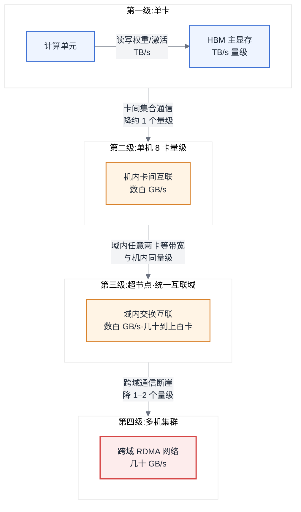
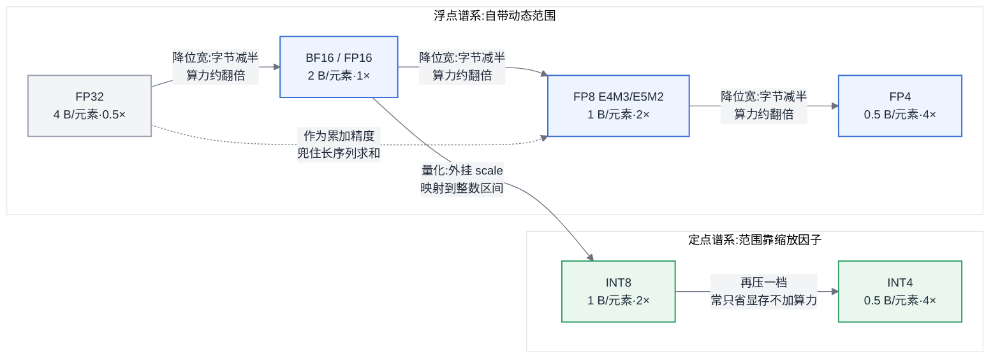
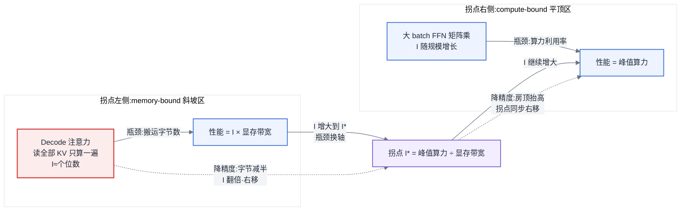
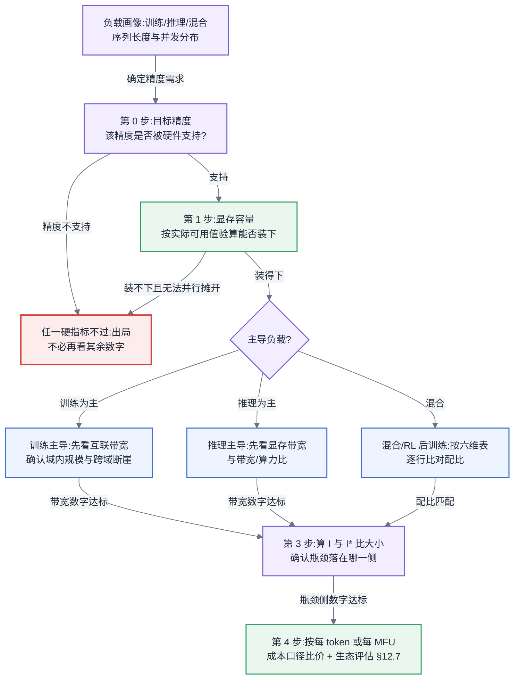

# 第 4 章 硬件第一性原理、架构范式与数值精度

## 链路定位与依赖声明

**链路定位**:本章位于两条主线的最底层——无论是主线 A 中一次训练任务的前向、反向与梯度同步,还是主线 B 中一次推理请求的 Prefill 与 Decode 循环,最终都要落在一块加速器芯片的算力、显存与互联上执行。本章就是那块芯片的物理地基,后面每一次性能估算都要回到这里。

**依赖声明**:本章建立在第 3 章的两条结论之上——§3.1 "反向传播必须保留前向激活值,因此训练的显存压力远大于推理",以及 §3.4 "自回归解码必须缓存 KV,因此 Decode 阶段每生成一个 token 都要把权重和 KV Cache 完整读一遍"。这两条结论决定了训练负载与推理负载对硬件的诉求为什么不同,而这正是本章 §4.2.2 的出发点。

## 问题场景:一次争论了三周的采购决策

某公司平台组要为新一期推理服务采购加速卡,候选有 A、B 两张卡。A 卡的 BF16 峰值算力比 B 卡高约 40%,价格高 25%;B 卡的显存带宽比 A 卡高约 50%,显存容量多 1/3。算力派拿着 A 卡的 TFLOPS 数字说"算力高 40%,吞吐就高 40%,摊到每 token 成本反而更低";带宽派拿着 B 卡的规格书反驳"我们的负载是长上下文对话,Decode 占了 90% 以上的时间"。争论持续三周,双方各自找厂商要来的 benchmark 都证明自己是对的——因为两家厂商跑的负载画像完全不同:A 卡厂商跑的是 batch 极大的短序列压测,B 卡厂商跑的是 batch 为个位数的长序列场景。

最后让争论落地的是一次很朴素的计算:团队把线上真实流量的平均输入输出长度、并发 batch 拿出来,估算了 Decode 阶段每生成一个 token 需要搬运的字节数(权重加 KV Cache),再除以生成该 token 消耗的浮点运算量,得到的计算密度只有个位数 FLOPs/Byte——远低于两张卡的 Roofline 拐点。这意味着在这个负载下,两张卡的峰值算力都严重过剩,真正决定吞吐的是显存带宽,A 卡多出来的 40% 算力一秒都用不上。B 卡胜出,而且团队第一次意识到:**规格书上最大的那个数字,常常是与自己负载最无关的那个数字。**

这个故事里没有任何一方是错的——他们只是各自拿着四个数字中的一个在争论。本章要做的,就是把这四个数字、它们背后的物理约束、以及"负载画像决定该看哪个数字"的判断方法一次性讲清楚。

## 原理与量化模型

### 4.1 四个数字与物理约束

#### 4.1.1 四个数字决定一切

任何一块加速器,对平台建设者而言只有四个一等数字:

1. **算力**(Compute,FLOPS):单位时间能完成多少次浮点/整数运算,且必须标注精度——不标精度的 TFLOPS 没有意义(见 §4.3 数值精度)。
2. **显存容量**(Memory Capacity,GB):能装下多少参数、激活值、优化器状态与 KV Cache。装不下,一切免谈。
3. **显存带宽**(Memory Bandwidth,GB/s 至 TB/s):计算单元从显存搬运数据的速度。它决定 memory-bound 负载的吞吐上限。
4. **互联带宽**(Interconnect Bandwidth,GB/s):卡与卡、机与机之间交换数据的速度。它决定并行训练中梯度同步和推理中跨卡通信的开销。

全书后续所有性能估算,输入都是这四个数字加上负载画像。第 6 章的显存三分精算、第 7 章的通信开销估算、第 22 章的推理吞吐估算,无一例外。

四个数字之间还有一个必须记住的**代际演进规律:算力增长快于带宽增长**。过去十年,峰值算力的代际增速持续高于显存带宽与互联带宽的增速,这把"剪刀差"是所有 Infra 优化的根本动因——算子融合、重计算、量化、通信重叠,本质上都是在用富余的算力去换稀缺的带宽。理解了这条规律,你就能预判:未来任何一代新卡上,带宽仍然会是更稀缺的那个资源。

#### 显存层级:每往下一层,带宽掉一个量级

芯片内部的存储不是一块平坦的显存,而是一个层级金字塔:寄存器(Register)→ 共享内存/一级缓存(Shared Memory / L1)→ 二级缓存(L2)→ HBM 主显存。从塔尖到塔底,容量从 KB 级增长到几十 GB 级,带宽则从每秒几十 TB 级逐层跌落到 TB 级——相邻层级之间的带宽差通常在几倍到一个数量级。这个金字塔解释了为什么"算子融合"(把多个算子合并、让中间结果留在片上高速存储而不落回 HBM)是性能优化的第一杠杆:每省掉一次 HBM 往返,就是把数据从塔底搬到了塔腰。平台工程师不需要会写这种优化,但需要知道它存在——因为第 5 章读 profile、第 22 章评估加速特性时都会用到。

#### 4.1.2 HBM:显存墙的物理来源

主显存为什么是 HBM(High Bandwidth Memory,高带宽显存)而不是像服务器内存那样的 DDR 插条?因为带宽。HBM 把多层 DRAM 裸片垂直堆叠,再通过 2.5D 封装与计算芯片并排放在同一块硅中介层(interposer)上,用数千根极短的连线直连。这换来了 DDR 无法企及的带宽,但也带来了三个刚性约束:

- **不可扩容**。HBM 在封装阶段就与计算芯片焊死在一起,没有插槽,买回来是多少 GB 就永远是多少 GB。大数据时代"内存不够加内存条"的经验在这里彻底失效。
- **代际演进慢于算力**。堆叠层数、中介层面积、散热都有物理上限,HBM 的容量与带宽提升速度追不上算力提升速度——这就是上文"剪刀差"的物理来源。
- **全行业最紧的供应约束**。HBM 的产能长期供不应求,是加速卡成本中占比最高的部件之一。这解释了两件事:高显存版本卡的溢价为什么远超容量差的比例;以及国产加速卡的瓶颈为什么往往首先出现在显存子系统而非计算单元(第 12 章展开)。

还有一个所有人第一次都会踩的坑:**标称容量不等于实际可用容量**。ECC 校验开销、驱动与固件预留、运行时上下文、显存分配器的碎片(第 5 章),会让一张标称 80GB 的卡在真实任务里可用容量缩水若干 GB。做第 6 章的显存三分精算时,永远用实测可用值而不是规格书数字。

**所以这对做平台的人意味着什么**:显存是这台机器上最贵、最稀缺、且完全不可事后扩容的资源。容量规划必须在采购前算清,而不是上线后再调。

#### 4.1.3 规模层级:互联域是关键抽象

从一张卡到一个集群,存在四级规模层级,每跨一级,通信带宽都可能出现断崖:

1. **单卡**:卡内 HBM 带宽,TB/s 量级。
2. **单机**:机内卡间高速互联,数百 GB/s 量级,比 HBM 低约一个数量级。
3. **超节点(SuperPod / 统一互联域)**:这是近年在单机与多机之间**新出现的一层**——通过交换式高速互联,把几十到上百张卡纳入同一个高带宽域,域内任意两卡之间的带宽与机内卡间同一量级,比传统跨机网络高一到两个数量级。
4. **多机集群**:跨域走 RDMA 网络,每卡带宽掉到几十 GB/s 量级——这是最陡的断崖。

这里的关键抽象是**互联域(interconnect domain)**:域内高带宽、跨域断崖。请记住抽象而不是任何厂商的产品形态——各家超节点的具体实现差异大且变动快(方案对照见附录 A),但"域内/跨域"这个边界在任何实现里都存在,且决定了以下几条经典经验是否需要改写:

- "张量并行不跨机"应改写为"张量并行不跨互联域"——超节点把可用 TP 规模从 8 卡量级扩大到几十卡量级;
- "All2All 是跨机瓶颈"改写为"All2All 是跨域瓶颈"——MoE 负载在超节点内的可行性完全不同(第 16 章);
- "故障域等于单机"不再成立——超节点是一个更大的故障域与运维单元;
- 采购单元从"台"变成"域"——你买的不是 N 台服务器,而是一个互联域加若干扩展。

图 4-1:规模层级与互联域。真正的通信断崖不在"机器"边界,而在"互联域"边界——并行策略与故障域都应按域规划,而不是按台规划。

#### 4.1.4 功耗与散热:一句伏笔

功耗与散热决定算力能不能持续跑满、一个机柜能塞多少卡——峰值算力是瞬时能力,持续输出受制于供电与散热。完整讨论见第 31 章,本章只需记住:规格书上的功耗数字是采购与机房规划的一等输入,不是脚注。

### 4.2 加速器架构范式

#### 4.2.1 四类范式,真正的差异在编译器

当前加速器可归入四类架构范式:

| 范式 | 代表 | 计算核心 | 编程模型 | 生态成熟度 | 特征 |
|---|---|---|---|---|---|
| SIMT 通用并行 | NVIDIA / AMD GPU | CUDA Core + Tensor Core | 手写 kernel + 算子库 | 最高 / 中等 | 灵活,生态最厚 |
| 脉动阵列 | Google TPU | MXU | 编译器主导(XLA) | 封闭但完整 | 规则大矩阵极致效率,灵活性差 |
| 多单元协同(达芬奇) | 华为昇腾 | Cube + Vector + Scalar | 图编译 + 算子开发 | 快速追赶中 | 介于两者之间 |
| 推理专用 ASIC | Groq 等 | SRAM 为主 | 编译期静态调度 | 窄而浅 | 超低延迟,容量受限 |

**核心洞察:四类范式的真正差异不在峰值算力,而在编译器承担多少责任。** SIMT 架构把调度决策留给运行时——每个 kernel 启动时才决定怎么切分、怎么占用计算单元,所以动态形状、变长序列、MoE 的动态路由这些"运行时才知道形状"的负载天然好做,代价是需要庞大的手写算子库来逼近峰值。脉动阵列走另一个极端:硬件是一个规则的矩阵乘引擎,所有调度在编译期静态完成,规则的大矩阵乘效率极高,但一旦负载形状在运行时才确定,编译器就必须靠 padding、bucketing、重编译来兜底,每一样都在烧性能。多单元协同架构介于两者之间——矩阵、向量、标量单元分工协作,靠图编译器做静态编排,同时保留算子级开发的口子。推理专用 ASIC 则把静态化推到极致:用大容量片上 SRAM 替代 HBM、编译期确定每一拍的数据流,换来极低的延迟和确定性,代价是容量与灵活性都被锁死。

这条洞察是第 16 章(MoE 系统)和第 12 章(异构迁移评估)的直接前提:**评估一个平台能不能跑好你的负载,先问你的负载有多少"运行时才确定的东西",再问这个平台的编译器接不接得住。**

另一个必须在选型时摆上台面的事实:**生态成熟度是一等变量,不是附加说明**。算子覆盖度、框架适配深度、社区排障能力,这些不在 spec sheet 上,却常常比 20% 的峰值算力差距更能决定项目成败。完整的生态评估维度见 §12.7,本章只负责把它列入必查清单。

#### 4.2.2 训练型与推理型负载的硬件诉求差异

**本书不采用"训练卡/推理卡"这个二分法。** 这个划分过去成立、现在正在失效:同一张卡既跑训练也跑推理已是常态,只是配比不同。按厂商标签写"这是训练卡那是推理卡",下一代产品发布就作废,而且会退化成产品手册。真正区分二者的不是芯片上的标签,而是 §4.1 那四个数字的**配比**。训练与推理负载对硬件的诉求差异,可以用六个维度刻画:

| 维度 | 训练主导需求 | 推理主导需求 |
|---|---|---|
| 显存容量 | 极高(权重 + 梯度 + 优化器状态 + 激活值,见 §3.1/§3.2) | 中等(权重 + KV Cache,见 §3.4) |
| 显存带宽 | 重要 | **决定性**(Decode 是 memory-bound,见 §4.4) |
| 互联带宽 | **决定性**(梯度同步等集合通信) | 域内够用即可 |
| 精度需求 | BF16 / FP8,需高精度累加(见 §4.3) | INT8 / FP8 / INT4,可更激进 |
| 可靠性 | 长时任务全局同步,单点故障代价极大 | 无状态,故障实例可快速替换 |
| 性价比口径 | 每 MFU 成本 | 每 token 成本 |

这张表的用法不是背下来,而是拿去比对:**与其问"这是不是推理卡",不如拿这六行去比对一张卡的 spec sheet**——带宽/算力比高、互联一般、低精度算力倍率激进的卡,天然偏推理配比;互联带宽拉满、显存容量极大、可靠性特性完整的卡,天然偏训练配比。这也是推理专用 ASIC 存在的逻辑:它主动放弃训练所需的灵活性、互联与显存容量,把省下的晶体管和功耗全部换成延迟与单位吞吐成本的优势。理解了取舍,你就能判断它适不适合你的负载,而不必等厂商告诉你答案。

但这条界限**正在模糊**,而且是本节最值得记住的一条:强化学习后训练把 rollout(用当前模型生成大量样本)拉进了训练流程,一次 RL 迭代里推理产生的 token 量可以远超训练本身的吞吐。这意味着训练集群必须跑得动完整的推理引擎,训练负载画像里嵌入了一大块推理负载画像。后训练时代,"训练卡"和"推理卡"的划分进一步失去意义,混合架构成为常态(第 21 章展开)。

**所以这对做平台的人意味着什么**:采购和容量规划的输入应当是负载画像(训练/推理/混合的比例、序列长度分布、并发分布),输出才是四个数字的目标配比。反过来拿卡的标签倒推负载,是本末倒置。

#### 4.2.3 如何读一张卡的 spec sheet

面对任何一张卡——包括未来才会出现的卡——只看六个数字:

1. **各精度峰值算力**:必须逐精度看,且确认是稠密(dense)算力;
2. **显存容量**:对照你的模型规模与 KV Cache 需求(算法见第 6 章);
3. **显存带宽**:推理主导场景的第一数字;
4. **卡间互联带宽**:训练主导场景的第一数字,并确认是域内带宽还是跨域带宽;
5. **功耗**:决定机柜密度与持续算力(第 31 章);
6. **单卡价格**:结合负载算每 token 成本或每 MFU 成本,而不是比裸价。

同时识别三类**营销数字**:标注"稀疏"(sparsity)的算力——依赖结构化稀疏,绝大多数真实负载吃不到,直接除以二读;不标注精度的 TFLOPS——通常取的是最低精度、最理想条件的那个值;理论峰值——任何真实算子都达不到,只能用于计算 Roofline 的房顶,不能当吞吐承诺。

最实用的一个派生指标是**带宽/算力比**(Byte/FLOP):用显存带宽除以你目标精度的峰值算力,得到这张卡"每做一次浮点运算能配给多少字节搬运"。这个比值高,卡偏 memory-bound 友好(推理配比);比值低,卡必须喂给它高计算密度的负载才能吃满(训练配比)。它就是 §4.4 Roofline 拐点的倒数——两节讲的是同一件事。

最后重复一次:生态维度不在 spec sheet 上,必须单独评估(§12.7)。一张六个数字全优但算子库残缺的卡,落地成本可能超过全部硬件差价。

### 4.3 数值格式与精度【全书唯一定义处】

本节是全书数值格式与精度记法的唯一定义处。第 17、22、23 章只讲应用,不再重复定义;其他章节遇到格式与记法,一律指回本节。

#### 位宽的分配逻辑:动态范围与表示精度是两件事

一个浮点数由三部分组成:符号位(sign)、指数位(exponent)、尾数位(mantissa)。指数位数量决定**动态范围**——能表示的最大值与最小值相差多少个数量级;尾数位数量决定**表示精度**——在同一个数量级内能分辨多细的差别。这是两件独立的事:给定总位宽,指数与尾数是零和分配,多给指数一位,可表示范围翻倍量级地扩大,但同一区间内的可分辨点减半。

深度学习训练对这两者的敏感度不对称:梯度的数值跨越很多个数量级,**范围不够会直接溢出或下溢为零,训练发散**;而单个数值差一点精度,会被海量参数的统计效应平均掉。这一条不对称性,是理解下面整个格式谱系的钥匙。

#### 格式谱系对照表

| 格式 | 总位宽 | 符号/指数/尾数 | 每元素字节 | 动态范围 | 表示精度 | 相对算力倍率* | 典型角色 |
|---|---|---|---|---|---|---|---|
| FP32 | 32 | 1 / 8 / 23 | 4 | 极大(~10³⁸) | 高 | 0.5× | 累加器、主权重副本、基准精度 |
| TF32 | 19(存于 32 位容器) | 1 / 8 / 10 | 4 | 同 FP32 | 中 | ~1× | FP32 代码零改动加速的过渡格式 |
| FP16 | 16 | 1 / 5 / 10 | 2 | 小(~10⁴,最大 65504) | 中 | 1× | 早期混合精度训练,需 loss scaling |
| BF16 | 16 | 1 / 8 / 7 | 2 | 同 FP32 | 中低 | 1× | 训练默认格式 |
| FP8 E4M3 | 8 | 1 / 4 / 3 | 1 | 较小(~10²) | 低 | 2× | 前向权重/激活 |
| FP8 E5M2 | 8 | 1 / 5 / 2 | 1 | 中(~10⁴) | 很低 | 2× | 反向梯度 |
| FP4(E2M1) | 4 | 1 / 2 / 1 | 0.5 | 极小 | 极低 | 4× | 激进推理量化,需块级缩放 |
| INT8 | 8 | 定点 | 1 | 需缩放因子映射 | 均匀 | 2× | 推理权重/激活量化 |
| INT4 | 4 | 定点 | 0.5 | 需缩放因子映射 | 均匀 | 4×(常受限于实现) | 推理权重量化 |
| INT32 | 32 | 定点 | 4 | — | — | 非计算格式 | INT8 计算的累加器;索引/偏移类型 |

\* 相对算力倍率以同代硬件矩阵核心的 FP16/BF16 峰值为 1×,是"大致翻倍"的量级规律而非承诺:**每降一档位宽,峰值算力大致翻倍,每元素显存占用与搬运字节数减半**——降精度同时抬高 Roofline 的两个轴,这是 §4.4 的直接输入。

几条必须展开的结论:

**为什么 BF16 取代了 FP16——赢在动态范围而非精度。** FP16 只有 5 位指数,最大可表示值仅 65504,梯度稍大就溢出,梯度稍小就下溢归零,因此 FP16 训练必须配合 loss scaling(动态缩放损失值把梯度"顶"进可表示区间)这套脆弱的辅助机制。BF16 的选择粗暴而正确:指数位与 FP32 完全对齐(8 位),把范围问题彻底消灭,代价是尾数只剩 7 位、精度比 FP16 更差。实践证明训练对范围的敏感度远高于对精度的敏感度,BF16 无需 loss scaling 即可稳定训练。这是"范围与精度是两件事"最好的例证。同一逻辑在 FP8 上再次出现:E4M3(范围小、精度相对高)用于前向的权重与激活,E5M2(范围大、精度低)用于动态范围更大的反向梯度——8 个位不够同时满足两头,就按张量的统计特性分配两种格式。

**浮点与定点的本质区别。** INT8/INT4 是定点格式,本身没有指数,动态范围完全依赖量化时外挂的缩放因子(scale)把浮点分布映射到整数区间。映射的粒度(整张量一个 scale、每通道一个、每块一个)决定量化损失,这是第 23 章量化技术的主战场,本章只需建立:INT 格式的"范围"不是格式自带的,是量化算法给的。

**累加精度与计算精度的分离。** 低精度矩阵乘的标准做法是:乘法在低精度做,**累加在高精度做**——FP16/BF16/FP8 相乘、FP32 累加;INT8 相乘、INT32 累加。原因是长序列求和的**灾难性抵消**:上千个数逐个累加,部分和越来越大,低精度下每加一个小数都可能被整个舍入掉,误差随序列长度系统性积累。所以读 spec sheet 时要确认低精度算力是否为"高精度累加"下的数字;评估一张卡的精度支持时,"支持 FP8 计算"和"支持 FP8 计算 + FP32 累加"是两回事。

**INT32 的位置。** INT32 不作为权重格式出现,但在两个位置不可或缺:一是 INT8 计算的累加器类型;二是索引与偏移量类型——tensor 的下标、词表偏移、KV Cache 的块表指针。当 tensor 元素数、序列长度乘 batch、或词表相关的中间量超过 INT32 上限(约 21 亿)时,会发生静默溢出,这是生产环境最难查的一类 bug,排查路径见 §5.2。

**记法约定(全书统一)**:`W<x>A<y>` 表示权重(Weight)用 x 位、激活(Activation)用 y 位;追加 `KV<z>` 表示 KV Cache 用 z 位。例如 **W8A8** 是权重与激活都量化到 8 位(计算真正以 8 位执行,吃到 2× 算力倍率);**W4A16** 是权重压到 4 位存储、计算前反量化回 16 位执行(省显存和权重搬运带宽,不省算力,适合 memory-bound 的 Decode);**W4A8KV4** 是权重 4 位、激活 8 位、KV Cache 4 位——三者可以各用各的精度,因为它们的数值分布敏感度和搬运量占比各不相同。读懂这套记法,就能读懂任何量化方案的资源含义:W 决定权重显存与权重搬运量,A 决定计算格式与算力倍率,KV 决定长上下文场景的 KV Cache 显存与搬运量。

**各架构范式的精度支持差异是选型硬约束。** 低位宽格式需要专用硬件通路,不同范式、不同代际的卡支持的格式集合差异很大;一张不支持 FP8 的卡,任何 FP8 方案对它都是零而不是打折。选型时精度支持列表与四个数字同级,必查。

图 4-2:数值格式谱系。每降一档位宽,显存字节减半、峰值算力大致翻倍——但范围与精度的账要分开算,且累加始终要留在高精度。

### 4.4 Roofline 模型

Roofline 是把前面所有内容拧成一个判断工具的模型,也是全书性能瓶颈判定的唯一定义处。

定义**计算密度**(Arithmetic Intensity):一个算子每从显存搬运 1 字节数据,能做多少次运算:

> **I = 总运算量(FLOPs)÷ 总搬运量(Bytes)**

一张卡能给这个算子的性能上限是两条线中较低的一条:

> **可达性能 = min(峰值算力, I × 显存带宽)**

两条线的交点是**拐点**:

> **I\* = 峰值算力 ÷ 显存带宽**

算子的 I 低于 I\*,是 **memory-bound**(受限于带宽)——算力再高也用不上,优化方向是减少搬运字节;I 高于 I\*,是 **compute-bound**(受限于算力)——带宽有富余,优化方向是提高算力利用率或降精度换倍率。I\* 正是 §4.2.3 里带宽/算力比的倒数:同一个负载,在带宽/算力比不同的两张卡上,可能落在拐点的两侧。

把 LLM 的两类典型算子代入。大 batch 下的 FFN 矩阵乘,计算密度随矩阵规模增长,轻松落在拐点右侧,compute-bound;而 Decode 阶段的注意力计算,每生成一个 token 都要把 KV Cache 完整读一遍,却只对它做一遍乘加,计算密度是个位数量级,深陷 memory-bound 区——这就是本章开头采购故事的定量解释,也是 §4.2.2 那张表里"显存带宽对推理是决定性的"的来源。

**把 §4.3 的精度代入,Roofline 的两个轴同时移动。** 降精度让峰值算力翻倍(房顶抬高)、每元素字节减半(同一算子的 I 翻倍,向右移动)。于是出现三种情形:memory-bound 算子降精度后仍在拐点左侧——吞吐随字节减半直接翻倍,这是 Decode 量化收益的来源;原本 compute-bound 的算子——直接吃到算力倍率;而一个原本恰好卡在拐点附近的算子,降精度后会**跨越拐点**,瓶颈从带宽换成算力,继续压带宽不再有收益。同一算子在不同精度下瓶颈性质不同——所以任何"该优化什么"的讨论,必须先声明精度,再谈瓶颈。

图 4-3:Roofline 与精度的相互作用。判定瓶颈只需两步——算出算子的 I,与卡的 I\* 比大小;降精度同时移动算子位置与拐点位置,同一算子可能就此跨越拐点。

## 方案对比:三条采购/选型路线及其失效边界

面对"为混合负载建一个集群"这个命题,常见三条路线:

**方案一:训练配比统一采购**——全部按训练诉求配置(互联拉满、大显存、BF16/FP8 为主),推理复用训练卡。优点是资源池统一、调度灵活、RL 后训练天然可跑。**失效边界**:当推理流量占比持续超过集群的一半时,你在为推理负载支付它用不到的互联带宽和可靠性溢价,每 token 成本显著劣于推理配比方案;纯 Decode 型负载(长对话、Agent)下劣势最大。

**方案二:训练/推理双池分开采购**——训练池按训练配比、推理池按推理配比(高带宽/算力比、激进低精度支持),各自最优。优点是两侧单位成本都最优。**失效边界**:两池之间资源无法互济,任何一侧的负载潮汐都会造成另一侧空转;RL 后训练需要在训练池里跑推理引擎,若推理池的卡与训练池架构不同,还要维护两套软件栈,迁移成本(第 12 章)吃掉配比省下的钱。负载比例不可预测的早期平台不适用。

**方案三:推理 ASIC + 通用卡混合**——延迟敏感的在线服务上专用 ASIC,其余用通用卡。优点是在线服务的延迟与每 token 成本可以做到极致。**失效边界**:模型迭代速度是它的死穴——每次换模型都依赖厂商编译器支持,模型结构超出其支持范围(新注意力变体、超长上下文、大 MoE)时直接不可用;片上 SRAM 容量决定了模型规模上限;生态窄意味着排障只能靠原厂。适合模型稳定、流量巨大的成熟业务,不适合快速迭代期。

没有全域最优:选择的输入是负载画像与其可预测性,而不是任何一张卡的规格书。

## 大数据对照

本章的思维方式对有大数据背景的读者既熟悉又危险——熟悉在方法,危险在参数。

**直接复用的**:Roofline 的思想不是新的。Hadoop/Spark 时代做容量规划,同样是"算一下这个 job 是 CPU-bound 还是 IO-bound,再决定加 CPU 还是加磁盘/网络"——Spark shuffle 调优的本质就是判断瓶颈在计算还是在网络搬运。这套"先算密度、再定瓶颈、后选优化方向"的方法论原样搬过来即可。同样复用的还有"营销数字识别"的经验:当年读存储厂商的 IOPS 数字要问测试块大小,今天读 TFLOPS 要问精度和稀疏性,是同一种职业警觉。

**参数上失效的,有三处,且每一处都会让老经验给出错误决策**:

其一,**存储可扩、显存不可扩**。HDFS 空间不够加节点、内存不够加内存条,"先上线后扩容"是大数据时代的合法路径;HBM 焊死在封装里,容量在采购下单那一刻就永久锁定。容量规划从"可迭代的运维动作"变成"不可逆的采购决策",精算必须前置(第 6 章)。

其二,**带宽层级的断崖陡峭得多**。大数据集群里,本机磁盘、同机架、跨机架的带宽差通常在几倍以内,数据本地性(data locality)是"锦上添花"的优化;AI 集群里 HBM 到跨域网络相差两到三个数量级,通信局部性是"生死攸关"的架构约束——放错一个并行维度的位置,吞吐直接掉一个量级(第 7 章)。

其三,**大数据世界没有精度这个变量**。一个 Long 就是 8 字节,没有人靠把 Long 换成 Int 来让 Spark 快一倍;而在 AI 集群里,精度是资源账本的独立一列——同一个模型、同一张卡,W8A8 与 BF16 之间隔着一倍的算力、一半的显存和搬运量。大数据出身的工程师最容易犯的错,就是做容量与性能估算时忘了先问一句"什么精度"。

## 选型决策树

给定一个负载画像,读一张卡(包括任何未来才出现的卡)的 spec sheet 时,按下面的路径走:

图 4-4:spec sheet 阅读决策树。先精度、再容量、后按主导负载挑带宽数字、最后用 Roofline 验证瓶颈——顺序不可颠倒,因为前一步是后一步的过滤器。

走一遍这棵树的要点:精度支持和显存容量是**过滤器**——不过就出局,不存在"用别的优势弥补";带宽数字是**排序器**——按主导负载决定看哪一个;Roofline 是**验算器**——防止为用不上的峰值算力付钱;价格永远放在最后,并且只用每 token 成本或每 MFU 成本口径(对标口径见 §12.5),裸卡价没有比较意义。

---

本章交付的是方法而不是结论:具体某张卡的参数会过时,四个数字、六维配比、格式谱系和 Roofline 这套判断框架不会。**读完本章,你应当能**:拿到任何一张卡的 spec sheet,查出它在指定精度下的算力/带宽比并算出拐点 I\*,判断你的算子落在 Roofline 哪一侧;能读懂 W8A8 / W4A16 / W4A8KV4 记法并说出每一段各省什么资源;能只凭 spec sheet 上的六个数字与六维配比表,判断一张陌生的卡——包括发布会上刚亮相的下一代——更适合什么负载,并识别出其中的营销数字。
