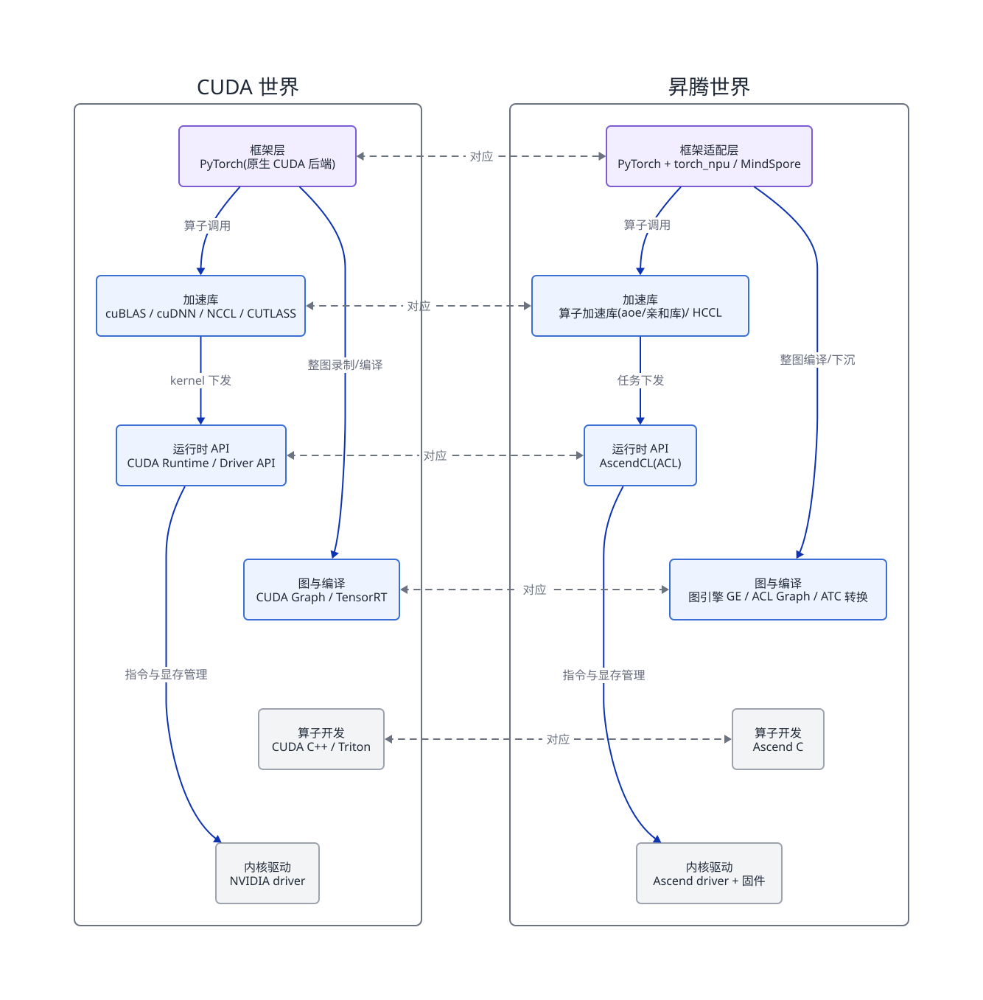
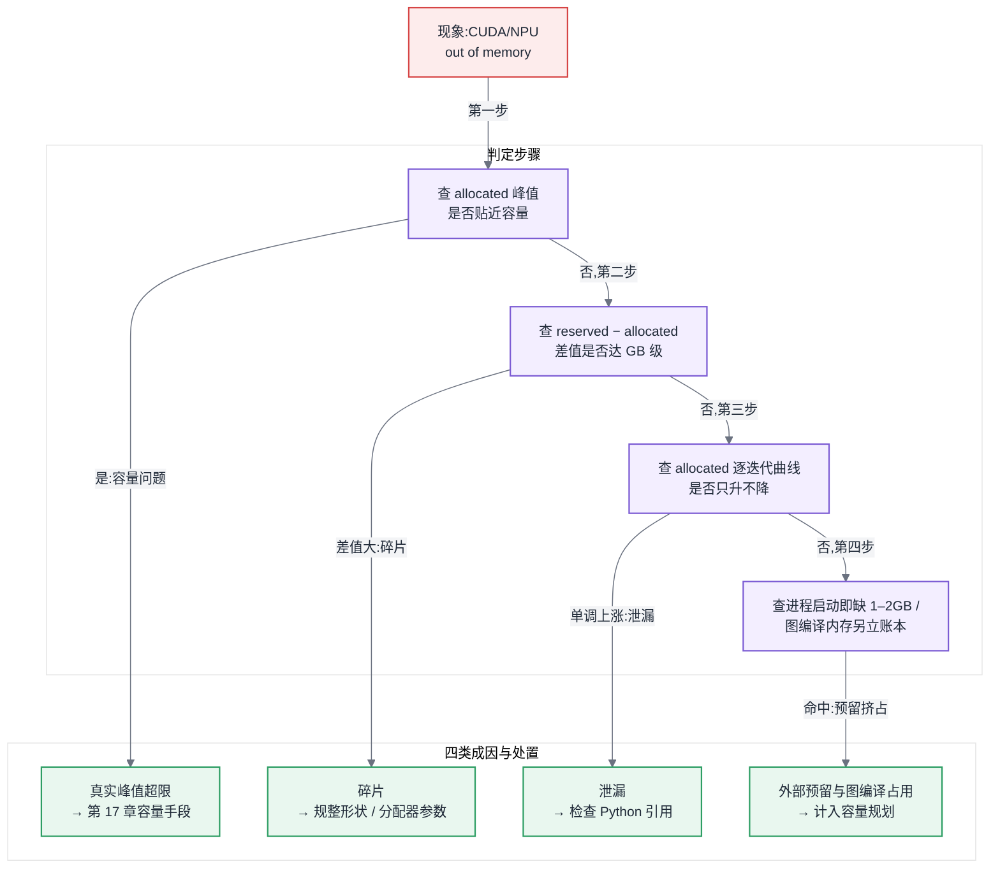
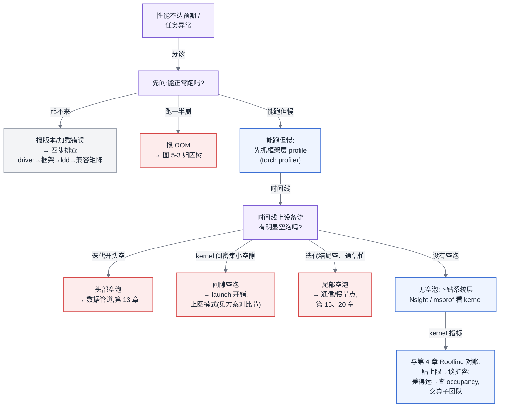

# 第 5 章 CUDA、CANN 与加速器软件栈

## 链路定位与依赖声明

**链路定位**:本章位于两条主线的交汇处——训练主线 A 的"前向 → 反向"与推理主线 B 的"Prefill → Decode 循环"里,每一次算子执行、每一次显存分配、每一次 kernel 下发,都发生在本章讲的这一层软件栈上;它是硬件(第 4 章)与集群(第二部分)之间那段最容易被跳过、也最常出问题的中间层。

**依赖声明**:本章建立在第 4 章的两条结论之上——[§4.2.1](第04章-硬件第一性原理、架构范式与数值精度.md#421-四类范式真正的差异在编译器)"四类架构范式的真正差异不在峰值算力,而在编译器承担多少责任",以及 [§4.4](第04章-硬件第一性原理、架构范式与数值精度.md#44-roofline-模型)"Roofline 决定一个算子是 compute-bound 还是 memory-bound"。本章要回答的是:这些物理事实穿过软件栈之后,变成了平台工程师日常面对的哪些现象。

先把本章的边界说死:**不教写 kernel**。平台建设方不需要会写 CUDA C++,但必须能读懂一份 profile 时间线、能独立排查一次版本冲突、能在 CUDA 与 CANN 两套栈之间画出对照关系。做到这三件事,你就能跟算子团队、驱动供应商、框架社区平等对话;做不到,你排查任何性能问题都只能靠猜。

## 问题场景:能跑,但只有一半速度

一个 7B 模型的继续预训练任务,8 卡单机,团队按 [§6.2](第06章-模型结构的定量分析.md#62-参数量与资源换算核心) 的公式(见第 6 章)估算过:这套硬件在 BF16 下应该做到约 42% 的 MFU(Model FLOPs Utilization,模型算力利用率),对应每卡每秒约 5,800 token。任务跑起来了,loss 正常下降,没有任何报错——但实测吞吐只有每卡每秒 2,700 token,MFU 不到 20%。

负责排查的工程师有十年 Spark 调优经验,他按旧直觉走了一遍:看数据管道,DataLoader 预取队列始终是满的,不是 IO;看网卡,梯度同步的通信量与带宽都对得上,不是网络;看 `nvidia-smi`,GPU 利用率显示 92%——按大数据时代的经验,"CPU 利用率 92%"意味着资源已经用满,没有优化空间了。他一度向上汇报"硬件性能达不到标称值,建议找供应商"。

供应商来了,抓了一份 Nsight Systems 的时间线,十分钟定位:GPU 的计算流上,每个 kernel 平均执行 18 微秒,而相邻两个 kernel 之间有 12 微秒的空隙——CPU 端 Python 循环下发 kernel 的速度跟不上 GPU 消化 kernel 的速度,GPU 有 40% 的时间在等 CPU 发指令。这就是 launch 开销(kernel 启动开销)。`nvidia-smi` 的"利用率"只统计"这段时间内是否至少有一个 kernel 在跑",92% 里混着大量的等待碎片(这个指标的完整批判见第 11 章)。开启 CUDA Graph 把整段 decode 循环的 kernel 序列一次性录制、整体重放后,吞吐回到每卡每秒 5,400 token。

这位工程师的三个动作——查 IO、查网络、看利用率——全都是对的方法论,错在他的工具停在了操作系统层。**加速器的性能问题,必须用加速器软件栈自己的工具往下看一层。** 本章就是这"往下一层"的地图。

## 5.1 CUDA 执行模型与软件栈

### 5.1.1 CUDA 执行模型:五个词读懂一份 profile

读 profile 需要的执行模型词汇只有五个,全部服务于一个问题:**这块 GPU 此刻为什么没在满速干活**。

**SM(Streaming Multiprocessor,流式多处理器)** 是 GPU 的基本计算单元,一张卡有几十到一百多个 SM,算力标称值就是所有 SM 满载时的总和。**thread block(线程块)** 是调度的基本单位,一个 kernel 启动成千上万个线程,按 block 为单位分配到 SM 上。**warp(线程束)** 是执行的基本单位,32 个线程一组,同一 warp 内所有线程同一时刻执行同一条指令——这就是 [§4.2.1](第04章-硬件第一性原理、架构范式与数值精度.md#421-四类范式真正的差异在编译器) 说的 SIMT(Single Instruction Multiple Threads)范式。**共享内存与寄存器**是每个 SM 上的稀缺片上资源,一个 block 占用多少,决定一个 SM 能同时驻留几个 block。**occupancy(占用率)** 就是这个驻留比例:实际驻留的 warp 数除以硬件上限。

这五个词串成一条可量化的因果链:

> 单个 block 的寄存器/共享内存用量 → 每 SM 可驻留 block 数 → occupancy → 访存延迟能否被其他 warp 的计算掩盖 → 实际带宽利用率。

平台工程师用它的方式是**反向读**:profile 显示某个算子带宽利用率只有 30%,查它的 occupancy 只有 25%,那么瓶颈不在带宽本身,而在这个 kernel 的资源占用写法——这是算子团队的问题,不是买更贵 HBM 能解决的问题。注意一个反直觉点:occupancy 不是越高越好,memory-bound 算子需要高 occupancy 来掩盖访存延迟,而 compute-bound 算子(如大矩阵乘)常常故意用低 occupancy 换取每线程更多寄存器。所以 occupancy 只是归因线索,不是优化目标。

### 5.1.2 软件栈分层与版本兼容:一条可操作的排查路径

CUDA 软件栈自下而上分四层,每层的版本语义不同:

1. **内核驱动(driver)**:装在宿主机内核里,全节点唯一,决定这台机器能支持的 CUDA 版本上限。
2. **CUDA runtime**:随应用/容器分发,向上提供执行 API,受 driver 上限约束。
3. **加速库**:cuBLAS(矩阵乘)、cuDNN(卷积与部分融合算子)、NCCL(集合通信,详见第 7 章)、CUTLASS(矩阵乘模板库,FlashAttention 类算子的地基)。它们各自有独立版本号,各自声明对 runtime 的依赖区间。
4. **框架**:PyTorch 编译时绑定特定的 runtime 与加速库版本。

版本兼容的核心规则只有一条:**driver 向后兼容 runtime——新 driver 可以跑旧 runtime 编译的程序,反过来不行**。容器化让上面三层随镜像走、driver 留在宿主机(由 nvidia-container-toolkit 把设备与驱动库挂进容器),于是版本冲突的形态就固定了几种。遇到"容器里 CUDA 相关报错"时,不要罗列可能性,按这个顺序四步走,每步都有明确判据:

1. **查宿主机 driver 版本与容器内 runtime 版本**:driver 支持的 CUDA 上限低于容器内 runtime 版本,就是最常见的"driver too old"——升级宿主机驱动,或降级镜像。
2. **查框架编译版本与容器内实际库版本**:PyTorch 报告的编译版本(`torch.version.cuda`)与镜像里装的 toolkit 不一致时,以框架编译版本为准——运行时用的是框架自带的库,镜像里另装的 toolkit 只是干扰项。
3. **查 `LD_LIBRARY_PATH` 与库加载实况**:用 `ldd` 确认进程实际加载的 libcudnn/libnccl 是哪个路径的——多版本共存时环境变量把错误版本推到前面,是"同一镜像在 A 机器好的、B 机器坏的"的头号原因。
4. **查加速库之间的搭配**:前三步都对但特定算子报错或性能异常,才轮到 cuDNN/NCCL 与 runtime 的小版本搭配问题,此时对照官方兼容矩阵逐项核对。

90% 的问题死在前两步。平台方的正确姿势不是每次排查,而是把这条路径做成准入检查:镜像构建时固化版本清单,节点上线时校验 driver 版本下限,这两道关把版本冲突从"生产事故"降级为"CI 失败"。

### 5.1.3 Stream 与 CUDA Graph:launch 开销的定量账

CPU 通过 **Stream(流)** 向 GPU 异步下发 kernel:同一 stream 内按序执行,不同 stream 可并发——计算与通信的重叠(第 16 章的流水线依赖此机制)就靠多 stream。异步下发意味着 CPU 是"发令员",而发令本身有固定成本:一次 kernel launch 的 CPU 侧开销约 5–10 微秒量级。

这笔账什么时候会主导性能?给一个可以自己代入的判断式:

> 设每步迭代下发 N 个 kernel,单次 launch 开销 t_launch,单个 kernel 平均 GPU 执行时长 t_exec。当 t_launch ≥ t_exec 时,GPU 出现空等,空转比例约为 (t_launch − t_exec) / t_launch。

训练时 batch 大、单 kernel 动辄几百微秒,launch 开销可以忽略。但推理的 decode 阶段(见 [§3.4](第03章-人工智能与大模型基础.md#34-transformer-与注意力),自回归解码每步只算一个 token)恰好落在最坏区间:batch 小、矩阵瘦、单 kernel 只有几微秒到十几微秒,而一个 Transformer 层就有十几个 kernel,一次前向数百次 launch——launch 开销可以吃掉 30–50% 的时间。这就是问题场景里那 12 微秒空隙的来源,也解释了为什么这个问题在训练团队手里潜伏、到推理团队手里爆发。

**CUDA Graph** 的解法是把整段 kernel 序列录制成一张图,之后每步用一次 launch 重放整张图,把 N 次 launch 开销摊薄成 1 次。代价是图要求执行序列与张量地址稳定——动态形状、动态控制流都会破坏录制,所以推理引擎要为不同 batch 尺寸预录多张图,用显存和启动时间换 decode 吞吐(工程折中见第 23 章,冷启动代价见第 25 章)。

**所以这对做平台的人意味着什么**:看到"GPU 利用率高但吞吐低 + 小 batch 场景",第一优先级怀疑 launch 开销,验证手段是 profile 时间线上的 kernel 间空隙,而不是加卡。

## 5.2 运行时的共性问题

### 5.2.1 caching allocator 与 OOM 的四种真实成因

PyTorch 不把每次 `cudaFree` 真的还给驱动——向驱动申请/释放显存是同步且昂贵的操作——而是自己维护一个 **caching allocator(缓存分配器)**:释放的块留在池里等复用。这带来一个直接后果:`nvidia-smi` 看到的"已用显存"是 PyTorch 圈地的总量(reserved),不是张量实际占用(allocated),两者的差就是池里的空闲块。

于是"CUDA out of memory"这个报错背后其实是四种完全不同的病,治法互斥,必须先归因再动手:

1. **真实峰值超限**:allocated 的峰值确实贴近显卡容量。这是容量问题,解法在第 17 章(重计算、ZeRO、offload)。判据:峰值 allocated ≈ 容量。
2. **碎片**:reserved 与 allocated 差出好几个 GB,报错信息里"free"的总量足够但分配失败——池里全是不连续的小块,放不下一个大张量。典型诱因是变长序列让每步的张量尺寸都不同,块无法复用。判据:reserved − allocated 大,且报错请求的单块尺寸不算大。解法是减少形状抖动(sequence packing,见第 16 章)或配置分配器的可扩展段模式,而不是砍 batch。
3. **泄漏**:allocated 随迭代单调上涨不回落。几乎总是 Python 引用没放掉——最经典的是把带梯度的 loss 张量累加进日志列表。判据:按迭代画 allocated 曲线,只升不降。
4. **外部预留挤占**:框架之外的显存消费者——NCCL 通信缓冲区、CUDA 上下文本身、CUDA Graph 的常驻内存池——不经过 caching allocator,却实打实占容量。判据:进程刚启动、还没分配几个张量,`nvidia-smi` 已经少了 1–2 GB。解法是把这部分预留计入容量规划,而不是当作丢失。

### 5.2.2 INT32 索引的静默溢出

[§4.3](第04章-硬件第一性原理、架构范式与数值精度.md#43-数值格式与精度全书唯一定义处) 提到 INT32 在栈里的位置是累加器与索引类型,伏笔在这里兑现。大量 kernel 与框架代码用 32 位整数做张量的下标与偏移,上限约 21 亿(2³¹−1)。大模型时代三类张量常规性地越过这条线:长序列的 attention 中间量、超大词表的 logits(batch × seqlen × vocab,词表 15 万时,batch 32 × 4K 序列就到 196 亿元素)、以及超大 embedding 表。

这是生产环境最难查的一类 bug,因为它**静默**:偏移量回绕后读写到错误但合法的地址,没有越界报错,表现是 loss 偶发尖刺、某些样本输出乱码、或换一个 batch size 就复现不了。可操作的防线有三条:框架与算子库尽量升到已做 64 位索引改造的版本;对"元素数可能过 21 亿"的算子(自定义算子尤其要查)在评审时按上面的乘法算一遍;复现路径固定但报错随机的诡异问题,把单卡上的张量元素数列出来查一遍是否有越线的,这条检查十分钟,却常常终结数周的排查。

**所以这对做平台的人意味着什么**:OOM 与数值诡异问题都必须先归因后动手——这四加一共五种病里,只有第一种能靠"加显存/加卡"解决,其余四种加了也白加。

## 5.3 CANN 与昇腾软件栈:两套完整并行的世界

先亮本章的核心立场:**CANN(Compute Architecture for Neural Networks)不是 CUDA 的一个方言,而是一套与 CUDA 完整平行的世界**。"方言"意味着学会普通话就能连蒙带猜,而实际情况是:两套栈在每一层都有对应物,但对应物的行为逻辑、失效模式、调优入口都不同。用 CUDA 直觉直接套昇腾,轻则调优无从下手,重则把 A 世界的结论当成 B 世界的事实向上汇报。这个立场是第 12 章迁移评估的前提——评估迁移成本时,按"学一门方言"估工时的项目全部超期。

两套栈的分层对照是本章、也是全书被引用最多的图之一:

图 5-1:CUDA 与 CANN 双栈分层对照。每一层都有对应物,但对应关系是"职责相同",不是"行为相同"——排查问题时可以按层找对应工具,做迁移评估时绝不能按层假设等价。
<!-- source: diagrams/sources/ch05-cuda-cann-stacks.d2 -->

逐层把"对应但不相同"讲清楚:

- **AscendCL(ACL)对应 CUDA Runtime API**:同样负责设备管理、内存管理、任务下发。差异在于 ACL 的任务下发天然面向"任务队列 + 图下沉"的模型,与 CUDA 的 stream 语义并不逐一等价。
- **图引擎 GE(Graph Engine)+ ATC(模型转换工具)对应 TensorRT 的位置**:把整张计算图离线编译、融合、下沉到设备执行。但有一个关键的架构性差异:在 CUDA 世界,图编译是可选的优化;在昇腾世界,**图模式是这套架构的主场**——回到 [§4.2.1](第04章-硬件第一性原理、架构范式与数值精度.md#421-四类范式真正的差异在编译器) 的结论,昇腾的多单元协同范式把更多责任压给了编译器,单算子逐个下发(eager 模式)是为了兼容 PyTorch 生态而补的路径,先天不是它的最优工况。这解释了一个迁移中常见的现象:同一个模型,eager 模式下昇腾性能落差明显,切到图模式后差距大幅收窄。
- **ACL Graph 对应 CUDA Graph**:同样是"录制 kernel 序列、整体重放、消除 launch 开销",decode 阶段的收益逻辑与 [§5.1.3](#513-stream-与-cuda-graphlaunch-开销的定量账) 完全一致,动态形状的限制也同样存在(推理侧的工程化见第 23 章)。
- **Ascend C 对应 CUDA C++/Triton 的位置**:算子开发语言。平台方不写,但要知道它存在——第 12 章讲的"缺失算子自研"走的就是这条路,其人力成本要按"新语言 + 新架构"计,不能按"会 CUDA 的人转一下"计。
- **HCCL 对应 NCCL**:集合通信原语基本对齐,拓扑与调优入口不同,展开在第 7 章。
- **torch_npu 对应"PyTorch 原生后端"**:这层最容易被低估。CUDA 是 PyTorch 的原生后端,新特性首发;昇腾经由适配层接入,算子覆盖与新特性存在滞后期——这个滞后期是第 12 章生态评估五维度之一的实测对象。MindSpore 则是另一条整体换框架的路线,取舍见第 18 章。

**昇腾侧的显存模型与 OOM 差异**也要单独记一笔:torch_npu 同样有 caching allocator,[§5.2.1](#521-caching-allocator-与-oom-的四种真实成因) 的四分归因法可以平移;但多了一类 CUDA 世界少见的成因——图模式下,GE 编译期为整图静态规划的内存与 eager 张量池是两本账,图编译占用的工作内存在 profile 里不挂在任何一个 PyTorch 张量名下。在昇腾上遇到"张量明明不多却 OOM",先查是否运行在图模式、图编译内存配额多大,再走四分法。

**所以这对做平台的人意味着什么**:双栈并存的平台,监控、排查手册、镜像管理都要按"两套世界"各建一份,共享的只是方法论骨架(分层定位、先归因后动手),不是具体结论与阈值。

## 5.4 Profiling 方法论【全书唯一定义处】

全书所有性能排查(第 11 章利用率归因、第 20 章慢节点、第 29 章可观测性)共用本节定义的方法论,三步:

**第一步,分层定位**:先用框架层 profiler(torch profiler)看"时间花在哪个算子、CPU 侧还是设备侧",确定问题层次;需要看 kernel 间隙、通信重叠、多进程对齐时,再下到系统层工具(NVIDIA 的 Nsight Systems,昇腾的 msprof/MindStudio Insight,两者的时间线视图与指标语义逐项可对应)。顺序不能反:一上来抓全量系统层 trace,几十 GB 数据只会淹没问题。

**第二步,读时间线找 bubble(空泡)**:把时间线上"设备计算流空闲"的区段找出来,按对齐关系归因。空泡只有三种典型形态,对应三个完全不同的责任方:

- **头部空泡**:每步迭代开始处的大段空白,计算流在等数据——对齐 DataLoader 时间即可确认,责任在数据管道(第 13 章)。
- **间隙空泡**:kernel 之间密集的微小空隙,总量可观——就是 [§5.1.3](#513-stream-与-cuda-graphlaunch-开销的定量账) 的 launch 开销,或 CPU 侧 Python/调度太慢,责任在运行时配置(图模式)或框架代码。
- **尾部空泡**:迭代末尾计算流空、通信流忙——梯度同步没有与反向计算重叠,或等待慢节点,责任在并行配置(第 16 章)或集群(第 20 章)。

```mermaid
%%{init: {'theme':'base','themeVariables':{
  'primaryColor':'#EEF4FF','primaryBorderColor':'#3B6FD4','primaryTextColor':'#1F2937',
  'secondaryColor':'#F3F4F6','tertiaryColor':'#FFFFFF',
  'lineColor':'#6B7280','fontFamily':'-apple-system, Segoe UI, Helvetica, Arial, sans-serif','fontSize':'14px'
}}}%%
gantt
    dateFormat X
    axisFormat %L
    title 一次训练迭代的时间线(示意,单位为相对时间)
    section CPU 下发流
    数据预处理与取 batch      :cpu1, 0, 18
    Python 逐算子下发          :cpu2, 18, 40
    下一步数据准备             :cpu3, 40, 58
    section 设备计算流
    头部空泡-等数据            :crit, b1, 0, 18
    前向计算 kernel 串         :fw, 18, 30
    间隙空泡-等 launch         :crit, b2, 30, 34
    反向计算 kernel 串         :bw, 34, 50
    尾部空泡-等通信            :crit, b3, 50, 58
    section 通信流
    梯度 AllReduce             :comm, 46, 58
```

图 5-2:profile 时间线上的三种空泡形态。归因看位置:头部空泡指向数据管道,间隙空泡指向 launch 开销,尾部空泡指向通信重叠——同样是"设备在闲着",三种位置对应三个不同的责任方。

**第三步,与 Roofline 对账**:空泡消完之后,剩下的时间都花在 kernel 执行上,此时用 [§4.4](第04章-硬件第一性原理、架构范式与数值精度.md#44-roofline-模型) 的方法判断主要算子是贴近算力上限还是带宽上限——贴近上限,优化到头,该谈扩容;远离上限,回到 [§5.1.1](#511-cuda-执行模型五个词读懂一份-profile) 的 occupancy 因果链继续归因到具体 kernel。

**ROCm 一笔带过**:AMD 的 ROCm 栈在结构上刻意镜像 CUDA(HIP 对应 runtime API,rocBLAS/MIOpen/RCCL 对应三大库,rocprof 对应 profiler),源码级兼容策略使其分层对照几乎不需要重画图 5-1;它的真实变量不在栈结构而在生态成熟度,评估方法统一放在 [§12.7](../第二部分-算力底座/第12章-国产算力平台与异构迁移.md#127-生态作为选型变量全书唯一定义处)。

**所以这对做平台的人意味着什么**:profiling 的产出不是一份报告,而是一次**责任路由**——三种空泡把性能问题分诊给数据、运行时、并行三个不同的团队,这正是本节被后续章节反复引用的原因。

## 方案对比:消除 decode 阶段的 launch 开销

问题场景的病根找到后,可选的治法不止一种。三个方案与各自的失效边界:

**方案一:加大 batch,把 kernel 喂厚。** 不改任何代码,通过提升并发把单 kernel 执行时间拉长到远超 launch 开销。**失效边界**:推理侧受 SLO 约束——batch 加大直接推高每 token 延迟(TPOT),延迟敏感的在线服务加不上去;显存受 KV Cache 线性增长约束(见 [§3.4](第03章-人工智能与大模型基础.md#34-transformer-与注意力)、第 22 章),并发上限先于算力上限到来;流量本身就小的服务根本凑不出大 batch。它适合离线批量推理,对在线 decode 基本无效。

**方案二:CUDA Graph / ACL Graph 整图重放。** 把 N 次 launch 摊成 1 次,decode 场景收益 20–50%,是当前推理引擎的标配路径。**失效边界**:要求执行序列与形状稳定——动态控制流(如投机解码的变长草稿)、超出预录尺寸集的 batch、带 CPU 同步点的代码段都无法进图;每张预录图占常驻显存,batch 尺寸档位越多占用越大([§5.2.1](#521-caching-allocator-与-oom-的四种真实成因) 第四类成因);录制发生在启动期,加重冷启动(第 25 章)。

**方案三:整图编译下沉(TensorRT 路线 / 昇腾 GE 图模式)。** 不止消除 launch,还做跨算子融合与内存规划,理论收益上限最高,且是昇腾架构的主场工况。**失效边界**:编译时间以分钟到小时计,迭代频繁的实验阶段不可承受;对图外自定义算子、动态性强的模型结构覆盖不全,一个不支持的算子就把图切碎,收益断崖式下跌;排查问题的可见性最差——编译器改写了执行计划,profile 里的算子与源码难以对应,对团队的工具链能力要求最高。

明确立场:2026 年做在线 LLM 推理服务,方案二是默认项,不开图模式的 decode 服务等于白白丢弃三成吞吐;方案三是确定负载长期稳定运行后的进阶项;方案一只在离线场景成立。

## 大数据对照:JVM 调优与显存分配器调优

本章的经验在大数据时代有一个惊人贴切的对应物:**JVM 调优**。相似的不是技术,是思维方式的骨架:

- **两本账**:JVM 向 OS 申请的堆(-Xmx 圈的地)与对象实际占用是两回事,`top` 看到的 RSS 不等于活跃对象量——与 reserved vs allocated 完全同构。当年你不会看着 RSS 高就断定内存不够,今天也不该看着 `nvidia-smi` 高就断定显存不够。
- **碎片与分代**:CMS 时代的堆碎片导致"总量够但分配失败",治法是规整化对象生命周期——与变长序列导致的显存碎片、治法是规整化张量形状,同构。
- **泄漏归因**:Java 用 heap dump 找"谁还引用着这个对象",PyTorch 用 allocated 曲线加引用检查找"谁还抓着这个张量",方法论直接平移。
- **stop-the-world 与同步点**:GC 暂停打断服务,与 CUDA 同步点打断异步流水,都是"隐藏的全局停顿"这一类问题。

但有两处根本失效,照搬会出事故:

第一,**JVM 有 GC,显存没有**。JVM 的世界里,忘掉引用,回收器兜底;显存的世界里没有任何自动回收兜底,泄漏就是泄漏到 OOM 为止。大数据工程师习惯了"内存问题最终会被 GC 抹平一部分",这个安全网在显存世界不存在。

第二,**代价的量级与形态不同**。JVM 调优的失败代价是延迟毛刺与偶发 Full GC,服务通常还活着;显存 OOM 在同步训练里是整个任务崩溃,千卡任务一次 OOM 的代价是全体回滚到上一个 checkpoint(第 14、20 章)。JVM 调优可以在线上小步试错,显存参数必须在任务提交前算清楚——**试错成本差了三个数量级,方法论必须从"运行时渐进调优"切换为"提交前静态核算"**。这也呼应第 1 章的结论:大数据的故障容忍模型在 AI 场景整体失效。

OOM 归因把本节与 [§5.2.1](#521-caching-allocator-与-oom-的四种真实成因) 收拢成一张可执行的归因树:

图 5-3:OOM 成因归因树。四类成因的处置手段互斥,先按四步判据归因、再动手——其中只有"真实峰值超限"是加资源能解决的,另外三类加了资源也只是推迟复发。

## 选型决策树:我的性能问题该用哪个工具、看哪个指标

图 5-4:性能问题的工具与指标分诊树。先分"起不来/崩/慢"三类,慢的一类先框架层后系统层、先找空泡后看 kernel——顺序走反(一上来抓全量底层 trace)是排查耗时失控的最常见原因。

这棵树在 CUDA 与昇腾上同样成立,只需按图 5-1 把工具名逐层替换;这正是双栈对照图的用法——**记住层与职责,而不是记住产品名**。

---

**读完本章,你应当能**:独立读一份 profile 时间线,把设备空泡归入头部/间隙/尾部三种形态并分诊给对应责任方;按四步固定顺序排查一次容器内的 CUDA 版本冲突;用四分归因法判定一次 OOM 属于峰值、碎片、泄漏还是预留挤占,并说出哪一类才值得加资源;在小 batch decode 场景算出 launch 开销是否主导、并判断该上哪一档图模式;以及在不借助任何资料的情况下,画出 CUDA 与 CANN 两套软件栈的分层对照图,并说明每一层"对应但不相同"的关键差异。
