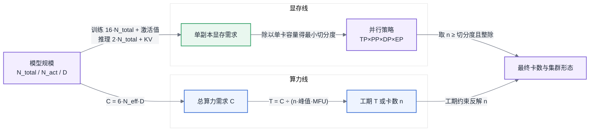

# 第 6 章 模型结构的定量分析

<ChapterContext
  track="主线 A 的训练容量起点；主线 B 的部署与并发容量起点"
  question="同一组模型结构参数，如何推导显存下限、训练工期与推理并发上限？"
  upstream="第 3 章训练激活与 KV Cache；第 4 章精度字节数与 Roofline"
  downstream="第 7 章通信域；第 16 章训练并行；第 22–24 章推理容量与部署"
  inputs="N_total、N_act、L、h、a_kv、V、D，以及精度、MFU、序列长度和 SLO"
  outputs="可替换假设的容量工作表、显存切分下限、理想工期与推理 KV 容量"
/>

## 6.0 先收齐模型七元组与系统假设

同一组模型结构参数，在训练侧决定任务开跑前需要多少卡、可能跑多久，在推理侧决定模型能否装入集群、还能留出多少并发空间。后续的容量规划、并行策略和 SLO 测算，都从这组公式取数。

算术从五个已经定义的事实开始：反向传播保留前向激活值([§3.1](第03章-人工智能与大模型基础.md#31-神经网络与训练三阶段))，优化器决定每参数状态字节数([§3.2](第03章-人工智能与大模型基础.md#32-优化器与超参的-infra-含义))，自回归解码缓存 KV([§3.4](第03章-人工智能与大模型基础.md#34-transformer-与注意力))，数值格式字节数沿用 [§4.3](第04章-硬件第一性原理、架构范式与数值精度.md#43-数值格式与精度全书唯一定义处)，瓶颈判定沿用 [§4.4](第04章-硬件第一性原理、架构范式与数值精度.md#44-roofline-模型) 的 Roofline 模型。这里不重复概念，只把它们放进同一张可替换假设的工作表。

### 6.0.1 两类错算为何方向相反

<CaseMeta
  type="capacity-example"
  data-nature="模型规模、硬件规格与 MFU 均为演示推导过程的合成输入，不代表具体生产任务或产品基准"
  scope="BF16 MoE 推理装载与 70B 稠密预训练的预算初筛"
  assumptions="不计高可用副本、故障停顿和 checkpoint 开销；卡容量按标称 80 GB；训练峰值按每卡 1 PFLOPS、MFU 40%"
  reproducible="visuals/data/ch06-capacity-worksheet.csv；calculators/src/ai_infra_calc/training.py"
/>

先看显存错算。一个 MoE(Mixture of Experts,混合专家)模型总参数为 400B、每 token 激活参数为 37B。若把“推理算力看激活参数”误用到装载容量，按 37B 计算会得到 74 GB BF16 权重；正确的装载账应按总参数计算，即 800 GB。单台 8×80 GB 机器的标称总容量也只有 640 GB，单机方案在加载前就应被排除。

再看算力错算。70B 稠密模型使用 15T token 预训练，总计算量按 $6ND$ 为 $6.3\times10^{24}$ FLOPs。在每卡 BF16 峰值 1 PFLOPS、MFU 40% 的演示假设下，1024 卡的理想计算时长约 178 天，2048 卡约 89 天。用“千卡训练大模型需要数月”的类比再叠加安全系数，无法说明预算究竟来自模型规模、卡性能还是系统效率。

两次错算的共同问题不是算术，而是输入没有分账：显存看 $N_{\text{total}}$ ，稠密训练算力看 $N$ 与 $D$ ，系统效率则来自实测 MFU。先把三类输入分开，估算才允许复核和替换。

<BookFigure
  id="ch06-capacity-worksheet"
  src="../visuals/generated/ch06/capacity-worksheet.svg"
  alt="工作表从结构输入和负载输入开始，经过单卡峰值、MFU 与并行配置假设，分别输出单卡显存、总算力和理想工期"
  title="图 6-1  容量工作表先区分输入性质"
  caption="结构、负载与系统系数必须分栏记录，才能在实测后只替换假设而不重做整套推导。"
  source="容量示例；visuals/data/ch06-capacity-worksheet.csv"
  license="CC BY 4.0"
  width="wide"
/>

## 6.1 算子与瓶颈归属:先知道钱花在哪

第 3 章 [§3.4](第03章-人工智能与大模型基础.md#34-transformer-与注意力) 给了 Transformer 的形状直觉,这里直接用符号。一个标准 decoder 层由两部分构成,记模型隐层维度为 $h$ 、层数为 $L$ 、序列长度为 $s$ 、batch 为 $b$ 、注意力头数 $a$ 、KV 头数 $a_{kv}$(GQA 时 $a_{kv} < a$)、FFN 中间维度 $h_{ff}$(常见 $h_{ff} \approx 2.7h \sim 4h$)、词表大小 $V$:

- **Attention 部分**:QKV 投影($h \to h + 2h \cdot a_{kv}/a$)、注意力得分与加权($s \times s$ 交互)、输出投影($h \to h$);
- **FFN 部分**:两到三个大矩阵乘($h \to h_{ff} \to h$,GLU 变体是三个)。

参数量的近似公式:

$$N \approx L \cdot (4h^2 \cdot \frac{a + a_{kv}}{2a} \cdot \text{修正} + 3h \cdot h_{ff}) + 2Vh$$

工程上不必精确展开,记住主干即可:**对稠密模型,$N \approx 12Lh^2$ 量级**(GLU + GQA 会有 ±20% 修正),外加词表的 $2Vh$ 。适用条件:标准 decoder-only 结构;误差来源:GQA 比例、GLU 与否、是否共享 embedding 与 lm_head。

先把一层里各算子的开销归属列清楚。以 $h = 8192$ 、 $h_{ff} = 28672$ 、GQA 比例 8:1 的典型形状为例,只看 Transformer 主干的矩阵参数与对应矩阵 FLOPs,FFN 通常占约 80% 左右,QKV 与输出投影约 20% 左右;具体比例会随 GQA、SwiGLU、词表和是否计入 attention 交互而变。LayerNorm、旋转位置编码、残差加法等逐元素算子的 FLOPs 占比通常很小——但它们的显存读写次数不少,这就是算子融合(第 23 章)能赚到时间的原因:小算子省的不是计算,是访存。词表投影($h \to V$)在每个 token 上只做一次,对大模型相对较小,对小模型和大词表模型则可能成为显著开销。

知道钱花在哪之后,第二个问题是每一处花的是"算力的钱"还是"带宽的钱"。这用 [§4.4](第04章-硬件第一性原理、架构范式与数值精度.md#44-roofline-模型) 的算术强度(arithmetic intensity,FLOPs/Byte)判定。下面的 FLOPs 与字节数均采用明确的近似口径,实际还要考虑缓存命中、融合和 kernel 实现:

- **FFN 是 compute-bound(算力受限)的候选**:一个 $[b \cdot s, h] \times [h, h_{ff}]$ 的矩阵乘,算术强度约为 $\frac{2 \cdot bs \cdot h \cdot h_{ff}}{2(bs \cdot h + h \cdot h_{ff} + bs \cdot h_{ff})}$;当 $bs$ 增大时,权重读取被更多 token 摊薄,通常更容易超过目标加速卡的 Roofline 拐点,但不能用一个统一的渐近式替代实际 profile。
- **Decode 阶段的 Attention 是 memory-bound(带宽受限)**:每生成一个 token,要把整段 KV Cache 从 HBM 读一遍,却只对当前一个 query 做计算,算术强度约为 $O(1)$ 量级——每读一个字节只做一两次乘加,离拐点差两个数量级。

把这个判定落到数字上。取 $h = 8192$ 、 $h_{ff} = 28672$ 、BF16($p = 2$),对一层里的四种典型情形分别算 FLOPs 与访存量(算术强度 = FLOPs ÷ 读写字节数):

- **Prefill 的 FFN 矩阵乘**($bs = 8192$):FLOPs $= 2 \cdot bs \cdot h \cdot h_{ff} \approx 3.8 \times 10^{12}$,访存 $2(bs \cdot h + h \cdot h_{ff} + bs \cdot h_{ff}) \approx 1.1$ GB,算术强度约 **3600 FLOPs/Byte**——超出主流加速卡数百的 Roofline 拐点一个数量级,坐实 compute-bound。
- **Decode 的同一个矩阵乘**($bs = 1$):FLOPs $= 2 h h_{ff} \approx 4.7 \times 10^8$,但 $h \cdot h_{ff} \cdot 2 \approx 4.7 \times 10^8$ 字节的权重一个不少全要读,算术强度约 **1 FLOPs/Byte**。同一个算子,batch 从 8192 掉到 1,强度掉了三个半数量级——这就是 decode 靠攒 batch 摊薄权重的全部原理:batch 攒到 $b$,强度近似变 $b$,要摸到数百的拐点就需要数百的 batch。
- **Prefill 的注意力得分与加权**($s = 4096$):FLOPs $= 4 s^2 h$;朴素实现要把 $a \cdot s^2$ 的得分/softmax 矩阵写出再读回,访存约 $8 a s^2$ 字节,在本口径下算术强度约为 $h/(2a)=d_{\text{head}}/2=64$ FLOPs/Byte。它可能低于部分加速卡的拐点;FlashAttention 不物化完整 $s^2$ 矩阵,显著减少 HBM 读写,但是否变成 compute-bound 仍需按硬件和形状实测。
- **Decode 的注意力**:每层每 token 计算约 $4sh$ FLOPs,读 KV 约 $2 s \cdot a_{kv} d_{\text{head}} \cdot p$ 字节。MHA($a_{kv} = a$)时强度恰好 1 FLOPs/Byte 量级;GQA 8:1 把 KV 读取压到 1/8,强度升到约 8——好了一个数量级,但离拐点仍差两个数量级,**GQA 缓解带宽压力,不改变 memory-bound 的定性**。

适用条件:BF16、忽略片上缓存复用;误差来源:算子融合与 L2 命中可把有效访存压低 20%~50%,但不足以改变上面任何一条的定性归属——差两三个数量级的判定,对系数级误差免疫,这正是算术强度适合做纸面判断的原因。

由此得出两阶段的定量画像,这是第五部分所有推理优化的出发点:

| 维度 | Prefill(预填充) | Decode(解码) |
|---|---|---|
| 计算形态 | 整段 prompt 并行,大矩阵乘 | 每步一个 token,矩阵乘退化为矩阵-向量乘 |
| 瓶颈归属 | compute-bound | memory-bound(读权重 + 读 KV Cache) |
| 单 token 成本 | $\approx 2N$ FLOPs | $\approx 2N$ FLOPs,但受限于带宽而非算力 |
| 决定性资源 | 峰值算力 | HBM 带宽与容量 |
| 加卡的收益 | 近线性(算力可并行摊薄) | 递减(带宽墙不随 batch 消失) |
| 应观察的利用率 | 目标精度算力利用率/MFU | HBM 带宽利用率；低 MFU 本身不能判定异常 |

这张表还解释了一个常被误读的现象:decode 阶段 MFU 只有个位数不是"没调好",而是 memory-bound 负载的固有属性——它的正确度量是带宽利用率而非算力利用率。用 MFU 去考核推理集群的团队,会把方向带偏到无意义的算力优化上(第 11 章展开这个归因陷阱)。

Decode 的理论吞吐上界可以直接算:单请求下每步要读全部权重,故 **每卡 decode 速度上界 ≈ HBM 带宽 ÷ 权重字节数**。80 GB 卡、3 TB/s 带宽、70B BF16 模型切 4 卡(每卡 35 GB 权重),上界约 $3000/35 \approx 85$ token/s——这个数字算力再强也突破不了,只能靠加大 batch 摊薄权重读取。适用条件:batch 小到权重读取主导;误差来源:KV Cache 读取量、算子融合程度。

顺手把 GQA 的收益算干净,因为它同时改两笔账。KV 显存与每步 KV 读取带宽都正比于 $a_{kv}$,故 GQA 相对 MHA 的收益就是 $a/a_{kv}$ 倍:64 头模型做 8:1 GQA,每 token KV 从 $2 L a \cdot d_{\text{head}} \cdot p = 2.56$ MB(按 [§6.2](#62-参数量与资源换算核心) 算例的 70B 形状)压到 320 KB;一个 128K 上下文请求的 KV 从 335 GB(单卡装不下,部署直接不成立)压到 42 GB(可部署);decode 每步的 KV 读取时间同比例缩短,长上下文下 TPOT 的 KV 项直接除以 8。MQA($a_{kv} = 1$)是这条路的极限档,再往下压就要换 MLA 类压缩结构([§6.3](#63-结构变体的定量代价))。适用条件:只算 KV 一侧,QKV 投影的参数节省(约 $2Lh^2(1 - a_{kv}/a)$)另计;误差来源:$a/a_{kv}$ 的带宽收益只对 KV 读取项成立,权重读取项不受影响——短上下文、小 batch 时权重项主导,GQA 的带宽收益体现不出来,它是为长上下文与大 batch 买的保险。

落到集群规划，训练和 Prefill 先核算算力，Decode 先核算带宽与容量。一套集群的训练/推理配比([§4.2.2](第04章-硬件第一性原理、架构范式与数值精度.md#422-训练型与推理型负载的硬件诉求差异))，实际是在配这两种资源画像。

## 6.2 参数量与资源换算【核心】

这一小节是全书被引用最多的公式组。每个公式都标注适用条件与误差来源。

**公式一:参数量 → 算力。**

$$C_{\text{train}} \approx 6 \cdot N_{\text{eff}} \cdot D \quad \text{FLOPs}, \qquad C_{\text{infer}} \approx 2 \cdot N_{\text{act}} \quad \text{FLOPs/token}$$

其中 $D$ 是训练 token 总数,$N_{\text{act}}$ 是**每 token 激活参数量**(稠密模型 $N_{\text{act}} = N$),$N_{\text{eff}}$ 是训练时用于一阶算力估算的有效参数量;对 MoE 应以激活专家、共享层和 router 的实际计算为基础,不能直接使用总参数。6 的由来值得拆开一次,因为它是 Dense 模型的基准:前向约 $2N$,反向约 $4N$,合计约 $6N$/token。重计算、注意力、词表投影、MoE 路由和通信都需要另加修正。适用条件:decoder-only、标准 Dense 结构且注意力项相对较小。长上下文时应显式加入标准注意力的 $O(Ls^2h)$ 项;准确系数取决于 FLOPs 统计口径和具体 kernel,FlashAttention、滑动窗口、稀疏注意力和 MLA 会改变实际账目。

推理的 $2N_{\text{act}}$ 在两个阶段含义不同,混用会算错 SLO。**Prefill 阶段它是真实的时间账**:一段 $s$ token 的 prompt 花 $2 N_{\text{act}} \cdot s$ FLOPs,可完全并行,TTFT 下界 $\approx 2 N_{\text{act}} s / (n \cdot P_{\text{峰值}} \cdot \text{MFU})$,加卡近线性缩短。**Decode 阶段它只是电费账**:每 token 同样记 $2N_{\text{act}}$ FLOPs,但时间不由 FLOPs 决定,而由 [§6.1](#61-算子与瓶颈归属先知道钱花在哪) 的带宽上界决定——TPOT 下界 $\approx$ 每卡(权重 + KV)字节数 ÷ HBM 带宽,与算力几乎无关。同一个 $2N$,prefill 拿它配算力,decode 只拿它算功耗与成本,拿它去推 decode 延迟必错。适用条件:prefill 侧要求 $b \cdot s$ 足够大使 MFU 接近训练水平;误差来源:长 prompt 下注意力修正项对 prefill 同样适用。

这层两阶段差异必须再落成一条**成本换算**,因为第 27 章的计费口径和第 31 章的 QPS→卡数推导链都建立在它上面(伏笔埋在 [§3.3](第03章-人工智能与大模型基础.md#33-从-nlp-到-llm)):**输入 token 与输出 token 不是同一个成本单位**。输入 token 走 prefill,compute-bound 且高度可并行,一次算一段、按 prompt 长度累积,单位成本低;输出 token 走 decode,memory-bound 且逐 token 串行,每个 token 都要把权重与历史 KV 重新过一遍带宽,单位成本按机时折算通常比输入 token 高一个数量级——这也是主流 API 定价输出显著贵于输入的资源根源,不是定价策略的任性。第三个状态是**缓存命中的输入 token**:前缀命中时这段 prompt 不再付 prefill 算力,只付 KV 的显存驻留与读取(机制与命中率工程见第 24 章),成本再降一个档。因此容量与计费的最小请求画像不是"多少 token",而是三元组 **(输入 token 数, 输出 token 数, 前缀命中率)**——第 31 章按它折卡数,第 27 章按它设计费与限流,两处共用本节口径。

反推训练时长:

$$T = \frac{6N_{\text{eff}}D}{n_{\text{卡}} \cdot P_{\text{峰值}} \cdot \text{MFU}}$$

MFU(Model FLOPs Utilization,模型算力利用率)是实测有效算力与峰值之比。预算初筛可以暂填同类任务的历史值，本章容量示例取 40%；新模型结构、长上下文或新集群必须先跑小规模任务回填。**MFU 是这条公式里需要实测的系统系数，也是最大的误差来源**——假设 60% 而实测只有 30%，工期就相差一倍。

**公式二:参数量 → 显存。** 先按 BF16 混合精度 + Adam 记账：

$$\text{静态显存} = \underbrace{2N}_{\text{BF16 权重}} + \underbrace{2N}_{\text{BF16 梯度}} + \underbrace{4N + 4N + 4N}_{\text{FP32 主权重 + Adam 一阶/二阶矩}} = 16N \ \text{bytes}$$

适用条件:Adam 系、混合精度、未做任何切分；字节数定义见 [§3.2](第03章-人工智能与大模型基础.md#32-优化器与超参的-infra-含义) 与 [§4.3](第04章-硬件第一性原理、架构范式与数值精度.md#43-数值格式与精度全书唯一定义处)。误差来源:优化器换成 SGD 变 8N、8-bit Adam 变 10N；ZeRO-2 会把梯度与优化器状态摊到 $n$ 张 DP 卡上,单卡变为 $2N + 14N/n$ ，ZeRO-1/3 则使用不同公式。推理态则简单:BF16 为 $2N$ 、FP8/INT8 为 $N$ 、INT4 约 $0.55N$(含量化元数据)。

**公式三:激活值显存**(为什么必须保留见 [§3.1](第03章-人工智能与大模型基础.md#31-神经网络与训练三阶段))。无重计算时,每层每 token 的激活值约:

$$A \approx L \cdot b \cdot s \cdot h \cdot \left(34 + 5\frac{a \cdot s}{h}\right) \ \text{bytes(BF16)}$$

适用条件:标准 MHA 结构、BF16,且 34 与 5 的系数采用本节的统计口径。误差来源:GQA、GLU、FlashAttention、融合策略和运行时保存集合。对 FlashAttention 等不物化完整 attention 矩阵的实现,主要激活项近似随 $bsh$ 线性增长;朴素注意力还会出现随 $bs^2$ 增长的中间矩阵项。激活值是训练显存中最容易随 batch 与序列长度放大的部分,也是可以用重计算换取的主要项目。TP 度数为 $t$ 时能否整体除以 $t$,还取决于激活切分和实现。

$$A_{\text{无重计算}} \approx 34 \cdot Lbsh, \qquad A_{\text{选择性}} \approx (8 \sim 13) \cdot Lbsh, \qquad A_{\text{完全}} \approx 2 \cdot Lbsh$$

代入算例形状($L=80$ 、 $b=1$ 、 $s=4096$ 、 $h=8192$),三档分别约 91 GB、21~35 GB、5.4 GB(TP 切分前,沿用本节系数口径)。换回来的代价用 6N 拆解只能得到方向,不能给出所有框架通用的固定比例:完全重计算通常增加前向重算开销,选择性重计算的代价取决于重算集合和 kernel。适用条件:同公式三;误差来源:各框架"选择性"的选择集不同,8~13 的系数必须以实测为准,纯估算时取 13 偏保守。

激活值还有一个训练态特有的放大项:流水线并行(PP)下,处于流水线前段的卡要同时驻留多个 in-flight micro-batch 的激活值,驻留份数约等于流水线段数——这就是为什么 PP 度数越深、第一段卡的激活显存压力越大,1F1B 类调度(第 16 章)正是为压这个份数而生。估算时用"激活值 × in-flight 份数"修正,漏掉这一项是 PP 配置 OOM 的头号原因。

**公式四:KV Cache。** 每 token 记为：

$$M_{\text{KV/token}} = 2 \cdot L \cdot a_{kv} \cdot d_{\text{head}} \cdot p \ \text{bytes}$$

系数 2 是 K 和 V 各一份,$p$ 是每元素字节数，推导见 [§3.4](第03章-人工智能与大模型基础.md#34-transformer-与注意力)。总量随 $b \times s$ 严格线性增长。适用条件:标准注意力;误差来源:MLA 类压缩结构可降一个数量级,滑动窗口注意力会封顶。

**公式五:MoE 的总参数/激活参数分离——Infra 侧最容易算错的一处。**

$$\text{显存看总参数 } N_{\text{total}}, \qquad \text{算力看激活参数 } N_{\text{act}}$$

所有专家属于逻辑权重,因此总存储和 checkpoint 按 $N_{\text{total}}$ 估算;实际部署中权重可以分布在多卡、CPU 内存或外部存储,是否能按需调入取决于访问模式和 SLO。每个 token 通常只流经 top-k 个专家,但 router、共享层、padding、通信和负载不均也要计入有效计算。开篇场景的第一个错误就在这里:400B/37B 的模型,权重存储按 400B 算(BF16 权重约 800 GB),算力初筛按 37B 激活参数算。**记忆口诀:装下它看总参,喂饱它看激活。**

**公式六:Scaling 与算力预算。** 给定预算 $C$(FLOPs)，不同 scaling 策略会给出不同的 $(N,D)$ 配比； $D\approx20N$ 只能作为特定研究假设下的参照线，不能替代项目自己的模型目标、数据约束与推理成本策略。平台方不替算法方选配比，而是把已确认的 $(N,D)$ 折成集群规模与工期：Dense 模型可用 $C\approx6ND$,MoE 则应使用有效参数量并加上路由、共享层和通信修正，除以 $(n\cdot P\cdot\text{MFU})$ 得工期，固定工期则反解 $n$ 。预算评审应记录所采用的 scaling 假设及来源，避免把一条经验线写成普遍门槛。

> 延伸阅图:Kaplan et al., 《Scaling Laws for Neural Language Models》(arXiv:2001.08361,<https://arxiv.org/abs/2001.08361>)图 1 —— 经典三联图:测试损失分别随算力 C、数据量 D、参数量 N 在对数坐标下呈现跨越多个数量级的幂律直线,是"给定预算 C 反推 (N, D) 配比"这套算术的实证起点。

以上换算都是容量规划的一阶模型,不是账单或 SLO 的最终值。正式评审还应单列通信缓冲、算子 workspace、显存分配碎片、checkpoint/故障恢复副本、KV Cache 与服务并发等项目,并把峰值、稳态和安全余量分开记录。每个结论至少同时注明公式口径、形状假设和实测校准值,否则不同团队拿同一个“卡数”数字比较时很容易发生口径错位。

这条换算还有一个常被忽略的推论:**算力预算决定的是 $(N, D)$ 的乘积,而集群形态决定的是能否把这笔预算在可接受的工期内花掉**。同样 $10^{25}$ FLOPs 的预算,2000 卡花三个月和 500 卡花一年,在算法上等价,在工程上完全不等价——后者要穿越四倍长的故障暴露窗口(第 20 章),checkpoint 与容错的成本占比会显著上升。工期不只是日程问题,它本身就是可靠性参数。

**规模谱系表**(全书翻得最勤的一页;单卡按 80 GB 显存档位估,具体硬件参数见附录):

| 规模档 | 典型形态 | BF16 权重 | 推理最小部署形态 | 训练形态(混合精度) | 备注 |
|---|---|---|---|---|---|
| 0.5–3B | 稠密 | 1–6 GB | 单卡(可与他人共卡) | 单机多卡 DP | 端侧/嵌入场景主力 |
| 7–9B | 稠密 | 14–18 GB | 单卡 | 单机 8 卡 | 微调实验主力档 |
| 13–34B | 稠密 | 26–68 GB | 单卡(量化)~2 卡 | 单机 8 卡 + ZeRO | 单卡的边界档 |
| 70–72B | 稠密 | 140 GB | 单机 2–4 卡 TP | 多机,TP×PP×DP | 本章算例档 |
| 100–250B | MoE(激活 10–30B) | 200–500 GB | 单机 8 卡 | 多机 + EP | 显存下单机、算力像 20B |
| 400–700B | MoE(激活 20–40B) | 0.8–1.4 TB | 2–4 机(或 1 超节点) | 数百至数千卡 | 域边界开始决定成败(第 7 章) |
| 1T+ | MoE | >2 TB | 超节点级 | 万卡级 | 与其说部署模型不如说部署系统 |

**权重格式与分发**:对外分发应优先选择支持安全反序列化和分片加载的格式；若使用 pickle 类格式，必须把任意代码执行风险纳入供应链控制。分片大小取决于加载器、对象存储吞吐、失败重试粒度和单卡余量，“不超过单卡显存的 1/4”只能作为待压测的起点。加载耗时下界 = 权重体积 ÷ min(磁盘带宽, 网络带宽, 主机到卡带宽)：800 GB 权重走 25 GbE 链路，忽略协议开销的下界约 256 秒。**权重体积除以有效分发带宽，是冷启动时间的物理下界**，缓存与 P2P 只能改变有效带宽和源站压力。

六条公式把双方的接口压缩为一张工作表：算法侧确认 $(N_{\text{total}},N_{\text{act}},L,h,a_{kv},V,D)$ ，平台侧补精度、硬件规格和实测系数，再分别输出卡数、工期与部署形态。

### 6.2.1 完整算例:70B 稠密模型从头算一遍

<CaseMeta
  type="capacity-example"
  data-nature="70B 结构、15T token 与硬件规格均为可替换的演示输入；输出是公式估算，不是训练承诺"
  scope="BF16 混合精度 Adam 预训练与 BF16 推理容量初筛"
  assumptions="TP8×PP4×DP32；静态显存先按未启用 ZeRO 的保守配置；MFU 40%；不计故障、checkpoint 与维护停顿"
  reproducible="visuals/data/ch06-capacity-worksheet.csv；visuals/data/ch06-training-memory-waterfall.csv；calculators/src/ai_infra_calc/"
/>

设定一组 70B 档的演示输入:$N = 70\text{B}$,$L = 80$,$h = 8192$,$a = 64$,$a_{kv} = 8$(GQA),$d_{\text{head}} = 128$,$h_{ff} = 28672$,$V = 128\text{K}$,训练 $D = 15\text{T}$ token,序列长度 $s = 4096$ 。集群假设:单卡 80 GB HBM、BF16 稠密峰值 1 PFLOPS、HBM 带宽 3 TB/s；三个硬件数字都是占位输入，落项时替换为候选设备的同口径规格和实测值。

**第一步:训练显存。**
- 静态部分： $16N=1120$ GB。先按未启用 ZeRO 的保守配置计算，TP=8、PP=4 后每卡静态状态约 $1120/32=35$ GB；其中 BF16 权重与梯度各 4.375 GB，FP32 主权重和 Adam 一、二阶矩各 8.75 GB。若启用 ZeRO，必须按 stage 与 DP 度数重算，不能继续沿用 35 GB。
- 激活部分：公式三给出单份激活的量级，但 PP 前段还可能同时驻留多个 in-flight micro-batch。容量示例暂取选择性重计算后 5 GB/卡，并把 6 GB 留给通信缓冲、分配器和运行时；这两个橙色项必须通过目标框架实测替换。
- 合计占用约 46 GB，80 GB 卡还剩约 34 GB 未分配余量。**TP8×PP4×DP32=1024 卡因此只是一个可进入小规模验证的起点，不是已承诺配置。**

<BookFigure
  id="ch06-training-memory-waterfall"
  src="../visuals/generated/ch06/training-memory-waterfall.svg"
  alt="八十 GB 单卡容量依次分给权重、梯度、主权重、Adam 两组状态、激活和运行时预留，最后留下三十四 GB 未分配余量"
  title="图 6-2  训练显存从公式项扣到待实测项"
  caption="公式只确定静态状态，激活与运行时预留必须由目标框架实测替换。"
  source="容量示例；visuals/data/ch06-training-memory-waterfall.csv"
  license="CC BY 4.0"
  width="wide"
/>

**第二步:训练算力与工期。**
$$C = 6 \times 70 \times 10^9 \times 15 \times 10^{12} = 6.3 \times 10^{24} \ \text{FLOPs}$$
1024 卡、MFU 40%:$T = 6.3 \times 10^{24} / (1024 \times 10^{15} \times 0.4) \approx 1.54 \times 10^7$ 秒 ≈ **178 天**。2048 卡的理想计算时长约 89 天。两者都未计故障、checkpoint 和维护停顿；墙钟工期还要除以有效训练时间占比，这与仓库 `training_time` 计算器的口径一致。

**第三步:单步通信量**(通信原语定义见第 7 章,这里只算量)。全局 batch 取 16M token,单步:
- **DP 梯度 AllReduce**:每 DP 组内每卡收发约 $2 \cdot \frac{K-1}{K} \cdot 2N_{\text{shard}}$ 字节。TP8×PP4 切分后每卡持有梯度 $140/32 = 4.4$ GB,DP=32 时每卡每步通信约 $2 \times \frac{31}{32} \times 4.4 \approx 8.5$ GB——走跨机网络,这是梯度同步必须与计算重叠的原因。
- **TP 激活 AllReduce**:每层前向 2 次 + 反向 2 次,每次约 $b \cdot s \cdot h \cdot 2$ 字节 = $1 \times 4096 \times 8192 \times 2 = 64$ MB;80 层 × 4 次 × ring 系数 1.75 ≈ 每 micro-batch **36 GB**。这个量级只有卡间高速互联扛得住——**TP 不出域**(第 7 章展开)的结论,根源就是这笔账。
- **PP 点对点**:每 micro-batch 每段边界传 $b \cdot s \cdot h \cdot 2 = 64$ MB,量小,对带宽不敏感、对气泡敏感。

**第四步:推理侧。** 4 卡 TP 部署,每卡权重 35 GB,暂留 40 GB 给 KV Cache。每 token KV:$2 \times 80 \times 8 \times 128 \times 2 = 320$ KiB。若四卡合计可用 KV 池按 160 GiB 计，可容纳约 512K token，也就是理论上 128 个 4K 上下文；实际还要扣除运行时预留、碎片和输出增长。Decode 带宽下界:每步读权重 35 GB/卡 ÷ 3 TB/s ≈ 12 ms，对应忽略 KV 读取与通信时约 85 token/s。batch 增大后权重读取可以摊薄，但 KV 读取和调度开销会上升，聚合吞吐必须由压测给出。

这套四步算法适用于任何稠密模型;MoE 只需在第一步用 $N_{\text{total}}$ 、第二步用 $N_{\text{act}}$ 、第三步补 All2All 项(见下节)。四步算完之后,还有一个必须诚实标注的部分:**哪些数字是算出来的,哪些是假设进去的**。上面的推导里,结构参数与公式是硬的,MFU 40%、选择性重计算的压缩比、留给通信缓冲的余量是软的——它们来自同类任务的经验区间。把估算交出去时,软数字必须单独列成假设清单,否则三个月后实测 MFU 只有 32%、工期滑到 220 天时,没人分得清是估算方法错了还是假设失准了。**估算的可信度不在于数字多精确,而在于每个数字的来源可追溯**。

图 6-3:训练与推理的显存三分构成。要记住的一件事:静态部分(权重/梯度/优化器)是可切分的常量,而红色的激活值与 KV Cache 是随负载线性增长的变量——容量规划的余量必须留给后者。
<!-- source: diagrams/sources/ch06-memory-composition.excalidraw -->

图 6-4:从参数量到卡数的推导链(本章方法论主图)。要记住的一件事:算力线决定卡数的下限、显存线决定切分方式,两条线在"卡数"处会合并取较大者——只算其中一条线的估算必错。

## 6.3 结构变体的定量代价

结构变体会打破稠密模型的比例经验；下面只追踪被改变的那一本账。

**MoE:负载不均与 All2All。** 路由是统计行为,专家负载可能偏离均匀分布。刻画指标是**负载比** $\rho = \max_e(\text{tokens}_e) / \text{mean}_e(\text{tokens}_e)$:同步训练里一步的耗时由最慢的专家决定,故有效算力近似除以 $\rho$——$\rho = 1.5$ 意味着这一项约打 67 折。容量因子(capacity factor)封顶和辅助均衡损失可用于约束偏斜，代价是溢出 token 被丢弃、旁路或转为动态形状。容量因子 CF 定义为每专家槽位数相对均匀分配的放大倍数,每专家槽位 $= \text{CF} \cdot k \cdot T / E$($T$ 为本批 token 数、 $E$ 为专家数、 $k$ 为 top-k)。负载为均值 $\rho_e$ 倍的专家,其局部溢出比例为 $\max(0,\ 1 - \text{CF}/\rho_e)$ ；例如 CF=1.25、最热专家 $\rho = 1.5$ 时，该专家有 1/6 路由 token 超过槽位上限，全局比例则取决于完整路由分布，不能由这一点反推。采用 dropless 路由可以避免丢弃，但会把代价转成动态形状、算子效率和负载尖峰。All2All 通信量:每层每 token 收发 $2 \cdot k \cdot h \cdot p$ 字节(dispatch + combine),反向再来一遍。按算例的 $h$ 、top-2、BF16、每卡每 micro-batch 4096 token:每层约 268 MB,若有 60 个 MoE 层则约 16 GB/micro-batch；是否落到跨域链路要由 EP 放置决定。

> 延伸阅图:Fedus et al., 《Switch Transformers: Scaling to Trillion Parameter Models with Simple and Efficient Sparsity》(arXiv:2101.03961,<https://arxiv.org/abs/2101.03961>)图 2 —— Switch 层的 token 路由图:router 给每个 token 打分后只送往单个 FFN 专家,专家分布在不同设备上,一眼看清本段"负载不均 + All2All 通信"两个问题的物理来源。

**长上下文:显存墙触碰点。** 长上下文的代价有两笔:Prefill 算力的注意力项(前文已给,$s$ 超过 $h$ 量级后按 $12Lsh$ 补)按 $s^2$ 增长,一次 128K 的 Prefill 相当于几十次 4K 的 Prefill;但真正先触墙的通常是 KV Cache。线性公式(公式四)可以直接解出触墙点:算例模型 4 卡部署、160 GB KV 预算、320 KB/token,单请求上下文到 512K token 时 KV 就吃光全部预算——batch 掉到 1,吞吐崩塌。这就是"支持 1M 上下文"的宣传与"1M 上下文的账单"之间的换算:上下文长度每翻一倍,同等吞吐所需的显存(也就是卡数)近似翻一倍。适用条件:标准 GQA;MLA 类结构可把系数压 4–8 倍,滑动窗口把线性变常数,评估长上下文方案第一件事就是问清注意力结构。

这里还差一个判定:长上下文下,KV 与激活值谁先触墙?两个场景答案相反。**推理侧几乎总是 KV 先触墙**:KV 是常驻量,随 $s$ 线性累积且伴随请求全程;推理激活是瞬态量,逐层复用,峰值约 $\kappa \cdot b s h p$($\kappa$ 为框架驻留系数,经验区间 10~20,与 $L$ 无关)。判定式:每 token KV 超过每 token 激活瞬态,当 $2 L \cdot a_{kv} d_{\text{head}} > \kappa h$ 。算例形状左边 $2 \times 80 \times 8 \times 128 \approx 164\text{K}$,右边 $\kappa h \approx 160\text{K}$,看似同量级——但 KV 是累积的、激活是滑动的,请求越长、并发越高,KV 的领先越大;只有 MLA 类结构把左边压掉一个数量级后,不等式才可能翻转,那时长上下文的容量瓶颈才轮到激活与通信缓冲。**训练侧没有 KV Cache**(K/V 本身就是被保留激活值的一部分),触墙的是公式三的激活项,可直接解出显存约束下的最大序列长度:$s_{\max} \approx M_{\text{激活预算}} \cdot t / (34 L b h)$(无重计算、TP=$t$)。算例每卡留 20 GB 激活预算、TP=8,$s_{\max} \approx 7\text{K}$——这就是长上下文训练必须叠加重计算与序列并行(第 16 章)的算术根源:不开这两样,主流形状连 8K 都训不了。适用条件:标准结构、FlashAttention;误差来源:$\kappa$ 随推理框架的显存池策略波动,需实测;训练侧公式取无重计算档,开重计算后 $s_{\max}$ 按公式三的档位同比放大。

**注意力变体:GQA / MQA / MLA 的 KV 压缩比。** KV Cache 的每 token 字节数正比于 KV 头数 $a_{kv}$(公式四的 $2 L \cdot a_{kv} d_{\text{head}} \cdot p$),注意力变体改的正是这个一等参数。以 MHA($a_{kv} = a$)为基线,定义**KV 压缩比** $r = a / a_{kv}$:GQA 让若干查询头共享一组 KV 头,主流配置 $r$ 在 4~8(算例的 $a=64$ 、 $a_{kv}=8$ 即 $r=8$);MQA 全部查询头共一组 KV, $r = a$ ,压缩最狠但质量代价也最先显现;MLA 不减头数而是把 KV 投影到低秩潜空间,按潜维与头维的比值折算,相对 MHA 的等效压缩常达一到两个数量级,且缓存的是潜向量,解码时需额外的升维计算。 $r$ 直接乘在推理容量上:同一显存预算下可承载的并发或上下文长度近似乘 $r$ ,长上下文触墙点(上文)、第 22 章的 KV 显存账、第 24 章的缓存复用收益、第 31 章的并发估算全部要先问清 $r$ ——**接入一个新模型,先查注意力结构与 $a_{kv}$ ,再谈容量**。适用条件:按公式四口径;误差来源:MLA 的等效压缩比依赖具体潜维配置,量化 KV 会在 $p$ 上再叠一层,不能与 $r$ 重复计。

**大词表:小模型的隐性大头。** embedding + lm_head 共 $2Vh$ 参数($V = 128\text{K}$ 、 $h = 8192$ 时为 2.1B)。对 70B 模型占 3%,无关痛痒;对 1.5B 小模型($h = 2048$)则是 0.52B,**占总参数三分之一**——小模型的显存与加载估算若套大模型的比例经验,这一块就是主要误差源。

结构评审至少要补四笔修正账：MoE 的路由通信与偏斜、长上下文的注意力与 KV、注意力变体的 KV 压缩比、小模型的大词表占比。它们分别打破稠密模型的通信、显存、并发和参数比例经验。

## 6.4 多模态的定量画像

多模态模型仍可拆为三段(见 [§3.5](第03章-人工智能与大模型基础.md#35-模型谱系)):模态编码器(如 ViT)→ 投影/适配层 → LLM 主干。容量估算不能先假定“头轻身重”，而应分别读取编码器与主干参数量，再把图像、视频或音频转换后的 token 数写入主干账。若两段的瓶颈和 batch 策略不同，再比较合卡部署与独立扩缩；是否省卡由目标模型与流量压测决定。

**token 膨胀系数**是多模态推理估算的必填输入，但没有跨模型通用档位。应从目标模型的处理器配置或 tokenizer 统计中取得每张图、每帧视频或每秒音频进入主干的 token 数，并按线上 P50/P95 请求画像计算。后面的完整算例只为演示换算，暂取 1024 token/图；换模型时必须替换。

**完整算例:给 [§6.2](#62-参数量与资源换算核心) 的 70B 换上眼睛。** 设定:主干沿用 [§6.2](#62-参数量与资源换算核心) 算例的 70B(4 卡 TP 部署,每卡权重 35 GB、KV 预算共 160 GB),外挂 2B 视觉编码器(BF16 权重 4 GB),膨胀系数取 1024 token/图。请求画像:8 张图 + 300 token 提问,进入主干 $8 \times 1024 + 300 \approx 8.5\text{K}$ token。

- **Prefill 算力**:主干 $2 \times 70 \times 10^9 \times 8.5 \times 10^3 \approx 1.2 \times 10^{15}$ FLOPs;编码器 $2 \times 2 \times 10^9 \times 8192 \approx 3.3 \times 10^{13}$ FLOPs,占比不足 3%——"头轻身重"的数字版。4 卡、MFU 50%,TTFT 下界 $\approx 1.2 \times 10^{15} / (4 \times 10^{15} \times 0.5) \approx 0.6$ 秒,是同模型 500 token 纯文本请求的 17 倍——用户看到的是"发张图怎么这么慢",平台看到的是 prefill 配额被膨胀系数吃掉。
- **KV Cache**:$8.5\text{K} \times 320\ \text{KB} \approx 2.7$ GB/请求。160 GB 预算的并发从纯文本 4K 上下文的 128 掉到约 59;若 16 张图再叠子图切分,单请求 KV 超 10 GB,并发掉到十几。**同一套 4 卡部署,并发容量随请求里的图片数波动一个数量级**——这就是容量必须按膨胀后 token 分布而非请求数做的算术证明。
- **显存增量**:编码器权重 4 GB 加图像预处理缓冲,约占 4 卡总显存 2%,可忽略;多模态的显存增量几乎全在 KV,不在新增的模型部件上。

适用条件:膨胀系数按均值 1024 取,动态分辨率场景按 P95 重算;误差来源:编码器与主干合卡部署时的相互干扰(编码器是高并发小 batch、主干是大 batch,两者调度冲突),估算给不出,需压测定界。

多模态容量表的输入应是“处理后的 token 分布”，而不是请求数。没有该分布时，KV 容量与 Prefill 配额只能标成待测，不能进入 SLO 承诺。

## 6.5 训练范式的资源画像量化

四阶段的定性画像见 [§3.6](第03章-人工智能与大模型基础.md#36-训练范式全景),这里给量级(以 70B 档为参照):

| 范式 | 数据量级(token) | 算力量级 | 通信模式 | 资源潮汐 |
|---|---|---|---|---|
| Pretrain | $10^{13}$ | $6ND \sim 10^{24\text{–}25}$ FLOPs | 全并行组满载、稳态 | 无潮汐,数月恒定满载 |
| CPT | $10^{11\text{–}12}$ | Pretrain 的 1%–10% | 同 Pretrain | 周级任务,可排队调度 |
| SFT | $10^{8\text{–}9}$ | Pretrain 的 0.01% 量级 | 常可退化到单机/少机 | 天级任务,适合潮汐填谷 |
| RL(RLHF/RLVR) | rollout 生成量主导 | 生成:更新 ≈ 4:1 至 10:1 | 训推混合:推理引擎 + 训练引擎 + 权重同步 | 集群内自带潮汐,生成与更新交替 |

这张表的每一行都可以用本章公式独立验证:SFT 的算力为什么通常只有 Pretrain 的很小一部分?因为 Dense 模型的 $C \approx 6ND$ 中 $N$ 不变而 $D$ 大幅缩小。CPT 的数据量减少并不自动降低全参数单副本的静态显存门槛,但它可以结合 LoRA、量化、不同 TP/PP 配置、offload 或更小 batch 改变实际卡数;**"数据少了所以卡必然能少"是 CPT 需求评审里的错误推断**,应先区分全参数和参数高效方案。

RL 是其中对平台冲击最大的一档:它把一条推理链路(rollout 生成)嵌进训练任务里,算力大头在**推理态**的采样生成,还要周期性把新权重从训练引擎推送到推理引擎(每次全量 $2N_{\text{act}}$ 级别的传输)。它的资源画像同时具备训练的显存结构(16N 静态)和推理的带宽结构(生成阶段 memory-bound),两套画像在同一集群里按分钟级交替。用纯训练的画像去规划 RL 任务,算力配比和网络规划都会错位——这是第四部分 RL 基础设施章节的入口问题。[§3.6](第03章-人工智能与大模型基础.md#36-训练范式全景) 区分的两种 RL 形态在量化上也分开:单轮偏好优化的 rollout 轨迹短且长度集中,生成阶段接近可控的批量推理;多轮 agentic rollout 要再加两笔账——环境服务的算力(沙箱/执行器以 CPU 为主,但实例数随并发轨迹线性增长)和轨迹长度的重尾(批内等待由 P99 轨迹决定,同步方案的有效利用率随轨迹方差恶化,这正是异步化的定量动机,方案在第 21 章)。

这四类任务不应只贴统一的“训练”标签。调度侧至少要区分长稳态训练、短周期微调和训推交替任务，再用实测阶段画像决定独占、排队或填谷策略。

## 6.6 三种估算方法各自在哪失效

平台方拿到一个新模型的资源问题,有三条路线,必须知道各自在哪失效。

**方案一:静态公式估算(本章方法)。** 成本低，适合快速给出量级。**失效边界**:(1)MFU 与负载比 $\rho$ 这类系统效率量公式给不出；(2)新注意力或路由结构可能使系数假设失效；(3)碎片、通信缓冲和框架开销只能预留。未回填历史测量时，应给敏感性区间而不是统一宣称固定精度；它适用于预算初筛，不适用于承诺 SLO。

**方案二:小规模实测外推。** 用缩小层数、卡数或数据量的任务测 MFU、单步时间和显存水位，再按公式外推。**失效边界**:通信跨过域边界后可能非线性恶化，MoE 偏斜会随专家数和数据分布改变，低流量也暴露不了长尾。外推跨越互联层级时，必须对通信项单独建模；误差范围由缩放实验本身给出，不能预设为 ±10%。

**方案三:目标规模 profiling 压测。** 按目标配置运行，用 [§5.4](第05章-CUDA、CANN与加速器软件栈.md#54-profiling-方法论全书唯一定义处) 的方法取得时间线。它最接近交付配置，适合形成 SLO 证据。**失效边界**:成本高且要求资源已经到位，因此不能单独回答采购前的“该买多少卡”；结果还绑定框架版本、模型版本和请求分布，变更后要重新确认。

正确用法是三段接力:公式定量级 → 小规模定系数 → 全量压测定承诺。三段的分工也划出了协作边界:方案一的输入(结构参数)由算法方提供且必须书面确认——总参数与激活参数报错一个,后果由报数方承担;方案二、三的系数(MFU、负载比、长尾分布)由平台方实测并归档,成为下一次方案一的经验库。这条边界不立,估算失准时就会陷入"算法说平台不会算、平台说算法没报全"的循环举证。只用方案一去签 SLO、或只信方案三而丧失快速判断能力,都是失格的平台方。

## 6.7 Spark 容量估算能迁移哪些方法

本章做的事情——从作业结构静态推算资源——在大数据时代有直接的对应物,但迁移时三处失效。

**直接复用的部分**:Spark 时代成熟的容量规划方法论完全平移。"按 shuffle 量估 executor 内存、按分区数估并行度、按数据量估作业时长"的思维方式,与本章"按参数量估显存、按 token 量估算力"结构同源;"预留 memoryOverhead"对应本章的碎片与通信缓冲预留;"用采样作业估全量作业"对应方案二的小规模外推。做过 Spark 容量规划的人学本章只是换一套公式。

**第一处失效:估错的代价从渐变变成突变。** Spark executor 内存估小了,代价是 spill 落盘、作业变慢,通常还能跑完;显存估小了 1 GB,代价是 OOM 即刻退出,没有"慢慢跑完"这个选项。大数据的资源估算可以粗糙,因为系统有降级路径;显存估算必须精确到 GB,因为显存墙([§4.1.3](第04章-硬件第一性原理、架构范式与数值精度.md#413-hbm显存墙的物理来源))是硬边界。这也是本章公式必须细到"每参数字节数"的原因——Hadoop 时代没有人需要算到这个粒度。

**第二处失效:资源画像从"作业属性"变成"作业 × 阶段属性"。** 一个 MapReduce 作业的资源画像大体均匀;而一次训练在前向/反向/梯度同步之间、一次推理在 Prefill/Decode 之间,瓶颈资源完全不同([§6.1](#61-算子与瓶颈归属先知道钱花在哪) 的两张画像)。用单一数字描述 AI 任务的资源需求,就像用平均水深描述一条有瀑布的河。

**第三处失效:数据量不再是第一自变量。** 大数据估算的主输入是数据量;AI 估算的主输入是模型结构($N$ 、 $L$ 、 $h$ 、 $a_{kv}$),数据量 $D$ 只出现在训练工期一处。同样 15T token,喂 7B 和喂 70B 是相差 10 倍的两个任务;而同样一个 Hive 表,谁来查都是那个量级。**平台方的估算依据从"看数据"变成"看模型",这是需要主动扭转的直觉**。

还有一处对照值得单独说:大数据时代也有"静态估算 vs 实测压测"之争,但那时静态估算的地位低——因为 Spark 作业的执行计划受数据倾斜、谓词下推、shuffle 实现等运行期因素支配,静态分析很难算准,大家默认"跑一遍才知道"。AI 负载的 Transformer 计算图通常更规则,这使得静态公式可以先给出有用量级,但 shape、MoE 路由、通信、融合、频率和运行时策略仍会带来偏差,不能预设统一误差百分比。**这是 AI Infra 送给平台方的一份可复核的估算工具**:先算再测,而不是用公式替代压测。

## 6.8 显存线与算力线必须同时过

把本章公式串成一条可执行的判断路径。入口是向算法方索要模型七元组($N_{\text{total}}$ 、 $N_{\text{act}}$ 、 $L$ 、 $h$ 、 $a_{kv}$ 、 $V$ 、 $D$)——注意这七个数都在模型的配置文件里,不需要任何集群就能拿到;出口是卡数量级与部署形态,交给第 16 章(训练并行)或第 24 章(推理部署)细化。走图时的两条纪律:第一,训练分支的显存线与算力线必须都走完,只走一条的结论无效;第二,任何一步用到了经验系数(MFU、 $\rho$ 、膨胀系数),就在结论上标注"待实测",不得直接进入 SLO 承诺:

图 6-5:"给定模型和 SLO,我需要多少卡"决策树。要记住的一件事:训练卡数取显存线与算力线的较大者,推理卡数取"装得下"之后再按 SLO 的具体瓶颈维度(算力/带宽/容量)加卡——先问装不装得下,再问跑不跑得快。

## 6.9 名词解释

| 术语 | 释义 | 详见 |
|---|---|---|
| 模型七元组 | 容量估算的全部结构输入:N_total、N_act、L、h、a_kv、V、D,都能从模型配置文件直接取得 | §6.8 |
| N_total / N_act / N_eff | 总参数量(定显存与存储)/ 每 token 激活参数量(定推理算力)/ 训练算力估算的有效参数量(MoE 含激活专家、共享层与 router) | §6.2 |
| 6ND / 2N | 训练与推理的一阶算力换算:训练每 token 约 6N FLOPs(前向 2N + 反向 4N),推理每 token 约 2N FLOPs | §6.2 公式一 |
| MFU(模型算力利用率) | 实测有效算力与硬件峰值之比,工期公式里唯一必须实测的系统系数,也是最大误差来源 | §6.2、第 11 章 |
| 16N 静态显存 | BF16 混合精度 + Adam 下每参数 16 字节的训练态显存:权重 2 + 梯度 2 + FP32 主权重与两份矩 12 | §6.2 公式二 |
| 重计算(三档) | 前向只存检查点、反向重算中间激活的显存优化;分完全、选择性、按层三档,用算力换显存 | §6.2 公式三、第 17 章 |
| KV Cache 每 token 字节数 | 2 × L × a_kv × d_head × p;推理并发上限 = KV 显存预算 ÷ 它 × 上下文长度的倒数 | §6.2 公式四 |
| Scaling Law / Chinchilla 配比 | 损失随算力、数据、参数呈幂律的经验规律;D ≈ 20N 只是特定研究假设下的参照线,不是普遍门槛 | §6.2 公式六 |
| 负载比 ρ | MoE 最忙专家 token 数与均值之比;同步训练下有效算力近似除以 ρ | §6.3 |
| 容量因子(capacity factor)/ dropless | 每专家槽位相对均匀分配的放大倍数,超限 token 被丢弃或旁路;dropless 路由不丢 token,代价转为动态形状 | §6.3 |
| All2All | MoE 每层把 token 分发到专家所在卡再收回(dispatch + combine)的通信,通信量 ∝ top-k × 隐层维度 | §6.3、第 7 章 |
| token 膨胀系数 | 一张图/一段音视频经编码器后进入 LLM 主干的 token 数;多模态容量必须按膨胀后 token 分布估算 | §6.4 |
| in-flight micro-batch | 流水线并行下前段卡同时驻留的多份微批激活值,驻留份数约等于流水线段数——PP 配置 OOM 的头号漏算项 | §6.2 公式三 |
| 词表参数(2Vh) | embedding 与 lm_head 合计的参数量;对 70B 模型约 3%,对 1.5B 小模型可占三分之一 | §6.3 |
| 有效训练时间占比 | 墙钟工期与理想计算时长之间的折扣项,由故障、恢复与 checkpoint 停顿决定 | 第 20 章 |

---

本章全部公式收录于附录 B。纸面结果只负责确定量级和验证配置自洽，橙色假设项必须由小规模运行与目标规模压测逐步替换。

<ChapterDeliverables :items="[
  '从模型配置和需求单收齐 N_total、N_act、L、h、a_kv、V、D，并标明每个输入的来源',
  '分别完成训练静态状态、激活值、推理权重与 KV Cache 的显存账，保留运行时余量',
  '用 6ND 和实测 MFU 反解理想工期或卡数，并把可用率、checkpoint 停顿另计',
  '输出容量工作表，明确哪些数字由公式推导、哪些是假设、哪些必须以实测替换'
]" />
