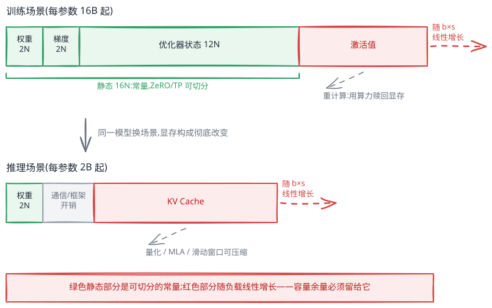
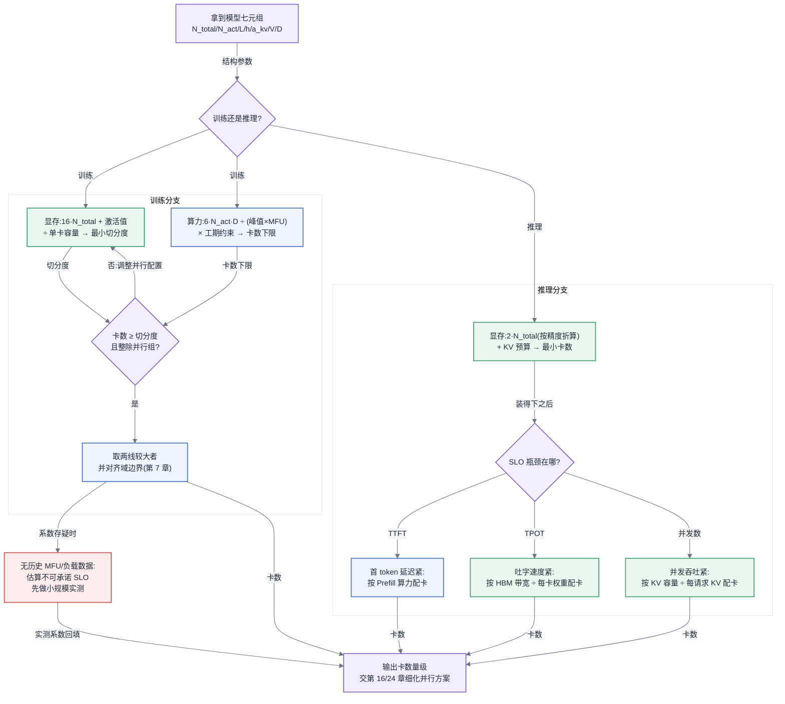

# 第 6 章 模型结构的定量分析

## 链路定位与依赖声明

**链路定位**:本章横跨两条主线的起点——在主线 A(一次训练任务的生命周期)中,它决定"这个任务开跑之前需要多少卡、跑多久";在主线 B(一次推理请求的全链路)中,它决定"这个模型能不能装进这套集群、每秒能吐多少 token"。所有后续章节的容量规划、并行策略、SLO 测算,都以本章的公式为输入。

**依赖声明**:本章建立在第 3 章的三条结论之上——反向传播必须保留前向激活值([§3.1](第03章-人工智能与大模型基础.md#31-神经网络与训练三阶段))、优化器状态的每参数字节数由优化器种类决定([§3.2](第03章-人工智能与大模型基础.md#32-优化器与超参的-infra-含义))、自回归解码必须缓存 KV([§3.4](第03章-人工智能与大模型基础.md#34-transformer-与注意力));数值格式的字节数定义引用 [§4.3](第04章-硬件第一性原理、架构范式与数值精度.md#43-数值格式与精度全书唯一定义处),瓶颈判定方法引用 [§4.4](第04章-硬件第一性原理、架构范式与数值精度.md#44-roofline-模型) 的 Roofline 模型。本章不重述这些直觉,只在其上做算术。

## 问题场景:两次估算,错在两个方向

某平台团队在一周内连续接到两个需求,两次估算都错了,而且错的方向相反。

第一个需求:算法团队要上线一个 MoE(Mixture of Experts,混合专家)模型,总参数 400B、每 token 激活 37B。负责容量评估的工程师查了资料,知道"推理算力看激活参数",于是按 37B 模型的经验估显存:BF16 权重约 74 GB,一台 8 卡 80 GB 的机器绰绰有余,报了单机部署方案。上线当天加载权重直接 OOM——权重是**总参数**的 800 GB,单机连装都装不下,至少需要两台机器做跨机并行。方案推倒重来,上线延期两周。

第二个需求:另一个团队申请训练资源,要用 15T token 预训练一个 70B 稠密模型。这位工程师吸取了教训,这次"保守"估算:他找了一篇文章里"千卡训练千亿模型需要数月"的说法,又担心自己漏算,在此基础上乘了个安全系数,向上级申请了 4000 卡 × 6 个月的预算,折合约一千七百万卡时。预算评审会上被算法负责人当场质疑:按 6ND 公式,这个任务在 40% MFU 下 2000 卡三个月就能跑完,申请量虚高了近三倍——多出来的预算足够再训一个同规模模型。

两次估算,一次少算了显存导致方案不可行,一次多算了算力导致预算不可信。共同的病根是:**他手上没有一套从模型结构推出资源数字的算法,只能靠类比和安全系数**。类比在稠密模型时代勉强能用,在 MoE、长上下文、多模态混杂的今天,总参数与激活参数分离、KV Cache 随场景剧烈波动,类比的误差可以轻松达到 10 倍。本章要给出的,就是这套能替代类比的算法。

## 原理与量化模型

## 6.1 算子与瓶颈归属:先知道钱花在哪

第 3 章 [§3.4](第03章-人工智能与大模型基础.md#34-transformer-与注意力) 给了 Transformer 的形状直觉,这里直接用符号。一个标准 decoder 层由两部分构成,记模型隐层维度为 $h$、层数为 $L$、序列长度为 $s$、batch 为 $b$、注意力头数 $a$、KV 头数 $a_{kv}$(GQA 时 $a_{kv} < a$)、FFN 中间维度 $h_{ff}$(常见 $h_{ff} \approx 2.7h \sim 4h$)、词表大小 $V$:

- **Attention 部分**:QKV 投影($h \to h + 2h \cdot a_{kv}/a$)、注意力得分与加权($s \times s$ 交互)、输出投影($h \to h$);
- **FFN 部分**:两到三个大矩阵乘($h \to h_{ff} \to h$,GLU 变体是三个)。

参数量的近似公式:

$$N \approx L \cdot (4h^2 \cdot \frac{a + a_{kv}}{2a} \cdot \text{修正} + 3h \cdot h_{ff}) + 2Vh$$

工程上不必精确展开,记住主干即可:**对稠密模型,$N \approx 12Lh^2$ 量级**(GLU + GQA 会有 ±20% 修正),外加词表的 $2Vh$。适用条件:标准 decoder-only 结构;误差来源:GQA 比例、GLU 与否、是否共享 embedding 与 lm_head。

先把一层里各算子的开销归属列清楚。以 $h = 8192$、$h_{ff} = 28672$、GQA 比例 8:1 的典型形状为例,每层参数与前向 FLOPs 的分布大致是:FFN 三个矩阵乘占约 70%,QKV 与输出投影占约 25%,LayerNorm、旋转位置编码、残差加法等逐元素算子的 FLOPs 占比不足 1%——但它们的显存读写次数不少,这就是算子融合(第 23 章)能赚到时间的原因:小算子省的不是计算,是访存。词表投影($h \to V$)在每个 token 上只做一次,对 70B 模型可忽略,对 1.5B 小模型能占到前向开销的 15% 以上。

知道钱花在哪之后,第二个问题是每一处花的是"算力的钱"还是"带宽的钱"。这用 [§4.4](第04章-硬件第一性原理、架构范式与数值精度.md#44-roofline-模型) 的算术强度(arithmetic intensity,FLOPs/Byte)判定:

- **FFN 是 compute-bound(算力受限)的候选**:一个 $[b \cdot s, h] \times [h, h_{ff}]$ 的矩阵乘,算术强度约为 $\frac{2 \cdot bs \cdot h \cdot h_{ff}}{2(bs \cdot h + h \cdot h_{ff} + bs \cdot h_{ff})}$,当 $bs$ 足够大时趋近 $\min(bs, h)$,轻松超过主流加速卡数百 FLOPs/Byte 的 Roofline 拐点。
- **Decode 阶段的 Attention 是 memory-bound(带宽受限)**:每生成一个 token,要把整段 KV Cache 从 HBM 读一遍,却只对当前一个 query 做计算,算术强度约为 $O(1)$ 量级——每读一个字节只做一两次乘加,离拐点差两个数量级。

把这个判定落到数字上。取 $h = 8192$、$h_{ff} = 28672$、BF16($p = 2$),对一层里的四种典型情形分别算 FLOPs 与访存量(算术强度 = FLOPs ÷ 读写字节数):

- **Prefill 的 FFN 矩阵乘**($bs = 8192$):FLOPs $= 2 \cdot bs \cdot h \cdot h_{ff} \approx 3.8 \times 10^{12}$,访存 $2(bs \cdot h + h \cdot h_{ff} + bs \cdot h_{ff}) \approx 1.1$ GB,算术强度约 **3600 FLOPs/Byte**——超出主流加速卡数百的 Roofline 拐点一个数量级,坐实 compute-bound。
- **Decode 的同一个矩阵乘**($bs = 1$):FLOPs $= 2 h h_{ff} \approx 4.7 \times 10^8$,但 $h \cdot h_{ff} \cdot 2 \approx 4.7 \times 10^8$ 字节的权重一个不少全要读,算术强度约 **1 FLOPs/Byte**。同一个算子,batch 从 8192 掉到 1,强度掉了三个半数量级——这就是 decode 靠攒 batch 摊薄权重的全部原理:batch 攒到 $b$,强度近似变 $b$,要摸到数百的拐点就需要数百的 batch。
- **Prefill 的注意力得分与加权**($s = 4096$):FLOPs $= 4 s^2 h$;朴素实现要把 $a \cdot s^2$ 的得分/softmax 矩阵写出再读回,访存约 $8 a s^2$ 字节,算术强度 $\approx h/(2a) = d_{\text{head}}/2 = 64$ FLOPs/Byte——**低于拐点,朴素注意力连 prefill 阶段都是 memory-bound**。FlashAttention 不物化 $s^2$ 矩阵,把强度拉回 $O(s)$ 量级,才把注意力送回 compute-bound 一侧:它赚的同样不是计算,是访存。
- **Decode 的注意力**:每层每 token 计算约 $4sh$ FLOPs,读 KV 约 $2 s \cdot a_{kv} d_{\text{head}} \cdot p$ 字节。MHA($a_{kv} = a$)时强度恰好 1 FLOPs/Byte 量级;GQA 8:1 把 KV 读取压到 1/8,强度升到约 8——好了一个数量级,但离拐点仍差两个数量级,**GQA 缓解带宽压力,不改变 memory-bound 的定性**。

适用条件:BF16、忽略片上缓存复用;误差来源:算子融合与 L2 命中可把有效访存压低 20%~50%,但不足以改变上面任何一条的定性归属——差两三个数量级的判定,对系数级误差免疫,这正是算术强度适合做纸面判断的原因。

由此得出两阶段的定量画像,这是第五部分所有推理优化的出发点:

| 维度 | Prefill(预填充) | Decode(解码) |
|---|---|---|
| 计算形态 | 整段 prompt 并行,大矩阵乘 | 每步一个 token,矩阵乘退化为矩阵-向量乘 |
| 瓶颈归属 | compute-bound | memory-bound(读权重 + 读 KV Cache) |
| 单 token 成本 | $\approx 2N$ FLOPs | $\approx 2N$ FLOPs,但受限于带宽而非算力 |
| 决定性资源 | 峰值算力 | HBM 带宽与容量 |
| 加卡的收益 | 近线性(算力可并行摊薄) | 递减(带宽墙不随 batch 消失) |
| 典型利用率 | MFU 可达 50%+ | MFU 常低于 10%,属正常 |

这张表还解释了一个常被误读的现象:decode 阶段 MFU 只有个位数不是"没调好",而是 memory-bound 负载的固有属性——它的正确度量是带宽利用率而非算力利用率。用 MFU 去考核推理集群的团队,会把方向带偏到无意义的算力优化上(第 11 章展开这个归因陷阱)。

Decode 的理论吞吐上界可以直接算:单请求下每步要读全部权重,故 **每卡 decode 速度上界 ≈ HBM 带宽 ÷ 权重字节数**。80 GB 卡、3 TB/s 带宽、70B BF16 模型切 4 卡(每卡 35 GB 权重),上界约 $3000/35 \approx 85$ token/s——这个数字算力再强也突破不了,只能靠加大 batch 摊薄权重读取。适用条件:batch 小到权重读取主导;误差来源:KV Cache 读取量、算子融合程度。

顺手把 GQA 的收益算干净,因为它同时改两笔账。KV 显存与每步 KV 读取带宽都正比于 $a_{kv}$,故 GQA 相对 MHA 的收益就是 $a/a_{kv}$ 倍:64 头模型做 8:1 GQA,每 token KV 从 $2 L a \cdot d_{\text{head}} \cdot p = 2.56$ MB(按 [§6.2](#62-参数量与资源换算核心) 算例的 70B 形状)压到 320 KB;一个 128K 上下文请求的 KV 从 335 GB(单卡装不下,部署直接不成立)压到 42 GB(可部署);decode 每步的 KV 读取时间同比例缩短,长上下文下 TPOT 的 KV 项直接除以 8。MQA($a_{kv} = 1$)是这条路的极限档,再往下压就要换 MLA 类压缩结构([§6.3](#63-结构变体的定量代价))。适用条件:只算 KV 一侧,QKV 投影的参数节省(约 $2Lh^2(1 - a_{kv}/a)$)另计;误差来源:$a/a_{kv}$ 的带宽收益只对 KV 读取项成立,权重读取项不受影响——短上下文、小 batch 时权重项主导,GQA 的带宽收益体现不出来,它是为长上下文与大 batch 买的保险。

**所以这对做平台的人意味着什么**:训练和 Prefill 买算力,Decode 买带宽和容量。一套集群的训练/推理配比之争([§4.2.2](第04章-硬件第一性原理、架构范式与数值精度.md#422-训练型与推理型负载的硬件诉求差异)),本质是这两张画像的配比之争。

## 6.2 参数量与资源换算【核心】

这一小节是全书被引用最多的公式组。每个公式都标注适用条件与误差来源。

**公式一:参数量 → 算力。**

$$C_{\text{train}} \approx 6 \cdot N \cdot D \quad \text{FLOPs}, \qquad C_{\text{infer}} \approx 2 \cdot N_{\text{act}} \quad \text{FLOPs/token}$$

其中 $D$ 是训练 token 总数,$N_{\text{act}}$ 是**激活参数量**(稠密模型 $N_{\text{act}} = N$)。6 的由来值得拆开一次,因为它是后面所有修正的基准:前向,每个参数在每个 token 上参与一次乘加,记 2 FLOPs,合计 $2N$;反向要算两个梯度——对激活的梯度和对权重的梯度,各是一次与前向同形的矩阵乘,各 $2N$,合计 $4N$;三者相加即 $6N$/token。这个拆解直接给出两个推论:重计算是"反向前再做一遍前向",系数 6 加上前向的 2 变 8;只做前向的推理就是 $2N$。适用条件:decoder-only、注意力项可忽略。误差来源有三:(1)注意力 $s \times s$ 交互未计入,修正因子近似 $(1 + s/(6h))$——$h=8192$、$s=4096$ 时约 8%,埋在估算噪声里可忽略;经验阈值是 **$s > 2h$ 时修正超过 ±20% 的误差预算,必须补上**,$s$ 到 128K 时该项反超主项,需按每 token 约 $12 \cdot L \cdot s \cdot h$ FLOPs 的注意力项补齐;(2)重计算(激活检查点)按上述拆解把训练系数从 6 推向 6.3~8(取决于重算多少,见公式三);(3)词表投影在小模型上占比不可忽略。

推理的 $2N_{\text{act}}$ 在两个阶段含义不同,混用会算错 SLO。**Prefill 阶段它是真实的时间账**:一段 $s$ token 的 prompt 花 $2 N_{\text{act}} \cdot s$ FLOPs,可完全并行,TTFT 下界 $\approx 2 N_{\text{act}} s / (n \cdot P_{\text{峰值}} \cdot \text{MFU})$,加卡近线性缩短。**Decode 阶段它只是电费账**:每 token 同样记 $2N_{\text{act}}$ FLOPs,但时间不由 FLOPs 决定,而由 [§6.1](#61-算子与瓶颈归属先知道钱花在哪) 的带宽上界决定——TPOT 下界 $\approx$ 每卡(权重 + KV)字节数 ÷ HBM 带宽,与算力几乎无关。同一个 $2N$,prefill 拿它配算力,decode 只拿它算功耗与成本,拿它去推 decode 延迟必错。适用条件:prefill 侧要求 $b \cdot s$ 足够大使 MFU 接近训练水平;误差来源:长 prompt 下注意力修正项对 prefill 同样适用。

反推训练时长:

$$T = \frac{6ND}{n_{\text{卡}} \cdot P_{\text{峰值}} \cdot \text{MFU}}$$

MFU(Model FLOPs Utilization,模型算力利用率)是实测有效算力与峰值之比,当前大规模稠密训练的合理区间是 35%~45%,MoE 与长上下文会更低。**MFU 是这条公式里唯一需要实测的量,也是最大的误差来源**——拍脑袋填 60% 和实测 30% 之间就是两倍工期。

**公式二:参数量 → 显存。** 训练态每参数字节数(BF16 混合精度 + Adam,定义见 [§3.2](第03章-人工智能与大模型基础.md#32-优化器与超参的-infra-含义) 与 [§4.3](第04章-硬件第一性原理、架构范式与数值精度.md#43-数值格式与精度全书唯一定义处)):

$$\text{静态显存} = \underbrace{2N}_{\text{BF16 权重}} + \underbrace{2N}_{\text{BF16 梯度}} + \underbrace{4N + 4N + 4N}_{\text{FP32 主权重 + Adam 一阶/二阶矩}} = 16N \ \text{bytes}$$

适用条件:Adam 系、混合精度、未做任何切分。误差来源:优化器换成 SGD 变 8N、8-bit Adam 变 10N;ZeRO/FSDP 会把梯度与优化器状态摊到 $n$ 张卡上,单卡变为 $2N + 14N/n$。推理态则简单:BF16 为 $2N$、FP8/INT8 为 $N$、INT4 约 $0.55N$(含量化元数据)。

**公式三:激活值显存**(为什么必须保留见 [§3.1](第03章-人工智能与大模型基础.md#31-神经网络与训练三阶段))。无重计算时,每层每 token 的激活值约:

$$A \approx L \cdot b \cdot s \cdot h \cdot \left(34 + 5\frac{a \cdot s}{h}\right) \ \text{bytes(BF16)}$$

适用条件:标准 MHA 结构、BF16。误差来源:GQA、GLU、FlashAttention(消掉 $s^2$ 项)可带来 ±30% 出入。激活值是训练显存里**唯一随 batch 与序列长度线性增长的部分**,也是唯一能用算力赎回的部分——这就是重计算交易的定量基础。把重计算开关前后的三档写全(单副本、BF16、FlashAttention 已消 $s^2$ 项;TP 度数为 $t$ 时整体除以 $t$):

$$A_{\text{无重计算}} \approx 34 \cdot Lbsh, \qquad A_{\text{选择性}} \approx (8 \sim 13) \cdot Lbsh, \qquad A_{\text{完全}} \approx 2 \cdot Lbsh$$

代入算例形状($L=80$、$b=1$、$s=4096$、$h=8192$),三档分别约 91 GB、21~35 GB、5.4 GB(TP 切分前)。换回来的代价用 6N 拆解直接读出:完全重计算等于反向前把前向再做一遍,训练系数 6→8,同卡数工期 +33%;选择性重计算只重算注意力内部这类"占显存多、占 FLOPs 少"的部分,系数约 6.3~6.5——**用约 5% 的算力赎回 60% 以上的激活显存,这笔交易几乎总是划算的**,所以它是长序列训练的默认档,而完全重计算只在显存被逼到墙角时才启用。适用条件:同公式三;误差来源:各框架"选择性"的选择集不同,8~13 的系数必须以实测为准,纯估算时取 13 偏保守。

激活值还有一个训练态特有的放大项:流水线并行(PP)下,处于流水线前段的卡要同时驻留多个 in-flight micro-batch 的激活值,驻留份数约等于流水线段数——这就是为什么 PP 度数越深、第一段卡的激活显存压力越大,1F1B 类调度(第 16 章)正是为压这个份数而生。估算时用"激活值 × in-flight 份数"修正,漏掉这一项是 PP 配置 OOM 的头号原因。

**公式四:KV Cache**(由来见 [§3.4](第03章-人工智能与大模型基础.md#34-transformer-与注意力))。每 token 的 KV Cache:

$$M_{\text{KV/token}} = 2 \cdot L \cdot a_{kv} \cdot d_{\text{head}} \cdot p \ \text{bytes}$$

系数 2 是 K 和 V 各一份,$p$ 是每元素字节数。总量随 $b \times s$ 严格线性增长。适用条件:标准注意力;误差来源:MLA 类压缩结构可降一个数量级,滑动窗口注意力会封顶。

**公式五:MoE 的总参数/激活参数分离——Infra 侧最容易算错的一处。**

$$\text{显存看总参数 } N_{\text{total}}, \qquad \text{算力看激活参数 } N_{\text{act}}$$

权重必须全部驻留(或至少可秒级调入),因为路由是逐 token 决定的,任何专家都可能被下一个 token 命中;而每个 token 只流经 top-k 个专家,FLOPs 只按激活量计。开篇场景的第一个错误就在这里:400B/37B 的模型,显存按 400B 算(BF16 权重 800 GB),算力按 37B 算(每 token 74 GFLOPs)。**记忆口诀:装下它看总参,喂饱它看激活。**

**公式六:Scaling 与算力预算。** 给定预算 $C$(FLOPs),Chinchilla 式配比 $D \approx 20N$ 给出算力最优的 $N$ 与 $D$;但 2024 年后主流做法是**过训练**(overtraining,$D/N$ 达 100~500),用训练期多花的算力换推理期更小的模型——因为训练花一次,推理花无数次,推理侧每省一半参数就是永久省一半卡。对平台方,这条曲线的用途不是选模型(那是算法的事),而是把算法方给出的 $(N, D)$ 折成集群规模与工期,喂给第 31 章的建设规划:$C = 6ND$,除以 $(n \cdot P \cdot \text{MFU})$ 得工期,固定工期反解 $n$ 得卡数。反过来它也是平台方审视需求合理性的工具:算法方若报出 $D/N < 20$ 的训练计划,大概率是数据没备够而非刻意为之,这个问题在预算评审时问出来,比在训练中途发现数据耗尽要便宜得多。

> 延伸阅图:Kaplan et al., 《Scaling Laws for Neural Language Models》(arXiv:2001.08361,<https://arxiv.org/abs/2001.08361>)图 1 —— 经典三联图:测试损失分别随算力 C、数据量 D、参数量 N 在对数坐标下呈现跨越多个数量级的幂律直线,是"给定预算 C 反推 (N, D) 配比"这套算术的实证起点。

这条换算还有一个常被忽略的推论:**算力预算决定的是 $(N, D)$ 的乘积,而集群形态决定的是能否把这笔预算在可接受的工期内花掉**。同样 $10^{25}$ FLOPs 的预算,2000 卡花三个月和 500 卡花一年,在算法上等价,在工程上完全不等价——后者要穿越四倍长的故障暴露窗口(第 20 章),checkpoint 与容错的成本占比会显著上升。工期不只是日程问题,它本身就是可靠性参数。

**规模谱系表**(全书翻得最勤的一页;单卡按 80 GB 显存档位估,具体硬件参数见附录):

| 规模档 | 典型形态 | BF16 权重 | 推理最小部署形态 | 训练形态(混合精度) | 备注 |
|---|---|---|---|---|---|
| 0.5–3B | 稠密 | 1–6 GB | 单卡(可与他人共卡) | 单机多卡 DP | 端侧/嵌入场景主力 |
| 7–9B | 稠密 | 14–18 GB | 单卡 | 单机 8 卡 | 微调实验主力档 |
| 13–34B | 稠密 | 26–68 GB | 单卡(量化)~2 卡 | 单机 8 卡 + ZeRO | 单卡的边界档 |
| 70–72B | 稠密 | 140 GB | 单机 2–4 卡 TP | 多机,TP×PP×DP | 本章算例档 |
| 100–250B | MoE(激活 10–30B) | 200–500 GB | 单机 8 卡 | 多机 + EP | 显存下单机、算力像 20B |
| 400–700B | MoE(激活 20–40B) | 0.8–1.4 TB | 2–4 机(或 1 超节点) | 数百至数千卡 | 域边界开始决定成败(第 7 章) |
| 1T+ | MoE | >2 TB | 超节点级 | 万卡级 | 与其说部署模型不如说部署系统 |

**权重格式与分发**:safetensors 已是事实标准——零拷贝 mmap 加载、防任意代码执行,2026 年再用 pickle 格式的 checkpoint 对外分发已经没有理由。分片按"每分片 ≤ 单卡显存的 1/4"经验切,便于流水线加载与断点续传;分发拓扑上,百实例同时从同一对象存储拉同一份权重是典型的自伤行为,需要 P2P 分发或节点级缓存(第 25 章)。加载耗时下界 = 权重体积 ÷ min(磁盘带宽, 网络带宽, 主机到卡带宽):800 GB 权重走 25 GbE 网络拉取需要 4 分钟以上,即使本地 NVMe 命中也要数十秒——这个数字直接决定第 25 章冷启动与弹性扩缩的响应下限:**权重体积除以分发带宽,就是这个模型弹性能力的物理下界**。

**所以这对做平台的人意味着什么**:六条公式加一张表,就是平台方与算法方对话的通用语。算法方报出 $(N_{\text{total}}, N_{\text{act}}, L, h, a_{kv}, V, D)$ 七个数,平台方十分钟内应能回出卡数、工期、部署形态三个数。

### 完整算例:70B 稠密模型从头算一遍

设定(接近主流开源 70B 档):$N = 70\text{B}$,$L = 80$,$h = 8192$,$a = 64$,$a_{kv} = 8$(GQA),$d_{\text{head}} = 128$,$h_{ff} = 28672$,$V = 128\text{K}$,训练 $D = 15\text{T}$ token,序列长度 $s = 4096$。集群假设:单卡 80 GB HBM、BF16 稠密峰值 1 PFLOPS、HBM 带宽 3 TB/s(占位数字,具体型号见附录)。

**第一步:训练显存。**
- 静态部分:$16N = 1120$ GB。1024 卡训练、ZeRO-1(只切优化器状态,DP=128 假设):每卡 $2N + 2N + 12N/128 \approx 140 + 140 + 6.6 \approx 287$ GB——仍超单卡,所以 70B 必须叠加 TP/PP 切权重与梯度。TP=8、PP=4 后每卡静态约 $1120/32 = 35$ GB。
- 激活部分:每卡每 micro-batch($b=1$、$s=4096$、TP=8 摊薄)按公式三(FlashAttention 消 $s^2$ 项)约 $80 \times 4096 \times 8192 \times 34 / 8 \approx 11.4$ GB;做选择性重计算后约 4–6 GB。
- 合计每卡约 40–45 GB,留出通信缓冲与碎片,80 GB 卡放得下。**结论:TP8 × PP4 × DP32 = 1024 卡是一个自洽的起点配置。**

**第二步:训练算力与工期。**
$$C = 6 \times 70 \times 10^9 \times 15 \times 10^{12} = 6.3 \times 10^{24} \ \text{FLOPs}$$
1024 卡、MFU 40%:$T = 6.3 \times 10^{24} / (1024 \times 10^{15} \times 0.4) \approx 1.54 \times 10^7$ 秒 ≈ **178 天**。工期压到 90 天则需约 2048 卡。开篇场景第二个错误的正确答案就是这样两行算出来的。

**第三步:单步通信量**(通信原语定义见第 7 章,这里只算量)。全局 batch 取 16M token,单步:
- **DP 梯度 AllReduce**:每 DP 组内每卡收发约 $2 \cdot \frac{K-1}{K} \cdot 2N_{\text{shard}}$ 字节。TP8×PP4 切分后每卡持有梯度 $140/32 = 4.4$ GB,DP=32 时每卡每步通信约 $2 \times \frac{31}{32} \times 4.4 \approx 8.5$ GB——走跨机网络,这是梯度同步必须与计算重叠的原因。
- **TP 激活 AllReduce**:每层前向 2 次 + 反向 2 次,每次约 $b \cdot s \cdot h \cdot 2$ 字节 = $1 \times 4096 \times 8192 \times 2 = 64$ MB;80 层 × 4 次 × ring 系数 1.75 ≈ 每 micro-batch **36 GB**。这个量级只有卡间高速互联扛得住——**TP 不出域**(第 7 章展开)的结论,根源就是这笔账。
- **PP 点对点**:每 micro-batch 每段边界传 $b \cdot s \cdot h \cdot 2 = 64$ MB,量小,对带宽不敏感、对气泡敏感。

**第四步:推理侧。** 4 卡 TP 部署,每卡权重 35 GB,剩约 40 GB 给 KV Cache。每 token KV:$2 \times 80 \times 8 \times 128 \times 2 = 320$ KB。4 卡共 160 GB KV 预算 → 容纳 $160\text{GB}/320\text{KB} = 512\text{K}$ token,即 128 个 4K 上下文的并发请求。Decode 带宽上界:每步读权重 35 GB/卡 ÷ 3 TB/s ≈ 12 ms,单请求上界约 85 token/s;batch 到 128 时权重读取被摊薄,聚合吞吐逼近数千 token/s,但每请求 KV 读取(4K 上下文时 1.3 GB/请求)开始接管瓶颈。

这套四步算法适用于任何稠密模型;MoE 只需在第一步用 $N_{\text{total}}$、第二步用 $N_{\text{act}}$、第三步补 All2All 项(见下节)。四步算完之后,还有一个必须诚实标注的部分:**哪些数字是算出来的,哪些是假设进去的**。上面的推导里,结构参数与公式是硬的,MFU 40%、选择性重计算的压缩比、留给通信缓冲的余量是软的——它们来自同类任务的经验区间。把估算交出去时,软数字必须单独列成假设清单,否则三个月后实测 MFU 只有 32%、工期滑到 220 天时,没人分得清是估算方法错了还是假设失准了。**估算的可信度不在于数字多精确,而在于每个数字的来源可追溯**。

图 6-1:训练与推理的显存三分构成。要记住的一件事:静态部分(权重/梯度/优化器)是可切分的常量,而红色的激活值与 KV Cache 是随负载线性增长的变量——容量规划的余量必须留给后者。
<!-- source: diagrams/sources/ch06-memory-composition.excalidraw -->

图 6-2:从参数量到卡数的推导链(本章方法论主图)。要记住的一件事:算力线决定卡数的下限、显存线决定切分方式,两条线在"卡数"处会合并取较大者——只算其中一条线的估算必错。

## 6.3 结构变体的定量代价

结构变体的共同点是:它们都在某一个维度上打破了稠密模型的比例经验,而平台方的估算习惯正是建立在这些比例经验上的。所以本节逐个给出"打破在哪、怎么重新算"。

**MoE:负载不均与 All2All。** 路由是统计行为,专家负载必然不均。刻画指标是**负载比** $\rho = \max_e(\text{tokens}_e) / \text{mean}_e(\text{tokens}_e)$:同步训练里一步的耗时由最慢的专家决定,故有效算力直接除以 $\rho$——$\rho = 1.5$ 意味着 MFU 打 67 折。工程上用容量因子(capacity factor)封顶 + 辅助均衡损失把 $\rho$ 压向 1.1~1.3,代价是溢出 token 被丢弃或旁路。这笔代价可以算:容量因子 CF 定义为每专家槽位数相对均匀分配的放大倍数,每专家槽位 $= \text{CF} \cdot k \cdot T / E$($T$ 为本批 token 数、$E$ 为专家数、$k$ 为 top-k)。负载为均值 $\rho_e$ 倍的专家,其溢出丢弃比例为 $\max(0,\ 1 - \text{CF}/\rho_e)$——CF=1.25、最热专家 $\rho = 1.5$ 时,该专家丢掉 1/6 的路由 token,全局丢弃率典型落在 1%~5%。CF 的两难在于**按最热专家配、按全体专家付费**:所有专家的激活缓冲与 All2All 消息都按槽位上限静态分配,CF 从 1.0 提到 1.5,MoE 层的激活显存与通信量同比放大 50%,其中多数增量是空槽 padding。推理侧主流已转向 dropless(不设容量上限、动态组 batch),丢弃问题消失,代价换成动态形状带来的算子效率损失与更陡的负载尖峰。适用条件:token-choice 路由、同步训练;误差来源:$\rho$ 的分布随数据域漂移,丢弃率必须按流量高分位实测而非全局均值。推理侧的表现形式不同但同源:热专家所在的卡成为吞吐短板,且负载分布随流量内容漂移——白天代码流量与深夜闲聊流量激活的专家集合不同,这意味着 MoE 推理集群的容量水位必须按 $\rho$ 的高分位而非均值设定。All2All 通信量:每层每 token 收发 $2 \cdot k \cdot h \cdot p$ 字节(dispatch + combine),反向再来一遍。按算例的 $h$、top-2、BF16、每卡每 micro-batch 4096 token:每层 $4096 \times 2 \times 2 \times 8192 \times 2 = 268$ MB,60 个 MoE 层就是 16 GB/micro-batch——而且 All2All 是点对点全交换,对跨域带宽最不友好(第 7 章的 EP 域内化结论由此而来)。

> 延伸阅图:Fedus et al., 《Switch Transformers: Scaling to Trillion Parameter Models with Simple and Efficient Sparsity》(arXiv:2101.03961,<https://arxiv.org/abs/2101.03961>)图 2 —— Switch 层的 token 路由图:router 给每个 token 打分后只送往单个 FFN 专家,专家分布在不同设备上,一眼看清本段"负载不均 + All2All 通信"两个问题的物理来源。

**长上下文:显存墙触碰点。** 长上下文的代价有两笔:Prefill 算力的注意力项(前文已给,$s$ 超过 $h$ 量级后按 $12Lsh$ 补)按 $s^2$ 增长,一次 128K 的 Prefill 相当于几十次 4K 的 Prefill;但真正先触墙的通常是 KV Cache。线性公式(公式四)可以直接解出触墙点:算例模型 4 卡部署、160 GB KV 预算、320 KB/token,单请求上下文到 512K token 时 KV 就吃光全部预算——batch 掉到 1,吞吐崩塌。这就是"支持 1M 上下文"的宣传与"1M 上下文的账单"之间的换算:上下文长度每翻一倍,同等吞吐所需的显存(也就是卡数)近似翻一倍。适用条件:标准 GQA;MLA 类结构可把系数压 4–8 倍,滑动窗口把线性变常数,评估长上下文方案第一件事就是问清注意力结构。

这里还差一个判定:长上下文下,KV 与激活值谁先触墙?两个场景答案相反。**推理侧几乎总是 KV 先触墙**:KV 是常驻量,随 $s$ 线性累积且伴随请求全程;推理激活是瞬态量,逐层复用,峰值约 $\kappa \cdot b s h p$($\kappa$ 为框架驻留系数,经验区间 10~20,与 $L$ 无关)。判定式:每 token KV 超过每 token 激活瞬态,当 $2 L \cdot a_{kv} d_{\text{head}} > \kappa h$。算例形状左边 $2 \times 80 \times 8 \times 128 \approx 164\text{K}$,右边 $\kappa h \approx 160\text{K}$,看似同量级——但 KV 是累积的、激活是滑动的,请求越长、并发越高,KV 的领先越大;只有 MLA 类结构把左边压掉一个数量级后,不等式才可能翻转,那时长上下文的容量瓶颈才轮到激活与通信缓冲。**训练侧没有 KV Cache**(K/V 本身就是被保留激活值的一部分),触墙的是公式三的激活项,可直接解出显存约束下的最大序列长度:$s_{\max} \approx M_{\text{激活预算}} \cdot t / (34 L b h)$(无重计算、TP=$t$)。算例每卡留 20 GB 激活预算、TP=8,$s_{\max} \approx 7\text{K}$——这就是长上下文训练必须叠加重计算与序列并行(第 16 章)的算术根源:不开这两样,主流形状连 8K 都训不了。适用条件:标准结构、FlashAttention;误差来源:$\kappa$ 随推理框架的显存池策略波动,需实测;训练侧公式取无重计算档,开重计算后 $s_{\max}$ 按公式三的档位同比放大。

**大词表:小模型的隐性大头。** embedding + lm_head 共 $2Vh$ 参数($V = 128\text{K}$、$h = 8192$ 时为 2.1B)。对 70B 模型占 3%,无关痛痒;对 1.5B 小模型($h = 2048$)则是 0.52B,**占总参数三分之一**——小模型的显存与加载估算若套大模型的比例经验,这一块就是主要误差源。

**所以这对做平台的人意味着什么**:结构变体不是算法侧的私事——MoE 改通信画像、长上下文改显存画像、大词表改小模型的成本结构,平台方在方案评审时应当逐项过这三笔账。

## 6.4 多模态的定量画像

多模态模型的三段式构成(见 [§3.5](第03章-人工智能与大模型基础.md#35-模型谱系)):模态编码器(如 ViT)→ 投影/适配层 → LLM 主干。定量上的结论是**头轻身重**:主流开源多模态模型中,视觉编码器 0.3–6B、投影层可忽略、主干 7–70B+,编码器的参数与算力占比通常不足 10%。因此多模态的资源估算不是"新模型",而是"老模型 + token 膨胀系数"。这个结论对部署形态有一个直接推论:编码器与主干的瓶颈类型不同(编码器是小模型高并发的 compute 型负载,主干是本章反复分析的画像),把两者拆开独立扩缩、以不同的 batch 策略运行,往往比整体部署更省卡——这是第五部分多模态推理服务化的结构基础。

**token 膨胀系数**是后续所有多模态推理估算的输入:一张图经编码器后进入主干的 token 数,常见档位为 256~2048 token/图(取决于分辨率与合并策略,高分辨率切子图时按子图数倍增);视频按 0.5~2 帧/秒采样后逐帧膨胀;一秒音频约 25~100 token。换算方法:一条"20 张图 + 500 字提问"的请求,进入主干的实际 token 是 $20 \times 1024 + 700 \approx 21\text{K}$——是纯文本直觉的 30 倍,Prefill 算力与 KV Cache 都按 21K 算。适用条件:编码器算力另计(通常 <10%,高清多图场景可达 30%,需实测);误差来源:动态分辨率策略使膨胀系数在 4 倍范围内波动。

**完整算例:给 [§6.2](#62-参数量与资源换算核心) 的 70B 换上眼睛。** 设定:主干沿用 [§6.2](#62-参数量与资源换算核心) 算例的 70B(4 卡 TP 部署,每卡权重 35 GB、KV 预算共 160 GB),外挂 2B 视觉编码器(BF16 权重 4 GB),膨胀系数取 1024 token/图。请求画像:8 张图 + 300 token 提问,进入主干 $8 \times 1024 + 300 \approx 8.5\text{K}$ token。

- **Prefill 算力**:主干 $2 \times 70 \times 10^9 \times 8.5 \times 10^3 \approx 1.2 \times 10^{15}$ FLOPs;编码器 $2 \times 2 \times 10^9 \times 8192 \approx 3.3 \times 10^{13}$ FLOPs,占比不足 3%——"头轻身重"的数字版。4 卡、MFU 50%,TTFT 下界 $\approx 1.2 \times 10^{15} / (4 \times 10^{15} \times 0.5) \approx 0.6$ 秒,是同模型 500 token 纯文本请求的 17 倍——用户看到的是"发张图怎么这么慢",平台看到的是 prefill 配额被膨胀系数吃掉。
- **KV Cache**:$8.5\text{K} \times 320\ \text{KB} \approx 2.7$ GB/请求。160 GB 预算的并发从纯文本 4K 上下文的 128 掉到约 59;若 16 张图再叠子图切分,单请求 KV 超 10 GB,并发掉到十几。**同一套 4 卡部署,并发容量随请求里的图片数波动一个数量级**——这就是容量必须按膨胀后 token 分布而非请求数做的算术证明。
- **显存增量**:编码器权重 4 GB 加图像预处理缓冲,约占 4 卡总显存 2%,可忽略;多模态的显存增量几乎全在 KV,不在新增的模型部件上。

适用条件:膨胀系数按均值 1024 取,动态分辨率场景按 P95 重算;误差来源:编码器与主干合卡部署时的相互干扰(编码器是高并发小 batch、主干是大 batch,两者调度冲突),估算给不出,需压测定界。

**所以这对做平台的人意味着什么**:多模态上线前必须拿到"膨胀后 token 分布"而非请求数分布,否则 KV 容量与 Prefill 配额都会系统性低估。

## 6.5 训练范式的资源画像量化

四阶段的定性画像见 [§3.6](第03章-人工智能与大模型基础.md#36-训练范式全景),这里给量级(以 70B 档为参照):

| 范式 | 数据量级(token) | 算力量级 | 通信模式 | 资源潮汐 |
|---|---|---|---|---|
| Pretrain | $10^{13}$ | $6ND \sim 10^{24\text{–}25}$ FLOPs | 全并行组满载、稳态 | 无潮汐,数月恒定满载 |
| CPT | $10^{11\text{–}12}$ | Pretrain 的 1%–10% | 同 Pretrain | 周级任务,可排队调度 |
| SFT | $10^{8\text{–}9}$ | Pretrain 的 0.01% 量级 | 常可退化到单机/少机 | 天级任务,适合潮汐填谷 |
| RL(RLHF/RLVR) | rollout 生成量主导 | 生成:更新 ≈ 4:1 至 10:1 | 训推混合:推理引擎 + 训练引擎 + 权重同步 | 集群内自带潮汐,生成与更新交替 |

这张表的每一行都可以用本章公式独立验证:SFT 的算力为什么只有 Pretrain 的万分之一量级?因为 $C = 6ND$ 里 $N$ 不变而 $D$ 缩了四个数量级。CPT 为什么必须沿用 Pretrain 的并行配置?因为显存公式与 $D$ 无关,静态 16N 一分不少,该切多少卡还是多少卡——**"数据少了所以卡也能少"是 CPT 需求评审里最常见的错误推断**,数据量只能缩短工期,不能降低单副本的显存门槛。

RL 是其中对平台冲击最大的一档:它把一条推理链路(rollout 生成)嵌进训练任务里,算力大头在**推理态**的采样生成,还要周期性把新权重从训练引擎推送到推理引擎(每次全量 $2N_{\text{act}}$ 级别的传输)。它的资源画像同时具备训练的显存结构(16N 静态)和推理的带宽结构(生成阶段 memory-bound),两套画像在同一集群里按分钟级交替。用纯训练的画像去规划 RL 任务,算力配比和网络规划都会错位——这是第四部分 RL 基础设施章节的入口问题。

**所以这对做平台的人意味着什么**:四种范式对应四种排队与配额策略——Pretrain 独占、CPT 排队、SFT 填谷、RL 按训推混合建组,第 9 章的队列设计要以这张表为输入。

## 方案对比:三种估算方法及其失效边界

平台方拿到一个新模型的资源问题,有三条路线,必须知道各自在哪失效。

**方案一:静态公式估算(本章方法)。** 成本近乎为零,十分钟出数,精度 ±20%~30%。**失效边界**:(1)MFU 与负载比 $\rho$ 这类"系统效率量"公式给不出,必须借用同类任务的实测值,没有历史数据时误差可达 2 倍;(2)对新结构(新注意力变体、新路由策略)公式的系数假设失效;(3)算不出碎片、通信缓冲、框架开销这些工程杂项(经验预留 10%–15% 显存)。适用于预算评审、方案初筛、跨方对话——不适用于承诺 SLO。

**方案二:小规模实测外推。** 用 1/8 或 1/16 规模(缩层数或缩卡数)跑数小时,测出 MFU、单步时间、显存水位,再按公式外推全量。精度可到 ±10%。**失效边界**:凡是不随规模线性外推的量都会骗人——通信在跨过域边界时非线性恶化(小规模在单机内测出的 MFU 到千卡会掉 5–10 个点)、MoE 负载不均随专家数和数据分布变化、长尾请求分布在小流量下测不出来。外推跨越了互联域层级(第 7 章)时,必须对通信项单独修正。

**方案三:全量 profiling 压测。** 按目标配置起全量任务,用 [§5.4](第05章-CUDA、CANN与加速器软件栈.md#54-profiling-方法论全书唯一定义处) 的方法拿真实时间线。精度最高,是承诺 SLO 前的唯一依据。**失效边界**:成本——千卡压测一天就是上万卡时,等价于真金白银;且前提是卡已经在手,对"该买多少卡"这个前置问题它在逻辑上不可用(这正是第二类读者——方案与选型方——必须依赖方案一的原因:判断依据必须能脱离集群独立成立)。此外压测结果强绑定当时的框架版本与数据分布,任一变更后结论过期。

正确用法是三段接力:公式定量级 → 小规模定系数 → 全量压测定承诺。三段的分工也划出了协作边界:方案一的输入(结构参数)由算法方提供且必须书面确认——总参数与激活参数报错一个,后果由报数方承担;方案二、三的系数(MFU、负载比、长尾分布)由平台方实测并归档,成为下一次方案一的经验库。这条边界不立,估算失准时就会陷入"算法说平台不会算、平台说算法没报全"的循环举证。只用方案一去签 SLO、或只信方案三而丧失快速判断能力,都是失格的平台方。

## 大数据对照

本章做的事情——从作业结构静态推算资源——在大数据时代有直接的对应物,但迁移时三处失效。

**直接复用的部分**:Spark 时代成熟的容量规划方法论完全平移。"按 shuffle 量估 executor 内存、按分区数估并行度、按数据量估作业时长"的思维方式,与本章"按参数量估显存、按 token 量估算力"结构同源;"预留 memoryOverhead"对应本章的碎片与通信缓冲预留;"用采样作业估全量作业"对应方案二的小规模外推。做过 Spark 容量规划的人学本章只是换一套公式。

**第一处失效:估错的代价从渐变变成突变。** Spark executor 内存估小了,代价是 spill 落盘、作业变慢,通常还能跑完;显存估小了 1 GB,代价是 OOM 即刻退出,没有"慢慢跑完"这个选项。大数据的资源估算可以粗糙,因为系统有降级路径;显存估算必须精确到 GB,因为显存墙([§4.1.2](第04章-硬件第一性原理、架构范式与数值精度.md#412-hbm显存墙的物理来源))是硬边界。这也是本章公式必须细到"每参数字节数"的原因——Hadoop 时代没有人需要算到这个粒度。

**第二处失效:资源画像从"作业属性"变成"作业 × 阶段属性"。** 一个 MapReduce 作业的资源画像大体均匀;而一次训练在前向/反向/梯度同步之间、一次推理在 Prefill/Decode 之间,瓶颈资源完全不同([§6.1](#61-算子与瓶颈归属先知道钱花在哪) 的两张画像)。用单一数字描述 AI 任务的资源需求,就像用平均水深描述一条有瀑布的河。

**第三处失效:数据量不再是第一自变量。** 大数据估算的主输入是数据量;AI 估算的主输入是模型结构($N$、$L$、$h$、$a_{kv}$),数据量 $D$ 只出现在训练工期一处。同样 15T token,喂 7B 和喂 70B 是相差 10 倍的两个任务;而同样一个 Hive 表,谁来查都是那个量级。**平台方的估算依据从"看数据"变成"看模型",这是需要主动扭转的直觉**。

还有一处对照值得单独说:大数据时代也有"静态估算 vs 实测压测"之争,但那时静态估算的地位低——因为 Spark 作业的执行计划受数据倾斜、谓词下推、shuffle 实现等运行期因素支配,静态分析很难算准,大家默认"跑一遍才知道"。AI 负载恰恰相反:Transformer 的计算图是静态的、规则的、与输入内容几乎无关(MoE 路由是少数例外),这使得静态公式估算第一次拥有了 ±20% 级别的可信度。**这是 AI Infra 送给平台方的一份罕见礼物:一个真的可以先算后买的领域**。放弃这份礼物、事事依赖压测,是把大数据时代的无奈当成了方法论。

## 选型决策树:给定模型和 SLO,我需要多少卡

把本章公式串成一条可执行的判断路径。入口是向算法方索要模型七元组($N_{\text{total}}$、$N_{\text{act}}$、$L$、$h$、$a_{kv}$、$V$、$D$)——注意这七个数都在模型的配置文件里,不需要任何集群就能拿到;出口是卡数量级与部署形态,交给第 16 章(训练并行)或第 24 章(推理部署)细化。走图时的两条纪律:第一,训练分支的显存线与算力线必须都走完,只走一条的结论无效;第二,任何一步用到了经验系数(MFU、$\rho$、膨胀系数),就在结论上标注"待实测",不得直接进入 SLO 承诺:

图 6-3:"给定模型和 SLO,我需要多少卡"决策树。要记住的一件事:训练卡数取显存线与算力线的较大者,推理卡数取"装得下"之后再按 SLO 的具体瓶颈维度(算力/带宽/容量)加卡——先问装不装得下,再问跑不跑得快。

---

读完本章,你应当能:拿到任何一个模型的结构参数(总参数、激活参数、层数、隐层维度、KV 头数、词表、训练 token 量),在不接触集群的前提下手算出它的训练显存与工期、推理部署形态与 KV 容量、单步各并行组的通信量,判断瓶颈在算还是在搬,并说出你每一个数字的适用条件与误差来源。本章全部公式收录于附录 B 备查。
