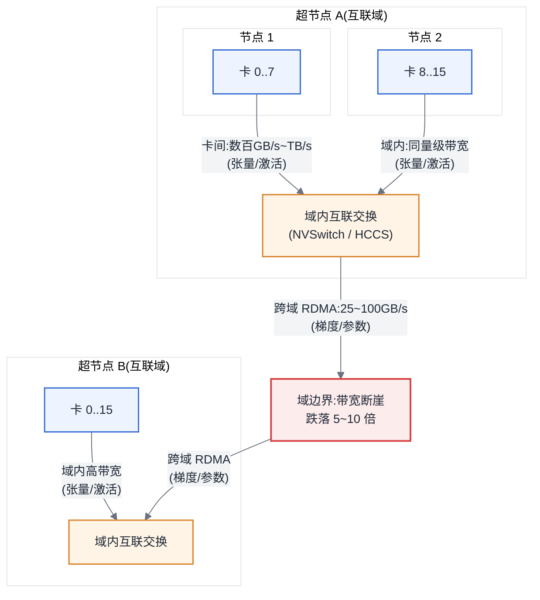
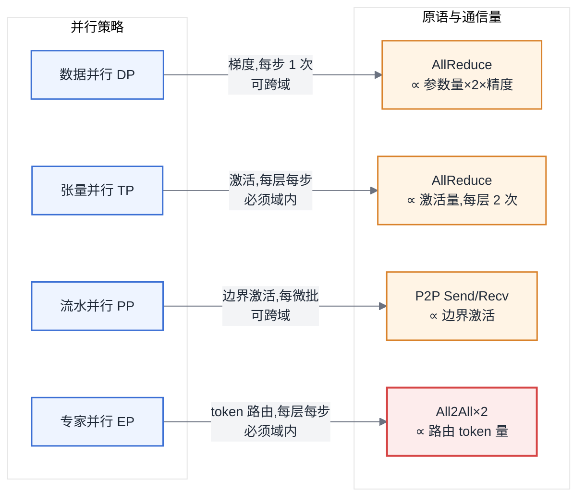
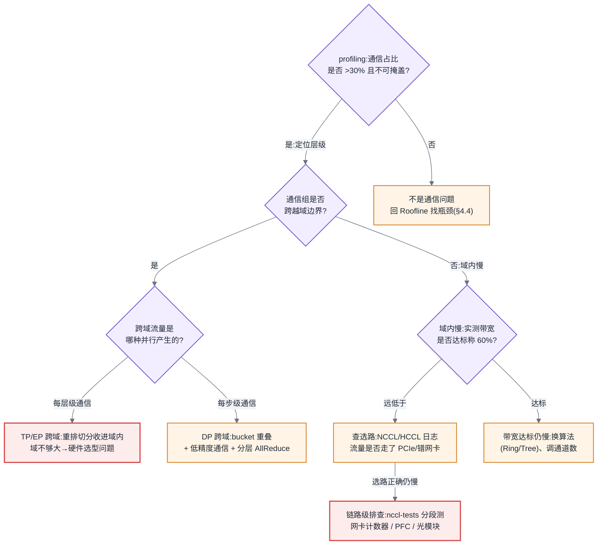

# 第 7 章 互联与集合通信

## 7.1 链路定位

本章位于主线 A(一次训练任务的生命周期)的"梯度同步"一段,同时覆盖主线 B(一次推理请求的全链路)中跨卡权重访问与 KV 传输的底层通道——训练每一步的梯度、张量并行每一层的激活、MoE 每一次的 token 路由,都要从这条链路上过。

## 7.2 依赖声明

本章建立在两条前置结论之上:[§4.1.3](第04章-硬件第一性原理、架构范式与数值精度.md#413-规模层级互联域是关键抽象) 已经指出"规模层级决定带宽层级",互联域(超节点)是硬件侧给出的物理事实;[§6.2](第06章-模型结构的定量分析.md#62-参数量与资源换算核心) 已经给出了模型的参数量与激活量估算方法,本章把这些字节数放到具体的线缆上,算出它们要走多久。

## 7.3 问题场景:加卡不加速

一个 32 卡的稠密模型训练任务,单步耗时 4.1 秒,团队为了赶进度把规模扩到 64 卡,数据并行度翻倍,预期单步耗时基本不变、总吞吐翻倍。结果上线后单步耗时变成 6.8 秒,总吞吐只提升了 20%,远低于预期;profiling 显示计算时间没变,AllReduce 时间从 0.6 秒涨到 3.3 秒。

负责扩容的工程师很困惑:带宽是按卡配的,每张卡的网卡没变,理论上 AllReduce 的通信量只和梯度大小有关,和卡数几乎无关(Ring 算法下每卡通信量约为 2 倍梯度量,与 N 无关),为什么卡数翻倍通信时间涨了五倍?

排查了三天才发现:原来的 32 卡恰好落在同一个互联域内——一台整机柜规模的超节点,域内卡间带宽数百 GB/s;扩容的 32 卡来自另一个机柜,两个域之间只有每卡 400 Gbps(50 GB/s)量级的 RDMA 网络。AllReduce 是同步操作,整个环的速度由最慢的一段决定:只要通信组跨过一次域边界,全组的有效带宽就被拉到跨域水平,域内那部分高带宽等于白配。更糟的是,调度器分配这 64 卡时完全没有感知域边界,两个域各拿了一些零散卡,跨域流量还在共享交换机上与另一个训练任务互相挤压,带来了长尾抖动。

这个故障的根因不在网络设备,而在一个认知缺失:**通信组的性能不取决于平均带宽,而取决于它跨过的最低带宽边界**。这条边界在哪里、怎么对齐它,就是本章要建立的心智模型。

## 7.4 原理与量化模型

### 7.4.1 互联技术:只记带宽量级和拓扑形状

平台工程师不需要背协议细节,但必须记住三类互联的带宽量级差和拓扑形状,因为后面所有估算都建立在这张表上:

| 层级 | 技术 | 双向带宽量级(每卡) | 拓扑形状 |
|---|---|---|---|
| 卡间(机内高速) | NVLink/NVSwitch、HCCS | 数百 GB/s ~ TB/s 级 | 全互联(经 Switch)或网状 |
| 卡间(机内退化路径) | PCIe | 数十 GB/s 量级(x16 双向上限约百余 GB/s,随代际演进,实际常远低) | 树形,经 CPU/Switch 中转 |
| 机间 | RDMA(InfiniBand / RoCE v2) | 200~800 Gbps,即 25~100 GB/s | Fat-Tree / Rail-optimized |

三个必须内化的事实:

第一,**相邻层级之间是量级差而不是百分比差**。NVLink 域内与跨机 RDMA 之间通常有 5~10 倍的带宽落差。这意味着通信优化的第一原则不是"调快",而是"别跨"——把大流量留在高带宽层内,收益远大于任何参数调优。

第二,**PCIe 是退化路径而不是并列选项**。当两张卡之间没有 NVLink 直连、或亲和性配置错误导致流量绕经 CPU 时,卡间带宽会跌到 PCIe 水平甚至更低。生产上大量"莫名慢了三倍"的案例,最后都定位到流量走了 PCIe 而不是高速互联——这是配置缺陷,不是容量问题。

第三,**RDMA 的价值在于旁路 CPU**(kernel bypass 与零拷贝),使机间通信延迟从毫秒级降到微秒级。InfiniBand 与 RoCE v2 的实质差异不在带宽而在运维:IB 是专网,无损开箱即得,但生态封闭、成本高;RoCE 跑在以太网上,依赖 PFC/ECN 调出无损,调不好就会出现 PFC 风暴与死锁——这笔运维债在第 31 章的成本模型里要计价。

对平台方的意味:互联规格表要转译成三个数记在心里——卡间、机间各是多少 GB/s、相差几倍。后面每一个并行方案评审、每一次扩容决策,都是在这三个数之间做算术,而不是在协议白皮书里找答案。

### 7.4.2 集合通信原语:四个动词与它们的通信量

集合通信(collective communication)原语是分布式训练的"动词表"。设通信组内有 N 个参与者,每个参与者持有(或最终获得)的数据量为 S 字节,四个核心原语如下:

| 原语 | 语义 | 每卡通信量(Ring 实现) | 训练中出现的位置 |
|---|---|---|---|
| AllReduce | 所有卡的数据规约(如求和)后每卡得到全量结果 | ≈ 2S·(N−1)/N ≈ **2S** | 数据并行的梯度同步 |
| ReduceScatter | 规约后每卡只得到 1/N 分片 | ≈ S·(N−1)/N ≈ **S** | ZeRO/FSDP 的梯度分片规约 |
| AllGather | 每卡的分片汇聚为全量,人人一份 | ≈ S·(N−1)/N ≈ **S** | ZeRO/FSDP 的参数聚合、TP 的激活拼接 |
| All2All | 每卡向每卡发送不同分片,相当于全局转置 | ≈ S·(N−1)/N,但流量模式为 N² 条流 | **MoE 的 token 路由**(专家并行) |

两个结构性事实值得单独强调:

**AllReduce = ReduceScatter + AllGather**。这不是巧合而是实现:Ring AllReduce 就是先做一圈 ReduceScatter 再做一圈 AllGather,所以 2S 的通信量正是 S + S。ZeRO 系列优化的本质,就是把这两半拆开、分别挪到最合适的时机执行(见第 17 章)。

**All2All 是最难伺候的原语**。前三个原语的流量模式规整、可以组织成环或树;All2All 是 N² 条点对点流,同时打满交换网络的所有路径,对网络的拥塞控制和负载均衡最敏感,且 MoE 的路由是数据依赖的——每步流量分布都在变,无法静态优化。MoE 模型的专家并行为什么必须约束在高带宽域内,根源就在这里(第 16 章会用到这个结论)。

对平台方的意味:看到一个训练方案时,先在脑子里把它翻译成"每步执行哪些原语、每个原语搬多少字节"。原语是通信的会计科目——不会这套记账法,就无法审计任何一个并行方案的通信成本。

### 7.4.3 拓扑感知:Ring、Tree 与调优入口

同一个 AllReduce,可以用不同算法实现,适用场景由"消息大小 × 组规模"决定:

- **Ring**:带宽最优(每卡通信量 2S 与 N 无关),但延迟随 N 线性增长(2(N−1) 步)。适合大消息、中等规模——训练梯度同步的主力。
- **Tree(double binary tree)**:延迟随 N 对数增长,大规模小消息下显著优于 Ring;代价是带宽利用率略低。NCCL 在大规模组上会自动切换到 Tree。

NCCL 的价值有一半在拓扑探测:启动时它扫描 PCIe/NVLink 拓扑与网卡位置,自动为每个通信组选路选算法。平台方需要掌握的调优入口只有几类:`NCCL_ALGO`/`NCCL_PROTO`(强制算法与协议)、`NCCL_IB_HCA`/`NCCL_SOCKET_IFNAME`(网卡绑定,机间通信走错网卡是高频事故)、`NCCL_MIN/MAX_NCHANNELS`(通道数),以及最重要的诊断开关 `NCCL_DEBUG=INFO`——它打印出的实际选路,是验证"流量有没有按你以为的路径走"的第一手证据。原则是:**先看它选了什么,再决定要不要改**;盲调环境变量是玄学,读拓扑日志是工程。

对平台方的意味:通信库的调优入口应当收敛为平台侧的标准配置(网卡绑定、调试开关、基准脚本),随任务模板下发,而不是留给每个业务团队各自摸索——第 19 章的训练工程层会把这件事产品化,这里先立下"平台管拓扑、业务管模型"的分工边界:业务方越过边界自行调整选路参数,出了性能问题平台无法归因,这是利用率举证(第 11 章)最常见的扯皮来源。

### 7.4.4 互联域与三级拓扑【本章核心】

> **域边界(Domain Boundary):互联带宽发生量级跌落的位置。域内是一个带宽量级,跨过边界跌一个量级。它是本书后半部分反复引用的一条线——并行切分(第 16 章)、故障爆炸半径(第 20 章)、PD 分离的收益模型(第 24 章)、容量规划(第 31 章),全都要对齐它。**

传统 GPU 集群的拓扑是两级的:机内(NVLink,8 卡)和跨机(RDMA)。超节点(SuperPod / 超节点整机柜,见 [§4.1.3](第04章-硬件第一性原理、架构范式与数值精度.md#413-规模层级互联域是关键抽象))把高速互联域从单机 8 卡扩展到几十甚至上百卡——一个机柜内所有卡通过交换芯片全互联,享受统一的数百 GB/s 带宽。于是拓扑从两级变成**三级**:

1. **卡间**:同一节点内直连,带宽最高;
2. **域内**:同一超节点内经互联交换,带宽与卡间同量级或略低——这是超节点的意义所在,它把"机内"的边界推到了整个机柜;
3. **跨域**:超节点之间走 RDMA 网络,带宽跌落 5~10 倍。



图 7-1:三级拓扑与域边界。通信组的有效带宽由它跨过的最低一级决定——切分方案的第一件事是让大流量不越过红色边界。

域边界带来三条推论,每条都会在后面的章节里兑现:

**推论一:并行切分必须对齐域边界。** 通信密集的并行维度(TP 每层两次 AllReduce、EP 每层两次 All2All)必须收在域内;通信稀疏的维度(DP 每步一次梯度 AllReduce、PP 只传边界激活)才允许跨域。超节点的价值不是"更多的卡",而是"更大的高通信并行度上限"——域是 64 卡,TP×EP 的乘积上限就是 64 而不是 8。这是第 16 章并行策略设计的第一约束。

**推论二:通信组的短板效应。** 一个逻辑上的 AllReduce 环只要有一段跨域,整组退化到跨域带宽。因此拓扑感知不仅是 NCCL 的事,更是调度器的事:第 8、9 章讲的拓扑感知调度,本质上就是保证任务拿到的卡在域上"整齐"。分层算法(域内先规约、跨域只传一份、域内再广播)可以缓解,但缓解的前提仍然是调度器知道域在哪里。

**推论三:域是故障与容量的自然单元。** 域内互联是共享部件,一个交换芯片故障影响整域(第 20 章的爆炸半径);采购与扩容按域为最小单位规划才有意义(第 31 章)。

对平台方的意味:**"集群有多少卡"是一个残缺的描述,完整的描述是"集群有几个域、每个域多少卡、域间什么网络"。** 从本章起,请用后一种方式描述你的集群。

### 7.4.5 HCCL 与昇腾互联

昇腾生态里与 NCCL 对位的是 HCCL(Huawei Collective Communication Library),平台方需要掌握的是映射关系而不是重新学一遍:

- **原语对应**:AllReduce/AllGather/ReduceScatter/All2All 语义一一对应,PyTorch 侧通过 `torch_npu` 注册 `hccl` 通信后端,初始化进程组时把后端名从 `nccl` 换成 `hccl` 即可,上层训练代码基本不改——这是第 12 章异构迁移评估里"通信层"一项通常可以打勾的原因。
- **拓扑差异**:卡间高速互联是 HCCS。传统 8 卡 Atlas 服务器上 HCCS 的典型形态是两个 4 卡全互联组(而非 8 卡全互联),跨组走 PCIe——所以在这类机器上 TP=8 的性能远差于 TP=4,切分必须对齐 4 卡组。而昇腾超节点(如 CloudMatrix 形态)用高速总线把域扩展到上百甚至数百卡,是"用互联域换单卡差距"路线的代表:单卡算力弱于对手,靠更大的高带宽域把整体拉回来。三级拓扑模型在昇腾上不仅成立,而且更关键。
- **组网与调优入口**:HCCL 依赖 `ranktable` 文件静态描述组网(设备 IP、rank 分布),不像 NCCL 那样以自动探测为主——组网文件写错是昇腾集群初始化失败的第一大原因。调优与诊断入口:`HCCL_INTRA/INTER_*` 系列环境变量区分域内/跨域行为,`HCCL_ALGO` 选算法,配合 `ascend-dmi` 与 profiling 工具看实际链路。心智模型与 NCCL 一致:先确认选路,再谈调参。

对平台方的意味:评估昇腾集群的通信能力时,不要问"HCCL 比 NCCL 差多少"——这个问题没有答案;要问"这台机器的 HCCS 域是几卡、超节点域是几卡、跨域是什么网络",然后套用与 NVIDIA 集群完全相同的三级拓扑分析。库是可替换的,拓扑心智模型是通用的,这也是第 12 章异构迁移评估的方法论基础。

### 7.4.6 通信量估算:每步多少字节,走哪条线

这是本章的可计算核心。记号:P 为参数量(个),b 为通信精度字节数(FP16/BF16 为 2,FP8 为 1),TP/PP/DP/EP 为各并行度,B 为微批 token 数,H 为隐层维度,L 为层数,f 为 MoE 每 token 激活的专家数。

| 并行策略 | 原语 | 每卡每步通信量(量级) | 频率 | 应落在哪一级 |
|---|---|---|---|---|
| 数据并行 DP | AllReduce(梯度) | ≈ 2·(P/TP/PP)·b | 每步 1 次 | 可跨域(可与反向重叠) |
| ZeRO/FSDP | ReduceScatter + AllGather | ≈ 3·(P/TP/PP)·b(含前向重聚参数) | 每步 | 域内优先 |
| 张量并行 TP | AllReduce(激活) | ≈ 2·B·H·b × 每层 2 次 × L/PP | **每层每步** | 必须域内,首选卡间 |
| 流水并行 PP | P2P Send/Recv(边界激活) | ≈ B·H·b × 流水段数 | 每微批 | 可跨域 |
| 专家并行 EP | All2All × 2(dispatch+combine) | ≈ 2·f·B·H·b × MoE 层数 | **每层每步** | 必须域内 |

耗时估算用最简单的 α–β 模型即可:

> **T_comm ≈ 通信量 V ÷ 有效带宽 B_eff + 启动延迟项**,其中 **B_eff 取决于通信组跨过的最低层级**:域内用域内带宽,跨域用跨域带宽——这就是"两套带宽参数"的含义。有效带宽按标称的 60~80% 取值(协议开销与拥塞)。

算一遍 7.3 的问题场景:70B 参数模型,TP=8、PP=1,DP 组内每卡梯度约 70G/8 ≈ 8.75G 个参数,BF16 梯度 AllReduce 通信量 ≈ 2 × 8.75G × 2B = 35 GB。域内按 200 GB/s 有效带宽,耗时约 0.18 秒,与反向重叠后几乎免费;跨域按 40 GB/s 有效带宽,耗时约 0.9 秒,再叠加与邻居任务的拥塞争抢,3 秒的 AllReduce 一点也不奇怪。**同一个公式,换一个 B_eff,结论差一个量级——这就是为什么估算必须带着拓扑做。**

对平台方的意味:这张表加这个公式,就是你在方案评审会上的武器。任何并行方案在申请资源之前,都应当能被要求交出"每步域内多少 GB、跨域多少 GB、估算耗时多少"三个数;交不出来的方案不应当进集群——这条纪律的执行成本是十分钟的算术,不执行的成本是 7.3 那样的三天排查。



图 7-2:并行策略与通信模式的对应。频率越高的通信必须放在越高的带宽层级上——EP 的 All2All 频率高且流量模式最恶劣,是域内带宽的第一顺位占用者。

### 7.4.7 低精度通信与梯度压缩

α–β 模型里 V = 元素数 × b,于是降低 b 是最直接的通信优化:**通信量随精度线性缩减**。

- **BF16/FP16 梯度通信**:混合精度训练的默认形态,相对 FP32 通信量减半,收敛影响可忽略——2026 年没有理由再用 FP32 做梯度 AllReduce。
- **FP8 通信**:再减半。梯度对精度比权重敏感,直接 FP8 规约有累积误差风险,工程上常配合分块缩放或高精度累加。在跨域带宽是硬瓶颈、且有充分收敛验证手段时值得上;反之不要为 10% 的端到端收益引入一个需要算法团队陪跑的变量。
- **梯度压缩(1-bit/Top-k 稀疏化 + 误差反馈)**:压缩率可达 10~100 倍,但它改变了优化动力学,需要误差补偿、需要逐模型验证收敛,而且压缩/解压本身吃算力。适用边界很窄:跨域带宽极低(如跨机房训练)且团队有能力做收敛对照实验。**在域内带宽充足的场景使用梯度压缩,是拿收敛风险换不需要的带宽,纯亏。**

判断次序应当是:先对齐域边界(免费),再上低精度通信(便宜),最后才考虑压缩(昂贵)。这个次序在 7.5 节展开。

对平台方的意味:低精度通信是平台可以默认提供的能力(BF16 通信应当是集群的出厂设置),梯度压缩则是必须由业务方发起、算法团队签字的变更——因为前者不动收敛,后者动。把这条线划在平台配置模板里,可以避免"平台为了带宽指标偷偷开压缩、业务发现 loss 异常"这类责任事故。

### 7.4.8 网络故障的表现形式与排查

集合通信是同步操作,这决定了网络故障的表现形式与大数据时代完全不同:**不是报错,而是变慢或卡死**。

- **卡死(hang)**:某卡掉线或某链路中断,其余所有卡在集合通信处永久等待,利用率显示 100%(都在忙等)但 loss 不再更新。这是第 20 章故障检测的核心难题:没有异常栈,只有静默。
- **集体变慢**:单条链路降速(光模块劣化、PFC 反压、ECN 误配),同步语义把它放大成全组变慢。表现为 step time 整体抬升或周期性长尾。
- **性能"随机"波动**:与其他任务共享跨域交换网络导致的拥塞,复现困难。

排查路径固定为三步:第一步,`NCCL_DEBUG=INFO` / HCCL 日志确认实际选路与拓扑认知一致(一半的"网络故障"其实是流量走错了路);第二步,用 nccl-tests / hccl_test 在怀疑的通信组上跑基准,把"应用慢"降维成"链路慢",对照 7.4.6 的估算值判断是否达标;第三步,链路级排查(网卡计数器、PFC pause 帧、光模块)。原则:**先证明流量走在哪,再测那条路快不快,最后才查设备**——跳步排查是生产上浪费最多时间的模式。

对平台方的意味:把这三步固化成随集群交付的自检脚本(拓扑打印 + 分组基准 + 链路计数器采集),并在任务启动前自动跑通信组基准。故障分诊时,"链路达标与否"的举证责任在平台,"通信量是否符合方案申报"的举证责任在业务——这条边界不划清,每次变慢都会演变成平台与算法团队的相互指责,第 20 章的分诊流程建立在这里划下的边界上。

## 7.5 方案对比:通信成为瓶颈后的三条路

当 profiling 确认通信占比过高(如 step time 的 30% 以上且无法被计算掩盖),有三类处置方案,各有明确的失效边界:

**方案一:重排切分,对齐域边界(首选)。** 调整并行维度映射,把 TP/EP 收进域内、让跨域只承担 DP/PP 流量;配合调度器的拓扑感知分配保证拿到"整齐"的卡。成本近似为零,收益经常是数倍。**失效边界**:当模型规模要求的高通信并行度超过域大小(如 MoE 需要 EP=64 而域只有 16 卡),切分再怎么排也必须跨域——这时问题升级为硬件选型问题(要不要上超节点,见第 12、31 章);另外,若调度器无法保证整域分配(多租户碎片化严重,见第 11 章),纸面最优切分拿不到对应的物理拓扑,方案落空。

**方案二:通信与计算重叠 + 低精度通信(次选)。** 把 DP 梯度 AllReduce 按 bucket 切开、与反向计算重叠;通信降到 BF16/FP8。改动小、风险可控。**失效边界**:重叠只能隐藏"计算时间 ≥ 通信时间"的部分,当通信时间本身超过反向计算时间,重叠到顶也遮不住;TP/EP 的通信在关键路径上,与计算天然串行,重叠空间有限;FP8 通信则受限于收敛验证能力——没有对照实验条件的团队不应默认开启。

**方案三:梯度压缩 / 通信拓扑重构(末选)。** 1-bit Adam、Top-k 稀疏化,或分层 AllReduce、跨机房异步训练等结构性手段。压缩率惊人,但**失效边界**最宽:改变收敛动力学,必须逐模型验证;压缩计算本身占用 SM;对 TP/EP 这类激活通信基本无效(激活压缩的失真直接进前向)。它只在"跨域带宽先天不足且无法通过采购解决"(如跨地域训练)时才是正解;在一个正常的超节点集群里走到这一步,通常说明前两条路没有走完。

对平台方的意味:三条路的排序是固定的——**拓扑对齐 > 重叠与低精度 > 压缩**,因为成本与风险依次上升。评审一个训练方案时,如果对方在没做拓扑对齐的情况下先谈梯度压缩,这是方案不成熟的信号。

## 7.6 大数据对照:Shuffle 与集合通信

集合通信最贴切的大数据对应物是 Spark/MapReduce 的 shuffle:都是全局数据交换,All2All 与 shuffle 在流量模式上几乎同构(每个分区向每个分区发数据)。可复用的直觉有两条:一是"全局交换是最贵的操作,能省则省"——Spark 时代避免宽依赖的本能,对应这里避免不必要的 AllReduce 与 All2All;二是数据本地性思维——"把计算搬到数据旁边"在这里变成"把高频通信收进高带宽域",7.4.4 的推论一就是本地性原则的拓扑版。

但有三个结构性差异,照搬旧经验会直接踩坑:

**同步 vs 异步。** Shuffle 是异步解耦的:map 端写完落盘,reduce 端慢慢拉,单个 fetch 失败重试即可,一个慢节点只拖长尾。集合通信是同步阻塞的:所有参与者必须同时到达,任何一卡掉队全组等待,慢节点不是拖长尾而是定义了全组速度。**大数据的"个别失败重试"容错模型在这里彻底失效**——没有"重试一个 AllReduce 分片"这回事,失败的最小恢复单元是整个任务回滚到 checkpoint(第 20 章)。

**可落盘 vs 纯内存。** Shuffle 以磁盘为缓冲,天然提供了重试的物理基础,代价是吞吐以磁盘为界。集合通信在 HBM 与互联链路上直接进行,微秒级延迟,但没有任何持久化缓冲——这就是为什么 shuffle 调优谈的是溢写与合并,而集合通信调优谈的是拓扑与算法。

**网络角色不同。** 大数据集群的网络是"尽力而为"的共享资源,TCP 丢包重传天经地义;训练网络是同步计算的一部分,一次丢包引起的重传抖动会被同步语义放大到全组,所以才需要 RDMA 无损网络。把大数据时代"万兆以太网够用了"的网络规划经验带进 AI 集群,是采购环节最昂贵的错误之一。

一句话总结:shuffle 教给你的"全局交换很贵、本地性优先"依然成立;但它的容错与网络假设必须整套丢弃,因为同步语义把"个体故障"升格成了"全局故障"。

## 7.7 选型决策树:我的通信瓶颈在哪一级,该调什么

排查与优化的完整判断路径如下,建议对着自己的 profiling 结果走一遍:



图 7-3:通信瓶颈分级排查决策树。先定位瓶颈在三级拓扑的哪一级,再对症处置——跨域的每层级通信(TP/EP)是唯一必须动切分甚至动硬件的情况,其余都有软件解。

## 附:Ring AllReduce 过程示意

为了把 7.4.2 的公式落成画面,下图展示 4 卡 Ring AllReduce 的两阶段过程(数据切成 4 块,先 ReduceScatter 后 AllGather):

```mermaid
%%{init: {'theme':'base','themeVariables':{
  'primaryColor':'#EEF4FF','primaryBorderColor':'#3B6FD4','primaryTextColor':'#1F2937',
  'secondaryColor':'#F3F4F6','tertiaryColor':'#FFFFFF',
  'lineColor':'#6B7280','fontFamily':'-apple-system, Segoe UI, Helvetica, Arial, sans-serif','fontSize':'14px'
}}}%%
sequenceDiagram
  participant G0 as 卡0
  participant G1 as 卡1
  participant G2 as 卡2
  participant G3 as 卡3
  Note over G0,G3: 阶段一 ReduceScatter:环上传递并累加分块,3 步后每卡持有 1 个全和分块
  G0->>G1: 分块a(部分和)
  G1->>G2: 分块b(部分和)
  G2->>G3: 分块c(部分和)
  G3->>G0: 分块d(部分和)
  Note over G0,G3: …重复 N−1=3 步,分块沿环累加…
  Note over G0,G3: 阶段二 AllGather:环上传递全和分块,3 步后人人持有全量
  G1->>G2: 分块a(全和)
  G2->>G3: 分块b(全和)
  G3->>G0: 分块c(全和)
  G0->>G1: 分块d(全和)
  Note over G0,G3: 每卡总通信量 ≈ 2S·(N−1)/N,与卡数基本无关;但整环速度由最慢链路决定
```

图 7-4:Ring AllReduce 的两阶段流转。每卡通信量约 2S 与卡数无关,这是"加卡不加通信量"的依据;但环速由最慢一段决定,这是"跨域一段、全组退化"的依据——两个结论都来自同一张图。

---

**读完本章,你应当能**:拿到一张集群拓扑图,标出它的三级带宽层级与域边界;对一个给定的并行方案(P、TP/PP/DP/EP、精度)算出每步的域内与跨域通信量,并用两套带宽参数估出 AllReduce 耗时;据此判断一次"加卡不加速"是拓扑问题、配置问题还是链路问题,并按"拓扑对齐 → 重叠与低精度 → 压缩"的次序给出处置顺位。
