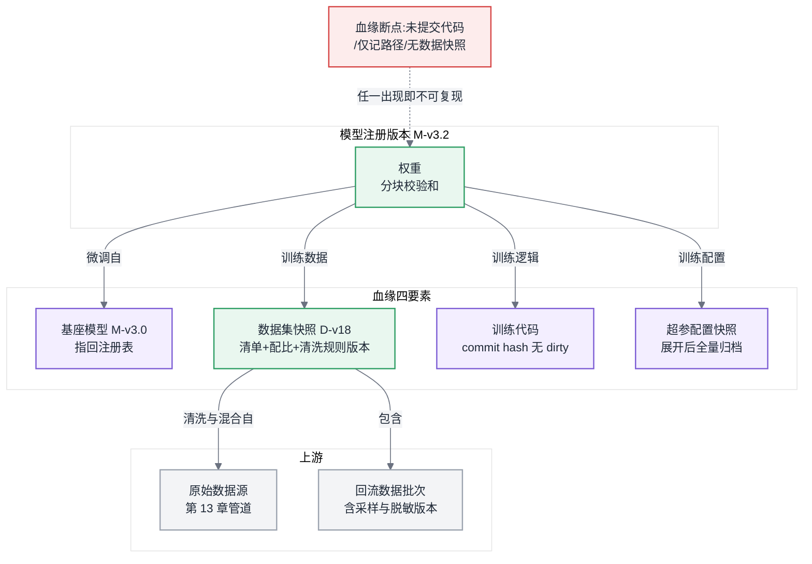
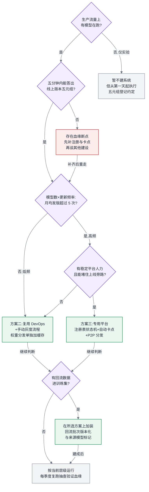

# 第 30 章 模型生命周期管理

## 30.1 链路定位

本章位于主线 A 与主线 B 的交汇点:一次训练任务的生命周期在产出权重的那一刻并没有结束,一次推理请求的全链路在权重加载进显存之前也没有开始——从"训练产出一份权重"到"这份权重稳定地服务线上流量、其表现又回流影响下一次训练",中间这段被两条主线共同遗漏的流转链路,就是本章的范围。

## 30.2 依赖声明

本章建立在三条前文结论之上:第 13 章的结论"数据飞轮是一个基础设施问题,回流数据必须版本化管理";第 25 章的结论"推理实例的冷启动时间由权重拉取主导,权重分发是容量弹性的物理下限";以及 §29.2 的结论"评测是一个吃卡的批任务,其结果必须可复现才能接进 CI 当卡点"。本章把这三条结论串成一个闭环流程。

## 30.3 问题场景:一次回滚不出去的回滚

周四晚上,客服问答业务的线上质量监控(见 §29.2)报警:模型对退款类问题的拒答率从 3% 爬到了 11%,趋势持续了六小时。值班工程师的第一反应是回滚——这在普通服务上是五分钟的操作。然后他发现了三件事。

第一,他说不清线上跑的是哪个版本。推理集群共 40 个实例,权重是三周前由一位已休假的同事用脚本 `scp` 到共享存储再滚动重启的,存储路径叫 `model_final_v2_fixed/`,目录里没有任何元信息文件;而模型仓库里有一个 tag 也叫 v2,两者的权重文件 md5 对不上。第二,他不知道该回滚到什么。上一个"已知良好"的版本在哪个路径?它当时通过了哪些评测?没人能回答,因为评测结果记在训练同学的个人笔记里。第三,即使找到了旧权重,他也不敢直接全量切换——旧版本训练时用的 tokenizer 词表和当前推理镜像里打包的词表是否一致,没有任何记录能证明。

最终这次"回滚"演变成一场持续到凌晨三点的考古:翻聊天记录、比对文件时间戳、抓一台实例的显存加载日志反推权重来源。事后复盘发现根因是两周前一次数据回流(第 13 章的飞轮管道)把一批含模板化拒答话术的客服日志混进了 SFT 数据,而那次训练用的数据集快照没有留存,连"重训一个干净版本"都做不到,只能从更早的备份重新开始。整个事故中,没有一个环节的技术是难的;难的是每个环节都没有留下可追溯的记录。这正是本章要解决的问题:**模型生命周期管理的本质不是一个工具,而是一套强制留痕的流程设计。**

## 30.4 原理与量化模型

### 30.4.1 全生命周期:每个环节产出制品,每次流转经过卡点

先给出全章的总图。模型生命周期是一个闭环:数据经训练产出候选权重,候选经评测准入成为发布版本,发布版本经灰度成为线上版本,线上表现经回流采样进入下一轮数据。流程设计的两条铁律是:**每个环节必须产出不可变的制品(artifact),每次环节间流转必须经过显式卡点(gate)**。制品保证"任何时刻都能说清现在是什么",卡点保证"任何流转都有人或规则签过字"。

```mermaid
%%{init: {'theme':'base','themeVariables':{
  'primaryColor':'#EEF4FF','primaryBorderColor':'#3B6FD4','primaryTextColor':'#1F2937',
  'secondaryColor':'#F3F4F6','tertiaryColor':'#FFFFFF',
  'lineColor':'#6B7280','fontFamily':'-apple-system, Segoe UI, Helvetica, Arial, sans-serif','fontSize':'14px'
}}}%%
flowchart LR
  classDef compute fill:#EEF4FF,stroke:#3B6FD4,stroke-width:1.5px,color:#1F2937
  classDef data fill:#E9F7EF,stroke:#2E9E64,stroke-width:1.5px,color:#1F2937
  classDef ctrl fill:#F3EEFF,stroke:#7C5CD4,stroke-width:1.5px,color:#1F2937
  classDef ext fill:#F3F4F6,stroke:#9CA3AF,stroke-width:1.5px,color:#1F2937

  subgraph 训练域
    DS[数据集快照<br/>制品:版本号+校验和]:::data
    TR[训练任务<br/>第16-19章]:::compute
    CK[候选权重<br/>制品:权重+训练清单]:::data
  end
  subgraph 发布域
    EV[评测流水线<br/>§29.2]:::compute
    REG[模型注册表<br/>制品:注册版本+血缘]:::ctrl
    PKG[制品打包<br/>权重+词表+配置]:::data
  end
  subgraph 服务域
    GRAY[灰度发布<br/>影子/小流量]:::ctrl
    PROD[全量上线<br/>第23-25章]:::compute
  end
  MON[质量监控<br/>§29.2]:::ext

  DS -->|训练数据| TR
  TR -->|权重+超参+代码指纹| CK
  CK -->|卡点1:评测准入| EV
  EV -->|评测报告| REG
  REG -->|卡点2:发布审批| PKG
  PKG -->|分发权重包| GRAY
  GRAY -->|卡点3:灰度指标达标| PROD
  PROD -->|线上请求与反馈| MON
  MON -->|回流采样 第13章| DS
```



图 30-1:模型全生命周期闭环。三个卡点缺一不可——缺卡点 1 会把没测过的模型发出去,缺卡点 2 会说不清线上是什么,缺卡点 3 会把效果事故直接放大到全量。

### 30.4.2 注册、版本与血缘:追到数据集与代码版本才算闭合

模型注册表(model registry)是整个流程的锚点,它回答一个问题:**给定线上任意一份正在服务的权重,能否在五分钟内答出它从哪来。**要答出这个问题,注册的一个版本必须绑定五元组:

```
模型版本 = (权重校验和, 基座模型版本, 数据集快照版本, 训练代码版本, 超参配置快照)
```

五个字段各有一个常见的偷懒陷阱,逐一说明:

- **权重校验和**:必须对权重文件本体做哈希(大文件可用分块哈希拼接),而不是记路径。路径会被覆盖,哈希不会说谎。问题场景里 md5 对不上却同名 v2,就是只记路径的后果。
- **基座模型版本**:微调产物必须指回基座的注册版本,形成版本链。基座若来自外部开源权重,首次入库时同样注册并记录来源与校验和——外部权重悄悄换文件不换名的事发生过不止一次。
- **数据集快照版本**:这是模型血缘与普通服务血缘最大的差异所在。代码决定服务的行为,而**数据和代码共同决定模型的行为,且数据的影响往往更大**。因此血缘必须追到第 13 章定义的数据集版本(快照 + 配比配置 + 清洗规则版本),而不是一句"用了客服数据"。问题场景中"重训干净版本都做不到",就是数据集没有快照的直接代价。快照的存储成本是真实的:TB 级 SFT 数据全量快照并不贵,但预训练级数据集应采用清单式快照(manifest,记录文件列表 + 各文件校验和 + 采样配置),存储开销从数据本体的 O(N) 降到清单的 O(文件数),可复现性不打折扣。
- **训练代码版本**:记 commit hash 还不够,要加一条硬规则——**工作区有未提交修改的训练任务,禁止产出可注册的权重**。训练平台在提交任务时检查 dirty 标志即可实现,成本近乎为零,却堵住了"改了两行没提交,三个月后死无对证"这个最高频的血缘断点。
- **超参配置快照**:训练启动时把最终生效的完整配置(含所有默认值展开后的结果)序列化归档,而不是记"用了哪个配置文件"——配置文件本身会变,且层层继承的默认值在框架升级后可能悄悄漂移。



图 30-2:模型血缘四要素。血缘链条的强度等于最弱一环——四要素里任何一个只记了"大概",整条链就退化为不可复现。

血缘的验收标准只有一条,可以量化:**抽取任意一个线上版本,按注册信息从头复跑训练,能得到评测指标在噪声范围内一致的模型。**做不到逐 bit 一致没关系(并行训练的非确定性见第 18 章),做不到指标级复现就说明血缘有断点。建议每季度真做一次这样的抽查,它同时也是对训练平台可复现性的回归测试。

### 30.4.3 灰度、回滚与影子流量:效果问题不会立即报警

模型灰度与普通服务灰度共享机制(按流量比例切分、按用户分桶),但有一个根本差异:**普通服务的故障信号是快变量,模型的效果信号是慢变量。**服务崩了,错误率一分钟内可见,灰度 5% 观察十分钟就能决策;模型质量下降表现为拒答率、投诉率、任务完成率这类统计指标的漂移,在 5% 流量上要积累到统计显著,可能需要数小时到数天。这个差异重塑了灰度设计的三个参数:

**观察窗口要按样本量算,不能按时间拍。**要在灰度流量上以给定置信度检出指标从 p 到 p+δ 的恶化,所需样本量约为 n ≈ 16·p(1−p)/δ²(双侧 95% 置信、80% 检验功效的常用近似)。代入问题场景的数字:拒答率基线 3%,要检出恶化到 5%(δ=0.02),需要约 1200 条相关请求;若退款类问题占总流量 8%、灰度切 5%、总 QPS 为 20,则积累 1200 条需要 1200/(20×0.08×0.05) ≈ 4.2 小时。这笔账给出的结论是:**灰度观察窗口是算出来的,不是"观察一晚上"拍出来的**;流量小的业务要么加大灰度比例,要么接受更长的窗口,要么只监控更粗粒度的指标。

**影子流量(shadow traffic)是模型场景下性价比最高的灰度前置。**把线上请求复制一份发给新模型,响应不返回用户,只记录下来做离线对比。它的优势恰好补上慢变量的短板:因为不影响用户,可以放 100% 流量,样本积累速度是 5% 灰度的 20 倍,上面那 4.2 小时缩短到 13 分钟量级;还能对新旧模型做逐请求配对比较,统计效率远高于分桶对比。代价有三:一份完整的推理算力(影子集群的容量要按第 25 章的口径单独规划)、有状态请求的处理(多轮对话的影子请求需要回放上下文,写操作必须打桩隔离)、以及无法观测用户对回答的真实反馈(点踩、追问、放弃)。所以影子回答"新模型响应本身好不好",小流量灰度回答"用户买不买账",两者是串联关系不是二选一。

**回滚的工程要求:权重就位,配置切换。**慢变量意味着发现问题时坏版本可能已经服务了几小时,回滚速度直接决定事故面积。因此上一个良好版本的权重必须常驻在推理节点本地或近端缓存(分发机制见下节),回滚操作退化为一次配置下发 + 实例内权重热切换或滚动重启,目标是分钟级。如果回滚要现从对象存储拉几百 GB 权重,按第 25 章冷启动的账,回滚时间就是十几分钟起——对已经烧了几小时的效果事故来说,这十几分钟是纯粹的设计失误。同时,**回滚必须是注册表上的一次版本指针切换并留痕**,而不是运维手工换文件;问题场景里"不知道该回滚到什么",就是因为"上一个良好版本"从来不是一个系统内的概念,只是某些人脑中的记忆。

### 30.4.4 制品管理与权重分发:被低估的一环

模型制品不等于权重文件。一个可部署的制品包至少包含:权重、tokenizer 与词表、推理配置(量化方式、并行切分、生成参数默认值)、以及依赖声明(要求的推理引擎能力,如某种注意力变体的算子支持)。问题场景里"不敢回滚"的直接原因就是词表与权重是否配套无从证明——**凡是不一致会导致模型行为改变的东西,都必须进同一个制品包、共享同一个版本号**。词表不匹配是其中最阴险的:它通常不报错,只是安静地输出乱码或质量劣化。

权重分发被低估,是因为它的量级与容器镜像差着一到两个数量级:百亿参数模型 FP8/INT8 部署的权重包在几十 GB,数百亿到千亿级在一两百 GB。三笔账决定分发架构:

- **带宽账**:200 GB 权重推给 40 个实例,若都从单一对象存储桶拉取,总量 8 TB;桶的聚合带宽若为 10 GB/s,串行化时间约 13 分钟,且这段时间该桶的其他读者(比如正在跑的评测任务)一起被挤压。P2P 分发(每个已完成节点成为新的源)把源端带宽需求从 O(N) 降为 O(1),几十节点规模下总时间趋近于"单节点拉一次 + 少量传播轮次"。
- **频率账**:分发不只发生在发版时。自动扩容(第 25 章)、故障重调度、回滚,每一次都是一次分发。因此分发系统的设计目标不是"发版时够快",而是"任意时刻任意节点获取任意近期版本都快",这指向节点本地缓存 + 机架/可用区级缓存的多级结构,近两个版本常驻热缓存(这同时满足了上节回滚的就位要求)。
- **校验账**:分发的终点不是"文件落盘",而是"加载进显存的权重与注册表校验和一致"。传输层校验 + 加载时抽样校验都要有;跳过校验省下的几秒钟,赔付方式是问题场景里的那种考古之夜。

### 30.4.5 准入卡点与飞轮接口:闭环的两个衔接处

**准入卡点(图 30-1 的卡点 1)把 §29.2 的评测流水线变成流程上的强制关口。**设计要点有三。其一,卡点必须绑定注册动作:评测未通过的权重不能获得可发布状态,技术上就是注册表的状态机(候选 → 已评测 → 可发布 → 已上线 → 已归档)只能由评测流水线的签名结果驱动跃迁,人不能手工把状态改成"可发布",只能在留痕的前提下走豁免审批。其二,评测集本身要进血缘:评测结果五元组之外还要记评测集版本,否则"上个版本 82 分这个版本 85 分"可能只是评测集变了。其三,卡点内容分层:回归评测(老能力不许跌)是硬门槛,新能力评测是发布说明的一部分而非门槛——把所有指标都设成硬门槛的团队,三个月后一定在批量豁免,卡点形同虚设。

**飞轮接口(与第 13 章的衔接)要求回流数据以带版本的批次进入数据集。**第 13 章已定义回流管道的采样、脱敏与污染防控;本章补上生命周期侧的两个要求:回流批次必须记录"采集时线上是哪个模型版本"(否则第 13 章讲的自噬防控无从谈起——你需要知道哪些数据可能是哪个模型自己生成的);数据集快照必须能表达"包含哪些回流批次",这样当某个模型版本被定性为坏版本时,能反查并剔除它服务期间产生的可疑回流数据。问题场景的根因(坏回流数据进了训练集且无法定位)在这两条规则下是可以在一小时内定位并修复的。

所以这对做平台的人意味着什么:生命周期管理的每一项机制——注册、卡点、分发、回流版本——单看都很朴素,没有一项需要高深技术;它的全部价值在于**强制性**。平台的职责不是提供一个"可以登记模型的地方",而是让不登记的模型根本无法上线。

## 30.5 方案对比

三条建设路径,按投入递增排列,各有明确的失效边界:

**方案一:约定式管理(文档 + 命名规范 + 共享存储目录结构)。**零开发成本,靠团队纪律维持:路径按版本号组织、每个目录放一份 manifest 文件、发版走 checklist。失效边界非常明确:**人数超过一个能互相看见屏幕的小团队,或模型版本数超过两位数,或出现第一次人员交接。**它依赖"每个人都自觉",而问题场景已经演示了休假一个人就足以让链条断裂。2026 年还在用纯约定管理生产模型的团队,应当把本章当作整改依据而不是参考读物。

**方案二:复用现有 DevOps 设施(Git LFS/对象存储版本化 + 现有 CI + 制品仓库)。**把权重当大号制品塞进现有的软件交付流水线,注册表用制品仓库的元数据字段凑。优点是不引入新系统、权限和审计直接继承。失效边界有二:其一,**软件制品仓库的血缘模型只认代码,表达不了数据集这一维**,数据版本只能靠元数据字段里的自由文本,而自由文本血缘等于没有血缘;其二,分发路径按容器镜像的量级设计,百 GB 权重会把镜像仓库和节点磁盘同时压垮。它适合模型是"配角"的团队(少量模型、低频更新),一旦模型迭代成为主业务节奏就会到边界。

**方案三:专用模型生命周期平台(自建或采用 MLOps 类系统的注册表 + 血缘 + 发布编排)。**血缘作为一等公民建模,数据集版本、评测报告、发布状态机原生支持,权重分发单独建 P2P/多级缓存通道。失效边界同样存在:其一,**这类系统的血缘完整性依赖所有训练与发布动作都从它走**,只要存在旁路(有人还能 scp 权重上线),血缘就只是装饰——所以上平台的前提是先堵旁路,推理服务只接受来自注册表的制品,这是个组织决策而非技术决策;其二,自建的维护成本是长期的,团队若没有稳定的平台人力,两年后它会退化成又一个没人敢动的遗留系统。它适合模型数量、更新频率、参与团队三者至少两项到达两位数的组织。

三个方案的真实分界不是工具,而是问题规模。下面的决策树给出可执行的判断路径。

## 30.6 大数据对照

数据血缘(data lineage)在 Hadoop/Spark 时代已经是成熟命题:Hive 表的上下游依赖、调度 DAG 的产出关系,配套系统(如 Atlas 一类的元数据平台)能回答"这张表由哪些表加工而来"。模型血缘可以直接复用其中三样东西:元数据即制品的思想(表要注册,模型也要注册)、不可变分区/快照的版本化手法(Hive 分区对应数据集快照)、以及"血缘靠采集点强制、不靠人工登记"的教训——大数据时代所有靠人手工填的血缘系统最后都变成了过期文档,这条教训原样成立。

但两处根本差异使模型血缘不能照搬。第一,**血缘的语义强度不同**。数据血缘是函数式的:输入表 + 确定的 SQL/代码 = 输出表,复跑即复现,血缘记录"怎么算的"就够了。模型血缘是统计性的:同样的数据和代码,换一个随机种子、换一次并行切分(第 18 章),权重逐 bit 不同,只能追求指标级复现;因此模型血缘必须额外携带评测报告作为版本的"行为指纹"——数据血缘从不需要给一张 Hive 表附上"这张表的能力测试结果",模型血缘必须。第二,**坏版本的爆炸半径机制不同**。一张坏数据表的影响沿血缘图向下游静态传播,反查血缘图就能圈定污染面;一个坏模型的影响除了下游,还会经服务流量污染用户交互,再经回流管道折返进上游数据集——血缘图上出现了环。这就是 §30.4.5 坚持"回流批次记录来源模型版本"的原因:没有这个字段,环上的污染无法追踪,而大数据时代的血缘工具都默认血缘是 DAG,没有为环设计过任何机制。

一句话总结:表血缘答"从哪来"就够了,模型血缘要同时答"从哪来、行为如何、又流向了哪"。

## 30.7 选型决策树



图 30-3:生命周期管理建设层级决策树。第一道分叉不是团队规模而是"五分钟能否答出五元组"——答不出的团队无论规模多大,第一步都是补注册与卡点,而不是选平台。

---

读完本章,你应当能:为一个已有训练与推理能力的团队设计出从权重产出到线上服务的完整流转链路——包括定义出追到数据集版本与代码版本的五元组注册规范、算出给定流量与指标基线下的灰度观察窗口、按带宽与频率两笔账选定权重分发架构,并给出回滚在五分钟内完成所需的制品就位条件;拿到任何一套现成方案,你应当能用"抽一个线上版本能否指标级复现"这一条验收标准判断其血缘是否真的闭合。
