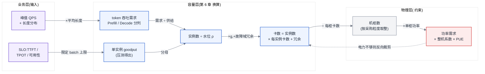
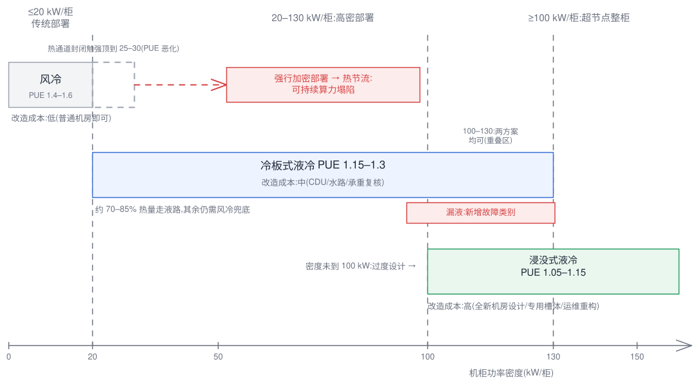
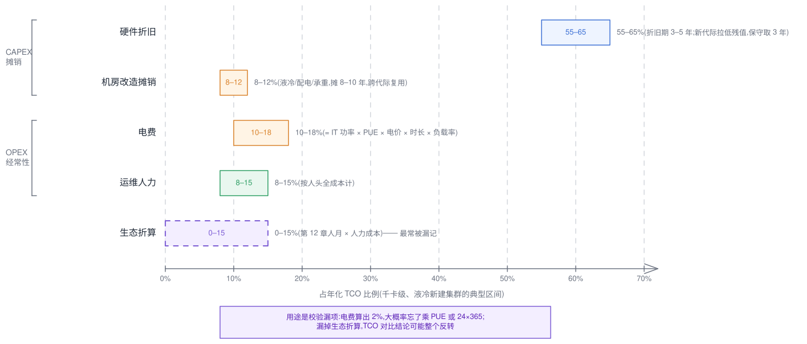
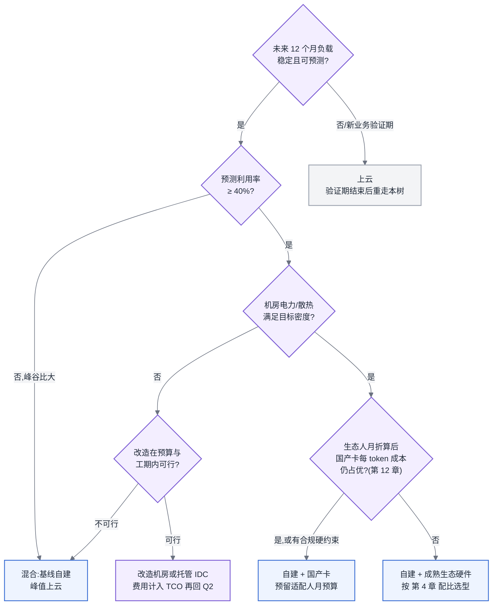

# 第 31 章 容量、成本与 SLO

## 31.0 链路定位与依赖声明

**链路定位**:本章不在主线 A 或主线 B 的某一段上,而是站在两条主线的终点回望全程——训练链路的每一段耗时、推理链路的每一毫秒延迟,最终都要折算成三个数字:需要多少卡(容量)、花多少钱(成本)、对外承诺什么(SLO)。这是全书的收口章。

**依赖声明**:本章建立在三条前置结论之上——[§6.2](../第一部分-基础与心智模型/第06章-模型结构的定量分析.md#62-参数量与资源换算核心) 的参数量与资源换算公式(训练约 6N FLOPs/token、推理约 2N,以及显存三分账),[§12.5](../第二部分-算力底座/第12章-国产算力平台与异构迁移.md#125-性能对标的正确姿势全书唯一定义处) 的性能对标口径与 [§12.7](../第二部分-算力底座/第12章-国产算力平台与异构迁移.md#127-生态作为选型变量全书唯一定义处) 的生态人月折算方法,以及 [§4.1.3](../第一部分-基础与心智模型/第04章-硬件第一性原理、架构范式与数值精度.md#413-规模层级互联域是关键抽象) 与第 7 章定义的互联域概念。[§4.1.4](../第一部分-基础与心智模型/第04章-硬件第一性原理、架构范式与数值精度.md#414-功耗与散热一句伏笔) 埋下的那句伏笔——"功耗与散热决定算力能不能持续跑满、一个机柜能塞多少卡"——在本章 [§31.2](#312-机房功率与散热全书唯一定义处) 完整展开,这是全书对功率与散热约束的唯一定义处。

## 31.0.1 问题场景:买够了卡,机房上不了电

> **案例元数据**
> - **案例类型**:合成案例
> - **数据性质**:示意
> - **来源或复现**:无(见声明);示意数字登记为 `CLM-031-001`
> - **适用边界**:自建机房条件先于算力采购确定的组织;老旧机房(低配电密度、无水路)改造场景
> - **声明**:人物、机构、日期与数值均为写作构造的示意,用于说明方法,不构成真实事故记录

<!-- claim: CLM-031-001; classification: illustrative -->
某省级国企的 AI 平台负责人在 2025 年初完成了一次教科书式的算力测算:业务方给出峰值 1,200 QPS 的推理需求和一个 70B 模型的持续微调计划,他按 [§6.2](../第一部分-基础与心智模型/第06章-模型结构的定量分析.md#62-参数量与资源换算核心) 的公式算出需要约 512 张训练卡加 256 张推理卡,预算 2.3 亿,董事会一次批过。硬件按期到货,问题在上架那天爆发:采购的整机柜液冷超节点,单柜功率 132 kW,而机房是 2019 年为 Hadoop 集群建的,单柜配电按 8 kW 设计,全楼层市电容量 1.8 MW,还要扣掉在跑的大数据集群。电力测算做下来,新设备只有不到一半能通电;液冷更是无从谈起——楼里没有水路,楼板承重 800 kg/m²,而满配液冷柜连水带柜近 1.6 吨。最终方案是把一半设备托管到 200 公里外的第三方 IDC,专线月租、异地运维人力、跨机房数据同步带宽,三项加起来每年多烧 1,900 万,而这笔钱在原 TCO 模型里完全不存在。负责人复盘时说了一句话:"我把卡当成了服务器,但它其实是一台取暖器——我算了算力,没算电。"这不是个例:算力容量规划的失败,近几年多数不是卡买少了,而是**功率和散热没有进入模型**。

## 31.1 容量与压测:从业务指标反推卡数

### 31.1.1 容量模型:一条完整的推导链

容量规划的正确方向是从业务指标往下推,而不是从预算往上凑。完整链条是:**QPS 与 SLO → token 吞吐需求 → 单实例有效吞吐 → 实例数 → 卡数 → 机柜数 → 功率需求**。每一步都可计算。

**第一步:业务指标折成 token 吞吐。** token 口径见 [§3.3](../第一部分-基础与心智模型/第03章-人工智能与大模型基础.md#33-从-nlp-到-llm),这里直接使用。设峰值请求速率为 $QPS_{peak}$,平均输入长度 $L_{in}$、平均输出长度 $L_{out}$(来自线上真实分布,不是拍脑袋),则:

$$T_{prefill} = QPS_{peak} \times L_{in}, \quad T_{decode} = QPS_{peak} \times L_{out}$$

Prefill 与 Decode 必须分开算,因为两者的瓶颈资源不同([§6.1](../第一部分-基础与心智模型/第06章-模型结构的定量分析.md#61-算子与瓶颈归属先知道钱花在哪):Prefill 是 compute-bound,Decode 是 memory-bound),在 PD 分离部署(第 24 章)下甚至跑在不同的卡池上。

**第二步:SLO 决定单实例吞吐折扣。** SLO 通常由三个指标构成:TTFT(Time To First Token,首 token 延迟)、TPOT(Time Per Output Token,逐 token 间隔)、可用性。关键认知是:**单实例吞吐不是引擎能跑出的最大值,而是"在满足 SLO 前提下能跑出的最大值"**,业界称为 goodput。batch 越大吞吐越高,但 TPOT 随之上升,SLO 会在某个 batch 规模处卡住吞吐的上限。所以容量模型里用的单实例吞吐 $t_{inst}$,必须来自压测中"P99 延迟贴着 SLO 上限"那个工作点,而不是压测报告首页那个最大吞吐。

**第三步:实例数与卡数。**

$$N_{inst} = \left\lceil \frac{T_{decode}}{t_{inst} \times \rho} \right\rceil, \quad N_{GPU} = N_{inst} \times g + N_{redundancy}$$

其中 $\rho$ 是容量水位(下文详述,典型取 0.6–0.75),$g$ 是每实例卡数(由 [§6.2](../第一部分-基础与心智模型/第06章-模型结构的定量分析.md#62-参数量与资源换算核心) 显存三分账决定:权重 + 峰值 KV Cache 必须放得下),冗余项覆盖故障域与发布滚动。

<!-- claim: CLM-031-002; classification: estimate -->
**训练侧的容量模型**更简单但量级更大。总算力需求 $C = 6ND$(N 为参数量,D 为训练 token 数,见 [§6.2](../第一部分-基础与心智模型/第06章-模型结构的定量分析.md#62-参数量与资源换算核心)),则:

$$N_{GPU}^{train} = \frac{6ND}{F_{peak} \times MFU \times U \times T_{deadline}}$$

$F_{peak}$ 是单卡对应精度的峰值算力,MFU 按第 11 章的实测经验取(大集群 dense 模型 35–45%,MoE 更低),$U$ 是集群可用率(扣除故障重启与 checkpoint 开销,第 20 章),$T_{deadline}$ 是工期秒数。这条公式的常见错误是用标称峰值算力直接除——MFU 和可用率两个折扣加起来,真实卡数是理想值的 2.5–4 倍。

**第四步:从卡数到功率。** 这是大多数容量规划断掉的一环:

$$P_{total} = N_{GPU} \times p_{card} \times \alpha \times PUE$$

<!-- claim: CLM-031-003; classification: recommendation -->
$p_{card}$ 是单卡功耗,$\alpha$ 是整机开销系数(CPU、内存、风扇、互联,典型 1.3–1.5),PUE 见 [§31.2](#312-机房功率与散热全书唯一定义处)。这个数字要和机房的可用电力容量对表——对不上,前面所有计算都只是纸面数字。

图 31-1:从业务指标到功率需求的收口推导链。这条链的最后一环(功率)常常反过来裁剪第一环能承诺的容量——容量规划必须双向走通,单向推导得出的卡数没有落地资格。

### 31.1.2 采购粒度:台阶变粗了

<!-- claim: CLM-031-005; classification: mechanism -->
大数据时代的采购单元是"台",一台 x86 服务器十几万,容量曲线几乎连续。超节点([§4.1.3](../第一部分-基础与心智模型/第04章-硬件第一性原理、架构范式与数值精度.md#413-规模层级互联域是关键抽象)、第 7 章)把最小采购单元变成了"域"或"整柜":域内高带宽互联是预制的,不能只买半柜。这带来三个后果:**第一**,容量台阶从几十万一级跳到千万一级,"按需小步扩容"策略失效,规划必须一次看 12–24 个月;**第二**,超配成为常态——需求算出来 1.3 个域,你只能买 2 个,多出的 35% 容量要么找业务填满、要么摊进成本;**第三**,故障域同步变粗(第 20 章),冗余也要按域规划,N+1 里的"1"从一台变成一柜。对做平台的人意味着:容量规划文档里必须显式写出"取整损耗",并把它作为与业务方谈资源承诺的筹码,而不是默默吞掉。

### 31.1.3 压测方法论:负载建模、长尾、饱和点

压测的价值取决于负载像不像真实流量,三个要素依次是:

**负载建模。** 输入/输出长度必须用线上分布回放(至少分桶采样),不能用固定长度——固定 512 in / 128 out 的压测结果对长文档场景毫无预测力,因为 KV Cache 占用和 Prefill 耗时都随长度非线性变化([§6.2](../第一部分-基础与心智模型/第06章-模型结构的定量分析.md#62-参数量与资源换算核心))。到达过程要用泊松或真实 trace,均匀发压会系统性低估排队延迟。

**长尾。** SLO 看 P99 而不是均值。长尾的主要来源:排队(到达突发)、长请求阻塞(调度策略,第 24 章)、抢占与重算(KV Cache 逐出)。压测报告必须给出完整的延迟分位曲线,只报均值的压测报告应当直接退回。

**饱和点。** 拉升并发画出吞吐-延迟曲线,曲线上有两个点:吞吐不再增长的**硬饱和点**,和 P99 延迟越过 SLO 的**goodput 饱和点**。后者永远先到,容量模型用后者。两点之间的区域是"吞吐还在涨但 SLO 已破"的危险区,自动扩容的触发阈值必须设在 goodput 饱和点之前。

<!-- claim: CLM-031-004; classification: recommendation -->
**容量水位** $\rho$ 的含义是:日常负载不超过 goodput 饱和点的比例。取值依据三个因素——流量峰谷比(峰谷比大取低)、扩容速度(超节点粒度下扩容以月计,水位要留更多)、故障域大小(一个域宕掉后余量能否接住)。推理平台典型 0.6–0.75,离线训练可以顶到 0.9 以上,因为训练任务可排队。

**所以这对做平台的人意味着什么**:容量模型的每个参数都要有出处——长度分布来自线上、goodput 来自压测、水位来自峰谷比,这三个数写不出出处的容量报告,和拍脑袋没有区别。

## 31.2 机房、功率与散热(全书唯一定义处)

[§4.1.4](../第一部分-基础与心智模型/第04章-硬件第一性原理、架构范式与数值精度.md#414-功耗与散热一句伏笔) 只埋了一句话,这里给出完整定义:**功率与散热约束,指数据中心的供电容量、机柜功率密度上限和散热方案,共同决定了(a)一个机柜物理上能部署多少卡、(b)已部署的卡能否长时间跑在标称算力上。** 后续任何章节谈及功耗、散热、机柜密度,均以本节为准。

### 31.2.1 功耗密度是根因

<!-- claim: CLM-031-006 -->
单卡功耗在五年里翻了一倍以上:从 300 W 级走到 700 W 级,再到超节点时代的 1,000 W+ 级(具体型号数值见附录 A,页首标注数据日期)。八卡整机功率随之从 4–6 kW 抬到 10–14 kW。传统部署下一柜放 2–3 台,单柜 15–40 kW;而超节点是整柜交付,几十张卡加互联背板压进一柜,单柜功率直接跃升到 100–150 kW——是大数据机房单柜设计功率(5–10 kW)的十几倍。**功耗密度是本节所有问题的根因**:配电、散热、承重、PUE,全部由它派生。

### 31.2.2 三种散热方案的适用密度区间

<!-- claim: CLM-031-007 -->
| 方案 | 适用密度区间 | 改造成本 | 失效边界 |
|---|---|---|---|
| 风冷 | ≤ 15–20 kW/柜 | 最低,普通机房即可 | 超过约 20 kW/柜后,风量需求超过机柜物理进风能力,再加风扇只是加噪音;热通道封闭等手段可勉强顶到 25–30 kW,代价是 PUE 恶化 |
| 冷板式液冷 | 20–130 kW/柜 | 中等:需建水路(CDU、管路、水质管理),机柜与服务器需冷板改造,机房需承重复核 | 只带走冷板覆盖部件(GPU/CPU)的热,约 70–85% 热量走液路,其余仍需风冷兜底;漏液是新增故障类别 |
| 浸没式液冷 | 100 kW/柜以上 | 最高:全新机房设计、专用槽体与冷却液、运维流程重构 | 运维复杂度陡增(换卡要吊出沥液)、冷却液成本高、生态兼容性差(光模块等部件需认证);密度未到 100 kW 时为过度设计 |

<!-- source: diagrams/ch31-cooling-bands.excalidraw -->

图 31-2:散热方案与功率密度的适配区间。方案选择不是技术偏好而是密度的函数——在错误的密度区间强行沿用低成本方案,省下的改造费会以热节流的形式从算力里扣回去。

**超节点必然伴随液冷**,这不是厂商推销话术而是物理推论:超节点的价值在于域内高带宽互联(第 7 章),而互联带宽随物理距离衰减、成本随距离陡增,所以卡必须塞得足够密;密到单柜 100 kW 以上,风冷已在失效区间之外。反过来说,**评估超节点方案时,液冷改造成本是方案总成本的固有部分**,不能拆开比价——只比卡价不比机房,是 [§31.0.1](#3101-问题场景买够了卡机房上不了电) 那类事故的直接成因。

### 31.2.3 降频与热节流:性能不稳定的头号真凶

> **这一段请放慢读。它解释的现象,可能是你的集群里正在发生却被归因到软件头上的问题。**

<!-- claim: CLM-031-008; classification: mechanism -->
<!-- claim: CLM-031-009 -->
现代加速卡的标称算力,是**散热充分前提下的瞬时能力,不是承诺的持续能力**。当芯片结温逼近上限,固件会自动降频(thermal throttling,热节流)保护硅片——这个机制完全在驱动层以下,对上层框架不可见,不报错、不打日志、不触发告警,唯一的表征就是:**变慢了**。

典型症状序列:压测 10 分钟,数据漂亮;上线跑 1 小时,吞吐掉 10–20%;工程师开始查 vLLM 版本、查调度器、查网络,查一周一无所获。因为压测的 10 分钟里机箱和冷却系统还有热容余量,而持续满载 40 分钟后温度爬到平台期,降频开始。更隐蔽的变体:同一批"同构"机器性能离散度高达 15%——位于机柜顶部、热通道末端、回风口附近的机器温度基线更高,更早节流;于是训练任务里出现了"换了机器就消失的 straggler"。而第 1 章讲过,训练是全局同步负载:**一张卡节流,整个任务陪它降速**。一个 512 卡任务里 3 张热点卡降频 15%,全任务 MFU 直接被拖低,而 profiling([§5.4](../第一部分-基础与心智模型/第05章-CUDA、CANN与加速器软件栈.md#54-profiling-方法论全书唯一定义处))只会告诉你"同步等待变长了",不会告诉你为什么。

判定方法很直接:把温度、实时频率、功耗三条曲线纳入常规监控(第 29 章的指标体系),与吞吐曲线叠画。**频率曲线与吞吐曲线同步下跌、温度曲线在平台期,就是热节流,不必再查软件。** 处置手段按成本排序:清理风道与滤网、调整机柜内布局(把高负载机器移出热点位)、封闭热通道、降低单柜密度,最后才是散热方案升级。

由此引出一个必须写进采购与压测流程的概念:**可持续算力(sustained throughput)——满载 1 小时以上的稳态吞吐,而非前 10 分钟的峰值**。标称算力与可持续算力的差距由散热决定,这个差距应该在到货验收时实测,并作为 [§12.5](../第二部分-算力底座/第12章-国产算力平台与异构迁移.md#125-性能对标的正确姿势全书唯一定义处) 对标实验的必测项。买卡买的是可持续算力,标称值只是上限。

### 31.2.4 PUE 与电费:功率如何进入 TCO

PUE(Power Usage Effectiveness)= 数据中心总耗电 ÷ IT 设备耗电,是散热与配电开销的放大系数。年电费:

$$Cost_{power} = P_{IT} \times PUE \times 8760 \times price_{kWh} \times u$$

<!-- claim: CLM-031-010; classification: estimate -->
<!-- claim: CLM-031-011 -->
$u$ 为平均负载率。量级感受:1,000 张 1 kW 级卡,整机系数 1.4,IT 功率约 1.4 MW;风冷 PUE 1.5、电价 0.7 元/kWh、负载率 70% 时,年电费约 900 万元。同样规模换冷板液冷(PUE 1.2),年电费降到约 720 万——**液冷改造费与每年省下的电费之差,就是液冷投资的回收期算法**,通常 2–4 年,而卡的折旧期是 3–5 年,所以对新建高密机房,液冷几乎总是算得过来;对老机房则取决于下一节。

### 31.2.5 老机房改造:约束反向锁定选型

老机房改造的三道硬约束,每一道都可能反向锁定硬件选型:**承重**——楼板 600–1,000 kg/m² 的办公楼改造机房,放不下 1.5 吨级的满配液冷柜,意味着超节点整柜方案直接出局,只能选传统分体部署;**配电**——市电扩容涉及电网增容审批,周期以年计,机房可用电力在规划周期内基本是常数,它除以单卡功耗就是卡数硬上限,这个上限可能低于业务需求推出的卡数;**水路**——无水路的楼宇加装冷板系统需要土建配合,部分楼宇物理上不可行。**结论:硬件选型评估必须把机房条件作为输入而非事后检查项**。同样的预算,在自有老机房里最优解可能是低密风冷部署的中端卡,而在新建液冷机房里是超节点——脱离机房谈卡的性价比没有意义。这一条对第二类读者(方案与选型方)尤其重要:给客户做方案前,先要机房参数表。

**所以这对做平台的人意味着什么**:把"电力预算"和"算力预算"并列写进容量规划模板;把可持续算力实测写进验收流程;把温度-频率监控写进第 29 章的指标基线。三件事都不难,难的是在没出事故之前相信它们必要。

## 31.3 成本:把全书折算成钱

### 31.3.1 TCO 建模:五块构成

TCO(Total Cost of Ownership,总拥有成本)按年化口径建模:

$$TCO_{year} = \underbrace{\frac{C_{hw}}{Y_{dep}}}_{硬件折旧} + \underbrace{\frac{C_{facility}}{Y_{facility}}}_{机房改造摊销} + \underbrace{Cost_{power}}_{电费} + \underbrace{C_{ops}}_{运维人力} + \underbrace{C_{eco}}_{生态折算}$$

<!-- claim: CLM-031-012; classification: recommendation -->
硬件折旧期 $Y_{dep}$ 取 3–5 年,注意加速卡贬值快于通用服务器——新代际发布即拉低旧卡残值,保守用 3 年。机房改造(液冷、配电、承重加固)摊销期可取 8–10 年,因为它跨硬件代际复用。运维人力按人头全成本计,包含 [§12.7](../第二部分-算力底座/第12章-国产算力平台与异构迁移.md#127-生态作为选型变量全书唯一定义处) 定义的生态维度折算出的额外工时。$C_{eco}$ 是最常被漏记的一项,下文单独展开。

<!-- claim: CLM-031-013 -->
典型自建集群的年化占比(千卡级、液冷新建):硬件折旧 55–65%,电费 10–18%,机房摊销 8–12%,运维人力 8–15%,生态折算 0–15%(取决于技术栈成熟度)。这组比例的用途不是照抄,而是**校验你的模型有没有漏项**——如果你算出来电费占 2%,大概率是忘了乘 PUE 或忘了算 24×365。

<!-- source: diagrams/ch31-tco-composition.excalidraw -->

图 31-3:年化 TCO 的五块构成。生态折算是五项里最常被漏记的一项——漏掉它的 TCO 对比,结论可能整个反转。

### 31.3.2 国产卡在 TCO 模型里的正确算法

国产卡进 TCO 模型,常见两种错误算法:一种只比卡价,得出"便宜 40%"的结论;一种只比单卡跑分,得出"性能差一截"的结论。两种都不成立,正确算法分三步:

**第一步,分子用有效吞吐,口径按 [§12.5](../第二部分-算力底座/第12章-国产算力平台与异构迁移.md#125-性能对标的正确姿势全书唯一定义处)。** 不用单卡峰值跑分,用目标负载下的端到端集群有效吞吐——实测 MFU × 集群规模效率,最终折算成"每元算力的有效吞吐"。国产卡在这一步的真实折扣来自软件栈成熟度(算子融合覆盖、通信库效率),而不是纸面算力,所以必须实测,且必须测可持续算力([§31.2.3](#3123-降频与热节流性能不稳定的头号真凶))。

<!-- claim: CLM-031-014; classification: estimate -->
**第二步,加上生态人月,方法按 [§12.7](../第二部分-算力底座/第12章-国产算力平台与异构迁移.md#127-生态作为选型变量全书唯一定义处)。** 算子补齐、精度对齐、性能调优、双后端 CI 的工时,按 [§12.7](../第二部分-算力底座/第12章-国产算力平台与异构迁移.md#127-生态作为选型变量全书唯一定义处) 的五维评估折成人月,乘以人力全成本进 $C_{eco}$。[§12.7](../第二部分-算力底座/第12章-国产算力平台与异构迁移.md#127-生态作为选型变量全书唯一定义处) 的硬观点在此兑现:**硬件差价往往不是大头,生态折算的人月才是**——一次 70B 级模型的迁移适配,30–80 人月是常态区间,按人月 8 万计就是 240–640 万,足以吃掉千卡以下集群的大部分卡价差额。

**第三步,计入模型之外的约束项。** 供应链确定性、合规要求这类因素不折钱,单列为约束条件。这里有一条协作边界([§0.9](../ai-infra-book-outline.md#09-角色与协作边界索引-v10-新增)):**技术团队的职责边界是把前两步算成可复核的数字并给出敏感性区间,拍板是采购与管理层的职责**。越界的两种形态都有真实代价——技术团队替管理层拍板,选型失败时举证责任全在技术;管理层跳过量化直接拍板,数字缺位导致适配人月在执行期变成无预算的隐性成本,由平台团队默默吞掉。

### 31.3.3 全书技术决策的成本折算

收口章要做的事:把前面各章的技术决策统一放到成本坐标上。规则是——**任何一章的优化,最终都通过三个变量之一影响 TCO:提高有效吞吐(等价于减少卡数)、降低单位功耗、减少人力工时。**

<!-- claim: CLM-031-015; classification: estimate -->
| 前文决策 | 成本折算路径 |
|---|---|
| 并行策略选型(第 16 章) | MFU 每提高 5 个百分点 ≈ 训练卡数需求下降约 10%,直接进硬件折旧项 |
| 故障恢复与弹性(第 20 章) | 集群可用率 $U$ 进训练容量公式分母;checkpoint 策略优化省下的是"整集群 × 中断时长"的钱 |
| 量化(第 23 章) | 精度降一档,权重与 KV 显存近乎减半 → 每实例卡数 $g$ 或可承载 batch 变化 → 实例数下降 |
| PD 分离与调度(第 24 章) | goodput 提升直接抬高 $t_{inst}$,同 SLO 下实例数下降 |
| 冷启动与权重分发(第 25 章) | 决定弹性伸缩的可行性,进而决定容量水位 $\rho$ 能取多高 |
| 利用率治理(第 11 章) | 负载率 $u$ 同时进电费公式与折旧摊薄——闲置的卡照常折旧、照常耗电 |

**成本归因**统一用一个指标:**每百万 token 成本**(推理)或**每万亿训练 token 成本**(训练),即年化 TCO 除以年实际产出 token。它把利用率、MFU、SLO 折扣全部吸收进一个数,可横向比较自建/云/不同硬件。**优化杠杆排序**按"投入产出比"从高到低:①利用率——从 30% 拉到 60% 等于成本减半,零硬件投入,大多数集群的最大红利在这里(第 11 章);②推理引擎层优化——量化、batch 策略、PD 分离,软件工时换卡数;③采购与部署结构——水位、粒度、混合云错峰;④散热与电费——PUE 优化,量级 10% 上下;⑤硬件换代——杠杆最大但资本开支也最大,放最后是因为前四项没做完之前,换代只是把浪费搬到更贵的卡上。

## 31.4 方案对比:自建、云、混合

<!-- claim: CLM-031-016 -->
按七段骨架,给出三个可选方案及各自的失效边界:

**方案一:全自建。** 单位算力成本最低(利用率高时约为云上按需价的 1/3–1/2),数据不出域,可持续算力可控。**失效边界**:(a)利用率低于约 40% 时,折旧与电费摊不薄,成本优势消失甚至反转;(b)没有稳定机房条件(电力、液冷)时,[§31.2](#312-机房功率与散热全书唯一定义处) 的全部风险自担;(c)需求峰谷比大于 3 且无法错峰填谷时,为峰值买的卡大部分时间闲置;(d)团队撑不起 7×24 硬件运维时,故障响应劣于云厂商 SLA。

**方案二:全云。** 零资本开支、弹性、免机房问题,新业务验证期的默认选择。**失效边界**:(a)稳定满载超过 12–18 个月后,累计支出超过自建 TCO,长期跑平稳负载是为弹性支付永久溢价;(b)大规模训练的域内互联规格与拓扑不可控,MFU 上限受制于云厂商的实例形态;(c)数据合规要求数据不出域时直接出局;(d)热门卡型的配额与可得性在需求高峰期不受你控制。

**方案三:混合(基线自建 + 峰值上云)。** 自建承接基线负载吃满折旧,云承接峰值与实验性需求。这是多数中大型平台的稳态答案。**失效边界**:(a)跨环境的镜像、调度、监控需要统一([§12.4](../第二部分-算力底座/第12章-国产算力平台与异构迁移.md#124-混合集群管理双后端是常态而不是过渡) 的双栈问题在基础设施层重演),平台团队工程量约增 20–30%,小团队维护不动;(b)训练任务因数据集与 checkpoint 的重力效应难以真正流动,能上云的主要是推理与小规模实验——若峰值负载恰恰是训练,混合架构名存实亡;(c)跨云专线带宽与流出流量费在数据密集场景下可能吞掉弹性收益。

判别的量化抓手仍是 [§31.3.3](#3133-全书技术决策的成本折算) 的每 token 成本:分别按三种方案代入真实利用率算一遍,而不是比价目表。

## 31.5 大数据对照

容量、成本、SLO 三件事在 Hadoop/Spark 时代都存在,可复用的方法论骨架不少:**水位管理**(HDFS 存储水位、YARN 队列水位)与本章容量水位同构;**压测找饱和点**的方法与 Kafka 集群压测一脉相承;**TCO 思维**与当年"自建 Hadoop vs EMR"之争的算法框架几乎一致;多租户配额与成本分摊(第 11、27 章)更是直接继承。

但四个关键假设在 AI 场景下失效。**第一,功率从背景噪声变成一等约束。** 大数据机柜 5–10 kW,任何机房都放得下,容量规划从不需要电力工程师参与;AI 集群单柜功率上了一个数量级,电力和散热变成了容量的硬上限——这是大数据背景的负责人最系统性的盲区,[§31.0.1](#3101-问题场景买够了卡机房上不了电) 的事故本质上是把 Hadoop 时代"机房永远够用"的隐含假设带进了 AI 采购。**第二,弹性假设失效。** 大数据集群加十台机器是一周内的事,容量误判可以快速纠正;AI 算力采购周期以季度计、粒度以域计,容量误判要背 12 个月以上。**第三,成本结构翻转。** 大数据集群硬件便宜、人力占比高,优化人力效率优先;AI 集群折旧与电费占大头,优化卡的利用率优先——同样叫"降本",发力点完全不同。**第四,性能稳定性假设失效。** x86 服务器满载十年不降频,"跑分即承诺"成立;加速卡的标称算力与可持续算力之间隔着散热([§31.2.3](#3123-降频与热节流性能不稳定的头号真凶)),验收与对标都必须改成长时稳态口径。一句话总结:方法论的壳可以带过来,里面的常数和约束项要全部重标定。

## 31.6 选型决策树:全书最后一棵

图 31-4:自建/上云与硬件路线的收口决策树。注意 Q3 排在 Q4 之前——机房约束先于硬件偏好,这是本章反复强调的顺序;走不通 Q3 的方案,后面的比价没有意义。

走这棵树时的三条备注:第一,每个判断节点的输入都在前文有算法——利用率预测用 [§31.1](#311-容量与压测从业务指标反推卡数) 的容量模型加业务增长假设,机房判定用 [§31.2](#312-机房功率与散热全书唯一定义处) 的密度区间表,国产卡比较用 [§31.3.2](#3132-国产卡在-tco-模型里的正确算法) 的三步法;第二,树要每 6–12 个月重走一遍,因为电价、卡价、生态成熟度、云厂商定价都在动;第三,树的输出是"方案",不是"结论"——把走树过程连同每个节点的输入数字写成文档,才是能过采购评审、也能在一年后复盘的交付物。

## 31.7 来源、口径与复现说明

本章数字密度为全书之最,按四类口径区分,逐条登记于 `references/claims/chapter-31.yaml`(`CLM-031-001` 至 `CLM-031-016`),正文以 `<!-- claim: ... -->` 标记锚定:

- **合成案例**:[§31.0.1](#3101-问题场景买够了卡机房上不了电) 的全部人物、机构与数字(1,200 QPS、512+256 卡、132 kW 柜、1,900 万年增支出等)为写作构造的示意(`CLM-031-001`),不构成真实事故记录。
- **估算模型,非报价**:训练卡数 2.5–4 倍折扣、电费算例(约 900 万/720 万)、生态人月折算(240–640 万)、优化杠杆量级(MFU +5pp ≈ 卡数 −10% 等)均为公式推导的估算示例,输入、公式、假设与误差来源见对应 claim 的 `estimate` 字段;TCO 相关数字用于说明方法与校验漏项,不能替代按自身电价、卡价与人力成本的实际测算,更不是任何厂商报价。
- **行业经验值,待补一手来源**:三种散热方案的适用密度区间(风冷 ≤15–20 kW/柜、冷板 20–130 kW/柜、浸没 ≥100 kW/柜)、PUE 典型值(风冷约 1.5、冷板约 1.2)、功耗密度演进量级、TCO 占比区间、自建/云成本比与盈亏平衡期,均为数据中心与 AI 集群工程实践中的经验数字,目前标记为 `unverified`,待补 ASHRAE 指南、Uptime Institute 调查、厂商规格页与白皮书等一手来源;边界值因机房设计与时间而异,使用前应以目标机房的实际参数复核。
- **经验参数**:整机系数 α 1.3–1.5、容量水位 ρ 0.6–0.75(推理)/≥0.9(训练)、折旧 3–5 年与机房摊销 8–10 年为作者工程经验区间,属方法论建议,应按自身场景重标定。

---

**读完本章,你应当能**:拿到业务方的 QPS、长度分布与 SLO 后,独立算出 token 吞吐、实例数、卡数、机柜数与功率需求的完整推导链;设计一次能得出 goodput 饱和点与可持续算力的压测;判断给定机房条件下可行的散热方案与卡数上限,并在监控曲线上识别热节流;建出包含硬件、电力、机房、人力、生态折算五项的年化 TCO 模型,正确完成国产卡的三步比价;最终出具一份容量、成本、SLO 三者互相咬合、且把功率与散热约束显式计入的平台方案。
