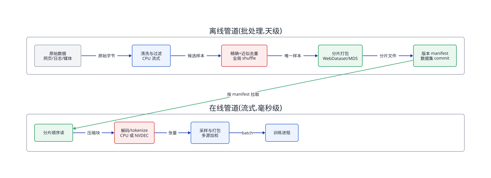
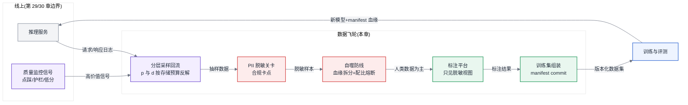
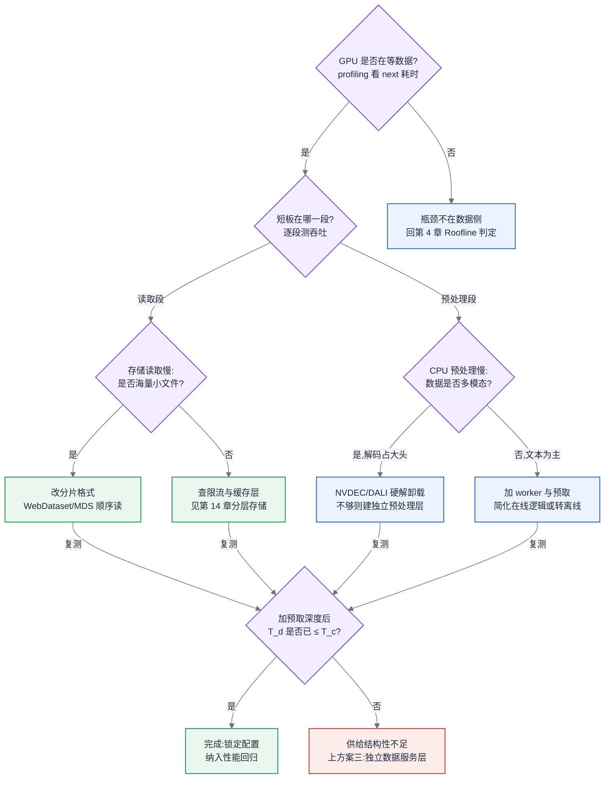

# 第 13 章 训练数据管道

## 13.1 GPU 开算之前，batch 必须已经就绪

本章位于主线 A「一次训练任务的生命周期」的最上游:在任何一张 GPU 开始算之前,数据必须已经完成采集、清洗、去重、混合、分片,并以足够的速率持续喂进训练进程——本章负责的就是"从原始数据到训练迭代器吐出的那个 batch"之间的全部链路。

## 13.2 供给速率必须压过 token 消耗速率

本章建立在两条前文结论之上:第 4 章的结论"训练负载的瓶颈判定必须先算带宽再谈优化"(Roofline 与瓶颈判定见 [§4.4](../第一部分-基础与心智模型/第04章-硬件第一性原理、架构范式与数值精度.md#44-roofline-模型)),以及第 6 章的结论"给定模型结构与集群规模,每秒消耗的 token 数是可以精确算出来的"。数据管道的全部工程目标,就是让供给速率稳定压过这个可算出的消耗速率。

## 13.3 问题场景:昂贵的卡在等数据

一个 256 卡集群上训练 30B 稠密模型的团队,发现训练吞吐只有基准测试的 55%。第一反应是通信问题,查了三天 NCCL 日志,没有异常;第二反应是并行策略配错,重跑了 profiling(方法论见 [§5.4](../第一部分-基础与心智模型/第05章-CUDA、CANN与加速器软件栈.md#54-profiling-方法论全书唯一定义处)),发现 GPU 的 SM 占用率曲线呈规律的锯齿状:每个 step 的前 40% 时间,计算流几乎是空的,`DataLoader` 的 `next()` 调用耗时占了大头。

进一步排查发现三层问题叠在一起。第一层,数据存在对象存储上,按平均 4 MB 一个的原始 JSON 文件组织,共 9 亿个对象,每个 epoch 的随机访问让对象存储的 QPS 限流被打满;第二层,在线做的 tokenize 和过滤逻辑跑在每节点 16 个 dataloader worker 上,而这台 8 卡机只有 128 个 CPU 核,其中一半被监控 agent、日志采集和另一个租户的预处理任务占着;第三层,有人在两周前往清洗规则里加了一条正则,把单条样本的 CPU 处理时间从 0.8 ms 拉到了 5 ms,没有人注意到,因为清洗代码"不是训练代码",不在性能回归的看护范围内。

按当时的卡时单价折算,这个集群每天有约 40% 的 GPU 时间在等数据,相当于每天烧掉一百多张卡的钱去买"空转"。而讽刺的是:解决这个问题所需要的全部技术——批处理、分片、流水线、算存分离——都是这个团队里做过 Spark 平台的老工程师十年前就熟练掌握的。问题不在于技术难,而在于没有人把数据管道当作与训练计算同等地位的基础设施来对待。

## 13.4 原理与量化模型

### 13.4.1 一条不等式统治全章

训练数据管道的全部设计,归结为维持一条不等式:

```
数据供给速率 ≥ 数据消耗速率 × 安全系数(建议 1.5–2)
```

消耗速率是可以精确算的。设全局 batch 的 token 数为 B,单步时间为 T_step,则:

```
消耗速率 = B / T_step  (token/s)
```

例如全局 batch 4M token、单步 12 s,消耗速率约 350K token/s;按平均每 token 4 字节的 tokenized 存储格式,折合约 1.4 MB/s——纯文本预训练的净带宽需求低得惊人。**文本管道的瓶颈几乎从来不是 IO 带宽,而是三样东西:小文件元数据操作、在线 CPU 预处理、以及 shuffle 语义带来的随机访问。** 这一判断到了非文本数据会整个翻转(见 13.4.5)。

供给速率则由链路上最慢的一段决定。把管道拆成"存储读取 → 解码/解压 → 清洗过滤 → tokenize → 打包成 batch → H2D 拷贝"六段,逐段测吞吐,取最小值。这就是数据侧的 Roofline:不测,就不要谈优化。

### 13.4.2 离线管道:清洗、去重、过滤的规模账

采集与清洗本身没有新技术,难的是规模下的成本结构。以 10 TB 级原始网页语料为例,典型处理链是:格式解析 → 语言识别 → 规则清洗 → 精确去重 → 近似去重 → 质量过滤(模型打分)。前三步是纯 CPU 流式作业,每 TB 数十核时,任何批处理引擎都能胜任;真正需要算账的是去重和模型过滤。

**精确去重**对文档全文或分段哈希(如 SHA-1),然后做全局分组。这本质上是一次大规模 shuffle:10 TB 语料约 30 亿文档,每条 20 字节哈希加文档 ID,shuffle 数据量在百 GB 级——对做过大数据的人来说是常规操作,唯一的坑是哈希粒度:按文档去重删不掉"同一篇文章被一万个站点转载但各自加了页脚"的情况,所以生产管道普遍再做段落级/行级精确去重。

**近似去重**的标准做法是 MinHash + LSH(Locality-Sensitive Hashing,局部敏感哈希)。工程上要算的是两笔账。第一笔是参数账:用 b 个 band、每 band r 行(b×r = 签名总数),两篇相似度为 s 的文档至少撞上一个桶的概率为 1−(1−s^r)^b;给定"相似度 0.8 以上要抓住"的目标,反解出 b 和 r(常见配置如 128 个哈希、b=16, r=8,阈值约 0.72)。第二笔是资源账:30 亿文档 × 128 个 MinHash 签名 × 4 字节 ≈ 1.5 TB 中间数据,LSH 分桶又是一轮 shuffle,桶内两两比对的计算量取决于桶大小分布——若出现超大桶(模板化网页最常见),单个桶的两两比对是 O(n²),必须设桶容量上限并对超限桶降级处理(直接全删或抽样保留),否则长尾任务会把整个作业拖住数天。这是 Spark 时代数据倾斜问题的原样重演。

**质量过滤**用小模型给每条样本打分,这一步的形态与前面完全不同:它是推理负载。按每条样本 2 ms 的 GPU 推理耗时算,30 亿条需要约 1700 GPU·小时,用 CPU 跑则要再乘一个 20–50 的系数。平台需要回答的问题是:离线数据管道有没有资格申请 GPU 配额?多数组织的答案是"没有",于是过滤模型被迫退化成 fastText 级别的浅层模型——这是一个资源决策,不是算法决策,应当被显式做出而不是默认发生。

### 13.4.3 配比、课程与采样:只讲实现

定多少配比是算法同事的事;平台的事,是让"任意配比 + 中途改配比"在工程上可行且可复现。工程实现有三个要点。

第一,**配比在迭代器层实现,不在物理数据层实现**。把每个数据源做成独立的分片流,训练时按权重做加权采样,而不是提前把数据按配比物理混合成一份。物理混合意味着每次改配比都要重写全量数据,而权重采样改一个配置文件即可。代价是迭代器要维护多路流的状态。

第二,**课程学习(curriculum learning)= 配比随 step 变化的调度函数**。工程上就是让采样权重成为 step 的函数,难点在断点恢复:job 重启后,采样器必须能从"第 N 步的权重状态 + 每路流的读取位置"精确恢复,否则课程被打乱且不可复现。这要求采样器状态进 checkpoint(与第 14 章的 checkpoint 机制共用通道)。

第三,**epoch 语义要重新定义**。多源加权采样下,高权重小数据源会在一个"名义 epoch"内被重复多遍。平台要暴露的指标是"每个源的实际重复次数",算法同事据此判断是否过拟合某个源——这个数字不上报,配比就是黑盒。

### 13.4.4 合成数据流水线与数据版本

合成数据的生产链是"种子数据 → 生成模型批量推理 → 规则/模型双重过滤 → 去重 → 入库",本质上是一条以推理集群为核心算力的离线管道,其容量规划按第 22 章的推理吞吐模型估算即可。基础设施侧要立两道硬约束:其一,**血缘标记不可选**——每条合成样本必须携带"生成模型版本 + 种子来源 + 生成时间"的元数据,这是后面污染防控(13.5 节)的唯一抓手;其二,合成数据入库前必须过与真实数据相同的去重管道,因为生成模型的输出重复率远高于自然语料,温度设低时同题多次生成的近重复比例可达两位数百分比。

**数据版本**的核心主张是:数据集需要 commit 的概念。一次训练必须能声明"我用的是数据集 D 的版本 v3",且 v3 永远指向同一批字节。实现上不需要发明新东西:以不可变分片文件为底层(写好即封存,修改 = 新增分片 + 新 manifest),用一个 manifest 文件列出分片清单与各分片的内容哈希,manifest 本身进 Git 或专用系统(lakeFS、DVC 类)。要警惕的反模式是"目录 + 日期"式版本管理:目录内容可被原地覆盖,三个月后没有人能证明两次实验用的是同一份数据。可复现性的判据只有一条:给定 manifest 哈希,任何人能重新拉出逐字节一致的数据集。

### 13.4.5 非文本数据管道:瓶颈从 IO 换到 CPU

图像、视频数据的体量比同等训练价值的文本高两到三个数量级:文本管道 1.4 MB/s 的净需求,到视频预训练会变成每节点数 GB/s 的解码后张量流。更关键的是瓶颈易位:压缩视频的存储读取不难,难的是解码。一路 1080p H.264 视频软解约占满 1–2 个 CPU 核,而一台 8 卡节点的训练消耗可能需要同时解上百路——CPU 核数根本不够。这就是非文本管道的中心矛盾:**瓶颈从 IO 转移到了 CPU 解码**。

工程对策有三层,应当按顺序用:

第一层,**分片格式**。用 WebDataset 类 tar 分片(或 TFRecord/MDS 等价物)把百万级小文件打包成数百 MB 一个的顺序可读分片,shuffle 退化为"分片级洗牌 + 分片内缓冲区洗牌"的近似随机。这一步消灭小文件元数据风暴,把对象存储访问从随机 GET 变成顺序大块读——这就是 HDFS 时代 SequenceFile 合并小文件的直接翻版,可以原样照搬。

第二层,**硬解与 GPU 预处理**。把 JPEG/视频解码从 CPU 挪到加速卡上的专用硬件单元(NVDEC/NVJPEG),配合 DALI 类库把解码、缩放、增广整条链放到 GPU 流上执行。一块卡上的 NVDEC 可以顶替数十个 CPU 核的软解吞吐,且不占用 SM。失效边界:硬解只覆盖主流编码格式,长尾格式(罕见 codec、损坏文件、超高分辨率)仍会回落到 CPU 慢路径,管道必须为慢路径设旁路队列,否则一个坏文件能卡住整条流水线。

第三层,**流水线重叠**。无论解码在哪里做,预处理都必须与训练计算在时间上重叠:训练第 N 步时,后台并发预取并处理第 N+1、N+2 步的数据。有效性条件可以量化:设单步计算时间 T_c、单步数据准备时间 T_d、预取深度 k,则稳态下 step 时间为 max(T_c, T_d),而非 T_c + T_d——但前提是 T_d ≤ T_c。一旦 T_d > T_c,再深的预取队列也只是延迟排空,稳态吞吐仍被 T_d 统治。所以预取不是优化的终点,而是把问题变成一个清晰的工程目标:**用一切手段把 T_d 压到 T_c 以下,之后就不用再压了**。



<!-- source: diagrams/sources/ch13-data-pipeline.d2 -->

图 13-1:训练数据管道全景。全链路只有两处天然瓶颈——离线侧的全局去重 shuffle 和在线侧的解码/tokenize,其余各段用顺序大块读就能喂饱;把优化火力集中在这两处。

```mermaid
%%{init: {'theme':'base','themeVariables':{
  'primaryColor':'#EEF4FF','primaryBorderColor':'#3B6FD4','primaryTextColor':'#1F2937',
  'secondaryColor':'#F3F4F6','tertiaryColor':'#FFFFFF',
  'lineColor':'#6B7280','fontFamily':'-apple-system, Segoe UI, Helvetica, Arial, sans-serif','fontSize':'14px'
}}}%%
gantt
  dateFormat X
  axisFormat %L
  title 串行 vs 重叠:三个训练 step 的时间轴(T_d ≈ 0.8 × T_c)
  section 串行模式
  准备数据1 :d1, 0, 8
  计算step1 :c1, 8, 18
  准备数据2 :d2, 18, 26
  计算step2 :c2, 26, 36
  准备数据3 :d3, 36, 44
  计算step3 :c3, 44, 54
  section 重叠模式
  准备数据1 :p1, 0, 8
  计算step1 :q1, 8, 18
  准备数据2(后台) :p2, 8, 16
  计算step2 :q2, 18, 28
  准备数据3(后台) :p3, 18, 26
  计算step3 :q3, 28, 38
```



图 13-2:流水线重叠示意。只要 T_d ≤ T_c,重叠模式下数据准备时间被完全隐藏、step 时间等于纯计算时间;数据侧优化的目标不是把 T_d 压到零,而是压到 T_c 以下即可收手。

**所以这对做平台的人意味着什么**:数据管道的性能工程只有两个动作——先按 13.4.1 的不等式逐段测出短板在哪,再对短板套用"分片格式 → 硬解卸载 → 流水线重叠"的三板斧;并且清洗与预处理代码必须纳入和训练代码同等的性能回归看护,因为它们跑在同一条关键路径上。

## 13.5 数据飞轮:一个基础设施问题

数据飞轮(data flywheel)的闭环是:线上请求回流 → 筛选与脱敏 → 标注 → 进训练集 → 模型更新上线 → 产生新的请求回流。它常被当作算法故事来讲("用真实数据持续变强"),但让飞轮真正转起来的每一个环节——回流采样、存储生命周期、脱敏管道、污染防线、版本闭环——都是基础设施问题。算法同事决定"什么样的数据有价值",平台决定"这条闭环在成本、合规、污染三个约束下是否物理上成立"。

**回流采样率与存储成本**。全量回流在任何有规模的服务上都不成立,这笔账必须先算:设日请求量 Q,单条请求落盘均值 s(含输入、输出、上下文与元数据,对话类负载 10–100 KB 很常见),采样率 p,保留期 d 天,则在存量 = Q × s × p × d。日请求 5000 万、单条 30 KB、全采样、留一年,就是约 550 TB——还没算多副本。反过来,给定存储预算即可反解出 p 与 d 的可行域。工程上正确的做法不是全局一个采样率,而是分层采样:默认低采样率打底,对高价值信号(用户点踩、重试、人工升级、护栏命中)接近全采——这就是日志系统里"错误日志全留、访问日志抽样"的老规矩,原样适用。

**隐私边界与合规**。回流数据是用户数据,三条硬线必须由平台强制而非靠下游自觉:第一,PII(Personally Identifiable Information,个人身份信息)脱敏是回流入库前的强制关卡,规则 + NER 模型双通道,脱敏前的原始数据不落长期存储;第二,保留期与删除必须可执行——用户行使删除权时,平台要能回答"这条数据进过哪些训练集、这些训练集训出过哪些模型",这只有 13.4.4 的数据版本与血缘体系能支撑,也是"数据集需要 commit"在合规上的真正兑现;第三,回流数据与预训练语料物理分库、权限分离,标注平台只见脱敏后视图。边界写清楚:**平台负责脱敏管道与删除链路的可执行性,业务与法务负责定义什么算 PII、留多久**——这条边界不落成文字,出事时两边都会以为对方兜了底。

**许可证与删除传播:数据侧供应链的两笔账**。上面三条硬线管的是回流数据;把范围扩到全部数据源,还有两件事必须做成血缘字段,而不是留在法务文档里。其一,**数据集许可证是血缘的一等字段**:外采语料、开源数据集、爬取数据各带许可条款(能否商用、能否再分发、是否要求署名),而模型继承其训练数据的许可约束——一个混入"仅限研究用途"数据集的模型能不能商用,答案应当能从 manifest 逐级查出来,而不是发布前夜去问法务。因此 13.4.4 的 manifest 除内容哈希外还要携带每个数据源的许可证标识,训练集组装时做许可证组合检查,与配比熔断走同一个卡口。其二,**删除要沿血缘传播**:一条数据在源头被行权删除或其来源被撤销后,删除义务沿血缘传导到包含它的每个快照乃至训出的模型——而"不可变快照"与"删除"天然冲突。工程解法是分级:后续新 manifest 剔除该数据是必做项;已产出的历史快照与已上线的模型如何处置,按法务给出的义务边界执行;确实做不到的(如重训成本不可行),必须留下书面豁免依据与风险评估,而不是沉默。这两笔账连同模型侧的签名与准入,合成第 30 章「模型供应链」的完整链条:数据侧管"进来的干净",模型侧管"出去的可验"。

**污染防控:自噬问题的工程防线**。飞轮闭环的独有风险是:线上回流的数据里含有模型自己(以及全网其他模型)的输出,用模型输出训练模型,分布会逐代收窄退化——即自噬(model autophagy)问题。防线只能建在基础设施层,因为等算法侧从效果指标上看出退化,已经晚了一代模型。可落地的防线有四道:其一,生成侧标记——自家模型的每条线上输出在回流通道内携带"模型生成"标签(内部血缘元数据,不依赖对外水印),回流管道据此把"用户输入"与"模型输出"拆开,默认只有用户侧文本可直接进训练集,模型输出必须走蒸馏/合成数据的显式通道并保留血缘;其二,对外部采集数据跑机器文本检测,按分数分级降权而非二值删除(检测器准确率不足以支撑硬删);其三,配比熔断——训练集组装时按血缘统计"合成 + 疑似机器生成"占比,超过算法侧设定的阈值直接拒绝组装,这个熔断器必须做在数据版本系统里,让"带污染的数据集"根本无法产出合法的 manifest;其四,新鲜数据保底——保证每一代训练集中有下限比例的、可证明早于自家模型上线时间的人类数据。四道防线全部依赖同一个地基:13.4.4 的血缘元数据。血缘不全,污染防控就只剩祈祷。

**与第 29、30 章的接口**。飞轮的"筛选"环节不需要重新发明:第 29 章的质量监控与评测流水线已经在给线上流量打标(失败、越界、低分),回流采样直接订阅这些信号即可,不要另建一套打分系统;飞轮的"更新上线"环节则是第 30 章模型生命周期的入口——数据集 manifest 哈希必须出现在模型注册表的元数据里,闭环才在版本层面真正闭合(接口细节见第 30 章)。



图 13-3:数据飞轮闭环。两个红色节点是闭环成立与否的裁决点——脱敏关卡决定它合不合法,自噬防线决定它转几圈之后还有没有价值;其余各环都只是吞吐问题。

**所以这对做平台的人意味着什么**:数据飞轮不是"把日志接到训练集"的一根管子,而是一套带采样经济学、合规执行力和污染熔断器的闭环系统;平台的验收标准是三个可回答的问题——每 GB 回流数据的全链路成本是多少、任意一条用户数据能否被追溯并删除、任意一个训练集的机器生成占比是多少。三问有一问答不出,飞轮就还没资格上线。

## 13.6 方案对比

围绕"这条管道用什么引擎和形态来建",给出三条主流路线及其失效边界。

**方案一:批处理引擎离线管道(Spark/Flink 批模式)+ 静态分片产物。** 全部清洗、去重、tokenize 离线完成,产出不可变分片,训练时只做读取与打包。优点是复用现成大数据平台与团队技能,去重这类全局 shuffle 作业本来就是它的主场,产物天然可版本化。失效边界:一旦预处理逻辑高频变动(tokenizer 换版、增广策略每周调),全量重刷的成本与周期不可接受;对视频类负载,离线转码产物的存储膨胀可达原始数据数倍,存储费用会反超计算费用;此外它对"训练中动态调配比调采样"无能为力——凡是需要在训练时决定的事,离线管道都做不了。

**方案二:训练框架原生 DataLoader + 在线预处理(PyTorch DataLoader / WebDataset 直读)。** 分片直读,解码、增广、tokenize 全部在训练节点的 CPU worker 上在线完成。优点是逻辑改动即时生效、无中间产物、栈最简单。失效边界:供给能力被训练节点 CPU 核数硬性封顶,按"每 GPU 配套 CPU 核"的配比(见 [§4.2.2](../第一部分-基础与心智模型/第04章-硬件第一性原理、架构范式与数值精度.md#422-训练型与推理型负载的硬件诉求差异))一旦预处理复杂度超出配比,GPU 必然挨饿且无法水平扩展;多模态重预处理场景下这条边界几乎必然被击穿;它还把预处理与训练耦合进同一个故障域,一条坏样本能让训练进程直接崩溃而非旁路。

**方案三:独立的分布式数据服务层(Ray Data / 自建预处理集群 / DALI 混合)。** 在训练集群旁建一层可独立扩缩的 CPU(或带硬解卡)预处理服务,训练节点只做拉取与 H2D。优点是供给能力与训练集群解耦、可弹性扩容、预处理故障不波及训练进程,是重多模态负载的唯一可扩展解。失效边界:引入了跨节点数据传输,预处理层到训练节点的网络带宽成为新的可疑瓶颈段(每节点数 GB/s 的张量流对网络不是小数目);多一层服务就多一层运维与故障面;在纯文本这类轻预处理场景下,它的复杂度完全不值得——供给缺口能用方案二加几个 worker 解决时,建服务层属于过度设计。

实践中三者常按数据形态组合:文本走方案一产出分片 + 方案二在线打包;图像视频走方案一做清洗去重 + 方案三做在线解码。没有一条路线能单独覆盖全谱负载,选型路径见 13.8。

## 13.7 大数据对照

这一章是全书大数据经验密度最高的地方,值得逐项对账:哪些直接搬,哪些量级不够,哪些语义变了。

**直接复用的部分,比想象的多。** 精确去重与近似去重,就是 Spark 上的 groupBy 与 MinHash-LSH join,连数据倾斜(超大桶)的坑和对策都原样保留;分片格式对抗小文件,就是 SequenceFile/HAR 合并小文件的翻版,WebDataset 的 tar 分片在思想上没有任何新东西;回流采样的分层策略,就是日志系统"错误全留、正常抽样"的老规矩;流式清洗与脱敏管道,Flink 时代的 exactly-once 管道语义与旁路死信队列(dead letter queue)设计原封不动地适用于回流链路;数据湖的 manifest 式版本管理(Iceberg/Delta 的快照与时间旅行)正是"数据集 commit"的现成实现思路。一个做过五年 Spark/Flink 平台的工程师,在本章 13.4.2 与 13.5 的回流侧几乎没有新技能要学,只有新的账要算。

**量级不够而失效的部分。** 第一,吞吐形态变了:大数据管道的消费端是报表和下游作业,天级延迟可接受、消费速率无硬约束;训练管道的消费端是按秒计费且不等人的 GPU,供给速率有硬下界,管道从"尽力而为的批处理"变成"有 SLO 的实时供给系统",这是心态上最大的一道坎。第二,CPU 密集度变了:Hive/Spark 作业的算子多是字节级操作(解析、过滤、join),而 tokenize、图像解码、增广是重 CPU 甚至需要专用硬件(NVDEC)的计算,"CPU 便宜、随便堆"的默认假设在每节点上百路视频解码面前破产。第三,shuffle 语义变了:大数据的 shuffle 是作业内一次性的,训练的 shuffle 是每个 epoch 对全数据集的随机访问语义,直接照搬会制造亿级随机 GET,必须退化为分片级近似 shuffle——这在大数据时代没有对应物。

**语义上根本不同的部分。** 大数据平台的正确性判据是确定性的:数字对得上账。训练数据的"正确性"是统计性的:一条清洗规则的 bug 不会让任何作业报错,只会让三周后的模型悄悄变差,而且几乎无法归因。这导致两个大数据时代没有的制度需求:数据集必须像代码一样 commit(否则无法二分定位是哪次数据变更导致退化),预处理逻辑必须纳入性能与效果双重回归。另一个没有对应物的是自噬污染:HDFS 上的数据从不会"因为被系统自己产出过而变毒",而飞轮时代的数据血缘承担的是大数据血缘从未承担过的职责——它不是审计工具,是防止模型退化的生产安全机制。

**所以这对做平台的人意味着什么**:招人和分工时,把离线管道(清洗、去重、版本)放心交给大数据背景的工程师,他们只需要补"供给有 SLO"这一课;而在线供给层(DataLoader、硬解、流水线重叠)和自噬防线是真正的新领域,不要假设大数据经验能自动覆盖。

## 13.8 选型决策树

对着下图走一遍,定位你的数据瓶颈在哪一段、该上哪组对策。



图 13-4:数据瓶颈定位决策树。它的第一个分支就是"先证明瓶颈确实在数据侧",最后一个出口是承认单机对策已尽、必须上独立数据服务层——中间的所有对策都比换架构便宜,按序尝试。


## 13.9 名词解释

| 术语 | 释义 | 详见 |
|---|---|---|
| 供给速率 ≥ 消耗速率 | 数据管道的总设计目标:供给速率 ≥ 消耗速率 × 安全系数;消耗速率可由全局 batch 与单步时间精确算出 | §13.4.1 |
| 精确去重 / 近似去重 | 按内容哈希全局分组删除完全重复 / 用 MinHash + LSH 捕捉高相似文档;后者的参数决定"多相似才算重" | §13.4.2 |
| MinHash / LSH | 把文档压成固定长度签名、按 band 分桶使相似文档大概率同桶的近似去重算法;桶容量长尾是数据倾斜的重演 | §13.4.2 |
| 课程学习(curriculum learning) | 采样配比随训练步数变化的调度;工程难点是断点恢复时采样器状态必须随 checkpoint 精确还原 | §13.4.3 |
| 分片格式(WebDataset/TFRecord/MDS) | 把百万级小文件打包成数百 MB 顺序可读分片,消灭小文件元数据风暴;shuffle 退化为分片级近似洗牌 | §13.4.5 |
| NVDEC / DALI | GPU 上的视频/图像硬件解码单元与配套预处理库;一块卡的硬解可顶数十个 CPU 核软解且不占 SM | §13.4.5 |
| 流水线重叠(T_d ≤ T_c) | 后台预取下一步数据、与当前计算重叠;稳态 step 时间为 max(计算, 数据准备),数据侧优化压到 T_c 以下即可收手 | §13.4.5 |
| manifest(数据集清单) | 列出分片清单与内容哈希的不可变文件,"数据集需要 commit"的实现载体;给定 manifest 哈希应能逐字节复现数据集 | §13.4.4 |
| 数据飞轮(data flywheel) | 线上请求回流 → 脱敏 → 标注 → 进训练集 → 模型更新的闭环;每个环节都是基础设施问题而非算法故事 | §13.5 |
| PII 脱敏 | 回流数据入库前强制去除个人身份信息的关卡,规则与 NER 模型双通道;原始数据不落长期存储 | §13.5 |
| 自噬(model autophagy) | 用模型自身输出训练模型导致分布逐代收窄退化的风险;防线全部建立在血缘元数据之上 | §13.5 |
| 配比熔断 | 训练集组装时按血缘统计合成/疑似机器生成占比,超阈值拒绝产出合法 manifest 的强制机制 | §13.5 |
| 血缘(lineage)标记 | 每条样本携带的来源、生成模型版本、许可证等元数据;删除传播与污染追踪的唯一抓手 | §13.4.4、§13.5 |
| 死信队列(dead letter queue) | 处理失败样本的旁路通道,防止一条坏数据卡住整条流水线;流处理时代的设计原样适用 | §13.7 |

---

读完本章,你应当能:给定模型规模与集群配置,算出训练的 token 消耗速率并逐段实测数据管道的供给速率,从而定位数据侧是否是训练吞吐的瓶颈、瓶颈具体在哪一段;能为多模态负载估算解码所需的 CPU/NVDEC 资源并判断是否需要独立预处理层;能设计一套"分层采样—脱敏—血缘—配比熔断"齐备、且成本可算、删除可执行的数据回流闭环,并用 manifest 机制保证任何一次训练的数据集可逐字节复现。
