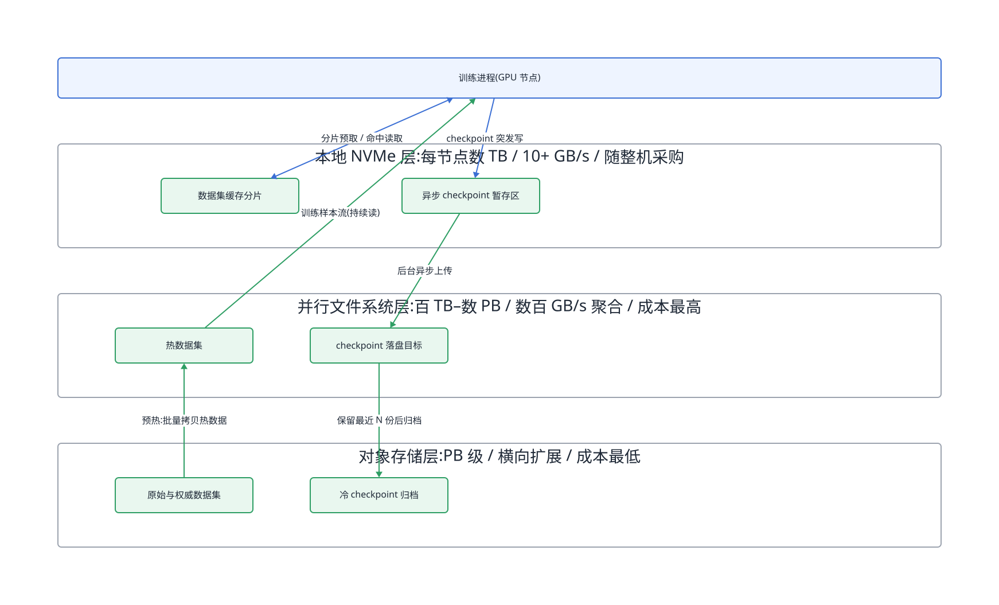
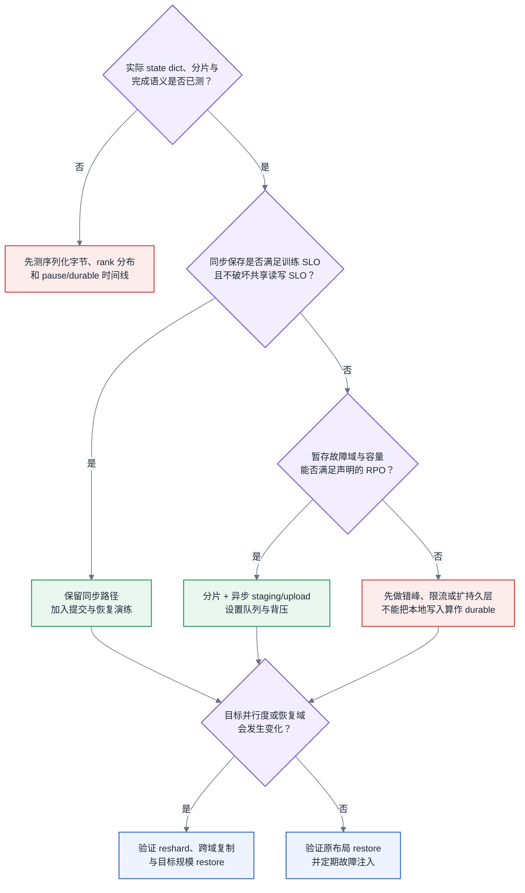

# 第 14 章 存储与 Checkpoint I/O

<ChapterContext
  track="主线 A 的数据读取、训练状态保存与故障恢复"
  question="平均带宽看似充足时，为什么 checkpoint 仍会阻塞训练并拖慢其他任务，怎样证明一份快照真的可恢复？"
  upstream="第 6 章模型状态账；第 13 章数据管道；第 17 章分片训练态；第 20 章故障与恢复"
  downstream="第 29 章训练监控；第 31 章容量、成本与 SLO"
  inputs="实际 state_dict、序列化字节、rank/文件分布、阶段时间线、共享存储负载、RPO/RTO、故障域与恢复演练"
  outputs="checkpoint 容量账、关键路径分解、突发并发预算、提交协议、保存间隔假设与恢复证据"
/>

## 14.1 先定义 checkpoint 何时真正完成

训练读路径追求持续供给，checkpoint 写路径集中产生大量状态、元数据操作和同步尾部。两者共享网络、客户端和存储后端时，月均或小时均带宽会掩盖保存窗口内的争用。更重要的是，写 API 返回、后台上传完成、生成版本可见和恢复验证通过是四个不同事件；容量规划必须选择其中一个作为“完成”。

## 14.2 容量账从实际训练状态开始

[§6.2](../第一部分-基础与心智模型/第06章-模型结构的定量分析.md#62-参数量与资源换算核心) 提供模型状态的估算入口，[§17.4.2](../第四部分-训练系统/第17章-显存与训练侧精度机制.md#1742-zero-三阶段分片的对象决定代价) 说明状态如何按 rank 分片。checkpoint 还可能包含 RNG、学习率调度器、数据游标、混合精度 scaler、框架元数据与自定义状态，因此参数量只能给容量下界或特定配置下的估算，生产预算以实际待保存对象和一次序列化测量为准。

PyTorch Distributed Checkpoint 的 `save` 使用 collective 协调各 rank 写入，`async_save` 默认先把 state dict staging 到 CPU，再在线程中保存；新版异步 staging 还把 D2H 复制与训练重叠，但需要分别等待 staging 和 upload completion，并避免上一份状态尚未复制完就被 optimizer 修改。具体语义见 [DCP API](https://docs.pytorch.org/docs/main/distributed.checkpoint.html) 和 [异步保存教程](https://docs.pytorch.org/tutorials/recipes/distributed_async_checkpoint_recipe.html)。

## 14.3 问题场景:一次 checkpoint 把整个集群写趴下

<CaseMeta
  type="synthetic-case"
  data-nature="模型、卡数、状态字节和各阶段耗时均为展示突发写证据链的合成输入，不代表生产事故或存储产品基准"
  scope="2048 卡 70B 稠密训练任务与共享存储上的其他读取任务"
  assumptions="容量示例按每参数 16 B 的 BF16 权重/梯度、FP32 master 权重和 Adam 状态估算为 1.12 TB；实际保存分片与元数据另行测量"
  reproducible="visuals/data/ch14-checkpoint-critical-path.csv；visuals/data/ch14-burst-contention.csv"
/>

合成任务每 30 分钟触发一次保存。监控显示数据读取任务与大任务 step time 在相同窗口同时恶化，但存储的小时平均吞吐仍有余量。将训练日志、客户端 trace、元数据服务和存储队列对齐后，一次 70 秒保存可分为：训练态 staging 6 秒、排队 12 秒、分片数据写入 43 秒、尾部同步与提交 9 秒。

<BookFigure
  id="ch14-checkpoint-critical-path"
  src="../visuals/generated/ch14/checkpoint-critical-path.svg"
  alt="一次合成 checkpoint 的关键路径依次包含六秒 staging、十二秒排队、四十三秒分片写入和九秒尾部同步提交"
  title="图 14-1  总停顿不能只用状态字节除以带宽"
  caption="排队、元数据、最慢 rank 与提交阶段不会出现在平均吞吐公式里，却共同决定训练何时能继续以及版本何时可恢复。"
  source="合成事故；visuals/data/ch14-checkpoint-critical-path.csv"
  license="CC BY 4.0"
  width="wide"
/>

同一时间窗内，另一个任务也按整点保存，两个突发流与数据读取叠加后超过共享服务能力。这里不能直接断言存储硬件不足：可能是任务定时器同相、目录布局导致热点、客户端限速缺失、分片文件尾延迟，或后台上传没有背压。先把突发分量分开，才知道应错峰、限流、合并元数据操作、扩容还是改变保存架构。

<EvidencePanel
  title="平均带宽有余量不能排除保存窗口拥塞"
  conclusion="以 checkpoint_id 对齐触发、staging、排队、数据写、commit 和 restore 事件；同时保存客户端、网络、元数据与后端分位数，才能区分容量不足、并发同相与尾部问题。"
  source="synthetic-case；§14.4.3"
>

- 已知：多个任务的性能下降与保存窗口对齐。
- 必须补采：每 rank 字节与耗时、文件数、队列深度、元数据延迟、共享读写流量和完成标记。
- 暂不能定责：训练框架、任务配置、网络、元数据服务或数据后端。

</EvidencePanel>

## 14.4 原理与量化模型

### 14.4.1 三层存储的分工

三层不是固定产品清单，而是三种职责：容量与权威副本层、共享高吞吐层、节点或机架内暂存层。对象接口、并行文件系统、本地 NVMe 或其他实现都要按以下属性验收：持久性故障域、并发读写曲线、元数据语义、单客户端上限、校验与版本提交、恢复带宽、容量成本和运维能力。

<!-- source: diagrams/sources/ch14-storage-tiers.d2 -->

图 14-2:容量层保存权威副本，共享性能层服务热数据与可恢复版本，暂存层吸收局部突发；具体技术与层数由 RPO/RTO 和故障域决定。

数据集通常从权威层预热到共享或本地缓存，checkpoint 从暂存或内存 staging 流向共享持久层，再按保留策略归档。暂存副本若随节点故障一起丢失，就不能计入相同故障域下的 RPO。共享层容量预算包含有效版本、写入中的临时版本、异步积压、导出副本和垃圾回收安全窗，而不只是“保留份数 × 模型参数”。

### 14.4.2 缓存加速层:适用场景与失效边界

缓存适合可重建、重复读取且工作集局部性明显的数据。验收至少画冷读、稳态命中、淘汰和上游失效四条曲线；只报热缓存吞吐会隐藏首轮训练或缓存抖动。数据版本必须不可变或携带内容标识，否则缓存命中可能返回错误版本。

checkpoint 写缓存的意义取决于确认语义。如果 API 在数据仅进入本地暂存时就返回，训练停顿会缩短，但此时最新版本可能无法跨节点或机架故障恢复。后台上传需要队列上限和背压：当上传完成时间超过保存间隔时，要跳过新保存、阻塞等待、扩充暂存，或降低频率，不能无限堆积快照。

### 14.4.3 Checkpoint 的突发写模式(本章核心)

容量从实际保存状态求和：

$$S_{ckpt}=\sum_j bytes(tensor_j)+S_{metadata}+S_{padding}+S_{format}$$

特定 BF16+Adam 配置可以用 $16N$ B 做早期容量示例：BF16 权重 2 B、梯度 2 B、FP32 master 权重 4 B、两个 FP32 Adam 状态 8 B。若框架不保存梯度、使用不同优化器、量化状态、压缩、ZeRO/FSDP 分片或冗余副本，结果都会变化。最可靠的输入是目标框架对冻结 state dict 的序列化字节和各 rank 分布。

数据传输时间有一个物理下界：

$$T_{data}\geq\frac{S_{ckpt}}{\min(B_{client},B_{network},B_{backend})}$$

它不是完成时间。协调式保存的完成时间更接近：

$$T_{durable}=T_{queue}+T_{prepare}+\max_r(T_{data,r}+T_{metadata,r})+T_{commit}+T_{verify}$$

$\max_r$ 表示最慢 rank 决定全局完成；元数据延迟、热点、限流与重试不能折成跨环境固定“带宽折扣”。同步保存的训练暴露时间可能接近 $T_{durable}$；异步保存则拆成一致性/staging 暂停 $T_{pause}$ 与后台持久化时间，后台仍消耗 CPU、内存、网络和存储，并可能与训练争用。

<BookFigure
  id="ch14-burst-contention"
  src="../visuals/generated/ch14/burst-contention.svg"
  alt="十分钟合成时间线中稳定读取流量叠加两个任务的同相 checkpoint 突发后超过共享服务能力，错峰后的第二个突发不再重叠"
  title="图 14-3  平均值隐藏了同相突发"
  caption="治理对象是保存窗口内的并发曲线与队列，而不是整小时平均带宽；错峰仅在 RPO 允许且没有其他热点时成立。"
  source="合成负载；visuals/data/ch14-burst-contention.csv"
  license="CC BY 4.0"
  width="wide"
/>

一份版本进入“可恢复”状态前，至少经过以下协议：

1. 为新 generation 写临时目录或对象前缀，禁止覆盖上一份已提交版本；
2. 各 rank 写分片，并记录字节数、校验和、shape/dtype、分片布局、框架与软件版本；
3. 协调者确认全部分片成功后写 manifest 与 commit marker，或原子切换 latest 指针；
4. 独立读取 manifest，抽样或完整校验，并定期在隔离作业中真正 restore；
5. 只有新版本通过提交与保留条件后，垃圾回收才删除旧版本。

保存间隔取决于允许丢失的训练进度、保存暴露成本、恢复时间、故障率和容量。Young 一阶近似可作初筛：

$$W_{Young}\approx\sqrt{2\mu C}$$

$W$ 是两次 checkpoint 之间的有效工作时间，$C$ 是同步 checkpoint 成本，$\mu$ 是应用级平均故障间隔。该近似假设周期性协调保存、近似 Poisson/fail-stop 故障和相对简单的恢复成本；异步保存、相关故障、检测延迟、失败的 checkpoint 或多级恢复会改变目标函数。Daly 的高阶模型显式讨论更完整的运行时间成本，见 [论文记录](https://laro.lanl.gov/esploro/outputs/journalArticle/A-higher-order-estimate-of-the/9916364420003761)。生产间隔应先受业务 RPO 约束，再用本集群故障与恢复数据仿真或回放。

## 14.5 方案对比

### 14.5.1 三种 checkpoint 优化

| 手段 | 改变了什么 | 新风险 | 必测证据 |
|---|---|---|---|
| 分片保存 | 避免将全量状态聚合到单个 writer；与分布式状态布局对齐 | 文件/对象数量、最慢 rank、换并行度时 reshard、下游导出 | rank 字节分布、元数据分位数、目标并行度恢复 |
| 异步 staging 与上传 | 将一致性快照、D2H/本地暂存、持久化拆开并尽量重叠 | CPU/内存争用、状态被后续更新、积压、最新版本不耐故障 | pause/staging/upload 三个完成事件、队列深度、故障注入 |
| 增量或差分 | 只保存可识别的变化或压缩差异 | 恢复链、基线依赖、校验与 GC 复杂度、计算开销 | 真实变化率、链长、合并恢复时间、损坏一段后的退路 |

三者可以组合，但没有固定顺序。分片对大规模分布式状态通常有利；小模型或单进程任务未必值得承担复杂度。增量是否有效由真实变化率和恢复成本决定，不能只凭“稠密/稀疏模型”标签判断。异步优化只有在训练暴露时间下降、后台资源不破坏 step SLO、且持久化 RPO 仍达标时才算成功。

### 14.5.2 存储架构按规模分档

卡数不是存储架构的充分变量。方案由以下输入共同确定：

- $S_{ckpt}$ 及各 rank 分布、文件/对象数和保存频率；
- RPO、RTO、目标故障域和必须保留的版本数；
- 同一窗口内其他训练、读取、归档和恢复流量；
- 本地/机架暂存容量、持久性与故障相关性；
- 目标并行度变化、跨集群恢复和推理导出需求。

<BookFigure
  id="ch14-recovery-matrix"
  src="../visuals/generated/ch14/recovery-matrix.svg"
  alt="本地暂存、共享性能层和权威归档层分别列出何时可以确认完成、能承受的故障域和主要恢复用途"
  title="图 14-4  写得快与恢复得了是两个轴"
  caption="完成语义必须绑定故障域；本地 staging 可缩短暂停，但不能自动替代跨节点可恢复版本。"
  source="编辑决策矩阵；visuals/data/ch14-recovery-matrix.csv"
  license="CC BY 4.0"
  width="wide"
/>

低并发且状态较小的任务可以同步写持久层；突发会侵占共享 SLO 时，引入调度错峰、带宽配额、分片与异步；恢复读风暴或跨故障域要求更高时，再增加近端副本、跨域复制和预热。每次升级以同一套保存、提交、故障注入和 restore 测试验收，不按 64/512 卡等固定门槛自动切换。

## 14.6 大数据对照:小文件问题的重演,与老办法为什么只解决一半

大数据平台的可复用经验是：将大量小对象打包、控制元数据操作、使用不可变版本、先写临时位置再提交、保留 manifest 与 lineage。训练数据的分片格式同样用较大顺序读单元换取更少 open/list，但随机性、采样权重和版本回溯要由索引与数据管道补回。

checkpoint 与流处理快照共享“协调状态、提交 generation、恢复验证”的问题，但状态布局、同步范围和故障模型不同。不能假设大数据写入总是平滑，也不能假设训练 checkpoint 一定同秒写出；实际负载由框架协议决定。迁移方法时保留临时版本、原子提交、校验和、背压与恢复演练，重新测字节规模、并发和尾延迟。

## 14.7 选型决策树

图 14-5:从实际状态与完成语义开始，先验证共享 SLO，再选择同步或异步路径；所有出口都回到目标故障域上的 restore 证据。

---

<ChapterDeliverables :items="[
  '从冻结 state dict 统计张量、元数据、格式开销和各 rank 字节分布，不把参数量估算冒充实际 checkpoint 大小',
  '把一次保存拆成一致性/staging、排队、元数据、数据传输、尾部同步、提交与验证，并以 checkpoint_id 对齐多层时间线',
  '为临时 generation、manifest、校验和、commit marker、保留与垃圾回收写出可故障注入的提交协议',
  '用 RPO/RTO、故障域、共享突发、暂存容量和目标恢复并行度选择同步、分片、异步或增量方案',
  '在调整保存间隔前声明 Young/Daly 模型假设，并用本集群故障、检测、恢复和异步积压数据复核'
]" />
