# 第 14 章 存储与 Checkpoint I/O

## 14.1 链路定位

本章位于主线 A(一次训练任务的生命周期)的两端:链路起点的"数据读取"依赖存储的持续读能力,链路终点的"checkpoint 落盘"依赖存储的突发写能力——这两种负载性格完全相反,却常常被塞进同一套存储系统,本章讲的就是如何让它们互不相杀。

## 14.2 依赖声明

本章建立在两条前置结论之上:第 13 章已经确认"数据侧吞吐必须匹配训练侧消费速度,否则 GPU 饥饿";[§3.2](../第一部分-基础与心智模型/第03章-人工智能与大模型基础.md#32-优化器与超参的-infra-含义) 与 [§6.2](../第一部分-基础与心智模型/第06章-模型结构的定量分析.md#62-参数量与资源换算核心) 给出了参数量到优化器状态、再到字节数的换算方法——checkpoint 的大小不需要实测,拿参数量就能算出来,这是本章一切估算的起点。

## 14.3 问题场景:一次 checkpoint 把整个集群写趴下

某团队用 2048 卡训练一个 70B 稠密模型,存储是一套聚合写带宽约 80 GB/s 的并行文件系统,同一套系统还承担着全公司十几个中小训练任务的数据集读取。训练配置为每 30 分钟保存一次完整 checkpoint,同步阻塞式写入。

事故当天的现象是这样的:每到半点和整点,监控上所有任务的 dataloader 吞吐同时跌到接近零,持续 4 到 6 分钟;小任务的 GPU 利用率曲线出现规律性的"梳齿状"塌陷;更糟的是,大任务自己也没占到便宜——它的训练进程在 `torch.save` 上阻塞,2048 张卡集体空转等写盘。值班工程师最初的判断方向全错了:先查网络交换机,再查 dataloader 代码,最后才有人把存储侧的写入监控和训练日志的时间戳对到一起,发现每次塌陷都精确对齐 checkpoint 保存时刻。

算一笔账就清楚了:70B 参数、混合精度加 Adam,完整训练态 checkpoint 约 1.1 TB(下一节给出算法)。1.1 TB 除以 80 GB/s 的理论聚合带宽是 14 秒,但实际写了 5 分钟——因为 2048 个 rank 并发打开文件,元数据服务先被打爆,数据流还没跑起来,IOPS 已经耗尽;同时数据集读取流量与 checkpoint 写入流量在同一组 OST(对象存储目标)上争抢,读写互相拖累。写入窗口内,整套存储对所有租户瘫痪。

团队的困惑很典型:"我们的存储带宽按数据集读取流量估的,余量有 3 倍,怎么会不够?"——因为他们用**平均吞吐**估了一个**峰值突发**负载。这正是本章要建立的核心认知。

## 14.4 原理与量化模型

### 14.4.1 三层存储的分工

AI 训练存储在 2026 年的主流形态是三层,每层的容量、带宽、成本相差一到两个数量级,承载的数据类型也不同:

- **对象存储(Object Storage)**:PB 级容量,单流带宽平庸但横向扩展好,成本最低(约为并行文件系统的 1/5 到 1/10)。承载原始数据集、处理后数据集的权威副本、冷 checkpoint 归档。它是**数据的家**,但不适合被训练进程直接高频访问——延迟高、不支持 POSIX 语义、list 操作昂贵。
- **并行文件系统(Parallel File System,如 Lustre / GPFS 类)**:数百 TB 到数 PB,聚合带宽可到数百 GB/s,POSIX 语义完整,成本最高。承载热数据集与 checkpoint 的落盘目标。它是**性能层**,买带宽的钱主要花在这里。
- **本地 NVMe**:每节点数 TB、每节点 10 GB/s 以上的读写带宽,成本已含在整机采购里,近乎"免费带宽"。承载数据集缓存分片与异步 checkpoint 的暂存区。它的致命短板是**与节点同生共死**:节点故障,数据即失,所以只能放"丢了能重建"的数据。


<!-- source: diagrams/ch14-storage-tiers.d2 -->

图 14-1:三层存储分工。每层只做自己成本结构擅长的事——对象存储管容量,并行文件系统管带宽,本地 NVMe 管突发;想用一层通吃三种职责,是绝大多数存储事故的起点。

三层之间的流动方向是固定的:数据集自上而下预热(对象存储 → 并行文件系统 → 本地缓存),checkpoint 自下而上回流(本地暂存 → 并行文件系统 → 归档)。这个方向感很重要,因为两条流的容量规划逻辑完全不同:预热流按"热数据集总量"定并行文件系统容量,回流按"保留份数 × S_ckpt"定——一个 70B 任务保留最近 5 份完整 checkpoint 就是 5.5 TB,十个任务就是 55 TB,这笔容量常常在规划时被漏掉,然后以"文件系统莫名其妙满了"的形式在生产中被发现。

所以这对做平台的人意味着什么:存储预算不是买"一套存储",而是分别为容量(对象存储)、带宽(并行文件系统)、突发(本地 NVMe)三个指标下单;把三个指标压给同一层去扛,要么贵到离谱,要么在某个指标上必然爆掉。

### 14.4.2 缓存加速层:适用场景与失效边界

Alluxio / JuiceFS 类缓存层的本质是:用便宜的对象存储做权威层,用集群本地(或专属缓存节点)的 NVMe 做加速层,并对外提供 POSIX 或近 POSIX 接口。它成立的前提有两个:**工作集能装进缓存**,且**访问模式有重复性**(多 epoch 训练反复读同一数据集,恰好满足)。

它的失效边界同样清晰:一是首个 epoch 的冷读性能就是对象存储的裸性能,任务短、只跑一遍数据的负载(如大规模评测、单 epoch 预训练后段)收益趋近于零;二是**写路径不是它的强项**——checkpoint 这种大突发写穿透缓存直达对象存储,或者在缓存层排队,两种行为都不理想;三是缓存一致性:数据集被上游管道原地更新时(第 13 章反对这种做法,但现实中存在),缓存失效策略会成为新的坑。所以对做平台的人,正确的定位是:缓存层解决**读**的问题,checkpoint 的**写**问题必须另行设计。

### 14.4.3 Checkpoint 的突发写模式(本章核心)

先算大小。混合精度加 Adam 训练下,完整训练态每参数约需 16 字节:低精度权重 2 B、FP32 主权重 4 B、动量 4 B、二阶矩 4 B,再加少量零头(RNG 状态、dataloader 位点等可忽略)。于是:

> **S_ckpt ≈ 参数量 × 16 字节**

70B 模型约 1.1 TB,180B 约 2.9 TB,MoE 模型按总参数量(非激活参数量)算。这个数字**在开训前就精确可知**,checkpoint 是整个 AI 负载谱系里最可预测的一种——可预测,却常常没人去预测,这是第一重讽刺。

再看它与常规负载的三点本质不同:

1. **瞬时全集群**:所有 rank 在同一个训练步集体开写,并发度等于参与保存的进程数,没有任何错峰。常规数据读取是几百个 dataloader 进程的平滑稳态流,checkpoint 是一堵墙。
2. **写完即闲**:写入窗口之外,这条写路径的利用率是零。你为峰值买的带宽,99% 的时间在睡觉——这决定了"按峰值扩容并行文件系统"在经济上极其难看,也解释了为什么异步化(把峰值摊平)比扩容更划算。
3. **峰值极高且是同步点**:同步保存时,写入时长直接计入训练停顿;它不是"存储慢一点、任务慢一点"的线性关系,而是"存储抖一下、几千张卡集体罚站"的放大关系。

**写入窗口的估算方法**。写入窗口 T_write 由三个量的短板决定:

> **T_write = S_ckpt / min(B_client, B_storage, B_meta 折算带宽)**

- **B_client(客户端侧聚合带宽)** = 参与写的节点数 × 每节点可用写带宽。注意是"节点"不是"卡":8 卡一机通常共享 1–2 张存储网卡。若采用两级方案先写本地 NVMe,则 B_client = 节点数 × 单盘写带宽,通常远大于存储侧,短板转移。
- **B_storage(存储侧聚合写带宽)**:并行文件系统的标称聚合带宽要打折使用——读写混合时按 60–70% 计,因为数据集读取不会因为你在写 checkpoint 就让路。
- **元数据瓶颈**:每 rank 写一个文件时,创建文件的元数据操作数等于 rank 数;数千 rank 并发 create 可以让元数据服务先于数据带宽饱和。工程上的处理是合并文件数(每节点一个文件而非每 rank 一个)或把这项折算成一个固定的启动开销加进 T_write。

把上面三个量落成一个可执行的估算清单,任何人拿到任务规格都能在五分钟内算完:

1. 由参数量算 S_ckpt(× 16 B);
2. 数一下参与写的**节点数**(分片保存下等于全体节点;聚合到单点保存下等于 1——这一步经常暴露出方案本身的问题);
3. 取 min(节点数 × 每节点写带宽, 存储聚合写带宽 × 0.6);
4. S_ckpt 除以第 3 步结果得 T_write,再检查 rank 数量级是否会触发元数据瓶颈(数千 rank 各写一文件时,给 T_write 加 30 秒到 2 分钟的固定开销,或改为按节点合并文件);
5. 用 T_write / T_interval 检查开销占比是否 ≤ 1%。

按集群规模走一遍这个估算,量级感如下(假设 70B 模型、S_ckpt ≈ 1.1 TB,存储与模型规模同步扩展):

| 集群规模 | 典型存储配置 | 有效写带宽 | T_write 量级 |
|---|---|---|---|
| 64 卡(8 节点) | 对象存储 + 缓存层 | ~10 GB/s | 约 2 分钟 |
| 256 卡(32 节点) | 中型并行文件系统 | ~40 GB/s(打折后) | 约 30 秒 |
| 2048 卡(256 节点) | 大型并行文件系统 | ~150 GB/s(打折后) | 约 8–10 秒 |
| 2048 卡,两级方案 | 先写本地 NVMe | 256 节点 × 8 GB/s ≈ 2 TB/s | **约 1 秒以内** |

最后一行揭示了突发写问题的正解:**本地 NVMe 的聚合写带宽随节点数线性增长,而共享存储的带宽不随你的任务规模增长**。集群越大,两级方案的优势越悬殊。

**checkpoint 间隔怎么定**。间隔太密,写入开销吃掉吞吐;太疏,故障回滚损失大。开销占比为 T_write / T_interval(同步保存时),工程红线是 ≤ 1%。而故障侧的约束来自平均故障间隔(MTBF):经典的 Young 近似给出最优间隔

> **T_interval ≈ √(2 × T_write × MTBF)**

举例:T_write 5 分钟、集群 MTBF 8 小时(千卡级集群的常见量级,见第 20 章容错),最优间隔约 √(2 × 300 s × 28800 s) ≈ 70 分钟。注意这个公式的杠杆方向:**把 T_write 从 5 分钟压到 30 秒,最优间隔缩短到约 20 分钟,单次故障的平均回滚损失同步下降**——优化写入窗口不只是省写入时间,更是买到了"敢于更频繁保存"的权利,这才是异步 checkpoint 的真正收益所在。

对做平台的人,这一节意味着:checkpoint 的大小、写入窗口、合理间隔三个数,在任务提交前就应当算出来并写进任务规格;平台如果只在事故后才知道这三个数,存储被打爆就不是意外而是必然。

## 14.5 方案对比

### 14.5.1 三种 checkpoint 优化

**方案一:异步 checkpoint(计算与落盘重叠)**。保存分两步:先把训练态从显存快照到主机内存或本地 NVMe(秒级),训练立即继续;后台线程再慢慢把快照推向共享存储。训练停顿从 T_write 压缩到快照时间,峰值写压力被摊平成后台平滑流。**失效边界**:主机内存必须装得下快照(70B 的 1.1 TB 分摊到 256 节点是每节点 4–5 GB,没问题;但小集群跑大模型时每节点分摊量可能超过空闲内存);后台上传必须在下一次保存前完成,即 T_upload < T_interval,否则快照排队、内存耗尽,系统退化回同步模式还附赠一次 OOM;此外,快照尚未落到共享存储的时间窗内节点挂掉,这一份 checkpoint 就丢了——异步换来的是"最新一份可能不可靠",恢复逻辑必须能回退到上一份完整版本。

**方案二:分片保存(sharded checkpoint)**。每个 rank 只保存自己持有的参数与优化器分片(与 ZeRO/FSDP 的分片天然对齐,见第 17 章),写入并发度等于 rank 数,避免了"先聚合到 rank0 再由单点写出"的模式——后者的写带宽上限是单节点网卡,在 2026 年已经没有理由再用。**失效边界**:恢复时若并行度或分片方式变化,需要 reshard(重切分)工具链,这套工具不健全时,分片 checkpoint 会把你锁死在原并行配置上;数千 rank 各写一个文件会制造元数据风暴,必须配合按节点合并文件;分片文件对下游(评测、部署、发布)不友好,需要一道"合并导出为推理格式"的离线工序,这道工序的算力和时间常被遗忘在排期外。

**方案三:增量保存(incremental checkpoint)**。只写与上一份相比变化的部分。听起来诱人,但要认清一个事实:**训练中每一步所有参数和优化器状态都在变**,逐字节意义上没有"未变化"的部分可省。增量真正的用武之地是:MoE 中冷专家的低频更新、embedding 的稀疏更新、以及"权重差分低精度压缩"这类有损方案。**失效边界**:稠密模型全参训练下收益接近零,却引入了链式依赖——恢复需要基线加全部增量,任何一环损坏则整链作废,校验与垃圾回收复杂度显著上升。判断很直接:除非你的模型有结构性稀疏更新,否则不要为增量保存投入工程量,先做异步加分片。

三种优化不是三选一:**分片是地基,异步是主体,增量是特定结构下的锦上添花**。

```mermaid
%%{init: {'theme':'base','themeVariables':{
  'primaryColor':'#EEF4FF','primaryBorderColor':'#3B6FD4','primaryTextColor':'#1F2937',
  'secondaryColor':'#F3F4F6','tertiaryColor':'#FFFFFF',
  'lineColor':'#6B7280','fontFamily':'-apple-system, Segoe UI, Helvetica, Arial, sans-serif','fontSize':'14px'
}}}%%
gantt
  title 同步保存 vs 异步保存:训练计算与存储写入的时间关系
  dateFormat HH:mm
  axisFormat %H:%M
  section 同步保存
  训练计算            :a1, 00:00, 30m
  写共享存储·GPU 空转   :crit, a2, after a1, 5m
  训练计算            :a3, after a2, 30m
  写共享存储·GPU 空转   :crit, a4, after a3, 5m
  section 异步保存
  训练计算            :b1, 00:00, 30m
  快照到本地·短暂停顿    :crit, b2, after b1, 1m
  训练计算(立即恢复)    :b3, after b2, 30m
  后台上传共享存储       :b4, after b2, 12m
  快照到本地·短暂停顿    :crit, b5, after b3, 1m
```



图 14-2:同步与异步 checkpoint 的时间线对比。异步方案把"GPU 罚站 5 分钟"换成"罚站 1 分钟 + 后台 12 分钟平滑上传"——被消灭的不是写入量,而是写入与计算的串行关系;唯一要盯住的新约束是后台上传必须在下次保存前完成。

### 14.5.2 存储架构按规模分档

- **≤ 64 卡**:对象存储 + JuiceFS 类缓存层,checkpoint 直写对象存储(必要时经本地暂存)。不要买并行文件系统——这个规模下它的带宽用不满,成本却一分不少。**失效边界**:多个任务共享缓存节点且工作集之和超过缓存容量时,命中率崩塌,读性能退化为对象存储裸性能。
- **64–512 卡**:中型并行文件系统承载热数据与 checkpoint,对象存储做权威层与归档,开始强制异步 + 分片保存。**失效边界**:并行文件系统被当成"大家的网盘"混入海量小文件与日志后,元数据服务成为全局单点瓶颈——必须靠配额和目录规范治理(与第 11 章多租户配额同构)。
- **≥ 512 卡**:两级 checkpoint(本地 NVMe 暂存 + 后台上传)成为必选项而非优化项;共享存储按"后台上传的平滑流 + 数据集读取"之和来定带宽,而不是按突发峰值定。**失效边界**:两级方案依赖节点内存/NVMe 有足够暂存空间,且需要恢复期从"邻居节点或共享存储"重建缺失分片的机制;这套机制没建好之前贸然上两级方案,故障恢复会比同步方案更慢。

分档的另一面是治理边界:存储方案由平台定,但 S_ckpt、保存间隔、保留份数这三个数必须由任务方在提交时申报,平台照此校验配额并预留回流带宽。边界不立起来的后果在 14.3 已经演示过——任何一个任务方擅自把间隔从 60 分钟调到 10 分钟,打爆的是所有租户的存储;而平台若越界替任务方决定间隔,又会在故障回滚损失上背不该背的锅(间隔与 MTBF 的权衡里含有任务方才知道的业务信息)。申报与校验的接口,就是这条边界的形状。

所以这对做平台的人意味着什么:方案对比的结论不是挑出"最好的方案",而是按规模档位与暂存资源现状选出当前档位的方案,并且预先知道规模翻倍时要迁移到哪一档——分档表的价值有一半在"下一档"那一列。

## 14.6 大数据对照:小文件问题的重演,与老办法为什么只解决一半

HDFS 时代最著名的运维顽疾是小文件:NameNode 把每个文件的元数据放在单机内存里,亿级小文件直接把 NameNode 顶死;MapReduce 按文件切 split,海量小文件让任务调度开销超过计算本身。当年的标准答案是合并——SequenceFile、HAR、按分区 compaction,把小文件拼成 128 MB 以上的大块,配合顺序扫描的计算模型,问题基本解决。

这套经验在 AI 场景**直接复用的部分**:多模态数据集动辄数亿个 KB 级样本(图片、音频切片),不打包直接放对象存储或文件系统,list 和随机 open 的元数据开销会重演 NameNode 之痛——所以 WebDataset/tar 分片、TFRecord 类格式本质上就是 SequenceFile 的转世,打包合并这一步照抄即可,连推荐的分片大小(数百 MB 量级)都和当年的 block 尺寸哲学一脉相承。

但老办法**只解决了一半**,因为访问模式变了。MapReduce 对合并后的大文件做**全量顺序扫描**,合并没有破坏任何语义;而训练要求**每个 epoch 全局随机打散**(shuffle,第 13 章),样本一旦被顺序打包进分片,分片内部的顺序就固定了。工程上的折中是两级近似随机:epoch 间打乱分片顺序,分片内用 shuffle buffer 局部打乱——这在统计上够用,但它是一个**用序列质量换 I/O 效率的妥协**,而非当年那种无损优化;配比调整、按样本权重采样、数据版本回溯这些第 13 章的需求,都要在打包格式之上重新造索引层来补回"按样本随机访问"的能力。这就是"只解决一半"的确切含义:打包解决了元数据压力,却把随机访问的难题从存储层转移到了数据管道层。

另一半对照是 checkpoint:大数据时代**没有对应物**。HDFS 的写入是持续摊平的摄入流,NameNode 自己的 fsimage checkpoint 不过 GB 级且在单点完成;Flink 的分布式快照算是最接近的亲戚,但其状态量级(GB 到 TB 级、增量为主、写入分摊在算子间)与"数千进程同一秒集体写出数 TB"完全不在一个负载形态上。大数据工程师面对 AI 存储时,读路径的直觉基本可迁移,**写路径的直觉需要推倒重建**——按平均吞吐做容量规划的习惯,正是 14.3 那场事故的思想根源。

所以这对做平台的人意味着什么:面向大数据背景的团队做存储评审时,要求对方分别给出读路径与写路径两张容量账——读路径允许沿用平均吞吐加余量的老算法,写路径必须给出峰值并发、写入窗口与元数据操作数三个数;只交一张按平均值算的总账的方案,可以直接打回。

## 14.7 选型决策树

```mermaid
%%{init: {'theme':'base','themeVariables':{
  'primaryColor':'#EEF4FF','primaryBorderColor':'#3B6FD4','primaryTextColor':'#1F2937',
  'secondaryColor':'#F3F4F6','tertiaryColor':'#FFFFFF',
  'lineColor':'#6B7280','fontFamily':'-apple-system, Segoe UI, Helvetica, Arial, sans-serif','fontSize':'14px'
}}}%%
flowchart TB
  S[开始:算出 S_ckpt =<br/>参数量 × 16 B]:::control
  Q1{集群规模?}:::control
  Q2{"S_ckpt / 存储写带宽<br/>≤ 间隔的 1%?"}:::control
  Q3{"每节点内存或 NVMe<br/>装得下快照分摊量?"}:::control
  Q4{模型有稀疏更新<br/>(MoE / 大 embedding)?}:::control
  A1["对象存储 + 缓存层<br/>同步保存即可"]:::storage
  A2["并行文件系统<br/>+ 异步 + 分片保存"]:::storage
  A3["两级方案:本地 NVMe 暂存<br/>+ 后台上传 + 分片保存"]:::storage
  A4[加做增量保存]:::storage
  W["瓶颈警告:先扩暂存资源<br/>或降低保存频率"]:::risk
  S -->|"规模判断"| Q1
  Q1 -->|"≤ 64 卡"| Q2
  Q1 -->|"64–512 卡"| A2
  Q1 -->|"≥ 512 卡"| Q3
  Q2 -->|"是:开销可忽略"| A1
  Q2 -->|"否:停顿超红线"| A2
  Q3 -->|"是"| A3
  Q3 -->|"否"| W
  A2 -->|"结构检查"| Q4
  A3 -->|"结构检查"| Q4
  Q4 -->|"是"| A4
  classDef control fill:#F3EEFF,stroke:#7C5CD4,stroke-width:1.5px,color:#1F2937
  classDef storage fill:#E9F7EF,stroke:#2E9E64,stroke-width:1.5px,color:#1F2937
  classDef risk fill:#FDECEC,stroke:#D64545,stroke-width:1.5px,color:#1F2937
```

图 14-3:存储与 checkpoint 方案选型决策树。入口永远是先把 S_ckpt 算出来——没有这个数,后面每一个分支都只能靠猜;而增量保存永远是最后一个才考虑的分支,不是第一个。

走一遍决策树的方法:先按 [§6.2](../第一部分-基础与心智模型/第06章-模型结构的定量分析.md#62-参数量与资源换算核心) 的换算得出 S_ckpt;按集群规模进入对应分支;在 64 卡以下先验证同步保存的开销占比是否真的可忽略(经常是),不要过早引入异步的复杂度;512 卡以上先验证暂存资源,再上两级方案;只有确认模型存在结构性稀疏更新,才考虑增量保存。

---

**读完本章,你应当能**:拿到参数量与集群规模后,算出 checkpoint 大小、写入窗口和合理保存间隔三个数字;为给定规模的集群设计出三层存储分工与两级 checkpoint 方案,并明确说出每个组件的失效边界;在存储被突发写打爆的事故现场,第一时间把写入监控与训练日志的时间戳对齐,而不是先去查网络。
