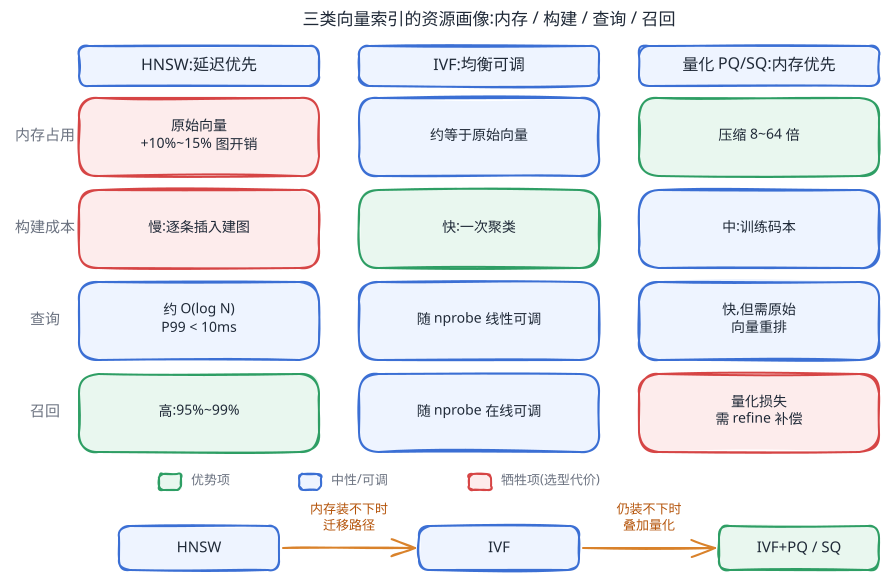
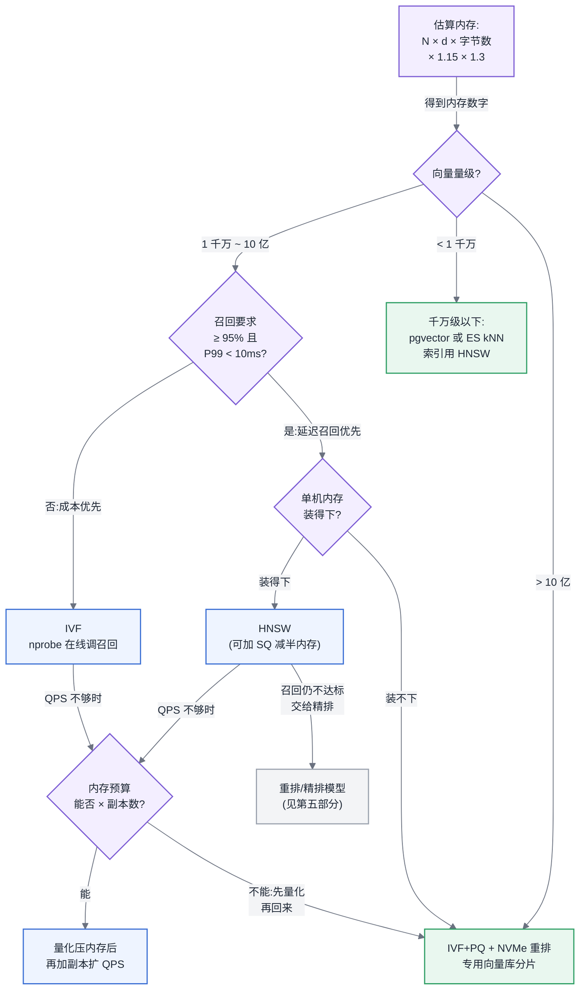

# 第 15 章 向量与检索基础设施

## 15.1 检索延迟直接进入首 token 延迟

本章位于主线 B——一次推理请求的全链路——的"请求进入模型之前"那一段:RAG(Retrieval-Augmented Generation,检索增强生成)链路中,请求先经过向量检索取回上下文,再进入推理引擎;向量库的延迟与可用性直接叠加在端到端首 token 延迟上。

## 15.2 向量集合是一条持续变化的数据流

本章建立在第 13 章的结论之上:数据管道产出的 embedding 是持续增量到达的流,而不是一次性灌入的静态集合——向量库的一切工程难题都源于这个前提。存储分层的取舍沿用第 14 章"内存—NVMe—对象存储"三层分工的结论。

## 15.3 问题场景:数据量涨十倍之后的三周崩溃

某企业知识库 RAG 系统上线时有 800 万条向量,1024 维 FP32,单机 HNSW(Hierarchical Navigable Small World)索引,内存占用约 38 GB,P99 查询延迟 12 ms,一切安好。三个月后接入了全公司的工单与文档系统,向量量涨到 8000 万条。崩溃不是一天发生的,而是分三周:

第一周,内存不够了。8000 万 × 1024 维 × 4 字节 = 327 GB 原始向量,加上 HNSW 的图结构开销逼近 400 GB,单机 256 GB 内存装不下。运维把机器换成 512 GB 的"大内存机型",暂时压住。

第二周,写入把查询拖垮了。新文档以每天 200 万条的速度持续灌入,HNSW 的增量插入不断触发图结构调整,查询 P99 从 12 ms 恶化到 300 ms 以上,而且抖动剧烈——业务方看到的现象是"RAG 有时候要等三四秒才出第一个字"。

第三周,删除暴露了索引与业务数据边界的问题。合规要求下线一批过期文档,团队才发现 HNSW 的"删除"只是打标记:被删向量仍留在图里占内存,搜索时也可能被当作图上的中继节点遍历。**但合格的 HNSW 实现会在返回结果前过滤已删除节点**——例如 [hnswlib 的 `mark_deleted`](https://github.com/nmslib/hnswlib/blob/master/README.md) 明确约定该元素不出现在搜索结果中——所以标记删除本身不应让它重新出现在召回结果里。标记删除累计到 15% 后,团队真正遇到的是内存浪费、搜索候选被删除节点挤占导致的延迟/召回退化;同时,业务侧的文档可见性过滤与向量索引不同步,才让少量已下线内容仍可被 RAG 链路取到。负责的工程师最困惑的是:"我们只是数据变多了,为什么内存、延迟、正确性三个维度同时崩?"

答案是:向量库不是"能算相似度的 KV 存储",它是一个内存密集、写入敏感、删除困难的特殊索引系统。数据量涨十倍,它的三条资源曲线以不同的非线性方式同时越过了拐点。

## 15.4 原理与量化模型

### 15.4.1 三类索引的资源画像

向量检索的本质是近似最近邻搜索(ANN,Approximate Nearest Neighbor)。工程上真正需要掌握的不是算法细节,而是三类主流索引的**资源画像**:内存怎么算、构建多贵、查询多快、召回多少。

**HNSW:用内存换延迟。** 多层跳表式的近邻图,查询时从顶层稀疏图逐层下沉。内存占用可按下式估算:

```
HNSW 内存 ≈ N × (d × sizeof(float) + M × 2 × 8 字节)
```

其中 N 为向量数,d 为维度,M 为每个节点的出边数(典型 16–48)。以 1 亿条 × 1024 维 FP32、M=32 计:原始向量 409.6 GB + 图结构约 51.2 GB ≈ 460 GB。图结构开销约为原始向量的 10%–15%,大头永远是原始向量本身。查询复杂度近似 O(log N),P99 可稳定在 10 ms 内;代价是构建慢(逐条插入建图,单核每秒千条量级)且全量驻留内存。

**IVF(Inverted File,倒排文件):用召回换内存带宽。** 先对全量向量做 k-means 聚成 nlist 个桶,查询时只扫描最近的 nprobe 个桶。内存占用基本等于原始向量本身(桶结构开销可忽略),构建成本主要是一次聚类(远快于 HNSW 建图)。查询扫描量约为 N × nprobe / nlist,召回率随 nprobe 单调上升、延迟同步上升——这是一个可在线调节的旋钮,HNSW 没有这么直接的旋钮。

**量化索引(PQ/SQ):用精度换内存。** 乘积量化(PQ,Product Quantization)把 d 维向量切成 m 段、每段用 1 字节码本编码,压缩比 = d × 4 / m。1024 维压到 64 字节是 64 倍压缩:1 亿条向量从 410 GB 降到 6.4 GB,可以整库塞进单机内存甚至 CPU 缓存友好的范围。代价是量化误差直接损失召回,生产上几乎总要加一层原始向量重排(refine):量化索引先取 top-k×r 个候选,再用存放在 NVMe 上的原始向量精确重排——这正好落在第 14 章的存储分层上:量化码驻留内存,原始向量下沉 NVMe。

三者不互斥。生产系统最常见的组合是 IVF+PQ(内存受限的十亿级)与 HNSW+SQ(标量量化减半内存、召回损失小)。



<!-- source: diagrams/sources/ch15-index-profiles.excalidraw -->

图 15-1:三类索引的资源画像对比。要记住的一件事:选索引就是选牺牲哪个维度——HNSW 牺牲内存与构建速度,IVF 牺牲延迟稳定性,量化牺牲召回;没有四项全优的索引,宣称四项全优的选型汇报都值得警惕。

### 15.4.2 增量更新、删除与一致性:最容易被低估的三件事

**增量写入。** HNSW 插入要修改多个已有节点的邻接表,写查混跑时锁竞争与缓存失效会把查询 P99 拖高一个数量级——问题场景第二周的崩溃就是它。工程解法是把写与查分离:新数据先进一个小的可写增量段(内存 buffer 或小索引),后台定期把增量段合并(compaction)进只读主索引。这就是 LSM-tree 思路在向量场景的重演,Milvus 的 segment、成长/密封段设计都是这个模式。代价是查询要同时查主索引与增量段再归并,以及后台合并任务本身要消耗与前台相当的 CPU——容量规划时必须给 compaction 预留 30%–50% 的 CPU 余量,否则合并追不上写入,增量段膨胀,查询退化为暴力扫描。

**删除。** 图索引的真删除需要重连受影响邻居,代价接近局部重建;因此许多生产实现采用"标记删除 + 后台重建/合并"。标记删除后的节点仍可能参与图遍历和占用容量,但应在结果层被过滤；若结果中出现已下线内容,先排查向量 ID、文档元数据与应用层权限过滤是否在同一可见性版本上。是否重建不能只按固定百分比拍板:以标记删除比例、P99、召回率和合规删除时限共同设阈值；10%–20% 可以作为需要压测评估的预警区间,不是普遍有效的硬触发线。合规驱动的删除还有一层硬约束:标记删除后数据仍可能在内存与磁盘上,若要求"物理不可恢复",则重建/介质清理不是优化项而是合规项,窗口要写进 SLA。

**一致性。** 向量库的一致性问题不是副本间的强一致(检索场景几乎不需要),而是**可见性延迟**:一条文档从写入到能被检索到,中间隔着 embedding 计算、增量段写入、可选的段封存。多数系统提供"写入即可见(查增量段)"到"合并后可见"之间的档位。平台方要做的是把这个延迟作为显式 SLO 暴露给业务方——"新文档 30 秒内可检索"是一条能验收的契约,"最终一致"不是。

所以这对做平台的人意味着什么:评估向量库时,压测脚本必须是"持续写入 + 持续删除 + 并发查询"三合一的混合负载,只测静态库查询 QPS 的评估结果在生产中没有参考价值。

### 15.4.3 混合检索的召回链路

纯向量检索对精确匹配(型号、人名、错误码)召回很差,生产 RAG 几乎都是混合检索:BM25 倒排 + 向量 ANN 两路并行召回,RRF(Reciprocal Rank Fusion)或加权融合归并。基础设施视角下这条链路有三个工程决策点:

1. **一套引擎还是两套系统。** Elasticsearch/OpenSearch 类引擎已内置向量能力,一套系统同时出两路结果,运维面小;专用向量库 + 独立倒排引擎两套系统各自最优,但引入了双写一致性问题——两边可见性延迟不同,同一篇文档可能"BM25 查得到、向量查不到",融合层要能容忍单路缺失。
2. **融合发生在哪。** 融合放在检索引擎内(单次请求)延迟最低;放在应用层网关则灵活但多一跳。链路总延迟按最慢一路计:`T_recall = max(T_bm25, T_ann) + T_fusion`,两路并行是底线,串行召回没有理由存在。
3. **重排是另一个资源域。** cross-encoder 重排是 GPU 上的模型推理,属于第五部分推理系统的管辖范围,不要把它算进向量库的容量规划,但要把它的延迟(常为 20–50 ms,超过召回本身)算进端到端预算。

### 15.4.4 规模与成本估算

单机容量的第一性估算:

```
所需内存 ≈ N × d × bytes_per_dim × (1 + α) × (1 + β)
```

α 为索引结构开销(HNSW 取 0.10–0.15,IVF 取 ~0.02,PQ 场景 bytes_per_dim 换成压缩后字节数),β 为增量段与合并的工作余量(建议 0.3)。反过来即可得单机容量上限:512 GB 机器、HNSW、1024 维 FP32,可承载约 512 / (4096 × 1.15 × 1.3) ≈ 8400 万条——这解释了问题场景里 8000 万条为什么已在悬崖边上。

超出单机就分片(sharding)。向量分片与查询方式强相关:ANN 查询没有"路由键",每次查询必须**扇出到全部分片**再归并 top-k。因此分片数 S 的收益是内存与构建并行度,代价是:查询延迟取决于最慢分片(P99 随 S 上升),归并成本 O(S × k)。副本(replica)则提供查询吞吐扩展与可用性:`总 QPS ≈ 单分片 QPS × R`(R 为副本数),总内存 = 分片内存 × R——副本的成本是乘在内存这个最贵资源上的,这是向量库副本比无状态服务副本贵得多的原因,也是"能用量化把单副本内存打下来,再谈加副本"这条顺序的依据。

## 15.5 方案对比

**方案一:复用现有搜索引擎(Elasticsearch/OpenSearch 内置 kNN)。** 适合已有 ES 运维体系、需要混合检索、向量量在千万级以内的场景;一套系统,双写一致性问题天然消失。**失效边界**:向量量过亿或对 P99 有 <10 ms 的硬要求时,其向量索引的内存效率与查询性能明显落后于专用引擎;高频增量更新会与倒排段合并互相抢 IO,写入高峰期两种查询一起抖。

**方案二:专用向量数据库(Milvus / Qdrant / Weaviate 类)。** 存算分离、段式增量、分片副本内建,是亿级以上规模的主流答案。**失效边界**:引入一套全新的有状态分布式系统,运维成本(etcd/消息队列依赖、版本升级、扩缩容演练)在小团队处会反噬;数据量在千万级以下时,这套复杂度是纯负担——此时方案一或方案三更划算。

**方案三:库内嵌入(pgvector / 应用内 FAISS)。** 向量作为业务数据库的一个字段,事务一致性免费获得,零新增运维对象。**失效边界**:pgvector 的 HNSW 建索引与 vacuum 会与 OLTP 负载争抢资源,千万条以上或 QPS 数百以上时主库先扛不住;应用内 FAISS 则把分片、副本、增量合并全部推给应用代码自己实现,超过单进程内存即宣告终结。

**方案四:云托管检索服务。** 零运维、弹性计费,适合数据量波动大或团队无存储运维能力的场景。**失效边界**:按查询计费的模型在高 QPS 稳态负载下成本反超自建数倍;数据出域受合规限制的行业直接不可用;可见性延迟与召回参数的可调空间受制于服务方。

## 15.6 大数据对照:Elasticsearch 的经验,一半能用

向量库是大数据经验迁移率最高的 AI 基础设施组件之一,对照物就是 Elasticsearch。

**直接复用的部分。** 段式存储与 LSM 思路:ES 的 segment、refresh、merge 三件套几乎原样出现在 Milvus 类系统里,"写入缓冲—段封存—后台合并"的容量规划方法、"merge 抢 IO 导致查询抖动"的排障直觉全部适用。副本机制:主从副本提供查询扩展与故障切换、副本数乘内存成本,与 ES 完全一致。标记删除 + 段重建:ES 的 `deleted_docs` 比例触发 merge,对应向量库的删除比例触发段重建,阈值量级(10%–20%)都相近。可见性 SLO:ES 的 refresh_interval 心智模型可直接平移。

**失效的部分及原因。** 第一,**路由失效**:ES 查询可按 routing key 打到单分片,向量 ANN 查询在高维空间里没有可路由的键,必须全分片扇出——这意味着 ES 时代"加分片近似线性扩查询吞吐"的经验作废,向量场景加分片只扩容量,扩吞吐要靠副本。第二,**内存模型失效**:ES 靠 page cache 支撑远超内存的索引量,冷段在磁盘上也能服务;HNSW 的图遍历是随机访存,page cache 命中率低,索引必须真正驻留内存——"磁盘上放十倍于内存的数据"这条 ES 容量经验在图索引上不成立。第三,**分片数规划口径改变**:ES 按"单分片 30–50 GB"的存储量口径切分片;向量库按内存口径与构建并行度切,且因扇出归并代价,分片数宜少不宜多。

一句话:ES 的**写入与段管理经验**在向量场景几乎全额复用,ES 的**查询扩展与容量经验**大面积失效——评审一个由前 ES 团队提出的向量库方案时,重点审后半部分。

## 15.7 选型决策树



图 15-2:按数据规模与召回要求的索引选型决策树。要记住的一件事:第一步永远是把内存数字算出来——选型分歧的 80% 在"单机装不装得下"这一问就已经定了,装得下选 HNSW,装不下先量化、再分片、最后才加副本。

配套的分档速查:千万级以下,别引入新系统,pgvector/ES 足够;千万到十亿级,延迟召回优先选 HNSW(+SQ),成本优先选 IVF;十亿级以上,IVF+PQ + 原始向量下沉 NVMe 重排,专用向量库分片承载。任何一档,写入删除混合压测通过才算选型完成。

---

读完本章,你应当能:对给定的向量条数、维度与召回/延迟要求,用内存估算公式算出资源规模并从三类索引中选出方案;判断一个向量库方案是否给增量合并留了 CPU 余量、给标记删除定了重建阈值、给可见性延迟定了 SLO;并在评审时准确指出哪些 Elasticsearch 经验可以复用、哪些会把方案带进沟里。
