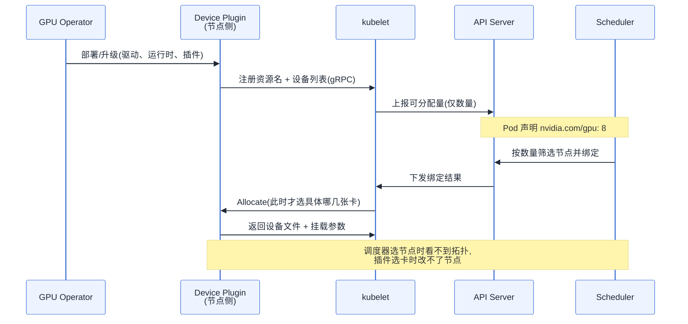
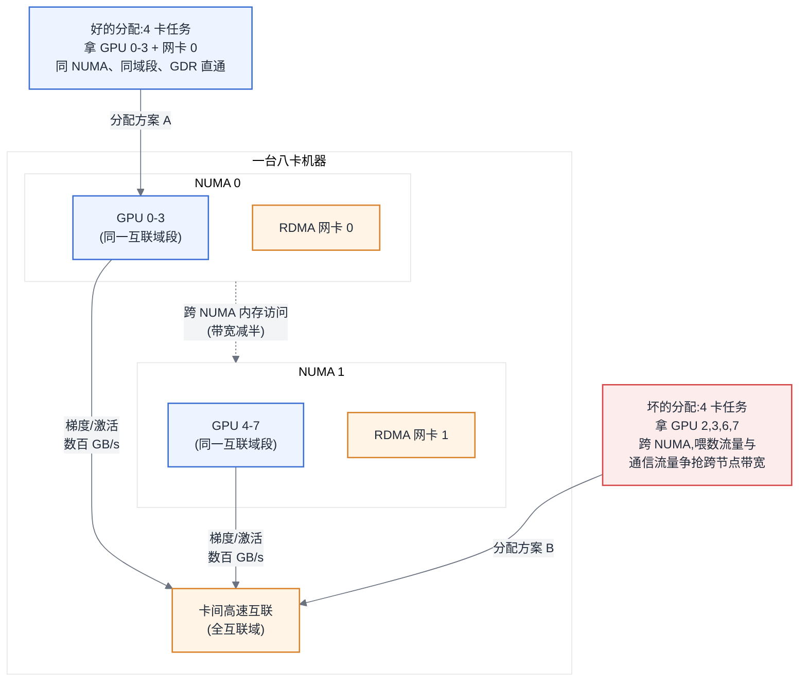
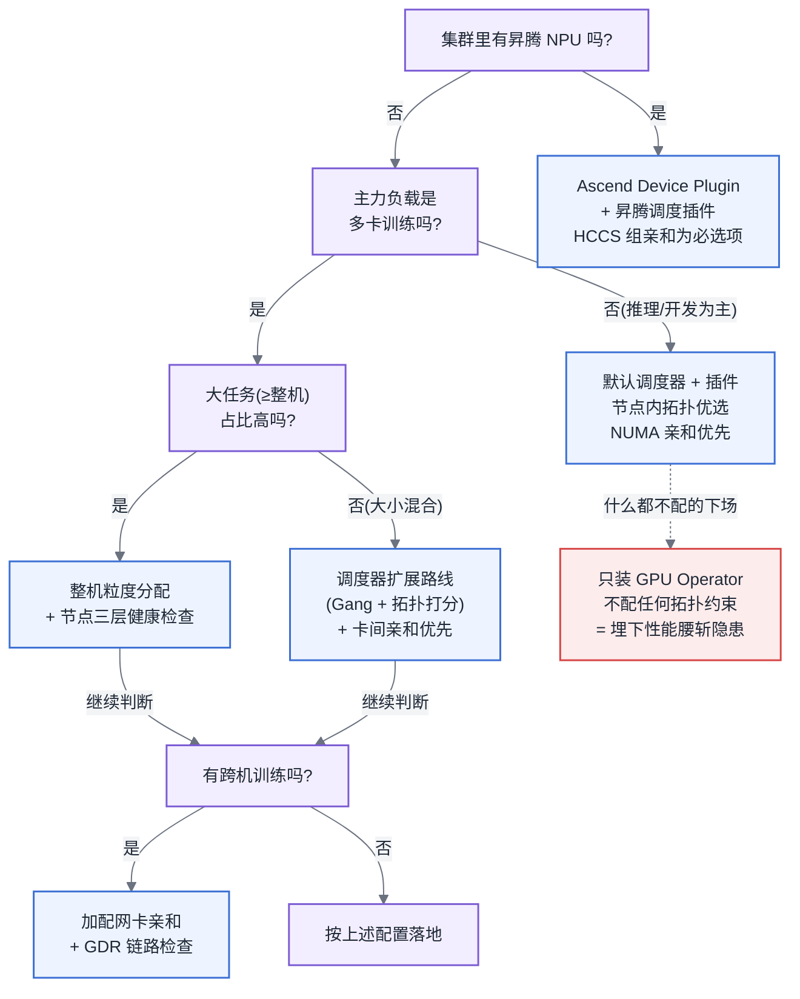

# 第 8 章 K8s 上的加速卡

## 8.1 链路定位

本章位于主线 A(一次训练任务的生命周期)的最前端——任务提交之后、第一行训练代码运行之前:调度器决定这个任务的 8 张卡落在哪台机器的哪几个槽位上。这个决定一旦做出,后面所有章节讨论的优化都要在它划定的物理边界内进行;对主线 B 而言,它同样决定了一个推理实例能拿到怎样的卡间互联条件。

## 8.2 依赖声明

本章建立在第 7 章的一条结论之上:**互联带宽在域边界上是断崖式下跌的,三级拓扑(卡间/域内/跨域)决定了通信耗时的量级**。第 7 章解释了为什么位置重要,本章解决"如何让调度器知道位置重要"。同时,本章默认读者具备第 1 章确认过的 K8s 基础:知道 kubelet、scheduler、Pod 的 requests/limits 是什么。

## 8.3 问题场景:调度成功,性能腰斩

某推荐团队把一个单机 8 卡的训练任务从物理机搬上 K8s。集群是标准配置:每台机器 8 张卡、2 个 NUMA 节点、卡间有高速互联,GPU Operator 装好了,`nvidia.com/gpu: 8` 一填,Pod 秒级调度成功,Running,日志正常滚动。两天后算法同事找上门:同样的模型、同样的数据、同样的超参,物理机上一个 step 是 780ms,K8s 上是 1450ms,吞吐几乎腰斩。

平台工程师排查了一圈:GPU 利用率 85% 左右,不算低;没有 OOM,没有重启,网络 ping 正常,`nvidia-smi` 看不出任何异常。他的第一反应是"容器化开销",但 cgroup 和运行时的开销撑死几个百分点,解释不了 46% 的下降。

真正的原因要用 `nvidia-smi topo -m` 才能看见:这台机器此前跑过两个 4 卡任务,其中一个结束后释放了 0、1、2、5 号卡,另一个还占着 6、7 号。新任务拿到的 8 张卡分布在两台机器上——K8s 默认调度器认为"两台机器各出 4 张卡"和"一台机器出 8 张卡"是等价的,因为在它的资源模型里,`nvidia.com/gpu` 只是一个数字。更糟的是,其中一台机器上分到的 4 张卡横跨两个 NUMA 节点,数据预处理进程的 CPU 亲和又没配,H2D 拷贝要多走一次跨 NUMA 的内存访问。梯度同步从"全部走机内高速互联"变成"一半流量走 25Gbps 的机间以太网",通信时间占比从 8% 涨到 45%。

调度器没有出错——它按自己的模型做出了完全正确的决定。错的是模型本身:它不知道 8 张卡和 8 张卡之间可以差出一倍性能。

## 8.4 原理与量化模型

### 8.4.1 设备插件机制:kubelet 只认识"数量"

K8s 原生资源模型只有 CPU 和内存两维。加速卡通过设备插件(Device Plugin)机制以扩展资源(Extended Resource)的形式接入:插件以 DaemonSet 形式跑在每个节点上,通过 gRPC 向 kubelet 注册资源名(如 `nvidia.com/gpu`),上报设备列表与健康状态;kubelet 汇总成节点可分配量报给 API Server;调度器按数量做匹配;Pod 绑定到节点后,kubelet 回调插件的 Allocate 接口,插件返回要挂进容器的设备文件与环境变量。

这条链路有一个决定性的特征:**调度器在整个过程中只见过一个整数**。设备是哪几块、彼此什么拓扑关系,只有节点上的插件知道,而插件做 Allocate 决策时,调度器早已选完了节点。这就是"调度成功但性能腰斩"的机制根源:全局决策(选节点)和局部决策(选卡)被拆在两个互相看不见的组件里。

GPU Operator 的职责是把这条链路的运维自动化:驱动、容器运行时钩子、设备插件、监控 exporter 全部以容器方式部署和升级。要划清一个边界:**Operator 管的是"让卡可用",不管"让卡用得好"**——它不做任何调度决策,拓扑感知不归它管。把 Operator 装好就认为 GPU 接入完成,只完成了本章的一半。

图 8-1:设备插件与调度链路。要记住的一件事:选节点的组件不知道拓扑,知道拓扑的组件不能选节点——拓扑感知调度就是在弥合这条裂缝。

### 8.4.2 为什么加速卡不是 CPU

加速卡与 CPU 在资源模型上有三条本质差异,每一条都推翻一个 K8s 的默认假设:

**不可超卖**。CPU 可以按时间片超卖,因为上下文切换代价是微秒级。GPU 的显存没有实用的换页机制,两个任务共享一张卡意味着显存直接相加,超了就 OOM;算力上多进程默认时间片轮转,上下文切换伴随缓存失效,干扰不可控。所以整卡分配是默认,`requests` 必须等于 `limits`。

**不可细分(默认)**。CPU 可以要 0.5 核,卡默认只能要整数张。细分手段(MIG、虚拟化切分)是需要显式建设的能力,且各有代价(见第 10 章),不是资源模型的原生属性。

**拓扑敏感**。这是最重要、也最反 K8s 直觉的一条。对 CPU 而言,8 核就是 8 核;对加速卡而言,"哪 8 张"决定了梯度同步走哪一级互联。用第 7 章的量化框架:一次 AllReduce 的通信时间约为

$$T_{comm} \approx \frac{2(N-1)}{N} \cdot \frac{S}{B_{bottleneck}}$$

其中 S 是梯度量,B 取通信路径上**最窄一段**的带宽。8 卡同机走高速互联域,B 是数百 GB/s 量级;一旦有一张卡在域外,整个 Ring 的 B 立刻掉到机间网络的量级——差距可达一到两个数量级。代入问题场景:每 step 梯度同步的数据量不变,分母缩小几十倍,通信时间从几十毫秒涨到数百毫秒,而这段时间是同步阻塞的,GPU 利用率却可能依然"好看"(卡在等,但等待前后的 kernel 依然在跑)。

由此得出本章要强调的反直觉结论:**在 AI 集群里,把任务放错位置的代价,远大于让任务排队的代价**。排队损失的是等待时间,是一次性的;放错位置损失的是全程 30%–50% 的吞吐,乘以任务时长(天到周级),再乘以 8 张卡的机时单价。一个排 2 小时队换来完整互联域的任务,几乎总是优于一个立刻启动但跨域的任务。传统 K8s 运维的 KPI 是"调度延迟低、装箱率高",这个 KPI 在这里方向性错误——大数据调度器"有资源就先跑起来"的贪心策略,在同步训练场景下是负优化。

### 8.4.3 三种亲和及其冲突

节点内的拓扑约束有三层,好的分配要同时满足,坏的分配踩中任何一条都会损失性能:

1. **NUMA 亲和**:GPU 挂在某个 NUMA 节点的 PCIe 根联合体下,喂数据的 CPU 进程和锁页内存应在同一 NUMA 节点,否则 H2D 拷贝多穿一次 CPU 互联,带宽打折且延迟上升。
2. **卡间互联亲和**:优先分配处于同一高速互联域内的卡组。NVIDIA 路径上由设备插件/调度插件按 NVLink 拓扑打分;分错的代价由上面的 AllReduce 公式给出。
3. **网卡亲和**:跨机通信时,RDMA 网卡与 GPU 应在同一 PCIe 交换机下,GPUDirect RDMA 才能绕过 CPU 内存中转;分错则跨机带宽上限直接砍半。

三者冲突时的取舍原则按通信量排序:**多卡训练优先保卡间互联亲和**(每 step 都在用,数据量最大),**跨机任务其次保网卡亲和**,**NUMA 亲和最后保**(只影响数据供给路径,且可以用预取缓冲部分掩盖)。反过来,单卡推理服务没有卡间通信,NUMA 亲和反而上升为第一优先级。取舍不是玄学,是把三条路径上的数据量各自算一遍、按谁大保谁。

图 8-2:八卡机器的拓扑与两种分配。要记住的一件事:同样是"4 张卡",方案 A 与方案 B 的差距不在卡本身,而在数据要走的路——碎片化分配是这类坏方案的主要来源。

### 8.4.4 Ascend Device Plugin 与 NPU 调度

昇腾 NPU 走的是同一套设备插件机制,但有三处与 GPU 路径不同,迁移时最容易在这里翻车:

**资源上报**。Ascend Device Plugin 按芯片形态上报不同资源名(如 `huawei.com/Ascend910`),训练卡与推理卡是不同资源,配额、监控、Pod 模板都要分开配;还支持上报虚拟化切分后的算力实例,资源名随切分规格变化。直接把 GPU 的 YAML 改个资源名就上线,是 NPU 迁移的第一类事故来源。

**拓扑感知**。昇腾机内是 HCCS 互联,训练服务器上 8 颗 NPU 常呈两个 4 卡全互联组,组间带宽低于组内——这意味着**机内就存在域边界**,4 卡以内的任务必须落在同一 HCCS 组内。这项约束不是靠默认调度器,而是靠配套的调度组件(Volcano 加昇腾插件或 Ascend Scheduler)做亲和打分实现的;换句话说,GPU 路径上"装个插件就能跑、拓扑损失 30%"的宽容度,在 NPU 路径上更小,拓扑感知调度是必选项而非优化项。

**配置差异**。容器运行时用 Ascend Docker Runtime 而非 nvidia-container-toolkit;驱动与固件(含 CANN 版本)的兼容矩阵比 CUDA 更严格,升级必须整体规划;健康状态通过 npu-smi 与插件的健康上报链路获取,故障码体系与 GPU 完全不同,告警规则不能复用。集合通信由 HCCL 承担,其对拓扑的假设(见第 7 章)同样要求调度结果对齐 HCCS 组边界。

对做平台的人,这意味着:GPU 与 NPU 可以共存于一个集群,但要按"两套设备栈、一套调度框架"来建——资源名、运行时、监控三层分开,队列与配额模型(第 9 章)统一。

### 8.4.5 节点生命周期:驱动、健康检查与自动隔离

**驱动升级**必须滚动:节点先 cordon(停止接新任务),drain 掉可迁移负载,等长训练任务自然结束或在 checkpoint 边界主动迁移(见第 19 章),升级后跑一轮基准验证再解除隔离。一次性全集群升级等于自己制造一次全局故障。升级批次的粒度有一条硬约束:**同一个多机训练任务所在的节点组必须视为一个原子单元**,动其中一台等于杀掉整个任务。

**健康检查该检什么**:设备插件自带的健康上报只覆盖"设备是否可枚举",远远不够。生产级检查分三层——硬件层(ECC 错误计数、温度、功率异常、掉卡)、链路层(卡间互联链路状态、RDMA 网卡误码率)、功能层(定期跑一个 30 秒的小型 AllReduce 基准,验证"算得对、通得快")。第三层最重要也最常被省略:大量慢卡故障(降频、互联降速)在前两层完全无症状,只有基准测试能抓住,而一张慢卡会拖慢整个同步组(见第 20 章)。

**自动隔离的判定与误判代价**:隔离动作(打 taint、驱逐 Pod)的收益是防止故障节点反复吞噬新任务,代价是误判会杀掉一个可能已经跑了三天的训练任务。判定条件因此要区分置信度:硬件不可恢复错误(如 ECC 双比特错误、掉卡)→ 立即隔离;可恢复但反复出现(单比特 ECC 速率超阈值、间歇性链路抖动)→ 标记不接新任务,存量任务跑到下一个 checkpoint 再迁移;基准性能下降 → 只告警加人工确认,因为性能下降也可能来自邻居任务干扰,自动杀任务的误判代价在这里高于收益。原则:**隔离动作的激进程度,必须与故障证据的置信度成正比**。

## 8.5 方案对比

拓扑感知能力的建设有三条路线,各有失效边界:

**方案一:默认调度器 + 设备插件的节点内拓扑优选**。调度器只管数量,靠插件在 Allocate 时按拓扑优选卡组。搭建成本几乎为零。失效边界:节点内优选救不了节点选错——一旦调度器把任务拆到两台机器,或者选了一台只剩碎片卡的机器,插件巧妇难为无米之炊;并且它对多 Pod 分布式任务完全无感。适用于单机任务为主、集群装箱率不高(碎片少)的小集群,规模上了两位数节点就会开始交"碎片税"。

**方案二:调度器扩展路线(Volcano/Kueue + 拓扑插件,昇腾场景的标准路径)**。把拓扑信息上报到集群级,调度器在选节点时就做拓扑打分,配合 Gang Scheduling(见第 9 章)处理多 Pod 任务。这是 2026 年百卡以上训练集群的主流答案,也是 NPU 集群的事实必选项。失效边界:组件链条变长,调度器插件、设备插件、驱动三者的版本兼容成为新的运维负担;拓扑打分依赖上报信息的准确性,硬件异构(多代卡混布,见第 10 章)时打分模型容易失真;对"整机分配"之外的精细共享场景(推理小任务混布)收益有限还增加排队。

**方案三:整机粒度分配,绕开卡级调度**。规定任务粒度只能是整台机器(8 卡的倍数),调度问题退化为选机器,机内拓扑天然完整。大型训练专用集群常这么干,简单可靠。失效边界:资源粒度太粗,小任务(单卡调试、小规模推理)会浪费掉 7/8 的容量;它把利用率问题转移给了队列管理——本质是拿利用率换确定性,只有在"大任务占绝对主导"的集群里这笔交换才划算。混合负载集群这么配,利用率会掉到让老板问话的程度(见第 11 章)。

没有一条路线全场景成立。实践中的常见组合:训练池用方案三或方案二,推理与开发池用方案一,两池之间靠第 9 章的队列体系联通。

## 8.6 大数据对照

YARN 的资源模型是一个二维向量:`<memory, vcores>`。它的三个隐含假设在加速卡场景全部失效:

**假设一:资源是可加的标量**。YARN 里 8GB 内存就是 8GB,从哪块 DIMM 上来无所谓;调度只需做向量减法。加速卡是**带拓扑约束的多维资源**:8 张卡不是一个数字,而是互联图上的一个子图,子图的连通性(是否同域、是否跨 NUMA)决定实际性能。资源维度从"二维向量比大小"变成了"图上选子图",这是 YARN 的 Resource 抽象根本表达不了的——后来 YARN 加入 GPU 支持,也只做到了数量维度,和 K8s 默认路径半斤八两。

**假设二:放错位置的代价是常数且小**。MapReduce 时代讲数据本地性(data locality),但本地性丢失的代价是"多读一次网络",典型影响百分之几十的单 task 耗时,且 task 之间互不等待、可以各自重试。同步训练里放错位置影响的是**每一个 step 的全局同步点**,代价乘在整个任务时长上,且没有"重试"可以补救——所以 YARN 的 delay scheduling(为本地性最多等几秒,等不到就妥协)在这里方向正确但力度差了三个数量级:AI 调度器为拓扑完整性等几小时都是划算的,这正是 8.4.2 那条反直觉结论的另一面。

**假设三:节点故障是局部事件**。YARN 的 NodeManager 挂了,AM 把那几个 task 换地方重跑即可,健康检查只需回答"节点还活着吗"。同步训练里一个节点故障是全局事件(见第 1 章),所以健康检查必须升级为"节点还快吗"——8.4.5 的三层检查里,功能层基准在 Hadoop 时代没有对应物,因为那时不需要。

可以直接复用的部分同样要说清:节点生命周期管理的框架(cordon/drain/滚动升级)与 Hadoop 集群滚动重启 DataNode 的纪律一脉相承;"隔离激进度与证据置信度成正比"的原则,与 HDFS 对慢节点(stale node)先降权后摘除的分级处理是同一个思想。失效的不是运维方法论,而是资源模型和代价模型。

## 8.7 选型决策树

图 8-3:调度约束选型决策树。要记住的一件事:先按负载形态定分配粒度,再按通信量排亲和优先级——"装好 Operator 就收工"是本章明确反对的唯一选项。

沿树走一遍你自己的集群:先看有没有 NPU(有则调度插件不可省),再看负载形态定粒度,最后按"卡间互联 > 网卡 > NUMA"(训练)或"NUMA 优先"(单卡推理)排亲和优先级。每一个分支的性能含义都能在 8.4 节找到对应的算式或数量级依据。

---

读完本章,你应当能:为一个给定负载构成的集群搭出拓扑感知的调度基线——选定分配粒度与调度路线、写出三种亲和的优先级顺序并说明每项配置对应的性能数量级;能用 AllReduce 通信时间的估算解释"为什么这 8 张卡比那 8 张卡慢一倍";能为 GPU 与 NPU 混布集群划出"两套设备栈、一套调度框架"的边界;并能设计一套按证据置信度分级的节点健康检查与自动隔离策略,说清每一级误判的代价。
