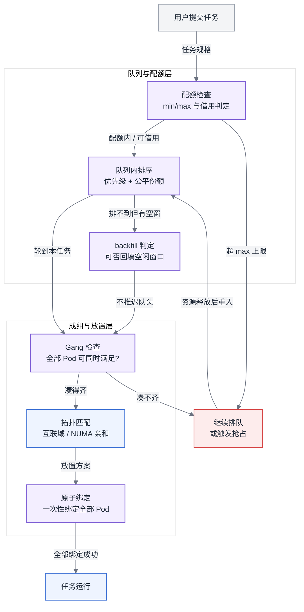
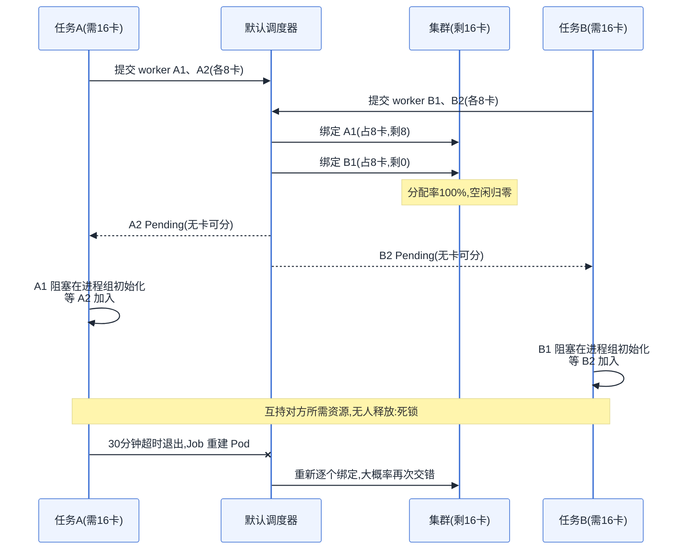
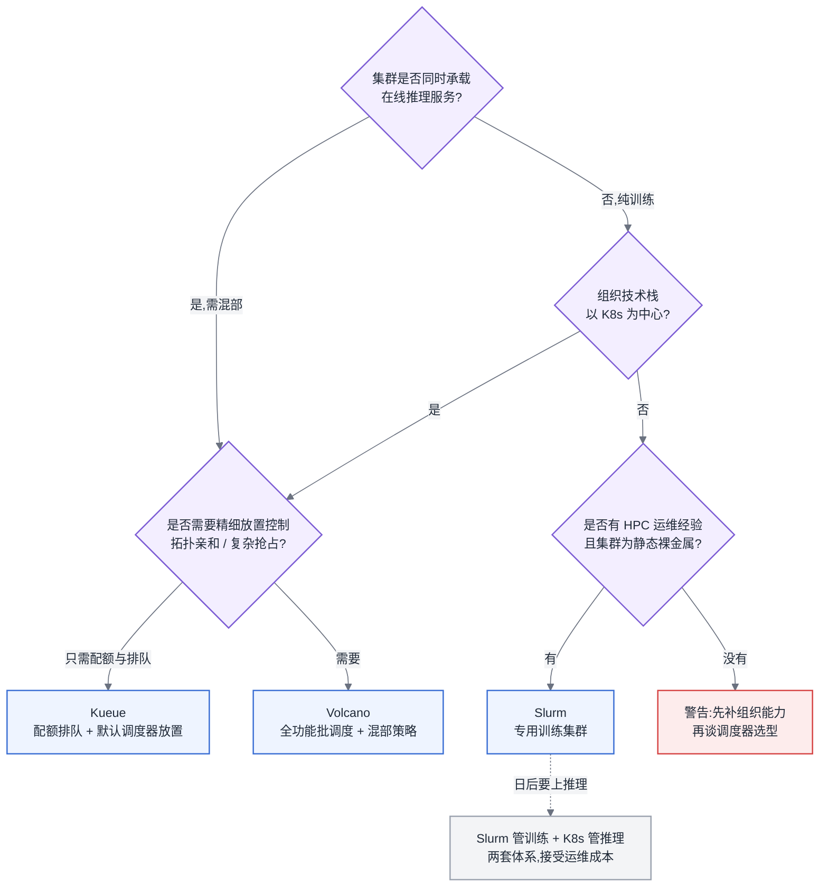

# 第 9 章 批调度器

## 9.1 链路定位

本章位于主线 A(一次训练任务的生命周期)的最前端:任务提交之后、进程启动之前的那一段——它决定这个任务能不能拿到卡、拿到哪些卡、什么时候拿到,以及在资源紧张时谁先让路。

## 9.2 依赖声明

本章建立在第 8 章的结论之上:加速卡是不可超卖、整卡独占、拓扑敏感的资源,K8s 默认调度器以 Pod 为粒度逐个决策的模型无法表达"一组 Pod 要么全启动、要么全不启动"的约束。本章解决的正是这个约束缺失带来的全部后果。

## 9.3 问题场景:利用率 100%,进展为零

某平台团队管理一个 128 卡的训练集群,基于 K8s 默认调度器加上 ResourceQuota 做了配额管理,运行了两个月都相安无事——因为此前的任务大多是单机八卡以内。周四晚上,算法团队 A 提交了一个 16 卡(2 机 × 8 卡)的预训练任务,几乎同一时刻,团队 B 也提交了一个 16 卡任务。当时集群恰好剩余 16 张空闲卡,分布在四台机器上。

默认调度器逐个 Pod 决策:A 的两个 worker Pod 中有一个先被调度,占住 8 卡;B 的一个 worker 也被调度,占住另外 8 卡。剩余卡数归零。A 的第二个 worker 进入 Pending,B 的第二个 worker 也进入 Pending。A 已启动的 worker 在 `init_process_group` 上阻塞,等待第二个 rank 加入;B 的处境完全相同。两个任务各握着对方需要的 8 张卡,谁也不会主动释放——PyTorch 的进程组初始化默认超时是 30 分钟,超时后进程退出,但 K8s 的 Job 控制器立刻重建 Pod,重新调度,大概率再次陷入同样的交错。

第二天早上值班同学看监控:GPU 分配率 100%,显存占用正常(NCCL 初始化时已分配了通信缓冲区),没有任何告警。但两个任务的 loss 曲线整晚都是空的。16 张卡空转了 11 个小时,按市场租金折算烧掉约五位数人民币,而集群大盘上没有任何一个指标显示异常。平台负责人的第一反应是"是不是网络故障",排查了两小时 NCCL 日志才意识到:这不是故障,是调度器的模型性缺陷——它根本不知道这 16 个 Pod 是一个整体。

## 9.4 原理与量化模型

### 9.4.1 Gang Scheduling:同步训练的调度公理

数据并行训练的每一步都以 AllReduce 全局同步收尾(见第 7 章),这决定了一个刚性事实:N 个 worker 少一个,其余 N−1 个全部阻塞。所以训练任务的调度必须是原子的——**要么凑齐全部资源一次性启动,要么一张卡也不占**。这就是 Gang Scheduling(成组调度)。它不是优化项,是正确性前提。

没有 Gang 语义时,部分调度(partial scheduling)造成两类损失,都可以量化:

**资源死锁概率。** 设集群剩余 R 张卡,同时到达 k 个各需 G 张卡的任务,且 R < kG。逐 Pod 调度下,只要资源被交错分配、且没有任何一个任务凑齐 G 张,就形成死锁。两任务、资源恰好够一个任务(R = G)的场景下,交错概率随每任务的 Pod 数上升而迅速逼近 1——直觉是:调度器交替处理两个队列头部 Pod 的概率远大于连续处理完同一个任务的所有 Pod。工程上不必精确计算这个概率,只需要记住结论:**并发提交的多机任务只要共享一个资源池,部分调度迟早产生死锁,规模越大越快**。

**资源空耗。** 即使不形成互锁(比如靠超时退出+重试打破了僵局),部分启动的 worker 在等待期间也在空耗卡时。空耗量为:

```
空耗卡时 = Σ(已启动 worker 卡数 × 等待时长)
```

等待时长的下界是剩余资源的释放周期。在一个跑满长任务的集群里,这个周期以小时甚至天计。一个 512 卡任务如果先启动了 448 卡、等最后 64 卡等了 4 小时,空耗就是 1792 卡时——按典型训练卡成本折算,单次事件的损失就足以支付一个批调度器一年的维护成本。

### 9.4.2 队列、配额、优先级、抢占:四件套的模型设计

Gang 解决"怎么启动",但集群治理还要回答"谁先启动、谁能用多少、紧急任务来了怎么办"。四个机制是一个整体,拆开设计必出问题。

**队列(Queue)** 是资源分配的组织单位,通常映射到团队或业务线。队列的本质是把"全局竞争"切成"队列间分配 + 队列内排序"两层,使得资源争抢在组织边界上可治理、可问责。

**配额(Quota)** 定义队列能用多少资源。关键设计决策是静态还是弹性:

```
弹性配额三元组:min(保底) ≤ 实际占用 ≤ max(上限)
集群可分配总量 ≥ Σ 各队列 min    —— 保底之和不能超卖
Σ 各队列 max 通常 > 总量          —— 上限之和刻意超配,允许借用
```

某队列用量超出 min 的部分是"借来的",在出借方需要时应可回收——这直接引出抢占。设计配额时最常见的错误是把 min 设得等于 max(退化为静态切分,闲置无法借用,集群利用率封顶在 Σmin/总量)或把 min 设为 0(队列毫无保障,高峰期饿死)。

**优先级(Priority)** 决定队列内(有时也跨队列)的排序。要点只有一条纪律:优先级必须是稀缺的。如果每个团队都能自助把任务标成最高优先级,优先级就退化为噪音。可行的做法是把高优先级做成需审批的配额资源(例如每队列每月 N 个高优任务额度)。

**抢占(Preemption)** 是配额与优先级的执行机制:高优任务或配额被借用的队列索回资源时,杀掉低优/借用中的任务。抢占的代价必须量化,因为被抢占的训练任务损失的不只是"被杀",而是回滚到上一个 checkpoint:

```
单次抢占损失 = (T_since_ckpt + T_restart) × G_victim
  T_since_ckpt:距上一个 checkpoint 的训练时间(平均为 checkpoint 间隔的一半)
  T_restart:重新排队 + 调度 + 拉起 + 加载 checkpoint 的时间
  G_victim:被抢占任务的卡数
```

一个 64 卡任务、checkpoint 间隔 1 小时、重启开销 20 分钟,单次抢占平均损失约 64 × (30+20)/60 ≈ 53 卡时。这个公式给出一条实用判据:**只有当抢占者的等待损失大于受害者的回滚损失时,抢占才是净收益**。据此可以推出两条策略:抢占目标应优先选距 checkpoint 最近、卡数最少的任务;checkpoint 间隔越长的任务越不该被抢(或者反过来说,想少被抢就把 checkpoint 存勤一点——这是平台可以写进使用规范的激励设计)。

### 9.4.3 排队策略:FIFO、公平共享与 backfill

队列内部怎么排,决定了资源碎片能不能被用起来。

**FIFO** 最简单,但在 AI 场景有一个致命放大效应:队头阻塞(head-of-line blocking)。一个 256 卡的大任务排在队头,集群当前只有 128 卡空闲,FIFO 会让这 128 卡一直空着等大任务凑齐——后面排着的一堆 8 卡小任务明明能跑却不许跑。大数据集群里队头任务通常几分钟就能过去,而训练集群的资源释放以天计,队头阻塞的空耗是灾难性的。

**公平共享(Fair Share)** 按各队列的历史用量与配额之比动态排序,用得少的队列优先。它解决的是队列间的长期公平,代价是牺牲了任务完成时间的可预测性——你的任务什么时候能跑,取决于别的队列最近用了多少,这对需要向业务方承诺排期的平台是个沟通负担。

**Backfill(回填)** 是对 FIFO 的关键修正:允许排在后面的小任务插队使用空闲资源,前提是**不推迟队头大任务的预计启动时间**。这要求调度器知道两件事:当前运行任务何时释放资源(需要任务声明预计运行时长,或由系统设定墙钟上限)、以及回填任务的运行时长。Slurm 的 backfill 依赖用户提交时声明 `--time`,声明不准就会做出错误的回填决策。回填的收益可估算:

```
回填收益 ≈ 空闲窗口卡数 × 窗口时长 × 回填命中率
```

在大小任务混合的集群上,backfill 通常能把分配率提高 10–20 个百分点。它的隐含代价是激励扭曲:用户会发现声明短时长更容易被回填插队,于是系统性低报时长,任务到点被杀。平台需要用"超时宽限 + 低报惩罚(信用分)"来对冲。

所以这对做平台的人意味着什么:排队策略不是三选一,生产形态几乎总是"队列间弹性配额 + 队列内优先级排序 + backfill 回填碎片",而你要设计的其实是配套的激励规则——checkpoint 频率影响被抢概率、时长声明影响回填资格——让用户的自利行为与集群利用率对齐。

### 9.4.4 一个任务从提交到运行的完整判定链

把上述机制串起来,一个批调度器对每个任务的决策链如下图。注意 Gang 检查发生在拓扑匹配之前:先确认"数量上凑得齐",再确认"位置上摆得好"——顺序反了会浪费大量拓扑计算。



图 9-1:批调度器的任务判定链。Gang 检查是整条链的分水岭——它保证"凑不齐就一张卡不占",死锁与空耗都消于此处。

而 9.3 节的死锁,正是缺失这条链时的时序,如下图所示:



图 9-2:资源死锁的形成时序。死锁的根因不是资源不足,而是调度粒度(单 Pod)与任务的原子性需求(整组)错配——加卡不能根治,换调度模型才能。

## 9.5 方案对比:Volcano / Kueue / Slurm

三个调度器代表三种不同的抽象,不是同一产品的三个牌子。对比的正确姿势是看各自的模型假设在什么条件下断裂。

**Volcano:K8s 上的全功能批调度器。** 它的核心抽象是 PodGroup(成组语义)加 Queue(层级队列),自带一个替换默认调度器的调度器实现,内置 gang、优先级、抢占、回填、拓扑感知等插件,还提供 VCJob 这种面向训练任务的作业抽象。它假设你愿意在 K8s 里引入并运维第二个调度器。**失效边界:** 其一,组织复杂度——当集群里同时存在多个调度器(默认调度器管在线服务、Volcano 管训练)时,两者各自决策、互不知情,在共享节点上会互抢资源产生冲突,要么严格划分节点池(牺牲混部弹性),要么承受偶发的调度竞态;其二,当你的需求只是"配额 + 排队"而不需要复杂的调度插件时,Volcano 的运维成本(调度器本身的升级、插件配置、与 K8s 版本的兼容矩阵)超过其收益;其三,超大规模下单调度器吞吐有限,数千节点、高任务churn 的集群会碰到调度延迟上升的天花板。

**Kueue:K8s 原生的配额与准入控制器。** 它的抽象刻意收窄:不替换调度器,只做作业级的准入(admission)——一个作业在配额与队列规则下被"放行"后,Pod 才交给默认调度器(或配合的拓扑调度能力)去放置。ClusterQueue/LocalQueue 的两级模型与 K8s 的多租户体系(namespace)自然对齐,借用与回收(cohort 机制)是一等公民。它假设"排队决策"与"放置决策"可以分离。**失效边界:** 恰恰在这个分离假设上——当放置本身是难点时(强拓扑约束、需要精细的 gang 时序控制、需要调度期打分优化互联亲和),准入层放行了但放置层摆不好,Kueue 无从干预;它对"作业"之下的调度细节控制力弱,需要复杂抢占策略(如按拓扑选择受害者)或域感知放置的场景会超出它的表达能力。此外它相对年轻,把十年积累的 Slurm 策略生态搬过来的团队会发现大量策略没有对应物。

**Slurm:HPC 世界的标准答案。** 它根本不在 K8s 的世界里:自带资源管理、gang、backfill、公平共享、预留(reservation)、拓扑感知,这些能力打磨了二十年,national lab 万卡级集群的排队策略复杂度它都消化过。它假设集群是相对静态的裸金属机器、用户通过登录节点用命令行提交作业、软件环境靠模块系统或容器运行时(如 enroot/pyxis)解决。**失效边界:** 其一,它没有服务化的概念——推理服务需要的探活、滚动更新、弹性伸缩、服务发现,Slurm 一概没有,训练推理混部的集群用 Slurm 意味着推理侧要另起一套体系;其二,多租户隔离弱,账户体系与 K8s 的 RBAC/namespace/网络策略是两个世界,面向多业务方的内部平台需要自建大量周边;其三,云弹性差,节点动态增减不是它的原生假设,云上按需扩缩的场景很别扭;其四,组织能力依赖——它需要会 Slurm 的人,而云原生背景的团队里这种人稀缺,这本身就是一条现实的失效边界。

一句话立场:**组织已经 all-in K8s 且需要精细调度控制,选 Volcano;K8s 上只缺配额排队、想最小化侵入,选 Kueue;专用训练大集群、有 HPC 运维基因、不需要在同一集群跑在线服务,Slurm 仍是 2026 年最稳的选择**。真正的错误不是选错三者之一,而是试图让一个调度器覆盖它模型之外的负载。

## 9.6 训练与推理混部:潮汐利用及其边界

推理流量有日内潮汐:白天高峰、凌晨低谷,低谷期在线服务缩容后空出的卡,是训练任务天然的猎场。混部的收益模型很直接:

```
混部收益 ≈ 低谷释放卡数 × 低谷时长 × 训练任务填充率 − 抢占摩擦成本
```

其中抢占摩擦成本就是 9.4.2 的抢占损失公式在早高峰的求和:每天早上推理扩容索回资源时,填进去的训练任务会被成批抢占并回滚。这决定了混部的两条工程纪律:**填充的训练任务必须是抢占友好的**(checkpoint 密集、单任务卡数小、最好是无状态可重跑的评测/数据处理类负载),以及**抢占必须有序**(先停止调度新任务、给宽限期存 checkpoint、再回收,而不是直接杀)。

反方向的抢占——训练抢推理——纪律更严:在线服务的 SLO 以 P99 延迟计,抢占一个推理实例意味着其余实例瞬间承接其流量,在负载已高时会引发排队延迟的级联恶化。所以生产上的规则几乎总是单向的:**推理可以抢训练,训练不可以抢推理**;训练只能吃推理"主动缩容让出"的资源。

混部的收益边界也要说清楚:潮汐深度不足(低谷释放量 < 一个最小训练任务的需求)、或潮汐周期短于"调度 + 拉起 + 加载 checkpoint + 有效训练 + 保存退出"的最小往返时间时,混部是负收益——卡在反复的装载卸载里,有效训练时间趋近于零。经验判据:**可预测的连续空闲窗口至少要达到训练任务冷启动开销的 5 倍以上,填充才有净收益**。达不到,就把低谷资源留给无状态批处理(离线批量推理、评测),而不是硬塞同步训练。

所以这对做平台的人意味着什么:混部不是调度器的一个开关,而是一组契约——训练侧承诺 checkpoint 频率与可抢占性,推理侧承诺缩容让出的窗口与提前量,平台用优先级与配额把契约固化。任何一方不履约,混部就从降本手段变成互相伤害。

## 9.7 大数据对照

YARN 的 Capacity/Fair Scheduler 与本章的四件套惊人地同构:层级队列、min/max 弹性配额、跨队列借用与抢占、公平共享排序——Volcano 与 Kueue 的队列模型几乎就是这套设计在 K8s 上的重生。做过 YARN 多租户治理的读者,队列划分、配额谈判、抢占灰度这些组织经验可以原封不动搬过来。

但有一条根本性断裂:**YARN 的世界里没有 Gang,因为 MapReduce/Spark 不需要它**。一个 Spark stage 申请 1000 个 executor,先到 300 个就先跑 300 个 task,资源陆续到位、任务陆续推进,部分启动不仅无害,甚至是弹性的体现(dynamic allocation 的全部前提)。单个 task 失败重跑即可,不牵连全局。这套"渐进获取、局部失败"的容错哲学,建立在 task 之间无同步依赖的前提上。

同步训练把这个前提整个抽掉了:每一步全局 AllReduce 意味着 worker 之间是刚性同步的,部分启动等于全不启动,一个 worker 失败等于全局失败(完整讨论见第 20 章)。所以 YARN 时代"资源慢慢给、任务慢慢跑"的调度哲学,在训练集群里从美德变成毒药——9.3 节的死锁正是用渐进分配的旧哲学调度刚性同步的新负载的直接后果。此外,YARN 的资源是二维可分的(vcore/内存),放错位置最多慢一点;加速卡是整卡独占且拓扑敏感的(第 8 章),放错位置性能腰斩。**批处理调度器优化的是"尽快把资源用起来",训练调度器优化的是"要么完美启动、要么干脆等待"——这是两套目标函数,不是一套参数的两种调法。**

## 9.8 选型决策树



图 9-3:批调度器选型决策树。第一个分叉是"是否混部"而非"集群多大"——负载形态决定调度模型,规模只决定参数。

沿树走一遍百卡集群的典型场景:承载训练为主、未来半年要上推理服务、团队是云原生背景——走到 Volcano;同样规模但只做预训练、团队从超算中心出来——Slurm 更稳;K8s 集群已有成熟的默认调度器配置、只是微调任务开始排队打架——先上 Kueue,等放置问题真的出现再考虑迁移 Volcano,而不是一步到位引入自己驾驭不了的复杂度。

---

**读完本章,你应当能**:为一个百卡集群设计出队列划分与 min/max 弹性配额方案,算出给定 checkpoint 间隔下一次抢占的卡时损失并据此制定抢占受害者的选择规则,判断自己的负载形态与组织能力对应 Volcano、Kueue、Slurm 中的哪一个及其何时会触到失效边界,并估算训练推理混部在你的潮汐曲线下是净收益还是负收益。
