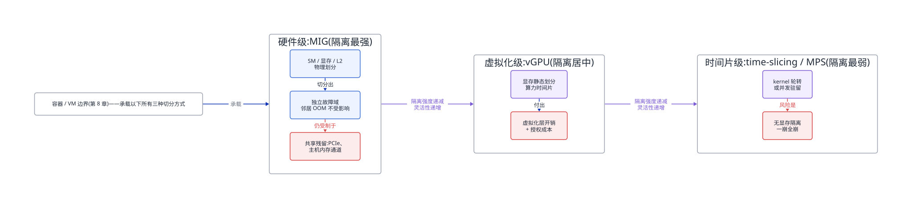
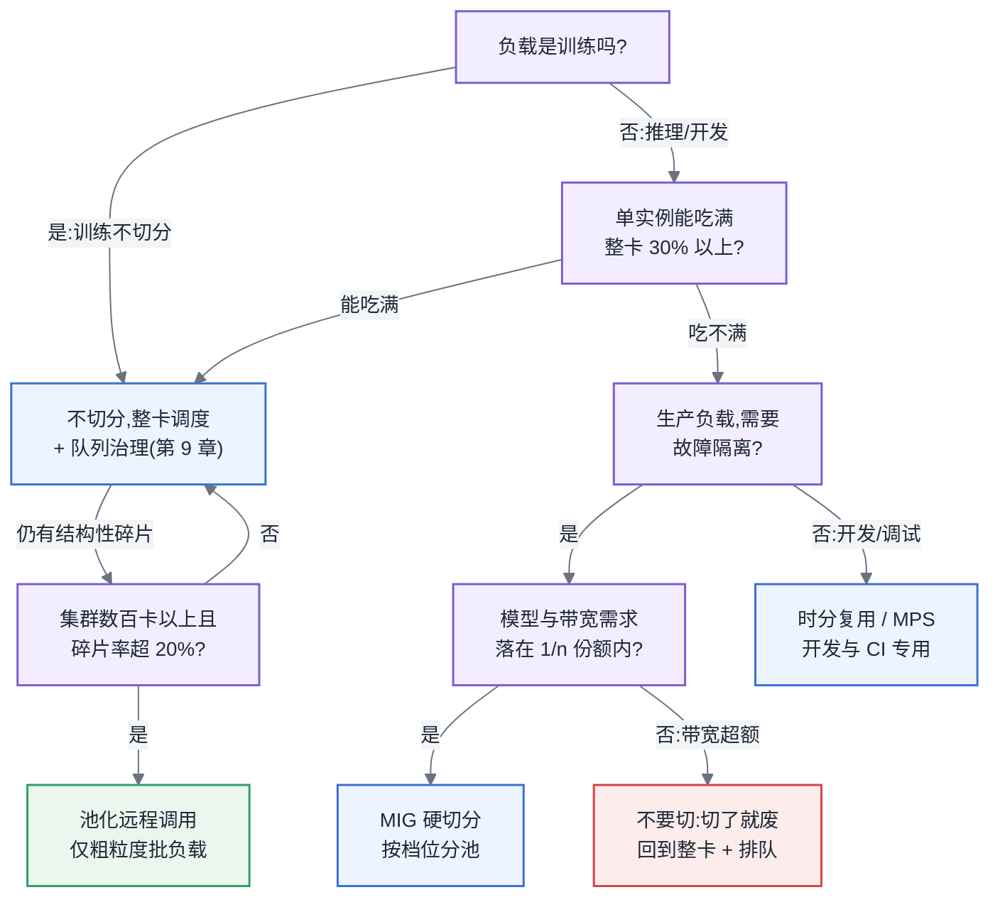

# 第 10 章 异构与池化

## 10.1 链路定位

本章位于主线 A(训练任务生命周期)与主线 B(推理请求全链路)的资源供给侧交汇点:在任务被调度器放置到节点之前(见第 9 章),平台必须先回答"一张卡是否要被切成几份、算力是否要跨节点池化、不同代的卡如何混着用"——这三个决策直接决定了后续每一段链路拿到的是什么样的算力。

## 10.2 依赖声明

本章建立在两条前置结论之上:第 8 章"加速卡在 K8s 资源模型里默认整卡独占,切分需要额外机制"的结论,以及第 9 章"批调度器负责放置,但放置的前提是资源粒度已经定义好"的结论。显存三分的换算口径见第 6 章,Roofline 瓶颈判定见第 4 章,本章直接引用不再重述。

## 10.3 问题场景:切了卡之后,P99 翻了三倍

某内部 AI 平台团队为了提高利用率,把 8 张大显存训练卡改造成推理池:每张卡用 MIG 切成 7 个最小档位实例,跑 7 个 7B 模型的推理副本。上线当天,监控显示平均利用率从 31% 涨到 68%,团队向管理层报了喜。三天后业务方投诉:P50 延迟只涨了 15%,但 P99 从 800ms 恶化到 2.6s,超时率从 0.2% 涨到 4%。

排查过程令人困惑:每个 MIG 实例的 SM 和显存都是硬隔离的,理论上互不干扰,为什么长尾会恶化?进一步抓取发现三个叠加因素:其一,最小档位实例只有整卡约 1/8 的 SM,7B 模型在 Decode 阶段本就是带宽受限(见第 4 章 Roofline),切分后单实例 HBM 带宽同比例缩水,单 token 生成时间直接拉长;其二,7 个实例共享同一条 PCIe 链路和同一颗 CPU 的内存通道,请求高峰期权重加载和输入传输在主机侧排队;其三,MIG 不切分 L2 Cache 之外的部分共享路径,拷贝引擎数量有限,7 路并发拷贝互相踩踏。团队这才意识到:MIG 隔离的是"算力和显存的账面份额",不是"端到端延迟的确定性"。切分决策做错了负载对象——这批流量里 30% 是长上下文请求,恰恰是最吃带宽的那类。

这个案例贯穿本章:切分不是免费的利用率放大器,它是一次"用性能确定性换密度"的交易,交易是否划算取决于负载画像。

## 10.4 原理与量化模型

### 10.4.1 三种切分方式的原理与隔离强度

**MIG(Multi-Instance GPU,多实例 GPU)** 是硬件级切分:把一张卡的 SM、显存、L2 Cache、拷贝引擎物理划分为最多 7 个实例,每个实例有独立的故障域——一个实例里的显存 ECC 错误不会杀死邻居。隔离强度最高,代价是切分粒度固定(只能按预设的几档组合)、切换配置需要清空整卡,且部分共享资源(PCIe、主机内存通道、部分拷贝引擎路径)仍然共享。

**时分复用(time-slicing)** 是调度级切分:多个进程的 kernel 按时间片轮流上卡,配合 MPS(Multi-Process Service)可以让多进程 kernel 并发驻留。没有任何硬件隔离——显存靠进程自觉,一个进程 OOM 或触发不可恢复错误,整卡上所有租户一起陪葬。隔离强度最低,但粒度最灵活、开销最小,且不挑卡的型号。

**vGPU** 是虚拟化级切分:通过宿主机驱动把卡虚拟成多个 vGPU 分给虚拟机,显存静态划分,算力按时间片调度。隔离强度介于两者之间(显存有边界,算力没有),额外付出虚拟化层开销,且引入商业授权成本。它的主战场是 VDI 和需要虚拟机边界的多租户云环境,而非容器化的 AI 平台。

<!-- source: diagrams/sources/ch10-isolation-spectrum.d2 -->

图 10-1:三种切分方式的隔离层次对比。要记住的一件事:隔离强度与灵活性成反比,而且没有任何一种方式能隔离主机侧共享路径——切分卡不等于切分了端到端延迟。

### 10.4.2 切分收益的量化判据

切分是否划算,可以用一个简单的判据式估算。设整卡跑单实例时利用率为 U(此处指有效算力占用,MFU 口径见第 11 章),切成 n 份后单实例性能保留率为 r(受带宽缩水、共享路径争抢影响,r < 1/n × n = 1,实测通常 0.75–0.95),则切分的密度收益为:

**有效吞吐增益 = n × r × U_切分后 / U_切分前**

只有当单实例负载确实吃不满整卡(U_切分前 明显低,例如 < 30%),且负载对延迟长尾不敏感或模型足够小(计算与带宽需求都落在 1/n 份额之内),增益才能大于 1.5 并覆盖运维复杂度。反过来,一个已经把整卡带宽吃满的推理负载,切分后 r 会跌到 0.5 以下——这就是问题场景里 P99 翻三倍的算术根源。

**一条明确的判断,不要在这里犹豫:大模型训练不要切分。** 训练是全局同步负载(见第 1 章),任何一个实例被邻居干扰放慢,整个作业等它;而且训练本身就是为吃满整卡设计的,切分没有密度收益只有确定性损失。切分的主战场只有两个:**小模型推理**(模型放得进 1/n 显存、带宽需求也在 1/n 之内)和**开发/调试环境**(notebook、单元测试、CI,天然低占用且容忍抖动)。

### 10.4.3 池化与远程调用:收益模型与延迟代价

算力池化指把卡从"节点本地资源"变成"网络可达资源",容器通过 API 转发(拦截 CUDA 调用转发到远端)使用别的节点上的卡。收益模型是碎片整理:设集群有 N 张卡、碎片率为 f(单节点剩余但拼不成整机需求的卡时占比),池化理论上可回收接近 f × N 的卡时。碎片率低于 10% 时,回收收益通常盖不住系统复杂度;超过 20% 且集群规模在数百卡以上时才值得认真评估。

延迟代价必须算:本地 PCIe 往返在微秒级,跨节点 RDMA 往返在 10 微秒级,TCP 则到百微秒级。对一次 kernel 启动开销本就在 10 微秒量级的负载,远程转发把控制面延迟放大 2–10 倍。因此池化只适合**计算粒度粗、调用频率低**的负载——批量离线推理、embedding 计算;对 kernel 密集、latency 敏感的在线推理和一切训练负载,远程调用的性能税不可接受。所以对做平台的人意味着:池化是碎片治理手段,不是通用算力供给方式,先算碎片率再决定要不要引入这层复杂度。

### 10.4.4 多代硬件共存:木桶效应的调度对策

集群运营三年以上必然多代共存。约束有三条。第一,**同一训练作业不得跨代混跑**:同步训练的迭代时间由最慢的卡决定,新旧卡算力差 2 倍时,混跑等于把新卡降级成旧卡用,这是最典型的木桶效应。若确要混用,必须按算力比做非均匀切分(异构流水线并行按算力分配层数),工程成本高,仅在卡源极度紧张时考虑。第二,**推理侧按代分池、按 SLO 路由**:新卡池承接低延迟 SLO 流量,旧卡池承接批量与容忍性流量,网关按代维护不同的容量模型。第三,**调度器必须显式建模代际**:用节点标签把"卡型号/代际"作为一等调度维度(见第 8 章),禁止"有卡就行"的模糊请求,否则用户会随机拿到性能相差数倍的卡,容量规划全部失真。所以对做平台的人意味着:多代共存的核心纪律是"训练不混代、推理分池、调度显式化",三条都不难,难的是从第一天就立规矩。

## 10.5 方案对比

**方案一:MIG 硬切分。** 适用:多租户小模型推理、需要故障隔离的共享开发环境。失效边界:模型或流量增长到单实例带宽/显存不够时,MIG 的固定粒度无法平滑扩展,重新配置需清空整卡,滚动调整成本高;对长上下文、高带宽负载,切分后性能保留率崩塌(见 10.4.2);仅部分高端卡支持,机型受限。

**方案二:时分复用 + MPS 软共享。** 适用:开发环境、CI、突发性低频推理,追求最大灵活性和最低成本。失效边界:任何对故障隔离有要求的生产负载——一个租户 OOM 全卡陪葬,这在多团队共享时是组织事故而不只是技术事故;显存无硬边界,超卖后的 OOM 风暴排查成本极高。

**方案三:不切分,整卡调度 + 队列治理。** 适用:训练负载、大模型推理、以及一切"利用率低的原因是排队策略而非负载太小"的场景。失效边界:当集群里确实存在大量单负载吃不满 1/4 卡的长驻服务时,整卡独占的浪费是结构性的,队列治理救不了——这时才轮到方案一/二登场。

**方案四:池化远程调用。** 适用:数百卡以上规模、碎片率 > 20%、负载以粗粒度批处理为主。失效边界:在线低延迟推理与训练负载(控制面延迟放大不可接受);小集群(碎片绝对量太小,复杂度不回本);转发层自身成为新的单点故障域。

## 10.6 大数据对照:CPU 超卖的成功与显存超卖的失败

容器超卖是大数据时代最成功的利用率手段之一:YARN 和 K8s 上,CPU request 远低于 limit、节点超卖 1.5–2 倍是标准操作,靠的是两个前提——CPU 是**时间可分割**资源,cgroup 按时间片压缩争抢者,最坏情况是变慢;内存虽不可压缩,但 JVM 堆上限可控,且单 task 失败可以廉价重跑(无状态假设,见第 1 章)。Borg/YARN 时代的经验总结成一句话:超卖的安全网是"降级而非死亡"。

这套经验搬到显存世界全面失效,原因有三。第一,**显存是空间资源不是时间资源**:两个进程无法像分时 CPU 那样分时占用同一块显存,超卖的结果不是变慢而是 OOM 立即死亡,没有降级中间态。第二,**失败代价不对称**:大数据的 task 重跑是分钟级局部损失;GPU 上一个进程被 OOM 杀死,轻则服务副本重启拉高长尾,重则(时分复用下)整卡租户全灭,若卡在训练作业里则触发全局回滚(见第 1 章的故障容忍模型对比)。第三,**利用率与占用率解耦**:CPU 世界"占着就是在用"大体成立,而显存是先分配后使用的池化预留模式,推理引擎启动即占 90% 显存,占用率完全不反映有无流量——照搬"看占用率决定超卖比例"的方法论,会在账面 90% 占用的集群里做出"不能超卖"的误判,或在 KV Cache 峰值到来时被打爆。可直接复用的只有配额与队列的**治理框架**(多租户、优先级、抢占的组织机制,见第 9、11 章);而"超卖比例"这个数字本身,在显存维度必须归零重建——能安全共享的是算力时间片,不能共享的是显存空间,MIG 的本质就是承认这一点后把空间划分做进硬件。

## 10.7 选型决策树

图 10-2:切分与池化选型决策树。要记住的一件事:第一个分叉就砍掉训练——所有切分与池化手段的适用域,从一开始就只在推理和开发环境里。

走一遍决策树的口径:先问是不是训练(是则直接整卡);再问单实例利用率(吃得满就不切);再问隔离要求(生产要硬隔离走 MIG,开发环境走时分复用);MIG 之前还要验一道带宽账(10.4.2 的保留率 r);最后,整卡路线上如果碎片率持续超标且规模够大,才考虑池化。

---

**读完本章,你应当能**:对一个给定的业务场景,算出切分后的有效吞吐增益并判断该不该切、切到什么粒度;能对一个数百卡集群估算碎片率并判断池化是否回本;能为多代混部集群写出"训练不混代、推理分池、调度显式化"的落地规则。
