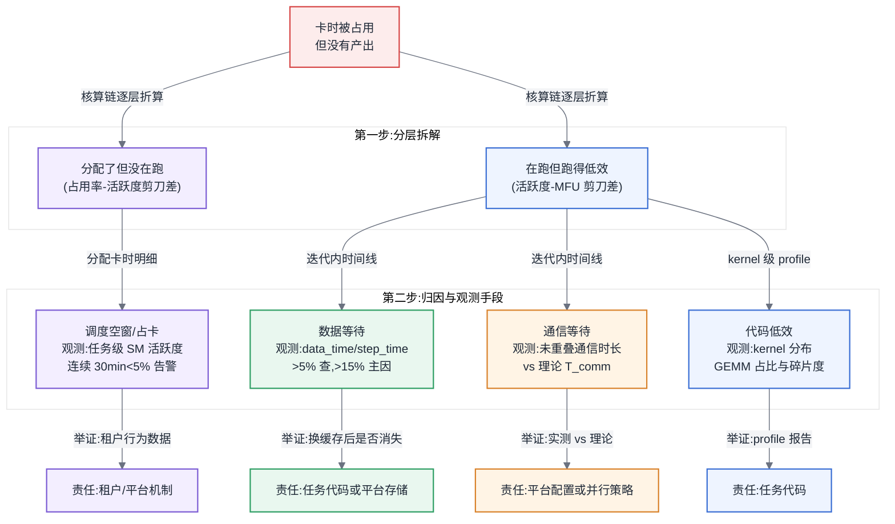
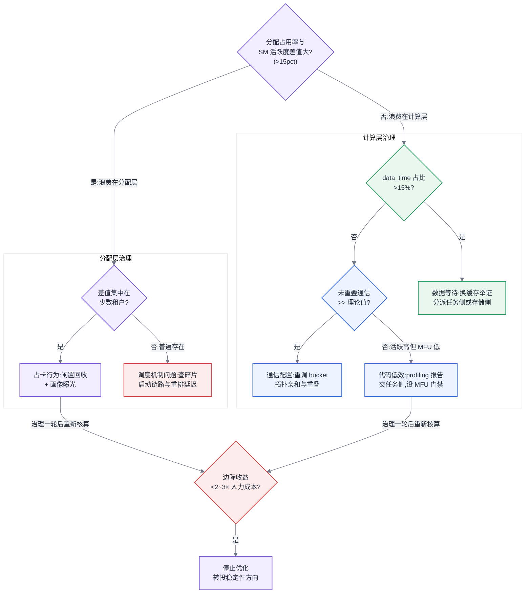

# 第 11 章 多租户与利用率治理

## 11.1 链路定位

本章位于一次训练任务生命周期(主线 A)的**全程横切面**:从任务排队、拿到配额、跑起来、到跑完释放,每一段都在消耗卡时,而本章回答的是这些卡时里有多少真正变成了产出——它是覆盖在第 8~10 章调度机制之上的治理层。

## 11.2 依赖声明

本章建立在两条前置结论之上:第 9 章"队列、配额与抢占是批调度器的基本盘,抢占有代价"——本章的配额模型是它在多租户场景下的展开;以及 [§4.4](../第一部分-基础与心智模型/第04章-硬件第一性原理、架构范式与数值精度.md#44-roofline-模型) 的 Roofline 结论"芯片的理论峰值算力只在算术强度足够时才可达"——本章的 MFU 计算直接以该峰值为分母。归因所需的观测手段,复用 [§5.4](../第一部分-基础与心智模型/第05章-CUDA、CANN与加速器软件栈.md#54-profiling-方法论全书唯一定义处) 定义的 profiling 方法论。

## 11.3 问题场景:一次不敢再汇报第二遍的利用率汇报

某公司 AI 平台负责人在季度经营会上汇报:512 卡训练集群,过去一个季度**分配利用率 85%**,在行业里属于优秀水平。CFO 当场追问了一个问题:"那为什么算法团队还在说卡不够、还要追加采购 256 卡?"

会后他让团队把数字重新拆了一遍,结果让人冒汗。85% 指的是"卡被分配给了某个任务"的时间占比;把 DCGM 的 SM 活跃度数据拉出来,分配出去的卡时里 SM 平均活跃度只有 62%;再抽了三个头部训练任务算 MFU(Model FLOPs Utilization,模型算力利用率),分别是 31%、38% 和 19%。三层折算下来,**集群花出去的钱里,大约只有 30% 变成了有效的模型算力**。更难堪的是,他无法回答下一个问题:损失的 55 个百分点里,多少是平台的问题(调度空窗、存储带宽不足),多少是任务自己的问题(DataLoader 写得差、并行策略不当)?没有归因,就既不能定改进责任方,也不能判断追加采购是不是在给低效代码买单。

这一章要建立的,就是从"报表利用率"到"有效算力"的完整核算链,以及把差距拆到具体原因、具体责任方的举证方法。

## 11.4 原理与量化模型

### 11.4.1 配额模型:静态、弹性、借用与归还

多租户的第一层机制是配额(quota)。三种模型的核心差异在于"闲置资源归谁"。

**静态配额**:每个租户一个固定上限,用不满就空着。设租户 $i$ 的配额为 $Q_i$,实际用量随时间波动为 $U_i(t)$,则集群的分配利用率上界是:

$$\text{Alloc} = \frac{\sum_i \overline{U_i}}{\sum_i Q_i}$$

训练负载天然是脉冲式的(大任务启动、结束、失败重排),单租户 $\overline{U_i}/Q_i$ 通常只有 50%~70%。静态配额把每个租户的波谷都变成集群的空转,这是很多集群分配利用率上不了 80% 的结构性原因。

**弹性配额(借用与归还)**:每个租户有保底(guarantee)和上限(cap),保底之外的闲置资源可被其他租户借用;所有者回来要资源时触发归还。归还的实现只有两种:等借用任务自然结束(归还延迟不可控),或抢占(见第 9 章的抢占代价:被抢占任务损失自上个 checkpoint 以来的全部计算)。设 checkpoint 间隔为 $T_c$,抢占一个 $N$ 卡任务的期望浪费约为 $N \times T_c/2$ 卡时,再加上重新排队和重启的调度开销。**弹性配额的副作用是把利用率问题转化为抢占频率问题**:借出得越激进,归还抢占越频繁,浪费在 checkpoint 回退上的卡时可能吃掉借用带来的收益。判断borrow 是否划算的粗判据:借用任务的期望存活时长应显著大于 $T_c$,否则它大概率在产出第一个 checkpoint 之前就被杀掉,是纯浪费。

**分时配额**:按时段切换配额表(白天推理/开发优先,夜间训练放开),适合负载有明显昼夜规律的场景。它的本质是用可预测性换灵活性,代价是规则维护和跨时区团队的公平性争议。

### 11.4.2 三种利用率指标:占用率、SM 利用率、MFU【本章核心】

利用率治理的第一个陷阱是指标本身。三个都叫"利用率"的数字,统计口径差着两个层级:

**第一层:分配占用率(allocation rate)**。调度器视角:卡被绑定给某个 Pod/Job 的时间占比。它只回答"卡有没有被占着",与卡上有没有计算发生**完全无关**。一个 `sleep infinity` 的调试 Pod 占着 8 卡,占用率是 100%。

**第二层:GPU/SM 利用率**。`nvidia-smi` 报告的 GPU-Util,它的统计口径是:**采样周期内至少有一个 kernel 在任一 SM 上执行的时间占比**。这个定义有两个致命的稀释:其一,只要有一个 kernel 在跑,哪怕它只用了上百个 SM 中的 1 个,这个采样点也计为"忙"——所以一个单线程的小 kernel 循环可以把 GPU-Util 顶到 100%;其二,它不区分 kernel 在做什么,一个等待数据的 busy-wait kernel、一个带宽受限只发挥 5% 算力的访存 kernel,都记为满负荷。DCGM 提供的 SM Activity / SM Occupancy 比 GPU-Util 细一层(统计的是 SM 实际被 warp 占用的比例),但仍然回答不了"这些计算是不是有效计算"。**结论:`nvidia-smi` 的利用率是"忙碌度"指标,不是"产出"指标,只能用于发现空转,不能用于宣称高效。**

**第三层:MFU**。MFU 回答的才是产出问题:

$$\text{MFU} = \frac{\text{模型每步理论所需 FLOPs} \times \text{每秒步数}}{\text{卡数} \times \text{单卡峰值 FLOPS}}$$

分子用模型结构算出的**理论必需**计算量,对 Transformer 训练近似为 $6 \times P \times T$(参数量 $P$,token 数 $T$,前向 2 倍 + 反向 4 倍,见 [§3.3](../第一部分-基础与心智模型/第03章-人工智能与大模型基础.md#33-从-nlp-到-llm) 的 token 口径)。注意两个口径纪律:分子不含激活重算(gradient checkpointing)的重复计算——含重算的版本叫 HFU(Hardware FLOPs Utilization),HFU ≥ MFU,汇报时混用两者是常见的美化手段;分母的峰值必须与实际训练精度一致,用 BF16 训练就除以 BF16 稠密峰值,拿 FP8 或稀疏峰值当分母会把 MFU 砍半甚至更多。2026 年的参考基线:千亿级稠密模型在健康的大规模训练上,MFU 落在 35%~45% 是正常水平,50% 以上是精调过的结果;长期低于 25% 几乎必然存在可归因的浪费。

三层指标的关系可以写成一条核算链:

$$\text{有效算力占比} = \underbrace{\text{分配占用率}}_{\text{调度层}} \times \underbrace{\text{分配卡时中的运行占比}}_{\text{任务生命周期层}} \times \underbrace{\text{MFU}}_{\text{计算层}}$$

问题场景里的 85% × 62% ×(粗略地)~55% ≈ 30%,每一层的损耗都有各自的责任方——这正是下一节归因的骨架。

```mermaid
%%{init: {'theme':'base','themeVariables':{
  'primaryColor':'#EEF4FF','primaryBorderColor':'#3B6FD4','primaryTextColor':'#1F2937',
  'secondaryColor':'#F3F4F6','tertiaryColor':'#FFFFFF',
  'lineColor':'#6B7280','fontFamily':'-apple-system, Segoe UI, Helvetica, Arial, sans-serif','fontSize':'14px'
}}}%%
gantt
    dateFormat X
    axisFormat %s
    title 同一次训练迭代,三种指标各自统计到什么
    section 实际发生的事
    数据等待(GPU 空转)        :crit, 0, 3
    前向与反向计算              :active, 3, 8
    未重叠的通信等待            :crit, 8, 10
    优化器更新                  :active, 10, 11
    迭代间空隙与日志            :crit, 11, 12
    section 占用率口径
    卡被分配即计数(全程 100%) :0, 12
    section SM 利用率口径
    有 kernel 在跑就计数        :3, 11
    section MFU 口径
    只有理论必需 FLOPs 计数     :3, 8
```

图 11-1:三种利用率指标的统计口径对比。同一段卡时,占用率看到 100%、SM 利用率看到约 65%、MFU 只承认真正做了有效计算的部分——三个数字都"对",但只有 MFU 能回答花的钱换来了什么。

### 11.4.3 利用率归因:四类原因的可操作识别法

MFU 与 100% 之间的差距,扣除硬件物理上限(访存受限算子、kernel 启动开销等,这部分由 Roofline 决定,不可归因为"浪费")之后,剩余部分可以拆成四类,每类有明确的观测信号与判定阈值思路:

**第一类:数据等待。** GPU 在等 DataLoader / 存储。观测信号:profiler 时间线上迭代之间出现规律性空白;DCGM SM 活跃度呈周期性锯齿;更轻量的方法是在训练代码里埋 `data_time / step_time` 比值。**判定阈值思路:data_time 占 step_time 超过 5% 即值得查,超过 15% 必然是主要矛盾。** 责任归属要再拆一层:如果加大 DataLoader worker 数或换本地缓存后消失,是任务侧代码问题;如果所有租户在同一存储集群上同时恶化,是平台侧存储带宽问题——这一条区分就是 [§0.9](../ai-infra-book-outline.md#09-角色与协作边界索引-v10-新增) 所说的归因举证:**没有这条举证链,每次利用率争议都会变成算法团队说"你们存储慢"、平台团队说"你们代码烂"的罗生门,而真空地带没人修。**

**第二类:通信等待。** 计算流在等集合通信完成且未能重叠。观测信号:profiler 中 NCCL/HCCL kernel 独占时间线(与计算流无重叠段);网络计数器显示突发满带宽后长时间静默。判定思路:用第 7 章的方法估算该并行策略的理论通信时间 $T_{comm}$,若 profiler 实测的未重叠通信时间显著大于 $T_{comm}$,说明是配置问题(bucket 大小、拓扑不亲和、跨域通信),归平台与任务共同排查;若与理论值接近,说明并行策略本身通信占比过高,是任务侧并行方案的选择问题。

**第三类:调度空窗。** 卡时被分配了但没有任务在跑,或任务在跑但不在训练:排队后的资源碎片等待(Gang Scheduling 凑不齐)、任务启动时的镜像拉取与 checkpoint 加载、失败后到重启之间的间隔、以及最隐蔽的——**占卡开发**(占着 8 卡的 Jupyter,一天真正跑计算 1 小时)。观测信号:分配占用率与 SM 活跃度的差值,按任务/租户维度分解。**判定阈值思路:一个"运行中"任务若连续 30 分钟 SM 活跃度低于 5%,标记为疑似空转;一个租户的分配-活跃差值长期高于集群均值 15 个百分点以上,进入治理名单。** 这一类几乎全是平台侧机制问题(碎片、启动链路)加租户行为问题(占卡),与代码质量无关。

**第四类:代码低效。** GPU 在忙,但忙得低效:未用融合算子、精度配置不当没走上 Tensor Core、micro-batch 太小导致 kernel 太碎、并行切分产生大量小算子。观测信号:SM 活跃度高(>80%)但 MFU 低(<25%),两者的剪刀差就是代码低效的指纹;进一步用 [§5.4](../第一部分-基础与心智模型/第05章-CUDA、CANN与加速器软件栈.md#54-profiling-方法论全书唯一定义处) 的 profiling 方法看 kernel 分布,若时间大头落在非 GEMM 的碎小 kernel 上即可确认。这一类责任明确在任务侧,平台的义务是提供 profiling 工具与基线参考,越过这条线替业务改训练代码,平台会背上无限运维责任。

四类原因的典型占比(多个大型集群的经验分布,非定律):调度空窗与占卡行为通常是最大头,占总浪费的 30%~40%;数据等待 20%~30%;代码低效 20%~30%;真正的通信配置问题反而常常不足 15%——**直觉会让人先去调通信,数据会让你先去抓占卡,治理要跟着数据走。**

图 11-2:利用率归因树。先用两个剪刀差把浪费分层,再用四条可操作的观测信号定位原因——归因的终点不是找到原因,而是拿着数据完成责任举证。

### 11.4.4 治理手段与边际收益递减

识别之后是治理。三类手段按组织成本从低到高排列:**任务画像**(给每个任务自动打上 MFU、数据等待占比、空转时长标签,定期出租户级报表)——技术成本低,组织成本几乎为零,但只曝光不强制,依赖租户自觉;**闲置回收**(空转超阈值自动回收,开发机夜间释放)——需要申诉通道和白名单机制,第一个月必然有"我马上要用就被回收了"的冲突,组织成本中等;**超卖**(按画像数据把长期用不满的配额超额分配)——收益最高,但需要完整的抢占与优先级体系兜底,且一旦兜底失败(高优任务拿不到自己的保底配额),平台信用的损失远大于超卖赚回的卡时。

治理指标本身也值得加一项:**每有效 token 能耗**——分子取 PDU 或机柜电表的实际用电量(拿不到时用 TDP×利用率估算,但必须标注口径),分母取任务实际产出的有效 token 数。它与 MFU 正交:MFU 回答"分到的算力用出了几成",每有效 token 能耗回答"每份产出烧了多少电"。两者合看能暴露 MFU 单独看不见的浪费——闲置的卡不进 MFU 统计,但空闲功耗照常计电;而一个占用率高、MFU 低的任务是双重浪费:既占着别人用不上的卡,又在为低效计算持续付电费。本章的核算链与归因举证体系可以原样承载这个指标,不必另建体系;功能单位与系统边界的完整口径(为什么"每有效 token"这个分母必须写清边界)见第 31 章「从电费到碳账:功能单位与系统边界」——那里会说明,同一个指标既是成本账也是碳账,利用率治理的每一分收益都同时记在两本账上。

最后是那个常被忽略的问题:**什么时候该停。** 利用率优化是典型的边际收益递减曲线:从 30% 提到 50%,靠的是抓占卡、修 DataLoader、调重叠,每人月投入能换回可观卡时;从 50% 提到 60%,开始要动并行策略和定制 kernel;再往上,每个百分点都要资深工程师以月计的投入。判停的算式很直接:设工程师人月成本 $C_{eng}$,优化预期收回的卡时市值为 $\Delta U \times C_{gpu\text{-}hour} \times H$($H$ 为该优化可持续生效的卡时总量)。**当一个优化项的预期收回市值低于投入人力成本的 2~3 倍时(留出估计误差的余量),就该停下**,把人力转投到故障恢复速度、checkpoint 效率这些同样烧钱但尚未递减的方向。追求利用率数字本身还有一个反噬:接近满载的集群没有弹性余量,一次故障重排就会引发排队雪崩——85% 的分配占用率配上健康的 MFU,好于 98% 的占用率配上僵化的队列。

所以这对做平台的人意味着什么:你的核心资产不是某个优化技巧,而是这条**核算链加归因举证体系**。有了它,利用率从一个被动挨问的数字,变成一张可以主动分配责任、排列优先级、并且知道何时收手的作战地图。

## 11.5 方案对比:三种治理路线的失效边界

**路线一:曝光驱动(画像 + 排行榜 + 账单)。** 只测量、只公示,不强制。适合租户少、工程文化强的组织,通常能在一个季度内消灭最离谱的浪费(占卡、忘停的任务)。**失效边界:当浪费的主因是代码低效时失效**——排行榜能羞辱出行为改变,羞辱不出并行策略重构;当租户之间有预算墙(各自付费)时也失效,因为"我浪费我自己的钱"在组织上无解,只能靠公司级算力委员会介入。

**路线二:机制驱动(弹性配额 + 闲置回收 + 超卖)。** 用调度机制自动回收浪费,不依赖人的自觉。适合租户多、负载波动大的平台。**失效边界:抢占成本高于回收收益时失效**——当集群上主要是千卡级、checkpoint 间隔长的大任务时,一次归还抢占浪费的卡时可能超过借用期的全部产出(见 11.4.1 的判据);此外,当监控无法区分"低 SM 活跃度的合法任务"(如强化学习中等待环境采样的阶段)时,自动回收会误杀,每次误杀都在消耗平台信用,误杀率超过个位数百分比时租户会开始用伪造负载对抗回收,治理进入军备竞赛。

**路线三:准入驱动(上线前 MFU 门禁)。** 任务要上大集群,先在小规模跑出 MFU 基线,低于门槛(例如同类模型参考值的 70%)不放行,附 profiling 报告帮助整改。从源头杜绝低效任务,长期收益最高。**失效边界:紧急需求与探索性负载面前失效**——模型结构快速迭代期,每个新结构的第一次训练本来就没有参考基线,门禁会把平台变成创新的审批瓶颈;门槛值本身也需要持续维护,硬件换代后旧门槛作废,没人维护门槛表的组织里,门禁半年后就会名存实亡或被普遍豁免。

实践里成熟平台是三条路线的叠加:曝光永远在跑,机制覆盖行为性浪费,准入只卡最大规模的任务。所以这对做平台的人意味着什么:选路线的依据不是技术先进性,而是你的组织能承担哪种冲突——曝光的冲突是面子,机制的冲突是误杀,准入的冲突是效率,三种冲突你总得选一种去消化。

## 11.6 大数据对照

资源利用率治理不是 AI 时代的新问题,YARN/Mesos 时代的经验有相当一部分可以直接搬:**弹性配额的整套设计**——YARN Capacity Scheduler 的 capacity/maximum-capacity 就是保底与上限,抢占归还、队列层级、用户内公平份额,概念到参数几乎一一对应,设计弹性配额时把当年的队列设计文档翻出来能少走一半弯路;**曝光与账单文化**——Hadoop 集群靠 chargeback 报表治理小文件与倾斜任务的经验原样适用;**混部与分时**——白天在线、夜间批处理的分时错峰,正是今天训推混部的前身。

但有三条在 AI 场景下失效,且失效原因值得记住。**其一,细粒度弹性失效。** MapReduce/Spark 的任务由成千上万个独立的小 task 组成,回收资源只需等几个 task 结束,归还延迟以秒计;训练任务是一个 Gang 整体,要么全拿要么全无,回收的最小单位从一个 container 变成整个任务加一次 checkpoint 回退,**弹性配额的摩擦成本高了两个数量级**,这就是为什么 Hadoop 时代激进超卖是常态,而训练集群超卖必须保守。**其二,CPU 利用率的观测直觉失效。** CPU 时代 top 里的 CPU% 与实际产出大体成正比,运维据此形成的"利用率高=健康"直觉,在 GPU-Util 上完全不成立(11.4.2 的稀释效应)——把 Hadoop 监控大盘的思路平移过来,得到的就是问题场景里那份 85% 的误导性报表。**其三,推测执行类兜底失效。** Hadoop 用 speculative execution 对冲慢节点,靠的是 task 幂等可重跑;同步训练里最慢的一张卡直接决定全局步速(straggler 问题),不能靠再起一份对冲,只能靠第 20 章的故障隔离与慢节点检测。**判断一条大数据经验能否搬过来的通用标准:它是否依赖"负载可细粒度拆分、任务间无同步"这两个前提——依赖,就要重新设计;不依赖,直接搬。**

所以这对做平台的人意味着什么:你在 YARN 上练出来的队列设计与账单治理能力是真资产,直接复用;需要重建的是观测层(从"忙碌度"换到 MFU)和弹性机制的成本模型(从秒级归还换到 checkpoint 回退)。

## 11.7 选型决策树

图 11-3:低利用率归类与治理手段选型决策树。先分层再归因、每治理一轮就重新核算一次边际收益——"什么时候停"是这棵树上和"用什么手段"同样重要的出口。

走法示例:回到 11.3 的问题场景——占用率 85% 对 SM 活跃度 62%,差值 23 个百分点走左枝,按租户分解发现集中在两个算法组的开发机,先上闲置回收;计算层 MFU 19% 的那个任务 data_time 占 22%,换本地缓存后降到 3%,举证为任务侧 DataLoader 问题,转给业务方。两轮治理后有效算力从 30% 提到 47%,第三轮候选项预期收益已低于人力成本 2 倍,停,追加采购的答复也随之有了依据:先不买。

---

**读完本章,你应当能**:为一个多租户训练集群建立"分配占用率 × 运行占比 × MFU"的三层核算链,算出真实有效算力;用四类观测信号(data_time 占比、未重叠通信时长、任务级 SM 活跃度、活跃度-MFU 剪刀差)把低利用率归因到具体原因并完成平台/任务的责任举证;为你的组织选出可承受冲突类型的治理路线,并用边际收益算式判断优化该在什么时候停。
