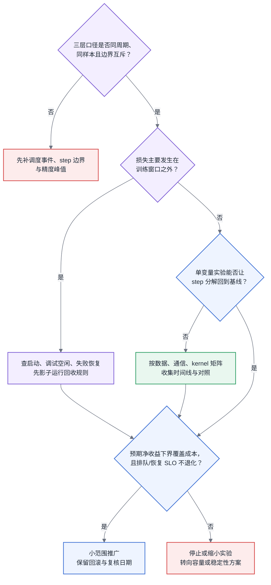

# 第 11 章 多租户与利用率治理

<ChapterContext
  track="主线 A 从排队、分配、启动、训练到释放的全生命周期"
  question="GPU 看起来很忙时，如何核算真正的模型产出，并用可复现实验决定先改平台、数据、通信还是训练代码？"
  upstream="第 4 章 Roofline；第 5 章 profiling；第 6 章 FLOPs 口径；第 8～10 章调度、队列与配额"
  downstream="第 20 章慢节点与恢复；第 29 章训练监控；第 31 章能耗与碳账"
  inputs="调度器卡时、作业生命周期事件、step 吞吐、模型 FLOPs、设备活动计数器、profiler 时间线与功率积分"
  outputs="三层利用率账、归因证据单、治理实验、SLO 风险边界与复核条件"
/>

## 11.1 先把同名的“利用率”拆开

分配占用率、GPU/SM 活跃度和 MFU 都会出现在利用率报表里，却回答三个不同问题：资源是否被绑定、设备是否在执行、理论必需的模型计算完成了多少。把三者混成一个数字，会让容量采购、代码优化和调度治理争夺同一份责任。

本章沿着互斥的时间边界核算：先从集群总卡时取出已分配卡时，再从作业生命周期中取出有有效训练 step 的窗口，最后只在该窗口内计算 MFU。SM Activity 等设备计数器留在归因层，不能再乘一次。模型 FLOPs 与峰值精度沿用 [§6.2](../第一部分-基础与心智模型/第06章-模型结构的定量分析.md#62-参数量与资源换算核心)，瓶颈判断沿用 [§4.4](../第一部分-基础与心智模型/第04章-硬件第一性原理、架构范式与数值精度.md#44-roofline-模型)，kernel 证据沿用 [§5.4](../第一部分-基础与心智模型/第05章-CUDA、CANN与加速器软件栈.md#54-profiling-方法论全书唯一定义处)。

## 11.2 一份 85% 占用率报表还缺什么

<CaseMeta
  type="capacity-example"
  data-nature="卡数与三层比例均为演示核算边界的合成输入，不代表生产集群、行业基准或治理收益"
  scope="512 卡训练池，一个完整统计周期内的集群有效模型 FLOPs 核算"
  assumptions="分配占用率 85%；已分配卡时中可匹配有效训练 step 的窗口占 62%；窗口内 MFU 40%；三层样本、精度和时间边界一致"
  reproducible="visuals/data/ch11-utilization-funnel.csv；§11.3.2"
/>

合成报表显示 512 卡训练池的分配占用率为 85%。作业事件进一步表明，已分配卡时中只有 62% 能匹配到有效训练 step；其余时间落在镜像与 checkpoint 加载、调试空闲、失败后等待重启等生命周期阶段。训练窗口内按相同精度峰值计算的 MFU 为 40%，于是全池有效模型 FLOPs 占理论峰值的比例为：

$$85\% \times 62\% \times 40\% = 21.08\%$$

这个结果不能由“GPU-Util 多少”替代。活动计数器用于解释训练窗口为什么缩短、step 为什么变慢；若把 62% 当作 SM Activity 再乘 MFU，就会把 step 内已经进入 MFU 分母的数据等待和通信等待重复扣减。

<BookFigure
  id="ch11-utilization-funnel"
  src="../visuals/generated/ch11/utilization-funnel.svg"
  alt="集群理论峰值从百分之一百依次经过百分之八十五分配占用率、百分之六十二训练窗口比例和百分之四十窗口内 MFU，得到百分之二十一点一有效模型 FLOPs"
  title="图 11-1  三个互斥边界组成有效产出漏斗"
  caption="活动计数器是归因信号，不是核算链中的第四个乘数；只有时间边界互斥、样本范围一致时才可连乘。"
  source="容量示例；visuals/data/ch11-utilization-funnel.csv"
  license="CC BY 4.0"
  width="wide"
/>

<EvidencePanel
  title="85% 只证明资源被绑定"
  conclusion="采购判断前至少补齐作业生命周期事件、有效 step 窗口、窗口内 MFU、等待队列和失败恢复卡时；否则既无法证明容量不足，也无法证明任务低效。"
  source="capacity-example；§11.3.2～§11.3.4"
>

- 已知：集群规模、统计周期和分配卡时。
- 必须补采：作业状态转换、首个与最后一个有效 step、训练吞吐、精度峰值、重启与 checkpoint 时间。
- 暂不能定责：调度碎片、租户占卡、数据等待、通信等待、算子效率和故障恢复。

</EvidencePanel>

## 11.3 原理与量化模型

### 11.3.1 配额模型:静态、弹性、借用与归还

配额首先定义“谁在什么条件下可以占多少资源”，而不是承诺某个利用率结果。

静态配额给租户固定上限。设租户 $i$ 的配额为 $Q_i$，实际用量为 $U_i(t)$，则配额池内的分配占用率为：

$$\text{Alloc}_{quota}=\frac{\sum_i\int U_i(t)dt}{\int\sum_iQ_i(t)dt}$$

这个比值受负载到达分布、作业规模、Gang Scheduling 碎片和维护窗口共同影响，不能用统一百分比推断静态配额是否失效。应先画出租户到达率与用量分位数，再决定保底、上限和闲置资源是否可借。

弹性配额为租户设置保底和上限，允许借用保底之外的空闲资源。所有者返回时，可以等待借用任务结束，也可以抢占。若假设抢占在 checkpoint 间隔 $T_c$ 内均匀发生，且只计算回退、不计算排队、加载与恢复，则一个 $N$ 卡任务的期望回退卡时为：

$$E[W_{rollback}]=N\times\frac{T_c}{2}$$

实际决策还要加入 checkpoint 写入、重启、数据恢复、拓扑重排和失败概率。借用收益应按“预计完成的有效工作”比较“抢占与恢复的期望损失”，而不是只比较存活时间与 checkpoint 间隔。分时配额则用可预测的时段规则换取灵活性；它适用于画像有稳定周期的负载，跨时区团队与突发任务需要单独的覆盖规则。

### 11.3.2 三种利用率指标:占用率、SM 利用率、MFU【本章核心】

第一层是分配占用率：

$$\text{Allocation}=\frac{\text{已分配 GPU-hours}}{\text{可服务 GPU-hours}}$$

分母要明确是否扣除维护、故障和保留容量。它只回答卡是否被调度器绑定；一个没有训练 step 的调试容器也会被计入。

第二层是活动信号。NVIDIA 对 `nvidia-smi` GPU utilization 的定义是：采样周期内一个或多个 kernel 在 GPU 上执行的时间比例。DCGM 的 SM Activity 则是至少一个 warp 在某个 SM 上活跃的时间比例，再对全部 SM 求平均；SM Occupancy 是驻留 warp 相对最大可驻留 warp 的比例。三者都不是模型产出，且高活动值本身不能区分计算受限、访存受限或无效工作。定义分别见 [NVIDIA System Management Interface 文档](https://docs.nvidia.com/deploy/nvidia-smi/index.html) 与 [DCGM Profiling 指标说明](https://docs.nvidia.com/datacenter/dcgm/latest/learn/modules/profiling.html)。

第三层是训练窗口内 MFU：

$$\text{MFU}_{window}=\frac{F_{model/step}\times\text{steps/s}}{N_{gpu}\times F_{peak/card}}$$

对标准稠密 Transformer，$F_{model/step}$ 可由 $6ND$ 近似分摊到 step；MoE 使用实际激活参数量并补注意力、路由和共享层，长上下文与非 Transformer 结构应回到算子或模型结构账本。分母必须选择实际执行路径对应的稠密峰值和精度。激活重计算产生的额外硬件工作不进入模型必需 FLOPs；工具若报告 HFU 或吞吐效率，必须保留各自定义，不能只凭名称换算。

在时间边界互斥时，全池有效模型 FLOPs 占比才可写为：

$$\text{Fleet Effective FLOPs}=\text{Allocation}\times\text{Training-window share}\times\text{MFU}_{window}$$

其中 Training-window share 来自作业事件与有效 step 边界，不来自设备活跃度。不同模型、序列形状、卡型、精度、并行度和规模不能共用一个 MFU 门槛；基线应来自同类任务的稳定版本或目标任务的受控小规模实验。

```mermaid
%%{init: {'theme':'base','themeVariables':{
  'primaryColor':'#EEF4FF','primaryBorderColor':'#3B6FD4','primaryTextColor':'#1F2937',
  'secondaryColor':'#F3F4F6','tertiaryColor':'#FFFFFF',
  'lineColor':'#6B7280','fontFamily':'-apple-system, Segoe UI, Helvetica, Arial, sans-serif','fontSize':'14px'
}}}%%
gantt
    dateFormat X
    axisFormat %s
    title 同一次训练迭代，不同指标观察不同边界
    section 实际阶段
    数据等待                    :crit, 0, 3
    前向与反向                  :active, 3, 8
    未重叠通信等待              :crit, 8, 10
    优化器更新                  :active, 10, 11
    迭代间日志                  :crit, 11, 12
    section 分配口径
    卡被绑定即计数              :0, 12
    section 活动口径
    kernel 或 warp 活动采样     :3, 11
    section MFU 分子
    模型理论必需 FLOPs          :3, 8
```

图 11-2:同一段卡时可同时有 100% 分配占用、间歇设备活动和更低的模型有效计算；时间线用于理解口径，不提供固定换算比例。

### 11.3.3 利用率归因:四类原因的可操作识别法

归因从基线差异开始，不从全局固定阈值开始。先为同一模型、数据版本、序列形状、并行配置和规模建立健康运行基线，再改变一个因素，观察 step 时间分解与吞吐是否恢复。

生命周期空窗发生在训练 step 之外，包括镜像与 checkpoint 加载、调试空闲、失败后等待重启和任务结束后延迟释放。主要证据是调度事件、容器状态、首末 step 时间和心跳；SM Activity 只能佐证设备安静，不能区分合法等待与浪费。自动回收前应先影子告警，记录若执行回收会中断哪些工作，再由租户声明强化学习采样、人工调试等合法低活动阶段。

数据等待表现为 step 时间线中的输入空白、`data_time/step_time` 相对基线升高，或存储延迟与多个任务同步恶化。受控实验可以固定 batch 和模型，把远端数据换为本地缓存，或只改变 worker/prefetch；若单任务调整恢复，继续查任务数据管道，若多个租户随共享存储变化，再查平台容量和热点。

通信等待看 profiler 中未与计算重叠的集合通信段，并与 [第 7 章](../第一部分-基础与心智模型/第07章-互联与集合通信.md) 的目标拓扑模型、消息大小和基线 trace 对照。固定模型与 batch，改变放置域、bucket 或重叠策略，才能区分拓扑/配置问题与并行切分本身的代价。

kernel 效率问题需要同时看 MFU、算子形状、Tensor Core 路径、kernel 分布和 Roofline 位置。高 SM Activity 与低 MFU 只是一条线索：访存受限算子、重计算、数据布局转换和大量小 kernel 都可能产生这种组合。固定数据与并行规模，对精度、融合、micro-batch 或编译配置做单变量对照，才允许把行动项交给训练代码或运行时负责人。

<BookFigure
  id="ch11-attribution-matrix"
  src="../visuals/generated/ch11/attribution-matrix.svg"
  alt="生命周期空窗、数据等待、通信等待和 kernel 低效四行分别对应主证据、受控实验和满足何种证据后才能移交责任"
  title="图 11-3  归因必须经过受控实验"
  caption="活动指标只能提出假设；作业事件、时间线与单变量对照共同指向下一位负责人。"
  source="编辑诊断矩阵；visuals/data/ch11-attribution-matrix.csv"
  license="CC BY 4.0"
  width="wide"
/>

### 11.3.4 治理手段与边际收益递减

任务画像先建立共同事实：每个任务保留分配卡时、训练窗口、吞吐、MFU、数据与通信等待、失败恢复和能耗边界。闲置回收比曝光更强，必须带影子模式、通知、宽限期、白名单、申诉和一键恢复。弹性借用与超卖还要证明高优任务能在 SLO 内拿回保底，并把抢占回退、恢复失败和队列波动计入收益。

利用率目标不能脱离排队与恢复余量。提高分配占用率可能缩短空闲卡时间，却也可能增加 Gang 作业的凑卡延迟，并在故障重排时没有可用替补。下图只演示权衡方向；每个点都需要用本集群的到达过程、作业规模、故障率和恢复 SLO 重算。

<BookFigure
  id="ch11-risk-frontier"
  src="../visuals/generated/ch11/risk-frontier.svg"
  alt="随着分配占用率目标从百分之六十提高到百分之九十五，合成队列延迟指数上升，恢复余量下降，说明单独最大化占用率会侵蚀服务目标"
  title="图 11-4  占用率目标必须和排队、恢复余量一起选"
  caption="示意曲线只表达风险方向；生产阈值由到达率、作业规模、故障模型与 SLO 联合确定。"
  source="合成风险曲线；visuals/data/ch11-risk-frontier.csv"
  license="CC BY 4.0"
  width="wide"
/>

每有效 token 能耗的分子应来自设备、PDU 或机柜功率随时间积分，并写明是否包含 CPU、网络、存储、冷却和空闲分摊；`TDP × utilization` 既不是实际功率，也没有完整系统边界。分母要定义训练 token、有效样本还是达到目标质量所需 token，详细口径见第 31 章。

治理项目的判停条件是期望净收益与风险，不是固定倍数。设预计收回卡时为 $\Delta H$、单位卡时机会成本为 $C_{gpu-hour}$，则收益初筛为 $\Delta H\times C_{gpu-hour}$；还要扣除工程成本、额外重跑和 SLO 风险，并对收益置信区间做敏感性分析。若下界不能覆盖成本，或改进会破坏排队与恢复 SLO，应缩小实验或停止推广。

## 11.4 方案对比:三种治理路线的失效边界

| 路线 | 适用入口 | 必要护栏 | 失效边界 |
|---|---|---|---|
| 曝光驱动：画像、预算与账单 | 指标口径尚未统一，需要先形成共同事实 | 同类任务分组、数据范围和误差说明 | 主因需要代码或架构改造，而租户没有行动能力；账单与决策权分离 |
| 机制驱动：弹性配额、回收与借用 | 生命周期空窗已被事件证据确认 | 影子模式、宽限期、白名单、恢复演练和保底 SLO | 合法低活动阶段无法识别；抢占与恢复损失超过预计回收收益 |
| 准入驱动：规模升级前基线 | 大规模重复训练已有可比的小规模或稳定版本 | 同模型与同硬件基线、例外时限、门槛版本化 | 探索性结构没有可比基线；硬件或软件升级使旧门槛失真 |

三条路线可以叠加，但顺序应由证据成熟度决定：先让指标可复核，再影子运行机制，最后只对有稳定基线和高机会成本的任务设置准入。路线不是成熟度排行榜；组织应明确谁有权设门槛、谁承担误杀与延期、多久复核一次。

## 11.5 大数据对照

大数据平台留下了可复用的治理方法：队列层级、保底与上限、借用归还、账单、优先级和分时策略。但训练负载改变了资源语义。Gang 作业常要求多卡同时可用；同步 step 受最慢 rank 限制；抢占恢复依赖 checkpoint 完整性与加载路径；GPU 活动也不能直接代表模型产出。

因此，迁移时逐项检查旧机制依赖的前提。若机制依赖任务可细粒度拆分、独立重试或秒级归还，就必须为训练作业重新建立回退与恢复成本；若机制只依赖公平份额、预算归属和可审计事件，则可保留治理框架，再替换资源单位与 SLO。慢节点与训练恢复的证据链在第 20 章展开。

## 11.6 选型决策树

图 11-5:治理选择从口径审计开始，以可复现实验和 SLO 复核结束；树中不嵌入跨集群通用阈值。

---

<ChapterDeliverables :items="[
  '按同一统计周期建立分配占用率、有效训练窗口比例与窗口内 MFU 三层账，并记录分母是否扣除维护和故障',
  '将 GPU-Util、SM Activity、SM Occupancy 留作归因信号，不与 MFU 重复相乘',
  '为生命周期空窗、数据等待、通信等待和 kernel 效率分别保存主证据与单变量实验结果',
  '在自动回收、借用或准入前运行影子策略，并验证宽限、白名单、恢复和高优任务保底 SLO',
  '用卡时收益、工程成本、重跑风险、排队 SLO 与恢复余量共同决定推广或停止'
]" />
