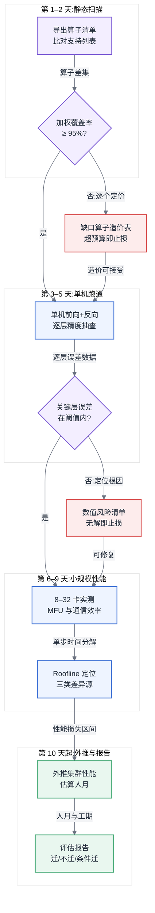
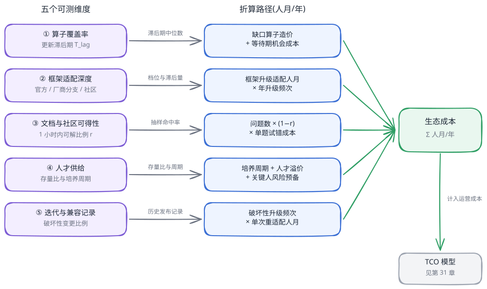
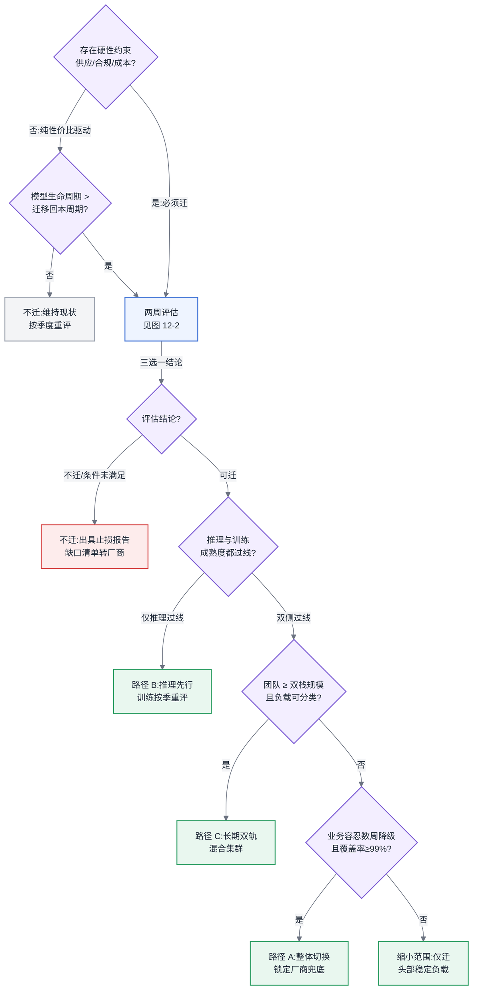

# 第 12 章 国产算力平台与异构迁移

## 链路定位

本章位于主线 A(一次训练任务的生命周期)与主线 B(一次推理请求的全链路)的最底层交汇处——算力供给层:当"这批负载跑在什么卡上"从技术默认项变成必须论证的决策项时,训练与推理两条链路上的每一段都会被重新定价。

## 依赖声明

本章建立在三条前置结论之上:[§4.2.1](../第一部分-基础与心智模型/第04章-硬件第一性原理、架构范式与数值精度.md#421-四类范式真正的差异在编译器) 确立的"架构范式差异由编译器与软件栈承担,而不是由用户代码承担";第 5 章给出的昇腾软件栈技术对照(本章不再重复技术栈细节,一律引用);以及 [§4.4](../第一部分-基础与心智模型/第04章-硬件第一性原理、架构范式与数值精度.md#44-roofline-模型) 的 Roofline 瓶颈判定方法——没有它,本章的性能对标口径无从谈起。

## 问题场景:三个月跑通,九个月才能用

一个真实项目的时间线。某厂商 32B 模型的持续预训练与微调业务,因采购约束需要从 NVIDIA 集群迁到某国产平台。团队评估时的判断是:"主流架构,框架官方支持,一个季度搞定。"

前三个月确实顺利得超出预期:第 6 周单机八卡跑通前向,第 11 周 256 卡集群 loss 曲线与原平台肉眼重合,第 13 周汇报"迁移完成"。庆功之后,平台负责人看了一眼监控:同等规模下,训练吞吐只有原集群的 41%,MFU(Model FLOPs Utilization,模型算力利用率)从 46% 掉到 19%。按这个效率,"省下的采购差价"要用 2.4 倍的卡数和电费还回去。

接下来的六个月才是迁移的主体:profiling 发现三个高频融合算子在新平台被拆成十一个小算子,内存搬运占了单步时间的 30%;集合通信参数沿用原平台配置,在新互联拓扑上跑出了 55% 的带宽利用率;数据加载流水线的重叠策略完全失效。逐项修复后,第 9 个月 MFU 爬到 34%,业务方勉强验收。团队负责人复盘时说的那句话,就是本章要展开的全部内容:**"跑通只是迁移的开始,我们当时把终点线画在了起跑线上。"**

这个故事里没有任何一步是低级错误。它暴露的是方法论缺失:评估阶段没有量化口径,迁移阶段没有分坎验收,对标阶段没有诚实基线。本章依次补上这三块。

## 原理与量化模型

### 12.1 国产算力版图:定位差异与成熟度不对称

按本书纪律,这里不讲任何硬件参数(参数进附录并标注日期),只讲定位——因为定位决定生态投入方向,而生态才是迁移成本的主变量([§12.7](#127-生态作为选型变量全书唯一定义处))。

国产算力平台可以按两个轴粗分定位:**软件栈自建深度**与**主攻负载类型**。

- 一类平台选择自建全栈:自有架构、自有编译器、自有并行框架与通信库,对标的是 CUDA 生态的完整替代。这条路线前期迁移摩擦最大,但生态一旦成型,厂商对性能问题的兜底能力最强——问题出在栈的哪一层,它都有人能改。昇腾是这条路线的代表(技术栈分层见第 5 章,此处不重复)。
- 一类平台选择兼容路线:指令集或编程模型上尽量贴近 CUDA 习惯,降低迁移的第一道门槛。代价是永远在追随者位置上,上游生态每次大版本演进都要重新对齐,兼容层的性能折损与行为差异成为长尾成本。海光 DCU 生态大体属于这一路线。
- 还有一类平台聚焦特定负载:以推理或特定行业场景为主攻方向,不追求训练侧全覆盖。寒武纪、燧原等平台在不同时期的重心即在此类取舍之间移动。

对做平台的人,记路线比记厂商名字有用:**厂商会变,路线的成本结构不会变**。自建路线的成本在前期人力,兼容路线的成本在长期追随,聚焦路线的成本在负载边界——业务一旦越出它聚焦的负载类型,成熟度断崖式下降。

**训练与推理的成熟度不对称**是版图上最重要的一条结构性事实:几乎所有平台,推理成熟度都显著领先训练。原因可以从工程上拆开:

1. **算子面不同**。推理只需要前向算子;训练还需要反向算子、优化器算子,算子总量约为推理的 2–3 倍,且反向算子的数值行为更难对齐(混合精度下梯度的动态范围问题,见 [§4.3](../第一部分-基础与心智模型/第04章-硬件第一性原理、架构范式与数值精度.md#43-数值格式与精度全书唯一定义处))。
2. **容错要求不同**。推理请求失败重试即可,单次损失以毫秒计;训练一次中断损失的是从上个 checkpoint 以来的全部算力,平台的稳定性缺陷在训练侧被千倍放大。
3. **规模耦合不同**。推理可以单机甚至单卡部署,把集群问题拆成 N 个独立小问题;训练是全集群同步作业,通信库、调度器、拓扑感知任何一环不成熟都直接压垮整体效率(见第 7、8 章)。
4. **验收周期不同**。推理精度对齐做一轮评测集比对即可;训练要跑完完整收敛曲线才能确认没有隐性数值问题,一轮验证以周计。

所以这对做平台的人意味着什么:**评估任何国产平台,必须把训练与推理当作两个独立评估对象**,拿到的任何"成熟度"结论都要先问一句"这说的是推理还是训练"。推理先迁、训练后迁不是保守,是对上述四条工程事实的正确响应。

### 12.2 迁移的三道坎

一次迁移在工程上必然依次通过三道坎。它们不是并列的检查项,而是串行的关卡——上一道没过,下一道无从谈起;而且**耗时与难度沿关卡递增**。

```mermaid
%%{init: {'theme':'base','themeVariables':{
  'primaryColor':'#EEF4FF','primaryBorderColor':'#3B6FD4','primaryTextColor':'#1F2937',
  'secondaryColor':'#F3F4F6','tertiaryColor':'#FFFFFF',
  'lineColor':'#6B7280','fontFamily':'-apple-system, Segoe UI, Helvetica, Arial, sans-serif','fontSize':'14px'
}}}%%
flowchart LR
  classDef compute fill:#EEF4FF,stroke:#3B6FD4,stroke-width:1.5px,color:#1F2937
  classDef ctrl fill:#F3EEFF,stroke:#7C5CD4,stroke-width:1.5px,color:#1F2937
  classDef bottleneck fill:#FDECEC,stroke:#D64545,stroke-width:1.5px,color:#1F2937
  classDef ext fill:#F3F4F6,stroke:#9CA3AF,stroke-width:1.5px,color:#1F2937

  S[原平台模型<br/>与训练代码]:::ext
  subgraph G1[第一道:算子覆盖 · 典型耗时约15%]
    A1[算子清单扫描]:::ctrl
    A2[缺失算子处置<br/>等待/替换/自研]:::compute
  end
  subgraph G2[第二道:精度对齐 · 典型耗时约25%]
    B1[逐层误差比对]:::ctrl
    B2[累积误差<br/>二分定位]:::compute
  end
  subgraph G3[第三道:性能调优 · 典型耗时约60%]
    C1[算子融合与<br/>内存搬运重排]:::bottleneck
    C2[通信参数重调]:::bottleneck
  end
  E[生产可用<br/>MFU 达标]:::compute

  S -->|模型算子清单| A1
  A1 -->|缺失算子列表| A2
  A2 -->|全算子可执行| B1
  B1 -->|超阈值层| B2
  B2 -->|loss 曲线重合| C1
  C1 -->|单步时间分解| C2
  C2 -->|吞吐达标| E
```

图 12-1:迁移三道坎。约九成项目的时间沉没在第三道坎——"跑通"只消耗前 40% 的工作量,"能用"消耗后 60%。

#### 第一道坎:算子覆盖率

第一步永远是摸清家底:**模型实际用到的算子里有多少已被目标平台支持**。方法是机械的:在原平台上以真实配置跑若干步,用框架的 tracing/profiling 工具导出完整算子调用清单(方法论见 [§5.4](../第一部分-基础与心智模型/第05章-CUDA、CANN与加速器软件栈.md#54-profiling-方法论全书唯一定义处)),与目标平台官方算子支持列表求差集。注意三个坑:必须用训练配置(含反向与优化器算子)而不是推理配置;必须覆盖真实精度模式(BF16 下的 cast 算子链和 FP32 不同);必须包含数据预处理里跑在卡上的算子。

覆盖率必须**按耗时加权**而不是按个数:

$$覆盖率_{加权} = \frac{\sum_{op \in 已支持} t_{op}}{\sum_{op \in 全部} t_{op}}$$

一个按个数 98% 的覆盖率,如果缺的恰是占单步时间 20% 的融合注意力算子,加权覆盖率只有 80%——而且缺的是最难自研的那种。

缺失算子的三条出路及其成本结构:

| 出路 | 成本 | 适用条件 | 风险 |
|---|---|---|---|
| **等待**厂商补齐 | 时间成本 = 厂商更新滞后期([§12.7](#127-生态作为选型变量全书唯一定义处) 维度一),典型 1–6 个月 | 算子在主流模型公共路径上,厂商 roadmap 已列入 | 排期不受你控制;等来的首版性能往往未优化 |
| **替换**为等价已支持算子 | 工程 0.2–1 人月/算子 + 一轮精度回归 | 存在数学等价或近似等价的组合实现 | 拆解实现性能通常差 2–10 倍,把问题推到第三道坎;近似替换引入精度债 |
| **自研** | 普通逐元素算子 0.5–1 人月;含归约/融合/高性能要求的算子 2–6 人月(含调优与测试) | 算子在关键路径且长期使用;团队有底层编程能力(编程模型见第 5 章) | 平台每次大版本升级都要回归维护,是长期负债而非一次性投入 |

#### 第二道坎:精度对齐

全算子可跑之后,问题变成:**两个平台算出来的数一样吗**?——严格说,永远不完全一样。不同的累加顺序、融合策略、舍入实现,使逐位一致(bitwise identical)在跨架构场景下不可能也不必要。工程问题是定义"什么样的差异可以接受",以及不可接受时如何定位。

逐层比对方法:固定随机种子与输入数据,在两个平台各跑一次前向 + 反向,对每层输出与梯度计算相对误差与余弦相似度。经验阈值(注意这是工程共识而非定理):

- FP32 下单层输出相对误差 < $10^{-4}$ 量级视为正常,BF16 下 < $10^{-2}$ 量级;
- 单层余弦相似度 < 0.999 的层必须解释原因;
- 端到端判据以训练曲线为准:相同数据顺序下跑数千步,loss 曲线偏差持续 < 1%,且梯度范数曲线形态一致、无异常尖峰。评测集上的最终验收口径引用 [§3.7](../第一部分-基础与心智模型/第03章-人工智能与大模型基础.md#37-评测与-benchmark-的基本概念) 的精度评测定义,不在此重复。

累积误差定位用二分法:单层误差都在阈值内、端到端却发散,说明误差在深度方向累积放大。做法是在第 L 层把 A 平台的激活值灌入 B 平台继续前向,二分搜索误差开始放大的层;放大点通常落在数值敏感结构上——归一化层、softmax、混合精度的 cast 边界。这些位置值得强制以 FP32 计算(代价是第三道坎的性能),这类"精度换性能"的取舍要显式记录,进入 [§12.5](#125-性能对标的正确姿势全书唯一定义处) 的对标报告口径。

#### 第三道坎:性能调优

**90% 的项目卡在这道坎**——这是本章的核心结论。跑通与能用之间隔着的不是 bug,而是两个平台在三件事上的系统性差异,每一件都要重做:

1. **算子融合策略差异**。原平台上被编译器或手写 kernel 融合的算子序列,在新平台可能全部拆开执行,kernel 启动开销与中间结果写回把访存量放大数倍。判定方法是 Roofline 分析(见 [§4.4](../第一部分-基础与心智模型/第04章-硬件第一性原理、架构范式与数值精度.md#44-roofline-模型)):算同一段计算在两个平台的实际算术强度,若新平台明显更低,问题就在融合。修复路径:启用平台图编译器的融合 pass、改用平台提供的融合大算子、或自研融合 kernel——即第一道坎"自研"成本表的高价档。
2. **内存搬运模式差异**。不同架构的存储层次、对齐要求、数据排布偏好(如 NCHW/NHWC 类差异及其在 NPU 上的私有格式)不同,同一份代码在新平台可能触发大量隐式格式转换与搬运。profiling 中"搬运/转换类算子"耗时占比超过 10% 即为红灯,修复靠调整数据排布与显式管理格式边界。
3. **通信参数重调**。互联拓扑变了(规模层级与互联域定义见 [§4.1.3](../第一部分-基础与心智模型/第04章-硬件第一性原理、架构范式与数值精度.md#413-规模层级互联域是关键抽象) 与第 7 章),集合通信的最优算法选择、分桶大小、并行策略组合全部失效。原平台调好的 TP/PP/DP 切分在新平台的互联带宽比例下往往不再最优,需要按第 7 章的方法重新搜索;通信库参数(桶大小、重叠策略)要按新平台基准重测。集群带宽利用率 < 70% 时,先查通信参数再怀疑硬件。

这道坎的验收标准必须在迁移开始前就写进合同或立项书:**目标平台 MFU 不低于原平台 MFU 的某个比例**(经验上 70–85% 是可协商区间),而不是"跑通即验收"。没有这条,就会重演问题场景里的故事。

所以这对做平台的人意味着什么:给迁移排期时,把"跑通"的工作量乘以 2.5 才是真实工期;把三道坎各自的验收标准(加权覆盖率、精度阈值、MFU 比例)写成显式契约,每道坎由谁投入——算子自研归谁、精度对齐归谁、性能调优归谁——在立项时定清楚。这里有一条协作边界必须写明:**算子自研与性能调优的归属如果悬空,项目会在第三道坎前停摆**——平台团队认为"模型侧该改并行策略",业务团队认为"平台侧该修算子",而厂商支持排期以月计。可行的边界是:单算子性能归厂商与平台团队,并行策略与模型改动归业务团队,仲裁依据是 [§5.4](../第一部分-基础与心智模型/第05章-CUDA、CANN与加速器软件栈.md#54-profiling-方法论全书唯一定义处) 的 profiling 数据而不是各自的直觉;越过这条边界互相等待,损失的是整条排期。

### 12.3 迁移评估方法论:两周出结论

迁移最贵的错误是"做了一半才发现不该做"。评估的目标是在两周内、投入不超过 2–3 人的前提下,回答三个问题:**能不能迁、性能损失多少、需要投入多少人力**。两周不是拍出来的:再短测不完关键路径,再长评估本身就成了一次小迁移。

图 12-2:两周迁移评估流程。每一步都有显式判定输出与止损出口——评估的价值不在证明能迁,而在及早发现不能迁。

各阶段的判定输出:

- **第 1–2 天,静态扫描**:产出加权算子覆盖率与缺口算子造价表(按 [§12.2](#122-迁移的三道坎) 三条出路逐个定价)。缺口造价超过预设预算(例如 6 人月),评估在此终止,结论"当前不迁,等待名单转给厂商"。
- **第 3–5 天,单机跑通与精度抽查**:不追求全量精度对齐,只抽查数值敏感层(归一化、注意力、损失函数)。发现无法解释且厂商无排期的数值偏差,终止并出具风险清单。
- **第 6–9 天,小规模性能实测**:8–32 卡跑真实配置,产出两个数:小规模 MFU 与通信效率。用 Roofline 把与原平台的差距分解到三类差异源(融合/搬运/通信),每一类标注"可调优空间"与"平台硬上限"。
- **第 10–14 天,外推与报告**:按 [§12.5](#125-性能对标的正确姿势全书唯一定义处) 的规模效率模型外推到目标集群规模,给出性能损失区间(注意报区间而不是点值,外推误差要显式声明);按三道坎分别估算人月;产出三选一结论:迁/不迁/条件迁(条件写明是什么,例如"厂商 Q3 补齐某算子后启动")。完整评估清单与打分表见附录 E。

人力估算的骨架公式:

$$C_{迁移} = C_{算子}(缺口造价表求和) + C_{精度}(0.5–2 人月) + C_{调优}(2–8 人月, 随规模) + C_{双后端维护} \times 年限$$

最后一项最常被漏掉:只要原平台不退役,双后端 CI、双版本适配就是每年持续支出(见 [§12.4](#124-混合集群管理双后端是常态而不是过渡)),典型 2–6 人月/年。

**什么样的模型不该迁**——三条独立成立的否决项:

1. **生命周期短于回本周期**。迁移收益 = 硬件成本节省 × 剩余使用时长;若模型或业务预期 6 个月内被替代,任何超过 2 人月的迁移都是负收益。
2. **重度依赖平台特有能力**。深度绑定特定加速特性(加速特性的分类见 [§22.5](../第五部分-推理系统/第22章-推理引擎原理.md#225-加速特性三分法第五部分地图))或依赖小众算子/自定义 kernel 密集的研究型模型,缺口造价表会直接爆表。
3. **精度容忍度为零的场景**。若业务对任何数值行为变化都要求完整重新验证(如某些金融风控、医疗场景),验证成本本身就超过迁移收益。

所以这对做平台的人意味着什么:评估报告是给采购与管理层的决策输入,它的每个数字都要能脱离"你信我"独立成立——这正是本书第二类读者(方案与选型方)拿它去和客户对话的前提。两周评估的产出物规格,比评估结论本身更值得标准化。

### 12.4 混合集群管理:双后端是常态而不是过渡

除非一次性整体替换(见方案对比,几乎总是坏主意),平台都会经历 NVIDIA 与国产卡长期共存的阶段。把它当"过渡期凑合一下",三个月后就会收获两套调度、两套镜像、两套监控和一支疲于奔命的团队。混合集群要按长期形态设计,统一三个平面:

- **调度统一**:一个调度系统(第 9 章)管两种资源,靠资源类型标签与污点/容忍机制路由,而不是两个集群两套队列。关键是配额与计费口径统一——两种卡的算力不可直接互换,配额要按"任务类型 × 资源类型"二维管理,否则利用率归因(第 11 章)在混合集群上会失真。
- **镜像统一**:镜像必然分叉(驱动与底层栈不同),但要**分叉在最底层**:一个共享的业务层镜像叠在两个平台基础镜像之上,业务代码变更只构建一次。基础镜像由平台团队维护并锁版本,升级节奏与厂商版本节奏解耦。
- **监控统一**:两个平台的原生指标名不同、语义相近,必须在采集层做一次语义归一(统一到"利用率、显存占用、温度、通信带宽"等平台无关指标),告警与看板只面向归一后的指标。否则每个 SRE 都要会读两套仪表盘,故障分诊(第 20 章)无法执行。

**一套代码两套后端,抽象层放在哪一层**——这是混合集群最重要的架构决策。三个候选位置:

1. **放在框架层之上(推荐为默认)**:业务代码只写标准框架接口,平台差异由框架的设备后端机制吸收(第 5 章讲过国产平台以框架插件/后端形式接入的方式)。业务代码里不允许出现任何平台条件分支;确实绕不过去的差异,收敛到平台团队维护的一个薄适配包里。省事的本质是**把适配成本转移给了框架与厂商**,而这正是 [§12.7](#127-生态作为选型变量全书唯一定义处) 里"框架适配深度"维度要评估的东西。
2. **放在自研中间层**:自己定义一套算子/模型描述,向下对接多后端。除非你的规模大到本身就是一个框架厂商,否则这是最贵的选项——你要用自己的人力追赶两个生态的演进速度。
3. **放在服务层(仅推理可行)**:训练不做抽象,推理在服务网关之后按模型实例路由到不同后端集群,两边只需对齐输入输出契约与精度验收。这是推理先行策略的标准架构。

**CI 覆盖双后端**的最小纪律:每个后端至少一台常驻 CI 机;分层触发——单测与构建每次提交双后端全跑,小规模收敛测试(数百步 loss 比对)每日一次,完整精度回归每次发版一次;**任何一个后端 CI 红灯都阻塞合并**,一旦允许"国产后端的失败先忽略",双后端支持会在一个季度内名存实亡。这里的协作边界:双后端 CI 的维护归平台团队,但用例由业务团队提供并保证代表性——平台团队没有能力判断哪条训练配置有代表性,业务团队没有义务修 CI 基础设施;两边任何一方把这件事整个推给对方,CI 就会退化成只测 hello world。

所以这对做平台的人意味着什么:混合集群的成本大头不在硬件共存,而在工程系统的重复度。抽象层位置定得越早、分叉压得越低,[§12.3](#123-迁移评估方法论两周出结论) 公式里那项 $C_{双后端维护}$ 就越小。

### 12.5 性能对标的正确姿势【全书唯一定义处】

本节定义全书统一的性能对标口径。其他章节做任何跨平台、跨方案的性能比较,一律引用本节口径,不另立标准。

#### 为什么单卡跑分没有意义

单卡跑分(尤其是单算子 micro-benchmark)对采购决策的信息量近似于零,原因有三,每一条都足以单独否决它:

1. **可挑选性**。任何平台都能找到自己占优的算子形状与尺寸。一份由卖方提供的算子跑分清单,应默认经过挑选——这不是指控谁作弊,而是激励结构的必然结果。
2. **不含通信**。训练是集群作业,通信与计算的重叠质量、拓扑与集合通信库的成熟度,在单卡上完全测不出来,而它们恰恰是三道坎中最难的部分([§12.2](#122-迁移的三道坎))。
3. **不含真实流水线**。真实训练里有数据加载、checkpoint 写入、框架调度开销;真实推理里有请求排队、批组装、KV Cache 管理(由来见 [§3.4](../第一部分-基础与心智模型/第03章-人工智能与大模型基础.md#34-transformer-与注意力),引擎实现见第 22 章)。单卡峰值与端到端交付吞吐之间隔着整个系统工程。

#### 对标必须看的三个数

**第一个数:端到端 MFU**(MFU 的定义与三层核算链见第 11 章,本节只规定跨平台对标时的口径纪律)。

$$MFU = \frac{每秒实际完成的模型 FLOPs}{卡数 \times 单卡理论峰值 FLOPs}$$

分子按模型结构与 token 吞吐计算(参数量换算见 [§6.2](../第一部分-基础与心智模型/第06章-模型结构的定量分析.md#62-参数量与资源换算核心),token 口径见 [§3.3](../第一部分-基础与心智模型/第03章-人工智能与大模型基础.md#33-从-nlp-到-llm)),分母有两个必须显式声明的口径选择:**用哪个精度的峰值**(必须与实际训练精度一致——用 FP16 峰值做分母、实际跑 BF16,数字会失真),以及**稠密还是稀疏峰值**(一律用稠密峰值,除非负载真实启用了结构化稀疏)。MFU 的价值在于它是**平台无关的诚实分母**:两个平台各自被自己的理论峰值归一,比的是"各自把自己的硬件榨出了几成",天然免疫"峰值高但用不出来"的宣传口径。

推理侧的对应口径是端到端有效吞吐:在**声明的延迟约束下**(TTFT/TPOT 目标),单位算力每秒交付的 token 数。不带延迟约束的推理吞吐比较无效——把 batch 拉满谁的吞吐都好看。

**第二个数:集群规模效率。**

$$\eta(N) = \frac{N 卡实测吞吐}{N \times 单卡(或最小可比单元)实测吞吐}$$

对标必须报告至少三个规模点(如 8 / 64 / 256 卡)的 $\eta(N)$ 曲线,而不是单点。两个平台可能在 8 卡时打平,在 256 卡时差出 25%——差距全部来自互联与通信库成熟度,而这正是采购最该看的部分。外推规则:评估期测不到目标规模时,可用通信占比模型外推一个规模档(例如从 256 卡外推 1024 卡),但外推结果必须标注为估计值且给出区间;跨两个规模档的外推不可用于决策。

**第三个数:每元算力的有效吞吐。**

$$每元有效吞吐 = \frac{端到端有效吞吐(token/s)}{TCO(元/时)}$$

分母是 TCO 而不是卡价:含采购折旧、电力与散热(功率约束见 [§31.2](../第七部分-工程化与治理/第31章-容量、成本与SLO.md#312-机房功率与散热全书唯一定义处))、机房、运维人力,以及本章独有的一项——**生态成本折算的人月**([§12.7](#127-生态作为选型变量全书唯一定义处))。TCO 建模的完整方法在第 31 章,本节只立一条规矩:**跨平台比较的最终裁决数是这一个**,前两个数是它的组成部分与解释变量。一个 MFU 低 20% 但 TCO 低 40% 的平台,在特定负载上完全可能胜出——对标的目的是算清这笔账,而不是评谁的技术先进。

#### 对标实验的设计纪律

- **控制变量**:同一模型结构、同一数据集与数据顺序、同一全局 batch size 与序列长度、同等并行策略搜索预算(注意:不是同一并行策略——两个平台的最优切分本就不同,锁死策略等于故意让一方跑劣化配置;公平的做法是给双方同等的调优时间/人力预算,各跑各的最优)。
- **报告口径清单**,缺一项即视为不可比:精度模式;峰值口径(精度 + 稠密/稀疏);是否含数据加载与 checkpoint 时间;测量窗口(必须含从冷启动开始的完整窗口,或显式声明剔除了什么);卡数与规模效率曲线;软件栈版本;调优投入(人日)。
- **常见的不诚实比法**(自查与识破他人用同一张清单):① 分母用稀疏峰值或不同精度峰值;② 只报单卡或最小规模,回避规模效率;③ 挑选对己有利的序列长/batch 组合;④ 测量窗口剔除故障与重启时间(可用性差异被隐藏);⑤ 只报吞吐不报精度对齐证据——跑得快但 loss 不对的吞吐是无效吞吐;⑥ 双方调优投入不对等(一方厂商专家驻场调三个月,一方开箱默认配置);⑦ 用推理口径的成绩暗示训练能力([§12.1](#121-国产算力版图定位差异与成熟度不对称) 的不对称正好被用来做这种偷换)。

所以这对做平台的人意味着什么:对标报告的价值不取决于结论偏向谁,取决于口径是否完整可复算。拿到任何一份对比数据,先对着报告口径清单打勾;打不满勾的数据,连参考价值都没有——它只会污染决策。

### 12.6 供应链与生命周期视角

技术评估合格只回答了"能不能用",供应链回答"能不能持续地用"。三个变量必须进入选型模型:

- **采购周期与供给确定性**。扩容周期从下单到交付,不同平台可能差出一个季度以上;而 AI 业务的算力需求曲线是阶跃的(一个新模型立项就要一批卡)。供给不确定的平台,要么提前囤卡(占用资金、承受贬值),要么接受业务等卡。评估方法:把过去 12 个月该平台的实际交付周期方差要出来,而不是听承诺交期。HBM 供应是全行业共同的紧约束(见 [§4.1.2](../第一部分-基础与心智模型/第04章-硬件第一性原理、架构范式与数值精度.md#412-hbm显存墙的物理来源)),但不同平台在这条约束下的配额地位不同,这是供给确定性差异的底层来源。
- **驱动与软件栈支持年限**。一批卡的会计折旧 4–5 年,若厂商对某代产品的软件栈活跃支持(新框架版本适配、性能优化、安全补丁)只持续 2–3 年,后半段你将运行在一个冻结的软件栈上——新模型架构出来,旧卡等不到适配。评估方法:查该厂商上一代产品的实际支持记录,而不是本代产品的承诺。这一项与 [§12.7](#127-生态作为选型变量全书唯一定义处) 的"迭代与兼容记录"维度共用同一份证据。
- **生态迭代速度与你的锁定深度的乘积**。迁移是单向阀:迁入的沉没成本(算子自研、精度验证、团队技能)同时是迁出的门槛。锁定本身不是错——任何平台包括 CUDA 都是锁定——错的是在生态趋势不明时过深锁定。控制手段就是 [§12.4](#124-混合集群管理双后端是常态而不是过渡) 的抽象层纪律:分叉压得越低,单向阀的开度越大。

所以这对做平台的人意味着什么:供应链变量的评估方法全部是"查历史记录,不听承诺"。把这三项写进采购评估表,每项要求厂商提供可验证的历史数据,做不到的项按最差档计分。

### 12.7 生态作为选型变量【全书唯一定义处】

本节定义全书统一的生态评估维度。[§4.2](../第一部分-基础与心智模型/第04章-硬件第一性原理、架构范式与数值精度.md#42-加速器架构范式) 的范式表、[§5.3](../第一部分-基础与心智模型/第05章-CUDA、CANN与加速器软件栈.md#53-cann-与昇腾软件栈两套完整并行的世界) 的技术栈对照里提到的"生态成熟度",其评估口径皆以本节为准。

"生态好不好"是一句无法进入决策模型的话。本节把它拆成**五个可独立测量的维度**,并给出把每个维度折算成人月、进而进入 TCO 模型(第 31 章)的路径。这是本章最有价值的一节,因为它把选型争论中最大的那块"感觉"变成了可以复算的数字。

#### 五个维度及其测量方法

**维度一:算子与模型覆盖率,以及更新滞后期。**
覆盖率的测法已在 [§12.2](#122-迁移的三道坎) 给出(按耗时加权)。更重要的是**更新滞后期** $T_{lag}$:一个新的主流模型架构发布,到在该平台上"开箱可跑且性能达到该平台正常水位",间隔多久。测量方法:取过去 12–18 个月内 3–5 个主流新模型/新架构,逐个查该平台官方支持的实际落地日期,取中位数。$T_{lag}$ 以周计的平台和以季度计的平台,对追新业务是两个物种;对模型固定的业务,$T_{lag}$ 权重可以降到很低——同一个测量值,不同业务折算出的成本完全不同,这正是量化的意义。

**维度二:主流框架的适配深度。**
三档:**官方支持**(上游主仓原生包含该后端,随上游发版)、**厂商维护分支**(厂商 fork,滞后上游若干版本)、**社区补丁**(无人承诺维护)。档位差异的工程含义:每次框架升级,官方支持档近似零成本;厂商分支档等一个滞后期并承受分支特有 bug;社区补丁档由你自己扛移植。测量方法:列出你依赖的框架清单(训练框架、推理引擎、通信库、周边工具),逐个查档位与版本滞后量。

**维度三:文档、报错信息与社区问答的可得性。**
这是最容易被采购忽视、却直接烧工时的维度。测量方法是可操作的抽样实验:取团队过去一个季度在现平台上遇到的 20 个真实问题,在目标平台的文档、issue 区、问答社区里逐个搜索,统计"能在 1 小时内找到可用答案"的比例 $r$。CUDA 生态这个比例的经验值在 0.7–0.9;新兴生态可能低于 0.3。这个比例直接进入下面的折算公式——每个搜不到答案的问题,平均代价是 0.5–2 个工程师日(自己试错)或一次厂商工单往返(1–5 天等待)。

**维度四:人才供给。**
市场上招得到会调这个平台的人吗?测量方法:主流招聘渠道搜索该平台技能关键词的候选人存量,与 CUDA 关键词的比值;以及内部培养周期——一个合格的 CUDA 性能工程师转到该平台达到同等产出,需要几个月(经验值 3–6 个月,自建路线平台取高值)。人才供给差的直接后果不是招不到人,而是**关键人依赖**:全团队只有一两个人能调的平台,这两个人的离职风险就是平台风险。

**维度五:迭代速度与向后兼容记录。**
生态在进步是好事,但升级会不会推翻你的适配工作?测量方法:查该平台过去 2–3 年的大版本发布记录,统计其中包含破坏性变更(API 断裂、算子行为变化、需要重做适配)的比例,以及每次破坏性升级社区反映的典型适配工作量。迭代快 + 兼容好是成熟生态;迭代快 + 兼容差意味着你的自研算子和适配层是消耗品,[§12.2](#122-迁移的三道坎) 成本表里的自研项要按年摊提维护费;迭代慢本身就是红灯——参考维度一的 $T_{lag}$。

<!-- source: diagrams/sources/ch12-eco-dimensions.excalidraw -->

图 12-3:生态五维度的人月折算路径。每个维度都有客观测量方法与折算公式——"生态好不好"从形容词变成 TCO 模型里的一行数字。

#### 折算公式与硬观点

年度生态成本(人月/年)的骨架:

$$C_{生态} = \underbrace{\sum 缺口算子造价 + T_{lag} \times 机会成本}_{维度一} + \underbrace{f_{升级} \times c_{适配}}_{维度二、五} + \underbrace{n_{问题} \times (1-r) \times c_{试错}}_{维度三} + \underbrace{c_{培养} + c_{溢价} + c_{冗余}}_{维度四}$$

代一组保守数字感受量级:一个 15 人的平台+业务团队,目标平台 $r = 0.4$(现平台 0.8),年问题量 400 个,单题试错成本 1 人日——仅维度三一项就是 $400 \times 0.4 \times 1 = 160$ 人日 ≈ 8 人月/年。加上一次框架大版本适配(2 人月)、两个缺口算子自研(6 人月)、三名工程师各 4 个月的技能爬坡(4 人月摊算),第一年生态成本轻松超过 20 人月。按综合人力成本折算,这个数字与几百张卡的采购差价在同一量级。

由此得到本章的**硬观点**:**换硬件的真实成本里,硬件差价往往不是大头,生态成熟度折算的工时才是**。一个算子覆盖率 90% 的平台与一个 99% 的平台,差的那 9% 落在长尾——而长尾算子恰恰没有现成实现、没有文档、没有社区答案,每一个都按 [§12.2](#122-迁移的三道坎) 成本表的高价档计费。那 9% 的折算人月,完全可能吃掉整个采购节省。反过来这个观点也成立:当生态成本算出来确实小于采购节省(模型固定、算子面窄、规模大摊薄一次性成本),迁移就是理性决策——这就是为什么立场要落在方法论上:**同一套公式,不同的业务参数,得出相反的结论,而两个结论都是对的**。

#### 生态的正反馈,与它被打破的条件

生态成熟度是自增强的:用户多 → 问题被踩过 → 文档与社区答案多 → $r$ 高 → 新用户迁入成本低 → 用户更多。这解释了为什么落后者线性投入追不上领先者——你在补文档,对方的用户在替它生产文档。打破正反馈的已知条件有三:**外部约束改变可选集**(采购限制直接把部分用户划入新生态,强制注入初始用户量);**负载收敛降低生态需求面**(当业务集中在少数几个主流架构上,99% 覆盖率的必要性下降,追赶者只需覆盖头部);**上层抽象吸收差异**(框架与编译器越强,用户直接触碰底层生态的频率越低,维度三的权重下降)。评估一个追赶者时,与其看它今天的绝对分数,不如看这三个条件在它身上是否正在发生——这决定它的分数曲线是收敛还是发散。

#### 对采购决策的实际建议

**小规模试点先验证生态,而非性能。** 性能数字厂商可以用专家驻场帮你调出来(参见 [§12.5](#125-性能对标的正确姿势全书唯一定义处) 不诚实比法第⑥条),生态是装不出来的。试点期(1–2 个月、8–32 卡)的正确任务清单:让自己的工程师(不是厂商的)独立完成一次小迁移,过程中如实记录五个维度的实测值——搜到答案的比例、工单响应时长、文档命中率、升级一次的实际代价。试点结束时你拿到的不是一份跑分,而是 $C_{生态}$ 公式里每个参数的一手测量值。这份数据进入第 31 章的 TCO 模型,选型才第一次有了完整的分母。

这里有最后一条协作边界:生态成本折成人月之后,**谁来拍板**?技术团队负责测量与折算(上述五维度是技术工作),采购/管理层负责在"折算后的 TCO"上做商业决策(风险偏好、战略考量是他们的变量)。越界的两种典型灾难:技术团队用"生态不行"一票否决而拿不出折算数字,决策退化成立场之争;采购只看硬件报价单拍板,生态成本在项目执行期以延期形式全额追缴。折算数字就是两边的接口契约。

所以这对做平台的人意味着什么:你未必能决定选什么平台,但你能决定决策桌上有没有那个数字。把五维度实测值和折算人月放上桌,是平台工程师对选型决策能做的最大贡献。

## 方案对比:三条迁移路径

评估结论为"可迁"之后,还要选路径。三条可选路径,各自的失效边界如下——注意没有一条是普适的。

**方案 A:一次性整体切换。** 训练与推理同期全量迁移,原平台快速退役。
优点:没有双后端维护成本($C_{双后端} = 0$),团队注意力不分裂,采购谈判筹码最大。
**失效边界**:任何一道坎超期,全业务算力悬空——没有回退路径。仅当满足全部三个条件时可用:业务允许数周级降级窗口;模型架构稳定且算子面窄(评估期加权覆盖率 ≥ 99%);合同锁定了厂商驻场兜底。对在线推理业务或快速迭代的训练业务,这条路径 2026 年已经没有理由选择——它省下的维护成本,远小于一次回退失败的业务损失。

**方案 B:推理先行,训练观望。** 推理负载分批迁移,训练留在原平台,按季度重评训练侧成熟度。
优点:顺应 [§12.1](#121-国产算力版图定位差异与成熟度不对称) 的成熟度不对称,吃下最容易兑现的收益;推理按模型实例灰度,风险天然可控(服务层抽象,见 [§12.4](#124-混合集群管理双后端是常态而不是过渡) 方案 3)。
**失效边界**:两处。其一,训练与推理精度口径分裂——训练产出的模型要在另一个平台上做推理精度验收,每次发版多一道跨平台对齐工序,模型迭代频率高时这道工序会成为发布瓶颈;其二,若采购约束的实质是训练算力(推理省下的钱不解决训练的卡从哪来),这条路径只是推迟了真正的问题。适用即失效的判据:模型月发版次数 × 单次跨平台验收成本 > 推理迁移的月度收益时,路径失效。

**方案 C:长期双轨混合集群。** 两个平台长期共存,按负载特性分配:成熟稳定负载走国产后端,前沿探索负载留原平台,比例逐年调整。
优点:每类负载都跑在对它成熟度最高的平台上;生态演进的期权价值保留([§12.6](#126-供应链与生命周期视角) 的单向阀开度最大)。
**失效边界**:$C_{双后端维护}$ 是永久性支出([§12.4](#124-混合集群管理双后端是常态而不是过渡)),团队规模撑不起双栈能力时(经验线:平台团队 < 8–10 人),双轨会退化成"两个都半吊子";且负载分类边界需要有人持续裁决,裁决机制缺失时会滑向"所有人都申请留在原平台"的配额博弈。适用条件:平台团队规模过线、混合调度/镜像/监控三平面已统一、且有明确的负载分类契约。

三条路径共用一条元规则:**路径选择是评估的输出而不是输入**。先定路径再做评估,评估就会不自觉地论证既定路径——这是迁移项目最常见的自我欺骗。

## 大数据对照

异构迁移对有大数据背景的读者并不陌生——它是"跨技术栈迁移"这个老问题的新实例,但有两处根本性失效需要警惕。

**直接复用的经验:**

- **Hadoop 发行版之争的选型方法**。当年在 CDH、HDP、MapR 之间选型,看的就是本章五维度的前身:社区活跃度、补丁响应速度、招不招得到人、升级会不会断兼容。"生态折人月"的思路,老 Hadoop 平台工程师天然理解——为不活跃的发行版自己 backport 补丁的痛苦,和为长尾算子自研 kernel 的痛苦是同一种痛苦。
- **迁移评估先做血缘/依赖扫描**。Hive 迁 Spark SQL 时先扫全量 SQL 找不兼容语法、UDF 清单定造价,与 [§12.2](#122-迁移的三道坎) 的算子清单扫描是同构方法;"按使用频度加权而不是按个数"的教训也完全一致——迁移工具报告 98% 语法兼容,剩下 2% 恰是核心报表用的窗口函数,这个故事大数据人都经历过。
- **双跑对数(dual run)验证**。新旧链路并行跑、逐表比对数据一致性,对应本章的精度对齐;"定义可接受差异"(浮点聚合的容差、迟到数据的口径差)也是当年就有的纪律。
- **混合集群的统一控制面**。YARN 时代异构机型混布、按 label 调度、统一监控语义,与 [§12.4](#124-混合集群管理双后端是常态而不是过渡) 三平面统一是同一套思想,可直接搬。

**在 AI 场景失效的经验及原因:**

- **"兼容层几乎免费"失效**。大数据迁移里,SQL-on-Hadoop 引擎之间的兼容层(方言转换、API shim)开销通常可忽略——因为负载瓶颈在 IO 和 shuffle,CPU 上多一层转换无所谓。AI 场景里计算就是瓶颈本身,兼容层每损失一成算子性能就是一成真金白银的算力,而且差异发生在 kernel 与内存层次结构级别,不是 API 语法级别。**跨栈迁移的成本重心从"改代码"下移到了"追性能"**——这正是三道坎中第三道最重的底层原因。
- **"跑通即里程碑"失效**。MapReduce 迁 Spark,跑通基本等于胜利,后续调优是锦上添花,因为差的性能可以用横向扩容掩盖,而机器便宜。AI 算力太贵,MFU 差 20% 意味着数千万级的年度账单差异,性能调优不是收尾而是主体。
- **"社区会解决"失效**。Hadoop 生态问题,等一个季度社区大概率有人踩过并留下答案。国产 AI 平台的社区密度还未到这个水位($r$ 值差距,[§12.7](#127-生态作为选型变量全书唯一定义处) 维度三),"等社区"策略的期望等待时间不可用,必须换成"厂商工单 + 自研兜底"的双保险,并把它计入成本。
- **规模效率的量级不同**。大数据集群加节点,规模效率衰减平缓(shuffle 是主要惩罚项);同步训练的规模效率对互联与通信库质量高度敏感(第 7 章),$\eta(N)$ 曲线的跨平台差异远大于当年任何两个 Hadoop 发行版之间的差异——这是 [§12.5](#125-性能对标的正确姿势全书唯一定义处) 坚持要求多规模点报告的原因。

一句话总结:方法论骨架(扫描、定价、双跑、统一控制面)可以整体从大数据经验里搬来;但成本分布图必须重画——**大数据迁移贵在改代码,AI 迁移贵在追性能与补生态**。

## 选型决策树

把本章的判断路径收敛成一棵可执行的决策树。对着你的场景从顶端走一遍,每个分支的判据都在前文有定义。

图 12-4:迁移选型决策树。每个分支的判据都是前文定义过的可测量量——走不通的分支不是失败,而是评估体系替你挡下的损失。

两点使用说明:第一,"硬性约束存在"不豁免两周评估——约束决定的是"迁不迁"不再可选,评估决定的仍是"怎么迁、投入多少、验收线画在哪",跳过评估的强制迁移会把三道坎全部踩满。第二,决策树每季度重走一遍:$T_{lag}$、$r$ 值、框架适配档位都是动态量,今天"不迁"的结论带着有效期。

---

**读完本章,你应当能**:用两周时间对一个给定模型独立完成迁移可行性评估,产出加权算子覆盖率、性能损失区间与分坎人月估算;能按 [§12.5](#125-性能对标的正确姿势全书唯一定义处) 的口径设计一次诚实的跨平台对标实验,并用报告口径清单识破一份不可比的对比数据;能实测 [§12.7](#127-生态作为选型变量全书唯一定义处) 五个生态维度并把结果折算成人月计入 TCO 模型;能为双后端并存设计抽象层位置、CI 策略与三平面统一的混合集群方案,并对着图 12-4 为自己的业务走出"迁不迁、迁哪部分"的结论。
