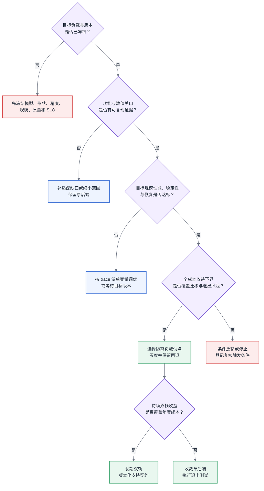

# 第 12 章 国产算力平台与异构迁移

<ChapterContext
  track="主线 A 训练生命周期与主线 B 推理请求链路的算力供给层"
  question="面对新的加速器后端，哪些差异能由框架吸收，哪些必须为目标负载重做，并如何证明迁移值得继续？"
  upstream="第 4 章架构与 Roofline；第 5 章软件栈与 profiling；第 7 章集合通信；第 11 章利用率核算"
  downstream="第 16～18 章训练并行与运行时；第 22 章推理引擎；第 31 章 TCO 与 SLO"
  inputs="目标负载 trace、算子与 API 清单、数值基线、端到端吞吐、规模效率、故障恢复、软件版本与支持记录"
  outputs="适配缺口账、分关口验收记录、可比对标报告、一次性与持续成本账、迁移范围与回退条件"
/>

## “能启动”只覆盖了适配面的一角

框架把设备差异藏在统一 API 后面，但统一接口不等于统一实现。PyTorch 的新加速器集成要覆盖算子注册、设备与 stream/event、随机数、序列化、AMP、分布式等子系统；其 `PrivateUse1` 路径还允许未实现算子回退 CPU，因此“脚本跑完”不能证明关键路径全部在目标设备上执行。[PyTorch Accelerator Integration](https://docs.pytorch.org/docs/main/accelerator/index.html) 与 [PrivateUse1 集成教程](https://docs.pytorch.org/tutorials/advanced/privateuseone.html) 给出了这些集成边界。

厂商迁移工具可以替换设备 API、生成不支持算子清单，并把多卡通信切换到目标通信库；这解决的是脚本适配入口。以昇腾官方文档为例，迁移方式仍区分自动、工具和手工迁移，算子适配还要处理语义一致与硬件能力映射。[迁移方法说明](https://www.hiascend.com/document/detail/en/Pytorch/2600/ptmoddevg/trainingmigrguide/FrameworkPTAdapter/26.0.0/en/pytorch_model_migration_fine_tuning/mig_methods_comp.md) 与 [OpPlugin 算子适配概览](https://www.hiascend.com/document/detail/en/Pytorch/2600/ptmoddevg/Frameworkfeatures/docs/en/framework_feature_guide_pytorch/adaptation_overview_opplugin.md) 都把“可执行”和“高效稳定执行”分开处理。

<BookFigure
  id="ch12-compatibility-surface"
  src="../visuals/generated/ch12/compatibility-surface.svg"
  alt="从业务 API、算子与自动微分、精度与编译、集合通信到运行与恢复五层列出所需证据、失败信号和迁移判断"
  title="图 12-1  迁移适配面不止是替换设备 API"
  caption="任一层能够回退或启动，只能证明局部可用；生产验收需要功能、数值、性能和恢复证据贯通。"
  source="编辑适配矩阵；visuals/data/ch12-compatibility-surface.csv"
  license="CC BY 4.0"
  width="wide"
/>

## 一份“迁移完成”报告的缺口

<CaseMeta
  type="capacity-example"
  data-nature="模型规模、时间、规模效率和成本均为构造评估方法的合成输入，不代表任何厂商、产品或生产项目"
  scope="32B 稠密模型从平台 A 迁至平台 B，目标规模 256 卡，训练质量要求不变"
  assumptions="两平台使用各自适配的最优并行策略；8 卡为最小可比单元；规模效率只含稳定训练窗口；成本账不含硬件采购价"
  reproducible="visuals/data/ch12-scale-efficiency.csv；visuals/data/ch12-cost-ledger.csv"
/>

合成项目已经在平台 B 上跑通 8 卡训练，短程 loss 没有明显异常，团队据此把状态标成“迁移完成”。报告却没有列出 CPU fallback、目标规模吞吐、故障恢复、软件版本组合和调优投入。补测后，平台 A/B 在 8 卡最小单元上各自归一为 100；扩大到 256 卡时，合成规模效率分别为 82 与 68。这个差距只能说明平台 B 的目标配置在扩展过程中损失更多，不能直接归因到硬件、通信库或并行策略。

<EvidencePanel
  title="8 卡跑通不足以批准 256 卡生产迁移"
  conclusion="先冻结版本与对标口径，在 8/64/256 卡保存端到端吞吐、step 分解、集合通信 trace、精度证据和恢复演练；再决定继续调优、缩小迁移范围或停止。"
  source="capacity-example；§12.2 与 §12.5"
>

- 已知：模型可执行，短程 loss 未见明显异常。
- 缺失：fallback 路径、目标规模效率、端到端质量、故障与 checkpoint 恢复、双方调优人日。
- 暂不能回答：目标平台是否更慢、慢在哪一层，以及成本差能否覆盖持续维护。

</EvidencePanel>

## 原理与量化模型

### 12.1 国产算力版图:定位差异与成熟度不对称

平台版图会随产品、软件版本和厂商投入变化，本章不按厂商给出长期成熟度排名。评估对象应写成一个可冻结的组合：设备型号、固件与驱动、编译器、框架后端、通信库、训练或推理框架版本，再加目标模型与负载形状。

可先按集成边界分类：全栈平台自建编译器、运行时和通信库；兼容型平台尽量保留既有编程接口；负载聚焦型平台只为特定模型或推理路径投入优化。这个分类用于预测证据应从哪里取得，不用于预判优劣。全栈平台要验证各层联动和升级兼容；兼容层要验证语义差异与性能损失；聚焦平台要验证目标负载是否落在公开支持边界内。

训练与推理必须分别评估。训练多出反向、优化器、混合精度状态、分布式同步、checkpoint 和长时间稳定性；推理则受 TTFT、TPOT、动态批处理、KV Cache 与服务协议约束。某模型的推理证据不能外推为训练能力，同一平台对不同形状、精度和规模也可能给出相反结论。版本或负载变化后，应触发局部复核，而不是沿用一个“生态成熟”标签。

### 12.2 迁移的三道坎

三个关口按依赖顺序推进，但工期占比没有通用分布。每一关都要保存输入版本、原始证据、通过条件和未决风险。

#### 第一道坎:算子覆盖率

先用真实训练或推理配置生成 trace，覆盖前向、反向、优化器、数据预处理和目标精度。把 API 支持表与运行时 trace 结合，区分原生高性能 kernel、组合实现、图编译生成、CPU fallback 和缺失实现。只按算子名称计数会掩盖关键路径，应同时报告调用次数和基线耗时权重：

$$Coverage_{time}=\frac{\sum_{op\in native\ or\ accepted}t_{op}^{baseline}}{\sum_{op\in all}t_{op}^{baseline}}$$

这里的 $t_{op}^{baseline}$ 来自声明版本与形状上的 profile。它只能用于排迁移优先级：原平台融合算子和目标平台算子未必一一对应，不能把该比值当成目标平台性能预测。每个缺口记录处置方式、负责人、目标版本和退路：等待厂商、等价替换、自研 kernel、允许 fallback，或从迁移范围排除。工期由最小原型和历史交付数据估算，不使用跨团队固定人月。

#### 第二道坎:精度对齐

跨架构浮点执行通常不要求逐位一致。验收线来自业务质量容差和原平台重复运行的自然波动，而不是统一的相对误差或余弦阈值。固定模型、checkpoint、输入样本、随机种子与数据顺序，依次检查；对随机算子还要记录确定性配置与无法消除的方差来源：

1. 确定性小样本上的关键层输出、梯度与首个异常张量；
2. 短程训练中的 loss、梯度范数、scaler/amax 与溢出轨迹；
3. 至少覆盖业务接受范围的端到端质量评测；
4. 多次重复运行的均值、离散度和异常率。

某层差异超出基线波动时，可以用保存中间激活、替换一段子图或提高局部计算精度来缩小范围。局部 FP32 对照只能证明问题与某条低精度路径相关；是否保留该修复，还要在第三关重新测吞吐与容量。

#### 第三道坎:性能调优

功能和质量通过后，按 step 或请求关键路径比较。常见差异落在算子融合与编译、隐式格式转换和搬运、通信与并行切分、数据与 checkpoint 流水线、内存分配和 host/device 同步。任何固定耗时占比都只能作为该负载的基线偏差，不能自动判定根因。

调优按单变量实验推进：固定版本和输入，只改变融合选项、数据布局、micro-batch、并行策略、放置域或通信重叠中的一项。Roofline 判断计算或带宽上限，[§5.4](../第一部分-基础与心智模型/第05章-CUDA、CANN与加速器软件栈.md#54-profiling-方法论全书唯一定义处) 的时间线确定等待发生在哪里，[第 7 章](../第一部分-基础与心智模型/第07章-互联与集合通信.md) 的模型约束通信解释。验收应写目标吞吐、质量、规模、稳定窗口、恢复时间和调优预算，不能只写“MFU 达到原平台某比例”。

### 12.3 迁移评估方法论:两周出结论

“两周”适合作为首轮 timebox，不是所有模型的交付承诺。目标是在有限时间内暴露最高成本的不确定性，并产出继续、条件继续、缩小范围或停止的证据。建议次序如下：

| 阶段 | 主要动作 | 必须产出 | 可提前止损的条件 |
|---|---|---|---|
| 依赖扫描 | 冻结版本；采集真实 trace；核对 API、算子、第三方扩展和自定义 kernel | 适配面矩阵与缺口账 | 关键能力没有实现、替代方案或可承诺版本 |
| 最小闭环 | 在最小可比单元跑前向、反向、更新、保存与恢复 | 可复现脚本、fallback 清单和初步数值证据 | 语义或数据类型差异无法解释 |
| 小规模对标 | 运行端到端负载并做单变量 profile | 吞吐、质量、step 分解、功率边界与调优日志 | 受硬上限约束且收益上界不足 |
| 规模验证 | 至少增加一个通信域或目标规模点 | 规模效率与恢复演练 | SLO、稳定性或恢复目标不可满足 |
| 决策记录 | 汇总一次性成本、持续成本、硬件与机会成本 | 结论、条件、责任人和复核日期 | 决策输入缺失则保持试点状态 |

迁移成本要分一次性和持续性：

$$C_{migration}=C_{operators}+C_{numerics}+C_{tuning}+C_{validation}$$

$$C_{run/year}=C_{dual\ backend\ CI}+C_{upgrade}+C_{support}+C_{regression}$$

每一项给出低/中/高情景、估算依据和置信度。模型剩余寿命、目标容量、供应约束或质量验收成本改变时，回本结论也会改变。不能迁的模型不是由行业名单决定，而是其收益上界在合理情景下仍无法覆盖迁移、运行和回退成本。

<BookFigure
  id="ch12-cost-ledger"
  src="../visuals/generated/ch12/cost-ledger.svg"
  alt="合成迁移账本把算子适配、数值验证和性能调优列为一次性人月，把双后端 CI、升级回归和支持排障列为年度持续人月"
  title="图 12-2  一次性迁移成本与持续双栈成本分账"
  caption="合成数值只演示账本结构；持续成本乘运行年限后，可能改变由硬件价差得出的结论。"
  source="容量示例；visuals/data/ch12-cost-ledger.csv"
  license="CC BY 4.0"
  width="wide"
/>

### 12.4 混合集群管理:双后端是常态而不是过渡

双后端共存期间应按可运营形态建设，但不预设永久保留。决策记录要写明退出条件：新后端覆盖哪些负载、旧后端何时只承载例外、什么成本或风险会触发回退到单后端。

控制面尽量统一，资源语义不得抹平。调度器可以统一队列、身份、配额和审计，但设备类型、互联域、可用精度与恢复能力必须成为显式约束。镜像在业务依赖层共享，在驱动、运行时和平台扩展层分叉并锁定兼容矩阵。监控统一故障、容量、吞吐和质量语义，同时保留原生计数器，避免把名称相近而定义不同的指标强行换算。资源账单也要保留后端维度，否则相同“卡时”会隐藏完全不同的有效产出和机会成本。

代码分叉优先收敛在框架后端和薄适配包。业务代码使用设备无关接口；必须使用平台专有算子时，以能力探测和独立模块隔离，并提供对照实现。推理也可以在服务网关之后按模型实例路由，从输入输出契约处隔离后端差异。自建一整套中间层意味着自行承担算子、编译、调试和版本追随，只有在规模与长期收益足以覆盖该责任时才成立。

CI 不应机械要求每次提交运行两套完整训练。按风险分层：纯业务逻辑跑设备无关单测；后端适配变更运行双后端算子与小闭环；每日或发版运行短程数值和性能回归；软件栈升级运行完整兼容、质量、性能与恢复测试。失败是否阻塞合并由支持契约决定，不能默许后端长期红灯后仍宣称受支持。

### 12.5 性能对标的正确姿势【全书唯一定义处】

本节定义跨平台性能对标的最低可比口径。对标先过质量与功能门禁，再谈速度和成本。

#### 为什么单卡跑分没有意义

单算子或单卡跑分对 kernel 选型、Roofline 和回归定位有用，但不足以单独支持平台采购：它不包含真实算子组合、数据与 checkpoint、集合通信、调度等待、故障恢复和服务 SLO。报告应明确它是诊断证据还是端到端决策证据，不能从局部胜负外推整个工作负载。

#### 对标必须看的三个数

第一个数是通过质量门禁后的端到端交付率。训练报告有效 token/s、samples/s 或 steps/s，并同时给出验证质量和稳定窗口；推理在同一 TTFT、TPOT、错误率和质量约束下报告请求或 token 吞吐。MFU 可解释平台内部峰值兑现程度，但两个平台各自除以不同理论峰值后，MFU 高低既不等于绝对吞吐，也不等于性价比。

第二个数是规模效率。最小可比单元为 $N_0$ 卡时：

$$\eta(N;N_0)=\frac{Throughput(N)}{(N/N_0)\times Throughput(N_0)}$$

$N_0$ 必须能容纳同一模型与并行约束。规模点要跨越目标互联域，并包含目标生产规模或与其相邻的实测点；外推必须单列模型、区间和未测拓扑，不能用跨多个域的点估计代替验收。

<BookFigure
  id="ch12-scale-efficiency"
  src="../visuals/generated/ch12/scale-efficiency.svg"
  alt="平台 A 与平台 B 在八卡均归一为百分之一百，扩展到六十四卡和二百五十六卡时规模效率以不同斜率下降"
  title="图 12-3  单点打平不能证明目标规模打平"
  caption="合成曲线用于说明必须跨互联域采样；斜率差异还需通信 trace、并行配置和故障数据解释。"
  source="容量示例；visuals/data/ch12-scale-efficiency.csv"
  license="CC BY 4.0"
  width="wide"
/>

第三个数是满足质量与 SLO 后的单位全成本产出：

$$Unit\ Value=\frac{Effective\ output}{Hardware+Energy+Facility+Operations+Ecosystem+Risk}$$

分子和分母必须使用同一统计期。折旧、实际功率积分、机房、工程人力、故障重跑和迁移成本的摊销规则写入报告；成本模型详见第 31 章。

#### 对标实验的设计纪律

- 固定模型、checkpoint、数据与质量目标、全局 batch 或服务请求分布；双方允许使用适合各自架构的配置。
- 给两边相同的调优预算、问题响应窗口和停止条件，逐项记录专家参与、人日与专有补丁。
- 报告设备、固件、驱动、编译器、框架、通信库和容器版本，以及精度、稠密/稀疏峰值、测量窗口和排除项。
- 同时报端到端结果与关键路径分解；冷启动、checkpoint、故障和恢复若被剔除，另列运行期成本。
- 保存原始日志、脚本、配置、随机种子和数据摘要，使第三方能复跑；缺失质量证据或版本信息的结果标记为不可比。

### 12.6 供应链与生命周期视角

技术可用性之外，还要核验交付与扩容周期的历史分布、备件和维修 SLO、驱动与安全补丁支持窗口、框架版本兼容记录、产品退市与数据迁出条款。厂商承诺与历史证据分栏记录；合同承诺必须能映射到验收、赔付或退出动作。

锁定深度取决于专有 API、自研 kernel、模型格式、运维工具和人员技能。为每类资产记录替代实现、维护人和退出测试。供应受限时仍可能必须迁移，但硬性约束只改变“是否需要第二来源”，不会免除质量、性能和恢复评估；它会改变的是验收线、时间表和可接受成本。

### 12.7 生态作为选型变量【全书唯一定义处】

“生态成熟度”只有映射到目标负载和可观察成本后才进入选型。本节统一使用五个维度。

#### 五个维度及其测量方法

1. 算子与模型覆盖：使用目标版本的真实 trace 统计原生、组合、fallback 与缺失路径；对业务计划中的新模型记录从发布到满足本方验收线的滞后期。
2. 框架适配深度：记录功能位于上游主仓、厂商插件/分支还是本地补丁；核对版本滞后、AMP、分布式、编译和调试工具覆盖。
3. 文档与支持可得性：从本团队历史问题中盲抽样，记录独立找到可用答案的比例、工单首响与解决分位数、复现往返次数。
4. 人才与关键人风险：用实际招聘周期、培训到独立值班的时间、代码所有者数量和休假演练衡量，不用岗位关键词数量代替供给。
5. 升级与向后兼容：在隔离环境重放最近版本升级，记录 API/算子行为变化、回归失败数、修复人日和回退可行性。

<!-- source: diagrams/sources/ch12-eco-dimensions.excalidraw -->

图 12-4:五个生态维度都必须落到目标负载的观测与成本项；供应商自评等级不能替代本方试点。

#### 折算公式与硬观点

先统一单位，再求和。年度生态成本可以写成：

$$C_{eco/year}=C_{gap,amortized}+C_{upgrade}+C_{debug}+C_{training}+C_{dualstack}+C_{delay}$$

前五项中的工程时间乘全成本人月单价，$C_{delay}$ 用等待时间乘业务机会成本。缺口算子的一次性投入按预计受益年限摊销；未承诺的厂商排期使用情景区间。生态成本可能高于、低于或接近硬件价差，结论由目标负载的输入决定，不能预设“硬件差价不是大头”。

#### 生态的正反馈,与它被打破的条件

更多用户可能带来更多问题样本、文档、第三方适配和人才，也可能增加版本组合与支持压力。外部采购约束、负载向少数模型收敛、框架后端能力增强，都会改变迁移成本。评估时跟踪本方真正依赖的模型、框架和版本的趋势，不用社区总量或宣传案例替代。

#### 对采购决策的实际建议

小规模试点同时验证性能和独立运维能力。由本方工程师在限定厂商帮助的条件下完成安装、模型迁移、profile、故障复现、升级与回退，并记录需要厂商介入的位置。技术团队交付测量值、成本区间和风险；采购与管理层把价格、供应战略和风险偏好加入同一决策记录。任一方都不应把“生态好/不好”当作不可复核的一票结论。

## 方案对比:三条迁移路径

| 路径 | 适用条件 | 主要成本 | 失效边界与退出信号 |
|---|---|---|---|
| 整体切换 | 目标负载稳定；所有关键关口已有目标规模证据；回退窗口可演练 | 集中迁移与切换风险 | 任一关键负载缺少质量、恢复或容量退路 |
| 推理或稳定负载先行 | 负载可按模型实例隔离；服务契约能统一 | 跨平台模型验收与双份发布链路 | 发布验证成本和持续分叉超过已兑现收益 |
| 长期双轨 | 供应与负载差异确实需要两种后端；平台能承担持续 CI 和值守 | 双栈升级、监控、人才与容量碎片 | 支持范围持续收缩或年度生态成本吞没组合收益 |

路径是评估输出。外部约束要求采用新平台时，仍应从稳定、可隔离、收益明确的负载确定迁移顺序，并为暂不适配的负载保留退路。每个路径都写复核日期，不按固定季度机械重评；版本升级、模型结构变化、供应或成本假设越界时立即触发。

## 大数据对照

大数据迁移中的依赖扫描、按使用频度给缺口定价、双跑对数、统一身份与调度控制面可以直接复用。变化在执行单元：AI 负载的算子融合、低精度数值、设备内存、集合通信和同步慢节点都可能进入关键路径，API 兼容不能推导性能兼容。迁移台账因而还要保存硬件拓扑、低精度路径和框架后端版本。

因此，Hive UDF 清单对应算子与自定义 kernel 清单，双跑数据对账对应质量与梯度对照，YARN 资源标签对应设备类型与互联域。不能照搬的是“横向加机器即可吸收适配损失”的假设；是否能扩容弥补，要由目标平台的规模效率、供给、电力和 SLO 共同证明。

## 选型决策树

图 12-5:先冻结可比对象，再依次核验功能与数值、目标规模运行证据和全成本；硬性采购约束不会跳过这些关口，只会改变迁移范围与时间表。

---

<ChapterDeliverables :items="[
  '冻结设备、驱动、编译器、框架后端、通信库、模型、形状、精度、规模与质量目标，形成可复跑的迁移对象',
  '从真实 trace 建立 API、算子、精度编译、集合通信与运行恢复五层适配矩阵，并显式标出 fallback',
  '用原平台重复运行波动定义数值基线，保存关键层、短程训练、端到端质量与多次重复证据',
  '按同等调优预算报告端到端产出、规模效率、关键路径分解、稳定性、恢复和单位全成本产出',
  '把一次性迁移与年度双栈成本分账，为整体切换、分批迁移或长期双轨写明回退和复核条件'
]" />
