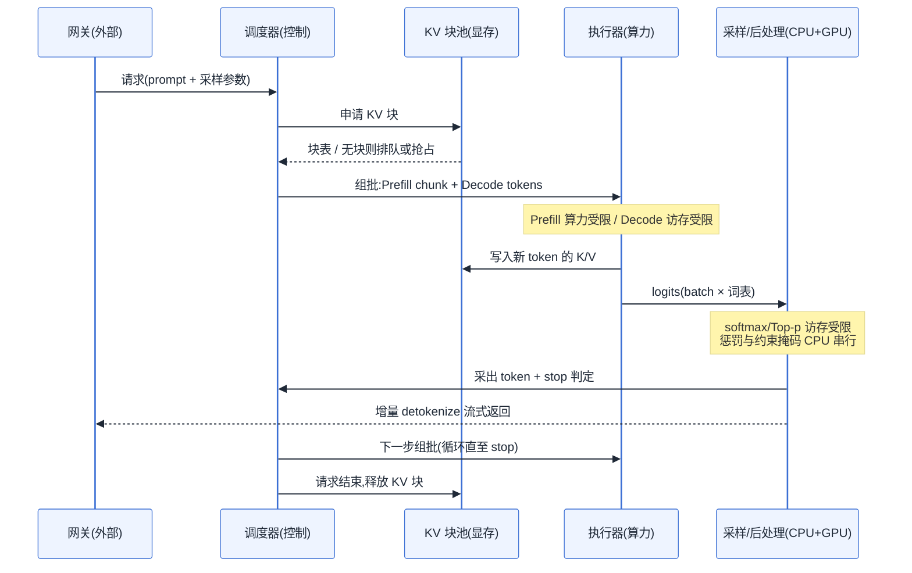
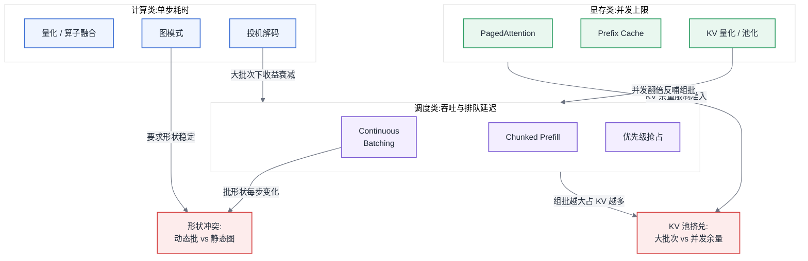
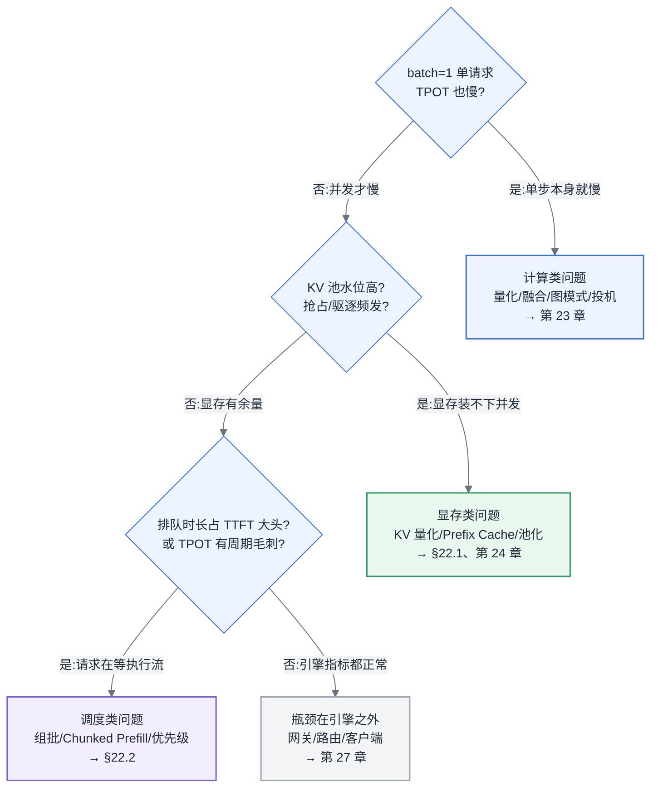

# 第 22 章 推理引擎原理

## 22.0 本章定位

**链路定位**:本章覆盖主线 B(一次推理请求的全链路)的核心段——请求进入引擎之后的"排队 → Prefill → Decode 循环 → 采样后处理 → 流式返回",即网关与路由之后、返回用户之前的全部引擎内部行为。

**依赖声明**:本章建立在 [§3.4](../第一部分-基础与心智模型/第03章-人工智能与大模型基础.md#34-transformer-与注意力) 的结论之上——自回归解码的每一步都要用到此前所有 token 的 K/V 张量,缓存它们是用显存换算力的必然选择,这就是 KV Cache 的由来。本章不再重述这个由来,直接讨论它作为一种显存资源如何被管理、被调度、被挤兑。同时,[§4.4](../第一部分-基础与心智模型/第04章-硬件第一性原理、架构范式与数值精度.md#44-roofline-模型) 的 Roofline 判定(Decode 阶段是访存受限的)是本章所有调度设计的物理前提。

## 问题场景:一次查了三天的 P99 毛刺

一个内部知识库问答服务,单卡部署一个 30B 级别模型,平均 QPS 约 4,P50 首 token 延迟(TTFT,Time To First Token)400ms,业务方一直没有抱怨。某周三开始,监控上出现一种奇怪的形态:P50 几乎不动,P99 的 TPOT(Time Per Output Token,每输出 token 耗时)却从 45ms 飙到 900ms——正在打字机式输出的会话,每隔一两分钟就集体卡顿一秒多,然后恢复。GPU 利用率曲线没有异常,显存占用没有异常,没有 OOM,没有报错日志。

平台工程师按大数据时代的直觉排查了三天:先怀疑网络抖动,抓包无果;再怀疑 GC 或宿主机 noisy neighbor,迁移节点后毛刺依旧;最后怀疑模型服务进程有周期性任务,翻遍代码也没有。转机来自一条业务日志:毛刺时刻总是与某个新接入租户的请求对齐。那个租户上线了"整篇文档总结"功能,单条 prompt 长达 3 万 token。引擎收到这条请求后,一次 Prefill 前向就要处理 3 万个 token,这一步要跑一秒多;而在这一秒多里,批内其他几十个正在 Decode 的请求一步也走不了——它们和这条长 prompt 共享同一个执行流。每分钟一两条长文档请求,就是每分钟一两次全员卡顿。

这个故障的所有症状都不在传统监控的字典里:没有资源耗尽,没有错误,只有"一类请求的计算形态阻塞了另一类请求"。要理解它、量化它、修复它,需要理解推理引擎内部的三件事:KV Cache 如何占据显存、调度器如何组批、以及每一步生成在时间上花在了哪里。这正是本章的内容。

## 22.1 KV Cache 与显存

### 结构与增长规律

KV Cache 的逻辑结构是一个四维张量:`[层数 L, KV 头数 H_kv, 序列长度 S, 头维度 d_head]`,K 和 V 各一份。每个 token 的 KV 占用字节数为:

```
每 token KV 字节数 = 2(K 和 V) × L × H_kv × d_head × 每元素字节数 b
```

以一个典型的 GQA(Grouped-Query Attention)结构 32 层模型为例:L=32,H_kv=8,d_head=128,BF16(b=2):

```
2 × 32 × 8 × 128 × 2 B = 128 KB/token
```

一条 4K token 的会话就是 512 MB;一张 80 GB 的卡,权重占掉约 16 GB(8B 级模型 BF16)后,留给 KV Cache 约 60 GB,可容纳约 49 万个 token——听起来很多,但换算成 4K 上下文的并发会话只有约 120 路,换算成 32K 上下文只有约 15 路。**推理服务的并发上限,绝大多数场景下不是被算力决定的,而是被这笔账决定的。** 这也是为什么 MLA、GQA 这类压缩 H_kv 的结构改动,对 Infra 侧的意义远大于对算法侧:H_kv 从 32 降到 8,并发上限直接乘 4。

增长规律有两条,都是线性的:随序列长度线性增长(每生成一个 token 追加一份),随并发数线性增长(每条请求独立一份)。线性听起来温和,但它意味着 KV Cache 是推理系统中唯一一块**随时间持续膨胀、且膨胀速率由用户行为决定**的显存——权重是常量,激活值在每步之后释放,只有 KV Cache 的生命周期和用户会话一样长、大小和用户输入一样不可预测。

### KV Cache 精度的系统影响

把 KV Cache 从 BF16 降到 INT8/FP8,不是一个孤立的"省显存"动作,它同时拨动三个系统变量:

1. **显存占用减半**:每 token 128 KB 变 64 KB。
2. **可容纳并发数翻倍**:同一块 KV 池能装下两倍的 token,排队队列长度、抢占频率随之下降——这是一个显存动作产生的**调度收益**。
3. **前缀缓存命中率上升**:第 24 章将展开的 Prefix Cache 复用的是同一块 KV 池,池子能装的前缀条目翻倍,LRU 驱逐变慢,命中率上升——这是一个显存动作产生的**计算收益**(命中一次前缀就省一次 Prefill)。

代价是长上下文下的误差累积:KV 量化误差随注意力在长序列上反复读取而放大,数万 token 之后可能出现可感知的质量退化。量化算法本身如何控制这个误差属于第 23 章;本章要读者记住的是这个结构性事实——**KV Cache 是三类资源(显存、调度、计算)的交汇点,动它的精度会同时改变三本账**,评估时只看显存收益是不完整的。

### PagedAttention 与显存碎片治理

在 PagedAttention 出现之前,引擎为每条请求按"可能的最大长度"预分配连续显存:请求声明最长 4K,就切 4K token 的连续空间,哪怕最终只生成了 300 个 token。早期系统的实测显存有效利用率只有 20%–40%,浪费来自三处:为未来 token 预留的内部碎片、请求长短不一造成的外部碎片、以及"按最大值预留"本身。

PagedAttention 把操作系统的虚拟内存分页搬进了 KV 管理:KV 池被切成固定大小的块(block,典型 16 token),每条请求持有一张块表(block table),逻辑上连续的序列物理上散落在任意块中,注意力算子通过块表间接寻址。效果是:外部碎片归零(所有块等大),内部碎片被压到每条请求平均半个块(不足 1 KB 级),有效利用率升到 90% 以上;等价于在不加卡的前提下把并发上限提高 2–4 倍。副产品同样重要:块表间接寻址使多条请求可以**共享**物理块(相同前缀指向同一块,写时复制),这是 Prefix Cache 和并行采样共享 prompt 的实现基础。

它的代价是间接寻址给注意力算子增加约 5% 以内的访存开销,以及引擎必须维护一个"显存分配器 + 页表"的子系统——这正是不同引擎内存管理差异的来源(见 [§22.4](#224-引擎剖析方案对比))。

**这对做平台的人意味着什么**:容量规划时,先算"每 token KV 字节数",再用 `(显存 − 权重 − 激活预留) ÷ 每 token 字节数` 得到 token 容量,再除以业务的典型上下文长度得到并发上限——这是推理侧最重要的一道算术题,报价、扩容、限流阈值都从它推导。

## 22.2 批处理与调度

### Continuous Batching

Decode 阶段每步只为每条请求计算一个 token,是典型的访存受限负载(见 [§4.4](../第一部分-基础与心智模型/第04章-硬件第一性原理、架构范式与数值精度.md#44-roofline-模型)):单请求运行时,算力利用率常不足 1%,把多条请求组成批次共享一次权重搬运,几乎是免费的吞吐。问题在于怎么组批。

静态批处理(static batching)沿用训练的习惯:攒一批请求,一起跑到全部结束。它的浪费由输出长度的方差决定——批内最长的请求生成 2000 token,最短的 50 token 就结束了,后者的槽位空转 1950 步;新请求必须等整批结束才能进入。输出长度方差越大,有效利用率越低,而 LLM 输出长度的方差恰恰极大。

Continuous Batching(连续批处理)把调度粒度从"批"降到"迭代步":每一步前向结束后,调度器立即移出已完成的请求、放入排队中的新请求,批次的成员每一步都可以变化。它消除了两种等待——完成者不等最长者,新请求不等整批。生产系统中,相对静态批处理的吞吐提升常见 3–10 倍,方差越大提升越大。

调度器的核心结构由三部分组成:等待队列(waiting)、运行批次(running)、以及一个每步的 **token 预算**(budget)。每一步调度的决策是:在 KV 块余量和 token 预算的双重约束下,从等待队列接纳尽量多的请求。两个约束对应两种失败模式——KV 块不足时接纳会导致中途抢占,token 预算过大时单步耗时上升、TPOT 变差。**调度器本质上是在做一个每 20–50ms 执行一次的准入控制,它的策略直接决定了 SLO 形态。**

### Chunked Prefill:长 prompt 饿死 decode

回到本章的问题场景。Prefill 一次处理整条 prompt 的所有 token,是算力受限的;Decode 每步一个 token,是访存受限的。当一条 3 万 token 的 Prefill 进入执行流,它独占 GPU 一秒以上,批内所有 Decode 请求在这一秒里颗粒无收——这就是 P99 TPOT 毛刺的机制,而且它是**所有**推理服务在接入长文档、长对话历史业务后必然遇到的问题,不是某个引擎的缺陷。

Chunked Prefill(分块预填充)的做法是:把长 prompt 切成固定大小的块(典型 512–2048 token),每一步只处理一块,并把这一块与当前批次的 Decode token **混合成一个批次**执行。效果是 Prefill 从"独占一整步"变成"每步占一份预算",Decode 请求每步照常推进一个 token。

块大小是一个明确的权衡旋钮:

- **块越小**:每步中 Decode 占比越高,TPOT 越平稳;但长 prompt 需要更多步才能完成,且每块都要重读一次此前已算出的 KV(注意力对已缓存前缀的访存随块数增加而重复),**TTFT 变长**,长 prompt 的总 Prefill 开销上升 10%–30%。
- **块越大**:TTFT 越短、Prefill 总开销越低,但向"不分块"退化,TPOT 毛刺回来。

工程上的选择依据是把块大小对齐到"算力饱和点":用 [§4.4](../第一部分-基础与心智模型/第04章-硬件第一性原理、架构范式与数值精度.md#44-roofline-模型) 的方法找到该硬件上前向计算从访存受限转为算力受限的批内 token 数(常见量级为数百到一两千),块大小设在这个点附近——再大没有算力收益,只有延迟代价。混批的另一个收益是把访存受限的 Decode token"搭车"进算力受限的 Prefill 块,两种资源画像互补,单步的硬件利用率高于任何一方单独执行。

```mermaid
%%{init: {'theme':'base','themeVariables':{
  'primaryColor':'#EEF4FF','primaryBorderColor':'#3B6FD4','primaryTextColor':'#1F2937',
  'secondaryColor':'#F3F4F6','tertiaryColor':'#FFFFFF',
  'lineColor':'#6B7280','fontFamily':'-apple-system, Segoe UI, Helvetica, Arial, sans-serif','fontSize':'14px'
}}}%%
gantt
    title 32K prompt 到达后的执行流(单位:ms)
    dateFormat X
    axisFormat %s
    section 不分块
    32K Prefill 独占执行流 :p1, 0, 1300
    批内所有 Decode 停摆(TPOT 毛刺) :crit, d1, 0, 1300
    Decode 恢复 :d2, 1300, 1700
    section 分块(块=2K)
    16 个 chunk 与 Decode 混批推进 :p2, 0, 1500
    Decode 每步照常推进(TPOT 平稳) :d3, 0, 1700
```



图 22-1:Chunked Prefill 前后长 prompt 对 Decode 的影响对比。分块把"一次 1.3 秒的全员停摆"换成"TTFT 略增 + TPOT 平稳",红色阻塞区是 P99 毛刺的直接来源。

### 优先级、抢占与请求驱逐

KV 块是会耗尽的:运行中的请求每步都在追加 KV,当池中无块可分时,调度器必须**抢占**(preemption)某些请求。被抢占请求的 KV 有两种处置:换出到主机内存(swap,代价是 PCIe 往返搬运)或直接丢弃、重新排队后**重算**(recompute,代价是一次完整的 Prefill)。现代引擎多默认重算——因为 Prefill 算力便宜而 PCIe 带宽金贵,且重算的实现不引入主机内存管理的复杂度;但当 prompt 极长(重算一次数秒)时,换出反而划算,这个分界点可以用"重算耗时 = KV 体积 ÷ PCIe 有效带宽"直接估算。

优先级调度建立在抢占之上:高优先级请求到达而资源不足时,驱逐低优先级请求的 KV。平台侧要意识到它的代价形态——被驱逐的请求不是"慢了一点",而是 TTFT 重新计时,对用户表现为"已经开始输出的对话突然重头卡住"。因此优先级机制上线时必须配套两条纪律:低优先级流量要有独立的 SLO 口径(不能与高优先级共用 P99),以及抢占率要进监控——**抢占率持续高于个位数百分比,说明 KV 池容量规划错了,该扩容或限流,而不是靠抢占硬扛。**

**这对做平台的人意味着什么**:TTFT 由排队与 Prefill 决定,TPOT 由 Decode 步长与被阻塞程度决定,两者的恶化原因不同、治理手段不同。监控必须分开采集 TTFT 与 TPOT,并额外采集排队时长、抢占率、KV 池水位三个引擎内部指标——只看端到端延迟,你会像问题场景里那样查三天。

## 22.3 采样与后处理阶段

### 采样在做什么

每一步 Decode 的前向输出是一个 logits 向量(词表上每个 token 的未归一化得分),采样阶段把它变成一个具体的 token:

- **贪婪采样(Greedy)**:取 argmax,确定性输出。
- **温度(Temperature)**:logits 除以 T 再 softmax,T<1 分布变尖、T>1 变平。
- **Top-k / Top-p**:只在得分最高的 k 个 token、或累积概率达 p 的最小集合内采样,截断长尾。
- **重复惩罚(repetition penalty)**:对已出现过的 token 压低 logits,需要维护每条请求的历史 token 集合。

这些概念本身属于算法侧,平台侧无需关心哪组参数效果好。需要关心的是下面这件事。

### 被低估的后处理耗时

多数人的直觉是:模型前向占 99% 的时间,采样是"取个 max"的零头。这个直觉在现代模型上是错的,错在三处:

**第一,logits 张量本身很大,采样是访存受限的。** 现代模型词表普遍在 12 万–15 万级。以词表 15 万、FP32 logits 为例,每条请求每步 600 KB;batch 256 时每步的 logits 就是 150 MB。对它做 softmax、排序(Top-p 需要排序或等价的选择算法)、以及惩罚项的散布读写,是纯访存操作——在一个本身只有一二十毫秒的 Decode 步里,这部分稳定占据 5%–15%,而且**不随模型变小而变小**(词表不缩),小模型上占比反而更高。

**第二,惩罚类与约束类逻辑常落在 CPU 上串行执行。** repetition penalty、stop 字符串匹配、以及各类每请求独立的采样参数,早期实现(以及不少当前实现的慢路径)是 Python/CPU 逐请求循环。GPU 每步 20ms,CPU 后处理 5ms,吞吐就无声地掉了 20%——profiling(方法见 [§5.4](../第一部分-基础与心智模型/第05章-CUDA、CANN与加速器软件栈.md#54-profiling-方法论全书唯一定义处))里它显示为 GPU 空隙,而不是任何一个显眼的算子。

**第三,结构化输出把串行做到了极致。** 约束解码(constrained decoding,如强制输出合法 JSON)的机制是:每一步根据语法状态机计算"当前允许的 token 集合",生成一个词表大小的掩码,加到 logits 上。语法状态机的推进和掩码生成天然是每请求串行的 CPU 逻辑;朴素实现下,单条开启 JSON 约束的请求能把整个批次的步长拖长数倍。现代方案(编译式语法引擎,把 schema 预编译为自动机、掩码计算向量化并与前向重叠)把代价压到接近零,但**开启结构化输出前必须实测吞吐**,不同引擎在这一项上的差距是数量级的——这也是 [§22.4](#224-引擎剖析方案对比) 中引擎对比的一个真实分野。

### Stop 条件、流式返回与首 token

三个容易踩坑的工程细节:

1. **Stop 条件的匹配单位**:stop 可以是 token id(每步 O(1) 判断)或字符串(必须先增量 detokenize 再做后缀匹配)。字符串 stop 还有跨步问题——stop 串可能横跨两个 token,引擎必须持有一段未下发的尾部缓冲,这意味着流式输出天然比生成落后若干字符。
2. **增量 detokenize 与多字节字符**:一个汉字或 emoji 的 UTF-8 字节可能被切在两个 token 里,逐 token 直接解码会输出乱码。正确实现要等字节序列完整才下发,流式接口的"卡半个字"多源于此。
3. **首 token 的返回路径**:TTFT 的终点不是"第一个 token 被采出",而是它穿过 detokenize、SSE 编码、网关缓冲到达客户端。网关或反向代理开了响应缓冲,TTFT 会凭空多出几百毫秒——这笔账在引擎侧的指标里看不到。

**这对做平台的人意味着什么**:压测必须带着真实的采样配置做。用 greedy、无 stop 字符串、无结构化输出测出的吞吐是引擎的理论上限,业务一旦开启 JSON 模式或复杂 stop 规则,容量可能直接掉两三成;把"采样参数组合"纳入压测矩阵,才能给出可承诺的容量数字。

### 一次请求的引擎内部全景

至此,主线 B 在引擎内部的完整时序可以画出来了:



图 22-2:一次推理请求在引擎内部的时序。要记住的一件事:每一个生成步都要走完"调度 → 执行 → 采样"整圈,任何一环(包括看似无害的 CPU 后处理)变慢,都直接加进 TPOT。

## 22.4 引擎剖析(方案对比)

同一个模型、同一张卡,换一个引擎吞吐差 2–5 倍,是常态而非例外。差异不来自玄学,主要来自三处:调度器的组批策略、KV 内存管理的精细度、以及算子与后处理的实现质量。本节按这个框架剖析主流引擎,**每个都给出失效边界**。

**vLLM**:PagedAttention 的发源地,调度器为 Python 实现、迭代级组批、Chunked Prefill 与前缀缓存齐备。最大的优势是生态:模型支持最广、硬件后端最多(NVIDIA/AMD/昇腾/TPU 等经由插件机制)、社区特性跟进最快,是"默认选它不会错"的基线。**失效边界**:CPU 侧调度与后处理开销在小模型、极低延迟场景下占比放大——单请求、几 B 参数的模型上,Python 开销可能吃掉两位数百分比的步长;对单一模型极限压榨性能时,通常不是第一名。

**SGLang**:调度与 vLLM 同代,两个结构性长板:RadixAttention 把前缀缓存组织成基数树、命中粒度与自动复用优于朴素前缀哈希,适合多轮对话、Agent、大量共享 system prompt 的负载;CPU/GPU 重叠调度与编译式约束解码(xgrammar 一系)使其在结构化输出场景常有数量级优势。**失效边界**:硬件后端与长尾模型覆盖窄于 vLLM;负载中没有共享前缀、没有结构化输出时,相对优势不明显。

**TensorRT-LLM**:NVIDIA 官方路线,核心是把模型编译为深度优化的引擎(算子融合、精度定制),单步耗时通常是 NVIDIA 卡上的第一梯队。**失效边界**:只有 NVIDIA;编译流程带来模型上线成本——新模型、新特性的适配滞后,改一次并行配置或量化方案要重新构建;工程灵活性(热更新、快速试错)最差。适合"模型清单稳定、追求单位卡吞吐极限"的成熟业务,不适合模型频繁更换的平台期。

**LMDeploy**:TurboMind 内核在 W4A16 权重量化路径上做得早且深,中文社区模型适配积极。**失效边界**:模型与硬件覆盖面窄于 vLLM,团队若已在 vLLM 生态,迁移收益需要实测支撑。

**昇腾推理路径**:两条,定位不同。**MindIE** 是华为官方推理栈,自带服务框架与 ATB 高性能算子,昇腾上的极限性能路线,商业支持完整;代价是模型支持列表跟随官方节奏、接口生态自成一体,平台若同时管理 GPU 与昇腾两种池子,要维护两套服务化封装。**vLLM-Ascend** 是 vLLM 的昇腾后端插件,价值恰好相反:API、调度行为、运维口径与 GPU 侧 vLLM 完全一致,异构集群可以用同一套编排与网关;代价是特性落地滞后于 vLLM 主线,部分依赖 CUDA 生态的特性缺位或性能未达 MindIE 水平。选型判据:**单一昇腾池、模型在 MindIE 支持列表内、追求性能上限,选 MindIE;GPU/昇腾混池、运维一致性优先、能接受一定性能折让,选 vLLM-Ascend。** 两者都要求先在目标模型上实测,昇腾上"支持"与"支持得好"之间的差距比 GPU 生态更大(生态评估方法见 [§12.7](../第二部分-算力底座/第12章-国产算力平台与异构迁移.md#127-生态作为选型变量全书唯一定义处))。

**边缘侧:llama.cpp / Ollama**:目标函数与以上所有引擎不同——不是集群吞吐,而是"在任何设备上跑起来":GGUF 量化格式、CPU/GPU 混合推理、零依赖部署。Ollama 在其上再包一层模型管理与本地 API。**失效边界**:并发服务能力弱,没有生产级的连续批处理与 KV 池管理,几十并发以上的服务场景用它们就是选错了工具;反之,把 vLLM 塞进单用户的边缘盒子,也是同样的错配。

**这对做平台的人意味着什么**:引擎选型的第一问不是"哪个最快",而是"我的负载画像是什么"——共享前缀多不多、结构化输出有没有、模型清单稳不稳定、硬件池是否异构。第 24 章的服务化架构与第 27 章的网关会假定你已在此处做出了引擎选择。

## 大数据对照

本章的每个机制,在大数据时代几乎都有一个形似的前身;辨析"形似而神不似"之处,比罗列相似更有价值。

**Continuous Batching ↔ 微批与事件驱动流处理**。Spark Streaming 的微批到 Flink 的逐事件处理,与静态批处理到连续批处理,是同一个思想的两次发明:缩小调度粒度以消除"等最慢者"。这条经验**直接复用**——包括它的代价(调度开销随粒度变细而上升,所以有 token 预算,正如 Flink 有 buffer timeout)。

**长 prompt 阻塞 ↔ YARN 大作业的队头阻塞**。FIFO 队列里一个大 MapReduce 作业饿死一群小作业,与长 Prefill 饿死 Decode,现象同构;YARN 的解法(Capacity/Fair Scheduler、抢占)与推理侧的解法(Chunked Prefill、优先级抢占)也同构。**神不似之处**:YARN 抢占杀掉的 container 重跑即可,代价是可预估的重算;推理侧抢占丢弃的是 KV Cache,重算发生在用户正盯着的会话上,SLO 代价直接可见——所以推理调度器对抢占远比 YARN 保守,宁可拒绝准入。

**KV Cache ↔ 有状态流处理的 state**。大数据的无状态假设(第 1 章)在此彻底失效:推理请求像 Flink 的 keyed state 一样携带持续增长的状态。但有一条关键差异:Flink state 丢了必须从 checkpoint 恢复,KV Cache 丢了可以**重算**——它是缓存而非事实源。这个差异决定了推理系统的容错设计比流处理简单得多(不需要分布式快照),也决定了"驱逐再重算"是合法的调度手段。

**彻底失效的经验**:调度时间尺度。YARN/Spark 的调度决策以秒为单位,决策慢一点只是浪费;推理调度器每 20–50ms 决策一次,调度器自身的 CPU 耗时直接叠加进用户可感知的 TPOT。"调度器性能不影响业务延迟"这条大数据时代的隐含假设,在推理引擎里不成立——这正是各引擎竞相把调度器做重叠、做异步的原因。

## 22.5 加速特性三分法(第五部分地图)

> **本节是全书"加速特性三分法"的唯一定义处**。第 23、24 章按此展开,第 17 章的训练侧优化同样适用此分类。

推理加速特性层出不穷,逐个记忆没有尽头。所有特性按"它优化的是哪个瓶颈"归为三类,即可建立稳定的坐标系:

| 类别 | 优化目标 | 代表手段 | 本书展开位置 |
|---|---|---|---|
| **调度类** | 吞吐与排队延迟(让硬件不空转、让请求不空等) | Continuous Batching、Chunked Prefill、优先级抢占 | [§22.2](#222-批处理与调度) |
| **显存类** | 并发上限(让同样的显存装下更多请求) | PagedAttention、Prefix Cache、KV 量化、KV 池化 | [§22.1](#221-kv-cache-与显存)、第 24 章 |
| **计算类** | 单步耗时(让每一步前向更快) | 量化、算子融合、图模式、投机解码 | 第 23 章 |

归类方法是问一个问题:**这个特性生效后,变好的第一指标是什么?** 排队时长与整机吞吐变好,是调度类;同显存下最大并发变高,是显存类;batch=1 的 TPOT 变短,是计算类。任何新特性都能用这一问归位——例如"投机解码"降低的是单请求生成同样内容所需的等效步数,batch=1 即可受益,归计算类;"KV 换出到主机内存"扩大的是可挂起的请求数,归显存类。

三类之间不是正交的,冲突有明确的模式:

- **调度类与显存类经常互相挤兑**:这是最重要的一条。调度类特性的本能是把批次组大(吞吐来自大批次),而每多收一条请求就多占一份 KV;显存越紧张,调度器越频繁地抢占与重算,反过来摧毁吞吐。两者共享 KV 池这一个资源,**任何调度参数(最大批次、token 预算)的调整都必须重新核对显存账,反之亦然**。
- **计算类与调度类的形状冲突**:图模式(CUDA Graph / ACL Graph,见第 23 章)要求执行形状稳定,而连续批处理每步都在改变批次形状,工程上靠分桶捕获妥协;投机解码在大批次下收益衰减(算力空隙被批处理填掉了),与追求大批次的调度目标直接相左。
- **计算类与显存类的方向一致但预算冲突**:权重量化(计算类)省下的显存会被 KV 池吃掉变成并发(显存类收益),这是少见的双赢;但投机解码的草稿模型要占显存,又从 KV 池里扣了一块。



图 22-3:加速特性三分法与冲突关系(第五部分核心图)。要记住的一件事:三类特性共享 KV 池与执行形状两个耦合点,红色节点标出的两处冲突,是叠加优化时最常翻车的地方。

## 选型决策树:我的性能问题属于哪一类

拿到一个推理性能问题,先归类再动手——修错类别的特效药,常常让问题更糟(例如给显存不足的系统加大批次)。



图 22-4:性能问题归类决策树。要记住的一件事:三个问句对应三个可直接采集的指标(单请求 TPOT、KV 水位与抢占率、排队时长),归类完全可以由监控自动完成,不依赖拍脑袋。

走一遍本章开头的问题场景:batch=1 不慢(排除计算类),KV 水位正常、无抢占(排除显存类),TPOT 周期性毛刺且与长请求对齐——调度类问题,解法是 Chunked Prefill 加上对长 prompt 租户的独立优先级,正是 [§22.2](#222-批处理与调度) 给出的答案。

---

**读完本章,你应当能**:用"每 token KV 字节数"公式算出任意模型在给定显存下的 token 容量与并发上限;对一个 P99 延迟问题,用 TTFT/TPOT、KV 水位、抢占率、排队时长四组指标把它归入调度类、显存类或计算类,并说出对应的第一治理手段;解释同一模型在 vLLM、SGLang、TensorRT-LLM、MindIE 上吞吐差异的机制来源(调度、内存管理、算子与后处理三个维度);拿到任何一个新发布的加速特性,能立刻归入三分法,并指出它与现有特性在 KV 池或执行形状上的潜在冲突。
