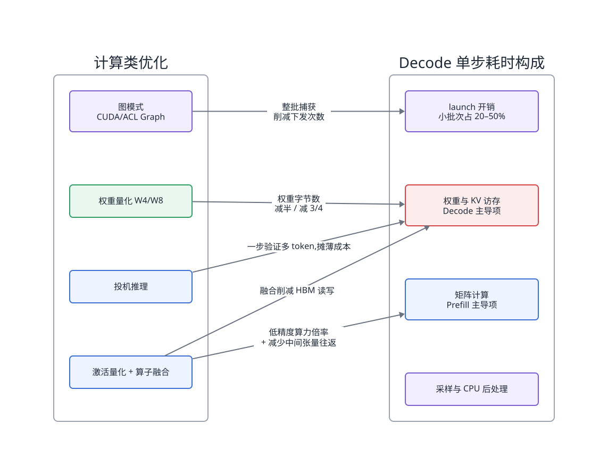
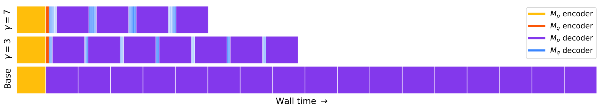
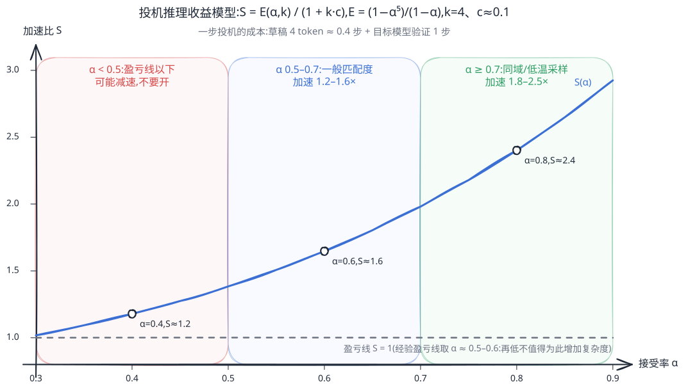
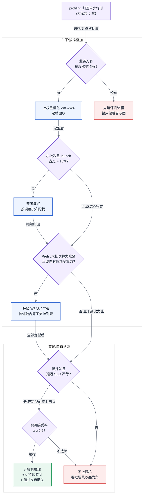

# 第 23 章 推理优化:计算类加速

## 链路定位

本章位于主线 B(一次推理请求的全链路)的 Prefill 与 Decode 计算段:在请求已经被调度器排进批次之后,本章的所有手段都在回答同一个问题——**这一步前向计算本身,还能不能更快**。按 [§22.5](第22章-推理引擎原理.md#225-加速特性三分法第五部分地图) 的加速特性三分法,本章对应"计算类":优化单步耗时。

## 依赖声明

本章建立在四条前置结论之上:[§4.3](../第一部分-基础与心智模型/第04章-硬件第一性原理、架构范式与数值精度.md#43-数值格式与精度全书唯一定义处) 的数值格式谱系与 W/A/KV 记法(本章直接使用,不再重述);[§4.4](../第一部分-基础与心智模型/第04章-硬件第一性原理、架构范式与数值精度.md#44-roofline-模型) 的 Roofline 判定——Decode 阶段是 memory-bound、Prefill 阶段的 GEMM 是 compute-bound(定量画像见 [§6.1](../第一部分-基础与心智模型/第06章-模型结构的定量分析.md#61-算子与瓶颈归属先知道钱花在哪));[§5.1](../第一部分-基础与心智模型/第05章-CUDA、CANN与加速器软件栈.md#51-cuda-执行模型与软件栈) 与 [§5.3](../第一部分-基础与心智模型/第05章-CUDA、CANN与加速器软件栈.md#53-cann-与昇腾软件栈两套完整并行的世界) 关于 kernel launch 开销、CUDA Graph 与 ACL Graph 的机制基础;以及 [§22.5](第22章-推理引擎原理.md#225-加速特性三分法第五部分地图) 的三分法地图——计算类特性与调度类、显存类特性共享同一批资源,叠加时会互相牵制。

## 问题场景

一个团队为 32B 稠密模型的对话服务做性能冲刺。他们在预发环境逐项验证了三个计算类优化:W4A16 权重量化,单请求 Decode 提速 1.7 倍;CUDA Graph,小批次单步耗时再降 22%;投机解码(草稿模型),单请求端到端再提速 1.6 倍。三项收益相乘接近 3.5 倍,团队信心十足地在生产全量开启。

结果上线当晚,高峰期吞吐不升反降 18%,P99 首 token 延迟从 900 ms 恶化到 2.4 s。排查三天,发现三个单独有效的优化在叠加后两两打架:第一,量化后的目标模型输出分布偏移,草稿模型的接受率从预发的 72% 跌到 48%,投机解码从加速变成减速——每步多算了草稿和验证,却没多产出几个 token;第二,投机解码让每步验证的张量形状随接受长度变化,CUDA Graph 的桶化捕获频繁 miss,大量请求回退到逐 kernel 下发路径,Graph 收益归零;第三,预发用单请求压测,而生产高峰批次里有几十个并发请求,验证步的额外算力需求把本来就紧张的算力挤爆,投机解码在高并发下本来就不该开。

三个优化都没有 bug,错的是叠加方式。这正是本章要解决的问题:每项计算类优化都有**收益区间**和**失效条件**,叠加有**冲突矩阵**,顺序有讲究。

## 原理与量化模型

### 单步耗时的构成:先归因,再优化

所有计算类优化的收益,都来自削减 Decode(或 Prefill)单步耗时的某一块构成。把单步耗时拆开:

$$t_{step} = t_{launch} + t_{mem} + t_{compute} + t_{post}$$

- **t_launch**:几百个 kernel 的下发与调度开销。单次 launch 数微秒,一步 Decode 典型有 300–800 个 kernel,小批次下这块可占单步耗时的 20%–50%(机制见 [§5.1](../第一部分-基础与心智模型/第05章-CUDA、CANN与加速器软件栈.md#51-cuda-执行模型与软件栈))。
- **t_mem**:访存时间,主要是权重与 KV Cache 从 HBM 读入。Decode 阶段每步都要完整扫一遍权重,这是 Decode memory-bound 的根源(见 [§6.1](../第一部分-基础与心智模型/第06章-模型结构的定量分析.md#61-算子与瓶颈归属先知道钱花在哪))。
- **t_compute**:矩阵计算时间。Prefill 阶段与大批次 Decode 由它主导。
- **t_post**:采样与 CPU 侧后处理(见 [§22.3](第22章-推理引擎原理.md#223-采样与后处理阶段)),大词表下不可忽略。

四类优化各自削减哪一块,一张图说清:

<!-- source: diagrams/ch23-gain-attribution.d2 -->

图 23-1:计算类优化的收益归因。先用 profiling(方法见 [§5.4](../第一部分-基础与心智模型/第05章-CUDA、CANN与加速器软件栈.md#54-profiling-方法论全书唯一定义处))量出四块占比,再选优化——削减一块不足 10% 的成本,再成功也只有不足 10% 的收益。

这个分解给出本章第一条纪律:**优化之前先归因**。launch 占比不高就不必上图模式;批次已大到 compute-bound,权重量化对吞吐的收益会大打折扣。问题场景里那个团队犯的第一个错,就是在没有归因的情况下把所有优化全开。

### 23.1 量化

格式谱系与 W8A8/W4A16/W4A8KV4 记法见 [§4.3](../第一部分-基础与心智模型/第04章-硬件第一性原理、架构范式与数值精度.md#43-数值格式与精度全书唯一定义处),本节只讲推理侧的量化算法、组合选型与验收。

**PTQ 与 QAT 的分界。** 训练后量化(Post-Training Quantization, PTQ)拿训好的权重直接转低精度,只需数百条校准样本、数小时工程时间;量化感知训练(Quantization-Aware Training, QAT)在训练中模拟量化误差,需要训练数据、训练算力和算法团队参与。平台侧的经验判断:**8 bit 一律先试 PTQ,4 bit 权重 PTQ 通常可用,4 bit 激活或 KV 想不掉点往往要 QAT 或至少要精细的 PTQ 算法**。QAT 的成本是一次小规模训练,这意味着它跨越了协作边界——需要算法团队投入,平台方单方面做不了。

**粒度与离群值。** 量化把一段浮点数映射到整数网格,缩放因子(scale)的统计范围就是粒度:逐张量(per-tensor)最粗、逐通道(per-channel)居中、逐组(per-group,如每 128 个元素一组)最细。粒度越细,精度损失越小,但 scale 元数据越多、反量化开销越大。LLM 量化真正的拦路虎是**离群值(outlier)**:激活张量里少数通道的数值比其他通道大一两个数量级,一个离群通道就把整个 per-tensor scale 撑大,其余数值全被压进网格的低分辨率区。主流解法两条:把离群通道的动态范围通过数学等价变换转移到权重上(SmoothQuant 一类平滑方法),或对少数离群通道保留高精度混合计算。这解释了一个平台侧常见的困惑:为什么权重量化容易、激活量化难——离群值主要在激活里。

**GPTQ 与 AWQ:同为 4 bit 权重量化,两种截然不同的算法直觉。** GPTQ 是**逐列误差补偿**:权重矩阵一列一列量化,每量化一列,就把该列的量化误差(在校准激活的加权意义下)摊到尚未量化的后续列上修正——"这一列量坏了,后面的列替它补账"。AWQ 是**激活感知缩放**:权重里只有极少数通道真正重要,而重要性不由权重数值大小决定,由它乘的激活幅值决定;于是量化前对高激活通道的权重放大缩放(激活侧等比缩小,数学等价),让它们占据整数网格的高分辨率区,其余通道承担更粗的量化。一句话对比:GPTQ 是"量坏了往后补",AWQ 是"先保住重要的"。失效场景由此分化:GPTQ 的补偿方向依赖校准激活的代表性,校准分布与线上偏移时,补偿本身就是错的,掉点比不补偿更隐蔽;AWQ 依赖"重要通道稀疏且稳定",激活分布随输入域剧烈变化的负载(多语言、多模态混合)下,固定缩放因子照顾不了所有域。两者都救不了 4 bit 以下——网格分辨率的物理上限在那里。

**SmoothQuant 类平滑方法解决的是激活量化。** 激活是逐次前向动态产生的,不能像权重那样离线精修。平滑的原理是一次**难度转移**:每个通道给激活除以平滑因子 s、给对应权重乘以同一个 s,数学等价,但激活的离群通道被压平,权重的动态范围被撑大——"激活难量化"转移成"权重稍难量化"。交易划算,因为权重可离线用任意精细粒度处理,激活只能在线粗粒度快速量化;把难度从没有回旋余地的一侧移到有回旋余地的一侧,整体误差下降。边界同样清晰:s 按校准集统计确定,离群通道位置随输入漂移则失配;转移有额度,激活离群严重到权重侧接不住时,只能退回混合精度保留离群通道。

**W / A / KV 三者分别降精度,收益完全不同:**

| 降谁 | 削减哪块成本 | 典型收益区间 | 失效条件 |
|---|---|---|---|
| W(权重)| 权重访存与权重显存 | W4:Decode 单步 1.5–2×,权重显存约 1/4;W8:1.2–1.5× | 批次增大转为 compute-bound 后吞吐收益衰减;W4 以下多数模型明显掉点 |
| A(激活)| 矩阵计算(启用低精度算力倍率)| W8A8/FP8 下 Prefill 与大批次吞吐 1.3–1.8× | 硬件无相应低精度算力单元则完全无收益;离群值处理不当直接掉点 |
| KV | 显存占用与 KV 访存 | 并发上限约 2×(8 bit),长上下文收益更大 | 收益主体属显存类(见第 24 章);对短上下文小批次几乎无感 |

这张表里最容易被误读的是 W4A16。**它的收益不来自算力,来自权重搬运减半再减半**:W4A16 的实际矩阵乘仍在 16 bit 精度上做(权重加载后在片上反量化回高精度再参与计算),低精度算力单元根本没被用到。它能带来 1.5–2× 的 Decode 提速,只因为 Decode 是 memory-bound([§4.4](../第一部分-基础与心智模型/第04章-硬件第一性原理、架构范式与数值精度.md#44-roofline-模型) 的 Roofline 判定)——每步要把全部权重从 HBM 扫一遍,权重字节数降到 1/4,t_mem 就近似降到 1/4 的权重部分。这同时解释了它的失效条件为什么是"批次增大":批次大到 compute-bound 后,瓶颈从搬运转到计算,而 W4A16 恰恰没有降低计算精度,收益自然衰减,反量化开销反而开始显形。判断一个量化方案的收益,永远先问它削的是 t_mem 还是 t_compute,再对照当前负载落在 Roofline 的哪一侧。

KV 量化还有一个表格装不下的工程选择:**scale 沿哪个维度统计**。K 与 V 的离群模式不同:K 的离群集中在少数固定通道(与位置编码的作用方式有关),适合 per-channel scale——每个通道一个缩放因子,把离群通道隔离在自己的网格里;V 的数值分布相对均匀但随 token 波动,适合 per-token scale——每个新 token 的 KV 进缓存时现算一个因子。选错方向的代价不对称:K 用 per-token 会让离群通道污染整行网格,长上下文检索类能力显著掉点;V 用 per-channel 只是精度略有浪费。多数引擎已把"K per-channel、V per-token"做成默认,平台方要做的是确认这个默认没有被某个配置项意外覆盖。

组合选型由负载画像决定:**延迟敏感、中低并发的 Decode 服务,W4A16 是性价比最高的第一步**——它正中 Decode 的访存瓶颈,又不碰难搞的激活;**高并发、Prefill 占比高的服务(如 RAG 长文档场景),W8A8 或 FP8 才能吃到算力倍率**;长上下文再叠 KV 量化。W4A8KV4 这类激进组合意味着三处精度风险叠加,只应在评测体系完备后尝试。

**工具链的定位差异**在于产物形态:GPTQ、AWQ 是权重量化算法及其社区实现,产出可跨引擎加载的量化权重;llm-compressor 一类是统一压缩管线,把量化、稀疏、蒸馏收进一个流程,产出标准化格式;TensorRT Model Optimizer 一类与特定部署栈深度耦合,收益最大但绑定最深。平台方选工具链时看的不是算法先进性,而是**产出的量化权重能不能被你的推理引擎和硬件后端原生加载**——一份不被引擎识别的量化权重,会在加载时被反量化回高精度,白做。

**校准集是量化算法的隐形输入,选错了会静默掉点。** 前面每一种精细算法——GPTQ 的误差补偿方向、AWQ 的重要通道判定、SmoothQuant 的平滑因子、KV 的 scale 统计——全部由那几百条校准样本的激活统计决定。陷阱在于失败模式是**静默的**:校准集与线上负载分布偏移(用通用语料校准、上线跑代码生成;用英文校准、上线跑中文;用短 prompt 校准、上线跑长上下文),量化流程照样跑通,困惑度照样好看,掉点只在偏移的那个域上发生,直到业务方投诉才被发现。工程纪律因此只有一条:**校准集从线上真实流量采样**(脱敏后),而不是拿算法开源仓库自带的默认语料;业务域发生结构性变化(新增语种、prompt 模板改版)时,校准要跟着重做——这与 [§23.4](#234-投机推理) 里接受率 α 要随负载漂移重测,是同一类运营义务。

**精度评估是量化上线的验收关,也是最容易做错的一环。** 困惑度(perplexity)下降不超过某个阈值只是初筛,不是验收:困惑度对局部能力塌方不敏感,数学、代码、长上下文检索这类能力可能单独掉点而困惑度几乎不动。验收必须用与线上负载同分布的下游任务评测(精度评测与性能评测的区别见 [§3.7](../第一部分-基础与心智模型/第03章-人工智能与大模型基础.md#37-评测与-benchmark-的基本概念),评测工具链见第 29 章)。两个典型陷阱:**评测集与校准集同源**——校准数据"见过"的分布上表现好是理所当然的,等于用训练集考试;**只测短序列**——量化误差随生成长度累积,短序列评测会系统性高估质量。协作边界在此必须写清:平台方负责性能收益与评测流程的执行,**"掉点是否可接受"的裁决权在业务方与算法方**;平台方替业务方拍板精度损失,是最常见的越界事故,出了问题没有人认账。

所以这对做平台的人意味着什么:量化是计算类优化里收益最确定的一项,但它是唯一**有损**的一项——平台方的职责是把"降多少精度、换多少性能、谁来验收"做成一条有据可查的流程,而不是替业务方决定模型变笨多少。

### 23.2 算子与融合

单步耗时里的 t_mem 有一部分不来自权重,而来自**中间张量在 HBM 的往返**:未融合时,LayerNorm、残差加、激活函数各是一个 kernel,每个都要把中间结果写回 HBM 再读出来。算子融合(kernel fusion)把相邻算子合成一个 kernel,中间结果驻留片上存储,同时削减了 launch 次数——它同时攻击 t_mem 与 t_launch 两块。

两块收益要分开算账。**第一笔是消除中间结果的 HBM 往返**:elementwise 算子的耗时几乎全是"读入张量 + 写回张量",三个连续 elementwise 算子融成一个,访存从六次张量读写降到两次——收益与张量大小成正比,批次越大越可观。**第二笔是减少 kernel 数**:每少一个 kernel 少一次 launch 与调度,固定每 kernel 数微秒,与张量大小无关——小批次(kernel 本身只跑几微秒)时占比最高,大批次时可忽略。同一个融合,小批次主要赚第二笔,大批次主要赚第一笔,这就是融合在几乎所有负载画像下都有收益、但收益来源不同的原因。

**FlashAttention 值得单独理解,因为它融合掉的不是几个小算子,而是一整块二次方的中间矩阵。** 朴素注意力要先算出 S=QK^T 这个 S×S 的注意力分数矩阵(S 为序列长度),写回 HBM,做 softmax,再读出来乘 V——长序列下这个中间矩阵本身就是访存与显存的大头。FlashAttention 的做法是**分块(tiling)+ 在线 softmax(online softmax)**:把 K、V 切成小块,每次只把一块载入片上存储,与 Q 的分块算出一小块分数、立即消费掉;softmax 本来需要看到整行才能归一化,在线 softmax 用"边扫边维护当前最大值与部分和、发现更大值就对已累积结果整体重缩放"的恒等变换,让归一化可以增量完成。结果是 S×S 矩阵从头到尾**没有被物化**——不写回 HBM,也不占显存。这就是它长序列 Prefill 收益 2–4 倍、且把注意力中间显存整块消掉的原理:收益随 S 增长,因为被省掉的访存量是 O(S²) 的。

> 延伸阅图:Dao et al., "FlashAttention: Fast and Memory-Efficient Exact Attention with IO-Awareness"(arXiv:2205.14135,https://arxiv.org/abs/2205.14135)图 1 —— 左侧标出了 GPU 存储层级的容量与带宽悬殊(SRAM 19 TB/s vs HBM 1.5 TB/s),中间展示 K、V 分块载入 SRAM 与 Q 分块迭代计算的 tiling 过程,一图对应上文"每次只把一块载入片上存储、S×S 矩阵从未物化"的机制。

**融合还有方向之分。** 上面讲的都是**垂直融合**:沿数据流方向把上下游算子串成一个 kernel,赚的是中间结果不落 HBM。另一条路是**水平融合**:把多个互不依赖、形状相同的小算子横向拼成一批,用一个 kernel 并行处理——典型如 MoE 里多个专家的同形状小 GEMM、多头注意力里逐头的小操作。水平融合不省中间结果访存(算子之间本无数据依赖),赚的是把一堆填不满 SM 的小 kernel 合成一个能填满的大 kernel:既省 launch,又把 GPU 利用率从"每个小算子只用几个 SM"抬到接近满载。两者适用面不重叠:垂直融合看数据依赖链,水平融合看"同形状、无依赖、单个太小"三个条件,分析 profile 时要分别识别。

**融合也会变慢,不是免费的。** 合并后的 kernel 要同时持有所有被融合算子的中间变量,寄存器与共享内存需求叠加;单线程占用寄存器越多,SM 上能同时驻留的线程束越少——occupancy 下降,GPU 靠大量并发线程掩盖访存延迟的机制被削弱,融合后反而比拆开跑更慢;寄存器溢出(spill)时更糟,等于把省掉的访存换个地方付。编译器融合因此都有启发式的"融合边界":不是能融尽融,而是在省 HBM 往返与保 occupancy 之间找平衡。遇到"开了某编译优化反而变慢",第一怀疑对象就是过度融合——profile 里单 kernel 耗时不降反升、occupancy 异常低,即可确认。

**编译与算子层的分工**(各层位置见 [§5.1](../第一部分-基础与心智模型/第05章-CUDA、CANN与加速器软件栈.md#51-cuda-执行模型与软件栈) 的软件栈图):手写专用算子(FlashAttention、FlashInfer)针对注意力这类关键路径做极致的分块与融合,长序列 Prefill 的注意力段收益 2–4 倍,且把注意力的中间矩阵从显存占用里消掉;模板库(CUTLASS 一类)提供高性能 GEMM 积木,量化 kernel 大多基于它构建;编译器路径(Triton 语言、TorchInductor)自动生成融合 kernel,覆盖手写算子之外的长尾算子。主流推理引擎已经把这三层组装好了,**平台方 90% 的情况下不写算子,但必须能判断融合有没有生效**——profile 里看到成串的细碎小 kernel(每个几微秒、访存量与计算量都很小),就是融合链断裂的信号,常见断因是模型里混入了不被识别的自定义结构。

**昇腾侧的融合特性走的是另一条物理路径。** 达芬奇架构(见 [§4.2.1](../第一部分-基础与心智模型/第04章-硬件第一性原理、架构范式与数值精度.md#421-四类范式真正的差异在编译器))把矩阵计算(Cube 单元)与向量计算(Vector 单元)分在两类物理单元上,融合因此有两种形态:**VF 融合(Vector 融合)** 把连续的向量算子(如反量化 + 残差加 + LayerNorm + 类型转换)合并为一次片上缓冲驻留,削减 Global Memory 往返,对应 GPU 侧 elementwise 融合的收益逻辑;**CF 融合(Cube 融合)** 把矩阵算子与其前后的向量处理(如 GEMM + 反量化 + 激活函数)融合成流水,让 Vector 单元在 Cube 出结果的同时就地消费,避免中间结果落回全局内存。与 GPU 侧的异同一句话:**省访存的目标相同,但 GPU 融合是在同一类计算单元内合并 kernel,昇腾融合还要跨两类物理单元编排流水**——这意味着昇腾侧融合对算子组合模式(pattern)的依赖更强,pattern 覆盖之外的结构会整段回退不融合,性能呈台阶式而非渐变式下降。收益区间:被融合 pattern 覆盖的典型 LLM 结构上,与 GPU 侧融合同量级(整网 1.2–1.6×);失效条件:模型含自定义结构打断 pattern 匹配,或量化方案与融合算子的支持列表不对齐(这正是第 12 章"第三道坎"在推理侧的具体形态)。

**自定义算子是最后手段,不是常规选项。** 开发一个生产级融合算子的成本不在首次实现(数周),而在维护税:引擎升级、驱动升级、新硬件代际,每一次都可能要求重新适配与重新验证。判断标准只有一条:该算子在端到端耗时中占比超过 15%、且社区半年内没有覆盖迹象,才值得自研;否则等待或换结构(与 [§12.2](../第二部分-算力底座/第12章-国产算力平台与异构迁移.md#122-迁移的三道坎) 缺失算子的三条出路同一逻辑)。

所以这对做平台的人意味着什么:融合是"默认开启、重在验证"的优化——你的工作不是写 kernel,而是在 profile 时间线上确认融合链完整,并在选择量化方案时确认它与融合算子的支持列表对齐。

### 23.3 图模式

CUDA Graph 与 ACL Graph 的机制在 [§5.1](../第一部分-基础与心智模型/第05章-CUDA、CANN与加速器软件栈.md#51-cuda-执行模型与软件栈)、[§5.3](../第一部分-基础与心智模型/第05章-CUDA、CANN与加速器软件栈.md#53-cann-与昇腾软件栈两套完整并行的世界) 已建立:把一步计算的几百次 kernel 下发整体捕获成图,之后每步只需一次图重放(replay),把 t_launch 从"每 kernel 一次"压成"每步一次"。两者原理同构,ACL Graph 是昇腾侧的对应物,与 [§5.3](../第一部分-基础与心智模型/第05章-CUDA、CANN与加速器软件栈.md#53-cann-与昇腾软件栈两套完整并行的世界) 图编译模式一脉相承。

收益区间可直接从归因公式读出:**launch 占比多少,收益上限就是多少**。小批次 Decode(batch 1–8)下 launch 占比 20%–50%,图模式带来 1.2–2 倍单步提速,是延迟敏感服务的必选项;批次增大后 kernel 变"胖",launch 占比降到个位数,收益趋零。失效条件由此明确:**大批次高吞吐场景,图模式近乎无收益但仍要付出代价**。

代价来自图模式与动态性的天然冲突。图捕获的是固定形状、固定地址的执行序列——replay 时不重新解析任何参数,每个 kernel 读写的显存地址在捕获那一刻就焊死在图里。这个**地址固定**要求会反向改造整个显存管理:普通动态分配器每步返回的地址都可能不同,replay 会读写到早已易主的地址上,因此图模式逼出**静态显存池**——输入、输出、所有中间激活的缓冲区按最大形状一次性预留、地址终身不变,每步只是往同一块地址填新数据。这就是为什么开图模式后显存占用是"预留制"而非"用多少占多少":你为最大桶付显存,哪怕当前批次只有它的一半。也因此,任何绕过这个池子的显存分配(自定义算子内部临时 malloc)都是图模式的隐形炸弹。

除了形状与地址,还有一类操作会**直接打断捕获**:图能录下的只有"GPU 端指令序列",凡是执行路径要回到 CPU 做决定的地方都录不进去。两类典型:**动态控制流**——依据张量运行时数值走不同分支(如按 token 值决定是否提前停止的逐样本判断),捕获时只能录下当时走的那条分支,replay 时数据变了分支不变,结果直接错;**CPU 同步点**——把张量值同步拷回 CPU 再决策(`.item()` 一类取值、条件打印、依赖数值的形状计算),捕获在此断裂,一步被切成多张小图甚至完全回退。平台方拿到一个新模型结构,判断它"图不图得动"就看这两条:前向路径里有没有数据依赖的分支,有没有偷偷回 CPU 的取值点——有,就要么改写结构(把分支改成 mask 计算),要么接受该段落在图外。

形状维度的工程折中是**桶化(bucketing)**:按批次大小(有时叠加序列长度分段)预捕获一组图,运行时向上取整到最近的桶。折中的三笔账:桶太少则 padding 浪费算力,桶太多则捕获耗时拉长冷启动(见第 25 章)且每张图占据常驻显存;落在所有桶之外的形状回退到逐 kernel 下发,性能瞬间跌回未优化水平。显存这笔账要算细:每张图的常驻成本 = 图结构本身(通常不大)+ 按该桶最大形状预留的静态缓冲区(可观,且随桶的批次档位线性增长),几十个桶叠起来能吃掉数 GB——这些显存本可以留给 KV Cache 换并发(账目归属见第 24 章)。桶的档位策略因此不是均匀切分,而是**贴着调度器的实际批次分布配**:小批次段密集布桶(1、2、4、8——padding 一个请求的相对浪费大),大批次段稀疏布桶(反正 launch 占比已低,命中不命中影响小),再拿线上批次分布的直方图核对命中率——命中率长期低于九成,说明桶表与负载已经漂移,该重配了。这解释了问题场景里的第二处冲突:投机解码让验证步形状随接受长度抖动,桶 miss 率飙升,图模式实质失效。ACL Graph 的限制同构且更严:图模式下算子的动态 shape 支持范围更窄,回退代价同样是台阶式的。

所以这对做平台的人意味着什么:图模式是小批次 Decode 的"免费午餐",但你要为它维护一张桶配置表——上线任何会改变每步张量形状的特性(投机解码、某些结构化输出实现)之前,先回答"图的桶还罩得住吗"。

### 23.4 投机推理

投机推理(speculative decoding)不削减单步的任何一块成本,而是**让一步产出多个 token,摊薄每 token 的全部成本**——这使它与前三项优化在原理上正交,却在工程上冲突最多。

机制:一个便宜的草稿(draft)先猜 k 个 token——独立小模型、或挂在主模型上的多头预测(Medusa/EAGLE 一类,省去独立模型但需一次训练适配)——目标模型再用**一次**前向并行验证这 k 个 token,接受其中前缀正确的部分。Decode 是 memory-bound 的([§6.1](../第一部分-基础与心智模型/第06章-模型结构的定量分析.md#61-算子与瓶颈归属先知道钱花在哪)),验证 k+1 个 token 的访存成本与生成 1 个 token 几乎相同,这是免费验证的来源。

> 图片来源:Leviathan et al., "Fast Inference from Transformers via Speculative Decoding", arXiv:2211.17192(CC BY 4.0),Figure 1。每行一次迭代,一次验证平均接纳数个绿色 token——直观展示了"一步产出多个 token"的机制,也可看到低熵片段(数字、固定搭配)接受得多、开放位置常被红色截断,正对应下文接受率 α 的领域依赖。

收益模型必须算,不能拍。设单次草稿成本与目标模型单步成本之比为 c(独立草稿模型典型 0.05–0.15),逐 token 接受率为 α,草稿长度 k,则一步验证的期望产出 token 数为:

$$E(\alpha, k) = \frac{1 - \alpha^{k+1}}{1 - \alpha}$$

期望加速比约为:

$$S \approx \frac{E(\alpha, k)}{1 + k \cdot c}$$

代入 k=4、c=0.1:α=0.8 时 E≈3.36,S≈2.4;α=0.6 时 E≈2.3,S≈1.6;α=0.4 时 E≈1.6,S≈1.2,已接近不值得为此增加的复杂度;α 再低,S 跌破 1,投机变减速。**经验盈亏线:α 低于约 0.5–0.6 就不要开**。而 α 不是模型属性,是"草稿-目标-负载"三元组的属性,三个因子分别作用:**分布接近度**——α 本质上度量草稿分布与目标分布在真实 token 序列上的重合度,草稿与目标同源(同一模型家族的小尺寸版本,或直接从目标模型蒸馏/挂头)天然比拼凑的异构组合高一截,目标模型换量化方案等于单方面挪动了目标分布,α 应声而落;**领域匹配**——代码、结构化输出这类低熵文本,下一个 token 高度可预测,α 轻松上 0.8,开放闲聊、创意写作熵高,同一对模型 α 可能只有 0.5;**采样温度**——温度越高,目标模型自己的采样越随机,草稿再准也押不中骰子,α 随温度单调下降,贪婪解码是 α 的上界。问题场景里量化把 α 从 72% 打到 48%,正是第一个因子变了却没有重测 α。

草稿的形态也影响 E 的上限。上面的公式假设草稿是**链式**的:猜一条长度 k 的单链,链上第 i 个 token 猜错,后面 k−i 个全部作废——错误沿链传播,是 E 随 k 增长很快饱和的原因。**树形草稿**(Medusa/EAGLE 一类多头预测的自然形态)在每个位置展开多个候选、组成一棵候选树,目标模型用一次带树状注意力掩码的前向验证整棵树,接受其中最长的合法路径。收益机理是**用宽度对冲深度上的单点失败**:第 2 个位置猜错不再报废整条链,因为旁边还有兄弟分支可走,相同验证预算下期望接受长度更高。代价同样明确:树上节点数远超链长,验证步的计算与 KV 读取按节点数放大,在算力有富余的低并发下这是好交易,并发一高就把下文的算力挤占问题加倍放大——树形不改变投机的失效条件,只放大它的两头。

> 图片来源:Leviathan et al., "Fast Inference from Transformers via Speculative Decoding", arXiv:2211.17192(CC BY 4.0),Figure 5。同样的生成任务,草稿长度 γ 越大目标模型前向次数越少、总墙钟时间越短——但细蓝条(草稿开销)同比增多,这正是加速比公式里分子 E(α,k) 与分母 1+k·c 的拉锯。

<!-- source: diagrams/ch23-speculative-payoff.excalidraw -->

图 23-2:投机推理的收益模型与盈亏平衡。接受率 α 是"草稿-目标-负载"三元组的属性,任何一元变更(尤其是给目标模型上量化)都必须重测 α,低于 0.5 的盈亏线就关掉。

**与调度类特性的相互影响是投机推理最重要的失效条件。** 上述模型假设算力有富余——单请求或低并发时成立。高并发下 Continuous Batching([§22.2](第22章-推理引擎原理.md#222-批处理与调度))已把批次做大、算力占用推向饱和,此时投机的验证步要为每请求多算 k 个位置,等于把批次再放大数倍,系统从 memory-bound 被推到 compute-bound,"验证近乎免费"的前提崩塌;被拒绝的草稿 token 全是纯浪费的算力,吞吐反而下降。收益区间因此要标注前提:**低并发、延迟敏感场景 1.5–2.5×;高并发吞吐场景收益趋零乃至为负**。工程上正确的形态是把投机做成随负载自动开关的动态特性,而非全局配置。

算力挤占之外,投机与 Continuous Batching 还有一层更细的摩擦:**批内异构**。同一验证步里,批内每个请求各自掷骰子——有的接受 5 个 token,有的只接受 1 个,下一步开始时各请求的序列长度参差不齐。批式执行偏爱整齐:要么按批内最长者 padding 对齐(短接受的请求陪跑,白付算力),要么维护逐请求的变长索引(每步重排 KV 读取位置与采样偏移,CPU 侧调度逻辑复杂化,还制造了 [§23.3](#233-图模式) 说的形状抖动)。无论选哪条,接受长度的方差都会折损一部分纸面收益——批越大、请求间领域差异越大,方差越大,折损越重。这是"单请求测得 1.8×、上了批就只剩 1.3×"的常见来源之一,也是为什么投机的收益评估必须在目标并发水位下做,单请求压测的数字对生产没有参考价值。

所以这对做平台的人意味着什么:投机推理是唯一需要**持续运营**的计算类优化——α 要随模型版本、量化方案、业务域漂移而重测,开关要随并发水位自动切换;没有这套运营机制,就不要上线它。

### 23.5 叠加与冲突

四项优化(加上归属显存类但常被一起讨论的 KV 量化)两两叠加的关系,是本章最实用的产出:

| | 量化(W/A) | 算子融合 | 图模式 | 投机推理 |
|---|---|---|---|---|
| **量化(W/A)** | — | **条件增益**:需引擎提供融合的量化算子;否则独立 quant/dequant kernel 打断融合链,两头收益同时受损 | **中性偏增益**:kernel 变少变快,图更小;正交叠加 | **冲突(精度路径)**:目标模型输出分布偏移 → 接受率 α 下跌 → 必须重测 α,常需重训/重选草稿 |
| **算子融合** | | — | **增益**:融合后 kernel 数减少,图捕获更快、更稳 | **中性**:各自独立生效 |
| **图模式** | | | — | **冲突(形状路径)**:验证步形状随接受长度抖动 → 桶 miss → 回退逐 kernel 下发,图收益归零;需按投机形状扩桶,显存代价上升 |
| **投机推理** | | | | — |
| **对调度类**([§22.2](第22章-推理引擎原理.md#222-批处理与调度)) | 中性 | 中性 | 中性(批次桶需与调度批次对齐) | **冲突**:高并发下验证挤占算力,收益转负 |
| **对显存类**(第 24 章) | 增益:权重显存下降腾给 KV | 增益:FlashAttention 消掉注意力中间显存 | 轻微冲突:每张图占常驻显存 | 冲突:草稿模型/多头占显存,挤压 KV 并发 |

<!-- source: diagrams/ch23-stack-conflict.excalidraw -->

图 23-3:计算类优化的叠加冲突关系。冲突集中在投机推理一侧(红色虚线)——前三项"量化 → 融合 → 图模式"是一条可安全叠加的主干,投机是必须单独论证的支线。

冲突矩阵直接给出**优化顺序的建议路径**:

1. **先归因**([§5.4](../第一部分-基础与心智模型/第05章-CUDA、CANN与加速器软件栈.md#54-profiling-方法论全书唯一定义处)):量出 launch、访存、计算、后处理四块占比;
2. **权重量化(W8 或 W4)**:收益最确定,先过精度验收关;
3. **确认融合链完整**:选择与量化方案对齐的引擎/算子路径,profile 验证无碎 kernel;
4. **图模式**:小批次延迟敏感场景开启,配好桶表;大批次吞吐场景跳过;
5. **激活量化(W8A8/FP8)**:仅当 Prefill 或大批次算力是瓶颈、且硬件有低精度算力单元;
6. **投机推理放最后,单独论证**:在前面所有优化定型之后测 α,只在低并发延迟敏感场景开启,并建立 α 的持续监测。

顺序的逻辑只有一条:**先上不改变模型行为、不引入动态性的(融合、图),再上有损但静态的(量化),最后上既改变行为又引入动态性的(投机)**——每一步都在前一步定型的基础上验证,冲突才可被隔离定位。问题场景里的团队把这个顺序压缩成了一次全开,三处冲突同时爆发,排查成本远超逐项上线省下的时间。

把"量化在图模式之前、投机永远最后"展开成一条依赖理由链,每一环都是硬约束而非偏好:**量化决定 kernel 集合**——换量化方案等于换掉一批矩阵乘与反量化算子,融合链要按新算子重新验证;**kernel 集合决定图的内容**——图捕获的就是这串 kernel 的下发序列,量化若在图之后再动,所有桶作废重捕,前面配桶的工作全部重来,所以图模式必须等量化定型;**量化后的目标模型才是投机的"目标分布"**——α 是对着量化后的模型测的,量化在投机之后再动,α 立即失真(问题场景的第一处冲突正是倒序的代价);**投机的形状抖动是图的桶表的输入**——桶表要罩住验证步的各种接受长度,只有投机方案(k 值、树形结构)定了,扩桶才有依据。反向走任何一步,都意味着上游变更把下游已验证的结论批量作废。这条链还给出一个实用推论:**变更也要按同样的拓扑序重放**——哪怕只是把 W8 换成 W4,也要按"重验融合 → 重捕图 → 重测 α"的顺序把下游走一遍,跳过任何一环,冲突就会像问题场景那样在生产高峰期集中引爆。

所以这对做平台的人意味着什么:计算类优化的上线不是勾选功能列表,而是一条有依赖顺序的流水线;冲突矩阵应该进你的变更评审模板——任何新特性上线前,先对着矩阵问一遍"它和已开启的每一项是什么关系"。

## 方案对比

三条典型的计算类优化路线,对应三种负载画像与组织能力:

**方案 A:保守路线——权重量化(W4/W8)+ 默认融合。** 只动权重精度,依赖引擎自带的融合算子,不碰图模式与投机。收益:Decode 1.5–2×,权重显存降为 1/4–1/2,工程投入以天计。**失效边界**:高并发大批次场景下系统转为 compute-bound,权重量化的吞吐收益衰减到 1.2× 以下;Prefill 重的负载(RAG、长文档)几乎不受益——此时瓶颈根本不在权重访存。适合:中小并发的对话类服务、平台团队人力紧张、精度验收流程尚不完备的阶段。

**方案 B:吞吐路线——W8A8/FP8 全量化 + 深度融合 + 图模式桶化。** 吃满低精度算力倍率与融合收益,整网吞吐 2–3×。**失效边界**:硬件无低精度算力单元则激活量化完全无收益;离群值处理与融合算子支持列表强耦合,量化方案与引擎版本形成绑定,每次升级都要重新验证——生态成熟度不足的硬件路径上(评估维度见 [§12.7](../第二部分-算力底座/第12章-国产算力平台与异构迁移.md#127-生态作为选型变量全书唯一定义处)),这条路线的隐性人力成本可能超过硬件收益;精度风险高于方案 A,业务方没有完备评测集时不要走。适合:大流量吞吐敏感服务、有专职推理优化人力、评测体系完备的团队。

**方案 C:延迟路线——投机推理为中心,叠加 W8 与图模式。** 面向单请求生成速度,端到端 2–3×。**失效边界**:并发一高收益即转负(见 [§23.4](#234-投机推理)),因此它不是吞吐方案,把它当吞吐方案用是最常见的误用;α 依赖负载域,业务域漂移(模型版本迭代、prompt 模板改版)会静默侵蚀收益,没有 α 监测机制的团队会在收益归零后浑然不觉;与图模式的形状冲突要求引擎原生支持两者协同,自行拼装几乎必然踩问题场景里的坑。适合:低并发、强延迟 SLO 的场景——代码补全、实时语音、Agent 内部多轮调用。

没有一条路线全场景占优:A 输在天花板,B 输在门槛与绑定,C 输在并发。选型的输入是三样东西:负载画像(并发水位、Prefill/Decode 占比)、SLO 类型(吞吐还是延迟)、组织能力(有没有人持续运营精度验收与 α 监测)。

## 大数据对照

计算类加速的每一项,在大数据引擎的演进史里都有一个似曾相识的对应物——有的经验直接复用,有的只是同名陷阱。

**算子融合 ≈ Spark 的 WholeStageCodegen。** Spark 从火山模型(每行数据穿过一串虚函数调用)演进到全阶段代码生成(把多个算子编译成一个循环体),消除的是行间函数调用与中间物化;GPU 算子融合消除的是 kernel 间的 launch 与 HBM 往返。思想同构:**中间结果不落"慢存储"**(那边是内存物化,这边是 HBM)。这条经验直接复用,连诊断方法都一样——看到执行计划/时间线上碎片化的小算子,就是融合断链。

**量化 ≈ 列存编码压缩,但多了一个致命维度。** Parquet/ORC 用字典编码、位打包把数据压小,换来更少的 IO 和更快的扫描,与量化"字节数换带宽"的账完全同构。但列存压缩是**无损**的,量化是**有损**的——大数据时代不存在"压缩后查询结果变差 2%"这种事,因此那个时代没有沉淀出"精度验收"这道流程。这是 AI 场景的新增环节,也是大数据背景的平台工程师最容易漏掉的一道关:他们的肌肉记忆里,压缩是纯粹的工程决策,不需要业务方签字。

**投机执行 vs 投机推理:同名反义。** Hadoop 的 speculative execution 是对冲**慢节点**:同一 task 起两个副本,谁先完成用谁,副本之间毫无依赖,浪费的只是本来闲置的资源。投机推理是对冲**串行依赖**:草稿与验证有严格的先后与数据依赖,浪费的是被拒绝草稿消耗的紧缺算力。前者几乎无害可默认开启,后者有明确的盈亏线与并发失效条件。把 Hadoop 时代"投机开着总没坏处"的直觉带进推理系统,正是问题场景那类事故的认知根源。

**图模式 ≈ 执行计划缓存。** 数据库的 PreparedStatement 与 Spark 的计划缓存摊薄的是优化器开销,CUDA Graph 摊薄的是 kernel 下发开销,同为"把一次性构建成本摊到多次执行"。失效条件也同构:计划缓存怕参数分布漂移(计划失配),图模式怕形状漂移(桶 miss)。这条方法论直接复用:**任何缓存执行结构的机制,都要同时设计失配时的回退路径与失配率监控**。

## 选型决策树

图 23-4:计算类优化的上线顺序决策树。主干"量化 → 融合验证 → 图模式 → 激活量化"可按序安全叠加,投机推理永远是最后单独论证的支线,且必须在其余配置全部定型之后测接受率。

---

读完本章,你应当能:对任意一个推理服务,先用归因方法量出单步耗时中 launch、访存、计算、后处理的占比,再按 SLO 与精度约束排出一条明确顺序的计算类优化路径;能用收益模型算出投机推理在给定接受率与并发水位下是加速还是减速;能对照冲突矩阵,在任何新优化上线前判断它与已开启特性的冲突面,并说清昇腾侧 VF/CF 融合与 ACL Graph 在这条路径上对应的位置与额外约束。
