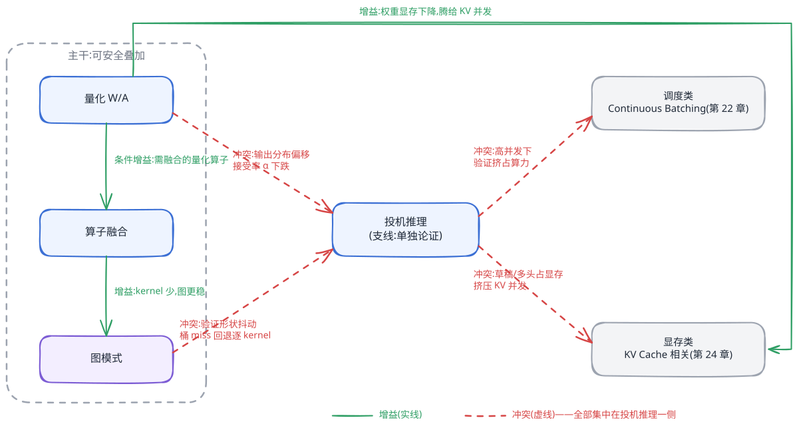
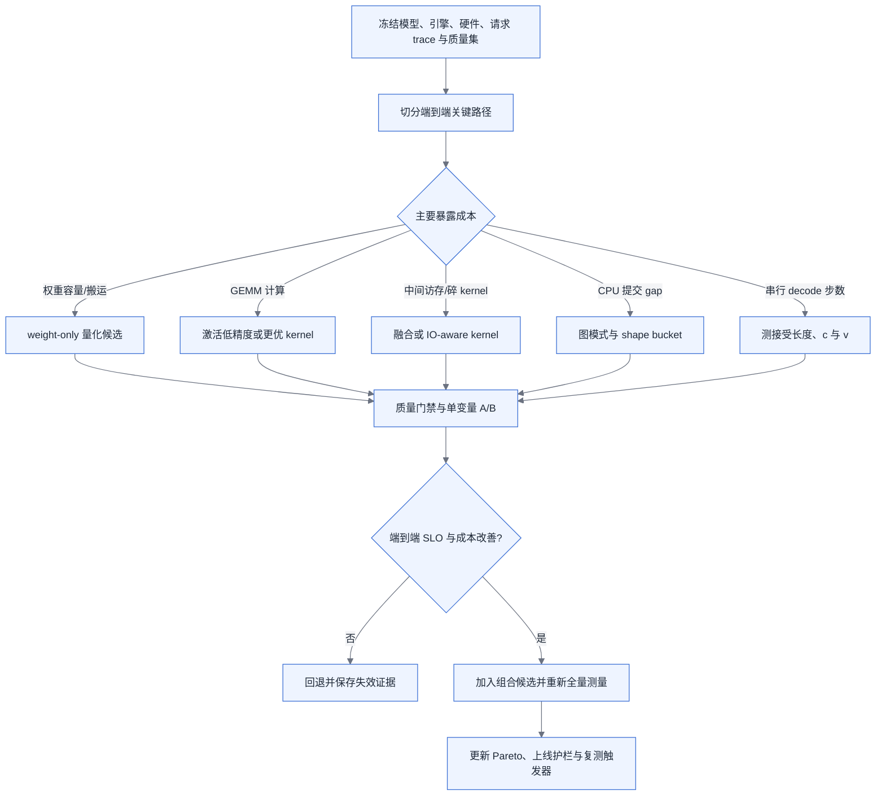

# 第 23 章 推理优化:计算类加速

<ChapterContext
  track="主线 B 的 Prefill、Decode 与采样计算段"
  question="怎样从目标负载的关键路径出发，判断量化、融合、图模式和投机推理能否改善端到端 SLO？"
  upstream="第 4 章精度与 Roofline；第 5 章运行时与 profiling；第 22 章推理调度、显存账和阶段指标"
  downstream="第 24 章服务化与显存类加速；第 25 章弹性与多模型；第 29 章评测流水线"
  inputs="模型与引擎版本、硬件、精度、请求分布、并发/调度、kernel 时间线、图命中率、质量评测与成本"
  outputs="瓶颈归因、候选实验矩阵、质量—吞吐—延迟 Pareto、叠加冲突证据和上线回退条件"
/>

## 链路定位

计算类优化改变一次 Prefill、Decode 或验证步骤的执行方式，但用户看到的是排队、调度、计算、传输和后处理共同形成的 TTFT、TPOT 与端到端吞吐。单 kernel 加速、离线模型跑分和单请求 latency 都不能自动外推为生产收益。

本章不按优化名词排功能清单，而是按证据顺序组织：冻结负载，找关键路径，提出一个优化假设，验证质量与资源变化，再在目标并发下比较端到端结果。

## 依赖声明

[§4.3](../第一部分-基础与心智模型/第04章-硬件第一性原理、架构范式与数值精度.md#43-数值格式与精度全书唯一定义处) 定义 W/A/KV 精度记法，[§4.4](../第一部分-基础与心智模型/第04章-硬件第一性原理、架构范式与数值精度.md#44-roofline-模型) 提供算术强度分析，[§5.4](../第一部分-基础与心智模型/第05章-CUDA、CANN与加速器软件栈.md#54-profiling-方法论全书唯一定义处) 定义 profiling 证据，[§22.4](第22章-推理引擎原理.md#224-引擎剖析方案对比) 给出容量和调度模型。

机制依据采用原始论文与官方文档：FlashAttention 通过 tiling 减少 HBM 与片上存储之间的读写，并保持 exact attention 语义，见 [FlashAttention 论文](https://arxiv.org/abs/2205.14135)；SmoothQuant 把激活量化难度迁移到权重侧，见 [ICML 论文](https://proceedings.mlr.press/v202/xiao23c.html)；CUDA Graph 的 allocation 地址在图生命周期内固定，见 [CUDA Programming Guide](https://docs.nvidia.com/cuda/cuda-programming-guide/04-special-topics/cuda-graphs.html)；投机解码在正确采样协议下保持目标分布，见 [Leviathan 等人的论文](https://arxiv.org/abs/2211.17192)。这些论文中的加速比只对应其测试环境，本章不移植为生产基准。

## 问题场景

<CaseMeta
  type="synthetic-case"
  data-nature="模型规模、单项收益和线上退化叙事均替换为合成实验设计，不代表真实事故或产品性能"
  scope="一个同时评估量化、图模式和投机解码的对话服务"
  assumptions="候选必须冻结模型、引擎、硬件、请求长度、采样参数、调度策略、并发水位、质量集与统计窗口"
  reproducible="visuals/data/ch23-pareto.csv；visuals/data/ch23-kernel-timeline.csv；visuals/data/ch23-speculative-payoff.csv"
/>

团队分别在三个不相同的窗口测量优化：量化跑离线固定 batch，图模式跑短序列单请求，投机解码跑低温度样本；随后把三者的加速比相乘，作为生产容量承诺。这个结论既不可复现，也无法审计，因为三个实验的分母、负载与质量门禁都不同，而且优化叠加会改变 kernel 集合、shape 分布、显存余量和投机接受行为。

正确实验将每个候选与同一基线配对。每轮只改变一个因素，先通过输出与业务质量门禁，再在目标到达过程下记录 TTFT/TPOT 分位数、有效 token/s、请求成功率、峰值显存、功耗和单位有效 token 成本。组合候选需要重新测量，不把单项比值相乘。

<EvidencePanel
  title="单项加速比不可相乘"
  conclusion="只有共同基线、共同负载和共同质量门禁下的端到端 A/B 结果可以进入容量承诺；kernel、graph 与接受率指标用于解释差异。"
  source="synthetic-case；§23.5"
>

- 已知：三个机制在各自实验中改变了局部指标。
- 必须补采：同一请求 trace、目标并发、组合配置、质量结果、图命中/回退、接受长度与显存峰值。
- 暂不能断言：收益可叠加、哪个机制导致退化，或生产应该全局开启哪一项。

</EvidencePanel>

## 原理与量化模型

### 单步耗时的构成:先归因,再优化

`t_launch + t_mem + t_compute + t_post` 适合列出来源，却不一定能直接相加：内存访问与计算可能在同一 kernel 内重叠，CPU 下发也可能与设备执行流水。生产归因应先从墙钟关键路径切成互斥区间：CPU/调度 gap、设备 kernel、跨设备通信、采样/后处理和不可解释空洞；再用 Roofline、硬件计数器与 kernel 属性解释设备区间。

<!-- source: diagrams/sources/ch23-gain-attribution.d2 -->

图 23-1:不同机制瞄准不同成本来源；箭头表示优化假设，不代表该成本一定暴露在端到端关键路径。

若某个互斥区间占基线时间比例为 `f`，该区间自身加速 `s`，且其他区间不变，Amdahl 上界为：

> `S_total ≤ 1 / ((1-f) + f/s)`

这只是单变量上界。优化若改变 batch、显存容量、调度或质量，`f` 本身也会变化，必须回到端到端实测。

<BookFigure
  id="ch23-kernel-timeline"
  src="../visuals/generated/ch23/kernel-timeline.svg"
  alt="合成 kernel 时间线对比优化前的三次 launch、两次中间张量往返和多个小算子，与优化后的单次 launch 和融合 kernel"
  title="图 23-2  融合收益要在时间线上落到被删除的 gap 与访存"
  caption="合成微秒数只展示归因结构；目标模型必须同时检查融合 kernel 时长、occupancy、spill 和端到端 step。"
  source="合成时间线；visuals/data/ch23-kernel-timeline.csv"
  license="CC BY 4.0"
  width="wide"
/>

### 23.1 量化

量化候选先回答“减少了什么”：权重位宽主要改变权重容量和搬运；激活位宽可能改变 GEMM kernel 与算力路径；KV 位宽改变 cache 容量、读写和 attention kernel。仅凭 W4/W8 名称无法得到加速比，因为打包格式、scale/zero-point、group size、反量化融合、padding 和目标硬件 kernel 都会改变实际字节与计算。

权重 payload 的理论下界为：

> `weight_payload_min = parameter_count × bits_per_weight / 8`

运行时占用还要加 scale、zero-point、对齐、重复权重、workspace 和引擎元数据。性能则测 prefill/decode 分段；权重搬运占关键路径时 weight-only 量化更可能有效，计算或 KV 访问主导时收益可能很小。

PTQ、GPTQ、AWQ、SmoothQuant 或 QAT 是质量—实现候选，不是固定精度等级的唯一答案。校准集应覆盖线上语言、领域、prompt 模板、输入/输出长度和采样配置，但不能与最终验收集重合。验收同时保存：总体质量、关键切片、长生成、结构化输出、拒答/安全行为和重复运行的不确定性。

量化上线采用双门禁：先比较质量差异及置信区间，再在完全相同的调度和请求 trace 下比较性能。若模型、校准分布、引擎、kernel、硬件或采样参数变化，原有质量与性能证据都进入复测清单。

<BookFigure
  id="ch23-pareto"
  src="../visuals/generated/ch23/pareto.svg"
  alt="五个合成优化候选在业务质量保留率和有效吞吐平面上分布，点的颜色表示归一化尾延迟，展示候选之间没有单一全局最优"
  title="图 23-3  质量、吞吐与尾延迟必须联合形成 Pareto"
  caption="所有数值均为合成工作表；生产候选只有通过最低质量和成功率门禁后才参与性能排序。"
  source="合成容量示例；visuals/data/ch23-pareto.csv"
  license="CC BY 4.0"
  width="wide"
/>

### 23.2 算子与融合

垂直融合可减少中间张量落回 HBM 和 launch，水平融合可把多个独立小工作合成更饱满的 kernel。是否加速取决于被删除的流量和 gap 是否暴露，以及融合后寄存器、共享内存、occupancy、指令组合和编译时间。

FlashAttention 是 IO-aware 的 exact attention 算法：分块计算并用 online softmax 避免物化完整 attention score 矩阵。它不意味着任意序列、mask、head 结构和硬件都获得相同收益；目标后端是否命中对应 kernel、数值容差和工作区峰值都需验证。

融合回归按时间线诊断：先确认算子语义和 shape 相同，再比较 kernel 数、CPU gap、HBM bytes、单 kernel 时长、occupancy 与 spill。kernel 数下降但端到端变慢时，可能是资源压力、fallback、同步点或更差的调度，而不是“融合一定有效”。

自定义 kernel 的门槛由期望端到端收益和维护全成本决定。把关键路径占比 `f`、可实现局部加速 `s` 代入 Amdahl 上界，再与开发、数值验证、硬件代际和引擎升级维护成本比较；不使用固定占比或固定开发周期判定。

### 23.3 图模式

图模式把稳定的 GPU 工作提交结构复用，主要减少 CPU launch 与调度 gap。CUDA Graph 要求 replay 期间相关操作、地址和依赖满足捕获约束；官方文档说明 graph allocation 在图生命周期内地址固定。图结构之外的动态控制流、CPU 同步和动态分配可能要求改写、更新图或回退。

动态负载通常使用 shape bucket。每个 bucket 的账包含命中请求占比、padding 工作、捕获/预热时间、常驻显存、更新失败和 fallback 性能。bucket 不是越多越好：更多 bucket 可能提高命中，却挤压 KV cache、延长冷启动并增加运维状态。

图模式验收至少记录：

| 证据 | 说明 |
|---|---|
| graph hit / update / fallback | 区分真正 replay 与回退路径 |
| shape 与 batch 直方图 | 解释 bucket 覆盖和 padding |
| capture 前后显存峰值 | 量化静态池对 KV 并发的挤压 |
| CPU gap 与设备时间线 | 判断 launch 是否原本在关键路径 |
| TTFT/TPOT 与吞吐分位数 | 防止局部 step 改善被排队抵消 |

模型结构、量化 kernel、投机方案或调度 batch 改变时，图内容和 bucket 分布都可能失效，需按变更影响复测，而不是永久沿用首次捕获结果。

### 23.4 投机推理

投机解码用草稿成本换取一次目标验证产出多个 token。正确采样协议可以保持目标模型分布；性能收益则取决于草稿—目标—负载—采样配置和验证实现。

对链式草稿长度 `k`、逐 token 接受概率近似为常数 `α` 的简化模型，一次迭代期望产出为：

> `E(α,k) = (1 - α^(k+1)) / (1 - α)`

令单个草稿 token 成本相对基线目标 step 为 `c`，目标并行验证 `k+1` 个位置的成本比为 `v`，理想加速近似为：

> `S_ideal ≈ E(α,k) / (k×c + v)`

原章把 `v` 隐含固定为 1，又给出与该公式不一致的通用接受率阈值。实际上 `v` 会随 batch、序列长度、树/链结构、kernel、图命中和并发改变；盈亏点必须使用目标负载实测的 `c`、`v` 与接受长度分布求解。

<BookFigure
  id="ch23-speculative-payoff"
  src="../visuals/generated/ch23/speculative-payoff.svg"
  alt="草稿长度四、草稿单 token 相对成本零点一时，投机加速比随接受率升高；验证成本从一增至一点五后，曲线整体下移且盈亏点右移"
  title="图 23-4  接受率相同，验证成本也能改变投机盈亏"
  caption="两条曲线来自简化独立接受模型；生产评估使用实际接受长度分布、批内 padding、调度和端到端时间。"
  source="公式生成；visuals/data/ch23-speculative-payoff.csv"
  license="CC BY 4.0"
  width="wide"
/>

接受率本身仍不充分。还需记录每请求接受长度分布、草稿和验证时间、验证 token 数、被拒 token 算力、batch padding、KV 读写、图回退及分领域/温度切片。高并发不必然使投机为负，低并发也不保证获益；判断标准是目标到达过程下的有效 token/s 与延迟 SLO。

### 23.5 叠加与冲突

叠加关系是条件判断，不是固定“安全主干”：

| 组合 | 可能增益 | 可能冲突 | 必须重测 |
|---|---|---|---|
| 量化 × 融合 | fused quant/dequant 减少搬运与 launch | kernel 缺失、scale 处理打断融合 | kernel 列表、质量、HBM bytes |
| 量化 × 图模式 | 稳定 kernel 序列可捕获 | kernel 集合、workspace 与地址变化 | capture、显存、fallback |
| 量化 × 投机 | 草稿或目标更便宜 | 目标/草稿分布与接受行为变化 | 质量、接受长度、`c`/`v` |
| 融合 × 图模式 | kernel 数与提交节点减少 | 融合后资源压力或捕获不支持 | CPU gap、occupancy、graph hit |
| 图模式 × 投机 | 稳定验证 shape 可复用 | 接受长度与树结构扩大 shape 空间 | bucket、padding、常驻显存 |
| 投机 × 调度 | 多 token 摊薄串行步数 | 验证计算与批内异构改变排队 | TTFT/TPOT、吞吐、成功率 |

<!-- source: diagrams/sources/ch23-stack-conflict.excalidraw -->

图 23-5:旧图保留用于枚举依赖边；颜色不能替代矩阵中的目标版本实测，量化、融合与图模式之间同样可能冲突。

上线采用增量实验而非永久顺序：从当前关键路径选择候选，单变量验证；组合后重新跑完整质量和负载矩阵。任何模型、引擎、kernel、调度、硬件或请求分布变更，都按影响图标记需复测的下游证据。

## 方案对比

| 路线 | 进入条件 | 主要证据 | 退出条件 |
|---|---|---|---|
| Weight-only 量化 | 权重容量/搬运暴露且有目标 kernel | 质量切片、实际 packed bytes、decode 时间线 | 质量失败、dequant/fallback 抵消收益 |
| 激活低精度 | GEMM 计算暴露且硬件/引擎命中低精度 kernel | kernel dtype、算力利用、prefill/吞吐 | fallback、scale 开销或质量失败 |
| 融合/IO-aware kernel | 中间访存或 launch gap 暴露 | 前后时间线、HBM bytes、occupancy | spill、资源压力或 shape 不支持 |
| 图模式 | CPU 提交在关键路径且 shape 可覆盖 | hit/fallback、bucket、静态显存、尾延迟 | 低命中、KV 挤压或动态控制流 |
| 投机解码 | 实测 `E/(kc+v)>1` 且满足延迟/吞吐目标 | 接受长度、草稿/验证成本、调度与质量 | 分领域负收益、排队恶化或复杂度超预算 |

候选最终进入同一 Pareto，而不是按“保守、吞吐、延迟”预先指定赢家。业务质量和请求成功率是门禁，剩余候选按 SLO 与单位有效产出成本选择。

## 大数据对照

可迁移的方法是执行计划归因、算子合并、中间物化削减、计划缓存及缓存失配监控。GPU fusion 与 WholeStageCodegen 都试图减少边界成本，但一个受寄存器/共享内存/occupancy 约束，另一个受代码生成、分支和数据格式约束，不能用同一加速比类比。

量化与列存编码都减少数据搬运，但量化可能改变模型输出分布，因此必须增加质量门禁。图模式与执行计划缓存都要监测命中和 fallback，但 CUDA Graph 还绑定设备操作与地址约束。投机推理与批处理 speculative execution 只有“先做额外工作换关键路径缩短”这一抽象相似，资源、状态和正确性协议并不相同。

最值得复用的是实验纪律：同一输入快照、同一 SLO、单变量变更、执行计划/时间线证据、回退路径和版本升级回归。

## 选型决策树

图 23-6:先按暴露成本提出候选，再经过质量和端到端门禁；组合配置被视为新候选，不继承单项加速比。

<ChapterDeliverables :items="[
  '一份冻结模型、引擎、硬件、请求 trace、并发、采样和质量集的实验声明',
  '一张互斥关键路径及 kernel/graph/HBM 证据表',
  '一组分别覆盖 Prefill、Decode、低/高并发和业务切片的单变量与组合实验',
  '一张通过质量与成功率门禁后的质量—吞吐—尾延迟—成本 Pareto',
  '一份投机解码接受长度、草稿成本 c、验证成本 v、图回退和调度影响账',
  '一套上线开关、回退条件以及模型/引擎/kernel/负载变化后的复测触发器'
]" />
