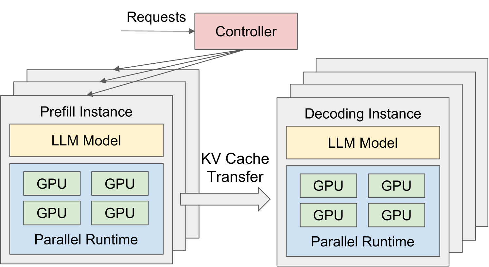
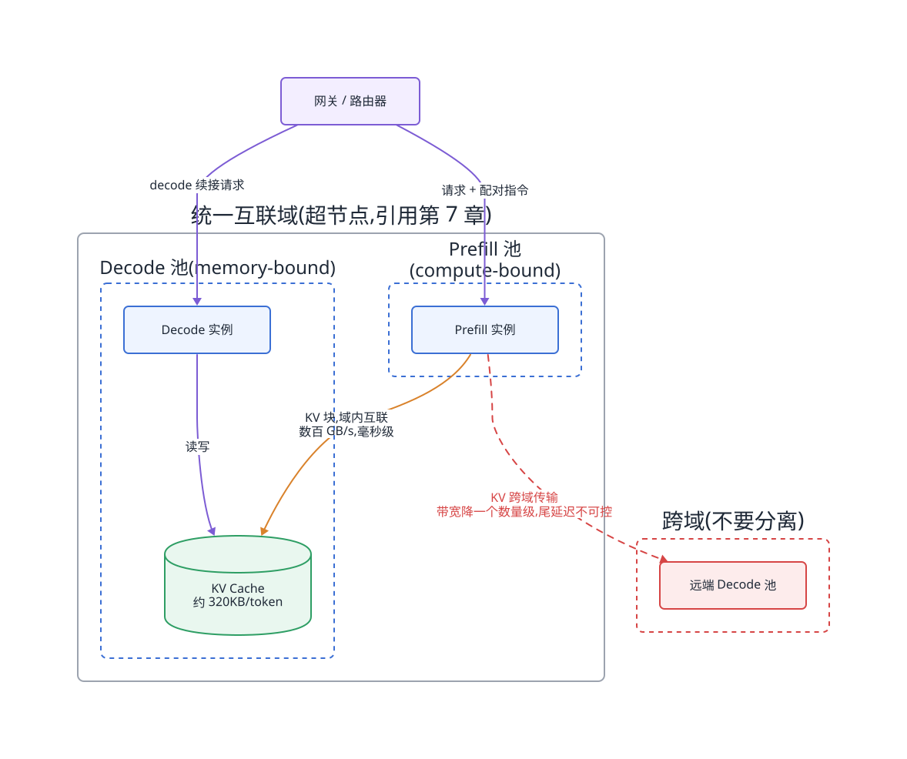
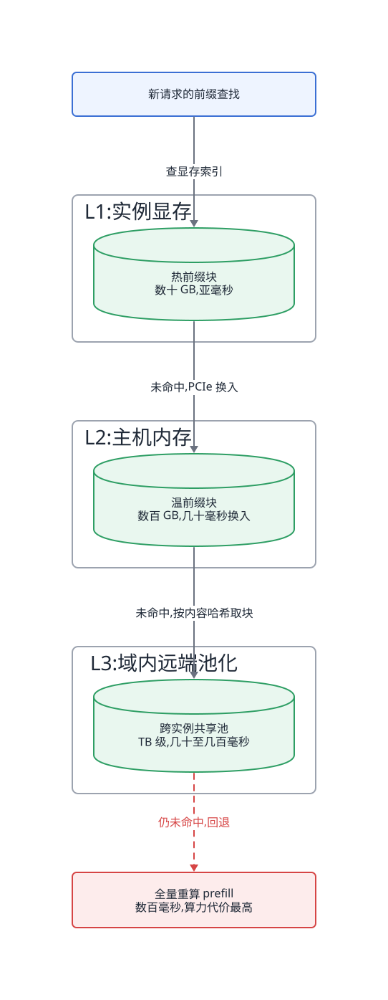
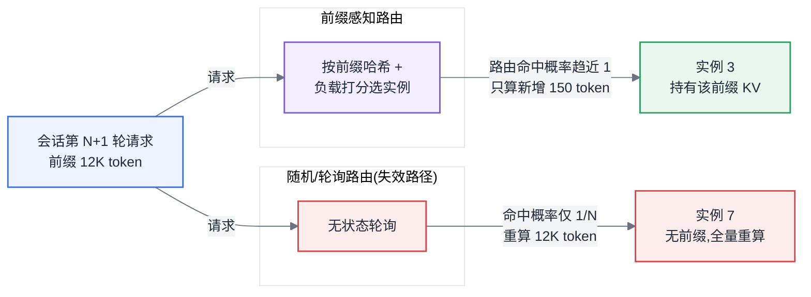
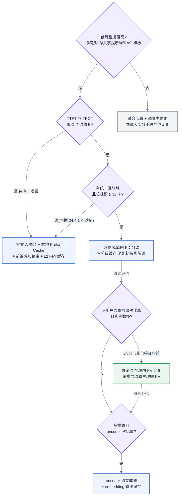

# 第 24 章 服务化架构与显存类加速

## 24.1 路由决定 KV 能否真正复用

本章位于主线 B「一次推理请求的全链路」的中段偏前:请求经过网关之后、进入引擎之前的**路由与部署形态决策**,以及进入引擎之后 KV Cache 的**复用与共享**。按 [§22.6](第22章-推理引擎原理.md#226-加速特性三分法第五部分地图) 的加速特性三分法,本章覆盖的是**显存类**加速——优化的目标不是单步耗时,而是**并发上限与算力复用率**;同时,本章也是推理侧架构设计的落脚点:PD 分离、多级缓存、前缀感知路由这三件事共同决定了一个推理服务的部署形态。

## 24.2 所有收益都要比较传输与重算

本章建立在三条前置结论之上:[§3.4](../第一部分-基础与心智模型/第03章-人工智能与大模型基础.md#34-transformer-与注意力) 给出了 KV Cache 的由来(自回归解码必须缓存历史 K/V),[§6.2](../第一部分-基础与心智模型/第06章-模型结构的定量分析.md#62-参数量与资源换算核心) 给出了 KV Cache 随 batch × seqlen 线性增长的换算公式,第 7 章给出了「卡间/域内/跨域」三级拓扑与域边界上带宽断崖式下跌的事实。本章所有收益模型,本质上都是把这三条结论代入「传输代价 vs 重算代价」这一个不等式。

## 24.3 问题场景

> **案例元数据**
> - **案例类型**:合成案例
> - **数据性质**:示意
> - **来源或复现**:无(见声明);登记为 `CLM-024-002`
> - **适用边界**:多轮对话类推理负载与自建推理服务团队,机制讨论不依赖具体数值
> - **声明**:人物、机构、日期与数值均为写作构造的示意,用于说明方法,不构成真实事故记录

<!-- claim: CLM-024-002; classification: illustrative -->
一家做企业知识助手的团队,把 70B 模型用 vLLM 部署成 12 个实例(每实例 4 卡 TP),前面挂一个标准的轮询负载均衡器。上线三个月后,他们发现两组互相矛盾的数字:一方面,GPU 算力利用率长期在 75% 以上,扩容申请理直气壮;另一方面,财务侧按 token 折算的单位成本是竞品 API 报价的三倍多。

平台工程师做了一次请求画像,结果令人难堪:该服务是典型的多轮对话负载,平均每个会话 9 轮,每轮请求携带完整历史——系统提示词约 1,800 token,加上逐轮累积的对话历史,到第 9 轮时 prompt 已达 12K token,而每轮新增的用户输入平均只有 150 token。也就是说,**每一轮 prefill 中约 98% 的 token 是上一轮已经算过的前缀**。按全天流量加权,集群约 70% 的算力花在重算已经算过的内容上。

更让人困惑的是:引擎明明开着 Prefix Cache,单实例压测时命中率能到 80%,为什么生产环境命中率只有 11%?排查了两周才定位到原因:轮询负载均衡把同一会话的第 N 轮和第 N+1 轮请求发往了不同实例,前缀 KV 明明躺在 3 号实例的显存里,请求却被路由到了 7 号实例——**缓存没有失效,是路由让缓存变得不可见**。这个案例里,浪费的七成算力不是引擎问题,不是模型问题,是服务化架构问题。本章要解决的就是这一层。

## 24.4 原理与量化模型

### 24.4.1 PD 分离:动机、传输代价与适用判断

Prefill 与 Decode 是资源画像完全相反的两个阶段([§6.1](../第一部分-基础与心智模型/第06章-模型结构的定量分析.md#61-算子与瓶颈归属先知道钱花在哪)):Prefill 是 compute-bound 的大矩阵乘,Decode 是 memory-bound 的逐 token 循环。融合部署时,两者共享同一批卡,互相干扰的形式是:一个长 prompt 的 prefill 会拖高同批 decode 请求的 TPOT(Chunked Prefill 只能缓解,见 [§22.2](第22章-推理引擎原理.md#222-批处理与调度));反过来,为了保护 TPOT 而限制 prefill 并发,又会拖高 TTFT。**PD 分离(Prefill-Decode Disaggregation)的动机,是把两个 SLO 解耦到两个独立扩缩的资源池,让 Prefill 池按 TTFT 配卡、Decode 池按 TPOT 与并发配卡。**

> 图片来源:Zhong et al., "DistServe: Disaggregating Prefill and Decoding for Goodput-optimized Large Language Model Serving", arXiv:2401.09670(CC BY-SA 4.0),Figure 6。这张原始架构图正是上一段论点的最小实现:两池独立、各配并行策略,中间只剩一条 KV Cache 传输通道——分离成不成立,全看这条通道的代价。

分离的代价是 KV Cache 必须从 Prefill 实例传输到 Decode 实例。每 token 的 KV 体积:

$$b_{kv} = 2 \times L \times n_{kv} \times d_{head} \times b_{prec}$$

其中 L 为层数,$n_{kv}$ 为 KV 头数(GQA 下远小于注意力头数),$d_{head}$ 为每头维度,$b_{prec}$ 为每元素字节数。以一个 80 层、8 个 KV 头、head_dim 128、FP16 的 70B 级模型为例,$b_{kv} = 2 \times 80 \times 8 \times 128 \times 2 \approx 320\ \text{KB/token}$ 。一个 4K token 的 prompt,需要传输约 1.3 GB。

这 1.3 GB 走什么链路,决定了 PD 分离成不成立:

| 传输链路 | 有效带宽量级 | 4K prompt 传输耗时 |
|---|---|---|
| 域内统一互联(超节点内) | 数百 GB/s | 数毫秒 |
| 机内 PCIe 中转 + 跨机 RDMA(400G) | 约 40–50 GB/s | 约 25–35 ms |
| 普通以太网跨机 | 约 10 GB/s | 约 130 ms |

对比参照物是重算这段 prefill 的耗时:按推理 2N FLOPs/token([§6.2](../第一部分-基础与心智模型/第06章-模型结构的定量分析.md#62-参数量与资源换算核心)),70B 模型 4K token 的 prefill 在一台八卡机上约需数百毫秒。所以**传输几乎总是比重算便宜,PD 分离的瓶颈从来不是「传得慢不慢」,而是传输的调度复杂度与两池配比失衡的风险**:Prefill 池空转时 Decode 池排队,或者反过来,分离反而放大了资源错配。

**传输的时机有两种,决定了这几十毫秒落不落在 TTFT 上。** 第一种是**整体推送**:prefill 全部算完后,把整段 KV 一次性推给 Decode 实例。实现最简单——一次大块连续传输,带宽利用率高,引擎只需在请求边界埋一个钩子;代价是传输时间完整地串在 TTFT 关键路径上。第二种是**逐层流水**:利用一个结构性事实——第 i 层的 KV 在第 i 层前向算完后就是最终值,不会被后续层修改。于是算完第 i 层立即开始传第 i 层的 KV,与第 i+1 层的计算重叠;prefill 结束时,只剩最后一层的 KV 在途,暴露在关键路径上的传输时间从「整段」缩到「1/L 段」。流水成立的判据是**每层传输耗时 < 每层计算耗时**,即链路带宽 > 整段 KV 体积 / prefill 计算总耗时——按上面的例子约 4.3 GB/s,门槛很低;代价是引擎要在算子调度层与传输库深度耦合。取舍因此很清楚:域内互联下整体推送本来就只有几毫秒,流水没有必要;跨机 RDMA 下 25–35 ms 会吃掉 TTFT 预算的一大块,逐层流水把它藏进计算才值得做——**流水是给「链路不够好但又想分离」的场景兜底的,不是默认选项**。

**两池配比有一个可以直接套的估算式。** 设平均输入长度 $L_{in}$ 、平均输出长度 $L_{out}$,Prefill 侧单卡吞吐 $T_P$(token/s,compute-bound,由算力决定)、Decode 侧单卡吞吐 $T_D$(token/s,memory-bound,由显存带宽与并发决定),则每个请求在两侧消耗的卡·秒之比就是稳态配比:

$$\frac{N_P}{N_D} = \frac{L_{in} \times (1-h) / T_P}{L_{out} / T_D}$$

分子里的 $(1-h)$ 是 Prefix Cache 命中后的有效 prefill 量——命中率再一次显式地进入了容量公式(下一节的算例正是这个式子的完整实例化)。这个式子同时暴露了 PD 分离最大的运维风险:**配比是按某个流量画像算出来的,而画像会漂移**。日间文档问答($L_{in}:L_{out}$ ≈ 8:1)与夜间批量生成(≈ 1:2)对应的最优配比差好几倍;命中率的波动(某个大客户换了提示词模板)同样直接改写分子。融合部署天然自适应这种漂移——每张卡两种活都干;分离部署则必须有再平衡机制:要么按周期画像预调配比,要么维持一小部分「可翻转」实例在两种角色间切换。翻转不是免费的——排干在途请求、重建调度状态,分钟级——所以配比要按尾部画像留余量,而不是按均值配平。**没有再平衡能力的团队不要做 PD 分离,画像一漂,分离的收益会整体变成负数。**

分离还有一笔常被漏算的收益:**两侧可以独立选择并行策略与量化档位**。融合部署时,一套并行配置要同时伺候两种资源画像,注定两头折中;分离后,Prefill 侧按算力配——较小的 TP 度加流水并行都可接受,因为 prefill 对单步通信延迟不敏感;Decode 侧按显存带宽与容量配——更大的 TP 度摊薄每卡权重读取量、直接压低 TPOT([§6.1](../第一部分-基础与心智模型/第06章-模型结构的定量分析.md#61-算子与瓶颈归属先知道钱花在哪) 的瓶颈归属在两池分别成立)。量化档位同理:prefill 用较高精度算出 KV 保住数值质量,传输时降精度、Decode 侧按低精度存储——KV 量化的显存收益全部落在 Decode 池,而质量代价由 prefill 侧的高精度计算兜住。这种「一侧一策」是融合部署在结构上做不到的,评估分离收益时应当把它算进去,而不是只算 SLO 解耦。

**明确的适用判断**(不要含糊):同时满足以下四条才考虑 PD 分离——

1. **总规模 ≥ 32 卡**(两个池各自都要有冗余度,16 卡以下分离后单池太小,任何一台故障就打穿 SLO);
2. **平均 prompt 长度 ≥ 2K token 或输入输出比 ≥ 4:1**(prefill 占比不高时,分离解耦不出多少东西);
3. **TTFT 与 TPOT 的 SLO 同时收紧**(只有一个紧,用 Chunked Prefill + 优先级调度就够了);
4. **KV 传输链路带宽 ≥ 40 GB/s 量级**(否则传输时延本身就吃掉 TTFT 预算)。

四条里任何一条不满足,融合部署 + 调度类优化是更好的答案。单机 8 卡的服务做 PD 分离,在 2026 年没有任何理由。

### 24.4.2 域内 PD 分离:超节点改写收益模型【重点】

第 7 章的核心结论是:超节点把拓扑从「机内/跨机」两级改写为「卡间/域内/跨域」三级,统一互联域内任意两卡之间的带宽是跨域 RDMA 的一个数量级以上。把这个结论代入 PD 分离的收益模型,发生的变化是结构性的:

**域内分离时,KV 传输代价从「毫秒级、需要精心流水化隐藏」跌到「亚毫秒到毫秒级、近似免费」。** 上表第一行,4K prompt 的传输耗时压到数毫秒,与一次 decode 步的耗时同量级——这意味着传输可以完全藏在 decode 循环的间隙里,PD 分离的成本项近似归零,只剩收益项。因此在超节点上,前一节四条判断里的第 1 条和第 4 条自动满足,**分离的门槛从「大规模服务的高级玩法」降为「域内部署的默认选项」**:一个 64 卡的超节点,可以按当日负载画像动态划分 Prefill 池与 Decode 池的配比(例如日间长文档场景 1:2、夜间批量生成场景 1:4),而配比调整不需要迁移任何权重,只是改路由表。

反过来,**跨域 PD 分离依然不划算,而且不划算的原因不只是带宽**。跨域链路(引用第 7 章域边界)带宽掉一个数量级只是第一层;第二层是跨域传输要与训练任务、其他服务的跨域流量竞争,尾延迟不可控,而 TTFT 是对尾延迟最敏感的指标;第三层是故障域(故障域放大见第 20 章):跨域分离把一次请求的关键路径横跨两个故障域,可用性是两域可用性的乘积。所以正确的部署纪律是一句话:**PD 分离与域边界对齐——域内随便分,跨域不要分。** Prefill 池与 Decode 池必须落在同一个互联域内;要扩到多个域,就在每个域内各自部署一套完整的 PD 分离单元,域间只做请求级路由,不做 KV 级传输。

**一个从 SLO 反推两池配比的算例**(交付物要求的能力,照着套即可)。设定:70B 级模型(推理约 2N = 140 GFLOPs/token),部署在一个 64 卡超节点内,单卡有效算力按 MFU 折算后 400 TFLOPS,单卡显存带宽 3 TB/s;负载画像为平均 prompt 4K token、平均输出 500 token、峰值 30 QPS;SLO 为 TTFT ≤ 1 s(P99)、TPOT ≤ 50 ms。

- **Prefill 池**:单请求 prefill 算力 = 140 GFLOPs/token × 4096 token ≈ 573 TFLOPs。要在 TTFT 预算内完成(留一半余量给排队与传输,按 0.5 s 计算),需要瞬时算力 573 TFLOPs / 0.5 s ≈ 1.15 PFLOPS,即约 3 卡服务一个请求;峰值 30 QPS × 0.5 s 处理时间 ≈ 15 个在途 prefill 不可能全并行,但 prefill 是吞吐型任务,按算力守恒算:30 QPS × 573 TFLOPs/请求 ≈ 17.2 PFLOPS 总需求,除以单卡有效 400 TFLOPS ≈ **43 卡**——单 Prefill 就吃掉 64 卡预算的三分之二,叠加 Decode 侧的约 27 卡(下一条算出)合计 70 卡,直接打穿预算;要么上 Prefix Cache 把有效 prefill 量打下来(命中 70% 后需求降为 43 × (1 − 0.7) ≈ **13 卡**),要么砍 SLO。这一步暴露了一个关键事实:**Prefix Cache 不是锦上添花,它直接改写 Prefill 池的卡数**。
- **Decode 池**:decode 是 memory-bound,单步耗时下限 ≈ 权重读取量 / 显存带宽。70B FP8 权重约 70 GB,TP4 下每卡每步读 17.5 GB / 3 TB/s ≈ 6 ms,叠加 KV 读取与通信后按 15 ms 计,离 50 ms SLO 有 3 倍余量,可以用大 batch 吃满,算力不是瓶颈(核对:30 QPS × 500 token × 140 GFLOPs ≈ 2.1 PFLOPS,折合仅约 5 卡);真正的约束是 KV 显存决定的并发上限:平均在途上下文按 4.5K token 计(4K prompt + 输出过半),每请求 KV ≈ 320 KB/token × 4.5K token ≈ 1.44 GB,单卡 KV 余量约 40 GB,即每卡份约 28 个并发;峰值在途请求数 = 30 QPS × 25 s 平均驻留(500 token × 50 ms)= 750 个,需要 750 / 28 ≈ **27 卡份的 KV 容量**——是算力需求的五倍以上,证实 decode 的瓶颈是显存并发而非算力,KV 量化(FP8 KV 直接翻倍并发,见 [§22.1](第22章-推理引擎原理.md#221-kv-cache-与显存))与更激进的缓存复用在这里兑现。

两池配比由此得出:命中 70% 时约 **13 : 27**,合计 40 卡,落在 64 卡超节点内,剩余约 24 卡作为画像漂移与故障的冗余(24.4.1 说过,配比要按尾部画像留余量);命中率一旦跌回零,仅 Prefill 就要 43 卡、两池合计 70 卡,预算立刻打穿。这样算下来,还清楚地知道每一项显存类优化分别改写哪个池的卡数。这正是「按 TTFT 配 Prefill 池、按 TPOT 与并发配 Decode 池」的完整展开。

所以这对做平台的人意味着什么:采购了超节点形态硬件的团队,推理服务的架构默认值应当从「N 个独立融合实例」改为「每域一个 PD 分离单元」;还在用传统八卡机 + RDMA 组网的团队,除非满足 24.4.1 的四条,否则不要为了追新而分离。两池的卡数不要拍脑袋,按上面的算例从 SLO 反推,并把 Prefix Cache 命中率作为算式的显式输入。

### 24.4.3 Prefix Cache:命中率模型与三级缓存

Prefix Cache 的原理很直接:PagedAttention([§22.1](第22章-推理引擎原理.md#221-kv-cache-与显存))把 KV 按块管理后,内容相同的前缀块可以跨请求共享——命中一段前缀,就免去这段 token 的 prefill 计算。

先把「怎么找到可共享的块」说清。KV 块的正确性依赖它前面的全部历史——同样 16 个 token,前文不同,算出来的 KV 完全不同——所以块的键不能只是本块 token 的哈希,而是**哈希链**:$key_i = H(key_{i-1},\ tokens_i)$,即父块的键与本块 token 序列一起哈希,根块的父键为空(工程上还要拼入模型指纹,见 24.4.4)。这样一个键就唯一标识「从序列开头到本块为止的全部内容」,查找是一次哈希表探测。哈希链附带解决了失效传播:前缀中任何一个 token 变了,从该块起所有后代块的键全部改变,旧块自然查不到、等引用归零后被回收——**不存在显式的失效通知逻辑,这是内容寻址设计最省心的地方**。它同时给本节后文 $h_{\max}$ 因子段那个「时间戳打零 $h_{\max}$ 」的低级错误一个机械解释:时间戳改写了根块内容,整条哈希链从第一环就断了。

同一机制也定义了这套设计的**失效模式**:精确前缀匹配是全有或全无的——一个 token 之差,从差异点起整段 miss。对静态提示词这只是纪律问题,对 **Agent 轨迹是结构性冲突**:Agent 框架会**编辑历史**——重试失败的工具调用(删掉失败轮重发)、丢弃过期的工具输出、压缩早期轮次以省上下文。编辑点之后的所有内容哪怕逐字未变,**绝对位置移动了,块边界重切、哈希链全断**,精确前缀匹配直接失效——命中率崩掉的不是尾部几块,是编辑点之后的一切。工程对策按侵入度递增:约束 Agent 框架**只追加、不改写**(把重试与压缩设计成追加新轮次而非编辑旧轮次,这应写进平台给 Agent 侧的接口契约);把易变段后置(系统提示词与工具定义在前、可变观测在后,让断点尽量靠尾);断链频繁的负载,承认前缀缓存收益有限,把预算转向 [§22.2.3](第22章-推理引擎原理.md#2223-优先级抢占与请求驱逐) 的会话驻留(KV 一直活着,根本不走缓存重建)。位置无关的 KV 复用是活跃研究方向,当前工程现实仍是:**前缀缓存救不了会改写历史的负载**。

节省的算力比例:

$$\text{节省比例} = h \times \frac{\text{prefill FLOPs}}{\text{总 FLOPs}}$$

其中 h 是**命中 token 占 prompt token 的比例**。问题场景里的多轮对话负载,理论 h 上限是 98%,配合 prefill 占总算力约七成,理论上能省近七成算力——这就是为什么该团队的单位成本是竞品三倍。

但实际命中率不等于理论上限。把它拆开:

$$h = h_{\max} \times P_{\text{路由}} \times P_{\text{驻留}}$$

- $h_{\max}$:负载固有的前缀重复度,由业务形态决定(多轮对话、共享系统提示词、RAG 固定模板都很高;单轮独立请求接近零);
- $P_{\text{路由}}$:请求被路由到持有其前缀的实例的概率——下一节专门讲;
- $P_{\text{驻留}}$:命中时前缀还没被驱逐的概率,由缓存容量与流量的前缀热度分布共同决定。

这三个因子分属三个团队:$h_{\max}$ 归业务方(提示词模板是否稳定、会话是否携带易变头部——在 prompt 开头塞时间戳或随机 trace ID 会把 $h_{\max}$ 直接打到零,这类低级错误在生产中出现的频率远超想象),$P_{\text{路由}}$ 归网关团队,$P_{\text{驻留}}$ 归引擎与容量规划。命中率掉了先拆因子再找人,否则三方会互相举证对方的问题。另外注意 [§22.1](第22章-推理引擎原理.md#221-kv-cache-与显存) 已给出的耦合:KV 降精度(FP8/INT4 KV)在同样显存下让可缓存 token 数翻倍以上,$P_{\text{驻留}}$ 随之上升——**KV 量化同时是计算类和显存类优化,它对命中率的间接收益经常比对单步耗时的直接收益更大**。

$P_{\text{驻留}}$ 的另一半是驱逐策略,而这里**照搬 LRU 是不够的**。哈希链让缓存块天然构成一棵前缀树:祖先块被逐出后,后代块虽然还在,却永远不可能再被命中——命中必须从根块逐块延伸,链条断在中间,后面的块就成了占着显存的死数据。所以驱逐必须尊重树的依赖方向:**只驱逐引用计数为零的叶子块,在可逐叶子中按 LRU 挑**,等价于「逆着树的方向剪枝」。通用 LRU 会犯的错正是逐掉一个热链条的中段(它自己最近没被「直接」访问,但它的后代在被访问)——一次错逐报废整条下游。再进一步,可以在叶子集合上用打分替代纯 LRU:一个块被保留的价值 ≈ 它所在链条的命中频率 × 命中时免去的重算深度,长而热的链条(万 token 级系统提示词)应当比短而冷的链条活得久。打分是精调,叶子先逐是底线,底线破了打分无从谈起。

顺着「链条深度 × 频率」的价值模型,可以把两类前缀的收益量化出来。**系统提示词**:每次命中节省的 prefill 比例 ≈ $L_{sys} / L_{prompt}$,而占用的缓存只有全站共享的一份——1,800 token 只占约 0.6 GB 显存,却对每个请求兑现命中,是缓存池里性价比最高的资产;提示词**越长、收益占比越高**,前提是逐字节稳定。但多租户下这笔账会反转:上百个业务方各挂一份数千 token 的私有提示词,合计挤爆 L1,$P_{\text{驻留}}$ 整体下滑——提示词的「条数 × 长度」是平台与业务方之间需要显式管理的容量参数,不是业务方的自由变量。**多轮对话的回填**:第 N 轮 decode 产出的 KV,在第 N+1 轮会作为前缀被原样引用,把它回填进前缀池能把实际 h 推向 $h_{\max}$ 。工程上有一个坑:输出文本拼回下一轮 prompt 后重新分词,边界处 token 序列可能与生成时不一致、尾部块哈希对不上——所以只回填**完整且对齐的块**,残块丢弃重算。回填是否值得的判据:会话续接概率 × 该段 KV 的重算代价 > 占用缓存的机会成本。高续接率的对话负载几乎总是值得;一次性批量生成负载,回填纯属占地方,应当关掉。

$P_{\text{驻留}}$ 引出三级缓存设计。单实例显存里能留给 Prefix Cache 的空间,是总显存减掉权重、激活与活跃请求 KV 之后的余量,通常只有几十 GB,按 320 KB/token 折算只够缓存十几万 token 的前缀——热门系统提示词够用,长尾会话历史远远不够。于是把缓存做成三级:

- **L1 显存**:亚毫秒可用,容量数十 GB,存最热前缀;
- **L2 主机内存**:通过 PCIe 换入,数十毫秒量级换入一个 4K 前缀,容量数百 GB 到 TB;
- **L3 远端存储 / 池化层**:跨实例共享,容量近乎无限,换入耗时取决于网络,通常几十到几百毫秒。

每一级是否值得,判据统一:**换入耗时 < 重算耗时,且换入不阻塞关键路径**。把带宽账摆出来:显存内部访问在 TB/s 量级,显存↔主机内存走 PCIe 在数十 GB/s,主机↔远端走网络在 10–50 GB/s——**每降一级,带宽掉一个数量级,恢复延迟就抬一个数量级**。恢复延迟的估算式就是「KV 体积 / 层级带宽」:仍以 4K 前缀约 1.3 GB 计,从 L2 换入约 25–40 ms,从域内 L3 换入约 30–130 ms,对比全量重算的数百毫秒,L2 稳赢一个数量级,L3 赢的余量已经不大——网络稍差或前缀稍短,判据就翻转。还有一个免费的放宽:换入不必等请求开算才做,请求在队列里排队时就可以**预取**,排队时间把恢复延迟部分或全部吃掉,判据从「换入 < 重算」放宽为「换入 < 排队等待 + 重算」——排队越严重的高峰期,恰恰是低层级缓存越划算的时候。

换出的粒度也要选:**整请求换出还是分块换出**。整请求(会话挂起时把它的全部 KV 一次性下沉)实现简单、传输是大块连续 IO 能打满带宽,但下一轮只续接了部分前缀时,搬回来的有一截是白搬的;分块换出按块决定去留、命中多少搬多少,但元数据条目和 IO 次数成倍增加,几百 KB 的小块随机读打不满 PCIe 或网络带宽,有效带宽可能掉一半以上。工程折中是**逻辑上按块管理、物理上按连续块段聚合搬运**:驱逐决策以块为单位(保住前缀树剪枝语义),真正传输时把同链条相邻块合并成大段。多轮对话负载里,「整会话前缀」本来就是一条连续链,两种粒度在此重合,这也是对话负载对多级缓存最友好的原因。

L3 远端池还有一个反直觉的好消息:**它的一致性模型比通用分布式缓存简单得多,而简单的根源正是「只读前缀」**。KV 块内容寻址、写入后不可变,不存在两个写者更新同一个键、也不存在读到「半新半旧」的版本——任何取到的块要么完全正确、要么查无此块,失败路径永远是「回退重算」而非「用错数据」。因此远端池的元数据可以做成最终一致,块副本可以随意复制、分片、就近放置,不需要租约、不需要失效广播。唯一必须严守的一致性边界只剩一条:键空间里的模型指纹(24.4.4 展开)——它守不住,上面所有「简单」立刻变成静默出错。

分级的另一个决策输入是**复用时间跨度**:同一段上下文,距下次复用的预期时间决定它该躺在哪一级。秒级复用(同会话连续轮次、Agent 工具调用间隙)必须留 L1——任何换出都来不及换回;分钟级复用(用户思考间隙、排队中的会话)是 L1 → L2 下沉的合理对象,换入延迟能被排队吃掉;小时级复用(隔天续聊、周期性访问的共享文档)只配 L3 甚至不缓存——按驻留成本积分,几十 GB·小时的占用换一次几百毫秒的重算豁免,多数时候是亏的。把「预期复用间隔」对上「各级恢复延迟 + 驻留成本」这张表,每段上下文的归宿是可以算出来的;会话状态的应用层视角(哪些会话值得保多久)在第 28 章收口。

综合判断:L2 几乎总是划算的;L3 是否划算取决于网络——这又回到域边界:域内 L3 池化划算,跨域 L3 经常比重算还慢,不如不做。

最后一条硬边界:**多租户下前缀块不得跨租户共享**,即使内容逐字节相同。跨租户命中本质上是一条侧信道——租户 A 能通过 TTFT 差异探测「某段 prompt 是否有人算过」,进而验证对租户 B 内容的猜测。键空间必须拼入租户标识(与 24.4.4 的模型指纹同列),共享只对显式声明的公共资产开白名单(平台级系统提示词、公开文档模板)。代价是真实的——相同的热门前缀每租户各存一份,L1 容量按租户数打折——但这笔显存换的是隔离边界,不接受讨价还价;容量压力大时收缩的是缓存分层策略,不是隔离。

### 24.4.4 KV Cache 池化:跨实例共享与一致性代价

三级缓存的 L3 做成独立服务,就是 KV Cache 池化:所有实例把可复用的 KV 块写入共享池,任何实例都能按内容哈希取用。它解决的是三级缓存单实例视角解决不了的问题——**前缀第一次在 A 实例算出后,B 实例也能复用**,等效于把 $P_{\text{路由}}$ 从路由器的责任转嫁给存储层。

> 延伸阅图:Qin et al., "Mooncake: A KVCache-centric Disaggregated Architecture for LLM Serving"(arXiv:2407.00079,<https://arxiv.org/abs/2407.00079>)Figure 1 —— Kimi 生产系统的 KVCache 中心化架构图:把集群里 GPU 机的 DRAM 与 SSD 聚合成分布式 KVCache 池,调度器以缓存命中与传输代价为一等输入做 PD 配对,是本节「池化 + 多级缓存」两条线在生产规模上的合流实例。

代价有两笔。第一笔是**一致性与元数据**:KV 块按「前缀 token 序列的哈希链」寻址,天然内容寻址、不可变,不存在更新一致性问题,但**失效一致性**存在——模型权重更新、量化配置变更、引擎版本升级都会让全池 KV 作废,池化层必须把「模型指纹」编进键空间,否则灰度发布期间新旧版本混用 KV 会产生静默的错误输出,这是池化最危险的故障模式。第二笔是**带宽占用**:池化流量与正常业务流量共享网络,高峰期池化换入的收益可能被它引发的网络排队抵消。

失效边界:前缀重复主要发生在**会话内**(而非跨用户)的负载,前缀感知路由已经能把 $P_{\text{路由}}$ 做到接近 1,池化只剩「实例故障后缓存不丢」这一点残值,不值得引入一个有状态服务;跨用户共享前缀占比高(共享超长系统提示词、RAG 公共文档)且实例数多的场景,池化才有独立价值。

### 24.4.5 前缀感知路由:路由策略与命中率的耦合【讲透】

回到命中率公式里的 $P_{\text{路由}}$ 。这是整个显存类加速里最容易被忽略的一环,因为它不在引擎里,而在引擎前面的负载均衡器里——**引擎团队和网关团队的职责边界正好从中间穿过**,谁都不觉得是自己的问题。

量化这个耦合:N 个实例做无状态轮询或随机路由,同一前缀的下一次请求落到持有它的实例的概率约为 1/N。问题场景里 12 个实例,$P_{\text{路由}} \approx 1/12$(约 8%),乘上 $h_{\max} = 0.98$ 与较高的驻留率,得到 8% 量级的估计——与他们观测到的 11% 同一量级(残余差距来自同一会话偶然连续落在同一实例)。**实例数越多,随机路由对缓存的破坏越彻底——横向扩容反而降低命中率、推高单位成本,这是与无状态服务经验完全相反的规模效应。**

前缀感知路由(prefix-aware routing)的做法,按实现代价递增:

1. **会话粘性**:按 session ID 一致性哈希。实现最简单,覆盖多轮对话场景,但对跨会话的共享前缀(系统提示词)无能为力,且长会话会造成实例负载倾斜;
2. **前缀哈希路由**:对 prompt 的前 k 个块做内容哈希,同前缀请求路由到同一实例。覆盖跨会话共享,但热门前缀(全站统一系统提示词)会把流量集中打到一个实例上——**命中率与负载均衡是一对硬冲突**;
3. **缓存感知调度**:路由器维护(或向实例查询)各实例的前缀缓存索引,按「预期命中 token 数 − 负载惩罚项」打分选实例。这是 SGLang 类引擎配套路由器与 Dynamo 类编排层的做法,能在命中率与均衡之间显式调参,代价是路由器有状态、且与引擎有私有协议耦合。

这三档背后其实是 **「路由层掌握多少信息、信息从哪来」的谱系**。一致性哈希零信息——不问缓存在哪,靠确定性映射「制造」亲和,代价是无法感知驱逐与故障后的缓存实况。网关自建前缀表是**单方记账**:记住「前缀 p 上次发给了实例 i」,不需要引擎配合、协议零耦合;但这张表是网关对世界的猜测——实例那头早已把该前缀逐出或重启清空,网关并不知道,表的虚高让打分系统性偏乐观,网关多副本时各记各的账还会互相打架。引擎上报是**双向对账**:引擎周期性上报缓存索引摘要(块哈希的布隆过滤器或压缩前缀树)或命中统计,信息最准,代价是私有协议耦合与上报滞后。选哪一档看 $h_{\max}$ 集中在哪:会话内重复为主,一致性哈希就能拿走绝大部分收益;跨会话共享占大头,才值得为后两档的状态与协议买单。

亲和与均衡的冲突,最尖锐的形态是**该去的实例正忙**:打分最高的实例排队已深,这时是等(保命中、牺牲 TTFT)还是溢出到次优实例(保延迟、牺牲命中并重算)?正确答案是把两边换算到同一量纲再比:命中的价值 = 预期命中 token 数 × 单 token 重算耗时,它本身就是时间;当目标实例的**预期排队等待**超过这个时间,溢出就是对的。所以溢出不该是拍脑袋的负载阈值,而是一条能算的规则——「排队等待 > 命中可省时间就溢出」。溢出后还有一个后手:溢出请求会在次优实例上重算前缀,顺手在那里留下一份副本,热门前缀的复制因此可以不用主动预热,靠溢出自然完成——前提是路由表/索引能感知到这份新副本,这又回到上一段的信息谱系。

值得强调的是,路由层需要的信息量其实**小得惊人**:每请求的前缀块哈希序列(或退化为 session ID),各实例「最深可命中块深度」的估计,各实例当前负载(排队长度或在途 token 数)。三样都是 KB 级的元数据——路由层不需要 KV 数据本身,不需要 prompt 明文,更不需要理解语义。这决定了前缀感知路由可以做成一个很薄的有状态层,状态全丢也只是命中率短暂回落而非正确性事故;反过来,任何要求路由层持有 KV 数据或全量前缀树的设计,都是把存储层的活错放进了路由层。

工程上的正确姿势是分层兜底:会话粘性做底座(解决 80% 的命中),热门前缀主动**复制**到多个实例(用一点显存换均衡,消解硬冲突),缓存感知打分做精调。并且要把**缓存命中率作为路由层的一级 SLI** 挂进监控——路由配置的任何变更(扩容、权重调整、故障摘除)都会瞬间改变命中率,而命中率下跌在业务侧的表现是「TTFT 变差 + 成本上升」,如果没有这条指标,排查会像问题场景那样耗掉两周。

<!-- claim: CLM-024-001 -->
还有一条边界要钉死:本节讨论的**实例级请求调度**与 [§22.2](第22章-推理引擎原理.md#222-批处理与调度) 的**引擎内部 batch 调度**是两层不同的决策,不能混为一层。三个维度对照:**决策对象**——前者决定"这个请求交给哪个实例",后者决定"进了实例的请求何时进入哪个 batch、prefill 与 decode 怎么交错";**信号来源**——前者只需要实例粒度的汇总信号(上一段列过:缓存索引摘要、队列深度、在途 token 数,KB 级元数据),后者依赖请求粒度的内部状态(每个序列的 KV 块占用、抢占与换出决策);**时间尺度**——前者每请求裁决一次、错了有溢出与重算兜底,后者每个迭代步都在重排,毫秒级连续运转。我们的判断是:混掉这条边界的设计两头都输——要么路由层被迫持有 KV 块级状态、把存储层的活揽进来(上文已论证这是错位),要么路由层越权替引擎排 batch,而它拿到的汇总信号滞后于迭代步节奏,排出来的只能是抖动。这与 24.4.7 "毫秒级的本地决策归引擎"是同一条切分线在路由侧的投影。

边界钉死之后,上面信息谱系里"引擎上报"那一档也有了标准化落点:Kubernetes Gateway API 的推理扩展把"服务同一模型的实例集合"抽象为 InferencePool、把打分选实例的角色抽象为 EPP(Endpoint Picker),前缀缓存状态、LoRA 适配器可用性、队列与负载被列为一等路由信号——缓存感知调度从"引擎配套私有路由器"走向不绑定单一引擎的 API 形态。其机制、以及它与灰度/故障转移的冲突矩阵,见第 27 章"网关之下:模型感知的实例选择层"。

所以这对做平台的人意味着什么:负载均衡器在 LLM 服务里不再是无状态基础组件,而是**显存类加速链条的第一环**;网关/路由的选型与变更,必须把缓存命中率纳入验收指标,这条职责要在网关团队与引擎团队之间显式定界——路由团队对 $P_{\text{路由}}$ 负责,引擎团队对 $P_{\text{驻留}}$ 负责,谁都不认领的时候,损失的是全局七成算力。

### 24.4.6 encoder 与 LLM 的分离部署(多模态)

多模态模型([§3.5](../第一部分-基础与心智模型/第03章-人工智能与大模型基础.md#35-模型谱系) 三段式:encoder → 投影 → LLM)把 PD 分离的逻辑再推进一步。视觉/音频 encoder 的特点:纯 compute-bound、无自回归、无 KV 状态、单次执行,而且 token 膨胀系数大([§6.4](../第一部分-基础与心智模型/第06章-模型结构的定量分析.md#64-多模态的定量画像))——一张高分辨率图或几秒视频经 encoder 后产出成百上千个 token,使多模态请求的「prefill」比纯文本重得多。**prefill 越重,分离的收益越大**(24.4.1 的判据 2 自动满足),所以多模态负载做分离部署的门槛比纯文本更低。

分离形态:encoder 独立成池,与 LLM 池之间传输的是 embedding 而非 KV——体积是 $n_{tokens} \times d_{model} \times b_{prec}$,通常只有等长文本 KV 的几十分之一,对传输带宽几乎没有要求,**encoder 池甚至可以跨域、可以用算力密度高而互联弱的推理专用卡**([§4.2.2](../第一部分-基础与心智模型/第04章-硬件第一性原理、架构范式与数值精度.md#422-训练型与推理型负载的硬件诉求差异) 的配比逻辑在这里落地)。附带两笔收益:一是 encoder 与 LLM 可以独立选择并行策略与批处理策略(encoder 吃大 batch,LLM decode 吃连续批处理);二是 **encoder 输出缓存**——同一图片/文档被反复提问是多模态负载的常态,按内容哈希缓存 embedding,命中一次就省掉整段 encoder 计算,且 embedding 体积小,缓存性价比远高于缓存 KV。

### 24.4.7 编排层与接口契约

以上机制要落地,还差一层:谁来管理 Prefill/Decode 池的生命周期、路由表与 KV 传输通道。这是编排层的职责。按第 2 章框架三层地图,编排层(Triton Inference Server、Dynamo、KServe、Ray Serve)与引擎层(vLLM、SGLang 等)的接口契约必须写清三件事,职责不清就会在生产中变成事故:

- **谁持有路由状态**:前缀感知路由需要的缓存索引,是引擎上报给编排层,还是编排层旁路探测?两边都做会不一致,两边都不做就退化成随机路由;
- **谁执行 KV 传输**:主流契约是编排层只做「配对」(为请求指定 Prefill 实例与 Decode 实例),点对点传输由引擎间直连完成——KV 数据面绝不能穿过编排层控制面,否则编排层成为带宽瓶颈;
- **谁负责失败恢复**:Prefill 完成但 Decode 实例故障时,是编排层重新配对(KV 重传或重算)还是引擎自愈?这一条不写清,故障时请求会静默丢失。

三件事之外,还有一条更基本的**切分线,按控制回路的时间尺度划**:扩缩容触发归编排层——只有它看得到全局队列深度与两池失衡,单个引擎实例只看得到自己,让引擎自主扩缩容,结局是各实例独立抢卡、池配比失控;请求级排队与批组装归引擎——连续批处理的决策在毫秒级(见 [§22.2](第22章-推理引擎原理.md#222-批处理与调度)),编排层的控制回路是秒级,它伸手管 batch 只会管出抖动;KV 迁移则拆成两半,「配对决策」归编排层、「数据搬运」归引擎点对点,即上面第二条。一句话:**秒级以上的全局决策归编排,毫秒级的本地决策归引擎,谁越界谁制造事故。**

契约不清时的事故形态高度雷同,值得点名三种。其一,**双重排队**:编排层与引擎各自维护一份请求队列,队列深度这一最重要的扩缩容信号被劈成两半,哪一半都不反映真实积压,自动扩缩容按失真信号震荡——表现为「负载没变,实例数却在锯齿式伸缩」。其二,**孤儿请求**:prefill 已完成、decode 配对失败,契约没写恢复归属,编排层以为引擎会自愈、引擎以为编排层会重新配对,请求两不管地静默丢失——用户侧表现为「流迟迟不开始,也不报错」,这是 PD 分离上线初期最常见的事故。其三,**健康视图分叉**:编排层与引擎各有一份实例健康判定,摘除时序不一致,配对完成后 KV 传输通道指向一个刚被对方视图摘除的实例,传输超时把 TTFT 拖到秒级——正确做法是健康判定单一来源(归编排层),引擎只上报不裁决。这三种事故没有一种是性能问题,全部是**归属问题**,也全部可以靠把契约三件事写进接口文档而在上线前消灭。

KServe/Ray Serve 长于通用 Serving 的编排(扩缩容、灰度、多模型),对 PD 分离与前缀路由的原生支持弱,需要外挂;Dynamo 类新一代编排层则把 PD 配对、KV 传输面、缓存感知路由做成一等公民。选型判据:**如果你的架构里有 PD 分离或 KV 池化,编排层必须原生理解 KV,否则契约的三件事没有落点。**

<!-- source: diagrams/sources/ch24-pd-disaggregation.d2 -->

图 24-1:PD 分离架构与域边界。KV 传输通道必须落在统一互联域内——域内分离近乎免费,跨域分离的传输与故障代价超过解耦收益。

<!-- source: diagrams/sources/ch24-kv-cache-tiers.d2 -->

图 24-2:KV Cache 三级缓存。每一级成立的统一判据是「换入耗时小于重算耗时」——L2 几乎总是划算,L3 只在域内成立。

图 24-3:前缀感知路由与随机路由的命中率差异。实例数越多,随机路由对缓存命中率的破坏越彻底——命中率是路由层指标,不是引擎层指标。

## 24.5 方案对比

针对「多轮/长前缀负载下并发上限与算力复用」这一目标,三条架构路线及各自的失效边界:

**方案 A:融合部署 + 本地 Prefix Cache + 前缀感知路由。** 每个实例同时做 prefill 与 decode,靠 PagedAttention 前缀共享 + 会话粘性路由拿到大部分复用收益。实现代价最低,没有跨实例状态。**失效边界**:其一,TTFT 与 TPOT 的 SLO 同时收紧时,融合实例内两阶段的干扰无法根除,Chunked Prefill 调到极限也只能二选一;其二,实例故障即缓存全丢,长会话负载在故障后会出现成本与延迟的瞬时尖峰;其三,热门前缀与负载均衡的冲突只能靠复制缓解,实例数超过约二十个后路由打分的维护成本快速上升。

**方案 B:域内 PD 分离 + 分级缓存。** 在超节点内划分两池,KV 域内直传,Prefill 池前置 encoder(多模态时)。SLO 解耦彻底,池配比可随负载画像动态调整。**失效边界**:其一,没有统一互联域的硬件(传统八卡机 + 以太网)时传输与调度代价反噬收益,退回方案 A;其二,总规模不足 32 卡时,两池各自太小,失去弹性缓冲,故障敏感度反而高于融合;其三,负载画像剧烈波动(prefill/decode 比小时级翻倍)而池配比调整跟不上时,会出现一池排队一池空转,需要配比自动化才能守住收益。

**方案 C:PD 分离 + 全局 KV 池化 + 缓存感知编排(Dynamo 类)。** 在 B 之上加跨实例共享池,把 $P_{\text{路由}}$ 的责任部分转移给存储层,实例故障不丢缓存,跨用户共享前缀全局可见。复用率上限最高。**失效边界**:其一,引入有状态的池化服务,模型指纹管理出错会导致灰度期静默错误输出——这是三个方案里唯一会产生**错误结果**而非仅性能退化的失效模式;其二,前缀重复集中在会话内的负载,池化残值极低,纯增复杂度;其三,池化流量与业务流量争抢网络,高峰期需要流量隔离,跨域场景直接不成立。

选择次序的立场:**从 A 起步,硬件是超节点且规模够就上 B,只有量化验证了跨用户共享收益后才上 C。** 跳过 A 直接上 C 的团队,大多在为用不上的复用率支付一致性运维成本。

## 24.6 大数据对照

本章的机制在大数据时代几乎都有对应物,但每一个都在关键处失效:

**前缀感知路由 ↔ 缓存亲和路由。** Elasticsearch 的 preference 路由、HBase 按 RowKey 定位 Region、memcached 一致性哈希,与前缀感知路由是同一思想:把请求送到数据所在的节点。直接复用的是方法论——一致性哈希、热点复制、亲和与均衡的权衡。失效的是量级与代价结构:memcached 一条缓存几 KB,路由错了多一次数十毫秒的回源;KV Cache 一个前缀上 GB,路由错了是数百毫秒的 GPU 重算,**单次未命中的代价差了三到四个数量级,所以大数据时代「路由不完美没关系,缓存只是锦上添花」的心态在这里不成立**——命中率是成本结构的一级变量。

**PD 分离 ↔ 存算分离与读写分离。** 把资源画像不同的负载拆到独立扩缩的池子里,与 HBase 读写分离、Kafka 分层存储的动机同源。失效点在状态交接:数据库读写分离靠复制日志异步追赶,允许秒级滞后;PD 分离的 KV 交接在**单个请求的关键路径上**,是同步的、GB 级的、对尾延迟敏感的——这就是为什么大数据的分离架构可以跨机房,而 PD 分离必须贴着域边界。

**KV 池化 ↔ 分布式缓存层(Alluxio/Redis 集群)。** 内容寻址、不可变块、按哈希取用,工程上高度相似,元数据服务的设计经验可直接搬。失效的是失效模型:数据湖缓存的失效跟着数据版本走,低频且显式;KV 池的失效跟着模型指纹走,一次灰度发布就是一次全池语义失效,且混用的后果不是报错而是错误输出——**大数据缓存坏了是慢,KV 缓存混了是错**,监控与防线必须按后者的严重性设计。

## 24.7 选型决策树

图 24-4:显存类加速与部署形态选型决策树。判断顺序是「负载画像 → SLO → 硬件域 → 共享范围」,从 A 起步逐级加码,每一级都要先量化验证上一级的收益已经吃尽。

## 24.8 名词解释

| 术语 | 释义 | 详见 |
|---|---|---|
| PD 分离(Prefill-Decode Disaggregation) | 把两阶段拆到独立扩缩的资源池,Prefill 按 TTFT 配卡、Decode 按 TPOT 与并发配卡;代价是 KV 跨实例传输 | §24.4.1 |
| 逐层流水 | 第 i 层 KV 算完立即传输、与第 i+1 层计算重叠;暴露在关键路径的传输从整段缩到 1/L 段 | §24.4.1 |
| 两池配比 | Prefill 与 Decode 卡数之比,由长度分布、命中率与两侧吞吐决定;画像漂移时必须再平衡,否则分离收益变负 | §24.4.1 |
| Prefix Cache(前缀缓存) | 内容相同的前缀块跨请求共享 KV、免去重算;命中率 = 前缀重复度 × 路由命中 × 驻留概率,三因子分属三个团队 | §24.4.3 |
| 哈希链(内容寻址) | KV 块的键 = H(父块键, 本块 token):一个键唯一标识"从头到本块的全部内容",前缀变更自动使后代块失效 | §24.4.3 |
| 前缀树驱逐(叶子先逐) | 只驱逐引用为零的叶子块、在叶子中按 LRU/价值挑选;通用 LRU 会错逐热链条中段、一次报废整条下游 | §24.4.3 |
| 三级缓存(L1/L2/L3) | 显存 / 主机内存 / 远端池;每级成立的统一判据是"换入耗时 < 重算耗时(可加排队宽限)" | §24.4.3 |
| KV 池化 | 跨实例共享的 KV 存储层:A 实例算出的前缀 B 也能用;键空间必须编入模型指纹,否则灰度期静默错误输出 | §24.4.4 |
| 模型指纹 | 权重版本、量化配置、引擎版本合成的标识;KV 复用的唯一一致性边界 | §24.4.4 |
| 前缀感知路由 | 按会话粘性、前缀哈希或缓存感知打分把请求送到持有其前缀的实例;随机轮询使路由命中跌到 1/N | §24.4.5 |
| 溢出(与自然复制) | 目标实例排队等待 > 命中可省时间时改投次优实例;溢出顺带在新实例留下副本,热前缀自然复制 | §24.4.5 |
| InferencePool / EPP | K8s Gateway API 推理扩展:池对象圈定同模型实例,Endpoint Picker 按前缀缓存、适配器可用性与负载打分选实例 | §24.4.5、第 27 章 |
| encoder 分离(多模态) | 视觉/音频编码器独立成池,传 embedding 而非 KV(体积小几十倍);编码器输出按内容哈希缓存性价比极高 | §24.4.6 |
| 双重排队 / 孤儿请求 | 编排层与引擎契约不清的两类典型事故:两份队列使扩缩容信号失真 / prefill 完成而 decode 配对失败后请求静默丢失 | §24.4.7 |

---

读完本章,你应当能:给定模型结构、prompt 长度分布与传输链路带宽,算出 PD 分离的 KV 传输耗时并与重算耗时对比,据此对「该不该分离、能不能跨域」给出量化结论;把生产环境的 Prefix Cache 命中率拆解为前缀重复度、路由命中、缓存驻留三个因子并定位主要损失项;根据 TTFT/TPOT 的 SLO 与负载画像,在融合部署、域内 PD 分离、KV 池化三条路线中选出部署形态并反推两池配比与卡数。
