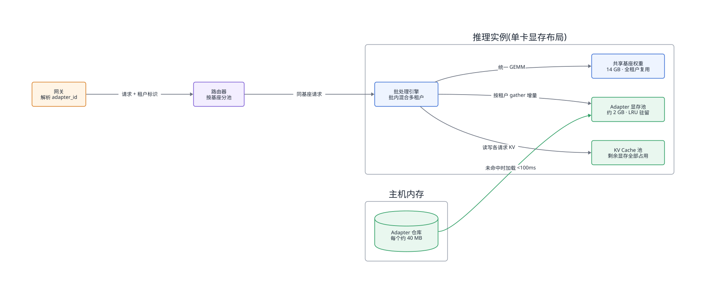
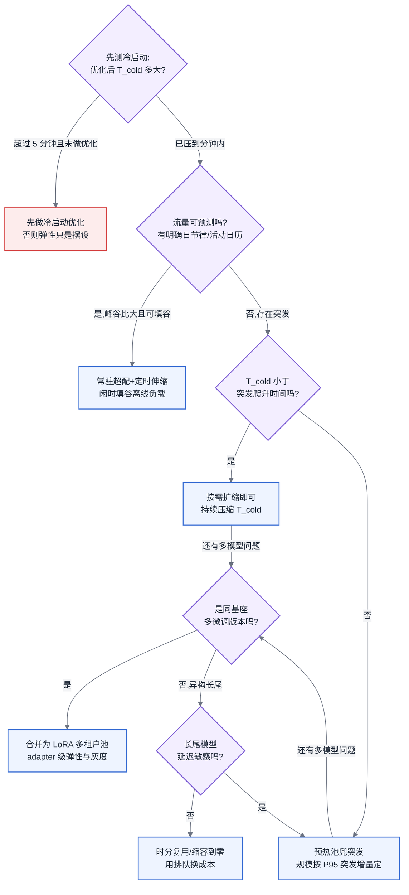

# 第 25 章 弹性与多模型

## 25.1 弹性先面对实例的完整生命周期

本章位于主线 B「一次推理请求的全链路」的实例生命周期维度:前几章讨论的是请求进入一个**已经就绪的实例**之后发生什么,本章讨论的是"这个实例从何而来、何时出现、承载几个模型"——即实例的创建、扩缩、共存与替换。

## 25.2 静态容量答案如何追上波动流量

本章建立在三条前置结论之上:第 22 章确立的推理引擎显存结构(权重 + KV Cache 池 + 激活)决定了实例启动时必须完成哪些初始化;第 24 章"按 SLO 反推部署形态与卡数"的方法给出了容量的静态答案,本章解决的是流量波动时如何动态逼近这个答案;[§3.6](../第一部分-基础与心智模型/第03章-人工智能与大模型基础.md#36-训练范式全景) 已经说明 LoRA 为什么天然支持多租户,本章只讲部署实现,不重述原理。

## 25.3 问题场景:扩容指令下发五分钟后,业务已经超时

某在线教育产品在晚上八点有一场直播活动,主讲人口播了一个"AI 答疑"入口。活动前,平台团队按日常峰值的 1.5 倍部署了 8 个 72B 模型实例(每实例 4 卡),并配置了基于 GPU 利用率的自动扩容:利用率超过 80% 持续 2 分钟即扩容。

八点零三分,QPS 从日常的 40 冲到 260。八点零五分,扩容条件触发,调度器下发了 6 个新实例的创建指令。此时负责值班的工程师并不慌——他做过多年电商系统,心里的预期是"Pod 起来也就三十秒"。

现实是:新实例的容器镜像 18 GB,节点上没有缓存,拉取用了 4 分钟;容器起来后,144 GB 的模型权重从对象存储拉取又用了 2 分多钟;引擎加载权重、捕获 CUDA Graph、跑完预热请求,再花掉近 2 分钟。第一个新实例可以接流量时,距离扩容指令下发已经过去 8 分 40 秒。而流量洪峰在八点零四分就已经把存量实例的等待队列打满,网关超时率在八点零六分达到 47%,活动口碑当场崩掉。

事后复盘会上,工程师最大的困惑是:"扩容明明触发了,链路上每一步也都没出错,为什么还是死了?"答案是残酷的:**这套弹性机制的每个环节都正常工作,它只是在物理上不可能赶上这场流量**。冷启动需要 8 分钟的服务,任何"分钟级响应"的弹性策略都是自我安慰。这就是本章要解决的问题:先量化冷启动,再据此选择弹性策略,而不是反过来。

## 25.4 原理与量化模型

### 25.4.1 冷启动的三段拆解

一个推理实例从"调度成功"到"可接流量",时间构成为:

$$T_{cold} = T_{env} + T_{weight} + T_{compile} + T_{warm}$$

其中 $T_{env}$(容器镜像拉取与运行时初始化)是通用云原生问题,镜像预热、P2P 分发等手段在大数据时代就已成熟,本章不展开。真正属于模型服务的是后三段,必须逐段拆开,因为它们的优化手段完全不同。

**第一段:权重加载(Weight Loading)。** 时间由两个串行环节构成:

$$T_{weight} = \frac{S_{model}}{BW_{storage}} + \frac{S_{model}}{BW_{h2d}}$$

即"存储 → 主机内存"加"主机内存 → 显存"。以 72B 模型 BF16 权重约 144 GB 为例:从对象存储单流拉取(约 1 GB/s)需要 144 秒;即使换成本地 NVMe(约 6 GB/s)也要 24 秒;H2D 拷贝走 PCIe Gen4 x16(实测约 20 GB/s,4 卡并行)约 2 秒。可以看到**瓶颈几乎总在第一跳**,优化手段按收益排序:节点本地权重缓存(把第一跳变成命中判断)、多流并发拉取与 P2P 分发(把 1 GB/s 提到接近网卡线速)、权重格式支持 mmap 直读避免多余拷贝(safetensors 相比 pickle 类格式省掉反序列化,权重格式与分发见 [§6.2](../第一部分-基础与心智模型/第06章-模型结构的定量分析.md#62-参数量与资源换算核心))。量化权重在这里有一个常被忽略的副产品收益:W4 权重体积是 BF16 的四分之一,冷启动的权重加载段直接缩短到四分之一。

**第二段:图编译(Graph Compilation)。** 引擎启动时要做的编译类工作包括 CUDA Graph / ACL Graph 捕获(原理见 [§23.3](第23章-推理优化-计算类加速.md#233-图模式))、JIT 算子首次编译和注意力后端分桶预构建。耗时与模型结构、kernel、形状空间、bucket 数和后端缓存共同相关，应按启动阶段事件实测。缓存能否复用需校验硬件、驱动、引擎、模型、kernel 和 shape 签名；裁剪未命中的 bucket 可缩短预热并释放常驻资源，但会增加 padding 或 fallback 风险，因此 bucket 表应由线上 shape/batch 直方图驱动，而不是沿用固定范围。

**第三段:预热(Warmup)。** 引擎"就绪"不等于"性能就绪"。KV Cache 池的显存需要实际分配触碰、部分算子存在首次执行的懒初始化、显存分配器需要几轮请求才能进入稳态。跳过预热直接接流量,前几十个请求的 TTFT 会是稳态的 2–5 倍——对内部服务或许可以容忍,对有严格 SLO 的场景等于把冷启动成本转嫁给了真实用户。预热的标准做法是回放一小批覆盖典型长度分布的合成请求,时间量级 10–60 秒,可优化空间不大,但**绝对不能省**,并且就绪探针(readiness probe)必须放在预热完成之后,否则负载均衡器会把流量灌进一个半热的实例。

三段合计,一个未经优化的大模型实例冷启动在 5–10 分钟量级;把权重缓存、编译缓存、预热流水线都做到位,可以压到 30–90 秒。还有一条容易被忽视的杠杆在实例之外:**换更小的模型形态**。如果业务允许用 7B 量化模型承接溢出流量(质量降级换可用性),它的冷启动天然只有大模型的十分之一,可以作为突发时的降级承接层——这是把冷启动问题转化为路由问题的思路,网关侧的实现见第 27 章降级策略。

这里要立一个平台侧的纪律:**冷启动时间必须是一个被持续测量的指标,而不是一次性的实验数字**。权重体积随版本增长、编译缓存随引擎升级失效、镜像随依赖膨胀,每一项都会让 $T_{cold}$ 悄悄回退;而 25.4.2 节会看到,弹性策略的可行性对这个数字是硬依赖——它回退了,弹性策略会在下一次突发时静默失效,不会有任何告警提前告诉你。所以这对做平台的人意味着什么:把 $T_{cold}$ 三段分别打点进监控,新版本发布的准入检查里加一条"冷启动回归不超过 X%",与吞吐回归同等对待。

```mermaid
%%{init: {'theme':'base','themeVariables':{
  'primaryColor':'#EEF4FF','primaryBorderColor':'#3B6FD4','primaryTextColor':'#1F2937',
  'secondaryColor':'#F3F4F6','tertiaryColor':'#FFFFFF',
  'lineColor':'#6B7280','fontFamily':'-apple-system, Segoe UI, Helvetica, Arial, sans-serif','fontSize':'14px'
}}}%%
gantt
    title 72B 实例冷启动时间构成(上:未优化,下:优化后)
    dateFormat X
    axisFormat %s
    section 未优化
    镜像拉取与运行时启动(240s) :env1, 0, 240
    权重加载·对象存储 1GB/s(150s) :crit, w1, 240, 390
    图编译·全量捕获(120s) :c1, 390, 510
    预热(30s) :warm1, 510, 540
    section 优化后
    镜像预热命中(15s) :env2, 0, 15
    权重加载·本地缓存+并发(30s) :w2, 15, 45
    图编译·缓存复用(10s) :c2, 45, 55
    预热(20s) :warm2, 55, 75
```

图 25-1:冷启动时间构成。未优化时权重加载是最大且最容易压缩的一段(红色标注),把三段优化全部做到位后冷启动从 9 分钟压到 75 秒——弹性策略的可行空间由这个数字直接决定。

### 25.4.2 扩缩容:指标、滞后与预热池

**指标选择。** 大数据时代的自动扩缩容默认看 CPU 利用率,这个指标在模型服务上**完全失效**,原因有二。其一,GPU 利用率(如 nvidia-smi 的 GPU-Util)是"有 kernel 在跑"的时间占比,一个 decode 阶段 memory-bound 的实例(见 [§4.4](../第一部分-基础与心智模型/第04章-硬件第一性原理、架构范式与数值精度.md#44-roofline-模型) Roofline)可以在利用率 95% 时仍有大量并发余量,也可以在 60% 时已经排队——它与"还能不能接更多请求"没有单调关系。其二,推理实例的真实容量瓶颈是 **KV Cache 池的剩余空间**(见 [§22.1](第22章-推理引擎原理.md#221-kv-cache-与显存)):池满则新请求排队或旧请求被抢占。因此有效的扩缩容指标按优先级是:

1. **KV Cache 利用率**:最直接反映容量水位,阈值建议 70–80%(留出单请求长上下文的突发余量);
2. **等待队列深度 / 排队时长**:反映已经发生的容量不足,适合做扩容的强触发;
3. **并发请求数**:与容量近似线性,前提是请求长度分布稳定;
4. TTFT / TPOT 的 SLO 余量:最贴近业务但最滞后,适合做告警而非触发。

指标口径还有一个陷阱:这些数字必须从**引擎侧**取(引擎的 metrics 端点直接暴露 KV 池水位与队列深度),而不是从容器层的资源监控推算。容器层看到的显存占用永远接近 100%——因为 KV Cache 池是启动时一次性预分配的(见 [§22.1](第22章-推理引擎原理.md#221-kv-cache-与显存)),显存占用率与负载水位从此脱钩。用容器层显存指标配弹性,得到的是一条永远触发或永远不触发的规则。

**滞后问题。** 弹性系统有三重滞后串联:指标采集与判断窗口($T_{detect}$,通常 30 秒–2 分钟,窗口太短会被毛刺误触发)、冷启动($T_{cold}$)、新实例分担负载生效($T_{ramp}$)。弹性可行性的判据可以写成一个不等式:

$$T_{detect} + T_{cold} + T_{ramp} < T_{surge}$$

其中 $T_{surge}$ 是流量从触发水位爬升到打爆存量容量的时间。对多数 To C 业务,$T_{surge}$ 在 1–5 分钟量级;这意味着**冷启动 5 分钟以上的服务,按需扩容在数学上就不成立**,不管调度器多快。缩容方向的滞后则是反向保护:缩容必须等实例上的存量请求(尤其是长生成)排空,强杀会直接产生用户可见失败,因此缩容冷却窗口要显著长于扩容(典型 10–15 分钟),宁可多烧一会儿卡。

**预热池的成本模型。** 当 $T_{cold}$ 压不进 $T_{surge}$,唯一的出路是把冷启动的前两段提前做掉:维持一个"权重已加载、图已编译、随时可接流"的待命池(warm pool)。它的成本收益可以直接算。设待命实例数为 $N_w$,单实例卡时成本 $C_{gpu}$(例如 4 卡实例按每卡每小时 2 美元计为 8 美元/时),则待命成本为 $N_w \times C_{gpu} \times 24 \times 30$ 每月;收益是避免超时的业务损失 $L$ 乘以突发发生概率。以 2 个 4 卡待命实例为例,月成本约 1.15 万美元——这个数字应当和"一次活动事故的损失"放在同一张表上给业务方看,预热池买的不是算力,是 $T_{cold}$ 的确定性。压缩这笔账有两个方向:待命实例可以用低优先级任务填充(被抢占时排空即可,抢占机制见第 9 章),把纯闲置变成机会成本;或者退一级,只预热到"权重在节点本地缓存"的程度,把 $T_{cold}$ 从 9 分钟压到 75 秒级,换取待命成本归零——这正是 25.5 节方案对比的主轴。

### 25.4.3 多模型共存与 LoRA 多租户

平台真正的常态不是"一个模型堆流量",而是"几十个模型各自流量都不大"。给每个模型独占实例,长尾模型的利用率会低到个位数。共存的手段按共享程度递进:

**独立实例 + 装箱(bin packing)**:多个小模型各自独占部分显存、共置同一张卡。实现最简单,但显存按峰值预留,互相之间还有算力干扰(切分与隔离强度见第 10 章)。

**时分复用(model swapping)**:冷门模型权重驻留主机内存或本地盘,请求到来时换入。换入时间即 $T_{weight}$ 的后半段,7B 级模型从主机内存换入约 1–2 秒,可以接受;72B 级则回到冷启动量级,只适合离线或延迟不敏感场景。

**LoRA 多租户(multi-tenant LoRA serving)**:同一基座的多个微调版本,只有 adapter 不同(原理与参数量分析见 [§3.6](../第一部分-基础与心智模型/第03章-人工智能与大模型基础.md#36-训练范式全景))。部署上的关键事实是:一个 rank=16 的 7B 模型 adapter 只有约 40 MB,基座 14 GB 的显存预算里塞下 50 个租户的 adapter 只需约 2 GB。实现要点有三:

1. **共享基座、独立 adapter 显存池**:adapter 单独分配、LRU 淘汰,冷租户 adapter 从主机内存动态加载,40 MB 量级的加载在 100 毫秒内完成——这让"租户级冷启动"几乎消失;
2. **不合并权重的批内混合计算**:传统做法把 adapter 合并进基座权重($W' = W + BA$),切换租户要重新合并,开销秒级且同批只能服务一个租户;现代引擎采用分离计算——基座 GEMM 对全 batch 统一算,adapter 增量用分组 gather 类算子(S-LoRA / Punica 一脉)按请求各算各的,**一个 batch 里可以混合几十个租户的请求**,这是多租户吞吐的来源。代价是每步多一次小 GEMM,吞吐损失通常在 5–15%;
3. **路由带上租户标识**:网关(见第 27 章)按 `model=基座+adapter_id` 路由,同基座的请求可进同一实例池,adapter 亲和只作为软约束——因为 adapter 加载足够便宜,亲和收益远小于负载均衡收益,这一点与 KV 前缀亲和(见第 24 章)的取舍方向相反。

把第 3 点再展开一层:**adapter 可用性本身就应当是路由信号**。请求落到已加载目标 adapter 的实例,只付批内混合计算的常规代价;落到未加载的实例,则触发一次动态加载——单次百毫秒级确实便宜,但当活跃租户数超过单实例 adapter 池容量时,无差别轮询会让每个实例都被迫轮换加载全量租户,LRU 池持续换入换出,长尾租户的 TTFT 被加载延迟反复污染。抖动不来自单次加载,来自路由把每个实例的工作集摊成了全集。消解办法与 KV 前缀亲和同构但力度更轻:同租户请求向少数已加载实例聚拢的**软亲和**即可,负载高时允许溢出触发加载——正因为加载便宜,亲和可以随时让位给均衡,这正是上面第 3 点"软约束"的量化理由。这类信号如今有了标准化的承接层:实例级路由(EPP 类)把 LoRA 适配器可用性与前缀缓存状态并列为一等路由输入,见第 27 章"网关之下:模型感知的实例选择层"。

失效边界同样要说清:租户的**基座或量化配置不同**,则完全无法共享;单一大租户流量占比过高时,应把它拆回独立实例(合并权重消除 5–15% 损耗),LoRA 多租户的甜区是"多而小"。此外多租户共享引入了新的隔离问题:一个租户的长上下文请求会挤占全池共享的 KV Cache,拖慢所有租户——租户级的并发与 token 配额必须在网关层执行(实现见第 27 章),引擎层只负责执行调度,不感知租户公平性。这条分工不划清,第一起跨租户干扰事故就会暴露出来:引擎团队说"调度符合预期",网关团队说"没人告诉我要限并发"。

所以这对做平台的人意味着什么:多模型共存的方案选择本质上是一道显存复用率与隔离强度的权衡题——独立实例隔离最强、复用最差,LoRA 多租户复用最好、但把隔离责任推给了上层。平台要做的不是选一个"最好的",而是给每类模型(头部独立、同基座聚合、长尾时分)各配一档,并把隔离责任写进与租户的契约。

<!-- source: diagrams/sources/ch25-lora-multitenancy.d2 -->

图 25-2:LoRA 多租户部署架构。基座权重只存一份、adapter 池按 LRU 动态驻留,一个 batch 内可混合几十个租户的请求——多租户的吞吐来自"共享大头、隔离小头"的显存布局,而不是来自调度技巧。

### 25.4.4 模型热更新与灰度切换

模型版本迭代是常态,要求是**不断流**。推理实例有两个特性使它比无状态服务的滚动更新更难:实例上有进行中的长生成请求(强杀即用户可见失败),以及 KV Cache 不可跨实例迁移(排空是唯一选择)。可行的做法是标准的双版本灰度,叠加模型服务特有的约束:

1. **新版本实例先起后切**:新版本按目标容量的一个子集(如 5%)启动并**完整走完预热**,才注册进路由;这要求集群有滚动余量——按最大并行更新批次预留 5–10% 的备用卡,这笔开销要进容量规划;
2. **按流量灰度而非按实例灰度**:网关按权重把 5% → 25% → 100% 的流量切到新版本,观测的不只是错误率,还有**输出质量抽检**(模型换版本可能"不报错但变笨",纯 Infra 指标看不出来,需要与算法侧约定抽检责任——这条边界不写清,灰度出了质量事故会变成罗生门:平台说"服务全绿",算法说"没人告诉我切了流量");
3. **旧版本排空(draining)而非杀死**:摘除路由后等待存量请求自然完成,超时上限设为最长生成时间(例如 10 分钟),到点仍未完成的请求走网关重试到新版本;
4. **LoRA 场景的快捷通道**:如果更新的只是 adapter,不需要实例级灰度——adapter 是百毫秒级可加载的独立制品,网关把 `adapter_v1` / `adapter_v2` 当作两个租户做流量分配即可,回滚同样是百毫秒级。这是 LoRA 多租户在运维侧的隐藏红利,常被只算显存账的评估遗漏。

所以这对做平台的人意味着什么:冷启动的三段时间、扩缩容的三重滞后、灰度的排空窗口,全部要变成平台 SLO 表里的显式数字。弹性不是"配好 HPA 就有"的属性,而是一条从制品分发到路由切换的完整工程链路,链路上最慢的一段决定全局。

## 25.5 方案对比:三种弹性策略

**方案一:纯按需扩缩(scale-from-zero / 冷扩容)。** 不预留任何待命资源,指标触发后从零创建实例。成本最优,长尾模型甚至可以缩到零。**失效边界**:$T_{detect}+T_{cold}+T_{ramp} > T_{surge}$ 时彻底失效——对未优化的大模型(冷启动 5 分钟以上)面对分钟级流量突发,这个方案等价于没有弹性;即使冷启动优化到 75 秒,秒级尖峰(如口播、推送触发)依然接不住。适用于流量爬升平缓(小时级)、或延迟 SLO 宽松可用排队缓冲的场景。

**方案二:预热池 + 按需扩缩。** 维持少量完全就绪的待命实例吸收突发,同时后台冷启动补充待命池。突发响应时间从 $T_{cold}$ 降到路由切换的秒级。**失效边界**:突发幅度超过待命池容量时退化为方案一,因此待命池规模必须按历史突发分布的高分位(如 P95 突发增量)设定,而不是拍脑袋设 1–2 个;成本上,待命池占常驻成本的比例超过 20–30% 时,说明流量突发太频繁,应当直接提高常驻容量而不是继续加大待命池——预热池是保险,保险费超过保额就不成立。

**方案三:常驻超配 + 定时伸缩(scheduled scaling)。** 按峰值容量的 1.1–1.2 倍常驻,叠加基于流量周期(日节律、活动日历)的定时扩缩。完全消除冷启动风险,工程最简单。**失效边界**:成本随峰谷比线性恶化——峰谷比 5:1 的业务,谷时 80% 的卡在空转,除非闲时算力能被训练或离线推理填谷(潮汐调度,混部见第 9 章),否则这是最贵的方案;同时它对**日历外**的突发毫无防御,定时伸缩的前提是流量可预测,这个前提本身要用数据验证而不是假设。

三个方案不互斥,成熟平台的常态是分层组合:头部模型用方案三打底、方案二兜突发,长尾模型用方案一甚至缩容到零,LoRA 租户则整体作为一个基座池按方案二运营。组合的前提是每个模型都有明确的策略归属和对应的 SLO 承诺——平台方在这里必须与业务方划清一条边界:选了方案一(缩容到零)的模型,首请求延迟就是分钟级,这一点要写进服务等级说明而不是口头默契;否则某个长尾模型突然被业务当成核心依赖时,超时事故的责任会落进真空地带——业务方以为"上了平台就有弹性",平台方以为"长尾模型没人在乎延迟",两边都有理,用户已经流失。

另外说一句 2026 年的现实判断:公有云的 Serverless GPU 产品(按请求计费、平台代管预热池)本质上是把方案二的待命成本从单租户账本挪到平台账本上摊薄,对流量稀疏的长尾场景确实划算;但它不改变本章的任何一个不等式——你只是把 $T_{cold}$ 的工程责任外包了,SLO 评估时依然要向供应商索要冷启动分位数据,拿不到这个数据的 Serverless 承诺不足为凭。

## 25.6 大数据对照:在线服务弹性经验的适用与不适用

做过大规模在线服务的读者,手里有一套完整的弹性方法论:指标驱动的 HPA、金丝雀发布、连接排空、容量按 P99 规划。这套方法论的**框架层完全适用**——本章的扩缩容触发、灰度切换、排空逻辑,和当年给微服务或 Elasticsearch 集群做弹性没有结构性区别;预热池的思路也不新鲜,JVM 时代为了躲开 JIT 预热和缓存填充,常备热实例池是标准动作。

失效的是三个隐含假设的量级。**第一,冷启动量级差了两个数量级**:一个微服务实例冷启动 5–30 秒,JVM 慢一点也就一两分钟,所以"按需扩容追上流量"在大数据时代基本总是成立;模型实例未优化时是 5–10 分钟,这不是"慢一点",而是直接把按需扩容从可行域里踢出去——弹性策略必须先算 $T_{cold}$ 再做选择,这个"先算再选"的步骤在旧经验里根本不存在,因为旧经验里它从不构成约束。**第二,无状态假设失效**:微服务排空只需等几百毫秒的短请求,模型实例上挂着分钟级的长生成和不可迁移的 KV Cache,排空窗口长两个数量级,缩容和滚动更新的节奏都要随之放慢。**第三,资源粒度失效**:CPU 服务可以按 0.5 核的粒度平滑加减,弹性曲线近似连续;模型实例的粒度是"4 卡"或"8 卡"一跳,扩一个实例就是上万美元月成本的台阶,这使得"多扩一点无所谓"的粗放策略在账面上无法成立,也使得预热池的每一个名额都值得单独算账。一句话总结:**方法论平移,数量级重算**——拿着旧的时间常数套新系统,就是 25.3 节那位值班工程师的八分钟。

## 25.7 选型决策树

图 25-3:弹性策略选型决策树。入口不是流量特征而是冷启动实测值——$T_{cold}$ 没压下来之前,任何弹性策略的讨论都是空转。

## 25.8 名词解释

| 术语 | 释义 | 详见 |
|---|---|---|
| 冷启动(T_cold) | 实例从调度成功到可接流量的时间:环境拉起 + 权重加载 + 图编译 + 预热四段;未优化 5–10 分钟,做满优化 30–90 秒 | §25.4.1 |
| safetensors / mmap 直读 | 支持内存映射、免反序列化的权重格式;相对 pickle 类格式省一次拷贝与解析 | §25.4.1 |
| 预热(warmup)与就绪探针 | 回放合成请求触碰 KV 池、完成懒初始化;readiness probe 必须放在预热之后,否则半热实例被灌流量 | §25.4.1 |
| 弹性可行性(判据不等式) | T_detect + T_cold + T_ramp < T_surge:检测、冷启动、生效三重滞后之和必须小于流量爬升时间,否则按需扩容在数学上不成立 | §25.4.2 |
| KV Cache 利用率(扩缩容指标) | 引擎侧的容量水位,最直接的弹性触发信号;容器层显存占用因预分配恒近 100%,不可用 | §25.4.2 |
| 预热池(warm pool) | 权重已加载、图已编译的待命实例池;本质是用内存换 T_cold 的确定性,规模按 P95 突发增量定 | §25.4.2 |
| scale-from-zero | 长尾模型缩容到零、按需冷启动的策略;首请求延迟即分钟级,必须写进服务等级说明 | §25.5 |
| LoRA 多租户 | 共享基座 + 独立 adapter 显存池(LRU 驻留、百毫秒级动态加载);一个 batch 可混合几十个租户请求 | §25.4.3 |
| 批内混合计算(S-LoRA/Punica 一脉) | 基座 GEMM 对全 batch 统一算、adapter 增量按请求分组各算各的;多租户吞吐的来源,代价 5–15% | §25.4.3 |
| 合并权重(merge) | 把 adapter 加进基座(W' = W + BA)消除批内混合损耗;适合流量占比高的大租户拆回独立实例 | §25.4.3 |
| 排空(draining) | 摘除路由后等存量请求自然完成再下线;强杀长生成即用户可见失败,超时上限按最长生成时间设 | §25.4.4 |
| 按流量灰度 | 网关按权重把 5%→25%→100% 流量切到新版本,观测错误率之外还须有输出质量抽检 | §25.4.4 |
| Serverless GPU | 平台代管预热池、按请求计费的托管形态;外包的是 T_cold 的工程,不改变任何弹性不等式 | §25.5 |

---

读完本章,你应当能:拿到一个具体模型与硬件组合,实测并拆解出权重加载、图编译、预热三段的冷启动时间;用 $T_{detect}+T_{cold}+T_{ramp} < T_{surge}$ 判断按需扩容是否成立,并据此在按需、预热池、常驻超配三种策略中做出有成本数字支撑的选择;为同基座的几十个微调租户设计出共享基座 + 动态 adapter 的部署方案;设计出一套满足冷启动 SLO、且版本切换不断流的完整弹性方案。
