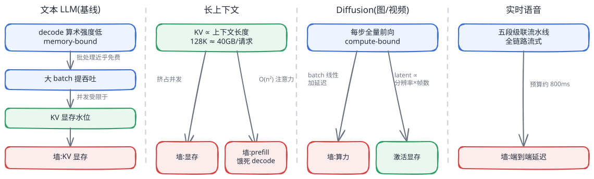
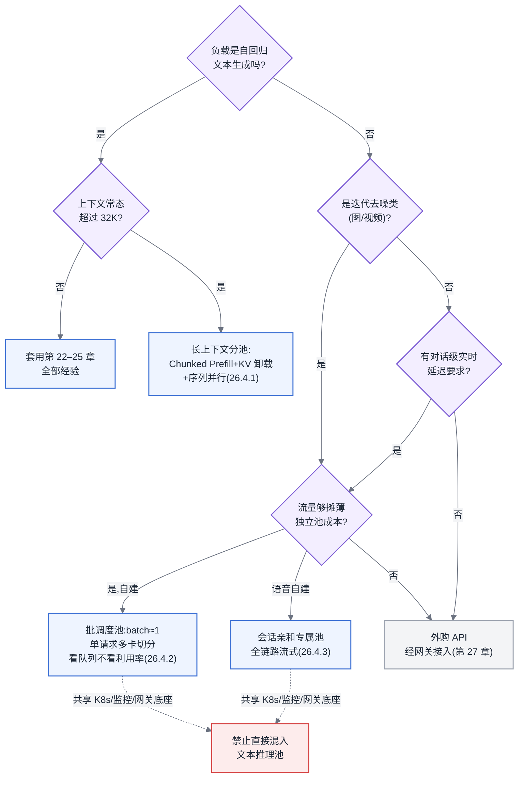

# 第 26 章 特殊负载

## 26.1 链路定位

本章位于主线 B("一次推理请求的全链路")的边界上:前面第 22–25 章优化的每一个环节——Continuous Batching、KV Cache、PD 分离、弹性扩缩——都默认负载是"文本自回归生成"。本章要做的事情是划清这条主线的适用边界:当请求变成 128K 上下文、一段五秒视频、或一通实时语音对话时,主线 B 的哪些环节仍然成立,哪些会把你带进沟里。

## 26.2 依赖声明

本章建立在三条前置结论之上:[§3.4](../第一部分-基础与心智模型/第03章-人工智能与大模型基础.md#34-transformer-与注意力) 的 KV Cache 由来与 [§22.1](第22章-推理引擎原理.md#221-kv-cache-与显存) 的 KV 显存增长规律;[§4.4](../第一部分-基础与心智模型/第04章-硬件第一性原理、架构范式与数值精度.md#44-roofline-模型) 的 Roofline 瓶颈判定——一个负载是 compute-bound 还是 memory-bound 决定了它该被怎样调度;以及 [§22.2](第22章-推理引擎原理.md#222-批处理与调度) 的结论"Continuous Batching 之所以有效,是因为 decode 阶段是 memory-bound 的"。本章的全部论证,就是把最后这条结论的前提抽掉,看大厦哪几层会塌。

## 26.3 问题场景:把 vLLM 的经验搬到视频生成上

小唐的团队用一年时间把公司的文本 LLM 推理平台打磨得相当漂亮:vLLM + Continuous Batching,32 张卡撑住峰值 4000 并发,GPU 利用率常年 85% 以上,TTFT P99 压在 600ms。2026 年初,公司立项视频生成业务,一个 12B 参数的 DiT 类模型,单请求生成 5 秒 720p 视频。领导的判断和小唐一致:"模型比 70B 小得多,还是同一批卡,复用现有平台,两周上线。"

第一周就出现了三个反常现象。第一,并发上不去:文本服务单卡能塞几十个请求,视频服务单卡跑 2 个请求就 OOM——12B 的权重只占 24GB,剩下几十 GB 显存不知道被什么吃掉了。第二,批处理不省钱:小唐按老经验调大 batch,期望吞吐随 batch 近似线性上涨、单请求延迟基本不动;实测 batch 从 1 加到 4,吞吐只涨了不到 15%,而每个请求的生成时间从 90 秒涨到 340 秒——用户直接在前端超时。第三,监控全部失灵:TTFT、TPOT、KV 命中率这些指标要么恒为零要么没有意义,告警规则整套作废;而利用率监控显示 GPU 一直 99%,按文本时代的直觉"利用率高 = 平台健康",可用户排队排到了 40 分钟。

复盘会上小唐说了一句话:"我们所有的优化都在回答'怎么把更多请求塞进一张卡',而这个负载的正确问题是'怎么把一个请求摊到更多卡上'。方向整个是反的。"这句话是本章的核心洞察,26.4 节将把它讲透。

## 26.4 原理与量化模型

三类特殊负载各自打破主线 B 的一个默认假设:长上下文打破"KV 是小头",Diffusion 打破"decode 是 memory-bound",实时语音打破"请求之间无状态且延迟预算只看 TTFT/TPOT"。逐一展开。

### 26.4.1 长上下文:上下文长度成为容量规划的主导变量

长上下文没有改变负载性质——它仍是自回归生成——它改变的是量级,而量级变化到一定程度就是架构变化。两条增长曲线需要分开看。

**KV 显存随上下文线性增长,并反客为主。** 单请求 KV 占用(结构见 [§3.4](../第一部分-基础与心智模型/第03章-人工智能与大模型基础.md#34-transformer-与注意力),换算见 [§6.2](../第一部分-基础与心智模型/第06章-模型结构的定量分析.md#62-参数量与资源换算核心))为:

> 单请求 KV 字节数 = 2 × 层数 × KV 头数 × 头维度 × 精度字节数 × 上下文长度

以一个 70B 级 GQA 模型(80 层、8 个 KV 头、头维度 128、FP16)为例,每 token 约 0.31MB。4K 上下文时单请求约 1.3GB,KV 是权重之外的零头;128K 上下文时单请求约 40GB——**一个请求的 KV 就吃掉半张卡**。此时容量公式"可承载并发 ≈ (单实例显存 − 权重与激活预留) ÷ 单请求 KV"的分母膨胀了 32 倍,并发上限从几十个坍缩到个位数。容量规划的自变量从"QPS"变成了"上下文长度分布":同样的 QPS,请求平均长度从 8K 漂移到 64K,你需要的卡数不是多一点,是多一个数量级。平台必须把上下文长度当成一等公民的容量输入去监控其分布漂移,而不是当成请求的一个普通字段。

**Prefill 计算随上下文超线性增长。** 注意力的计算量含 O(n²) 项:线性层 FLOPs 随 n 线性涨,注意力打分随 n² 涨。短上下文时 n² 项可忽略;粗略地,当 n 接近模型隐层维度的量级(数千到上万 token)后,注意力项开始与线性层同量级,此后 TTFT 的增长明显快于线性。一个 4K prompt 的 prefill 若耗时 0.5 秒,128K prompt 的 prefill 就不是 16 秒而是数十秒——不做任何处理的话,这次 prefill 会把同实例所有 decode 请求饿死几十秒(即 [§22.2](第22章-推理引擎原理.md#222-批处理与调度) Chunked Prefill 要解决的问题的极端形态)。

应对手段是三层递进,每层解决一个越界:分块(Chunked Prefill,见 [§22.2](第22章-推理引擎原理.md#222-批处理与调度))解决"一次 prefill 独占引擎";卸载与多级复用(KV 从显存下沉到主存与远端,见第 24 章)解决"KV 放不下",代价是命中远端时的加载延迟;序列并行 / Ring Attention 类方案把单个超长请求切到多卡,解决"单卡放不下也算不动",代价是引入跨卡通信并让部署形态复杂一档。对做平台的人,这意味着长上下文服务应当与短上下文服务**分池**:混在一个池子里,长请求会系统性地拉高短请求的 P99,而按最长请求做容量预留又会浪费大部分显存。

### 26.4.2 Diffusion:批处理策略与自回归完全相反

这是本章最重要的一节。先摆机制,再摆结论。

**计算模式:迭代去噪。** Diffusion 生成一张图或一段视频,是对同一份潜空间张量(latent)做几十次(典型 20–50 步)完整的模型前向,每一步输入输出形状不变,直到噪声被逐步去除。它与自回归的结构性差异在于:自回归 decode 每步只处理 1 个新 token,计算量极小而每步都要搬运全部权重与 KV——算术强度(FLOPs/字节,见 [§4.4](../第一部分-基础与心智模型/第04章-硬件第一性原理、架构范式与数值精度.md#44-roofline-模型))只有个位数,深陷 Roofline 的带宽区,**GPU 算力大量闲置**;Diffusion 每一步处理的是完整的 latent——一段 5 秒 720p 视频经 VAE 与 patch 化后是数十万 token 量级的序列,单步计算就足以打满算力,算术强度远在 Roofline 拐点右侧,**是彻底的 compute-bound**。

**由此推出批处理策略的对立。** 自回归 decode 是 memory-bound:把 batch 从 1 加到 32,权重搬运量不变、计算单元本来就闲着,吞吐近似 32 倍增长而单步延迟几乎不动——这就是 Continuous Batching 的全部物理基础,批处理在这里是**近乎免费的午餐**。Diffusion 是 compute-bound:单请求已把算力打满,batch 加倍意味着单步计算时间近似加倍,吞吐几乎不涨,而每个请求的端到端延迟随 batch 线性恶化。小唐观测到的"batch×4,吞吐 +15%,延迟 ×3.8"正是教科书式的 compute-bound 批处理曲线。结论必须说死:**自回归靠加大 batch 提吞吐,Diffusion 加大 batch 只是在均匀地惩罚所有用户;自回归的优化方向是"多请求进一卡",Diffusion 的优化方向是"一请求摊多卡"**(时序对比见图 26-2)。

顺着这条对立,主线 B 的三大件全部失效或反转:**没有 KV Cache**——每步是全量前向,不存在增量状态,PagedAttention、Prefix Cache、KV 池化(第 22、24 章)整体无处安放,显存大头变成随"分辨率 × 帧数"增长的 latent 与激活值(这就是小唐"权重 24GB、卡却塞不下第三个请求"的答案:720p×5s 的激活峰值以十 GB 计);**Continuous Batching 失去标的**——没有"decode 到一半插入新请求"的空隙可钻,请求粒度退化为整段计算;**PD 分离无从谈起**——没有 prefill/decode 两阶段之分。Diffusion 服务的正确形态更接近一个**批调度系统**:请求进队列,按优先级出队,单请求用张量并行 / 序列并行 / CFG 并行切到 2–8 卡把 90 秒压到 20 秒以内,吞吐靠水平扩实例而不是靠加 batch。它的调度问题是排队论问题(队长、等待时间、饱和点),不是 batching 问题。

**所以这对做平台的人意味着什么:** 不要用"GPU 利用率"衡量 Diffusion 平台的健康度——compute-bound 负载的利用率永远好看,真正的健康指标是队列等待时间与单请求延迟。也不要让文本推理引擎团队顺手接视频:两者共享的只有 CUDA 和 K8s,调度器、显存管理、指标体系、扩缩容策略全部要重写。

### 26.4.3 实时语音:延迟预算的逐段拆解

实时语音对话的用户体验红线是"对方停止说话到听见回应"不超过约 800ms——超过 1 秒,对话感即告破裂。这个预算要摊给一条至少五段的级联链路(以 ASR → LLM → TTS 级联架构为例):

| 环节 | 典型耗时 | 可压缩性 |
|---|---|---|
| 尾静音检测(VAD 判定用户说完) | 200–300ms | 几乎不可压缩,是物理下界:判定"说完"本身需要等待静音 |
| 流式 ASR 出定稿文本 | 50–150ms | 流式增量识别,边说边转,只付尾部增量 |
| LLM 首 token(TTFT) | 150–300ms | 第 22–24 章全部手段的用武之地 |
| TTS 首个音频块 | 100–200ms | 流式合成,拿到首句即开始发声 |
| 网络与编解码(双向) | 50–150ms | 靠边缘接入点压 RTT |

五段加起来,预算没有任何浪费的余地。由此推出三条与文本服务相反的架构要求。**第一,全链路流式与流水线重叠**:ASR 不等说完就转、LLM 不等定稿就 prefill(拿增量文本投机 prefill,定稿不符则作废重来)、TTS 不等整句就合成——任何一个环节退化成"收全再发",预算立刻崩掉。**第二,有状态与会话亲和**:一通对话持续几分钟,ASR 声学状态、LLM 的 KV、TTS 音色状态都驻留在实例里,请求必须会话亲和路由(session affinity),实例缩容要先排空会话——第 25 章"实例无状态、随意扩缩"的弹性经验在这里直接失效。**第三,反吞吐调度**:文本服务用大 batch 换吞吐、容忍 TPOT 抖动;语音服务必须小 batch 甚至专属实例,因为 P99 抖动 300ms 在文本流式输出里无人察觉,在语音里就是一次明显的冷场。端到端语音模型(音频 token 直入直出)能砍掉级联的接口耗时,但把"有状态 + 反吞吐"的属性变得更极端,并不豁免上述任何一条。

### 26.4.4 分歧点汇总

| 架构决策 | 文本 LLM | 长上下文 | Diffusion | 实时语音 |
|---|---|---|---|---|
| 瓶颈性质([§4.4](../第一部分-基础与心智模型/第04章-硬件第一性原理、架构范式与数值精度.md#44-roofline-模型)) | prefill 算力 / decode 带宽 | 显存与 prefill 算力 | 纯算力 | 端到端延迟 |
| 批处理策略 | 大 batch,持续插入 | 受 KV 限制的小 batch | batch≈1,排队制 | 小 batch / 专属实例 |
| 显存大头 | 权重 + KV | KV 反超权重 | latent 与激活(∝ 分辨率×帧数) | 权重 + 会话状态 |
| 并行方向 | 多请求进一卡 | 超长单请求切多卡 | 单请求切多卡 | 亲和固定,少并行 |
| 容量自变量 | QPS | 上下文长度分布 | 队列深度与时长 | 并发会话数 |
| 核心健康指标 | TTFT / TPOT / 吞吐 | TTFT 与 KV 水位 | 队列等待时间 | 端到端首响延迟 |

<!-- source: diagrams/sources/ch26-workload-profiles.excalidraw -->

图 26-1:三类特殊负载与文本 LLM 的资源画像对比。要记住的一件事:四类负载撞的是四堵不同的墙——文本撞 KV 显存、长上下文撞显存加 prefill、Diffusion 撞纯算力、语音撞延迟预算,墙不同,整套调度与容量方法论就不同。

```mermaid
%%{init: {'theme':'base','themeVariables':{
  'primaryColor':'#EEF4FF','primaryBorderColor':'#3B6FD4','primaryTextColor':'#1F2937',
  'secondaryColor':'#F3F4F6','tertiaryColor':'#FFFFFF',
  'lineColor':'#6B7280','fontFamily':'-apple-system, Segoe UI, Helvetica, Arial, sans-serif','fontSize':'14px'
}}}%%
gantt
  dateFormat s
  axisFormat %S s
  title 同一张卡上的两种批处理时序(示意)
  section 自回归 decode(memory-bound)
  请求A(batch内)          :a1, 0, 8s
  请求B(第2s插入,延迟几乎不变) :a2, 2, 8s
  请求C(第4s插入,延迟几乎不变) :a3, 4, 8s
  section Diffusion(compute-bound)
  请求X 单跑(50步,90s)     :d1, 0, 9s
  请求Y 与X同批(两者都被拖慢) :crit, d2, 0, 17s
  请求X 被同批拖慢的部分      :crit, d3, 9, 8s
```

图 26-2:Diffusion 与自回归的批处理模式对比(时间轴为示意压缩)。要记住的一件事:自回归里插入新请求近乎不影响在跑请求,Diffusion 里每加入一个同批请求就让所有人的延迟等比例变长——前者批处理是免费午餐,后者批处理是均摊惩罚。

## 26.5 方案对比

平台承接特殊负载,有三条可选路线。

**方案一:统一平台、统一引擎混部。** 把三类负载塞进现有文本推理平台,共用引擎与调度器。唯一的优点是省掉建设成本,且在负载极小(每天几百个视频请求、几十通语音)时,专门建池不划算。**失效边界**:任何一类负载的流量达到需要独立容量规划的量级即失效——Diffusion 的整段计算会周期性冻结文本请求的 decode,长上下文请求会吃光 KV 池,语音的会话亲和会顶死调度器的装箱自由度。混部的 P99 会随特殊负载占比恶化,且无法归因。2026 年的判断是:这个方案只适合验证期,不适合任何有 SLO 的生产期。

**方案二:分池部署、共享底座。** K8s、配额、监控、网关、模型仓库共享一套(第六部分),但每类负载独立资源池、独立引擎与调度策略:文本池跑 vLLM 类引擎,Diffusion 池跑批调度 + 多卡切分,语音池跑会话亲和的专属实例。这是多数场景的正解。**失效边界**:每个池都要单独留水位余量,池越多、总冗余越高——当某类负载流量小且波动大时,它的独立池利用率会低到财务上难看;此时要么接受成本,要么把该类负载外购。另一个失效条件是团队规模:三套调度策略意味着三份运维心智,平台团队不足十人时会被拖垮。

**方案三:特殊负载外购 API,自建只做文本。** 视频生成与语音对话直接采购供应商 API,经第 27 章的网关统一接入。优点是把最陌生的两套运维体系整体外包,且视频类负载按次计费的成本模型在低量期远优于自建。**失效边界**:量大之后单位成本反超自建(临界点用第 31 章容量模型算);数据合规要求音视频不出域时直接不可选;以及延迟不可控——实时语音走外部 API,网络段就可能吃掉半个延迟预算,基本只适合非实时语音场景。

## 26.6 大数据对照

这一章的处境,大数据工程师似曾相识:**"一套引擎打天下"的幻灭是每一代基础设施都要重演的剧目**。Spark 当年号称统一批、流、图、SQL,实践很快证明微批(micro-batch)的 Spark Streaming 打不了真流式的仗,Flink 靠"负载性质不同,执行模型就得不同"赢下实时战场。文本自回归与 Diffusion 的关系,几乎就是流式与批处理关系的复刻:自回归 decode 是"持续到来的小增量"(流),Diffusion 是"一次性整段计算"(批),硬用一套调度器承接两者,和用 Spark micro-batch 硬扛毫秒级流式是同一个错误。

可直接复用的经验有三条。其一,**混合负载分池**:HBase 时代把随机读写与批量扫描分集群、ES 时代把写入与查询分节点角色,与 26.5 方案二的分池逻辑完全同构,连"分池带来冗余成本"的代价结构都一样。其二,**端到端延迟预算拆解**:Kafka → Flink → 存储的实时链路上逐段分摊延迟、逐段压缩的方法论,原封不动地用在 26.4.3 的语音链路上。其三,**排队论视角**:Diffusion 服务的容量规划就是 YARN 批队列的老问题——队长、等待时间、饱和点,公式都不用换。

失效的经验也有三条。其一,批处理"攒大批更划算"的直觉只在 memory-bound 或 IO-bound 世界成立,对 compute-bound 的 Diffusion,攒批不省任何东西(26.4.2 的核心结论,这是大数据直觉在本章最危险的一次背叛)。其二,"利用率高即健康"失效:CPU 世界利用率低说明有余量、高说明该扩容,而 compute-bound 的 GPU 负载利用率恒高,失去信号价值,必须换成队列指标。其三,流式系统"算子状态可 checkpoint 后随意迁移"的假设失效:Flink 迁移一个算子状态是框架内建能力,而语音会话里的 KV 与声学状态迁移没有通用机制,只能靠亲和加排空。

## 26.7 选型决策树

图 26-3:"我的负载类型该套用哪套部署经验"选型决策树。要记住的一件事:第一问永远是"它还是自回归文本吗"——答案为否,第 22–25 章的经验就只剩底座可以共享,引擎与调度必须另起炉灶。

---

读完本章,你应当能:拿到一个非典型负载时,先用 Roofline([§4.4](../第一部分-基础与心智模型/第04章-硬件第一性原理、架构范式与数值精度.md#44-roofline-模型))判定它是 compute-bound 还是 memory-bound,据此判断 Continuous Batching 一类批处理手段对它是免费午餐还是均摊惩罚;能用"单请求 KV = 2 × 层数 × KV 头数 × 头维度 × 精度字节 × 上下文长度"算出长上下文场景的并发上限,并说出它何时必须分池;能对一条实时语音链路做逐段延迟预算拆解并指出不可压缩段;从而准确识别出"何时不能套用文本 LLM 的部署经验",并在统一混部、分池共底座、外购 API 三条路线之间给出有失效边界依据的选择。
