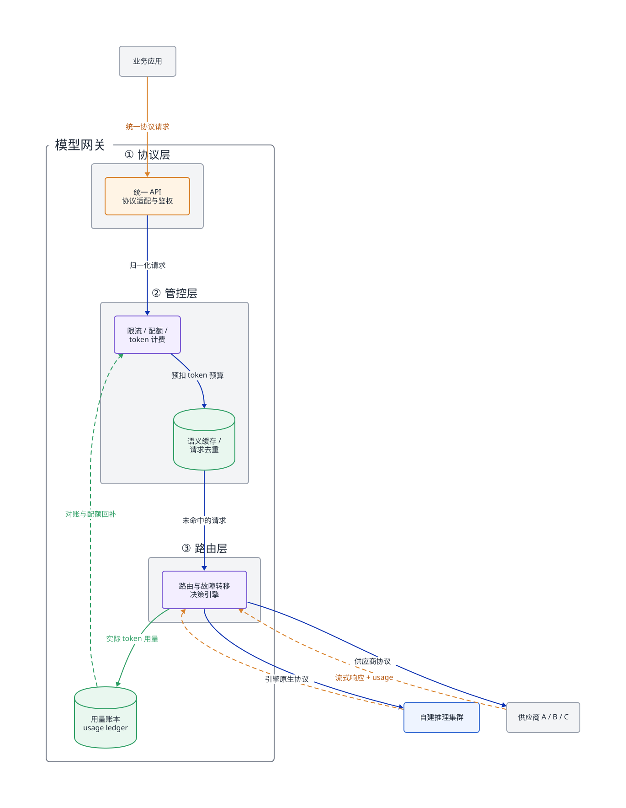
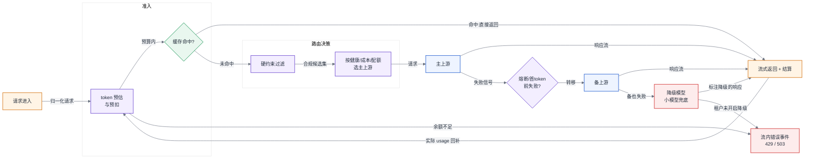
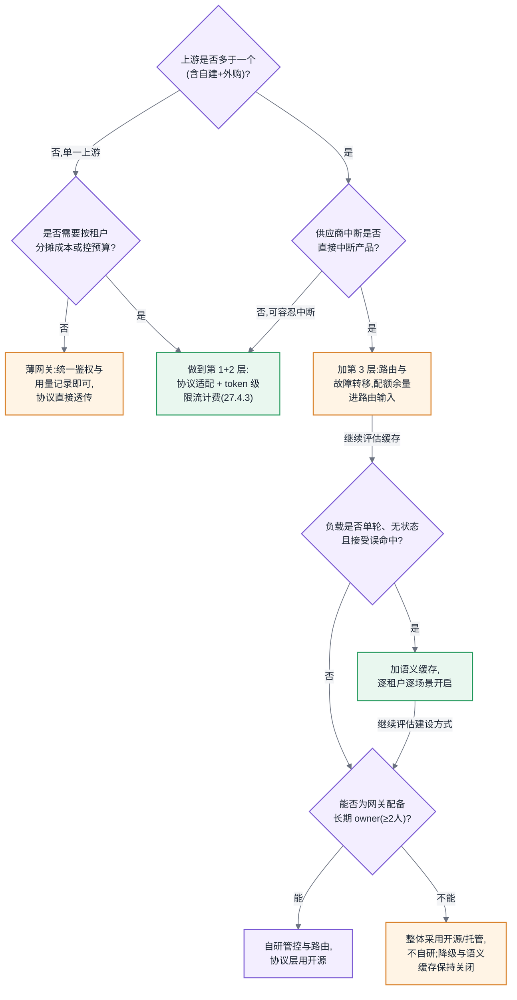

# 第 27 章 模型网关

## 27.1 链路定位

本章位于主线 B——一次推理请求全链路的最前端:请求离开业务应用之后、抵达任何一个推理引擎或外部供应商之前,穿过的第一层基础设施就是模型网关(Model Gateway)。它决定这次请求"去哪、能不能去、花了多少钱、失败了怎么办"。

## 27.2 依赖声明

本章建立在两条前文结论之上:[§3.3](../第一部分-基础与心智模型/第03章-人工智能与大模型基础.md#33-从-nlp-到-llm) 确立的"token 是吞吐、计费、限流、上下文长度的统一单位"——本章所有计量设计都以该口径为准,不再重述;以及第 2 章主线 B 的链路分解——网关是链路上唯一能同时看到所有模型、所有供应商、所有租户的位置,这个全局视野是它一切能力的来源。

## 27.3 问题场景:没有故障转移的四小时

> **案例元数据**
> - **案例类型**:合成案例
> - **数据性质**:示意
> - **来源或复现**:无(见声明);示意数字登记于 `CLM-027-001`
> - **适用边界**:业务多服务直连单一外部 LLM 供应商、无统一网关层的 SaaS 组织
> - **声明**:人物、机构、日期与数值均为写作构造的示意,用于说明方法,不构成真实事故记录

<!-- claim: CLM-027-001; classification: illustrative -->
一家做智能客服 SaaS 的公司,产品线全部构建在某头部供应商的 API 之上。业务代码里直接写着供应商的 SDK 调用,API Key 以环境变量下发到二十多个微服务。某个周四下午 14:07,该供应商的推理服务开始大面积返回 529 和超时——不是全挂,而是成功率从 99.9% 掉到 30% 左右,剩下的请求延迟从 2 秒涨到 40 秒以上。

平台负责人第一反应是切备用供应商——然后发现根本切不动。第一,没有统一出口:二十多个服务各自直连,切换意味着二十多次配置变更加滚动重启。第二,协议不兼容:备用供应商的消息格式、流式分帧、工具调用字段全都不同,业务代码里散落着对特定响应结构的解析逻辑,不是换个 base_url 就能通。第三,没人知道每个服务的调用量,备用供应商的账户配额只有主供应商的十分之一,盲切等于把故障从"上游挂了"变成"自己把备用额度打爆"。团队最终选择等待上游恢复,产品线实质中断四小时,当天流失了两个正在 PoC 的大客户。

事后复盘,最刺痛的一句话是:"我们不是没有备用供应商,我们是没有能力使用备用供应商。"多供应商不是签两份合同,而是一层基础设施——这层基础设施就是本章的主题。

## 27.4 原理与量化模型

### 27.4.1 网关的四层职责

模型网关不是"加了鉴权的反向代理"。它自上而下承担四层职责,每一层解决一个业务直连模式下无解的问题:

1. **统一 API 层与协议适配**:对内暴露一套稳定协议,对外适配 N 个供应商的差异。
2. **限流、配额与计费**:以 token 为单位控制"谁能用多少、用了多少钱"。
3. **路由与故障转移**:决定请求去哪个模型、哪个供应商,失败后去哪。
4. **缓存与去重**:在请求真正消耗算力之前拦截可复用的部分。

<!-- source: diagrams/sources/ch27-gateway-layers.d2 -->

图 27-1:网关架构分层图。请求先过管控层再过路由层,意味着限流和计费必须在不知道请求最终去哪之前就能做出判断——这是 token 级预估机制存在的根本原因。

### 27.4.2 协议适配:抹平差异的代价

统一 API 层的表面工作是格式转换,真正的代价在三处不对称:

**流式语义不对称**。各供应商的 SSE 分帧粒度、结束标记、错误在流中的表达方式各不相同。最麻烦的是错误时机:有的供应商在首帧前返回 HTTP 错误码,有的在流中间以事件形式报错——后者意味着网关已经向客户端发出了 200 和若干 token,此时上游挂了,你没有机会再改状态码。统一协议必须在流内定义错误事件,而不能依赖 HTTP 状态码,这是很多团队第一版网关返工的原因。

**能力集不对称**。工具调用(tool use)、结构化输出、多模态输入,各供应商支持程度和字段语义不同。适配层的纪律是:**只抹平表达差异,不伪造能力差异**。上游不支持结构化输出时,正确做法是路由层把它标记为不可选,而不是适配层用提示词模拟——模拟出来的能力精度不可控,故障转移到它时用户会收到质量断崖,这比明确报错更伤。

<!-- claim: CLM-027-002 -->
**token 计数不对称**。同一段文本在不同供应商的分词器下 token 数可以差 10%–40%(中文场景差异更大)。这直接冲击计费与限流:网关对租户的计量必须以**统一口径**([§3.3](../第一部分-基础与心智模型/第03章-人工智能与大模型基础.md#33-从-nlp-到-llm))记账——通常选定一个基准分词器做预估、以各供应商响应中返回的实际 usage 做结算,两套数字都要存,汇率(下文 27.4.3)负责换算成本。

适配代价的量化判断:每接入一个新供应商,协议适配的工程量大致固定(数周级),但**回归测试面积随已有供应商数量线性增长**——因为统一协议的每个语义都要在新旧供应商上重新验证。这就是为什么接入第 5 家供应商比第 2 家更贵,也是为什么统一协议的字段要克制:每多一个字段,就多 N 个供应商上的适配与测试义务。

### 27.4.3 token 级限流、配额与计费:可实现的设计

这是本章的技术核心。先回答一个前置问题:**为什么按请求数(QPS)限流在这里失效?**

<!-- claim: CLM-027-003 -->
因为 LLM 请求的资源消耗方差是普通 API 的三到四个数量级。一个 10 token 的短问答和一个 128K 上下文的长文档分析,都是"一个请求",但后者消耗的算力、显存驻留时间(KV Cache,见 [§3.4](../第一部分-基础与心智模型/第03章-人工智能与大模型基础.md#34-transformer-与注意力))和上游账单是前者的上万倍。按 QPS 限流,等于允许租户用长请求把整个集群打满而不触碰任何限制;反过来,为了防长请求把 QPS 压得很低,又会冤枉全部短请求。计量单位必须与资源消耗成正比,而在 LLM 链路上,这个单位就是 token([§3.3](../第一部分-基础与心智模型/第03章-人工智能与大模型基础.md#33-从-nlp-到-llm))。

**难点在于时序错位**:限流决策发生在请求进入时,但真实 token 消耗要到响应流结束才知道——输出多少 token 由模型自己决定。可实现的设计是"预估—预扣—结算"三步:

<!-- claim: CLM-027-004 -->
**第一步,预估(estimate)**。请求进入时计算预估消耗:

$$T_{est} = T_{in} + \alpha \cdot \min(max\_tokens,\ \hat{T}_{out})$$

其中 $T_{in}$ 是输入 token 数,用基准分词器现场计算(纯 CPU 操作,毫秒级);$max\_tokens$ 是请求声明的输出上限;$\hat{T}_{out}$ 是该租户在该模型上的历史输出均值(滑动窗口统计);$\alpha \in [1.0, 1.5]$ 是保守系数。没有历史数据时退化为直接用 $max\_tokens$——这会促使业务方声明合理的上限,是个良性副作用。

**第二步,预扣(reserve)**。以租户为 key 维护令牌桶(token bucket)——这里的"令牌"就是字面意义的 LLM token,桶容量为 $B$,补充速率为 $R$ TPM(tokens per minute)。请求进入时原子地预扣 $T_{est}$:余额不足则拒绝(返回 429 与建议重试时间 $\Delta t = (T_{est} - balance)/R$)。工程实现上,单实例用内存原子操作;多实例网关用 Redis + Lua 脚本保证"读余额—扣减"的原子性,或者更推荐的做法:把每个租户的桶**按一致性哈希固定到单个网关实例**上,避免分布式计数的精度与延迟问题——租户数远大于实例数时,这个方案既准又快。

<!-- claim: CLM-027-006 -->
**第三步,结算(settle)**。响应流结束(或中断)时,取上游返回的实际 usage,做差额回补:$\Delta = T_{est} - T_{actual}$,正数退回桶中,负数追扣(允许桶短暂为负,下个补充周期消化)。同时把 $T_{actual}$ 写入用量账本(usage ledger),作为计费依据。账本记录五元组:租户、模型、供应商、输入/输出 token 数、时间戳——注意输入输出必须分开记,因为二者价差普遍在 3–5 倍。

**计费在账本之上做汇率换算**。对内计费不建议直接透传供应商价格,而是定义"标准 token"记账单位,每个(模型,供应商)组合配一个汇率。这样供应商调价、故障转移导致的实际路由变化,都不会击穿对租户的价格承诺;汇率差额就是平台的路由自由度的成本或利润。

<!-- claim: CLM-027-005 -->
**配额与限流分层**。速率限制(TPM)防瞬时冲击,配额(月度 token 预算)控总成本,两者独立配置。经验规则:$B$ 取 $R$ 的 1/6 到 1/2(即允许 10–30 秒的突发),配额则直接对应预算部门批下来的钱数除以标准 token 单价。

这套设计的协作边界必须写进平台契约:**预估误差由平台承担,声明失真由业务方承担**。业务方把 $max\_tokens$ 声明为 32K 实际只用 200,预扣会频繁拒绝它自己的并发请求——平台不为此调大 $\alpha$ 或桶容量,而是把"预估/实际比"做成租户可见的指标,让业务方自己修声明。越过这条边界替业务方兜底,限流系统就会在三个月内退化成人肉审批。

所以这对做平台的人意味着什么:限流计费系统的本质是一套**异步对账系统**,而不是一个计数器。设计评审时只需要问三个问题——预估口径是什么、预扣的原子性怎么保证、结算差额往哪回补。三个问题都有答案,这套系统就成立。

### 27.4.4 路由、故障转移与降级

路由决策的输入变量,按优先级从高到低:

1. **硬约束**:模型能力(是否支持工具调用/多模态)、合规边界(数据是否允许出域)、上下文长度上限。不满足硬约束的候选直接出局,没有权衡余地。
2. **健康状态**:各上游的实时成功率与延迟,来自网关自身的被动观测(滑动窗口错误率)加低频主动探活。
3. **成本与配额余量**:各供应商的单价与剩余额度——还记得问题场景里"备用额度只有十分之一"吗?配额余量必须是路由的一等输入,否则故障转移会自己制造第二次故障。
4. **负载与延迟目标**:自建集群优先(边际成本低)还是延迟优先(选 P99 最好的上游),按租户的 SLO 等级决定。

<!-- claim: CLM-027-007 -->
故障转移的关键量化设计是**熔断器(circuit breaker)参数**:错误率超过阈值(如 30 秒窗口内 > 20%)则熔断该上游,进入半开状态后以小流量(如 1%)探测恢复。两个易错点:其一,超时必须按"首 token 延迟"和"token 间隔"分别设置,而不是总时长——长输出请求的总时长天然是分钟级,按总时长设超时等于没有超时;其二,流中断的请求**默认不自动重试到另一家供应商**,因为已经向客户端吐出的 token 无法收回,换一家重新生成会产生前后不一致的拼接文本。正确做法是在流内发错误事件,把重试决策交还给客户端;只有首 token 之前的失败才做透明转移。

降级是与转移不同的另一档策略:所有同级候选都不可用时,路由到更小/更便宜的模型,以质量换可用性。降级必须在响应中显式标注(如 header 中携带实际服务模型),并且**默认关闭、由租户显式选择加入**——对有些业务,静默降级的答案质量下滑比明确的 503 更具破坏性,这个判断只有业务方自己能做,平台不能代做。

图 27-2:一次请求的网关内部路径。故障转移只发生在首 token 之前,流已开始后的失败走流内错误事件——这条纪律决定了转移逻辑必须实现在流的建立阶段而非重试中间件里。

### 27.4.5 缓存与去重

<!-- claim: CLM-027-008 -->
网关层缓存分三档,收益与风险递增:

**精确缓存**:对(模型、完整请求体)的哈希做键。命中即零成本返回。适用面窄——只要提示词里有时间戳或用户名就永不命中——但零风险,应当默认开启。典型命中率 1%–5%,主要来自重试风暴和前端重复提交。

**请求去重(in-flight deduplication)**:相同请求正在处理中时,后到者挂载到同一个响应流上,而不是再发一次。它防的是重试风暴的自我放大:上游变慢→客户端超时重试→上游更慢。在故障场景下,这个机制比缓存本身更救命。

**语义缓存**:对请求做向量化,相似度超过阈值(如 0.95)则返回缓存答案。收益模型很诱人:客服、FAQ 类负载的语义重复率可达 20%–40%,命中一次省下整次推理。但风险必须算清:第一,误命中不可对称调参——阈值调低命中率上升但错误答案概率同步上升,而**一次张冠李戴的答案对用户信任的伤害远大于 40 次缓存命中省下的钱**;第二,多租户下语义缓存绝不能跨租户共享,否则就是数据泄露通道;第三,带上下文的多轮对话中"语义相似"几乎不成立,同一句话在不同上下文里是不同的问题。结论:语义缓存只适用于无状态、单轮、答案时效不敏感、且业务方明确接受误命中率的负载,由租户逐场景开启,平台默认不开。

注意区分:网关的语义缓存与推理引擎的前缀缓存(prefix caching,KV Cache 复用)是两个层次的东西——后者精确、无误命中风险、在引擎层完成(第五部分已述),前者是有损的应用层近似。两者不互相替代。

## 27.5 方案对比

网关的建设有三条路线:

**方案一:开源网关直接部署**(LiteLLM、Kong AI Gateway、Higress 等)。优点是协议适配现成、接入周期以天计。失效边界:**计费口径不可定制时失效**——开源网关的 usage 统计普遍以透传供应商返回为主,当你需要统一口径记账、内部汇率、与预算系统对账时,改造成本会超过自研核心模块;另外,当路由决策需要接入自建集群的实时负载信息时,通用网关的扩展点往往不够深。适用判断:供应商 ≤ 3、租户计费只需明细导出、无自建集群,直接用开源。

<!-- claim: CLM-027-009 -->
**方案二:自研网关**。优点是四层职责全部按自己的口径实现,尤其是 27.4.3 的预估—预扣—结算链路可以做准。失效边界:**团队没有长期 owner 时失效**——网关是每家供应商每次改协议都要跟进的持续投入,不是一次性项目;按经验,维持 5 家以上供应商的适配需要至少 2 名全职工程师,养不起这个编制就不要选这条路。

**方案三:云厂商托管网关**。优点是零运维、天然多区域。失效边界有二:**合规上失效**——所有请求全文经过第三方,金融、医疗等行业的数据出域审查通不过;**议价上失效**——托管网关通常与其自家模型生态绑定,路由策略的"中立性"存疑,当你想把流量从它的模型迁走时,摩擦力会显形。

<!-- claim: CLM-027-010 -->
现实中的主流答案是混合:开源网关做协议适配层(方案一的强项),自研限流计费与路由决策(方案二的核心),这样把持续维护成本最高的协议追赶工作外包给开源社区,把口径与决策权留在自己手里。

## 27.6 大数据对照

模型网关是全书中大数据经验**直接迁移比例最高**的一章。API 网关(Kong、Nginx、Zuul)时代的鉴权、路由、熔断、灰度,以及 Kafka 时代按租户配额(quota)限流的多租户思想,在这里几乎原样复用:熔断器参数设计、一致性哈希分桶、异步对账,都是老手艺。YARN/Mesos 按"容器数 × 资源规格"做配额的思路,更是 token 配额的直系祖先——把"vcore-小时"换成"token",记账框架一模一样。

但有四个新增复杂度是老经验没有覆盖的,每一个都对应本章的一节:

1. **计量单位从请求变成 token**(27.4.3)。传统网关限流的最小单位是请求,消耗方差在一个数量级内;LLM 请求方差达三四个数量级,且**真实消耗在决策之后才知道**。Kafka quota 按字节限流看似接近,但字节数在请求进入时是确定的,不需要预估—结算的异步对账。这是质变,不是参数调整。
2. **响应是有状态的流**(27.4.4)。传统网关的重试假设请求幂等且响应未送达;LLM 流式响应吐出一半时,重试语义就不存在了。"首 token 前可转移、之后不可"这条纪律在 Nginx 时代没有对应物。
3. **后端不可互换**(27.4.2)。挂在传统负载均衡器后面的实例是同质的;挂在模型网关后面的模型是异质的——同一个问题不同模型给出不同质量的答案。故障转移因此从纯可用性问题变成质量问题,这就是降级必须显式标注、由租户选择加入的原因。
4. **缓存从精确变成近似**(27.4.5)。Varnish/CDN 时代的缓存命中是精确匹配,错误率为零;语义缓存引入了"命中但答错"这个传统缓存体系里不存在的故障模式。

所以这对做平台的人意味着什么:招一个做过 API 网关的工程师来建模型网关是对的,他的熔断、多租户、对账经验都能用上;但要在设计评审里盯住上面四点——凡是他按"请求"思考的地方,都要求他改成按"token 与流"重新推一遍。

## 27.7 选型决策树

图 27-3:"我的网关该做到哪一层"决策树。网关能力应当按需求逐层叠加,而唯一不该省的一层是 token 级计量——它是其余所有层(路由看配额余量、缓存算收益、降级算成本)的数据地基。

网关的四层职责中,协议适配可以买,路由策略可以抄,语义缓存可以不做,唯独 token 级的计量与对账必须自己做对——因为它定义了你的平台对内的"货币"。货币口径错了,上层的一切成本核算、容量规划、路由决策都在错误的地基上运行。

## 来源、口径与复现说明

本章 27.3 的问题场景为写作构造的合成案例,人物、机构、日期与全部数值均为示意,不对应任何真实事故(见 `CLM-027-001`)。正文中的量化数字分两类:分词器差异、缓存命中率、价差等区间是尚未逐一核验的经验值,预估公式与令牌桶容量建议则是给出输入、公式与假设的推导估算,均不是实测统计。全部关键结论已按条登记在 `references/claims/chapter-27.yaml`,正文以 `<!-- claim: CLM-027-XXX -->` 注释对应到段落。后续计划以公开分词器对比实测与网关限流复现实验(labs)替换经验区间,届时相应 claim 将升级为 `measurement` 并补登来源。

---

**读完本章,你应当能**:设计一套支撑多模型、多供应商的网关架构——包括写出 token 级"预估—预扣—结算"限流计费链路的完整数据流,给出路由决策的输入变量与优先级排序,判断故障转移在流式响应中的合法时机,并对着决策树判定自己的场景该把网关建到第几层。
