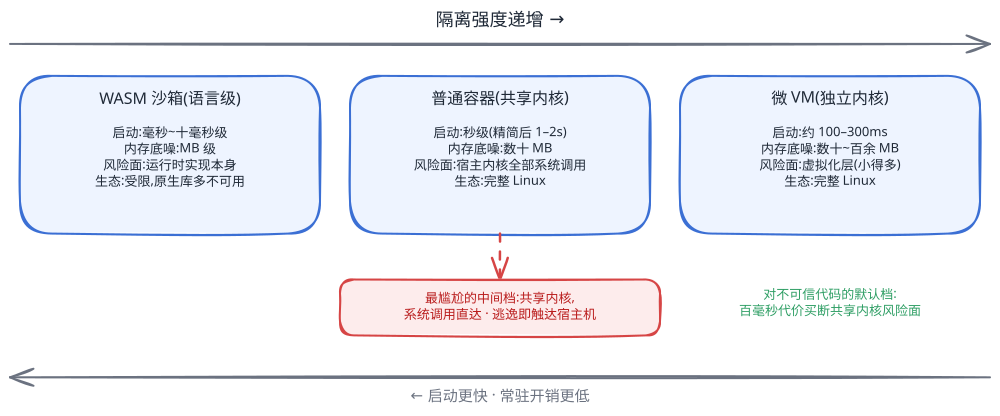
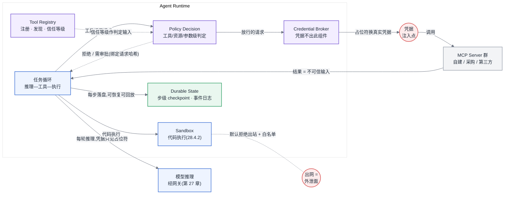
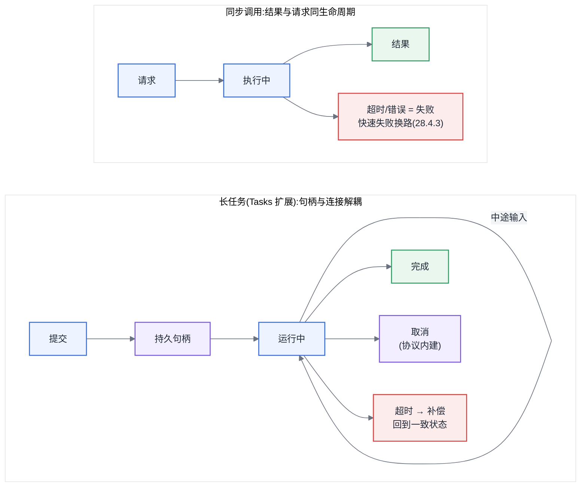
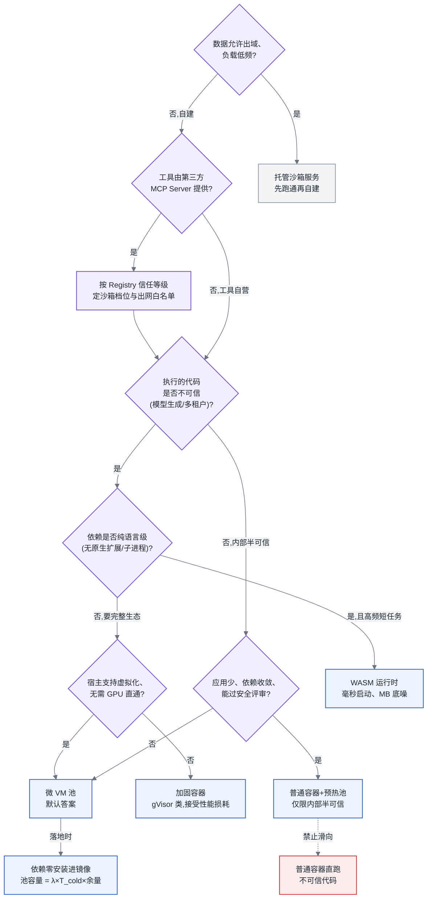

# 第 28 章 Agent 运行时基础设施

## 28.1 链路定位

本章位于主线 B"一次推理请求的全链路"的最上游延伸段:当一次请求不再是"进网关、出 token"的单跳调用,而是由模型驱动的多轮"推理—工具调用—代码执行"循环时,网关(第 27 章)之上需要一层 Agent 运行时,本章讲的就是这一层的基础设施接口——沙箱、工具调用通道、会话状态存储。

## 28.2 依赖声明

本章建立在三条前置结论之上:第 27 章"网关是模型流量的唯一入口,限流与计费在 token 级完成";第 15 章"向量检索是独立的存储基础设施,有自己的容量与延迟模型";[§3.4](../第一部分-基础与心智模型/第03章-人工智能与大模型基础.md#34-transformer-与注意力)"KV Cache 使多轮对话的上下文成本随轮次累积"。Agent 的架构设计(规划策略、多 Agent 协作模式、提示词工程)不在本书范围,遇到这类问题请查阅专门讨论 Agent 设计的资料;本章只回答一个问题:**平台方要为 Agent 负载提供什么样的执行环境、资源边界和状态存储**。

## 28.3 问题场景:沙箱冷启动吃掉了一半延迟

> **案例元数据**
> - **案例类型**:合成案例
> - **数据性质**:示意
> - **来源或复现**:无(见声明);登记为 `CLM-028-001`
> - **适用边界**:多应用共享的 Agent 平台、按容器现装依赖的沙箱方案;数值仅用于说明延迟构成的分析方法
> - **声明**:人物、机构、日期与数值均为写作构造的示意,用于说明方法,不构成真实事故记录

<!-- claim: CLM-028-001; classification: illustrative -->
一个数据分析 Agent 上线三周后,业务方拿着 trace 来找平台团队:端到端 P50 延迟 38 秒,其中模型推理(4 轮调用累计)只占 11 秒,真正的大头是每轮代码执行前的沙箱准备——每次执行 Python 代码,平台都新起一个容器:拉起容器 1.8 秒,安装 pandas/numpy 依赖 6.5 秒,单轮沙箱准备近 8.5 秒,4 轮下来 34 秒里沙箱冷启动占了 22 秒。业务方的困惑很直接:"我在本地跑同样的代码,总共不到 3 秒,为什么上了平台反而慢了十倍?"

平台方的第一反应是预热容器池,但立刻撞上第二个问题:这个平台上跑着 40 多个 Agent 应用,依赖组合各不相同,预热池要么按最大公约数打一个 3 GB 的胖镜像(冷启动变快了,但每个常驻沙箱吃 800 MB 内存,池子稍大内存就爆),要么按应用维度各自建池(碎片化,低频应用的池子命中率不到 10%,等于白养)。更麻烦的是安全团队随后介入:这些沙箱执行的是模型生成的代码,模型会写出什么没人能保证——上周就有一段生成代码试图读 `/etc/passwd`,还有一段起了个死循环把宿主机一个核打满 20 分钟。安全团队要求"强隔离",业务团队要求"快",两边的要求都合理,而当前的普通容器方案两头都不占:隔离不如虚拟机,启动不如进程。这就是本章要解决的问题:**隔离强度、启动延迟、资源开销三者之间没有全优解,平台方必须给出一个有依据的取舍,而不是被两边的诉求来回拉扯。**

## 28.4 原理与量化模型

### 28.4.1 Agent 负载的资源画像:交替占用,而非持续占用

Agent 任务与普通推理请求最大的区别在资源占用模式。一次 N 轮的 Agent 任务,时间轴上是三类资源的交替:

- **模型推理**:占 GPU,每轮几百毫秒到几秒;
- **工具调用**:占网络与下游服务(检索、数据库、外部 API),GPU 空闲;
- **沙箱执行**:占 CPU 与内存,GPU 同样空闲。

<!-- claim: CLM-028-002; classification: illustrative -->
这意味着从 GPU 视角看,Agent 请求的**有效占空比**(duty cycle)通常只有 20%–40%。如果平台按"一个请求占住一份推理并发直到结束"来做并发控制,GPU 并发额度会被大量空转的等待占掉。正确的接口设计是:Agent 运行时的每一轮推理都作为独立请求经网关进入推理服务(轮与轮之间释放推理侧并发),工具与沙箱的并发由运行时单独治理。这是 Agent 运行时值得作为独立基础设施层存在的第一个理由。

```mermaid
%%{init: {'theme':'base','themeVariables':{
  'primaryColor':'#EEF4FF','primaryBorderColor':'#3B6FD4','primaryTextColor':'#1F2937',
  'secondaryColor':'#F3F4F6','tertiaryColor':'#FFFFFF',
  'lineColor':'#6B7280','fontFamily':'-apple-system, Segoe UI, Helvetica, Arial, sans-serif','fontSize':'14px'
}}}%%
gantt
    title 一次 4 轮 Agent 任务的资源交替占用(示意,单位:秒)
    dateFormat s
    axisFormat %S
    section GPU(推理)
    第1轮推理          :a1, 0, 2s
    第2轮推理          :a2, 13, 3s
    第3轮推理          :a3, 20, 3s
    第4轮推理(总结)   :a4, 30, 3s
    section CPU(沙箱)
    沙箱冷启动          :crit, b1, 2, 8s
    代码执行            :b2, 10, 3s
    代码执行(复用沙箱) :b3, 26, 4s
    section 网络(工具)
    检索工具调用        :c1, 16, 4s
```

图 28-1:一次 Agent 任务的资源占用时序。GPU 的有效占空比只有约三分之一,沙箱冷启动(红色)是唯一一段不产出任何价值的纯开销——优化 Agent 延迟先砍它,而不是先优化推理。

### 28.4.2 沙箱:隔离级别的三档与延迟预算

<!-- claim: CLM-028-006 -->
模型生成的代码在威胁模型上等同于**不可信第三方代码**——这是所有设计依据的出发点。隔离方案实际上只有三档,每一档对应一组可量化的指标(数量级,非精确值):

<!-- claim: CLM-028-009 -->
| 维度 | 容器(共享内核) | 微 VM(独立内核) | WASM(语言级沙箱) |
|---|---|---|---|
| 隔离边界 | namespace + cgroup + seccomp,共享宿主内核 | 硬件虚拟化,独立 guest 内核 | 运行时字节码校验,无系统调用直通 |
| 冷启动延迟 | 数百毫秒~秒级 | 约 100–300 毫秒(精简 guest) | 毫秒~十毫秒级 |
| 单实例内存底噪 | 数十 MB | 数十~百余 MB | MB 级 |
| 逃逸风险面 | 宿主内核全部系统调用面 | 虚拟化层(小得多) | 运行时实现本身 |
| 生态兼容 | 完整 Linux,任意依赖 | 完整 Linux,任意依赖 | 受限,原生库/子进程多数不可用 |

三个关键的量化判断:

**第一,冷启动延迟的构成要拆开算。** 沙箱就绪时间 = 实例拉起 + 镜像/文件系统就绪 + 依赖与解释器加载。问题场景中 8.5 秒里 6.5 秒是依赖安装——这与隔离技术无关,任何一档隔离下现装依赖都是灾难。所以第一条设计规则是:**依赖必须进镜像或进预挂载的只读层,运行时零安装**。做到这一点后,容器冷启动回到 1–2 秒,微 VM 回到 200 毫秒上下,此时再谈隔离技术的选择才有意义。

<!-- claim: CLM-028-003 -->
**第二,预热池的容量是一道算术题。** 设沙箱请求到达率 λ(次/秒),冷启动耗时 T_cold(秒),池子要吸收冷启动,常驻实例数下限约为 λ × T_cold 再乘以峰值余量(1.5–2 倍);内存成本 = 实例数 × 单实例底噪。同样吸收 λ=10 次/秒 的负载,容器池(按 500 MB 胖镜像实例)需要 10×2×2=40 个实例约 20 GB 内存;微 VM 因 T_cold 短一个数量级,池子可以小一个数量级甚至不需要池。**预热池的本质是用内存换启动延迟,隔离技术决定了这笔交换的汇率。**

**第三,资源限制必须四维齐全。** CPU(cgroup 配额,防死循环)、内存(硬上限 + OOM kill)、墙钟时间(运行时层面强制超时,通常 30–120 秒)、网络(默认拒绝出站,白名单放行)。四者缺一不可:问题场景里那个打满一个核 20 分钟的死循环,就是只限了内存没限墙钟时间的结果。网络默认拒绝尤其重要——模型生成代码的数据外渗(exfiltration)风险,靠事后审计抓不住,只能靠默认关闭。

<!-- source: diagrams/sources/ch28-sandbox-spectrum.excalidraw -->

图 28-2:三档沙箱在隔离强度—启动延迟—资源开销上的位置。普通容器处在最尴尬的中间档:隔离不如微 VM、启动不如 WASM,而它恰恰是多数团队的默认选择——对不可信代码,微 VM 用百毫秒级的代价买断了共享内核这个最大风险面。

### 28.4.3 工具调用:超时、重试与延迟放大

工具调用的基础设施三件套(超时、重试、并发控制)在微服务时代已是常识,Agent 场景的新问题是**放大效应**:一次 Agent 任务串行含 N 轮工具调用,任何一轮的尾延迟都直接加进端到端延迟,且失败重试的代价远高于普通 RPC——因为一轮失败后模型往往需要**额外一轮推理**来处理错误并重新决策。

<!-- claim: CLM-028-004 -->
<!-- claim: CLM-028-007 -->
量化这两个效应:

- **尾延迟放大**:单工具 P99 超时率为 p,N 轮串行任务至少踩中一次尾部的概率为 1−(1−p)^N。p=1%、N=8 时约 7.7%——单个工具看起来无害的尾部,在任务级放大成接近 8% 的劣化率。所以工具的超时预算必须**从任务级 SLO 反推**:任务预算 60 秒、预计 8 轮,单轮工具超时就不能设 30 秒这种"宽容"值,10 秒硬超时 + 快速失败让模型换路,优于死等。
- **重试的 token 成本**:普通 RPC 重试只花一次网络往返;Agent 里工具失败若交回模型处理,多付的是一整轮推理的 token 与延迟(数千 token、数秒)。因此设计规则是:**幂等的、瞬态的失败(超时、429、5xx)在运行时层重试,重试对模型透明;只有语义性失败(参数错、业务拒绝)才交回模型**。把所有失败都抛给模型"智能处理",是用最贵的组件干最便宜的活。
- **并发控制的位置**:工具的下游(内部数据库、外部 SaaS API)各有自己的配额,Agent 的多轮循环意味着同一任务会反复敲同一下游。并发与配额治理必须做在运行时的工具调用通道上(按工具、按租户两个维度限流),而不是指望每个 Agent 应用自律——这与网关对模型流量的治理(第 27 章)是同构的:**运行时之于工具流量,就是网关之于模型流量**。

<!-- claim: CLM-029-013 -->
这套治理要发挥作用,前提是多层结构在 trace 上可见。好消息是这层结构已经有了标准词汇:OpenTelemetry 的 GenAI 语义约定为 Agent 调用、工具执行定义了 `invoke_agent`、`execute_tool` 等标准操作名,MCP 交互另有专门约定——一次 Agent 请求由此成为一棵标准的嵌套 span 树:`invoke_agent` 里套模型调用,模型调用之间夹 `execute_tool`,工具 span 里再套沙箱执行。对本节的意义很具体:上面算过的尾延迟放大(p=1%、N=8 轮放大到约 8%),在没有分层 trace 时的定位方式是"日志考古"——把运行时、工具服务、沙箱三套日志按时间戳手工对齐;有了标准嵌套 span,同一条 trace 上一眼可见是模型在等工具、工具在等下游、还是沙箱在等冷启动,超时预算的分配(任务级 SLO 反推单轮超时)也第一次有了逐层的实测依据。运行时打点时应直接采用这套词汇而不是自造名字,理由与迁移缓冲层的做法见第 29 章"把指标说同一种语言:OTel GenAI 语义约定"一节。

### Agent Runtime 2.0:协议、权限与持久执行

28.4.3 把工具调用当作运行时内部的一条 RPC 通道来治理,但没有回答通道两端的问题:工具怎么接进来,以及"能不能调这个工具"由谁说了算。这两个问题在 2026 年有了协议层的答案,也把 Agent 运行时从"沙箱 + 通道 + 状态"扩成一张更完整的组件图。

<!-- claim: CLM-028-011 -->
**接口的一半已经协议化。** MCP(Model Context Protocol)把"模型与外部世界的接口"标准化为一层薄协议:连接双方在会话建立时各自声明能做什么,能力按请求协商而不是全局假设。服务端以三种原语暴露能力——Resources 提供上下文(模型可以读什么)、Prompts 提供模板(用户可以选什么)、Tools 提供动作(模型可以做什么);客户端也有对称的特性——Roots 划定服务端可见的文件边界,Sampling 让服务端反过来借用客户端的模型能力,Elicitation 允许执行中途向用户补要输入。进度上报与取消是协议内建的工具件,不必每家自造;超出单次请求生命周期的长任务经 Tasks 扩展获得持久句柄——提交即返回句柄,此后轮询状态、接收进度、注入中途输入,任务与连接解耦。落到平台上,这意味着工具接入从"每个工具一套私有 RPC + 一份自研注册表"收敛为协议化的注册与发现;但协议只管接口,健康检查、重试、幂等、并发治理仍然是运行时的责任——28.4.3 的三件套一件都没少,只是通道两端从此说同一种语言。

图 28-3:Agent Runtime 2.0 的组件边界。实线为调用流,虚线为授权判定流;凭据只在 Broker 到调用边界的一小段出现(红点),模型、会话历史与 Durable State 里自始至终只有占位符。

图上四个新组件各管一件不能混的事:Tool Registry 管注册与发现,连同每个 MCP Server 的信任等级(自建/采购/第三方);Policy Decision 在每次工具调用前做授权判定,粒度到工具级、资源级、参数级;Credential Broker 集中保管凭据,只在调用真正发出的边界注入;Durable State 把任务执行做成步级 checkpoint 加事件日志——28.4.4 的会话状态回答"对话历史在哪",Durable State 回答"任务执行到第几步、每步做了什么",长任务的跨实例恢复与事后审计回放都靠它。

**同步调用与长任务是两套状态机,不能共用一套超时语义。** 同步调用的生命周期与请求相同:请求→执行→结果或错误,超时即失败,28.4.3 的快速失败纪律直接适用。长任务不同:提交换来的是句柄而不是结果,运行中可以轮询、收进度、被中途补参;"超时"不再等于失败,而是触发一个必须回答的问题——任务此刻处于什么状态,要取消还是要补偿。

图 28-4:同步调用与长任务的状态机。同步语义下超时即失败、重试即可;长任务把结果换成句柄之后,取消、补偿与幂等从可选项变成必选项——右侧每个终态都要有明确的到达路径,"不知道任务最后怎样了"不是合法终态。

五个机制各自解决什么、谁负责、缺了会怎样,一张表说清:

| 机制 | 解决什么 | 谁负责 | 典型失效形态 |
|---|---|---|---|
| 取消 | 用户或上游放弃后停止计费与副作用 | 运行时发起,工具执行(协议内建信号) | 只停轮询不停任务:后台继续烧资源、继续产生副作用 |
| 超时 | 有界等待,快速失败换路(28.4.3) | 运行时 | 长任务照抄同步超时:把仍在正常运行的任务判死 |
| 重试 | 瞬态失败自愈,对模型透明(28.4.3) | 运行时(瞬态失败);模型(语义性失败) | 重试无幂等键 = 重复下单 |
| 补偿 | 已产生副作用的失败任务回到一致状态 | 工具方提供逆操作,运行时编排 | 无补偿设计:多步操作半途失败留下脏状态 |
| 幂等 | 同一请求重复到达只生效一次 | 工具以幂等键实现,运行时生成并传键 | 键的作用域错位(按会话而非按步),把合法的重复调用也吞掉 |

<!-- claim: CLM-028-012 -->
<!-- claim: CLM-028-013 -->
**权限是一条只能衰减的委托链。** 用户把一部分权限委托给 Agent,Agent 再把子任务连同更小的权限交给子 Agent——链上每一跳权限只能收窄,不能放大,而且这条规则必须由运行时(Policy Decision 组件)强制,不能指望模型"自觉"不越权:模型的行为由输入文本驱动,而输入文本里可能混着攻击者的话(见下段)。第二条硬规则是审批与请求内容绑定:高危操作的人工审批必须绑定请求参数的哈希——批的是"以 A 参数执行",执行前校验哈希一致——否则审批与执行之间存在一个 TOCTOU(校验与使用之间)窗口:批的是转账 100 元,执行时参数已被改成 10 万。第三条最常被违反:**凭据绝不进 Prompt,也绝不进长期会话状态**。Prompt 会被日志、trace、上下文回放复制到无数地方,进了 Prompt 的凭据等于广播;正确形态是模型全程只见占位符,Credential Broker 在调用发出的边界把占位符换成真实凭据,用后即弃。MCP 的授权面基于 OAuth 2.1,其安全原则要求用户对数据访问与操作显式同意并保持控制——这正是把授权与凭据做成运行时组件而非提示词内容的协议依据。

**威胁面的共同结构是"数据被当成指令"。** prompt injection(检索结果或网页内容里埋着"忽略之前的指令")与 tool poisoning(工具描述或工具输出里埋着诱导模型调用其他工具的话)是同一个结构的两个入口:模型不区分数据通道与指令通道,凡是进上下文的文本都可能改变它的行为。运行时能做的不是"教模型分辨",而是收边界:第三方 MCP Server 的信任等级进 Tool Registry,低信任工具的输出进入上下文前标记来源、其后续可触发的动作由 Policy Decision 收紧;工具输出一律按不可信输入对待——与 28.4.2"模型生成的代码等同于不可信第三方代码"是同一条威胁模型的两面;SSRF 与数据外泄的出网路径,归 Sandbox 的网络策略管(默认拒绝出站 + 白名单,28.4.2 已述),不另设机制。

### 28.4.4 会话状态与上下文存储

<!-- claim: CLM-028-005 -->
<!-- claim: CLM-028-008 -->
Agent 的会话状态包括:对话与工具调用历史(文本)、沙箱产生的文件(代码、数据、图表)、以及可选的沙箱快照。规模估算:

- **文本状态**:每轮对话 + 工具结果按 2–8 KB 计,一个 50 轮的重会话约 100–400 KB;百万级活跃会话也不过数百 GB——这对存储系统是小数目,难点不在容量而在访问模式:读写以会话 ID 为键、高频、小对象,典型的 KV 负载。
- **文件产物**:一次数据分析任务动辄产出几 MB 到几百 MB 的中间文件,这才是容量大头,应走对象存储,状态里只存引用。
- **KV Cache 不是会话存储**:推理引擎里的前缀缓存([§3.4](../第一部分-基础与心智模型/第03章-人工智能与大模型基础.md#34-transformer-与注意力))是易失的性能优化,会话状态必须能在推理实例重启、请求被路由到另一实例后完整重建。把"会话还在不在"押在某台推理实例的显存上,是把持久性责任放错了层。

过期策略按三档设计:热(活跃会话,KV 存储,TTL 小时级)、温(可恢复会话,对象存储,天级)、冷(审计与回放,归档,按合规要求保留)。沙箱本身按**默认无状态**设计——任务结束即销毁,需要跨轮保留的文件显式落到对象存储再挂回;为"用户可能回来"而长期挂起沙箱实例,内存成本会随会话数线性增长,只对付费的重交互场景开这个口子。

### 28.4.5 RAG:基础设施视角的一句话

Agent 的检索工具在基础设施上就是第 15 章的向量检索服务,索引构建、召回精度与容量模型一律见第 15 章,此处不重述。运行时层面只补一条:检索作为工具被 Agent 循环反复调用时,其 QPS 会被轮次数放大(一次任务 3–5 次检索是常态),向量服务的容量规划要按"Agent 任务数 × 平均检索轮次"而非"请求数"来做,否则上线即过载。

所以这对做平台的人意味着什么:Agent 运行时的设计依据全部可算——沙箱池容量是 λ×T_cold 的算术,超时预算是任务 SLO 的反推,状态规模是轮次×单轮体积的乘法。拿不出这几笔账,"强隔离"与"快"之争就永远停留在立场层面。

## 28.5 方案对比

<!-- claim: CLM-028-010 -->
**方案一:普通容器 + 预热池。** 在既有 K8s 上直接落地,任意依赖可用,工程成本最低。失效边界有二:其一,代码来源为完全不可信(多租户平台上执行模型生成代码)时,共享内核的逃逸风险面使它过不了安全评审——容器加固(gVisor 类用户态内核)可缓解但会带来两位数百分比的系统调用性能损耗;其二,预热池按依赖组合碎片化后命中率崩塌,应用数超过十几个、依赖差异大时,内存成本反超微 VM。适用于:单租户内部平台、代码来源半可信、应用数少。

**方案二:微 VM 池。** 独立内核买断最大风险面,百毫秒级冷启动使池子可以很小甚至不需要,是 2026 年多租户 Agent 平台的默认答案。失效边界:需要 GPU 直通给沙箱内代码(如 Agent 生成 CUDA 代码)时,设备直通配置复杂且破坏快速启动优势;宿主机不支持嵌套虚拟化(公有云部分实例规格)时直接不可用;单实例底噪高于 WASM 一个数量级,对每秒数百次的高频短代码执行,内存与调度开销不划算。

**方案三:WASM 运行时。** 毫秒级启动 + MB 级底噪,高频、短小、纯计算的工具执行(表达式求值、格式转换、轻量脚本)下成本比前两者低一到两个数量级。失效边界最硬:生态。依赖原生扩展的库(pandas、numpy 的 C 扩展路径)、子进程、完整文件系统语义的负载大多跑不起来;让业务方为沙箱改写工具代码,推广阻力极大。它是补充档,不是主力档。

**方案四:托管沙箱服务(公有云代码解释器类产品)。** 零运维、隔离责任外移。失效边界:数据出域过不了合规(金融、政务几乎一票否决);按调用计费在高频负载下成本曲线陡峭;超时、网络策略等控制粒度受制于服务方。适用于:早期验证、低频负载、无专职平台团队。

实践中成规模的平台通常收敛为**双轨**:微 VM 做默认档(不可信代码、完整生态),WASM 做高频轻负载档;普通容器只保留给内部半可信场景。

## 28.6 大数据对照

多租户计算沙箱不是新问题,Hadoop/Spark 时代攒了十几年经验,能直接复用的有三条:

- **资源限额与配额治理**:YARN 用 cgroup 限制每个 container 的 CPU/内存、按队列做多租户配额,这套"限额 + 配额 + 抢占"的思路原样搬到 Agent 沙箱,连底层机制(cgroup)都是同一个。
- **池化换启动延迟**:Spark 的 Executor 常驻复用、Hive LLAP 的守护进程池,解决的正是"JVM 冷启动太慢"——与沙箱预热池是同一笔"内存换延迟"的账,λ×T_cold 的容量算法通用。
- **推测执行与超时治理**:MapReduce 对慢任务的推测执行、任务级超时杀,对应工具调用的快速失败与重试。

失效的经验有两条,失效原因值得记住:

- **"同一集群 = 同一信任域"的假设失效。** YARN container 里跑的是本公司工程师写的、进过代码评审的作业,共享内核的隔离够用;Agent 沙箱里跑的是模型现场生成的代码,威胁模型直接跳到"不可信第三方",这是隔离档位必须从 cgroup 升到独立内核的根本原因。大数据平台十几年没被内核逃逸伤过,不是因为容器隔离强,而是因为代码可信——这个前提在 Agent 场景不成立了。
- **批处理的延迟感受失效。** YARN 分配一个 container 花 2–5 秒,在跑 20 分钟的批作业里没人在意;Agent 是交互式负载,用户盯着屏幕等,同样的 2 秒直接进入体验。大数据的调度器优化目标是吞吐与公平,Agent 运行时的优化目标是尾延迟——目标函数变了,照搬调度策略会把优先级排错。

## 28.7 选型决策树

图 28-5:Agent 沙箱选型决策树。第一道分岔不是技术而是信任域——代码是否可信决定了隔离档位的下限,其余问题只是在这个下限之上做延迟与生态的权衡;第三方 MCP Server 提供的工具先过一道信任等级判定,再进入常规选型。

沿树走一遍你所在的场景:先问数据能否出域(能且量小,托管服务是最省的起点);自建则先看工具来源——第三方 MCP Server 提供的工具按 Tool Registry 的信任等级定沙箱档位与出网白名单(见"Agent Runtime 2.0"一节),再定信任域——不可信代码把普通容器直接排除;再看依赖形态决定 WASM 还是微 VM;只有内部半可信且规模可控的场景,普通容器加预热池才是合理的省事之选。无论落在哪个叶子,两条纪律不变:依赖零安装、资源限制四维齐全(CPU/内存/墙钟/网络)。

## 28.8 来源、口径与复现说明

本章问题场景为合成案例,其人物、机构与全部数值(P50 38 秒、单轮沙箱准备 8.5 秒等)均为写作构造的示意,登记为 `CLM-028-001`,不构成真实事故记录。预热池容量、尾延迟放大率与会话状态规模三处数字为公式推导估算,输入、公式、假设与误差来源见 `references/claims/chapter-28.yaml` 中 `CLM-028-003`、`CLM-028-004`、`CLM-028-005` 的 `estimate` 字段,读者代入自己的 λ、T_cold、p、N 与轮次分布即可复算。三档隔离对比中的量级数字(微 VM 百毫秒级冷启动、gVisor 类加固的性能损耗等)为业界常见量级表述,目前登记为待补来源(`CLM-028-009`、`CLM-028-010`),使用前请以目标运行时的官方文档与自测数据校准。"Agent Runtime 2.0"一节的协议机制结论(`CLM-028-011`、`CLM-028-012`)挂接 MCP 规范当期版本(具体版本号与复核周期记录在 claim 条目中,正文不锁定版本);审批哈希绑定与权限单调衰减(`CLM-028-013`)是作者的工程原则,规范来源支撑其授权组件化与用户显式同意的方向,但不直接规定这两条机制,按未核验立场登记。本章全部 claim 登记与状态以 `references/claims/chapter-28.yaml` 为准,校验方式为 `npm run docs:check:evidence`。

---

读完本章,你应当能:为一个给定的 Agent 负载算出沙箱预热池的容量与内存成本(λ×T_cold×余量),依据代码信任域与依赖形态在容器/微 VM/WASM 三档中做出并论证隔离选型,从任务级 SLO 反推出单轮工具调用的超时与重试预算,并给出会话状态的规模估算与热温冷三档过期策略——即为 Agent 平台设计出一套完整的运行时资源与隔离方案。
