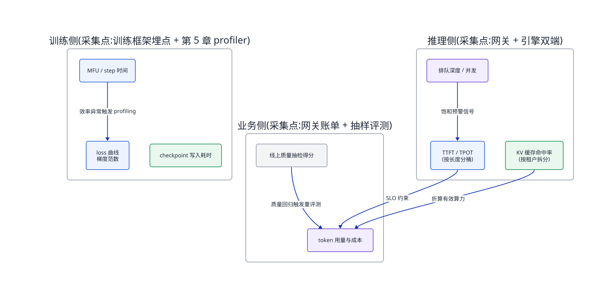
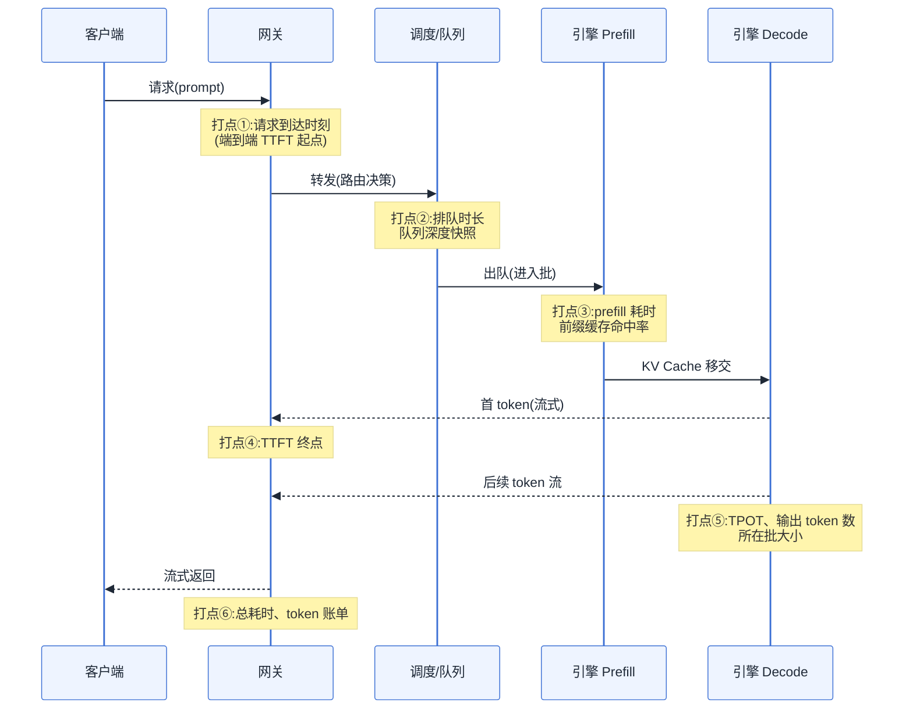
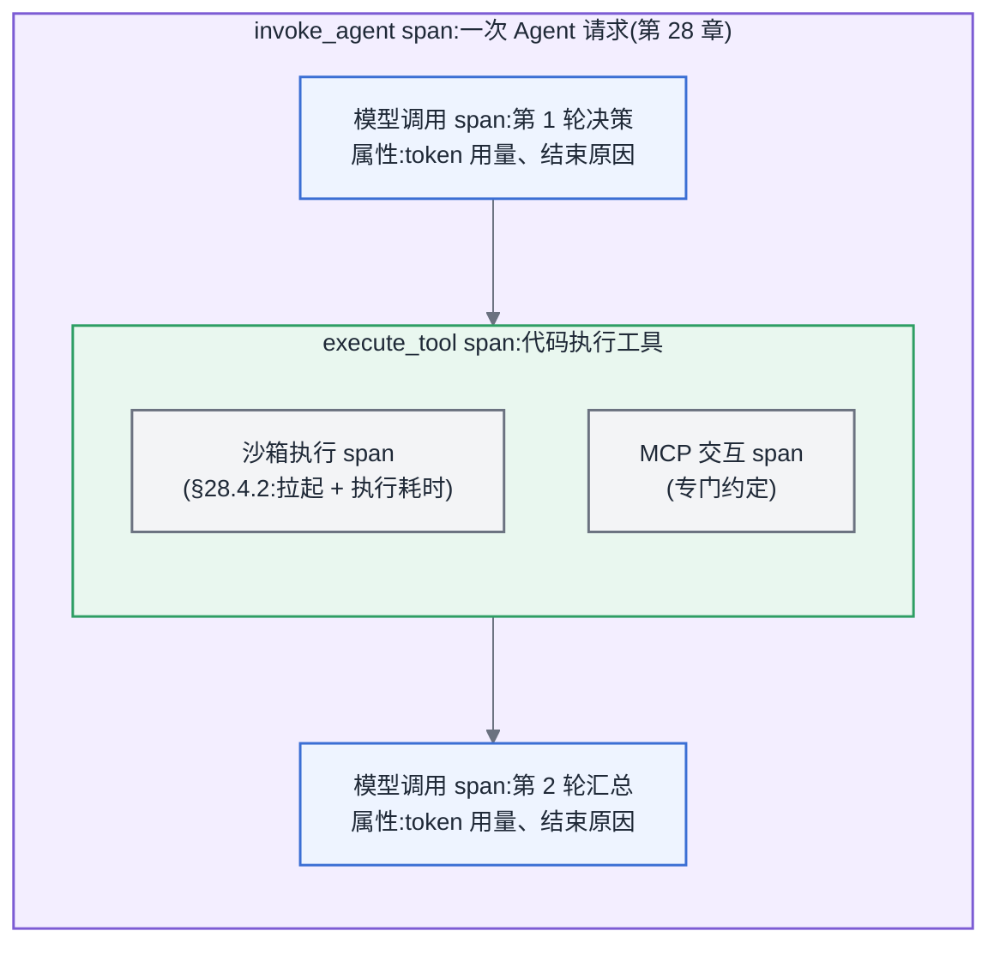
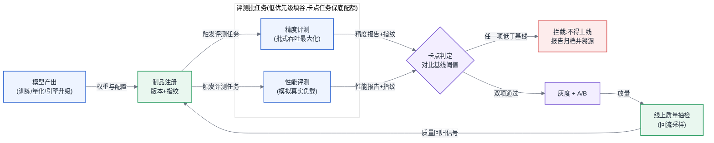
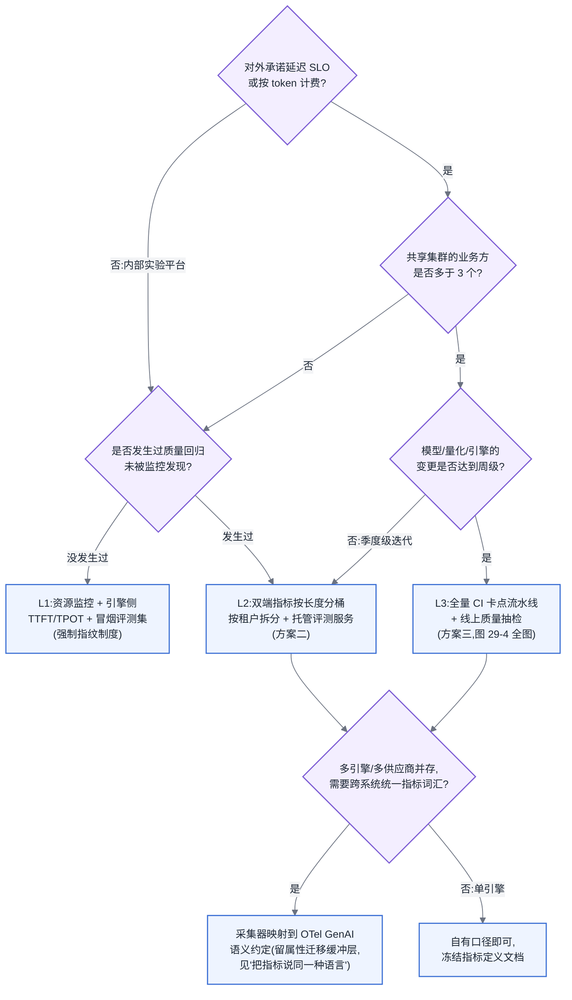

# 第 29 章 可观测性与评测流水线

## 29.0 监控系统现在，评测决定能否上线

本章横跨两条主线的末端:在主线 B(一次推理请求的全链路)上,它负责回答"这条链路现在跑得怎么样"——每一跳的延迟、吞吐、缓存命中被谁看到、怎么看到;在主线 A(一次训练任务的生命周期)上,它负责训练产出物离开训练集群之后的第一道关卡——评测。可观测性告诉你系统的现在,评测流水线决定模型的未来能不能上线。

## 观测探针要插在已有资源链路上

本章建立在三条前置结论之上:[§3.7](../第一部分-基础与心智模型/第03章-人工智能与大模型基础.md#37-评测与-benchmark-的基本概念) 已经划清了精度评测(accuracy evaluation)与性能评测(performance benchmark)是两套目标、两套指标、两套基础设施,本章不再重新定义,只讨论如何把这两套体系建成平台能力;[§5.4](../第一部分-基础与心智模型/第05章-CUDA、CANN与加速器软件栈.md#54-profiling-方法论全书唯一定义处) 已经给出了训练侧 profiling 方法论,本章训练可观测性部分直接引用;第 22–25 章与第 27 章已经讲清了推理链路上每一跳(网关、路由、排队、Prefill、Decode)的资源行为,本章要做的是在这些跳上插好探针。

## 29.1 问题场景:全绿的监控盘和掉了 4 个点的模型

> **案例元数据**
> - **案例类型**:合成案例
> - **数据性质**:示意
> - **来源或复现**:无(见声明);登记为 `CLM-029-001`
> - **适用边界**:量化上线且缺失业务侧质量抽检的 LLM 推理平台,用于说明"质量维度缺席"这一类风险
> - **声明**:人物、机构、日期与数值均为写作构造的示意,用于说明方法,不构成真实事故记录

<!-- claim: CLM-029-001; classification: illustrative -->
某平台团队在季度降本目标压力下,把线上一个 70B 模型从 BF16 切换到 W8A8 量化版本。上线前跑了完整的性能压测:TTFT 从 480ms 降到 390ms,吞吐提升 38%,单位 token 成本下降三分之一。灰度放量当晚,监控大盘全绿——延迟、错误率、饱和度、GPU 利用率,每一项都比量化前更好看。团队在周报里写下"量化上线,零故障"。

十一天后,下游一个合同摘要业务的产品经理找上门:客户投诉摘要里开始出现合同里不存在的条款编号。业务方回溯自己的抽检记录,发现幻觉率从 2.1% 涨到了 6.7%,时间点正好是量化上线那天。平台团队回头查全部监控:没有任何一项指标在那天出现异常,因为**部署的全部监控都在测"系统跑得快不快",没有一项在测"模型答得对不对"**。更麻烦的是追责阶段:量化前跑过精度评测吗?跑过,但用的是通用榜单数据集,在合同领域任务上没有覆盖;评测报告在哪?在某个工程师的个人目录里,一个没有记录评测集版本和推理参数的 Excel。这次事故没有任何组件故障,却是一次标准的生产事故——它暴露的不是某个探针的缺失,而是整个体系里"质量"这个维度的缺席,以及评测这件事从来没有被当作平台的一等公民来建设。

这就是本章要解决的两个问题:**可观测性体系里,LLM 专属的指标该怎么定义、怎么采、怎么用**;**评测该怎么从个人目录里的 Excel,变成一条有调度、有版本、有卡点的流水线**。

## 29.2 原理与量化模型

### 29.2.1 LLM 专属指标体系:定义、采集点与误用

大数据时代的四黄金信号(延迟、流量、错误、饱和度)在 AI 平台上仍然成立,但它们只覆盖"服务"这一层。LLM 服务多出一层结构:一次请求内部有 Prefill 和 Decode 两个资源行为完全不同的阶段(见第 22 章),这使得"延迟"必须拆成多个指标才有诊断价值。

<!-- claim: CLM-029-002 -->
**TTFT(Time To First Token,首 token 延迟)**。定义是从请求进入到第一个 token 返回的时间。它由三段构成:

```
TTFT = T_排队 + T_调度 + T_prefill
```

其中 T_prefill 与输入长度近似成正比(算力受限,见 [§4.4](../第一部分-基础与心智模型/第04章-硬件第一性原理、架构范式与数值精度.md#44-roofline-模型) 的 Roofline 判定)。常见误用有两个:一是只在引擎侧测,漏掉网关和队列的时间——用户感知的 TTFT 可能是引擎侧的三倍;二是不按输入长度分桶,把 200 token 的请求和 20000 token 的请求混在一个 P99 里,得到一个既不能定位问题也不能定 SLO 的数字。正确做法是**在网关侧测端到端 TTFT,在引擎侧测纯 prefill 耗时,两者的差就是排队与调度开销**,并全部按输入长度分桶。

<!-- claim: CLM-029-003 -->
**TPOT(Time Per Output Token,平均每 token 生成时间)**。定义是 (总生成时间 − TTFT) / (输出 token 数 − 1)。它反映 Decode 阶段的速度,受批大小和显存带宽支配(带宽受限)。误用在于把它当成常数:TPOT 随并发批大小上升而上升,单测一个请求得到的 TPOT 对容量规划毫无意义,必须在目标并发压力下测。

<!-- claim: CLM-029-004 -->
**吞吐**。有三个口径,混用是事故源头:请求吞吐(req/s)、输出 token 吞吐(tokens/s)、总 token 吞吐(输入+输出)。做成本核算用总 token 吞吐,做容量规划用目标 SLO 约束下的最大吞吐(goodput)——即"在 TTFT P99 < X 且 TPOT P99 < Y 的前提下能承载的吞吐",无 SLO 约束的裸吞吐数字只适合写在营销材料里。

<!-- claim: CLM-029-005 -->
**并发与排队深度**。引擎内的运行中请求数(running)和等待队列长度(waiting)是最灵敏的饱和度信号:waiting 持续大于零意味着已经饱和,TTFT 即将雪崩。这个指标比 GPU 利用率灵敏得多——GPU 利用率在饱和前后都可能是 95%,不具备预警价值。

**MFU(Model FLOPs Utilization)**。训练侧核心效率指标,定义与口径见第 11 章,这里只强调采集口径:MFU 是按模型理论 FLOPs 除以硬件峰值算力得出的,分母用标称峰值还是可持续算力(见 [§31.2](../第七部分-工程化与治理/第31章-容量、成本与SLO.md#312-机房功率与散热全书唯一定义处) 热节流)会差出 10% 以上,平台必须统一口径并写进指标定义文档,否则跨团队的 MFU 数字不可比。

**KV 缓存命中率**。前缀缓存(见第 24 章)的命中率直接决定 prefill 的实际算力开销:

```
有效 prefill 计算量 ≈ 输入 token 数 × (1 − 前缀命中率)
```

误用在于只看全局平均:命中率是强业务相关的,Agent 类多轮请求命中率可达 80% 以上,单轮翻译类接近 0,混在一起的全局命中率既不能指导容量也不能指导路由。按业务方/租户维度拆分是底线。

三层组织起来,完整的指标体系如下图:



<!-- source: diagrams/sources/ch29-metrics-panorama.d2 -->

图 29-1:LLM 指标体系全景。三层里只有业务侧的"质量抽检"能发现本章问题场景那类事故,而它恰恰是绝大多数平台缺失的一格。

指标体系还应预留一组常被漏建的指标:**能耗与碳**。采集点在设施层——PDU、机柜电表或 IPMI 功率读数,按机柜/节点粒度落成时序指标,与温度、频率曲线(§31.2.3 热节流判定用的正是这三条)同源采集、一次到位。原始读数只是 kWh,要变成可治理的指标必须除以功能单位——每请求、每 token、每训练任务的能耗——而分母正是本节已有的请求计数与三种 token 吞吐口径:能耗指标不需要新的业务侧埋点,只需要把设施层读数与既有 token 计数按时间窗对齐。换算口径、系统边界的声明纪律、以及从能耗到碳排的折算方法,统一见第 31 章「从电费到碳账:功能单位与系统边界」,本章只负责把采集点接进来。

### 29.2.2 Trace 的粒度:一次请求该记录到哪一层

传统微服务的 trace 记到"每个服务一个 span"就够了,LLM 请求不够:一次请求在引擎内部还有结构。合理的粒度是**span 记到阶段级,不记到 token 级**——网关、路由、排队、prefill 各一个 span,decode 整体一个 span 并把 token 数、TPOT 作为 span 属性记录。token 级打点的存储成本是阶段级的几百倍,而诊断价值几乎为零:decode 内单 token 的抖动你不会去修,批级别的抖动在阶段属性里已经可见。真正值得额外花存储的是两样:**请求与批的关联关系**(这个请求和谁拼在一个 batch 里,用于解释"同样的请求为什么这次慢")和**采样参数与模型版本**(用于事后把线上 badcase 精确复现)。



图 29-2:一次推理请求的指标采集点。TTFT 必须由打点①和④在网关侧闭合,任何只在引擎侧闭合的 TTFT 都低估了用户的真实体验。

### 把指标说同一种语言:OTel GenAI 语义约定

29.2.1 定义了指标"测什么",但没有回答"叫什么"。同一个输入 token 用量,推理引擎的原生指标、供应商 API 返回的 usage 字段、网关账本([§27.4.3](第27章-模型网关.md#2743-token-级限流配额与计费可实现的设计))各有一套命名;TTFT 在不同引擎的面板上有不下三种写法。单看一个系统这无伤大雅,可跨系统聚合与统一告警的前提是先有统一词汇——否则"全平台输入 token 总量"这样一句话的查询,要写成 N 个系统各自方言的并集,且每接入一个新引擎都要再翻译一遍。OpenTelemetry 的 GenAI 语义约定(semantic conventions)就是这层词汇表:它为模型调用、Agent、工具执行定义了标准的 span 操作名与属性名,为 token 用量与服务端时延定义了标准指标,使不同引擎、网关与 Agent 框架产生的遥测能落进同一套查询。

<!-- claim: CLM-029-011 -->
用它之前必须先立一条工程约束:这套约定整体处于 Development 稳定性阶段,属性命名与稳定性标注仍在演进。落地姿态因此是固定的——**在采集器(collector)层做属性映射,把各家原始命名统一改写成约定词汇;业务查询、告警与账单对账只面向映射后的属性,不直连任何引擎的原始属性**。将来约定改名,只改采集器一处规则;反过来让面板和告警直连引擎原始属性,每次换引擎、换供应商、升版本都要重写全部查询。这层缓冲不是可选优化,而是在 Development 阶段采用任何约定的前提。书内指标与约定词汇的对应关系如下:

| 书内指标 / 概念(定义处) | OTel GenAI 词汇 | 信号形态 |
|---|---|---|
| 输入 / 输出 token 用量(第 27 章用量账本) | `gen_ai.usage.input_tokens` / `gen_ai.usage.output_tokens` | span 属性(输入输出分开记,与账本口径一致) |
| 生成结束原因(正常停止 / 长度截断) | `gen_ai.response.finish_reasons` | span 属性 |
| 请求的操作类型(模型调用 / Agent / 工作流 / 工具) | `invoke_agent`、`invoke_workflow`、`execute_tool` 等操作名 | span 命名与嵌套层级(见图 29-3) |
| TTFT / TPOT(29.2.1) | 服务端时延指标(对应指标命名与稳定性以约定仓库当期为准,本表不逐字引用) | metrics |
| 提示词 / 补全内容 | 默认不采集,显式 Opt-In(见下文隐私段) | 事件与外部存储钩子 |

本表只列本书用到的映射锚点,不是属性全集;各属性的稳定性徽章与完整清单随版本演进,采集器映射规则与查询以约定仓库当期文档为准,已迁移或弃用的旧属性不应出现在新配置里。

词汇表的另一半是层级。29.2.2 的 trace 粒度讨论止步于单次推理请求的内部结构,而第 28 章的 Agent 请求是"推理—工具调用—沙箱执行"的多层嵌套。GenAI 约定的操作类型恰好给了每一层标准名字,MCP 工具交互另有专门约定——一次 Agent 请求的 trace 于是有了跨框架一致的形状:

<!-- claim: CLM-029-013 -->


图 29-3:OTel GenAI 词汇下一次 Agent 请求的 span 嵌套。每一层有了标准操作名之后,§28.4.3 的"工具调用失败的延迟放大"在一条 trace 上直接可见是哪层超时——模型在等工具、工具在等沙箱、还是沙箱在等依赖——而不必跨系统对日志时间戳。

这棵树在工具一侧还能再细一层:MCP 交互已有专门的语义约定,而长任务(Tasks 扩展,见第 28 章"Agent Runtime 2.0:协议、权限与持久执行"一节)的轮询、进度与取消也应记为对应 span 上的事件——否则"任务卡住"与"忘了轮询"在 trace 上无法区分。

<!-- claim: CLM-029-012 -->
第三件事是隐私与成本边界。约定把提示词与补全内容设为 Opt-In:**默认不采集**,采集必须显式开关,并支持截断与外部存储钩子。平台应把这个默认值直接用作合规姿态——内容不进遥测:trace 只记结构(token 数、时延、结束原因、层级关系),内容采集走独立的授权与脱敏管道,与遥测存储物理分开。高基数属性是同一条边界的成本侧:用户 ID、prompt 哈希这类属性一旦进入指标维度或 trace 索引,序列数与索引成本会随用户量线性爆炸。治理手段是给进遥测的属性设基数预算,高基数标识靠采样(如按会话尾部采样)与短保留期兜住,长期明细分析走离线仓。一句话立边界:**trace 记结构,内容与高基数明细走授权管道**。

统一词汇还有一笔评测侧的红利:评测 run(29.2.4)本质上也是一批模型调用,让评测框架用同一套语义打点、span 上携带与生产一致的模型版本标识,生产 trace 与评测报告就能按版本直接关联——量化上线当天,按版本聚合的线上质量抽检曲线(29.2.6)可以对上同版本的卡点评测报告,回归定位从"翻两套系统"变成一次按版本的 join(接第 30 章的血缘)。这层关联不需要任何新系统,只需要评测流水线打点时不发明自己的词汇。

### 29.2.3 训练侧可观测性与告警设计

训练侧的可观测性方法论在 [§5.4](../第一部分-基础与心智模型/第05章-CUDA、CANN与加速器软件栈.md#54-profiling-方法论全书唯一定义处) 已经建立,平台侧要补的是**常态化**:profiling 是按需的深度诊断,可观测性是常开的浅层监控。常开层只需要三条曲线:step 时间(及其抖动)、MFU、loss/梯度范数。step 时间突然变长指向慢节点或通信退化(接第 20 章故障检测),MFU 缓慢下滑指向数据加载或 checkpoint 干扰,loss 异常指向数值问题——三条曲线覆盖了训练侧 90% 的"任务还在跑但已经不对了"的场景,这类静默劣化比直接崩溃更烧钱,因为它可以烧掉数天的卡时才被发现。

告警设计上,LLM 平台最值钱的一条经验是**按"根因定位路径"反向设计告警,而不是给每个指标配阈值**。推理侧的定位路径是固定的:用户报慢 → 看端到端 TTFT 分桶 → 排队时间涨了看队列深度和扩容,prefill 时间涨了看输入长度分布和缓存命中率,TPOT 涨了看并发批大小。告警只配在路径的分叉点上(队列深度、命中率骤降、长度分布漂移),而不是给二十个指标各配一个阈值——后者的结果是告警风暴和全员免疫。

所以这一节对做平台的人意味着什么:指标体系的建设顺序应当是先把图 29-1 推理侧的四组指标按正确口径采起来(双端 TTFT、分桶、按租户拆命中率),再补业务侧质量抽检,最后才是精细化 trace。倒过来建的团队会得到一个昂贵而回答不了任何问题的观测系统。

### 29.2.4 评测是一个吃卡的批任务

<!-- claim: CLM-029-006 -->
现在进入评测工具链部分,先立本章的差异化视角:**一次评测本身就是一个批式推理任务,它吃卡、排队、抢资源,平台必须像对待训练任务一样对它做调度和记账**。

大多数团队把评测当成"跑个脚本",直到算一笔账。估算方法:

```
评测卡时 ≈ Σ(各评测集样本数 × 平均单样本 token 数) / 单卡有效吞吐
```

<!-- claim: CLM-029-007; classification: estimate -->
代入典型数字:一个覆盖 8 个能力维度的精度评测集合,共 5 万条样本,平均每条输入 1500 token、输出 500 token,合计 1 亿 token;一张卡上 70B 模型的批式吞吐按 1500 tokens/s 计,单次全量评测约 18.5 卡时。这个数字单看不大,乘上频率就大了:训练团队每天产出 3 个 checkpoint 都要评、每次推理引擎升级要评、每次量化要评,再叠加性能评测(压测本身就是把一组卡打满跑饱和曲线,一轮完整的并发扫描轻松吃掉几十卡时)。一个中等规模平台的评测负载达到推理总负载的 5–10% 是常态,训练冲刺期更高。

这个视角一旦确立,三个平台问题就自动浮现:

**第一,评测用谁的卡、什么优先级。** 评测是典型的"可抢占、可重跑、延迟不敏感"负载——这恰好是第 9 章讲的混部填谷负载的完美画像。正确做法是评测任务以低优先级跑在推理集群的波谷或训练集群的碎片上,可被在线负载抢占,抢占后从断点续跑(评测天然按样本分片,断点续跑成本极低)。错误做法是给评测单独留一个常驻池:评测负载是脉冲式的,常驻池的利用率注定难看。但要写清一条边界:**上线卡点评测例外**——它在发布关键路径上,延迟敏感,必须有保底配额,否则"评测排队八小时"会变成所有人绕过卡点的理由。

**第二,结果可复现性。** 评测结果要能作为上线依据,必须锁定完整的"评测配置指纹":评测集版本、模型权重版本、推理引擎及版本、采样参数(temperature、top_p、seed)、prompt 模板、评分器版本(LLM 判卷时,判卷模型本身也是配置的一部分)。任何一项漂移都能造成 1–3 个点的分差——这个量级足以掩盖或伪造一次真实的质量回归。工程上的落点是:评测任务的输入是一个不可变的配置对象,产出的报告必须携带全部指纹,指纹不全的报告平台拒绝入库。问题场景里那份个人目录下的 Excel,违反的就是这一条。

**第三,接进 CI 的成本预算。** 评测接 CI 的真正难点不是流水线编排,而是**每次触发都花真金白银的卡时**,这与传统 CI"跑测试近乎免费"的心智完全不同。因此必须分级:代码级改动只触发小时级的冒烟评测集(千条量级,约 0.5 卡时),模型权重变更触发全量精度评测,上线前触发精度+性能双卡点。不分级的后果是二选一:要么评测太重没人愿意触发,要么太轻卡不住问题。

### 29.2.5 工具链定位:OpenCompass、EvalScope 与 AISBench

精度评测与性能评测的概念分工见 [§3.7](../第一部分-基础与心智模型/第03章-人工智能与大模型基础.md#37-评测与-benchmark-的基本概念),这里只讲工具怎么选、放在平台的什么位置。

<!-- claim: CLM-029-008 -->
**OpenCompass** 的定位是学术级全面性的精度评测框架:数据集覆盖面大、支持客观题判分与主观题 LLM 判卷、自带分布式切分能力(把评测集切片投给多个推理实例)。它适合作为平台精度评测的底座引擎,但它假设你要的是"榜单式全面画像",在企业场景里必须做减法——你真正需要的是通用能力回归集(防量化、防引擎升级掉点)加上业务自建评测集,而不是全量学术榜单。

<!-- claim: CLM-029-009 -->
**EvalScope** 的定位更偏服务化评测:围绕模型服务(API 端点)组织评测,精度评测之外内置了压测能力,与推理服务生态(如 ModelScope 系)耦合较深。对以 API 形态交付模型的平台,它离生产形态更近;代价是精度评测的数据集广度不及 OpenCompass。

<!-- claim: CLM-029-010 -->
**AISBench** 的定位是兼具精度与性能的标准化 benchmark 体系,其价值不在"又一个工具",而在**口径标准化**:它同时定义了精度测什么、性能测什么(负载模型、指标口径、结果格式),使跨硬件、跨引擎的评测结果具备可比性。在国产算力验收、多硬件选型对比(接第 12 章生态评估)这类"结果要拿去和别人对"的场景,用标准化 benchmark 的意义大于自建;而日常回归评测用哪个工具都行,重要的是口径冻结。

一个关键判断:**不要试图用一个工具统一精度与性能两套评测**。[§3.7](../第一部分-基础与心智模型/第03章-人工智能与大模型基础.md#37-评测与-benchmark-的基本概念) 已经说明两者的负载形态相反——精度评测要吞吐最大化(离线批式、大 batch、greedy 或固定 seed),性能评测要模拟真实负载(在线到达过程、目标并发、真实长度分布)。强行合一的结果是两头都测不准。平台的正确姿态是:两套引擎、一套流水线、一份合并报告。

### 29.2.6 评测流水线:回归、A/B 与线上质量监控

把上面的要素串成流水线,就是模型从产出到上线的质量链路:



图 29-4:评测流水线接入 CI。卡点判定的输入是"与基线的对比"而不是绝对分数——冻结口径下和上一版比,才能把 1 个点的真实回归从 3 个点的配置噪声里分辨出来。

三个环节各有一个工程要点。**回归评测**:基线管理是核心,每次通过卡点的版本自动成为新基线,基线报告与制品一起注册(接第 30 章血缘)。**A/B**:模型 A/B 与普通服务 A/B 的区别在于效果差异是统计的、慢显现的,分流必须按会话/用户粘住(同一用户不能在两个模型间跳),且样本量要按可检测的最小分差反推——想检测 2 个点的差异,千级样本远远不够。**线上质量监控**:全量判质量不可行(判卷成本与推理成本同量级),工程解是抽样——按 0.1%–1% 采样线上请求,用判卷模型异步评分,按业务方维度出趋势曲线。这正是问题场景缺的那一格:量化上线当天,一条按业务分桶的抽检曲线就能在小时级暴露合同业务的质量掉点,而不是等十一天后客户投诉。

线上质量监控还有一类容易漏配的信号源:**评测污染**。当组织同时在跑 RL 后训练,评测集内容可能经轨迹回流混入训练数据(检测机制与防线见第 21 章「轨迹是带版本的数据资产」一节与第 13 章的自噬防线),症状很有辨识度——某版本在卡点评测上分数异常跃升,而线上抽检曲线纹丝不动。两条曲线的背离本身就该是告警条件:把"卡点分数涨幅对线上抽检涨幅"做成一个对照指标,成本只是一次按版本的 join(「把指标说同一种语言」一节的统一词汇已把两侧数据对齐),却能在发布前拦下靠背题拿到的"高分"版本。

**谁来跑评测**——这是一条必须写清的协作边界:平台提供评测基础设施(调度、工具链、指纹与报告制度、抽检管道),业务方拥有评测集与阈值(什么算"质量合格"只有业务方能定义)。越界的两种方式都有明确代价:平台越界替业务定阈值,出了质量事故平台背全责,且平台根本不具备判断业务质量的知识;业务越界绕开平台自跑评测,结果就回到个人目录里的 Excel——不可复现、不进卡点、出事后无据可查。通用能力回归集(防掉点的公共底线)是唯一例外,由平台维护,因为它保护的是所有业务方。

所以这一节对做平台的人意味着什么:评测流水线的建设本质上是三件事的制度化——评测负载进调度系统记账、评测配置指纹强制入库、卡点阈值权责落到业务方。工具选型反而是最不重要的决定。

## 29.3 方案对比

围绕"评测能力怎么建",三个可选方案及其失效边界:

**方案一:业务方自持脚本。** 业务方各自用 OpenCompass/EvalScope 起任务,用自己的配额跑。优点是启动成本为零、业务贴合度最高。失效边界:业务方超过 3 个就开始失效——口径不一致导致结果不可横向比,评测负载散落在各配额里无法填谷复用,没有强制指纹导致结果不可复现;并且它永远建不出上线卡点,因为卡点要求一个业务方无法绕过的公共通道。

**方案二:平台托管评测服务。** 平台把评测做成提交式服务:业务方提交评测集+模型版本,平台负责调度(填谷+卡点保底)、执行、指纹与报告入库。优点是卡时利用率和可复现性一步到位。失效边界:平台团队不足以维护多套评测引擎时会失效——评测工具的数据集与判卷逻辑更新频繁,托管意味着平台接下了持续维护义务;另外对评测集高度敏感(数据不能出域)的业务方,托管模式需要额外解决评测集加密与隔离,否则业务方会拒绝迁入。

**方案三:全托管 CI 卡点流水线。** 在方案二之上,把评测强制接入发布流程:任何模型制品变更自动触发分级评测,不过卡点不能进灰度(即图 29-4 全图)。优点是从制度上杜绝问题场景那类事故。失效边界:模型迭代频率低(季度级)的团队建它是负资产——流水线的维护成本超过它拦截的风险;卡点阈值若由平台单方设定,会在业务紧急上线时被行政力量击穿,击穿一次,卡点的公信力即告失效,因此它成立的前提是阈值权责已按上一节的边界落给业务方。

选择逻辑:1–2 个业务方从方案一起步但强制指纹制度;多业务方共享集群直接建方案二;模型周级迭代且有对外 SLO 承诺才值得建方案三。

## 29.4 大数据对照

本章的经验在大数据时代的对应物是**数据质量监控体系**——Hadoop/Spark 生态里的 DQC(Data Quality Check)、Deequ、Great Expectations 这一类:在 ETL 管道的关键节点上配置规则(行数波动、空值率、主键唯一性、分布漂移),不通过则阻断下游调度。这套体系与本章评测流水线的同构性极强,三条经验直接复用:**质量检查作为调度 DAG 的阻断节点**(对应上线卡点)、**基线对比而非绝对阈值**(数仓的行数波动检测和评测的基线对比是同一个思想)、**质量负载单独记账**(数仓团队早就知道 DQC 任务本身消耗计算资源,要放在调度低谷)。

失效的部分同样清晰,有三处。其一,**判定成本的量级变了**:DQC 规则是廉价的 SQL 聚合,占管道成本不到 1%;LLM 质量判定要跑模型甚至用模型判模型,成本与生产负载同量级,这就是为什么线上质量监控只能抽样而数仓可以全量校验。其二,**判定结果从确定变成统计**:空值率超标是确定事实,评测分差 1 个点可能只是噪声,所以评测卡点必须建立在冻结口径+固定 seed+基线对比之上,而 DQC 从不需要考虑"检查本身的方差"。其三,**质量的定义权转移了**:数据质量规则由数仓团队自己定义就够了,模型质量的定义权在业务方——这是 29.2.6 那条协作边界在大数据时代不存在的原因:那时平台方恰好也是质量定义方,而现在不是。可观测性侧的迁移则较为平滑:Metrics/Logging/Tracing 三支柱的方法论、按租户拆分指标的多租户经验(第 9 章)都直接可用,新增的只是图 29-1 里 LLM 专属的那一层指标语义。

## 29.5 选型决策树

"我的平台该建到哪一级可观测性与评测能力",对着下图走一遍:



图 29-5:可观测性与评测能力分级决策树。走到哪一级由业务承诺和变更频率决定,而不是由团队技术兴趣决定——L3 建早了是负资产,L1 拖晚了是事故。

无论落在哪一级,有两条是从 L1 就不可省的底线:评测配置指纹强制入库(它几乎零成本,却是日后一切追溯的前提),以及 TTFT 在网关侧闭合的采集口径(口径一旦错了,历史数据全部作废)。

## 29.6 来源、口径与复现说明

- **合成案例**:29.1 的量化上线事故为写作构造的合成案例(`CLM-029-001`),其中人物、机构、日期与全部数值(TTFT 480ms→390ms、吞吐 +38%、幻觉率 2.1%→6.7%、十一天等)均为示意,不构成真实事故记录,不得作为现实统计证据引用。
- **估算口径**:29.2.4 的评测卡时数字(约 1 亿 token ÷ 1500 tokens/s ≈ 18.5 卡时)为公式推导估算(`CLM-029-007`),输入、公式、假设与误差来源登记在 `references/claims/chapter-29.yaml`;换模型规模、硬件、引擎或长度分布需重新代入,不可直接套用。"评测负载占推理总负载 5–10%"为经验量级(`CLM-029-006`),未经统计核验。
- **指标定义与机制结论**:TTFT/TPOT/吞吐三口径与 goodput、排队深度作为饱和信号等定义与机制结论(`CLM-029-002` 至 `CLM-029-005`)与业界主流口径一致,但本章尚未挂接官方规范来源,登记状态为 `unverified`,待补 L1/L2 来源后升级。
- **工具定位的时效性**:29.2.5 对 OpenCompass、EvalScope、AISBench 的定位描述(`CLM-029-008` 至 `CLM-029-010`)属高时效项目状态判断,当前未挂接官方文档来源,按 180 天复核周期登记,以各项目官方文档与 Release 为准。
- **OTel GenAI 语义约定的时效性**:"把指标说同一种语言"小节中约定的稳定性阶段、内容 Opt-In 机制与操作类型词汇(`CLM-029-011` 至 `CLM-029-013`)挂接 OpenTelemetry 官方仓库来源;因整套约定处 Development 阶段,按 120 天复核周期登记。正文与映射表不记载具体属性的稳定性徽章与版本号,均以约定仓库当期文档为准。
- **登记位置**:本章全部 claim 见 `references/claims/chapter-29.yaml`,来源分级与登记规则见 `references/source-policy.md`。

---

读完本章,你应当能:为一个 LLM 推理平台画出图 29-1 三层指标体系并写清每个指标的采集点与分桶口径;用 29.2.4 的公式估算出自己团队一次全量评测的卡时成本,并据此决定评测负载的调度策略;按图 29-4 设计一条带指纹制度和基线卡点的评测流水线,并说清精度与性能两套评测为什么不能共用一套引擎;对照图 29-5 判定自己的平台该建到 L1/L2/L3 哪一级,以及卡点阈值的权责该落在谁头上;并能把书内的 token 用量、结束原因与操作类型指标映射到 OTel GenAI 标准属性,说清为什么这层映射必须做在采集器而不是业务查询里。
