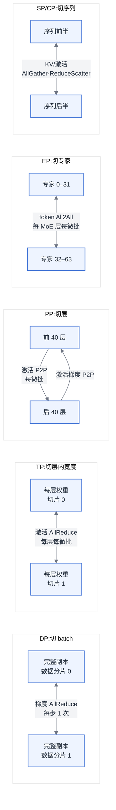
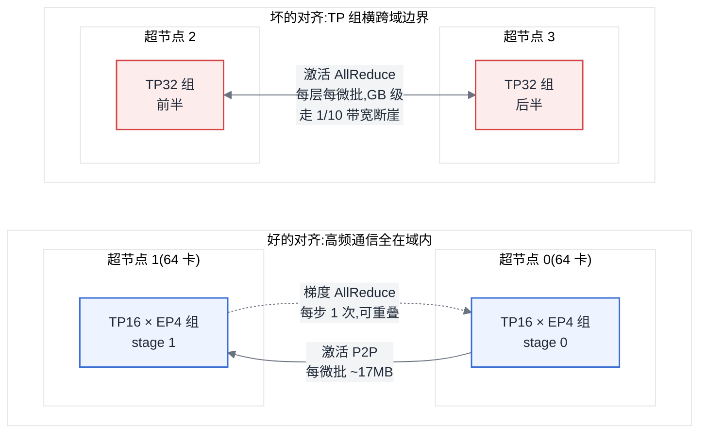
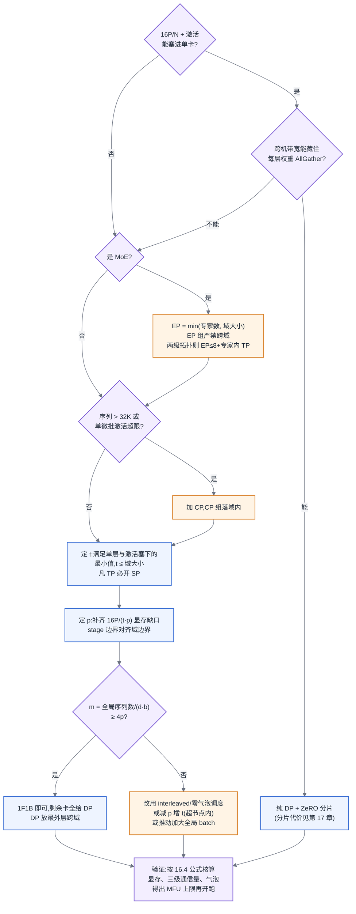

# 第 16 章 并行策略

## 16.1 链路定位

本章位于主线 A"一次训练任务的生命周期"中**前向 → 反向 → 梯度同步**这三段的正中央:并行策略决定了这三段各自在哪些卡上发生、卡与卡之间流动什么数据、以及每一步要为此支付多少通信与显存代价。数据读取与预处理(第 13 章)、checkpoint(第 14 章)在它两侧,显存压缩手段(第 17 章)与运行时实现(第 18 章)在它下游——并行策略选错了,下游做什么都是补救。

## 16.2 依赖声明

本章建立在三条前置结论之上:第 6 章的形状分析与资源换算(训练约 6N FLOPs/token、显存三分、MoE 的总参数/激活参数分离,见 [§6.2](../第一部分-基础与心智模型/第06章-模型结构的定量分析.md#62-参数量与资源换算核心)),第 7 章的三级拓扑结论(超节点把互联从"卡间/机间"两级改写为"卡间/域内/跨域"三级,域边界上存在带宽断崖),以及 [§4.2.1](../第一部分-基础与心智模型/第04章-硬件第一性原理、架构范式与数值精度.md#421-四类范式真正的差异在编译器) 的"编译器责任"结论(动态形状与路由类负载的难度取决于平台把调度权交给运行时还是编译器)。这些内容本章直接引用,不再重述。

## 16.3 问题场景:同样 256 张卡,吞吐差三倍

某公司训练一个 70B 稠密模型,256 张 80 GB 卡,32 台 8 卡机,机内高带宽互联、机间 RDMA。算法团队参考某开源项目的配置,直接抄了一组并行参数:张量并行 TP=16、流水线并行 PP=2、数据并行 DP=8。任务能跑起来,不 OOM,loss 正常下降,监控面板上 GPU"利用率"90% 以上。所有人都觉得没问题——直到平台侧按 [§6.2](../第一部分-基础与心智模型/第06章-模型结构的定量分析.md#62-参数量与资源换算核心) 的 6N 公式反算了一下 MFU:**11%**。同期另一个团队用同样的卡训同规模的模型,MFU 34%。同样的硬件、同样的模型、同样的框架,吞吐差了三倍,等价于 256 张卡里有 170 张在空转。

排查花了一周。第一周里团队先后怀疑过数据加载、NCCL 版本、机间网络丢包,全部排除。最后用 profiling(方法论见 [§5.4](../第一部分-基础与心智模型/第05章-CUDA、CANN与加速器软件栈.md#54-profiling-方法论全书唯一定义处))拿到时间线才看清:TP=16 意味着每个张量并行组横跨两台机器,而 TP 的 AllReduce 是**每层、每个微批**都要做的——最高频的通信被放在了最窄的链路上,每一层前向都在等跨机 AllReduce。抄来的配置出自一个机内 16 卡互联的集群,在那个拓扑上 TP=16 完全合理;搬到 8 卡机上,"利用率"指标依然好看(卡在忙着收发数据,SM 有活干),但有效算力塌了三分之二。

这个故事的教训不是"不要抄配置",而是:**并行策略不是模型的属性,是"模型 × 拓扑"的联合属性**。换一个互联拓扑,同一组并行参数可以从最优变成灾难。本章要给出的,就是让你不靠抄、自己算出来的那套方法。

## 16.4 原理与量化模型

### 16.4.1 五种切分维度:同一个模型的五种切法

一次训练迭代的总工作量可以写成一个四维张量:**(数据样本 batch,序列位置 seq,模型层 layer,层内参数/专家 width)**。五种并行策略,本质是各自沿其中一个维度把工作量切开:

- **数据并行(Data Parallelism,DP)**:沿 batch 维切。每张卡持有完整模型副本,吃不同的数据分片,反向结束后用 AllReduce 同步梯度。
- **张量并行(Tensor Parallelism,TP)**:沿 width 维切。把单层内的权重矩阵按行/列切开(形状分析见第 6 章),每层前向和反向都需要对激活做集合通信。
- **流水线并行(Pipeline Parallelism,PP)**:沿 layer 维切。把模型按层切成 p 段(stage),段与段之间用点对点(P2P)通信传递激活与激活梯度。
- **专家并行(Expert Parallelism,EP)**:MoE 模型专属,沿专家维切。不同专家放在不同卡上,token 经路由决定去向,用 All2All 把 token 分发到专家所在卡并取回结果。
- **序列并行(Sequence Parallelism,SP)**:沿 seq 维切。狭义 SP(Megatron 式)是 TP 的补充,把 TP 组内本来完整复制的激活(LayerNorm、Dropout 段)也按序列切开;广义的上下文并行(Context Parallelism,CP)则把注意力计算本身沿序列切开,用于超长上下文。

五种策略不是并列关系,而是一个"被迫升级"的序列。DP 是唯一不动模型本身的策略,只要模型塞得进单卡,它就是默认解;塞不进,才被迫沿 width、layer、专家维把模型本体切开——而**凡是切模型本体的策略,都会在计算的半途插入通信**,这是它们比 DP 昂贵得多的根本原因。切开的位置不同,插入通信的频率与内容也不同:TP 切在矩阵乘中间,所以每层都要缝合;PP 切在层与层之间,只在边界缝合;EP 切在路由之后,缝合的对象是 token 本身。理解了"切在哪里、就在哪里缝合"这一句,五种策略的通信公式(下一节)就不需要死记。

图 16-1:五种并行策略的切分维度对比。**每种策略切的维度不同,决定了它的通信内容与通信频率不同——频率才是选型时的第一排序键。**

### 16.4.2 通信量与显存收益:每种策略的账

选并行策略就是记两本账:**每步通信多少字节、每卡省下多少显存**。以下公式全部可手算。记号:P 为总参数量,L 为层数,h 为隐层宽度,b 为每卡微批内序列数,s 为序列长度,m 为每个流水线周期的微批数,t/p/d/e/c 分别为 TP/PP/DP/EP/CP 并行度,k 为 MoE 的 top-k,字节数按 bf16 通信取 2。

**DP。** 每步一次梯度 AllReduce。Ring AllReduce 下每卡收发总量:

> V_DP = 2 × (d−1)/d × G,其中 G = 本卡梯度字节数 = 2P/(t·p)

频率:**每步 1 次**,且可与反向计算逐层重叠。显存收益:0——每个 DP 副本都持有完整的模型状态。把优化器状态与梯度沿 DP 维分片是 ZeRO 的事,归第 17 章;本章只需记住:未分片的 DP 显存收益为零,通信最便宜。

**TP。** Megatron 式切法下,每层前向 2 次、反向 2 次 AllReduce,消息大小 M = b·s·h × 2 字节。每卡每微批的 TP 通信量:

> V_TP = 4 × 2(t−1)/t × M × L_local ≈ 8 × b·s·h × 2 × (L/p)

注意一个反直觉的性质:**每卡的 TP 通信量几乎与 t 无关**((t−1)/t 很快趋近 1),它正比于**这张卡承载的层数 L/p**。也就是说,把 TP 从 8 扩到 16 并不增加每卡通信量,但如果因此把 PP 从 4 减到 2,每卡层数翻倍,TP 通信量随之翻倍。这条性质在 16.4.5 讨论超节点时是关键。显存收益:权重、梯度、优化器状态 ÷t;激活值中矩阵乘部分 ÷t,LayerNorm/Dropout 段需开启 SP 才能 ÷t。频率:**每层每微批**——五种策略里最高频,所以 TP 必须放在带宽最高的互联域内,这是"TP 不跨机"这条经典经验的真正来源(以及它在超节点时代如何作废,见 16.4.5)。

"每层前向 2 次 AllReduce"这个数字值得拆开讲清楚,因为它决定了 SP 的由来。Megatron 式切法把每个子层里的两个连续矩阵乘配成一对:第一个乘法按**列**切——权重 [h, 4h] 切成 t 份 [h, 4h/t],输入 [b·s, h] 完整进入,输出 [b·s, 4h/t] 天然分片,**这一步不需要任何通信**;第二个乘法按**行**切——权重 [4h, h] 切成 [4h/t, h],恰好吃进上一步的分片输出,但得到的 [b·s, h] 是**部分和**:t 张卡各持有最终结果的一个加数,必须 AllReduce 相加之后才能进 residual 与 LayerNorm。Attention 子层完全同构:QKV 投影按头分组列切、输出投影行切,又是一次 AllReduce。所以"每层 2 次"不是设计选择,而是"列切与行切配对、把通信推迟到子层出口"这个方案的必然结果——一对矩阵乘之间零通信,代价是每个子层出口处一次全量缝合;反向沿同样的位置再来 2 次,凑成公式里的系数 4。

狭义 SP 改造的正是这个出口。AllReduce 之后的 LayerNorm/Dropout 段激活在 t 张卡上完整复制,存在冗余;SP 把每次 AllReduce 拆成 ReduceScatter(出子层时沿序列维散开,每卡只留 s/t 段)加 AllGather(进下一对矩阵乘前再收齐)。Ring 实现下,一次 AllReduce 的通信量恰好等于一次 ReduceScatter 与一次 AllGather 之和,所以**总字节数一个不多一个不少**;赚到的是中间这段激活从完整的 [b·s, h] 变成 [b·(s/t), h],LayerNorm/Dropout 的计算也顺带 ÷t——这就是下文"总通信量不变、纯赚显存"的机制来源。

TP 还有一条常被算例忽略的整除约束来自 GQA:注意力头按列切时,**KV 头数也必须能被 t 整除**。GQA 模型的 KV 头数远小于 Q 头数(例如 64 个 Q 头配 8 个 KV 头),t=8 时一卡一个 KV 头刚好;t=16 就必须把 KV 头复制到多张卡——框架一般支持复制,但 KV 投影参数与对应激活的显存收益从 ÷t 退化为 ÷KV 头数,核算显存时要用退化后的数字,而不是想当然的 ÷t。

**PP。** 每个 stage 边界每微批传一次激活(前向)和一次激活梯度(反向),启用 SP 后边界张量为 b·s·h/t × 2 字节。每卡每步:

> V_PP = 2 × m × b·s·h/t × 2 字节

这是五种策略里通信最便宜的:频率低(每微批一次)、消息小、且是 P2P 而非集合通信。代价不在通信量,在**气泡**(16.4.3)。显存收益:模型状态 ÷p;激活侧要注意 1F1B 调度下第一个 stage 需要同时缓存约 p 个微批的激活。

**EP。** 每个 MoE 层,token 要经历 dispatch 和 combine 两次 All2All,前向反向各一遍,共 4 次。每卡每 MoE 层每微批:

> V_EP = 4 × k × b·s·h × 2 × (e−1)/e ≈ 8k × b·s·h 字节

频率与 TP 同级(每 MoE 层每微批),且 All2All 对拓扑最敏感——它是多对多通信,跨越窄链路时退化最严重。另外要乘一个负载不均系数 α ≥ 1(专家热度不均导致最忙的卡决定整层时延,量化刻画见 [§6.3](../第一部分-基础与心智模型/第06章-模型结构的定量分析.md#63-结构变体的定量代价)):实际耗时 = 理想耗时 × α。显存收益:专家参数 ÷e,而专家参数在 MoE 模型中占总参数 90% 以上,所以 EP 是 MoE 显存问题的主要解法。

这"两次 All2All"是不对称的两段:**dispatch** 把每个 token 的隐向量按路由结果发往专家所在的卡,**combine** 把专家算完的结果按原路收回、按门控权重加权求和。两段之间夹着专家 FFN 计算,所以单个 MoE 层的关键路径是 dispatch → 专家计算 → combine 三段串行,想重叠只能把 token 再分块流水。容量因子(capacity factor)与这两段直接交互:每张专家卡为每层预留"容量 = k·b·s/e × 容量因子"个 token 的缓冲,路由超出容量的 token 被丢弃或走旁路直连,不足容量的部分**用 padding 填满**。这意味着容量因子偏大时,All2All 传的是真 token、专家算的却有一部分是 padding——通信量按实际路由计、计算量按容量计,两本账在负载不均时明显分叉,α 系数吃的正是这个差。无丢弃(dropless)方案改用变长缓冲,消掉 padding 浪费,代价是 All2All 的消息尺寸每步都在变,对编译器主导的平台恰好踩中 [§4.2.1](../第一部分-基础与心智模型/第04章-硬件第一性原理、架构范式与数值精度.md#421-四类范式真正的差异在编译器) 的动态形状难点——这是 MoE 迁移到静态图平台时最常见的第一个坑。

EP 与 DP 正交组合时还有一个容易配错的细节:**梯度同步组必须分两套**。EP 通常从 DP 维借卡(要求 e 整除 d),于是参数分成两类:非专家参数(attention、共享层、路由器)在全部 d 个副本上完整复制,梯度在大小为 d 的组里 AllReduce;每个专家只落在 e 个分片之一,但在 d/e 个副本上重复,梯度在大小为 d/e 的"专家数据并行组"里同步。两套进程组并存意味着梯度流量、优化器状态分片(第 17 章)、checkpoint 的切分与恢复(第 14 章)都要按参数类别分别处理。手工拼装框架时最典型的错误是把专家参数误放进全 d 组——各卡专家形状相同,AllReduce 不报任何错,却在把**不同专家**的梯度互相平均,loss 以缓慢劣化或平台期的形式"软报错",比崩溃难查一个数量级。

**SP/CP。** 狭义 SP 把 TP 的 AllReduce 拆成 ReduceScatter + AllGather,**总通信量不变**,纯赚激活显存(整段激活 ÷t),因此凡用 TP 必开 SP,这在 2026 年已没有争论余地。CP(如 Ring Attention 类方案)每卡每层沿环流转 KV 分块,通信量 ≈ 2 × b·(s/c)·h_kv × 2 × (c−1) 字节,收益是激活与 KV 显存 ÷c——它是长上下文训练把 s² 级激活压下来的唯一系统性手段。

CP 能成立的直觉是:注意力在序列维上并非不可切,难点只在"每个 query 要见到它之前的所有 KV"。Ring Attention 类方案让每卡固定持有自己那 s/c 段的 query,KV 分块沿环流转:第 0 步用本地 KV 算一块部分注意力,同时异步把本地 KV 发给下家、从上家收进下一块;c−1 步之后每个 query 见完了全部 KV,各块部分结果用 online softmax 的方式累积合并(与 flash-attention 分块累积是同一个技巧)。通信模式因此是**点对点环,而非集合通信**,且每一步的传输都可以藏在当步注意力计算后面——只要"单块 KV 传输时间 < 单块注意力计算时间"成立,CP 的通信近似免费;序列越长这个不等式越宽松,因为每步计算量 ∝ (s/c)² 而每步通信量只 ∝ s/c。另一个必须处理的问题是 causal mask 造成的负载不均:按自然顺序切,持有序列尾段的卡要算的注意力面积接近首段卡的 2c−1 倍,主流实现用头尾对折(zigzag)的分块方式把各卡面积拉平。排查 CP 作业时这是现成的判据:profiling 时间线上各卡注意力 kernel 时长接近,配置才算对;首尾卡时长呈阶梯状,就是没开对折分块。

把五种策略放进一张频率×消息量的排序表,选型的第一性原理就出来了:

| 策略 | 通信频率 | 每次消息量级 | 通信原语 | 显存收益 | 应放置的互联层级 |
|---|---|---|---|---|---|
| TP(+SP) | 每层每微批 | b·s·h | AllReduce/RS+AG | 状态与激活 ÷t | 最高带宽域内 |
| EP | 每 MoE 层每微批 | k·b·s·h | All2All | 专家参数 ÷e | 域内(超节点后) |
| CP | 每注意力层每微批 | b·s·h_kv | P2P 环 | 激活/KV ÷c | 域内 |
| PP | 每微批每边界 | b·s·h/t | P2P | 状态 ÷p | 可跨机 |
| DP | 每步一次 | 2P/(t·p) | AllReduce | 0(ZeRO 见第 17 章) | 最外层,可跨域 |

**所以这对做平台的人意味着什么:** 并行选型不需要背结论,只需要记住"通信频率 × 消息大小 ÷ 所在链路带宽"这一个分数。把高频通信放在高带宽链路上、低频通信放在低带宽链路上,90% 的选型错误(包括 16.3 那个三倍差距)都不会发生。

### 16.4.3 流水线气泡:量化与调度算法

PP 的通信便宜,但它引入了一种独特的浪费:**气泡(bubble)**——流水线灌满前和排空时,部分 stage 无事可做。气泡占比有精确公式。设 p 个 stage、每周期 m 个微批,前向与反向耗时之和为常数,则:

> 气泡率 = (p−1) / (m + p−1)

这条公式直接给出两条工程结论:**气泡随 p 线性恶化、随 m 增大而摊薄**。经验规则 m ≥ 4p 就是把气泡压到 20% 以下的最低门槛;想压到 5% 以下需要 m ≈ 20p。

主流调度算法的差异不在改变这条公式,而在改变"m 能开多大"和"p−1 前面的系数":

- **GPipe(全前向再全反向)**:实现最简单,但所有微批的激活要同时驻留,激活显存 ∝ m——m 开不大,气泡就压不下去。它的存在价值在 2026 年只剩教学。
- **1F1B(one-forward-one-backward)**:稳态时前向反向交替,激活驻留量从 m 个微批降到 p 个微批,**与 m 解耦**。气泡率公式不变,但 m 可以开到几十上百,气泡被摊薄。这是当前的默认调度。
- **Interleaved 1F1B(交错式)**:每卡持有 v 段不连续的层(虚拟 stage),气泡率降为 (p−1)/(v·m + p−1),代价是 P2P 通信量 ×v、实现复杂度显著上升。适合 m 开不大(全局 batch 受算法约束)但气泡又必须压的场景。
- **零气泡类调度(ZB 系)**:把反向拆成"对输入求梯度 B"与"对权重求梯度 W"两段,用 W 段填充气泡,理论上可把气泡压到接近 0。代价是显存峰值上升与调度器复杂度,以及对运行时的侵入性改造——自研训练框架慎入,用现成实现则值得开。

1F1B 与 interleaved 的显存差异可以用一个关系式统一看:**激活驻留 ≈ 在途微批段数 × 每段激活**。1F1B 下第 i 个 stage 稳态在途约 p−i 个微批(越靠前的 stage,发出的前向越多、等回的反向越久),最坏是首 stage 的 p 个;每段是 L/p 层,相乘 ≈ 恰好一整个模型深度(L 层)的单微批激活,**与 m 无关**——这就是"驻留与 m 解耦"的精确含义,也解释了为什么 16.4.2 说首 stage 要缓存约 p 个微批。Interleaved 把每卡的层拆成 v 个虚拟 stage,每段变薄(L/(p·v) 层),但为了让 v 段交错运转,首卡的在途段数升到约 (v+1)·p 个,相乘 ≈ (v+1)/v 倍于 1F1B 的驻留——v=2 时多约一半,v=4 时多约四分之一。**v 越大,气泡降得越多、额外驻留反而越小**,真正随 v 恶化的是通信:每微批每卡的 P2P 从 2 次变成 2v 次,消息大小不变(边界张量仍是 b·s·h/t),总字节 ×v;更要紧的是次数 ×v 把 P2P 从带宽问题变成延迟与调度问题——每次传输的固定开销(启动延迟、与计算流的抢占)被放大 v 倍,这正是 interleaved 在跨机 PP 上收益缩水的原因。实现上它还额外要求 m 是 p 的整数倍,给全局 batch 规划又加一条整除约束。

```mermaid
%%{init: {'theme':'base','themeVariables':{
  'primaryColor':'#EEF4FF','primaryBorderColor':'#3B6FD4','primaryTextColor':'#1F2937',
  'secondaryColor':'#F3F4F6','tertiaryColor':'#FFFFFF',
  'lineColor':'#6B7280','fontFamily':'-apple-system, Segoe UI, Helvetica, Arial, sans-serif','fontSize':'14px'
}}}%%
gantt
  title 朴素调度(m=4)与 1F1B(m=8,半尺寸微批)的时间轴对比(p=4,红色为气泡)
  dateFormat X
  axisFormat %s
  section 朴素 stage0
  前向×4          :a1, 0, 8
  气泡(等反向)   :crit, 8, 20
  反向×4          :a2, 20, 28
  section 朴素 stage3
  气泡(等灌入)   :crit, 0, 6
  前向×4          :b1, 6, 14
  反向×4          :b2, 14, 22
  气泡(已排空)   :crit, 22, 28
  section 1F1B stage0
  前向预热         :c1, 0, 4
  气泡(等首个反向):crit, 4, 7
  1F1B 稳态交替    :c2, 7, 19
  气泡(排空)     :crit, 19, 22
  section 1F1B stage3
  气泡(等灌入)   :crit, 0, 3
  1F1B 稳态交替    :d1, 3, 19
  气泡(排空)     :crit, 19, 22
```

图 16-2:朴素流水线与 1F1B 的时间轴对比(中间 stage 略,总 token 数相同)。**1F1B 并没有改变气泡率公式,它的贡献是把激活驻留与 m 解耦,让 m 可以开大——降气泡的从来是 m,不是调度名字。**

**所以这对做平台的人意味着什么:** 收到"流水线气泡大"的求助时,第一句话不是换调度器,而是问"m 是多少、p 是多少"。m < 4p 的作业,换任何调度算法都是扬汤止沸;先想办法加大全局 batch 或减小 p。

### 16.4.4 组合与搜索空间:先切什么、后切什么

真实作业是 t × p × d(× e × c)的组合,即所谓 3D/4D 并行。搜索空间看似是所有整除分解,实际上被三条约束砍到很小:

1. **显存约束定下界**:模型状态每参数约 16 字节(bf16 权重+梯度、fp32 优化器状态,见 [§3.2](../第一部分-基础与心智模型/第03章-人工智能与大模型基础.md#32-优化器与超参的-infra-含义)/[§6.2](../第一部分-基础与心智模型/第06章-模型结构的定量分析.md#62-参数量与资源换算核心)),16P/(t·p) 加上激活必须塞进单卡显存。这给出 t·p 的下界。
2. **拓扑约束定放置**:按 16.4.2 的频率表,TP/EP/CP 不得跨出高带宽域,PP 跨机,DP 最外。这决定 t ≤ 域大小。
3. **气泡约束定 p 上界**:m = 全局序列数/(d·b),要求 m ≥ 4p。

经验顺序因此是:**先定 t(域内、够用就好,不贪大),再定 p(补齐显存缺口),剩余全部给 d,MoE 模型在 t 之后先定 e**。"够用就好"的依据正是 16.4.2 那条性质:t 增大不省通信,p 减小反而增加每卡层数、推高 TP 通信量;t 的唯一使命是把"单层塞得下、单微批激活塞得下"这两件事办成。

还有两条容易被忽略的约束值得写进作业模板的校验逻辑里。其一是**整除约束**,完整清单比"t 整除头数"长得多,值得逐条列出:注意力头数 % t == 0(GQA 下还要看 KV 头数,见 16.4.2);FFN 宽度与词表大小 % t == 0(词表不整除时框架多以 padding 补齐,浪费可忽略但形状会变);层数 % p == 0(interleaved 下进一步要求 % (p·v));专家数 % e == 0 且 d % e == 0(EP 从 DP 借卡的前提);全局 batch %(d × 微批大小)== 0,即 m 必须是整数(interleaved 再叠加 m % p == 0)——梯度累积步数也藏在这条里,全局 batch = d × 微批大小 × 累积步数,三者联动,改任何一个都要重验。违反这些约束的报错形态分三档,危险程度递增:最好的一档是初始化时的断言直接拒绝启动,几秒内暴露;第二档是**改并行度续训时加载 checkpoint 报形状不匹配**——原配置能存、新配置读不回来,这类错误只在切换时刻爆发,容易被误判为 checkpoint 损坏(切分与恢复的正确做法见第 14 章);最危险的第三档是**能跑但悄悄慢**:p 不整除层数时多出的层堆给某个 stage,整条流水线跟着最慢的 stage 走,吞吐掉一截却没有任何报错,不做 profiling 永远发现不了。静态检查要拦的正是第三档。其二是**d 的下限**:d 太小会让全局 batch 依赖梯度累积拼凑,数据管道的并发吞吐(第 13 章)也随 d 缩小,DP 副本数低于数据管道的最小并发需求时,瓶颈会从计算移到 IO。搜索空间被这三层约束(显存、拓扑、整除)砍完之后,候选组合通常只剩个位数,逐一按 16.4.2 的公式核算即可,不需要自动化搜索;自动化搜索工具的价值在异构集群与 MoE 的大空间里才体现出来。

顺带回答一个必然会被问到的问题:并行配置看起来是个标准的搜索问题,自动并行(把切分决策交给编译器或求解器)的论文也确实能在中小规模上复现手工最优,为什么 2026 年的主流实践仍是手工配置?生产落地卡在三处。其一,**代价模型的保真度**:搜索依赖"给定切分算出耗时"的代价模型,而真实耗时里的通信-计算重叠比例、All2All 的负载不均系数 α、网络拥塞都难以静态建模——代价模型偏差 20%,搜出来的"最优"就可能不如手工次优;逐个候选实测又太贵,大规模作业启动一次以分钟计,搜索预算烧的是真卡时。其二,**约束把空间砍小了**:显存、拓扑、整除三层约束过完,常规稠密模型的候选只剩个位数,人肉枚举成本本来就低,自动化的边际收益薄;真正的大空间(异构集群、MoE 多维组合、逐层异构切分)又恰恰是代价模型最不准的地方——搜索最有用的场景和搜索最不可信的场景高度重合。其三,**可排查性**:手工配置慢了,按 16.4.2 的公式拆账能定位到哪一级通信;求解器给出的逐层异构方案一旦不达预期,没人能解释为什么,平台侧也无法把它固化成可校验的模板。所以现状是分工而非替代:自动化工具当**校验器与建议器**用——算显存、核对约束、给候选排序,最终拍板与兜底责任仍在人。这与本章"手算三本账"的方法论不冲突,它就是这套方法论的自动化形态。

**所以这对做平台的人意味着什么:** 把"t·p 显存下界、t ≤ 域大小、m ≥ 4p、三条整除"做成作业提交时的静态检查,拦截的是最昂贵的一类错误——能跑但慢的配置。OOM 会立刻报错,而 16.3 那种慢三倍的作业会安静地烧一个月的卡。

### 16.4.5 超节点如何改写并行选型【本章重点】

第 7 章给出的结论是:超节点(scale-up 域扩展到数十至数百卡)把互联从两级变成"卡间/域内/跨域"三级,域内带宽与跨域带宽之间有 5–10 倍的断崖。这个硬件事实对并行选型的改写是结构性的,不是参数微调:

**第一,"TP 不跨机"作废,替换为"TP 不跨域"。** 经典经验"TP ≤ 8"从来不是 TP 的性质,而是"机内 8 卡"这个拓扑的性质。当域扩到 64 卡甚至更大,TP=16/32 完全可行。但要警惕把"可行"读成"应该":由 16.4.2,每卡 TP 通信量 ∝ L/p,用大 TP 换小 PP 会推高 TP 通信。稠密模型在 m 充足时,超节点上的最优 t 往往仍然不大——超节点给的是**选项**,不是新的默认值。真正需要动用大 TP 的场景是:单层塞不下(超大 h 或超大词表层)、m 被算法锁死开不大导致气泡压不住、或超长序列下单微批激活过大。

**第二,MoE 的 All2All 从跨机瓶颈变成域内操作,EP 可行规模大幅上移。** 这是超节点最大的红利。All2All 是多对多通信,在两级拓扑下 EP > 8 意味着流量的 (e−8)/e 走跨机窄链路,这曾把 EP 实际可行规模锁在 8–16;64 卡域直接把 EP 上限抬到 64——64 专家的模型可以一专家一卡,专家内部不再需要再切 TP,实现和负载均衡都大幅简化。量化对比见 16.4.8 算例的第二部分。

**第三,长序列训练的 CP 获得了真实的生存空间。** CP 的环形 KV 通信量正比于 (c−1),两级拓扑下 c > 8 就要跨机,超长上下文训练因此长期被迫用重算和 offload 硬扛激活(代价见第 17 章);域扩大后 c=16/32 的环整个落在域内,百万 token 级上下文的训练从"特种工程"降级为"常规配置"。这一条常被超节点宣传材料忽略,但对做长上下文的团队,它与 EP 红利同等重要。

**第四,并行切分与域边界的对齐规则。** 超节点时代,选型多了一条硬约束:**高频通信组必须整组落在域内**。具体规则:

- t × c ×(EP 组内的 t)的乘积组尽量整除域大小,且任何一个 TP/EP/CP 组不得横跨域边界;
- PP 的 stage 边界优先落在域边界上——P2P 通信便宜,是唯一适合放在断崖上的流量;
- DP 放最外层,跨域的梯度 AllReduce 每步只有一次且可与反向重叠,是断崖的第二顺位使用者;
- 全局 batch 规划时保证 m ≥ 4p 仍然成立。

图 16-3:并行切分与域边界的对齐。**同样的总通信量,放在域边界的哪一侧,耗时差一个数量级——对齐规则的本质是把"每层每微批"级的流量关进域内,只放"每微批"与"每步"级的流量过断崖。**

这些规则不是新原理,仍然是 16.4.2 那张频率表在三级拓扑上的投影;新的是**违反成本**。两级拓扑下把 TP 切到 16,好歹还能跑(慢三倍);三级拓扑下一个 EP=64 的 All2All 组横跨两个超节点,断崖两侧 5–10 倍的带宽差会被 All2All 的多对多模式进一步放大,作业可能直接慢到看起来像 hang——排查时又极易被误判为网络故障(网络故障的真实表现形式见第 7 章)。对齐做对了,超节点是红利;做错了,它比传统集群更能放大错误。

**所以这对做平台的人意味着什么:** 超节点采购进来之后,平台要做的第一件事是把域大小、域内/跨域带宽写进调度器与作业模板的约束里(拓扑感知调度见第 8 章),让"TP/EP 组不跨域"成为默认强制而不是用户自觉;第二件事是把调度粒度对齐到域——碎片化分配(一个作业拿到 3 个半超节点)会让对齐规则无解可满足。同时要意识到代价:域越大,一次域级故障带走的卡越多,故障域随互联域同步放大(展开见第 20 章)。

### 16.4.6 变长与异构负载下的并行

以上模型都默认 b·s 是常数,真实数据不是。两类问题必须处理:

**变长序列与 padding 浪费。** 把长短不一的序列 pad 到 batch 内最大长度,浪费率 = 1 − 平均长度/最大长度。真实 SFT 数据集长度分布长尾,浪费率 30%–60% 是常态——这比任何并行选型失误都昂贵。解法是 **sequence packing**:把多条短序列拼进一个固定长度窗口,配合块对角 attention mask 避免跨样本注意力。packing 之后每个微批的 token 数恒定,顺带解决了 PP 各微批计算量不均导致的隐性气泡。packing 属于数据管道的职责(第 13 章),但**平台必须把"packing 后的等效 token 数"作为吞吐口径**,否则 MFU 核算全错。

**异构结构的并行组合。** 多模态模型的 encoder 与 decoder 资源画像完全不同(定量画像见 [§6.4](../第一部分-基础与心智模型/第06章-模型结构的定量分析.md#64-多模态的定量画像)):视觉 encoder 参数小、计算密、形状随分辨率变化;LLM decoder 参数大、结构规则。给二者套同一组并行参数是常见错误——encoder 参数塞单卡绰绰有余,却被迫跟着 decoder 做 TP,通信白付;更隐蔽的是把 encoder 塞进流水线的第一个 stage,图文比例一波动,该 stage 的计算量就随之波动,整条流水线跟着最慢的微批走,气泡率公式里那个整齐的 (p−1)/(m+p−1) 在异构负载下只是下界。正确做法是**分别选型**:encoder 用纯 DP(或小 TP),decoder 用 TP+PP,两段之间做一次激活的重分布(resharding);数据管道侧配合按图文比例做微批均衡,把每个微批的总计算量拉平。这引出 [§4.2.1](../第一部分-基础与心智模型/第04章-硬件第一性原理、架构范式与数值精度.md#421-四类范式真正的差异在编译器) 的编译器责任结论:这种"一个作业内两套并行策略 + 中间重分布 + 动态形状"的灵活性,在运行时主导的平台(GPU)上是工程问题,在编译器主导的平台上则可能是能力边界问题——图编译要求形状尽量静态,变长与动态路由恰好处处动态。选国产算力或 TPU 类平台跑多模态训练前,必须先用真实数据分布验证这条路径,而不是用等长合成数据跑通即宣布可行(生态评估维度见 [§12.7](../第二部分-算力底座/第12章-国产算力平台与异构迁移.md#127-生态作为选型变量全书唯一定义处))。

**所以这对做平台的人意味着什么:** 变长与异构负载的并行问题,一半的解法在数据管道而不在并行配置里。平台如果只提供并行参数模板、不提供 packing 与微批均衡的标准件,业务方会用最大 padding 把问题藏进"正常运行"的作业里,浪费无从归因(利用率归因体系见第 11 章)。

### 16.4.7 并行原语在各框架中的映射

并行策略是概念,框架是载体。只给映射关系(机制差异的展开是第 18 章的事):

| 并行概念 | Megatron-Core 系 | DeepSpeed 系 | PyTorch 原生(FSDP2/DTensor) | 昇腾(MindSpeed 系) |
|---|---|---|---|---|
| 并行组管理 | 初始化时按 t/p/d/e/c 建进程组 | 引擎配置声明 | DeviceMesh 多维网格 | 沿用 Megatron 组模型 |
| DP | DDP 梯度桶 | ZeRO 各阶段(见第 17 章) | FSDP2 分片 + replicate 维 | DDP/ZeRO 对应实现 |
| TP+SP | 内建列/行切分与 SP 开关 | 需借 Megatron 或自实现 | DTensor 分片布局表达 | 内建,含亲和优化 |
| PP | 内建 1F1B/interleaved 调度 | 独立 pipeline 引擎 | 调度库尚在演进,最弱项 | 内建,含自研调度变体 |
| EP | 专家并行组 + All2All | MoE 专用引擎 | DTensor 可表达、生态未收敛 | 内建,对接 HCCL All2All |

读表方式:凡是"内建"的组合,叠加时由同一个运行时统一编排,风险低;凡是跨框架拼装的组合(如 DeepSpeed ZeRO + 外部 TP),显存归属和通信流重叠都可能打架——这类冲突的具体形态见第 18 章。另外注意一个趋势判断:PyTorch 原生路线正在用 DeviceMesh + DTensor 把五种并行统一成"多维设备网格上的分片布局"这一个抽象,本章的 t/p/d/e/c 恰好就是网格的各个维度——这意味着本章的选型方法不会随框架更替失效,变的只是把结论填进哪个配置项。平台侧做作业模板时,应当以"并行维度向量 + 域对齐约束"为接口,而不是绑定某个框架的配置格式。

### 16.4.8 完整选型算例

**任务:** 70B 稠密模型,L=80,h=8192,s=8192,全局 batch 512 条序列(约 420 万 token/步)。**集群:** 256 张 80 GB 卡。算例假设:域内有效带宽 300 GB/s,跨机 RDMA 有效带宽 40 GB/s,单卡有效算力按 400 TFLOPs 计(带宽与算力的真实取值随硬件代际变化,方法不变)。

**第一步,显存下界定 t·p。** 模型状态 = 70e9 × 16 B = 1120 GB,单卡塞不下,必须模型并行。要求 1120/(t·p) + 激活 ≤ 80 GB,取 t·p = 32 → 状态 35 GB/卡。

**第二步,拓扑定 t。** 传统 8 卡机:t ≤ 8。取 **t=8(开 SP),p=4,d=256/32=8**。

**第三步,验证激活。** 每层每微批(b=1,flash-attention 下系数取 34)激活 ≈ 34·s·h ≈ 2.28 GB,÷t=8 后 285 MB;每 stage 20 层 → 5.7 GB;1F1B 首 stage 驻留 p=4 个微批 → 22.8 GB。35 + 22.8 ≈ 58 GB,留 20 GB 余量给通信缓冲与碎片,不开重算也能过,紧张时上选择性重算兜底(代价核算见第 17 章)。

**第四步,算气泡。** 每 DP 副本每步 512/8 = 64 个微批,m=64:气泡率 = 3/67 ≈ **4.5%**。

**第五步,算通信。** 每卡每微批计算量 = 6 × 70e9 × 8192/32 ≈ 1.07e14 FLOPs → 267 ms。三笔通信:
- TP:4 次 AllReduce/层 × 2×(7/8) × 134 MB × 20 层 ≈ 18.8 GB/微批,域内 300 GB/s → 63 ms,占计算 23%;按与计算重叠一半计,净开销 **~12%**;
- PP:边界张量 134/8 ≈ 17 MB/微批,跨机 40 GB/s 下 <1 ms,忽略;
- DP:梯度 4.375 GB/卡 × 1.75 ≈ 7.7 GB,跨机 40 GB/s → 191 ms/步,对 17 s 的步时占 1.1%,与反向重叠后近零。

**第六步,MFU 上限。** 步时 ≈ 64 × 267 ms ×(1+12%)/(1−4.5%) ≈ 20.0 s。有效计算占比 ≈ 85%;设 kernel 效率(400/峰值 1000 TFLOPs)= 0.40,则 **MFU 上限 ≈ 0.40 × 0.85 ≈ 34%**,集群吞吐 ≈ 21 万 token/s。这就是 16.3 中第二个团队的数字来源;而 TP=16 跨机方案把 63 ms 的域内通信换成近十倍的跨机耗时,MFU 塌到 11% 毫不意外。

把六步收拢成一句核算口径:**MFU 上限 = kernel 效率 ×(1 − 气泡率)×(1 − 未重叠通信占比)**。三个因子分别由算子实现、m/p 配比、并行放置决定,责任也随之三分:kernel 效率归算子与运行时(第 18、22 章),后两个因子归并行选型——也就是本章。业务方拿着 11% 的 MFU 来找平台时,先按这个乘式拆因子,再决定该找谁,而不是笼统地"优化一下"。

**第七步,换超节点重算(64 卡域 × 4)。** 稠密 70B:t=16/p=2 方案每卡层数翻倍,TP 通信升到 40 GB/微批(134 ms,占 50%),气泡收益仅 3 个点——**不划算,维持 t=8/p=4,唯一变化是 4 个 stage 全落同域,配置更简单**。这是一个有观点的结论:超节点不会让稠密中模型的选型翻天。真正翻天的是 MoE:同集群改训 64 专家、top-2 的 MoE(每 MoE 层 All2All 每卡每微批 ≈ 4 × 2 × 134 MB ≈ 1.07 GB)。两级拓扑下 EP=64 需 7/8 流量跨机:0.94 GB ÷ 40 GB/s ≈ 23 ms/层,60 个 MoE 层就是 1.4 s/微批,是计算的 5 倍——**跨机 EP=64 直接不可行**,只能 EP=8 + 专家内 TP,实现复杂且负载难均衡。64 卡超节点上同样的流量走域内:3.6 ms/层 × 60 ≈ 0.21 s,与计算同量级且可交错——**EP=64、一专家一卡成为首选**。EP 可行规模从 8 抬到 64,这就是"超节点改写并行选型"最实在的一笔账。

## 16.5 方案对比与失效边界

针对 16.4.8 的 70B/256 卡任务,三个真实可选方案:

**方案 A:纯 DP + ZeRO-3 全分片(FSDP 类)。** 状态 1120/256 ≈ 4.4 GB/卡,无 TP/PP,实现最简单,对模型代码零侵入。代价:每层前反向都要跨全体 AllGather 权重,通信频率被抬到 TP 级、却走在跨机链路上。**失效边界:** 跨机带宽不足以在计算时间内藏住权重 AllGather 时(粗判:每层权重字节/跨机带宽 > 每层计算时间即危险);模型大到 16P/N 塞不下或单层激活超限时;以及 N 上千后 AllGather 参与方过多、长尾效应放大时。它是 ≤13B 模型或高带宽小集群的正解,是 70B/256 卡的将就解。

**方案 B:TP8 + PP4 + DP8 经典 3D(16.4.8 所选)。** MFU 上限 34%,各项开销均衡。**失效边界:** m < 4p 时气泡失控(全局 batch 被算法压小的场景);变长负载未 packing 时 stage 间计算不均产生隐性气泡;模型换成 MoE 后 EP 与 PP 的组合复杂度陡增;以及它对训练代码的侵入性——模型结构必须按 Megatron 式切法改写,自研结构接入成本高。

**方案 C:超节点大域方案(大 TP 或大 EP)。** 稠密模型下用 t=16/32 消掉 PP、消掉气泡;MoE 下用域内 EP=64。**失效边界:** 稠密模型 m 充足时,大 TP 的通信增量超过气泡收益(16.4.8 第七步已算),纯属浪费;域内带宽虽高但不是无限,TP 通信 ∝ 每卡层数的规律在域内同样成立;故障域随并行域放大,一台超节点故障即损失 64 卡(见第 20 章);采购粒度与成本约束见第 31 章。它是 MoE 与长序列的改写者,不是稠密模型的免费午餐。

三个方案没有全局赢家:A 赢在工程成本,B 赢在均衡吞吐,C 赢在 MoE/长序列的可行性。还值得点名一个第四选项作为反面参照——**方案 D:PP 重型方案(大 p + interleaved,小 t 甚至无 t)**,它在跨机带宽极差的集群上是无奈的正解(PP 是唯一便宜的跨机通信),失效边界是全局 batch:m ≥ 4p 在 p=16/32 时要求几百个微批,batch 开不到就被气泡吃死;它同时把首 stage 的激活驻留推高 p 倍,常常反过来逼出激活重算。2026 年还在新集群上主动选 D 的,基本都是在为当年省下的网络预算补课——互联省下的钱,会以 MFU 的形式加倍还回去,这笔账在采购阶段就该算(见第 31 章)。

平台的职责不是替业务选定某一个方案,而是把四者的失效边界做成作业提交时的自动检查:16P/N 超限即拦 A,m < 4p 即警告 B/D,TP/EP 组跨域即直接拒绝——让错误配置在提交时失败,而不是在账单上失败。

## 16.6 大数据对照

**数据并行是 MapReduce 的直系后代。** 按数据分片、每个 worker 跑同样的逻辑、结果做一次全局归并——DP 的骨架和 MapReduce 完全同构,梯度 AllReduce 对应 shuffle+reduce,"数据本地性"的思想也原样复用成了本章的"通信本地性/域对齐"。做过 Spark 调优的人对"把 shuffle 流量从跨机架压回机架内"毫无陌生感,这部分经验**直接复用**。

但有一条根本差异让大半套大数据容错经验失效:**同步语义**。MapReduce 的 reduce 对 map 完成顺序无要求,慢任务可以推测执行(speculative execution)、失败任务单独重跑;而 DP 的梯度 AllReduce 是 BSP 式全局同步,每步所有副本必须到齐,一个 straggler 拖慢全体,一张卡失败全局停摆(这正是第 1 章"故障容忍模型失效"在训练链路上的具体形态,也是第 20 章容错体系存在的原因)。推测执行在这里不仅无效,而且语义上不成立——梯度不能"选先跑完的那份"。

**模型并行在大数据时代没有对应物,这不是巧合。** 大数据的算子(map、filter、join)是数据密集、状态轻的:单条记录的处理逻辑本身塞进任何一台机器都绰绰有余,需要切分的只有数据。所以整个大数据体系只发明了"数据分片 + 重分区(shuffle)"这一种并行,从不需要把**一个算子的内部**切到多台机器上。TP/PP/EP 的出现,是因为大模型第一次让"处理逻辑本身"(权重)大到单设备装不下——切开算子内部,就必须在每层计算的半途做通信,这种"计算与通信每层交替"的模式在 Hadoop/Spark/Flink 里从未存在过。硬要找对应物,PP 勉强像流式系统的算子链(operator chaining),但 Flink 的算子间传的是记录流、无全局同步;PP 传的是激活张量、且被反向传播锁死成前后两次穿越。

还有一条经验的迁移值得单独点出:大数据时代"shuffle 是最贵的操作、能不 shuffle 就不 shuffle"这条铁律,在本章换了一种形式存活——**能用低频通信解决的,不用高频通信;能在域内解决的,不出域**。当年为省一次 shuffle 重写 join 顺序的功夫,今天花在为省一级 TP 而调整 t/p 配比上,思维方式完全同构。**结论:** 从大数据转来的工程师,DP 与通信本地性可以靠直觉,TP/PP/EP 的代价核算必须靠本章的公式——直觉在这里没有存货。

## 16.7 选型决策树

图 16-4:并行策略选型决策树。**每个分支的判断条件都是可计算的数字而非感觉;走到叶子不算完,必须回到 16.4 的公式核算一遍 MFU 上限——决策树给的是候选,公式给的才是结论。**

---

读完本章,你应当能:给定模型规模、卡数与互联拓扑(含域大小与域内/跨域带宽),独立写出一组并行配置(t、p、d、e、c 与微批数 m),手算出每卡显存占用、每步三级通信量与气泡率,并据此给出该配置的 MFU 上限;能判断一个现有作业的并行切分是否与域边界对齐,并对"同卡数吞吐差数倍"的作业在一天内定位到具体是哪一级通信或气泡吃掉了算力。
